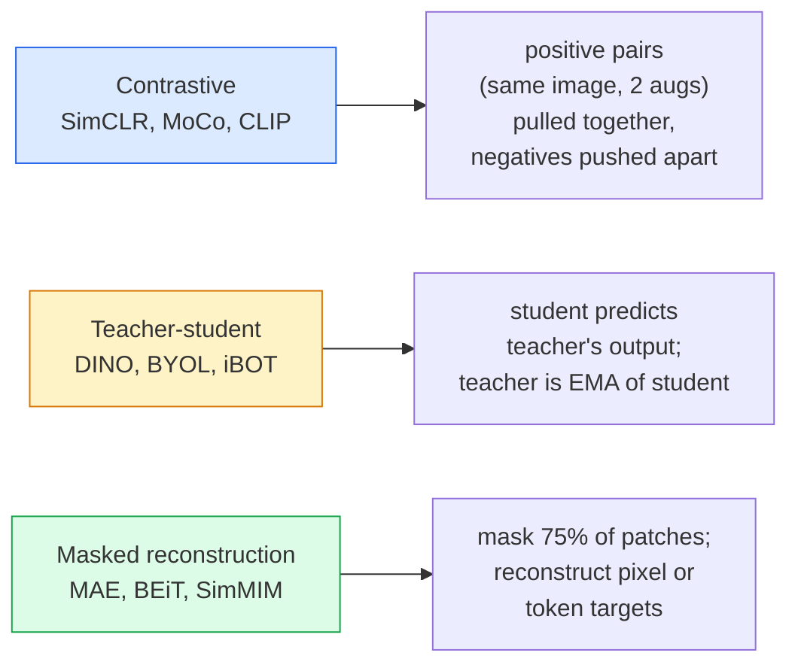

# 视觉自监视视觉 视觉自监视视觉 视觉自监视视觉 视觉自监视视觉

> 标签是监督视觉的瓶. 自主监督预训练消除了它们:从100万个未标记的图像中学习视觉特征,

> **【中文解读】**标签是监督学习的瓶──自监督预训消除了这个限制:从100亿张无标签图像中学习视觉特征,然后在1万张标签图像上微调──三种主流方法:SimCLR(对比学习)、DINO(自蒸)、MAE(掩码自编码器)──

> **【拓展：自监督学习是 GPT 的秘密】**在视觉领域,MAE 通过预测被遮盖的补丁来学习,DINO 通过自蒸学习语义特征――DINOv2 已成为许多视觉任务的基础模型――

**Type:** Learn + Build | **类型:** 学习 + 动手
**Languages:** Python | **语言:** Python
**Prerequisites:** Phase 4 Lesson 04 (Image Classification), Phase 4 Lesson 14 (ViT) | **前置知识:** Phase 4 Lesson 04（图像分类），Phase 4 Lesson 14（ViT）
**Time:** ~75 minutes | **时间:** ~75 分钟

## 学习目标

- 追踪三个主要的自我监督家庭:对比性 (SimCLR),教师-学生 (DINO),面具重建 (MAE) ,并说明每个家庭都优化什么
- 实施InfoNCE损失从零开始,并解释为什么512批成功,但32批失败
- 解释为什么MAE的75%隐藏比不任意,以及它与BERT的15%对文本的不同
- 使用DINOv2或MAE ImageNet检查站进行线性探测和零射击检索

> **【中文解读】**学习目标列出了课程完成后应掌握的核心能力.建议在开始学习前先浏览目标,学习完后对照检查是否已实现.


## 问题 问题引入

监督图像网有1300万个标记图像,这些图像的标记成本估计为1000万美元.医疗和工业数据集较小,标记成本更高.每个视觉团队都问:我们可以预训练低成本的无标记数据吗?

> 监督式图像网有1.3亿标签图像,估计标签成本为1000万美元――医疗和工业数据集较小,标签成本更高――每个视频团队都在问:我们能否在廉价的未标签数据上进行预训练?

现代的自主监督 ViT 在LAION或JFT上训练,在调整时达到或超过监督的ImageNet精度.它还更好地转移到下游任务 (检测,细分,深度) 比监督的预训练.DINOv2 (Meta, 2023) 和MAE (Meta, 2022) 是可转移视觉功能的当前生产默认.

> 自监督学习就是答案――在LAION或JFT上训练的现代自监督 ViT 微调后达到或超过监督式 ImageNet 准确率――它也向下游任务 (检测,分分,深度) 的迁移优于监督预训练――DINOv2(Meta,2023) 和 MAE(Meta,2022) 是可迁移视觉特征的当前生产默认选择――

概念转变是,借口任务 模型训练要做的事情 不必是下游任务. 重要的是,它迫使模型学习有用的特性. 预测灰色图像的颜色,旋转图像,并要求模型分类旋转,掩盖补丁并重建它们都成功了. 对于此,三种方法是对比性学习,教师与学生蒸,

> 概念上的转变是前置任务模型被训练做的事情不必是下游任务――重要的是它迫使模型学习有用的特征――预测图像的灰度颜色、旋转图像并让模型分类旋转、掩盖块并重建所有这些都是有效的――三种可扩展方法是对比学习、教师-学生蒸和掩盖重建――

## 概念的核心概念

> **【中文解读】**本节介绍核心概念和理论基础.掌握这些概念是后续动手实现的前提,同时也是面试和工程实践中高频考察的知识点.


### 三个家庭



### 对比学习 (SimCLR)

通过同一个编码器加上投影头,减少说"这两个嵌入应该接近"和"这个嵌入应该远离每个其他图像的嵌入".

> 取一张图像,施加两种随机增强,得到两种视图. 通过同一编码器加投影头,将两种视图进行最小化.

```
Loss for positive pair (z_i, z_j) among 2N views per batch:

   L_ij = -log( exp(sim(z_i, z_j) / tau) / sum_k in batch \ {i} exp(sim(z_i, z_k) / tau) )

sim = cosine similarity
tau = temperature (0.1 standard)
```

这就是InfoNCE损失.它需要每一个正数的许多负数,所以批量大小很重要. SimCLR需要512-8192.

> 这就是InfoNCE损失. 它需要每一个正确的样本应对许多负面样本,所以批量大小很重要.

### 教师-学生 (DINO)

学生和老师:两个网络具有相同的架构.老师是学生的体重的指数动平均值 (EMA).两个都看到图像的增强视图.学生的输出训练以匹配老师的没有明确的负面.

> 两个相同结构的网络:学生和教师――教师权重指数移动平均) 来自学生权重――两者都看到图像的增强视图――学生的输出被训练来匹配教师的没有明显的负面样本――

```
loss = CE( student_output(view_1),  teacher_output(view_2) )
     + CE( student_output(view_2),  teacher_output(view_1) )

teacher_weights = m * teacher_weights + (1 - m) * student_weights   (m ≈ 0.996)
```

为什么"预测常数"不崩:教师的输出是集中 (减减每维度平均值) 和磨损 (分为小温度).中心化防止一个维度主导;磨损防止输出崩到均.

> 为什么不会塌为"预测常数":教师的输出经历中 (减去每维平均值) 和化 (减去小温度) 化防止某个维度主导;化防止输出塌为均分布

根据DINOv2的扩展,DINOv2在142万个策划图像上进行了扩展.

> 是DINOv2的基础,在142亿张精选图像上扩展.

### 面具重建 (MAE)

掩盖VIT输入的 75%的补丁.通过编码器传输只可见的25%.一个小的解码器在掩盖位置接收编码器的输出加上面具代币,并被训练重建掩盖补丁的像素.

> 掩盖VT 输入的75% 补丁. 只有25% 通过编码器. 一个小解码器接收编码器输出加上掩码位置的掩码代币,训练重建被掩盖补丁的像素.

```
Encoder:  visible 25% of patches -> features
Decoder:  features + mask tokens at masked positions -> reconstructed pixels
Loss:     MSE between reconstructed and original pixels on masked patches only
```

让MAE工作的关键设计选择:

> 为了使MAE 生效的关键设计选择:

- **75% mask ratio**高.强迫编码器学习语义特性;重建25%将是几乎无关紧要的 (邻近的像素是相对的,以至于CNN可以钉它).
  翻译: 中文**75% 掩码率**很高. 迫使编码器学习语义特征;重建25% 几乎是平凡的.
- **Asymmetric encoder/decoder**大型ViT编码器只能看到可见的补丁;一个小型的解码器 (8层,512层) 处理重建.比天真BEiT快3倍的预训练.
  翻译: 中文**非对称编码器/解码器**大型VIT编码器只看可见补丁;小型解码器(8层,512维) 处理重建――比朴素BEIT 预训练快3倍――
- **Pixel-space reconstruction target**比BEiT的标记目标更简单,并且在ViT上更有效.
  翻译: 中文**像素空间重建目标**比比特的代币化目标更简单,在维特上效果更好.

训练前,放弃解码器.

> 预训练后丢弃解码器――编码器就是特征提取器――

### 为什么75%而不是15%

密码是15%,MAE是75%. 信息密度是区别.

> 含量在信息密度中.

- 预测15%的代币仍然很难,因为每个隐藏的位置都有许多可行的完成.
  中文翻译:自然语言每个代币的很高.预测 15% 的代币仍然困难,因为每个被掩盖的位置有很多合理的补充.
- 图像补丁具有低值.一个未掩盖的邻居通常几乎准确地确定了掩盖补丁的像素.
  中文翻译:图像补丁的低未掩盖的邻域通常几乎完全决定了被掩盖补丁的像素――要使预测需要语义理解,必须激进地掩盖――

75%是足够高的,以至于简单的空间外分不能解决任务;编码器必须代表图像内容.

> 75%高到简单的空间外推无法解决任务;编码器必须表示图像内容.

### 线性探测评估

经过自我监督的预训,标准评估是**linear probe**通过将编码器结,将单个线性分类器放在图像网标签上.

> 自监督预训练后,标准评估是**线性探测**编码器,在图像网标签上训练单个线性分类器――报告前一准确率――

- 升级率: 低于50%
- 子子子子子子子子子子子子子子子子子子子子子子子子子子子子子子子子子子子子子子子子子子子子子子子子子子子子子子子子子子子子子子子子子子子子子子子子子子子子子子子子子子子子子子子子子子子子子子子子子子子子子子子子子子子子子子子子子子子子子子子子子子子子子子子子子子子子子子
- 果果果果果果果果果果果果果果果果果果果果果果果果果果果果果果果果果果果果果果果果果果果果果果果果果果果果果果果果果果果果果果果果果果果果果果果果果果果果果果果果果果果果果果果果果果果果果果果果果果果果果果果果果果果果果果果果果果果果果果果果果果
- 酸 (酸) 含量:

线性探测器是特征质量的纯度衡量;细调通常增加2-5个点,但也会产生头部重训效果.

> 线性探测是特征质量的纯度;微调通常增加2-5个百分点,但也混合了重训头的效果.

> **【拓展：工业部署中的视觉系统】**在实际工业部署中,视觉模型需要考虑推迟模型大小的边缘设备适应等问题.

> **【拓展：数据标注与质量】**视觉任务的效果高度依赖标签数据质量――标签工作室、CVAT是主流标签工具――在工业场景中,主动学习(主动学习) 可以减少标签成本:模型对不确定的样本请求人工标签,确定性的样本自动标签――


## 建立它,实现它.

> **【中文解读】**本节通过代码实现从零到核心算法――这种"从零开始"的方式可以帮助理解框架背后的原理,遇到问题时不会被黑盒困住――

```figure
data-augmentation
```

## 建立它

### 步骤1:双视图增强管道

```python
import torch
import torchvision.transforms as T

two_view_train = lambda: T.Compose([
    T.RandomResizedCrop(96, scale=(0.2, 1.0)),
    T.RandomHorizontalFlip(),
    T.ColorJitter(0.4, 0.4, 0.4, 0.1),
    T.RandomGrayscale(p=0.2),
    T.ToTensor(),
])


class TwoViewDataset(torch.utils.data.Dataset):
    def __init__(self, base):
        self.base = base
        self.aug = two_view_train()

    def __len__(self):
        return len(self.base)

    def __getitem__(self, i):
        img, _ = self.base[i]
        v1 = self.aug(img)
        v2 = self.aug(img)
        return v1, v2
```

每个__getitem__返回相同图像的两个增长视图;没有需要标签.

> 每次`__getitem__`返回同一图像的两个增强视图;不需要标签.

### 步骤2:InfoNCE损失

```python
import torch.nn.functional as F

def info_nce(z1, z2, tau=0.1):
    """
    z1, z2: (N, D) L2-normalised embeddings of paired views
    """
    N, D = z1.shape
    z = torch.cat([z1, z2], dim=0)  # (2N, D)
    sim = z @ z.T / tau              # (2N, 2N)

    mask = torch.eye(2 * N, dtype=torch.bool, device=z.device)
    sim = sim.masked_fill(mask, float("-inf"))

    targets = torch.cat([torch.arange(N, 2 * N), torch.arange(0, N)]).to(z.device)
    return F.cross_entropy(sim, targets)
```

在调用之前,将L2嵌入正常化. `tau=0.1`低的值使损失更为明显,需要更多的负值.

> 调用前对嵌入做L2 归一化.`tau=0.1`由于它是个不良的产品,它会产生更多的负面影响.

### 步骤3: 智力检查 InfoNCE

```python
z1 = F.normalize(torch.randn(16, 32), dim=-1)
z2 = z1.clone()
loss_same = info_nce(z1, z2, tau=0.1).item()
z2_random = F.normalize(torch.randn(16, 32), dim=-1)
loss_random = info_nce(z1, z2_random, tau=0.1).item()
print(f"InfoNCE with identical pairs:  {loss_same:.3f}")
print(f"InfoNCE with random pairs:     {loss_random:.3f}")
```

偶数对应输出低损失 (对于大型批量和冷温度接近0).随机对应应输出 log(2N-1) = ~log(31) = ~3.4 与16对批量.

> 相同应对给出低损失 (大批量和冷温下接近0) ⋅随机对应应给出高 (2N-1) = ~log(31) = ~3.4(16对批量) ⋅随机对应应应给出高 (log(2N-1) = ~log(31) = ~3.4(16对批量)

### 步骤4:MAE风格的罩

```python
def random_mask_indices(num_patches, mask_ratio=0.75, seed=0):
    g = torch.Generator().manual_seed(seed)
    n_keep = int(num_patches * (1 - mask_ratio))
    perm = torch.randperm(num_patches, generator=g)
    visible = perm[:n_keep]
    masked = perm[n_keep:]
    return visible.sort().values, masked.sort().values


num_patches = 196
visible, masked = random_mask_indices(num_patches, mask_ratio=0.75)
print(f"visible: {len(visible)} / {num_patches}")
print(f"masked:  {len(masked)} / {num_patches}")
```

> **【中文解读】**本节展示了如何使用成熟框架 (如PyTorch、HuggingFace等) 快速应用该技术.


实际的MAE实现将这些进行批量并保持每样品面具.

> 简单,快速,对特定种子的确定性.实际的MAE 实现批量处理并保留每个样本的掩盖.


> **【拓展：视觉模型的持续学习】**在生产环境中,视觉模型需要不断适应新数据. 持续学习. 持续学习. 技术可以防止模型在适应新数据时忘记旧知识.

## 用它实现框架

诺维2是2026年的生产标准:

```python
import torch
from transformers import AutoImageProcessor, AutoModel

processor = AutoImageProcessor.from_pretrained("facebook/dinov2-base")
model = AutoModel.from_pretrained("facebook/dinov2-base")
model.eval()

# Per-image embeddings for zero-shot retrieval
with torch.no_grad():
    inputs = processor(images=[pil_image], return_tensors="pt")
    outputs = model(**inputs)
    embedding = outputs.last_hidden_state[:, 0]  # CLS token
```

结果的768dim嵌入式是现代图像检索,密集通信和零射击传输管道的脊柱.下游任务的细节调整很少需要超过线性头部.

对于图像文本嵌入,SigLIP或OpenCLIP是相当的;对于MAE风格的细调,`timm`通过每一个检查点.

> **【中文解读】**本节关注如何将模型部署为可用的产品. 从原型到生产级系统需要考虑性能优化,错误处理,监控等多个维度.


## 运送它.

> **【中文解读】**练习题按照易/中/难 三个难度递进;;建议至少完成中级题,Hard级适合深入研究或面试准备;;


这一课产生了:

- `outputs/prompt-ssl-pretraining-picker.md`一个提示,根据数据集的大小,计算和下游任务,选择 SimCLR / MAE / DINOv2.
- `outputs/skill-linear-probe-runner.md`写出任何结编码器+标记数据集的线性探测评估的技能.

## 练习题

1. **(Easy)**检查如果您降低了适配嵌入式温度时的 InfoNCE 损失降低了,并且如果您降低了随机嵌入式温度时会增加.`tau in [0.05, 0.1, 0.2, 0.5]`损失和损失
2. **(Medium)**通过DINO式的中心缓冲器, 显示学生在几个时代内会崩到一个恒定向量.
3. **(Hard)**训练MAE在CIFAR-100上使用TinyUNet从10课作为脊柱.报告线性探测器的准确性在10,50和200个时代.显示MAE训练的线性探测器在同一1000图片子组上击败了从零开始监督的线性探测器.

> **【中文解读】**在团队协作中,统一术语定义可以避免大量沟通误解.


## 关键词 快速查找表

| Term | What people say | What it actually means |
|------|----------------|----------------------|
| Self-supervised | "Label-free" | A pretext task that produces useful representations from unlabelled data |
| Pretext task | "The fake task" | The objective used during SSL (reconstruct patches, match views); discarded after pretraining |
| Linear probe | "Frozen encoder + linear head" | Standard SSL evaluation: train only a linear classifier on top of frozen features |
| InfoNCE | "Contrastive loss" | softmax over cosine similarities; positive pair is the target class, all others are negatives |
| EMA teacher | "Moving-average teacher" | Teacher whose weights are an exponential moving average of the student's; used by BYOL, MoCo, DINO |
| Mask ratio | "% of patches hidden" | Fraction of patches masked during MAE; 75% for vision, 15% for text |
| Representation collapse | "Constant output" | SSL failure where the encoder outputs a constant vector for all inputs; prevented by centring, sharpening, or negatives |
| DINOv2 | "Production SSL backbone" | Meta's 2023 self-supervised ViT; strongest general-purpose image features in 2026 |

> **【中文解读】**延伸阅读提供了深入学习的高质量资源. 这些论文和教程是该领域的经典参考文献,适合需要深入了解的读者.


## 继续阅读 继续阅读

- [SimCLR (Chen et al., 2020)](https://arxiv.org/abs/2002.05709)对比性学习参考
- [DINO (Caron et al., 2021)](https://arxiv.org/abs/2104.14294)               
- [MAE (He et al., 2022)](https://arxiv.org/abs/2111.06377)面具自动编码器预训练VIT
- [DINOv2 (Oquab et al., 2023)](https://arxiv.org/abs/2304.07193)扩大自主监督的ViT到生产特征
