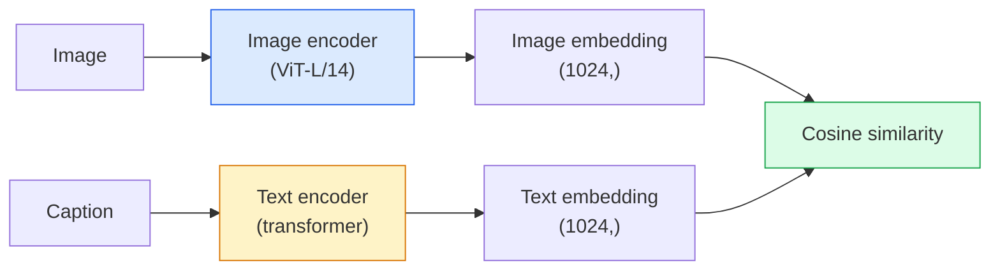

# 开放词汇视觉 Clip 开放词汇视觉 Clip

> 训练一个图像编码器和一个文本编码器,使匹配的 (图像,字幕) 双子在共享空间的同一点.

> **【中文解读】**CLIP 同时训练图像编码器和文本编码器,使匹配的图像,描述) 对落在共享空间的同一点.

> **【拓展：CLIP 是多模态 AI 的基石】**CLIP 是DLL-E、稳定的扩散 (文本条件)、LVA、GPT-4V等多模态模型的基础组件.

**Type:** Build + Use | **类型:** 动手 + 应用
**Languages:** Python | **语言:** Python
**Prerequisites:** Phase 4 Lesson 14 (ViT), Phase 4 Lesson 17 (Self-Supervised) | **前置知识:** Phase 4 Lesson 14（ViT），Phase 4 Lesson 17（自监督）
**Time:** ~45 minutes | **时间:** ~45 分钟

## 学习目标

- 解释CLIP的两塔架构和对比性培训目标
- 使用预训练的 CLIP (或 SigLIP) 进行零射分类,而没有任何任务特定的培训
- 从零射开始实施零射分类:编码类提示,计算共数相似性,取 argmax
- 区分CLIP,SigLIP,OpenCLIP和LLaVA/LLaMA视觉模型 每个模型在2026年用于什么

> **【中文解读】**学习目标列出了课程完成后应掌握的核心能力.建议在开始学习前先浏览目标,学习完后对照检查是否已实现.


## 问题 问题引入

传统的分类器是封闭的词汇库:一个1000类的ImageNet模型只能预测1000个标签.每个新类别都需要标签数据和重新训练的头.

> 传统分类器是封闭词汇的:1000类的图像网模型只能预测1000个标签――每个新类都需要标签数据和重新训练的头――

CLIP (Radford等,OpenAI 2021) 显示,在400万个 (图像,字幕) 对上从网上剪辑的训练产生了一个模型,可以在推断下分类成任何类别,纯粹用自然语言描述.

> 根据"Radford等,OpenAI2021"的研究,在网络中获取的400亿图像,标题中,对上述训练产生的模型可以在推理时分类到任何类别的集合中,纯粹用自然语言描述.

由于这种功能,每一个现代视觉系统都以CLIP家族检查点开始.检测 (Grounding DINO,OWL-ViT),分区 (CLIPSeg,SAM),检索,内容调节,VLM和文字到图像生成都基于CLIP式的嵌入式.

> 那个能力零样本迁移就是为什么每个现代视觉系统都从CLIP家族的检查点开始.检测(基层DINO、OWL-ViT) 、分开(CLIPSeg、SAM)、检索、内容审核、VLM 和文本到图像生成都建立在CLIP风格的联合嵌入上.

## 概念的核心概念

> **【中文解读】**本节介绍核心概念和理论基础.掌握这些概念是后续动手实现的前提,同时也是面试和工程实践中高频考察的知识点.


### 两个塔楼



两种编码器都以线性投影到相同的嵌入维度 (Clip-B/32 的512 ,Clip-L/14 的1024). L2正常化和计算的共数相似性.

> 两个编码器都以线性投影到相同嵌入维度结束了.

### 目标

给出一批N (图像,字幕) 双,构建一个NxN相似性矩阵.训练两个编码器,所以对角 (匹配的对) 有很高的相似性,外角 (非匹配) 有很少的相似性.

> 给定一批N 个图像,标题) 对,构建NxN相似度矩阵――训练两个编码器使对角线 (相似度高,非对角线) 相似度低――

```
sim_matrix = image_embeddings @ text_embeddings.T / tau

loss_i2t = cross_entropy(sim_matrix,       targets=arange(N))
loss_t2i = cross_entropy(sim_matrix.T,     targets=arange(N))
loss = (loss_i2t + loss_t2i) / 2
```

图像对图像检索应该都能有效.`tau`温度通常以0.07为初始化的 skalar 参数来学习.

> 称之为图像到文本和文本到图像的检查都应该有效.`tau`(温度) 通常作为标量参数数学习,初始化为0.07──

### 利普:更好的损失

利普 (Zhai等, 2023) 取代了软max 通过每对的利普:

> ,,等,2023年,用一个对一个的换了软max:

```
loss = mean over pairs of log(1 + exp(-y_ij * sim_ij))
y_ij = +1 if matching, -1 otherwise
```

对于每对的损失,Clip所要求的批量级正常化消除了.SigLIP在小批量尺寸上更好地训练,并且在相同数据上匹配或超过Clip.

> 逐对损失消除了CLIP所需的批次级别归化.

### 零射分类

鉴于有培训的CLIP:

> 给定训练好的 CLIP:

1. 对于每个类,编写一个提示:"一个 {类}的照片".
   中文翻译:为每个类别构建提示词:"一个 {类别}的照片"。
2. 使用文本编码器编码所有类提示 -> `T`形状 (C,d).
   中文翻译:用文本编码器编码所有类提示词 -> `T`形状 (C,d) ⋅
3. 编码测试图像 -> `I`形状 (1,d).
   中文翻译:编码测试图像 -> `I`形状 (1,d) ⋅
4. 类似性`I @ T.T`形状 (1,C).
   中文翻译:相似度 = `I @ T.T`形状 (1, C) ⋅
5. 预测类.
   中文翻译:Argmax -> 预测类别。

快速工程问题.OpenAI为ImageNet发布了80个快速模板 ("一个 {}的照片", "一个 {}的模糊照片", "一个 {}的草图", ...).平均每个类的所有模板的嵌入,以获得额外的1-3%的前一精度.

> 提示词工程很重要.OpenAI为ImageNet发布了80个提示模板.

### 2026年使用Clip型模型

- **Zero-shot classification**直接使用.
  翻译: 中文**零样本分类**直接使用.
- **Image retrieval**一次编码所有图像,在推断中嵌入查询.
  翻译: 中文**图像检索**一次性编码所有图像,推理时嵌入查询.
- **Text-conditioned detection**                           
  翻译: 中文**文本条件检测**基层DINO、OWL-ViT 在检测器外包装 CLIP 文本塔──
- **Text-conditioned segmentation**CLIPSeg;SAM通过CLIIP使用文字提示输入.
  翻译: 中文**文本条件分割**CLIPSeg;SAM 通过CLIPS 使用文本提示输入
- **VLMs** LLaVA,Qwen-VL,InternVL将CLIP家族视觉编码器连接到LLM中.
  翻译: 中文**VLM**LLaVA、Qwen-VL、InternVL将Clip家族的视觉编码器连接到LLM──
- **Text-to-image gen** 稳定扩散,在Clip文本嵌入式上DALL-E 3条件.
  翻译: 中文**文本到图像生成**稳定扩散、DALL-E 3 基于Clip文本嵌入进行条件化。

一旦你有了共享嵌入空间, 每个视觉+语言任务都会变成一个距离计算.

> 一旦有共享嵌入空间,每个视觉+语言任务都变成了距离计算.

> **【中文解读】**本节通过代码实现从零到核心算法――这种"从零开始"的方式可以帮助理解框架背后的原理,遇到问题时不会被黑盒困住――

> **【拓展：工业部署中的视觉系统】**在实际工业部署中,视觉模型需要考虑推迟模型大小的边缘设备适应等问题.

> **【拓展：数据标注与质量】**视觉任务的效果高度依赖标签数据质量――标签工作室、CVAT是主流标签工具――在工业场景中,主动学习(主动学习) 可以减少标签成本:模型对不确定的样本请求人工标签,确定性的样本自动标签――


## 建立它,实现它.
```figure
clip-contrastive
```

## 建立它

### 步骤1:一个小的两个塔的模型

对于这个课程,塔子是小MLP,超过预提取的功能,因此训练信号可以在CPU上看到.

> 真正的CLIP是VT+变压器. 本课程的塔是预提取特征上的小型MLP,以便在CPU上看到训练信号.

```python
import torch
import torch.nn as nn
import torch.nn.functional as F


class TwoTower(nn.Module):
    def __init__(self, img_in=128, txt_in=64, emb=64):
        super().__init__()
        self.image_proj = nn.Sequential(nn.Linear(img_in, 128), nn.ReLU(), nn.Linear(128, emb))
        self.text_proj = nn.Sequential(nn.Linear(txt_in, 128), nn.ReLU(), nn.Linear(128, emb))
        self.logit_scale = nn.Parameter(torch.ones([]) * 2.6592)  # ln(1/0.07)

    def forward(self, img_feats, txt_feats):
        i = F.normalize(self.image_proj(img_feats), dim=-1)
        t = F.normalize(self.text_proj(txt_feats), dim=-1)
        return i, t, self.logit_scale.exp()
```

两个投影,共享模糊输出,学习温度. 与真正的Clip API相同的形状.

> 两个投影,共享维度输出,可学习温度,与真正的Clip API相同的形状.

### 步骤2:对比损失

```python
def clip_loss(image_emb, text_emb, logit_scale):
    N = image_emb.size(0)
    sim = logit_scale * image_emb @ text_emb.T
    targets = torch.arange(N, device=sim.device)
    l_i = F.cross_entropy(sim, targets)
    l_t = F.cross_entropy(sim.T, targets)
    return (l_i + l_t) / 2
```

具有对称性.较高的高效率 = 较强的软度 = 更自信,但不稳定的风险.

> 对于称称的――更高的逻辑_规模 = 更尖的软max = 更自信但有不稳定的风险――

### 步骤3:零射分类器

```python
@torch.no_grad()
def zero_shot_classify(model, image_feats, class_text_feats, class_names):
    """
    image_feats:      (N, img_in)
    class_text_feats: (C, txt_in)   one averaged embedding per class
    """
    i = F.normalize(model.image_proj(image_feats), dim=-1)
    t = F.normalize(model.text_proj(class_text_feats), dim=-1)
    sim = i @ t.T
    pred = sim.argmax(dim=-1)
    return [class_names[p] for p in pred.tolist()]
```

通过生产Clip检查点使用的零射击程序.

> 每一步一行. 这就是生产级Clip检查点使用的精确零样本流程.

### 步骤4: 检查智力

```python
torch.manual_seed(0)
model = TwoTower()

img = torch.randn(8, 128)
txt = torch.randn(8, 64)
i, t, scale = model(img, txt)
loss = clip_loss(i, t, scale)
print(f"batch size: {i.size(0)}   loss: {loss.item():.3f}")
```

损失应该接近`log(N) = log(8) = 2.08`对于随机启动模型,在尚未学习结构时,对称交叉值目标.

> 随着初始化模型的损失应接近`log(N) = log(8) = 2.08`尚未学到结构时的对称交叉目标──

> **【中文解读】**本节展示了如何使用成熟框架 (如PyTorch、HuggingFace等) 快速应用该技术.


> **【拓展：视觉模型的持续学习】**在生产环境中,视觉模型需要不断适应新数据. 持续学习. 持续学习. 技术可以防止模型在适应新数据时忘记旧知识.

## 用它实现框架

2026 年的社区默认版本是 OpenCLIP:

```python
import open_clip
import torch
from PIL import Image

model, _, preprocess = open_clip.create_model_and_transforms("ViT-B-32", pretrained="laion2b_s34b_b79k")
tokenizer = open_clip.get_tokenizer("ViT-B-32")

image = preprocess(Image.open("dog.jpg")).unsqueeze(0)
text = tokenizer(["a photo of a dog", "a photo of a cat", "a photo of a car"])

with torch.no_grad():
    image_features = model.encode_image(image)
    text_features = model.encode_text(text)
    image_features = image_features / image_features.norm(dim=-1, keepdim=True)
    text_features = text_features / text_features.norm(dim=-1, keepdim=True)
    probs = (100.0 * image_features @ text_features.T).softmax(dim=-1)

> **【中文解读】** 本节关注如何将模型部署为可用的产品。从原型到生产级系统需要考虑性能优化、错误处理、监控等多个维度。


print(probs)
```

siglip是新型的,在小规模上训练得更好,并且更适用于新的工作:`google/siglip-base-patch16-224`拥抱着两艘船.


## 运送它.

> **【中文解读】**练习题按照易/中/难 三个难度递进;;建议至少完成中级题,Hard级适合深入研究或面试准备;;


这一课产生了:

- `outputs/prompt-zero-shot-class-picker.md`一个提示,为零截图 CLIP 设计类模板,给出了类列表和域名.
- `outputs/skill-image-text-retriever.md`一个技能,可以在任何CLIP检查点上构建一个嵌入图像索引,支持文本取消和图像取消.

## 练习题

1. **(Easy)**使用预训练的OpenCLIP ViT-B/32并使用80模板提示集进行零射击分类.报告前-1准确性;它应该在85-90%左右.
2. **(Medium)**比较同一CIFAR-10任务中的单模板 ("一个 {}的照片") 与80个模板平均嵌入式.量化差距并解释模板为什么有帮助.
3. **(Hard)**建立零拍摄图像检索索引:用CLIP嵌入1000张图像,建立FAISS索引,用自然语言描述查询. 报告检索回忆@5为你手动写的20个保留的查询.

> **【中文解读】**在团队协作中,统一术语定义可以避免大量沟通误解.


## 关键词 快速查找表

| Term | What people say | What it actually means |
|------|----------------|----------------------|
| Two-tower | "Dual encoder" | Separate image and text encoders ending in a shared-dim projection head |
| Zero-shot | "No task-specific training" | Classify into classes described only by text at inference; no labels touched |
| Temperature / logit_scale | "tau" | Learned scalar that scales the similarity matrix before softmax |
| Prompt template | "A photo of a {}" | Natural-language wrapper around class names; averaging many templates boosts zero-shot accuracy |
| CLIP | "Image+text model" | The 2021 OpenAI model; vocabulary of the field in 2026 |
| SigLIP | "Sigmoid CLIP" | Swaps softmax for per-pair sigmoid; trains better at small batches |
| OpenCLIP | "Open reproduction" | Community-trained CLIP variants on LAION; production default for open-source pipelines |
| VLM | "Vision-language model" | A CLIP-family encoder plus an LLM, trained to answer questions about images |

> **【中文解读】**延伸阅读提供了深入学习的高质量资源. 这些论文和教程是该领域的经典参考文献,适合需要深入了解的读者.


## 继续阅读 继续阅读

- [CLIP: Learning Transferable Visual Models from Natural Language Supervision (Radford et al., 2021)](https://arxiv.org/abs/2103.00020)
- [SigLIP: Sigmoid Loss for Language-Image Pre-Training (Zhai et al., 2023)](https://arxiv.org/abs/2303.15343)
- [OpenCLIP](https://github.com/mlfoundations/open_clip)社区代码基础
- [DINOv2 vs CLIP vs MAE: a features comparison](https://huggingface.co/blog/dinov2) HF 指南与配套使用案例
