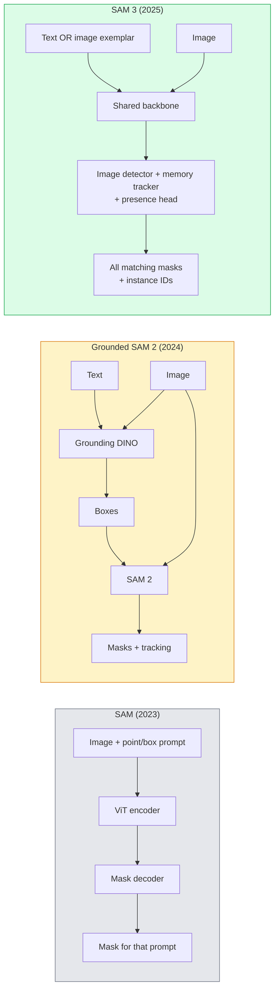

# 简单的词汇分类

> 给模型一个短信提示和图像,并为每一个匹配的对象提供面具.

> **【中文解读】**给模型一个文本提示和一个图像,就能得到所有匹配对象的分割掩码.SAM 3(部分任何模型 3) 将这个过程变成单次前向传播.

> **【拓展：SAM 的革命性影响】**SAM 系列模型 (Meta 发布) 是分类领域的"基础模型",可以零样本分类任意物体.

**Type:** Use + Build | **类型:** 应用 + 动手
**Languages:** Python | **语言:** Python
**Prerequisites:** Phase 4 Lesson 07 (U-Net), Phase 4 Lesson 08 (Mask R-CNN), Phase 4 Lesson 18 (CLIP) | **前置知识:** Phase 4 Lesson 07（U-Net），Phase 4 Lesson 08（Mask R-CNN），Phase 4 Lesson 18（CLIP）
**Time:** ~60 minutes | **时间:** ~60 分钟

## 学习目标

- 区分SAM (仅视觉提示),GroundedSAM/SAM 2 (检测器+SAM),和SAM 3 (通过即时概念分类的本地文本提示)
- 解释SAM3架构:共享脊柱+图像探测器+基于内存的视频追踪器+存在头+离合探测器-追踪器设计
- 拥抱脸`transformers`通过文字提示检测,细分和视频跟踪的SAM3集成
- 根据延迟,概念复杂性和部署目标,选择SAM 3,GroundedSAM 2,YOLO-World和SAM-MI

> **【中文解读】**学习目标列出了课程完成后应掌握的核心能力.建议在开始学习前先浏览目标,学习完后对照检查是否已实现.


## 问题 问题引入

2023 SAM只是一个视觉提示模型:你点击一个点或绘制一个盒子,它返回一个面具.为"给我这张照片中的所有的色"你需要一个探测器 (Grounding DINO) 来制作盒子,然后 SAM 进行分区分.Grounded SAM 将这变成了管道,但这是两个结的模型的尾,不可避免的错误积累.

> 2023年SAM是一个仅视觉提示的模型:你点击一个点或画一个框,它返回一个掩码.对于"给我这张照片里所有的子",你需要一个检测器来产生框,然后用SAM来分开每个框.

 SAM 3 (Meta,Nov 2025,ICLR 2026) 已经崩了.它接受一个短名词短语或图像示范作为提示,并将所有匹配的面具和实例ID返回在一个前进通行.**Promptable Concept Segmentation (PCS)**结合2026年3月的Object Multiplex更新 (SAM 3.1) 功能,它通过视频有效地追踪相同概念的多个实例.

> SAM 3(Meta,2025年11月,ICLR 2026) 折叠了级联――它接受了一个短名词短语或图像示例作为提示,在单次前向传播中返回所有匹配的掩码和实例ID――这是**可提示概念分割（PCS）**结合2026年3月的物体多重更新(SAM 3.1),它能高效地在视频中跟踪同一个概念的多个例子──

这一课讲述了这所代表的结构转变. 2D Seg,检测和文本图像接地已经融入了一个模型.生产问题不再是"我连接哪个管道",而是"哪个可调用模型处理我的使用情况端到端".

> 本课讲述了这代表的结构转变――2D分断,检测和文本图像基础已经合并成一个模型――生产问题不再是"我把哪些流水线连接在一起",而是"哪些可提示模型可以端到端处理我的使用例"――

## 概念的核心概念

> **【中文解读】**本节介绍核心概念和理论基础.掌握这些概念是后续动手实现的前提,同时也是面试和工程实践中高频考察的知识点.


### 现在,我们有三代人



### 快速的概念分类

概念提示是一个短名词 (`"yellow school bus"`现在`"striped red umbrella"`现在`"hand holding a mug"`模型返回每个与概念相匹配的图像中的实例的细分面具,加上每个匹配的独特实例ID.

> "提示概念词"是一个简短的名词短语或图像示例――模型返回图像中匹配的概念的所有实例的分割掩盖,加上每个匹配的唯一实例ID――

这与经典视觉提示SAM有三个方面不同:

> 这与经典视觉提示SAM有三个区别:

1. 没有需要每次提示一个文本提示返回所有匹配.
   中文翻译:无需逐例提示一个文本提示返回所有匹配──
2. 开放词汇 这个概念可以用自然语言描述任何东西.
   中文翻译:开放词汇概念可以是自然语言可描述的任何东西.
3. 返回一次多次实例,而不是每次提示一次.
   中文翻译:一次回复多个实例,而不是每个提示一个掩码.

### 建筑的关键部分

- **Shared backbone**单个ViT处理图像. 检测器头和基于内存的跟踪器都从图像中读取.
  翻译: 中文**共享骨干**单个维特处理图像,检测头和基于内存的跟踪器都从中读取.
- **Presence head**预测概念是否存在于图像中. 脱离"这是在这里吗?"和"它在哪里?" 减少缺失概念的虚假积极性.
  翻译: 中文**存在性头**预测概念是否存在图像中.将"这是在这里吗?"与"它在哪里?"解.减少没有存在的假阳性.
- **Decoupled detector-tracker**图像级检测和视频级追踪具有分开的头部,因此它们不会干扰.
  翻译: 中文**解耦的检测器-跟踪器**图像级检查和视频级跟踪有独立的头,互不干扰.
- **Memory bank**存储视频跟踪的每次实例功能在框架中 (使用 SAM 2 的机制相同).
  翻译: 中文**记忆库**跨存储的每个实例的特征,用于视频跟踪(与SAM2相似的机制) 

### 规模培训

 SAM3训练在**4 million unique concepts**通过人工智能+人类审查进行反复注释和纠正的数据引擎生成.**SA-CO benchmark**含有270万个独特概念,比以前的基准标准大50倍.SAM3在SA-CO上达到75-80%的人类性能,并且在图像+视频PCS上翻倍现有系统.

###  SAM 3.1 物体多重

2026年3月更新: **Object Multiplex**之前,跟踪N实例意味着N个独立的内存库.多复合式将这些存储器分解成一个共享内存,每次查询.结果:在不牺牲准确性的情况下,多对象的跟踪速度更快.

### 在2026年,地面 SAM仍然重要

- 当你需要一个特定的开放词汇检测器 (DINO-X,佛罗伦萨-2) 换成时.
- 当SAM3许可证 (HF上锁定) 是一个阻塞器时.
- 当你需要对探测器门的控制比SAM3暴露的更高.
- 用于探测器组件的研究/除工作.

对于大多数生产工作,SAM3是最简单的答案.

### 约洛世界vs三星

- **YOLO-World** 只有开口语音检测器 (没有面具).实时.最好在高光率的盒子中使用.
  翻译: 中文**YOLO-World**仅开放词汇检测器 (无掩码) ⋅实时――需要高fps 框时的最佳选择――
- **SAM 3**完整的细分+跟踪.
  翻译: 中文**SAM 3**完整分开+跟踪――更慢但输出更丰富――

产品分类:YOLO-World用于快速检测 (机器人导航,快速仪表板),SAM 3用于任何需要面具或跟踪的东西.

> 生产分工:YOLO-World 用于快速检测流水线,SAM 3 用于需要掩盖或跟踪的场景.

###  SAM-MI 的效率

 SAM-MI (2025-2026) 解决了 SAM 的解码器瓶.

- **Sparse point prompting**使用一些精心选择的点,而不是密集的提示;减少了96%的解码器调用.
- **Shallow mask aggregation**将粗的面具预测合并成一个更尖的面具.
- **Decoupled mask injection**解码器接收预先计算的面具功能,而不是重新运行.

结果:在开放词汇基准上,速度比 Grounded-SAM高达1.6x.

### 三种模型的输出格式

所有的输出都返回相同的总体结构 (盒子+标签+分数+面具+身份证),这有助于您的下游管道不需要分行于哪个模型运行.

> **【拓展：工业部署中的视觉系统】**在实际工业部署中,视觉模型需要考虑推迟模型大小的边缘设备适应等问题.

> **【拓展：数据标注与质量】**视觉任务的效果高度依赖标签数据质量――标签工作室、CVAT是主流标签工具――在工业场景中,主动学习(主动学习) 可以减少标签成本:模型对不确定的样本请求人工标签,确定性的样本自动标签――


## 建立它,实现它.

> **【中文解读】**本节通过代码实现从零到核心算法――这种"从零开始"的方式可以帮助理解框架背后的原理,遇到问题时不会被黑盒困住――

```figure
cv3-open-vocab
```

## 建立它

### 第一个步骤:快速建设

建立一个帮助程序,将用户句子变成SAM 3概念提示列表.这是"用户输入的"与"模型消耗的"交往的边界.

```python
def split_concepts(sentence):
    """
    Heuristic splitter for multi-concept prompts.
    Returns list of short noun phrases.
    """
    for sep in [",", ";", "and", "or", "&"]:
        if sep in sentence:
            parts = [p.strip() for p in sentence.replace("and ", ",").split(",")]
            return [p for p in parts if p]
    return [sentence.strip()]

print(split_concepts("cats, dogs and balloons"))
```

通过前进传输,SAM 3接受一个概念;对于多概念查询,循环或批量.

### 后处理辅助员

让SAM3的原始输出成为一个清洁的检测清单,符合我们4期16课管道合同.

```python
from dataclasses import dataclass
from typing import List

@dataclass
class ConceptDetection:
    concept: str
    instance_id: int
    box: tuple          # (x1, y1, x2, y2)
    score: float
    mask_rle: str       # run-length encoded


def rle_encode(binary_mask):
    flat = binary_mask.flatten().astype("uint8")
    runs = []
    prev, count = flat[0], 0
    for v in flat:
        if v == prev:
            count += 1
        else:
            runs.append((int(prev), count))
            prev, count = v, 1
    runs.append((int(prev), count))
    return ";".join(f"{v}x{c}" for v, c in runs)
```

尽管在高分辨率面具中,RLE也能保持响应有效载荷. SAM 2, SAM 3,Grounded SAM 2中也能使用相同的格式.

### 步骤3: 统一的开口语句分区接口

包装您的任何后端 (SAM 3,Grounded SAM 2,YOLO-World + SAM 2) 单一方法.后端时,您的下游代码不会改变.

```python
from abc import ABC, abstractmethod
import numpy as np

class OpenVocabSeg(ABC):
    @abstractmethod
    def detect(self, image: np.ndarray, concept: str) -> List[ConceptDetection]:
        ...


class StubOpenVocabSeg(OpenVocabSeg):
    """
    Deterministic stub used for pipeline testing when real models are not loaded.
    """
    def detect(self, image, concept):
        h, w = image.shape[:2]
        return [
            ConceptDetection(
                concept=concept,
                instance_id=0,
                box=(w * 0.2, h * 0.3, w * 0.5, h * 0.8),
                score=0.89,
                mask_rle="0x100;1x50;0x200",
            ),
            ConceptDetection(
                concept=concept,
                instance_id=1,
                box=(w * 0.55, h * 0.25, w * 0.85, h * 0.75),
                score=0.74,
                mask_rle="0x80;1x40;0x220",
            ),
        ]
```

真正的`SAM3OpenVocabSeg`亚级将包装`transformers.Sam3Model`其他`Sam3Processor`现在,我们要去.

### 步骤4:拥抱脸SAM 3使用 (参考)

对于实际模型来说,`transformers`整合:

```python
from transformers import Sam3Processor, Sam3Model
import torch

processor = Sam3Processor.from_pretrained("facebook/sam3")
model = Sam3Model.from_pretrained("facebook/sam3").eval()

inputs = processor(images=pil_image, return_tensors="pt")
inputs = processor.set_text_prompt(inputs, "yellow school bus")

with torch.no_grad():
    outputs = model(**inputs)

masks = processor.post_process_masks(
    outputs.masks, inputs.original_sizes, inputs.reshaped_input_sizes
)
boxes = outputs.boxes
scores = outputs.scores
```

一个提示,所有匹配都在一个电话回来.

### 步骤5:测量Grounded SAM 2免费给你的

坦诚的基准:当你用真实管道中的SAM3取代地面SAM2时会发生什么?

- 延迟:SAM 3节省一个前进传输 (没有单独的探测器),但模型本身更重;通常是净中性或略有加速.
- 精度: SAM 3 在罕见或组合概念 ("条纹红色雨") 上显著提高.
- 灵活性:地面 SAM 2 允许您交换探测器 (DINO-X,Florence-2,地面 DINO 1.5);SAM 3 是单色的.

总结: SAM 3 是2026年开口语分类的默认. 基于 SAM 2 仍然是正确的答案,当你需要探测器灵活性或不同的许可条款时.

> **【中文解读】**本节展示了如何使用成熟框架 (如PyTorch、HuggingFace等) 快速应用该技术.


> **【拓展：视觉模型的持续学习】**在生产环境中,视觉模型需要不断适应新数据. 持续学习. 持续学习. 技术可以防止模型在适应新数据时忘记旧知识.

## 用它实现框架

生产部署模式:

- **Real-time annotation** SAM 3 + CVAT的标签即文字提示功能.注释符选择标签名称; SAM 3 预标签每个匹配的实例. 审查和纠正.
- **Video analytics** SAM 3.1 对象多重跟踪;输送框架到基于内存的跟踪器.
- **Robotics** SAM 3用于开口音符操作 ("挑起红杯");运行为规划原始.
- **Medical imaging** SAM 3 调整了医疗概念;需要在HF上请求访问.

> **【中文解读】**本节关注如何将模型部署为可用的产品. 从原型到生产级系统需要考虑性能优化,错误处理,监控等多个维度.


超分析将SAM3包装在Python包中:

```python
from ultralytics import SAM

model = SAM("sam3.pt")
results = model(image_path, prompts="yellow school bus")
```

类似于YOLO和SAM2.


## 运送它.

> **【中文解读】**练习题按照易/中/难 三个难度递进;;建议至少完成中级题,Hard级适合深入研究或面试准备;;


这一课产生了:

- `outputs/prompt-open-vocab-stack-picker.md`一个提示,根据延迟,概念复杂性和许可,选择SAM 3 /Grounded SAM 2 /YOLO-World /SAM-MI.
- `outputs/skill-concept-prompt-designer.md`将用户的言论转化为精确的SAM3概念提示 (分开,分歧,反弹).

## 练习题

1. **(Easy)**运行 SAM 3 在 10 个图像上,使用您选择的概念提示. 进行 SAM 2 + Grounding DINO 1.5 的相比较. 报告每个模型错过哪些概念.
2. **(Medium)**在 SAM 3 上建立一个"点击加入/点击排除"UI:一个文本提示返回候选实例;用户点击保持哪些被认为是正确的.输出最终概念集合为JSON.
3. **(Hard)**根据定制概念组 (例如5种电子组件) 进行精细调节,每个图像都有20个标签. 进行相同测试组的零射SAM3进行比较;测量面具IoU改善.

> **【中文解读】**在团队协作中,统一术语定义可以避免大量沟通误解.


## 关键词 快速查找表

| Term | What people say | What it actually means |
|------|----------------|----------------------|
| Open-vocabulary segmentation | "Segment by text" | Produce masks for objects described in natural language, not a fixed label set |
| PCS | "Promptable Concept Segmentation" | SAM 3's core task — given a noun-phrase or image exemplar, segment all matching instances |
| Concept prompt | "The text input" | Short noun phrase or image exemplar; not a full sentence |
| Presence head | "Is it here?" | SAM 3 module that decides whether the concept exists in the image before localisation |
| SA-CO | "SAM 3 benchmark" | 270K-concept open-vocabulary segmentation benchmark; 50x larger than prior open-vocab benchmarks |
| Object Multiplex | "SAM 3.1 update" | Shared-memory multi-object tracking; fast joint tracking of many instances |
| Grounded SAM 2 | "Modular pipeline" | Detector + SAM 2 cascade; still relevant when detector swap matters |
| SAM-MI | "Efficient SAM variant" | Mask Injection for 1.6x speedup over Grounded-SAM |

> **【中文解读】**延伸阅读提供了深入学习的高质量资源. 这些论文和教程是该领域的经典参考文献,适合需要深入了解的读者.


## 继续阅读 继续阅读

- [SAM 3: Segment Anything with Concepts (arXiv 2511.16719)](https://arxiv.org/abs/2511.16719)
- [SAM 3.1 Object Multiplex (Meta AI, March 2026)](https://ai.meta.com/blog/segment-anything-model-3/)
- [SAM 3 model page on Hugging Face](https://huggingface.co/facebook/sam3)
- [Grounded SAM 2 tutorial (PyImageSearch)](https://pyimagesearch.com/2026/01/19/grounded-sam-2-from-open-set-detection-to-segmentation-and-tracking/)
- [Ultralytics SAM 3 docs](https://docs.ultralytics.com/models/sam-3/)
- [SAM3-I: Instruction-aware SAM (arXiv 2512.04585)](https://arxiv.org/abs/2512.04585)
