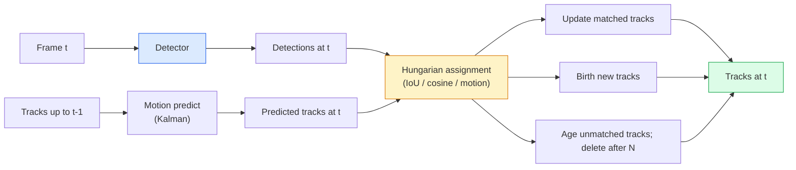

# 多个对象跟踪和视频记忆.

> 追踪是检测加关联,检测每个图片,通过ID对应这个图片的检测到最后一个图片的痕迹.

> **【中文解读】**跟踪 = 检测 + 关联──每一个检测目标,然后将当前的检测结果与上一的跟踪轨迹通过ID匹配──多目标跟踪──MOT) 是视频理解的核心技术,需要处理遮,消失,重现等复杂情况──

> **【拓展：MOT 的应用】**多目标跟踪在安防监控 (安防监控) 人员轨迹跟踪) 交通管理 (交通管理) 车辆计数 (车辆计数) 体育分析 (体育分析) 球员跑动轨迹 (球员跑动轨迹) 无人机跟踪等场景中不可或缺――ByteTrack、SORT/DeepSORT 是经典的方法――

**Type:** Build | **类型:** 动手
**Languages:** Python | **语言:** Python
**Prerequisites:** Phase 4 Lesson 06 (YOLO Detection), Phase 4 Lesson 08 (Mask R-CNN), Phase 4 Lesson 24 (SAM 3) | **前置知识:** Phase 4 Lesson 06（YOLO 检测），Phase 4 Lesson 08（Mask R-CNN），Phase 4 Lesson 24（SAM 3）
**Time:** ~60 minutes | **时间:** ~60 分钟

## 学习目标

- 区分追踪-通过检测与基于查询的追踪,并命名算法家族 (SORT, DeepSORT, ByteTrack, BoT-SORT, SAM 2 存储器追踪器, SAM 3.1 对象多重)
- 实现IoU+匈牙利从头开始的任务,实现经典的追踪-检测
- 解释SAM 2的内存库以及为什么它更好地处理结比基于IoU的协会
- 阅读三个跟踪指标 (MOTA,IDF1,HOTA) 并选择一个对特定使用情况有意义的指标

> **【中文解读】**学习目标列出了课程完成后应掌握的核心能力.建议在开始学习前先浏览目标,学习完后对照检查是否已实现.


## 问题 问题引入

检测器告诉你在一个框架中有哪些物体.`t`是与体中的检测相同的对象`t-1`没有它,你不能计算穿过线的物体, 通过门跟踪球,

> 检测器告诉你物体在单中的位置. 追踪器告诉你第一个.`t`中哪个检测与第`t-1`没有它,你无法计算穿过线的物体数量,跟踪被遮蔽的球,或者知道4号车已经在这条车道上了8秒了.

追踪对于视频面向的产品都是必不可少的:体育分析,监控,自动驾驶,医学视频分析,野生动物监测,字符号计数. 核心的构建块是:每的探测器,运动模型 (Kalman 过器或更丰富的东西),协同步骤 (匈牙利算法关于 IoU / cosine / 学习特征),以及轨道生命周期 (出生,更新,死亡).

> 跟踪对每一个视频面向的产品都是至关重要的:体育分析,监控,自动驾驶,医学视频分析,野生动物监测,商标计数.

2026年带来了两个新的模式:**SAM 2 memory-based tracking**(功能记忆而不是运动模式协会) 和**SAM 3.1 Object Multiplex**这一课首先遵循经典的方法,然后是基于记忆的方法.

> 2026年带来了两种新模式:**SAM 2 基于记忆的跟踪**记忆的特征**SAM 3.1 Object Multiplex**课程先走经典,然后走基于记忆的方法

## 概念的核心概念

> **【中文解读】**本节介绍核心概念和理论基础.掌握这些概念是后续动手实现的前提,同时也是面试和工程实践中高频考察的知识点.


### 通过检测进行跟踪



根据我们所看到的数据,

> 2026年,你遇到的每一个跟踪器都是这个循环的变体.

- **SORT**(2016):卡尔曼过器+Iow匈牙利语.简单,快速,没有外观模型.
  翻译: 中文**SORT**(2016):卡尔曼波器 + IoU 匈牙利算法──简单、快速、无外观模型──
- **DeepSORT**(2017):SORT+基于CNN的每条轨道外观功能 (ReID嵌入).更好地处理交叉路口.
  翻译: 中文**DeepSORT**报道: 报道: 报道: 报道: 报道: 报道: 报道: 报道: 报道: 报道: 报道: 报道: 报道: 报道: 报道: 报道: 报道: 报道: 报道: 报道: 报道: 报道: 报道: 报道: 报道: 报道: 报道: 报道: 报道: 报道: 报道: 报道: 报道: 报道: 报道: 报道: 报道: 报道: 报道: 报道: 报道: 报道: 报道: 报道: 报道: 报道: 报道: 报道: 报道: 报道: 报道: 报道: 报道: 报道: 报道: 报道: 报道: 报道: 报道: 报道: 报道: 报名: 报名: 报名: 报名: 报名: 报名: 报名: 报名: 报名: 报名: 报名: 报名: 报名:
- **ByteTrack**(2021):将低安全性检测视为第二阶段;没有外观特征,但在MOT17上具有顶级性能.
  翻译: 中文**ByteTrack**(2021):将低信任检测作为第二阶段关联;无需外观特征但在MOT17上表现最佳.
- **BoT-SORT**(2022):字节+相机运动补偿+ReID.
  翻译: 中文**BoT-SORT**据报道,该公司的资产额为
- **StrongSORT / OC-SORT**                                                                                                                                                                                                                                                              
  翻译: 中文**StrongSORT / OC-SORT**ByteTrack 后代,改进运动和外观模型

### 卡尔曼过器在一个段落

卡尔曼过器保持每条轨道状态`(x, y, w, h, dx, dy, dw, dh)`它们的位置是的.**predict**通过恒速模型,**update**更新更信任预测不确定性高时的检测. 这使得轨迹顺利,并且能够通过短暂的封闭 (1-5 个框架) 继续轨迹.

> 卡尔曼波器维护每个轨迹的状态`(x, y, w, h, dx, dy, dw, dh)`和协方差──每一个先使用恒速模型**预测**状态,再使用匹配的检测**更新**◎预测不确定性高时更新更信任检测──这产生平滑的轨迹,并能穿过短暂的遮(1-5 ) 继续跟踪──

每个经典的跟踪器都使用了卡尔曼过器,

> 每个经典追踪器都在运动预测步骤中使用卡尔曼波器.

### 匈牙利算法

由于一个`M x N`总成本通常是 总成本是 总成本是 总成本是 总成本是 总成本是 总成本是 总成本是 总成本是 总成本是 总成本是 总成本是 总成本是 总成本是 总成本是 总成本是 总成本是 总成本是 总成本是 总成本是 总成本是 总成本是 总成本是 总成本是 总成本是 总量 总量 总量 总量 总量 总量 总量 总量 总量 总量 总量 总量 总量 总量 总量 总量 总量 总量 总量 总量 总量 总量 总量`1 - IoU(track_bbox, detection_bbox)`运行时间为O(((M+N) ^3);对于M,N至 ~1000,它在Python中通过`scipy.optimize.linear_sum_assignment`现在,我们要去.

> 给定`M x N`通过测试,找到最小化总代价的一对一分配.`1 - IoU(轨迹框, 检测框)`或外观特征的负余弦相似度──运行时间为 O(((M+N) ^3);M、N 约1000 以内在Python中通过 `scipy.optimize.linear_sum_assignment`足够快.

### 通过Track的关键想法

标准跟踪器会降低可靠性检测 (< 0. 5).**second-stage candidates**测量后,无与伦比的轨道试图与低安全性测试相匹配,以稍微宽松的IoU门. 恢复短暂的罩,在人群附近切换ID.

> 标准跟踪器丢弃低置信度检测(<0.5) ――ByteTrack将保留它们为**第二阶段候选**后,未匹配的轨迹尝试以稍宽松的IoU 值匹配低置信度检测.

### 基于内存的SAM2追踪

SAM 2 通过保持一个 **memory bank**根据一个框架的提示 (点击,框,文本),它将实例编码为内存.在随后的框架上,内存与新框架的特性交叉监督,解码器在新框架中产生同一实例的面具.

没有卡尔曼过器,没有匈牙利任务.

优势:
- 强到大 (记忆在许多框架中携带实例身份).
- 开放词汇,结合SAM3的文本提示.
- 没有单独的运动模型.

缺点:
- 速度比ByteTrack慢,可以追踪多个物体.
- 记忆库增长,限制了文本窗口.

###  SAM 3.1 物体多重

之前的SAM2 /SAM3跟踪每次保持一个单独的内存库.对于50个对象,50个内存库.对象多重 (3月2026) 将它们分解成一个共享的内存.**per-instance query tokens**成本量在数次上变得微线性.

聚会群众,仓库工人,交通交叉路口.

### 需要知道的三个指标

- **MOTA (Multi-Object Tracking Accuracy)** 1 - (FN + FP + ID 开关) / GT.按错误类型权重;一个单一的指标,结合检测和关联故障.
  翻译: 中文**MOTA（多目标跟踪精度）**1 - (FN + FP + ID 切换) / GT──按错误类型加权;将检测和关联失败混在一起的单一标志──
- **IDF1 (ID F1)**对ID精度和回忆的和平均值. 专注于每个地面真相轨道如何在时间内保持其ID. 比MOTA更好用于识别开关敏感任务.
  翻译: 中文**IDF1（ID F1）**ID 精确率和召回率调和平均量度――专注衡量每个真实轨迹随时间保持ID的一致性――对ID 切换敏感任务优于MOTA――
- **HOTA (Higher Order Tracking Accuracy)**分解为检测精度 (DetA) 和协会精度 (AssA).自2020年以来的社区标准;最全面.
  翻译: 中文**HOTA（高阶跟踪精度）**分解为检测精度 (DetA) 和关联精度 (AssA) ⋅2020年以来的社区标准;最全面的――

对于监视 (谁是谁):IDF1是你报告的.对于体育分析 (计数卡):HOTA.对于一般学术比较:HOTA.

> 监控(谁是谁):报告 IDF1──运动分析(计数传球):HOTA──一般学术比较:HOTA──

> **【拓展：工业部署中的视觉系统】**在实际工业部署中,视觉模型需要考虑推迟模型大小的边缘设备适应等问题.

> **【拓展：数据标注与质量】**视觉任务的效果高度依赖标签数据质量――标签工作室、CVAT是主流标签工具――在工业场景中,主动学习(主动学习) 可以减少标签成本:模型对不确定的样本请求人工标签,确定性的样本自动标签――


## 建立它,实现它.

> **【中文解读】**本节通过代码实现从零到核心算法――这种"从零开始"的方式可以帮助理解框架背后的原理,遇到问题时不会被黑盒困住――

```figure
cv3-track-assoc
```

## 建立它

### 步骤1:基于Iow的成本矩阵

```python
import numpy as np


def bbox_iou(a, b):
    """
    a, b: (N, 4) arrays of [x1, y1, x2, y2].
    Returns (N_a, N_b) IoU matrix.
    """
    ax1, ay1, ax2, ay2 = a[:, 0], a[:, 1], a[:, 2], a[:, 3]
    bx1, by1, bx2, by2 = b[:, 0], b[:, 1], b[:, 2], b[:, 3]
    inter_x1 = np.maximum(ax1[:, None], bx1[None, :])
    inter_y1 = np.maximum(ay1[:, None], by1[None, :])
    inter_x2 = np.minimum(ax2[:, None], bx2[None, :])
    inter_y2 = np.minimum(ay2[:, None], by2[None, :])
    inter = np.clip(inter_x2 - inter_x1, 0, None) * np.clip(inter_y2 - inter_y1, 0, None)
    area_a = (ax2 - ax1) * (ay2 - ay1)
    area_b = (bx2 - bx1) * (by2 - by1)
    union = area_a[:, None] + area_b[None, :] - inter
    return inter / np.clip(union, 1e-8, None)
```

### 步骤2:最小SORT式跟踪器

我们在这里使用一个简单的 IoU 关联;在生产中,Kalman 预测是必不可少的.`sort` Python 包提供完整版本.

```python
from scipy.optimize import linear_sum_assignment


class Track:
    def __init__(self, tid, bbox, frame):
        self.id = tid
        self.bbox = bbox
        self.last_frame = frame
        self.hits = 1

    def update(self, bbox, frame):
        self.bbox = bbox
        self.last_frame = frame
        self.hits += 1


class SimpleTracker:
    def __init__(self, iou_threshold=0.3, max_age=5):
        self.tracks = []
        self.next_id = 1
        self.iou_threshold = iou_threshold
        self.max_age = max_age

    def step(self, detections, frame):
        if not self.tracks:
            for d in detections:
                self.tracks.append(Track(self.next_id, d, frame))
                self.next_id += 1
            return [(t.id, t.bbox) for t in self.tracks]

        track_boxes = np.array([t.bbox for t in self.tracks])
        det_boxes = np.array(detections) if len(detections) else np.empty((0, 4))

        iou = bbox_iou(track_boxes, det_boxes) if len(det_boxes) else np.zeros((len(track_boxes), 0))
        cost = 1 - iou
        cost[iou < self.iou_threshold] = 1e6

        matched_track = set()
        matched_det = set()
        if cost.size > 0:
            row, col = linear_sum_assignment(cost)
            for r, c in zip(row, col):
                if cost[r, c] < 1.0:
                    self.tracks[r].update(det_boxes[c], frame)
                    matched_track.add(r); matched_det.add(c)

        for i, d in enumerate(det_boxes):
            if i not in matched_det:
                self.tracks.append(Track(self.next_id, d, frame))
                self.next_id += 1

        self.tracks = [t for t in self.tracks if frame - t.last_frame <= self.max_age]
        return [(t.id, t.bbox) for t in self.tracks]
```

实际系统添加了卡尔曼预测,ByteTrack的第二阶段重新匹配,以及外观功能.

### 步骤3:合成轨迹测试

```python
def synthetic_frames(num_frames=20, num_objects=3, H=240, W=320, seed=0):
    rng = np.random.default_rng(seed)
    starts = rng.uniform(20, 200, size=(num_objects, 2))
    velocities = rng.uniform(-5, 5, size=(num_objects, 2))
    frames = []
    for f in range(num_frames):
        dets = []
        for i in range(num_objects):
            cx, cy = starts[i] + f * velocities[i]
            dets.append([cx - 10, cy - 10, cx + 10, cy + 10])
        frames.append(dets)
    return frames


tracker = SimpleTracker()
for f, dets in enumerate(synthetic_frames()):
    tracks = tracker.step(dets, f)
```

任何在直线上移动的物体都应该在20个上保持身份证.

### 步骤 4:身份交换指标

```python
def count_id_switches(tracks_per_frame, gt_per_frame):
    """
    tracks_per_frame:  list of list of (track_id, bbox)
    gt_per_frame:      list of list of (gt_id, bbox)
    Returns number of ID switches.
    """
    prev_assignment = {}
    switches = 0
    for tracks, gts in zip(tracks_per_frame, gt_per_frame):
        if not tracks or not gts:
            continue
        t_boxes = np.array([b for _, b in tracks])
        g_boxes = np.array([b for _, b in gts])
        iou = bbox_iou(g_boxes, t_boxes)
        for g_idx, (gt_id, _) in enumerate(gts):
            j = iou[g_idx].argmax()
            if iou[g_idx, j] > 0.5:
                t_id = tracks[j][0]
                if gt_id in prev_assignment and prev_assignment[gt_id] != t_id:
                    switches += 1
                prev_assignment[gt_id] = t_id
    return switches
```

这是一个简化的 IDF1 邻近的指标:计算一个地面真相对象改变其分配预测轨道ID的几次.`py-motmetrics`其他`TrackEval`现在,我们要去.

> **【中文解读】**本节展示了如何使用成熟框架 (如PyTorch、HuggingFace等) 快速应用该技术.


> **【拓展：视觉模型的持续学习】**在生产环境中,视觉模型需要不断适应新数据. 持续学习. 持续学习. 技术可以防止模型在适应新数据时忘记旧知识.

## 用它实现框架

2026年生产跟踪器:

- `ultralytics` YOLOv8 + 字节轨迹 / 波特-SORT内置. `results = model.track(source, tracker="bytetrack.yaml")`默认的.
- `supervision` 字节轨迹包装加上注释工具.
- 通过 基于内存的追踪`processor.track()`现在,我们要去.
- 定制堆:探测器 (YOLOv8 / RT-DETR) + `sort-tracker`现在,`OC-SORT`现在,`StrongSORT`现在,我们要去.

选择:

- 步行者/汽车/盒子以30+fps速度: **ByteTrack with ultralytics**现在,我们要去.
- 许多一个类的例子:**SAM 3.1 Object Multiplex**现在,我们要去.
- 具有可识别的重度结:**DeepSORT / StrongSORT**其他类型的信息
- 运动/复杂的互动: **BoT-SORT**或是学习跟踪器 (MOTRv3).

> **【中文解读】**本节关注如何将模型部署为可用的产品. 从原型到生产级系统需要考虑性能优化,错误处理,监控等多个维度.


## 运送它.

> **【中文解读】**练习题按照易/中/难 三个难度递进;;建议至少完成中级题,Hard级适合深入研究或面试准备;;


这一课产生了:

- `outputs/prompt-tracker-picker.md`选择SORT/ByteTrack/BoT-SORT/SAM 2/SAM 3.1 给出场景类型,遮蔽模式和延迟预算.
- `outputs/skill-mot-evaluator.md`写出了Mota/IDF1/HOTA的完整评估带,对地面真相轨道进行了评估.

## 练习题

1. **(Easy)**运行上面的合成追踪器,使用3,10和30个对象. 报告每个情况下的身份识别开关数量. 确定简单的仅仅IoU的关联开始失败的地方.
2. **(Medium)**加入一个恒速的卡尔曼预测步骤,然后将它结合起来. 显示短时间 (2-3 个框) 的遮蔽不再导致ID开关.
3. **(Hard)**通过 SAM 2 的基于内存的跟踪器 (通过 `transformers`通过30秒的群众视频运行SimpleTracker和SAM 2,并进行识别开关数量的比较,并手动标记5名突出人士的真实身份.

> **【中文解读】**在团队协作中,统一术语定义可以避免大量沟通误解.


## 关键词 快速查找表

| Term | What people say | What it actually means |
|------|----------------|----------------------|
| Tracking-by-detection | "Detect then associate" | Per-frame detector + Hungarian assignment on IoU / appearance |
| Kalman filter | "Motion predict" | Linear dynamics + covariance for smooth track predictions and occlusion handling |
| Hungarian algorithm | "Optimal assignment" | Solves the minimum-cost bipartite matching problem; `scipy.optimize.linear_sum_assignment` |
| ByteTrack | "Low-confidence second pass" | Re-match unmatched tracks to low-confidence detections to recover short occlusions |
| DeepSORT | "SORT + appearance" | Adds a ReID feature for cross-frame matching; better for ID preservation |
| Memory bank | "SAM 2 trick" | Per-instance spatio-temporal features stored across frames; cross-attention replaces explicit association |
| Object Multiplex | "SAM 3.1 shared memory" | Single shared memory with per-instance queries for fast many-object tracking |
| HOTA | "Modern tracking metric" | Decomposes into detection and association accuracy; community standard |

> **【中文解读】**延伸阅读提供了深入学习的高质量资源. 这些论文和教程是该领域的经典参考文献,适合需要深入了解的读者.


## 继续阅读 继续阅读

- [SORT (Bewley et al., 2016)](https://arxiv.org/abs/1602.00763)最小的追踪检测纸
- [DeepSORT (Wojke et al., 2017)](https://arxiv.org/abs/1703.07402)增加了外观功能
- [ByteTrack (Zhang et al., 2022)](https://arxiv.org/abs/2110.06864)低信心的第二次通过
- [BoT-SORT (Aharon et al., 2022)](https://arxiv.org/abs/2206.14651)摄像头运动补偿
- [HOTA (Luiten et al., 2020)](https://arxiv.org/abs/2009.07736) 分解的跟踪指标
- [SAM 2 video segmentation (Meta, 2024)](https://ai.meta.com/sam2/)基于内存的追踪器
- [SAM 3.1 Object Multiplex (Meta, March 2026)](https://ai.meta.com/blog/segment-anything-model-3/)
