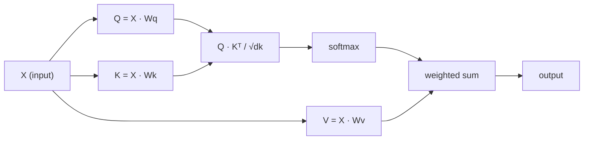

# 自从零开始注意自己
# 自注意力从零实现

> 关注是一个搜索表,每个字都会问"谁对我有什么关系?"

> 注意力是一张搜索表,其中每个词都在问"谁对我重要?"然后学会了答案.

> **【中文解读】**自我注意力是变压器的核心:Q*K^T 计算每个代币对其他代币的关注――理解Q/K/V的直觉是理解GPT/BERT的基础――

**Type:** Build | **类型:** 动手
**Language:**子**语言:**字符串
**Prerequisites:** Phase 3 (Deep Learning Core), Phase 5 Lesson 10 (Sequence-to-Sequence) | **前置知识:** 阶段 3（深度学习基础），阶段 5 第 10 课（序列到序列）
**Time:** ~90 minutes | **时间:** ~90 分钟

## 学习目标

- 实现从零开始的点产品自注意,仅使用NumPy,包括查询/关键/值预测和软max权重的总和
  仅使用NumPy 从零实现缩放点积自注意力,包括查询/键/值投影和软max加权求和
- 构建一个多头注意力层,分开头头,计算并行注意力,并连接结果
  构建多头注意力层,实现分头分分,并行注意力计算和结果拼接
- 追踪注意力矩阵如何捕获代币关系,并解释为什么按sqrt(d_k) 缩小可以防止软max 和
  追踪注意力矩阵如何捕获代币 关系,并解释为什么除以平方
- 应用因果掩饰,将双向注意力转换为自动降低 (解码器式) 的注意力
  应用因果掩码将双向注意力转换为自归 (自归) 注意力

## 问题 问题引入

通过RNN处理一个代币一次序列.到达代币50时,代币1的信息已经通过50个压缩步骤被压缩.长距离的依赖被压碎到固体尺寸的隐藏状态,这是一个瓶,没有多少LSTM门完全解决.

> 单个代币处理序列.当你到达第50个代币时,来自第1个代币的信息已经被压缩50次.

2014年巴哈达纳乌关注论文显示了解决方案:让解码器回顾每个编码器位置,决定哪些对当前步骤重要.但它仍然被绑定到RNN上.2017年的"注意力是你需要的"论文提出了一个更明确的问题:如果注意力是唯一的机制呢?没有重复.没有卷曲.只是注意力.

> 2014年巴哈达努注意力论文展示了修复方法:让解码器回顾编码器的每个位置,并决定对当前步骤有什么重要.但它仍然附加在2017年的"注意力是你需要的"论文中提出了一个更尖的问题:如果注意力是唯一的机制呢?没有循环.没有卷积.只有注意力.

随着自觉的注意力,一个连续的位置可以在一个平行步骤中照顾其他位置.

> 自注意让序列中的每个位置在单个并行步骤中关注所有其他位置. 这就是使变压器快速,可扩展并占主导地位的原因.

> **【中文解读】**转换器的革命性在于:完全放弃循环,只用注意力一个机制――自注意力让序列中的每个位置都能直接关注所有其他位置,一步到位――

## 概念的核心概念

### 数据库搜索类型

想象注意力是一个软的数据库搜索:

> 将注意力想象成软数据库查找:

```
Traditional database:
  Query: "capital of France"  -->  exact match  -->  "Paris"

Attention:
  Query: "capital of France"  -->  similarity to ALL keys  -->  weighted blend of ALL values
```

每个符号都产生三个向量:
- **Query (Q)**"我在找什么?"
  **查询 (Query, Q)**我在找什么?
- **Key (K)**"我含有什么?"
  **键 (Key, K)**"我包含什么?"
- **Value (V)**: "如果选出,我应该提供什么信息?"
  **值 (Value, V)**""如果被选中,我会提供什么信息?"

查询和所有键之间的点分数产生注意力分数.高分数意味着"这个键匹配我的查询".这些分数权重值.输出是权重的值.

> 查询与所有关键的点积产生注意分数.高分意味着"这个关键匹配我的查询".

> **【中文解读】**注意力数据库类比是理解Q/K/V的最佳方法.Q是"我在找什么",K是"我有什么",V是"我的实际内容" Q 和 K 的积分量量量量量匹配程度,软max 归结后作为权重,对V做加权求和.整个过程是一个可微的"软查找"操作.

> **【拓展：注意力机制在真实系统中的应用】** GPT 系列使用因果自注意力(每个代币只能看到前一个代币);BERT 使用双向自注意力(每个代币能看到所有代币);交叉注意力(跨越注意力)则在T5、稳定分散等模型中连接编码器和编码器──理解Q/K/V是理解所有这些变体的基础──

### 问,K,V计算

每个代币嵌入都通过三个学习的权重矩阵进行投影:

> 每个代币都通过三个学习权重矩阵进行投影:

```
Input embeddings (sequence of n tokens, each d-dimensional):

  X = [x1, x2, x3, ..., xn]       shape: (n, d)

Three weight matrices:

  Wq  shape: (d, dk)
  Wk  shape: (d, dk)
  Wv  shape: (d, dv)

Projections:

  Q = X @ Wq    shape: (n, dk)      each token's query
  K = X @ Wk    shape: (n, dk)      each token's key
  V = X @ Wv    shape: (n, dv)      each token's value
```

视觉上,一个标志:

> 对于一个标志:

```
             Wq
  x_i ------[*]------> q_i    "What am I looking for?"
       |
       |     Wk
       +----[*]------> k_i    "What do I contain?"
       |
       |     Wv
       +----[*]------> v_i    "What do I offer?"
```

### 关注矩阵

一旦你对所有代币有Q,K,V,注意力分数形成一个矩阵:

> 一旦你得到了所有标志的Q,K,V,注意力分数形成一个矩阵:

```
Scores = Q @ K^T    shape: (n, n)

              k1    k2    k3    k4    k5
        +-----+-----+-----+-----+-----+
   q1   | 2.1 | 0.3 | 0.1 | 0.8 | 0.2 |   <- how much q1 attends to each key
        +-----+-----+-----+-----+-----+
   q2   | 0.4 | 1.9 | 0.7 | 0.1 | 0.3 |
        +-----+-----+-----+-----+-----+
   q3   | 0.2 | 0.6 | 2.3 | 0.5 | 0.1 |
        +-----+-----+-----+-----+-----+
   q4   | 0.9 | 0.1 | 0.4 | 1.7 | 0.6 |
        +-----+-----+-----+-----+-----+
   q5   | 0.1 | 0.3 | 0.2 | 0.5 | 2.0 |
        +-----+-----+-----+-----+-----+

Each row: one token's attention over the entire sequence
```

### 为什么要缩小?
每次查询都会扫描键:每个行都会分分每个代币,软max将分数转换为权重,

```figure
attention-matrix
```

### 为什么要扩大规模?

如果dk=64,点产品可以在数十范围内,将软max推向渐变消失的区域.

> 如果dk=64,点积可能在几十的范围内,将软max推进消失的梯度区域──修复方法:除以平方.

```
Scaled scores = (Q @ K^T) / sqrt(dk)
```

这将值保持在软max产生有用的梯度范围.

> 这使得价值保持在软max 能产生有用的梯度范围.

> **【中文解读】**缩放因子1/sqrt(dk) 是一个关键但容易被忽视的细节――当维度 dk 较大时,点积的值会变得很大,导致软max 进入和区的输出接近一个热),梯度几乎为零――除在sqrt(dk) 将值拉回有效范围,保证训练稳定――

### 软max将分数转换为重量

软max将原始分数转换为每个行中的概率分布:

> 软max将原始分数转换为每行概率分布:

```
Raw scores for q1:   [2.1, 0.3, 0.1, 0.8, 0.2]
                            |
                         softmax
                            |
Attention weights:   [0.52, 0.09, 0.07, 0.14, 0.08]   (sums to ~1.0)
```

每个代币都有一个重量,说明要多少钱来看待其他代币.

> 现在每个代币都有一组权重,表示对其他代币的关注程度.

> **【拓展：注意力矩阵的可解释性】**注意力矩阵 (N×N) 是变形的可解释性研究的重要工具.通过可视化注意力权重,可以发现模型学到的语言模式:哪些符号之间有强烈关联.例如,代词"它"通常会高度关注其指代名词.

### 值的加权和值的加权和值的加权和值

每个代币的最终输出是所有值向量的权重总和:

> 每个代币的最终输出是所有值向量的加权和求:

```
output_i = sum( attention_weight[i][j] * v_j  for all j )

For token 1:
  output_1 = 0.52 * v1 + 0.09 * v2 + 0.07 * v3 + 0.14 * v4 + 0.08 * v5
```

### 完整的水线



一行公式:

> 一行公式:

```
Attention(Q, K, V) = softmax( Q @ K^T / sqrt(dk) ) @ V
```

## 建立它,实现它.
```figure
softmax-attention-scaling
```

## 建立它

### 步骤1:从零实现软max

软max将原始的 logits转换为概率.

> 软max 将原始的记录转换为概率.

```python
import numpy as np

def softmax(x):
    shifted = x - np.max(x, axis=-1, keepdims=True)
    exp_x = np.exp(shifted)
    return exp_x / np.sum(exp_x, axis=-1, keepdims=True)

logits = np.array([2.0, 1.0, 0.1])
print(f"logits:  {logits}")
print(f"softmax: {softmax(logits)}")
print(f"sum:     {softmax(logits).sum():.4f}")
```

### 步骤2: 缩小点积分注意力

取出Q,K,V矩阵,然后返回注意力输出加重矩阵.

> 核心函数──接收Q、K、V矩阵,返回注意力输出和权重矩阵──

```python
def scaled_dot_product_attention(Q, K, V):
    dk = Q.shape[-1]
    scores = Q @ K.T / np.sqrt(dk)
    weights = softmax(scores)
    output = weights @ V
    return output, weights
```

### 步骤3:学习投影的自我注意力类

具有Wq,Wk,Wv重量矩阵的全自注意模块,以Xavier式扩展启动.

> 一个完整的自注意模块,包含Wq、Wk、Wv权重矩阵,使用Xavier式缩小初始化.

```python
class SelfAttention:
    def __init__(self, d_model, dk, dv, seed=42):
        rng = np.random.default_rng(seed)
        scale = np.sqrt(2.0 / (d_model + dk))
        self.Wq = rng.normal(0, scale, (d_model, dk))
        self.Wk = rng.normal(0, scale, (d_model, dk))
        scale_v = np.sqrt(2.0 / (d_model + dv))
        self.Wv = rng.normal(0, scale_v, (d_model, dv))
        self.dk = dk

    def forward(self, X):
        Q = X @ self.Wq
        K = X @ self.Wk
        V = X @ self.Wv
        output, weights = scaled_dot_product_attention(Q, K, V)
        return output, weights
```

### 步骤4:用句子运行

创造一个句子的假嵌入,看看注意力重量.

> 为了一个句子创建伪嵌入,观察注意力权重.

```python
sentence = ["The", "cat", "sat", "on", "the", "mat"]
n_tokens = len(sentence)
d_model = 8
dk = 4
dv = 4

rng = np.random.default_rng(42)
X = rng.normal(0, 1, (n_tokens, d_model))

attn = SelfAttention(d_model, dk, dv, seed=42)
output, weights = attn.forward(X)

print("Attention weights (each row: where that token looks):\n")
print(f"{'':>6}", end="")
for token in sentence:
    print(f"{token:>6}", end="")
print()

for i, token in enumerate(sentence):
    print(f"{token:>6}", end="")
    for j in range(n_tokens):
        w = weights[i][j]
        print(f"{w:6.3f}", end="")
    print()
```

### 步骤5:用ASCII热力图可视化注意力

给角色绘制一个快速的视觉.

> 将注意力权重映射到字符以快速可视化.

```python
def ascii_heatmap(weights, tokens, chars=" ░▒▓█"):
    n = len(tokens)
    print(f"\n{'':>6}", end="")
    for t in tokens:
        print(f"{t:>6}", end="")
    print()

    for i in range(n):
        print(f"{tokens[i]:>6}", end="")
        for j in range(n):
            level = int(weights[i][j] * (len(chars) - 1) / weights.max())
            level = min(level, len(chars) - 1)
            print(f"{'  ' + chars[level] + '   '}", end="")
        print()

ascii_heatmap(weights, sentence)
```

## 用它实现框架

皮托尔奇的`nn.MultiheadAttention`它们是我们所构建的,加上多头分和输出投影:

> 皮托尔奇的`nn.MultiheadAttention`完全实现了我们构建的内容,

```python
import torch
import torch.nn as nn

d_model = 8
n_heads = 2
seq_len = 6

mha = nn.MultiheadAttention(embed_dim=d_model, num_heads=n_heads, batch_first=True)

X_torch = torch.randn(1, seq_len, d_model)

output, attn_weights = mha(X_torch, X_torch, X_torch)

print(f"Input shape:            {X_torch.shape}")
print(f"Output shape:           {output.shape}")
print(f"Attention weight shape: {attn_weights.shape}")
print(f"\nAttn weights (averaged over heads):")
print(attn_weights[0].detach().numpy().round(3))
```

关键区别:多头注意力并行运行多个注意力函数,每个具有自己的Q,K,V投影大小 dk = d_model / n_heads,然后连接结果. 这使模型可以同时关注不同的关系类型.

> 关键区别:多头注意力并行运行多头注意力函数,每个都有自己的Q、K、V投影,大小为dk = d_model / n_heads,然后拼接结果──这让模型可以同时关注不同类型的关系──

> **【中文解读】**皮托尔奇的`nn.MultiheadAttention`包装了我们从零实现的所有逻辑,加上多头分离和输出投影.多头注意力的优势在于让模型同时关注不同类型的关系.

> **【拓展：多头注意力的生物学类比】**多头注意力可以被类别为视觉皮层的多个特征检测器.就像V1区域的不同神经元分别检测边缘,方向,颜色一样,不同的注意力头学习捕捉不同类型的符号间关系. 研究表明,变化器的不同头确实学到了不同的语言模式:有关注相邻词,有关注句法依赖,有关注指代关系.

## 运送它.

这一课产生了:
- `outputs/prompt-attention-explainer.md`通过数据库搜索比喻解释注意力的提示

> 本课产生:
> - `outputs/prompt-attention-explainer.md` 通过数据库查找类比解释注意力的提示词

## 练习题

1. 修改`scaled_dot_product_attention`接受可选的面具矩阵,在软max之前设置某些位置为负无限 (因果/解码面具是这样工作的)
   修改`scaled_dot_product_attention`为了接受可选的掩码矩阵,在软max前将设定某些位置为负无穷 (这是因果/解码器掩码工作方式)

2. 从零开始实施多头注意力:分为Q,K,V`n_heads`按一下,将注意力运行到每个块,连接,然后通过最终的重量矩阵投射
   从零实现多头注意力:将Q、K、V 拆分为`n_heads`块,分别运行注意力,拼接,并通过最终权重矩阵 Wo 投影

3. 接下来,我们将两句相同长度的句子,通过同一 SelfAttention 实例来养它们,并比较它们的注意力模式.
   通过相同的自我注意力 实例,比较它们的注意力模式.

## 关键词 快速查找表

| Term | What people say / 人们怎么说 | What it actually means / 实际含义 |
|------|------------------------------|----------------------------------|
| Query (Q) | "The question vector" / "问题向量" | A learned projection of the input that represents what information this token is looking for. 输入的学习投影，表示这个 token 在寻找什么信息。 |
| Key (K) | "The label vector" / "标签向量" | A learned projection that represents what information this token contains, matched against queries. 学习投影，表示这个 token 包含什么信息，与查询匹配。 |
| Value (V) | "The content vector" / "内容向量" | A learned projection carrying the actual information that gets aggregated based on attention scores. 学习投影，携带根据注意力分数聚合的实际信息。 |
| Scaled dot-product attention | "The attention formula" / "注意力公式" | softmax(QK^T / sqrt(dk)) @ V — scaling prevents softmax saturation in high dimensions. softmax(QK^T / sqrt(dk)) @ V — 缩放防止高维时 softmax 饱和。 |
| Self-attention | "The token looks at itself and others" / "token 看自己和其他 token" | Attention where Q, K, V all come from the same sequence, letting every position attend to every other position. Q、K、V 都来自同一序列的注意力，让每个位置关注所有其他位置。 |
| Attention weights | "How much focus" / "多少关注" | A probability distribution over positions, produced by softmax over scaled dot products. 位置上的概率分布，由缩放点积上的 softmax 产生。 |
| Multi-head attention | "Parallel attention" / "并行注意力" | Running multiple attention functions with different projections, then concatenating results for richer representations. 使用不同投影运行多个注意力函数，然后拼接结果以获得更丰富的表示。 |

## 继续阅读 继续阅读

- [Attention Is All You Need (Vaswani et al., 2017)](https://arxiv.org/abs/1706.03762)原始变压器纸
  瓦斯瓦尼 等人(2017)  原始变压器 论文

- [The Illustrated Transformer (Jay Alammar)](https://jalammar.github.io/illustrated-transformer/)完整的建筑的最佳视觉通行
  杰伊·阿拉马尔的可视化变压器  最佳完整架构可视化讲解

- [The Annotated Transformer (Harvard NLP)](https://nlp.seas.harvard.edu/annotated-transformer/) 线后PyTorch实施,含解释
  哈佛NLP的注释版变压器  逐行 PyTorch 实现与解释

> **【拓展：Flash Attention 与注意力优化】**标准自理注意的O(N^2) 内存开销是长序列处理的瓶──Flash Attention(2022) 通过分块计算和重计算策略,在没有改变数学结果的情况下将内存复杂性降至O(N)──这在GPT-4的128K上下文窗口等实际应用中至关重要.
