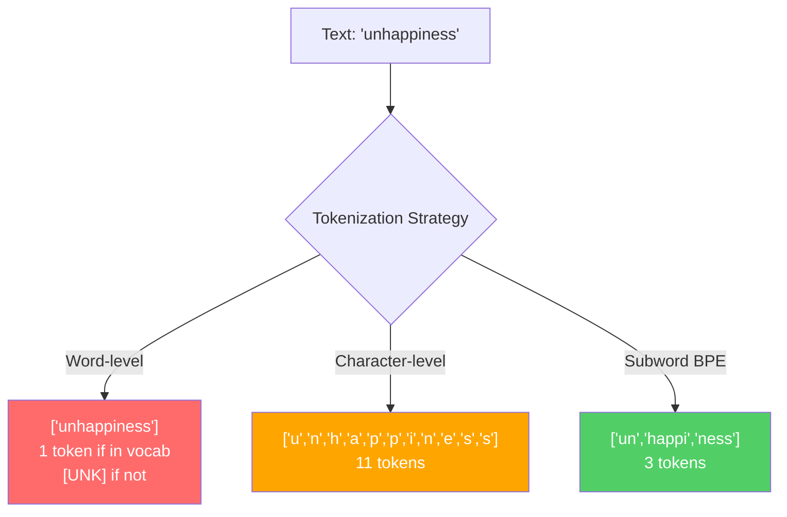
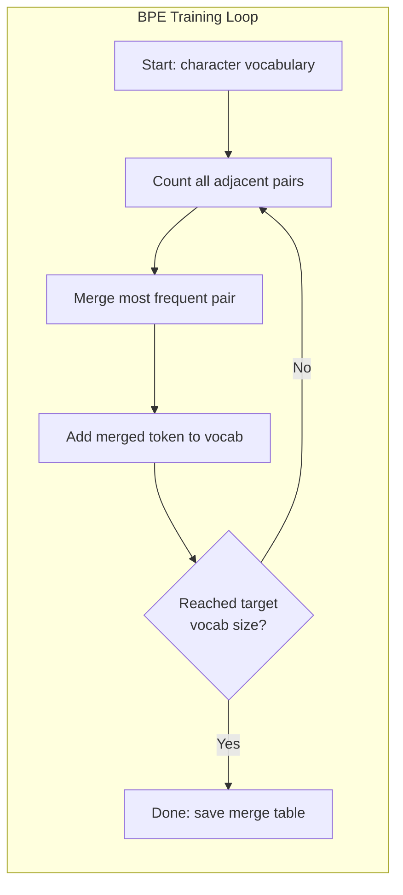
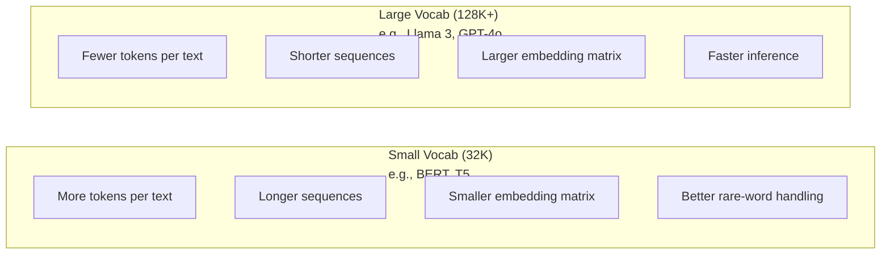

# 标记者:BPE,WordPiece,SentencePiece

> 您的LLM不读英语,它读整数. 代币器决定这些整数是否具有意义或浪费.

> **【中文解读】**语不读英文,它读整数――分词器决定这些整数是有意义还是浪费――子词分词 (中文字代码) 在词级和字符级之间找到平衡点:常见词保持完整,罕见词分为有意义的片段――GPT-4 用 BPE,Llama 用 SentencePiece――

> **【拓展：BPE→GPT系列】**开放AI的所有模型都使用BPE 分词器──tiktoken 是GPT 系列的分词器库──分词质量直接影响下文窗口利用率"不幸的是"拆分成4个代币对比1个代币,等于上文窗口缩水75%──

**Type:** Build
**Languages:** Python
**Prerequisites:** Phase 05 (NLP Foundations)
**Time:** ~90 minutes

## 学习目标

- 从零开始实施BPE,WordPiece和Unigram代码代码化算法,并比较它们的合并策略
  从零实现BPE、WordPiece 和 Unigram 分词算法,比较它们的合并策略
- 解释词汇大小如何影响模型效率:太小就会产生长序列,太大的废物会嵌入参数
  解释词表大小如何影响模型效率:太小产生长序列,太大浪费嵌入参数
- 分析跨语言和代码的代币化文物,确定特定代币化器在哪里分解
  分析跨语言和代码的分词边界情况,找出特定分词器的失效点
- 使用TikTok和句子图库来标记文字,并检查结果的标记ID
  使用tiktoken 和句子片 库分词文本并检查生成的代币ID

> **【中文解读】**本章的学习目标围绕分词器的四个维度:实现(手写BPE/WordPiece/Unigram 算法) 、理解(词表大小的工程权衡) 、分析(跨语言分词的边界情况) 、应用(符号/句子 工具库) ──分词是LLM管线的第一步,直接影响模型效率和成本──

## 问题 问题引入

你的法师不会读英语,不会读任何语言,只会读数字.

> 你的法师不读英文.

对于"世界好!"和"世界好!"之间的差距是代号符号.模型可以处理之前,每一个词,每一个空间,每一个分分符号都必须转换为整数.这种转换不是中立的.它将假设变成模型,之后不能撤销.

> "你好,世界!" 和 [15496, 11, 995, 0] 之间的桥梁就是分词器──每个词、每个空格、每个标点符号都必须转换为整数,模型才能处理──这种转换不是中性它将假设固化为模型,然后无法撤销──

错误的模型将浪费了编码的能力. "不幸的是"变成了四个代币,而不是一个. 你的128K文本窗口只会缩小75%因为文本重于多字母字母. 让它正确,同样的文本窗口含有两倍的含义. "这个模型处理代码很好"和"这个模型窒息在Python"之间的区别通常归结于代币器如何训练.

> 做错了,你的模型会浪费多个代币的容量 编码常见词语――"不幸的是"变成了四个代币而不是一个――你128K的下文窗口对多音节词密集的文本直接缩小了75%――做对应,同样上文窗口可以下载两倍的信息――"这个模型处理代码很好"和"这个模型在Python 上卡"的区别,往往取决于分词器是如何训练的――

每次你向GPT-4或Claude打出的API通话都以每个代币为价格.每一个代币你模型生成的代币都会计算成本.出口所需的代币越少,端到端推断就越快.代币化不是预处理.它是架构.

> 你每次调用GPT-4或克劳德的API都按代币计费的. 你模型生成的每个代币都消耗算力. 表示一个输出所需的代币越来越少,端到端推理就越来越快.分词不是预处理.

> **【中文解读】**分词不是简单的预处理步骤,而是模型架构的一部分. 每次调用GPT-4 API都按代币计费,每个代币的生成都消耗算力.

> **【拓展：API 定价与分词效率】**价格: 价格:$5/M input tokens、$通过GPT-2 分词器可能耗耗500个代币,GPT-4o的o200k_base 分词器只需要200个代币,成本差2.5倍. 这也是为什么Llama 3将将词表从32K扩展到128K降低非英语用户推理成本.

>  **【前置】**学本节前请先掌握:(1) 阶段 05(NLP基础) 理解文本的向量化表示、词嵌入基础;(2) Python 字典/counter与贪心算法实现模式;(3) UTF-8编码、Unicode 码点(码点) 与字节的关系;(4) 概率论基础频率统计与互信息――不熟悉这些会难以理解 BPE 的合并据判──

## 概念的核心概念

### 三种失败的方法 (一种赢得的方法)

转换文字为数字的三种方法,其中两个方法不适用于尺度.

> 文本转换为数字有三种明显的方法. 其中两个在大规模场景下无法工作.

**Word-level tokenization**它们分为空间和分字符. "猫坐了"变成了 ["The", "cat", "sat"].简单.但是"代码化"怎么样?或者"GPT-4o"?或者一个德国复合词,比如"Geschwindigkeitsbegrenzung"?字层需要一个巨大的词汇来涵盖每个语言的每一个词.错过一个词,你会得到可怕的`[UNK]`单独的英语有超过100万个单词形式. 添加代码,URL,科学符号,以及100种其他语言,你需要无限的词汇库.

> **词级分词**按空格和标点拆分. "猫坐了" 变成了 ["The", "cat", "sat"]──很简单.但是"代码化" 呢?GPT-4o" 呢?或德语复合词 "Geschwindigkeitsbegrenzung" 这?词级分词需要一个巨大的词表来覆盖每种语言的每个词.`[UNK]`仅仅英语就有超过一百万个词形――加上代码,URL,科学记号法和100种其他语言,你需要一个无限大的词表――

**Character-level tokenization**语文库很小 (几百个字符). 没有未知的代号. 但序列变得非常长. 一句句话是10个字符级代号变成50个字符级代号. 模型必须学到"t","h","e"一起意味着"the" - - 燃烧注意力能力在一个人学到3岁时的事情.

> **字符级分词**走向另一个极端──"你好" 变成 ["h", "e", "l", "l", "o"]──词表很小(几百个字符)──永远不会出现未知符号──但序列变得极长──一个10个字符级符号的句子变成50个字符级符号──模型必须学会"t",、"h"、"e"组合起来是"把注意力容量浪费在人类三岁就学会的事情上──

**Subword tokenization**找出甜点.常见的单词保持整体: "the"是一个标志.罕见的单词分解成有意义的部分:"不快乐"变成 ["un","happy","ness"].词汇保持可管理 (30K到128K标志).序列保持短.未知的标志基本上消失,因为任何单词都可以从子词的部分构建.

> **子词分词**找到了最佳平衡点──常见词保持完整:"the" 是一个标志──罕见词分解为有意义的片段:"不快乐" 变成 ["un", "happy", "ness"]──词表保持可控范围(30K到128K 个标志)──序列保持简短──未知标志 基本消失,因为任何词都可以由子词片段构建──

> **【中文解读】**词级分词) 问题是词表爆炸英语有百万级词形,加上代码、URL、科学记数法和其他语言,词表会无限增长──字符级分词) 虽然词表小,但序列太长,模型要学会"t"+"h"+"e"组合为"the",浪费注意力容量──子词分词在两者之间取得平衡:常见词保持完整,罕见词分为有意义的片段──

>  **【类比】**分词器像"乐高积木分类工厂":常见词("the") 做成整块大积木直接用,罕见词("不快乐") 分成"un"+"happy"+"ness" 三块标准小积木拼起来;;词级是只卖整块定制积木(漏货就崩),字符级是只卖单个原点(拼一句话要100个);;BPE是"高频组合自动包装成块",自适应找到成本与表达力的平衡点;;

每个现代的LLM都使用子词代号化.GPT-2,GPT-4,BERT,Llama3,Claude.

> 每个现代的LLM都使用子词分词――GPT-2、GPT-4、BERT、Llama 3、Claude全都如此――问题在于使用哪种算法――



### 字节对编码

果是一个贪的压缩算法, 为了代码化, 这个想法是足够简单的,

> BPE是一种重新使用分词的贪心压缩算法.

开始单个字符,计算训练组中的每一个相邻的对,将最频繁的对合并到一个新的代币,重复直到你达到目标词汇尺寸.

> 从单个字符开始――统计训练语料中所有相邻字符对的出现频率――将最高频率对合并为新代币――重复直到达到目标词表大小――
```figure
tokenizer-bpe
```

这里是BPE在一个小的体积上运行的"低","低"和"最新"的单词:

```
Corpus (with word frequencies):
  "lower"  x5
  "lowest" x2
  "newest" x6

Step 0 -- Start with characters:
  l o w e r       (x5)
  l o w e s t     (x2)
  n e w e s t     (x6)

Step 1 -- Count adjacent pairs:
  (e,s): 8    (s,t): 8    (l,o): 7    (o,w): 7
  (w,e): 13   (e,r): 5    (n,e): 6    ...

Step 2 -- Merge most frequent pair (w,e) -> "we":
  l o we r        (x5)
  l o we s t      (x2)
  n e we s t      (x6)

Step 3 -- Recount and merge (e,s) -> "es":
  l o we r        (x5)
  l o we s t      (x2)    <- 'es' only forms from 'e'+'s', not 'we'+'s'
  n e we s t      (x6)    <- wait, the 'e' before 'we' and 's' after 'we'

Actually tracking this precisely:
  After "we" merge, remaining pairs:
  (l,o): 7   (o,we): 7   (we,r): 5   (we,s): 8
  (s,t): 8   (n,e): 6    (e,we): 6

Step 3 -- Merge (we,s) -> "wes" or (s,t) -> "st" (tied at 8, pick first):
  Merge (we,s) -> "wes":
  l o we r        (x5)
  l o wes t       (x2)
  n e wes t       (x6)

Step 4 -- Merge (wes,t) -> "west":
  l o we r        (x5)
  l o west        (x2)
  n e west        (x6)

...continue until target vocab size reached.
```

合并表是代码符号.为了编码新文本,应用合并按照学习的顺序.培训组确定哪些合并存在,而这种选择永久地塑造模型看到的东西.

> 合并表就是分词器.编码新文本时,按学习顺序应用合并.训练语料决定了哪些合并存在,这个选择永久塑造了模型看到的内容.

> **【中文解读】**BPE的核心训练循环:从单个字符开始,统计所有相邻字符对的出现频率,将最高频率对合并为新代币,重复直到达到目标词表大小――合并表(合并表) 就是分词器本身──编码新文本时,按训练时学到的顺序顺序应用合并规则顺序很重要,因为合并1可能产生"th",合并5才能在"th"+"e"基础上产生"the"──

> **【拓展：BPE 的压缩原理】**在生产环境中,Tiktoken在Rust实现了BPE,编码速度可达每秒数百万代币――GPT-4的cl100k_base编码器在数百GB文本上训练了约10万次合并――

> ️ **【易错点】**手写 BPE 三个常见虫:(1) **忘了每次合并后重新计数**直接在初始对数上循环,导致合并"我们"后还在旧频次选 (e,s),结果合并表全是噪音;(2) **合并顺序错乱**编码时必须按训练时学到的结合级别 严格从低到高应用,先合并"th" 再合并"the",颠倒会得到完全不同的代币;**未做预分词（pre-tokenization）**直接在整个语料上做BPE,会出现"e c" (猫) 中的跨词合并),训练出无意义的跨词代币――修复:使用GPT-2的正则先切成词片段,每段独立做BPE――



### 字节级BPE (GPT-2,GPT-3,GPT-4)

标准BPE使用Unicode字符.字节级BPE使用原始字节 (0-255).这为您提供了精确的256个基础词汇,处理任何语言或编码,从来没有产生未知的代币.

> 标准BPE操作 字符――字节级BPE操作原始字节(0-255) ―― 这给你一个恰好的 256 个基础词表,能处理任何语言或编码,永远不会产生未知的代币――

基词库涵盖每一个可能的字节.BPE 融合在此基础上.OpenAI的TikToken库使用以下字节级BPE实现:

> GPT-2 引入了这种方法――基础词表覆盖每个可能的字节――BPE 合并在其上构建――OpenAI的标库实现字节级 BPE,词表大小如下:

> **【中文解读】**字节级BPE(字节级BPE) 是GPT-2引入的关键创新――传统BPE操作Unicode字符,而字节级BPE直接操作原始字节(0-255),基础词表恰好 256个,理论上可处理任何语言或编码,永远不会出现[UNK]代币――这就是为什么GPT 系列模型能够处理代码,emoji、多语言混合文本而不会"卡住"――

>  **【困惑】**问:为什么BPE的合并顺序如此关键?训练好的分词器能"修改"吗? A:合并顺序就是分词器的"程序"编码时必须严格按照训练时学到的级别从小到大应用:若级别=5是"th",rank=100是"the",遇到"时先合成"th",再合成"the"――任意颠倒或单独跳过某步会产生不同的标志序列――生产中**不要修改合并表**由于它和模型的嵌入 矩阵强绑定 改变一个代币的ID,模型会输出乱码――需要改变词表只能重训分词器 +重训模型嵌入――

- 其他: 其他: 其他:
- 基因代码 (GPT-3.5/GPT-4: ~100,256个代码 (cl100k_base编码)
- 其他类型: 子,子,子,子,子,子,子,子,子,子,子,子,子,子,子,子,子,子,子,子,子,子,子,子,子,子,子,子,子,子,子,子,子,子,子,子,子,子,子,子,子,子,子,子,子,子,子,子,子,子,子,子,子,子,子,子,子,子,子,子,子,子,子,子,子,子,子,子,子,子,子,子,子,子,子,子,子,子,子,子,子,子,子,子,子,子,子,子,子,子,子,子,子,子,子,子,子,子,子

### 字体 (BERT)

虽然WordPiece与BPE相似,但选择的融合不同.

> 字体看起来类似于BPE,但选择合并的方式不同. 它不使用原始频率,而是最大化训练数据的似然:

```
BPE merge criterion:      count(A, B)
WordPiece merge criterion: count(AB) / (count(A) * count(B))
```

语:BPE问:"哪个对出现最频繁?"WordPiece问:"哪个对出现在一起比你偶然想象的更频繁?"这种微妙的差异产生不同的词汇.WordPiece喜欢合并,而不是只是频繁的合并.

> 字片 字片 字片 字片 字片 字片 字片 字片 字片 字片 字片 字片 字片 字片 字片 字片 字片 字片 字符 字符 字符 字符 字符 字符 字符 字符 字符 字符 字符 字符 字符 字符 字符 字符 字符 字符 字符 字符 字符 字符 字片 字片 字片 字片 字片 字片 字片 字片 字片 字片 字片 字片 字片 字片 字片 字片 字片 字片 字片 字片 字片 字片 字片 字片 字片 字片 字片 字片 字片 字片 字片 字片 字片 字片 字片 字片 字片 字片 字片 字片 字片 字片 字片 字片 字片 字片 字片 字片 字片 字片 字片 字片 字片 字片 字片 字片 字片 字片 字片 字片 字片 字片 字片 字片 字片 字片 字片 字片 字片 字片 字片 字片 字片 字片 字片 字片 字片 字片 字片 字片 字片 字片 字 字 字 字片 字 字 字 字 字 字 字 字 字 字 字 字 字 字 字 字 字 字 字 字 字 字 字 字 字 字 字 字 字 字 字 字 字 字 字 字 字 字 字 字 字 字 字 字 字 字 字 字 字 字 字 字 字 字 字 字 字 字 字 字 字 字 字 字 字 字 字 

字体Piece也使用"##"前为延续子词:

> 字片还使用"##" 前标记续接子词:

```
"unhappiness" -> ["un", "##happi", "##ness"]
"embedding"   -> ["em", "##bed", "##ding"]
```

首尾号"##"告诉你,这个部分继续前一个代币.BERT使用WordPiece,其词汇总数为30522代币.每一个BERT变体--DistilBERT,RoBERTa的代币符号实际上是BPE,但BERT本身是WordPiece.

> "##" 前告诉你这个段子续接前一个代币――BERT 使用WordPiece,词表为30,522个代币――每个BERT 变体DistilBERT,RoBERTa的分词器实际上是BPE,但BERT本人是WordPiece――

### 句子 (拉马,T5)

语句Piece将输入作为包括白色空间在内的单元码字符的原始流.没有预代码化步骤.没有语言特定的语文规则关于词界限.这使其真正的语言无知 - 它在中文,日本,泰语和其他语言上运行,空间不分离单词.

> 文本版将输入视为原始的 Unicode 字符流,包括空格.没有预分词步骤.没有关于词边界的特定语言规则.

语句Piece支持两个算法:

> 支持两种算法:

- **BPE mode**:与标准BPE相同的融合逻辑,适用于原始字符序列
  翻译: 中文**BPE 模式**类似于标准BPE的合并逻辑,应用于原始字符序列
- **Unigram mode**开始用大量的词汇,并反复删除影响总体概率最小的代币.
  翻译: 中文**Unigram 模式**从大词表开始,代移除对整体的象征,影响最小的象征.

拉马2使用SentencePiece BPE,其词汇总数为32,000个代币.T5使用SentencePiece Unigram,其代币数为32,000个.注:拉马3转换为基于TikTok的字节级BPE代币,其代币数为128,256.

> 拉马2 使用SentencePiece BPE,词表为32,000个代币――T5 使用SentencePiece Unigram,词表为32,000个代币――注意:拉马3 切换到了基于TikToken的字节级 BPE 分词器,词表为128,256个代币――

> **【中文解读】**文文片的独特之处在于它将输入作为原始的Unicode字符流 (包括空格),不做任何语言的预分词. 这使其在中文、日文、泰文等中不使用空格分隔词语的语言表现得很好. 它支持两种算法:BPE模式 (自底上合并) 和 Unigram模式 (自顶向下剪枝) ⋅Llama 2 用文文文片BPE32K词表),而Llama 3 已切换到TikToken级风格的字节BPE(128K词表) ⋅

> **【拓展：SentencePiece 在开源模型中的地位】**谷歌 T5(110亿参数) ‧Llama 2(7B-70B) ‧Mistral 7B等开源模型都使用SentencePiece──它的优势在于语言无关性 与一个分词器可以处理100多种语言而不需要任何语言特定的预处理规则──.

### 词汇尺寸交易

这是一个真正的工程决定,

> 这是一个可衡量的实际工程决策.



具体数字.对于一个128K词汇库,包含4,096维嵌入,嵌入矩阵本身是128,000 x4,096 =52400万参数.对于一个32K词汇库,它是13100万参数.这仅仅是代币选择的400M参数差异.

> 具体数字――对于128K词表和4,096维嵌入,仅嵌入矩阵就有128,000 x4,096 =5.24亿参数――对于32K词表,则是1.31亿参数――仅分词器选择就带来了400亿参数的差异――

但更大的词汇库更积极地压缩文本.同一个英语段落需要100个代币,32K的词汇库可能需要70个代币,128K的词汇库.这意味着在生成过程中 30%的前进传递减少.对于一个服务于数百万请求的模型,这是直接降低计算成本.

> 但更大的词表更积极地缩写文本. 32K词表可能需要100个代币, 128K词表可能只需要70个代币. 这意味着产生时减少30%的前向传播.

趋势很明显:词汇规模正在增加.GPT-2使用了50.257.GPT-4使用了100K.Llama 3使用了128K.GPT-4o使用了200K.

> 趋势很明确:词表大小在增长――GPT-2 用50.257――GPT-4 用约100K――Llama 3 用128K――GPT-4o 用200K――

| Model | Vocab Size | Tokenizer Type | Avg Tokens per English Word |
|-------|-----------|----------------|---------------------------|
| BERT | 30,522 | WordPiece | ~1.4 |
| GPT-2 | 50,257 | Byte-level BPE | ~1.3 |
| Llama 2 | 32,000 | SentencePiece BPE | ~1.4 |
| GPT-4 | ~100,256 | Byte-level BPE | ~1.2 |
| Llama 3 | 128,256 | Byte-level BPE (tiktoken) | ~1.1 |
| GPT-4o | 200,019 | Byte-level BPE | ~1.0 |

### 多语言税

韩国语的语文在GPT-2的语文中平均每字有2-3个代币.中国语可能更糟糕. 这意味着韩国用户实际上有一个背景窗口,大小是英语用户的一半 - - 支付相同的价格,以减少信息密度.

> 韩文在GPT-2 分词器中平均每字有2-3个标记――中文可能更糟糕――这意味着韩文用户有效上下文窗口只有英文用户的一半支付相同的价格,信息密度却更低――

这就是为什么Llama 3从32K增加到128K的词汇库.更多的代币用于非英语脚本意味着语言之间的压缩更公平.

> 这就是为什么Llama 3将词表从32K扩大到128K的原因.

> **【中文解读】**多语言税 (多语言税) 是分词器设计中最容易被忽视的公平性问题.例如,韩文平均每词需要2-3个代币,中文可能更糟.这意味着韩文/中文用户有效上下文窗口只有英文用户的一半付相同的价格,获取信息密度更低.

> **【拓展：多语言分词的实际影响】**在GPT-3.5的cl100k_base 分词器中,一段1000字的中文大约需要~1500个代币,而等量英语信息可能只需要~500个代币.这意味着中文用户的API成本是英语用户的3倍.Llama 3的128K字表将提高中文代币效率约两倍,但与英语相比仍然存在差距.这也是为什么Qwen,DeepSeek等国产模型专门针对中文分词器的原因.

## 建立它,实现它.
```figure
tokenizer-tradeoff
```

## 建立它

### 步骤1:字符级标记器

开始从基础上.一个字符级代码符号将每个字符映射到其Unicode代码点.没有培训.没有未知的代码.只是直接映射.

> 从基础开始──字符级分词器将每个字符映射到其Unicode码点──无需训练──无未知的代币──只是直接映射──

```python
class CharTokenizer:
    def encode(self, text):
        return [ord(c) for c in text]

    def decode(self, tokens):
        return "".join(chr(t) for t in tokens)
```

每个字符都是自己的符号.这是我们改进的基线.

> "你好"变成了 [104, 101, 108, 108, 111]──每个字符都是自己的标志────────────────────────────────────────────────────────────────────────────────────────────────────────────────────────────────────────────────────────────────────────────────────────────────────────────────────────────────────────────────────────────────────────────────────────────────────────────────────────────────────────────────────────────────────────────────────────────────────────────────────────────────────────────────────────────────────────────────────────────────────────────────────────────────────────────────────────────────────────────────────────────────────────────────────────────────────────────────────────────────────────────────────────────────────────────────────────────────────────────────────────────────────────────────────────────────────────────────────────────────────────────────────────────────────────────────────────────────────────────────────────────────────────────────────────────────────────────────────────────────────────────

### 步骤 2:从零开始的BPE标记器

我们训练在原始字节 (如GPT-2),数对,合并最频繁的,并记录每个合并顺序.合并表是代币.

> 实际实现──我们在原始字节上训练(如GPT-2),统计对频率,合并最高频率,并按顺序记录每次合并──合并表就是分词器──

```python
from collections import Counter

class BPETokenizer:
    def __init__(self):
        self.merges = {}
        self.vocab = {}

    def _get_pairs(self, tokens):
        pairs = Counter()
        for i in range(len(tokens) - 1):
            pairs[(tokens[i], tokens[i + 1])] += 1
        return pairs

    def _merge_pair(self, tokens, pair, new_token):
        merged = []
        i = 0
        while i < len(tokens):
            if i < len(tokens) - 1 and tokens[i] == pair[0] and tokens[i + 1] == pair[1]:
                merged.append(new_token)
                i += 2
            else:
                merged.append(tokens[i])
                i += 1
        return merged

    def train(self, text, num_merges):
        tokens = list(text.encode("utf-8"))
        self.vocab = {i: bytes([i]) for i in range(256)}

        for i in range(num_merges):
            pairs = self._get_pairs(tokens)
            if not pairs:
                break
            best_pair = max(pairs, key=pairs.get)
            new_token = 256 + i
            tokens = self._merge_pair(tokens, best_pair, new_token)
            self.merges[best_pair] = new_token
            self.vocab[new_token] = self.vocab[best_pair[0]] + self.vocab[best_pair[1]]

        return self

    def encode(self, text):
        tokens = list(text.encode("utf-8"))
        for pair, new_token in self.merges.items():
            tokens = self._merge_pair(tokens, pair, new_token)
        return tokens

    def decode(self, tokens):
        byte_sequence = b"".join(self.vocab[t] for t in tokens)
        return byte_sequence.decode("utf-8", errors="replace")
```

训练循环是BPE的核心:数对,合并赢家,重复.每次合并都减少了全部代币数量.`num_merges`字母数量从256个 (基字节) 增加到256个+数_合并.

> 训练循环是BPE的核心:统计对频率,合并胜者,重复.`num_merges`轮后,词表从256基础字节) 增长到256+数_合并──

编码应用合并在它们所学到的确切顺序中.这很重要.如果合并1创建"th"并合并5创建"the",编码必须首先应用合并1以便"the"可以从"th" +"e"在合并5中形成.

> 编码按学习的确切顺序应用合并――这很重要――如果合并1 创建"th",合并5 创建"the",编码必须先应用合并1,这样"the"才能在合并5 中由"th" +"e"形成――

解码是相反的:查看词汇中的每个代币ID,连接字节,解码到UTF-8.

> 解码是逆过程:在词表中查找每个代币ID,拼接字节,解码为 UTF-8──

### 步骤3: 编码和解码回路

```python
corpus = (
    "The cat sat on the mat. The cat ate the rat. "
    "The dog sat on the log. The dog ate the frog. "
    "Natural language processing is the study of how computers "
    "understand and generate human language. "
    "Tokenization is the first step in any NLP pipeline."
)

tokenizer = BPETokenizer()
tokenizer.train(corpus, num_merges=40)

test_sentences = [
    "The cat sat on the mat.",
    "Natural language processing",
    "tokenization pipeline",
    "unhappiness",
]

for sentence in test_sentences:
    encoded = tokenizer.encode(sentence)
    decoded = tokenizer.decode(encoded)
    raw_bytes = len(sentence.encode("utf-8"))
    ratio = len(encoded) / raw_bytes
    print(f"'{sentence}'")
    print(f"  Tokens: {len(encoded)} (from {raw_bytes} bytes) -- ratio: {ratio:.2f}")
    print(f"  Roundtrip: {'PASS' if decoded == sentence else 'FAIL'}")
```

压缩比告诉你代币器是多有效的. 标记符将文字压缩到原始字节的半个标记. 低点更好. 在训练中,比率将是好的. 在未发行的文本上,例如"不快乐" (它不出现在体内), 比率会更糟糕 - - 代币器回归于字符级编码,

> 压缩比告诉你分词器的效率――比率0.50意味着分词器将文本压缩到原始字节数量的一半――越低越好――在训练语料上,比率会很好――在分布外文文中,如"不快乐" (不出现在语料中) 则比率会更差分词器对未见模式返回字符级编码――

### 步骤 4:与TikTok进行比较

```python
import tiktoken

enc = tiktoken.get_encoding("cl100k_base")

texts = [
    "The cat sat on the mat.",
    "unhappiness",
    "Hello, world!",
    "def fibonacci(n): return n if n < 2 else fibonacci(n-1) + fibonacci(n-2)",
    "Geschwindigkeitsbegrenzung",
]

for text in texts:
    our_tokens = tokenizer.encode(text)
    tiktoken_tokens = enc.encode(text)
    tiktoken_pieces = [enc.decode([t]) for t in tiktoken_tokens]
    print(f"'{text}'")
    print(f"  Our BPE:   {len(our_tokens)} tokens")
    print(f"  tiktoken:  {len(tiktoken_tokens)} tokens -> {tiktoken_pieces}")
```

tiktoken 使用相同的算法,但在100,000次合并中训练了数百个千兆字节的文本.算法是相同的.区别在于训练数据和合并数量.你的代币器训练在40次合并的段落上不能与 tiktoken的100K合并在一个巨大的体积上竞争.但机制是一样的.

> tiktoken 使用完全相同的算法,但在数百GB文本上训练了10万次合并――算法完全一样――区别在于训练数据和合并次数――你在一段文本上训练40次合并的分词器无法与 tiktoken在大规模语文上100万次合并竞争――但机制是相同的――

### 步骤5:词汇分析

```python
def analyze_vocabulary(tokenizer, test_texts):
    total_tokens = 0
    total_chars = 0
    token_usage = Counter()

    for text in test_texts:
        encoded = tokenizer.encode(text)
        total_tokens += len(encoded)
        total_chars += len(text)
        for t in encoded:
            token_usage[t] += 1

    print(f"Vocabulary size: {len(tokenizer.vocab)}")
    print(f"Total tokens across all texts: {total_tokens}")
    print(f"Total characters: {total_chars}")
    print(f"Avg tokens per character: {total_tokens / total_chars:.2f}")

    print(f"\nMost used tokens:")
    for token_id, count in token_usage.most_common(10):
        token_bytes = tokenizer.vocab[token_id]
        display = token_bytes.decode("utf-8", errors="replace")
        print(f"  Token {token_id:4d}: '{display}' (used {count} times)")

    unused = [t for t in tokenizer.vocab if t not in token_usage]
    print(f"\nUnused tokens: {len(unused)} out of {len(tokenizer.vocab)}")
```

这显示了你的词汇中的Zipf分布.几个代币占主导地位 (空间,"the","e").大多数代币很少被使用.生产代币器优化这种分布 - - 常见模式得到了短代币ID,罕见模式得到了更长的表示.

> **【中文解读】**词表分析揭示了Zipf 分布规则:少数代币占用绝大多数的使用量 (如空格"",the"、"e"),大多数代币很少被使用.

> **【拓展：生产环境的词表优化】**在GPT-4o的o200k_base词表中,有200,019个代币,但最常用的1000个代币覆盖日常英文文本的出现频率约为80%──在部署LLM时,嵌入矩阵的大小直接由词表决定:128K词表 x 4096维 =5.24亿参数,仅嵌入层就占据了约2GB的显存储(FP16)──

## 用它实现框架

你的子BPE工作了.现在看看生产工具是什么样子.

> 你的BPE实现可以工作了.现在看看生产工具是什么样子.

### 投资者

```python
import tiktoken

enc = tiktoken.get_encoding("cl100k_base")

text = "Tokenizers convert text to integers"
tokens = enc.encode(text)
print(f"Tokens: {tokens}")
print(f"Pieces: {[enc.decode([t]) for t in tokens]}")
print(f"Roundtrip: {enc.decode(tokens)}")
```

标用Python绑定编写了Rust. 它每秒编码数百万个代币. 同样的BPE算法,工业强度实现.

> 果版 果版 果版 果版 果版 果版 果版 果版 果版 果版 果版 果版 果版 果版 果版 果版 果版 果版 果版 果版 果版 果版 果版 果版 果版 果版 果版 果版 果版 果版 果版 果版 果版 果版 果版 果版 果版 果版 果版 果版 果版 果版 果版 果版 果版 果版 果版 果版 果版 果版 果版 果版 果版 果版 果版 果版 果版 果版 果版 果版 果版 果版

### 拥抱脸标记器

```python
from tokenizers import Tokenizer
from tokenizers.models import BPE
from tokenizers.trainers import BpeTrainer
from tokenizers.pre_tokenizers import ByteLevel

tokenizer = Tokenizer(BPE())
tokenizer.pre_tokenizer = ByteLevel()

trainer = BpeTrainer(vocab_size=1000, special_tokens=["<pad>", "<eos>", "<unk>"])
tokenizer.train(["corpus.txt"], trainer)

output = tokenizer.encode("The cat sat on the mat.")
print(f"Tokens: {output.tokens}")
print(f"IDs: {output.ids}")
```

抱脸代币库也是Rust下帽子. 它在几秒钟内训练BPE在千兆尺度的体体.

> 拥抱面孔代币器 库底层也是化. 它可以在几秒内训练 GB 级语料上的 BPE.

### 装载拉马的标记器

```python
from transformers import AutoTokenizer

tokenizer = AutoTokenizer.from_pretrained("meta-llama/Llama-3.1-8B")

text = "Tokenizers are the unsung heroes of LLMs"
tokens = tokenizer.encode(text)
print(f"Token IDs: {tokens}")
print(f"Tokens: {tokenizer.convert_ids_to_tokens(tokens)}")
print(f"Vocab size: {tokenizer.vocab_size}")

multilingual = ["Hello world", "Hola mundo", "Bonjour le monde"]
for text in multilingual:
    ids = tokenizer.encode(text)
    print(f"'{text}' -> {len(ids)} tokens")
```

拉马3的128K词汇库压缩了非英语文本,比GPT-2的50K词汇库要好得多.你可以自己验证这一点,

> 拉马3的128K词表缩写非英语文本比GPT-2的50K词表好得多――你可以自验证用多种语言编码同一个句子并计算代币数――

## 运送它.

这一课产生了`outputs/prompt-tokenizer-analyzer.md`-- 一个可重复使用的提示,分析任何文本和模型组合的代币化效率. 给它一个文本样本,它告诉你哪个模型的代币化器处理它最好.

> 本课产出发 `outputs/prompt-tokenizer-analyzer.md`可复制的提示,分析任意文本和模型组合的分词效率.

## 练习题

1. 修改BPE标记器以在每个 merge步骤中打印词汇.观察"t" + "h"如何成为"th",然后"th" + "e"成为"the".追踪普通英语词汇如何逐步组装.
   中文翻译:修改 BPE 分词器,在每次合并步骤打印词表――观察"t" + "h" 如何变成"th",然后"th" + "e" 如何变成"the"――追踪常见英文词汇如何被逐步组装――

2. 添加特殊代币 (`<pad>`现在`<eos>`现在`<unk>`) 给BPE代币器. 赋予他们0 ,1,2的ID,并相应地移动所有其他代币. 在运行BPE之前,执行预代币化步骤,在白空间上分开.
   中文翻译:向 BPE 分词器添加特殊标志(`<pad>`,我知道.`<eos>`,我知道.`<unk>`实现一个在运行BPE前按空格分拆的预分词步骤.

3. 执行WordPiece合并标准 (概率比率而不是频率).训练BPE和WordPiece在同一组合中使用相同数量的合并.比较结果的词汇库 - 哪个产生更有语言意义的子词?
   中文翻译:实现 WordPiece 合并标准(似然比替代频率) ・在相同语料上使用相同合并次数训练 BPE 和 WordPiece。比较生成的词表哪个产生更有语言学意义的子词?

4. 建立一个多语言代币器效率基准.用英语,西班牙语,中国,韩语和阿拉伯语进行10句子.用Tik Token (cl100k_base) 代币每个字符,并测量每字符的平均代币.量化每个语言的"多语言税".
   中文翻译:构建多语言分词效率基准――取英文、西班牙文、中文、韩文和阿拉伯文各10个句子――使用tiktoken(cl100k_base) 分词并测量每字符平均标志 数――量化每种语言的"多语言税"――

5. 训练你的BPE标记器在更大的体积上 (下载维基百科文章).调整合并数量以达到相同文本上的10%的压缩比率.这迫使你了解体积,合并数量和压缩质量之间的关系.
   中文翻译:在更大的语料上训练 BPE 分词器(下载一篇维基百科文章) 』调整并次数使压缩比在相同文本上与TikTok相差不超过10%──这让你理解语料大小、合并次数和压缩质量之间的关系──

## 关键词 快速查找表

| Term | What people say | What it actually means | 中文释义 |
|------|----------------|----------------------|---------|
| Token | "A word" | A unit in the model's vocabulary -- could be a character, subword, word, or multi-word chunk | 词元，模型词表中的基本单元 |
| BPE | "Some compression thing" | Byte Pair Encoding -- iteratively merge the most frequent adjacent pair of tokens until the target vocabulary size is reached | 字节对编码，贪心合并最高频相邻对 |
| WordPiece | "BERT's tokenizer" | Like BPE but merges maximize the likelihood ratio count(AB)/(count(A)*count(B)) instead of raw frequency | 基于似然比的子词分词，BERT 使用 |
| SentencePiece | "A tokenizer library" | A language-agnostic tokenizer that operates on raw Unicode without pre-tokenization, supporting BPE and Unigram algorithms | 语言无关的分词库，支持 BPE/Unigram |
| Vocabulary size | "How many words it knows" | The total number of unique tokens: GPT-2 has 50,257, BERT has 30,522, Llama 3 has 128,256 | 词表大小，直接影响嵌入矩阵参数量 |
| Fertility | "Not a tokenizer term" | Average number of tokens per word -- measures tokenizer efficiency across languages (1.0 is perfect, 3.0 means the model works three times harder) | 生育率，每词平均 token 数，衡量分词效率 |
| Byte-level BPE | "GPT's tokenizer" | BPE operating on raw bytes (0-255) instead of Unicode characters, guaranteeing no unknown tokens for any input | 字节级 BPE，基础词表恰好 256 个字节 |
| Merge table | "The tokenizer file" | Ordered list of pair merges learned during training -- this IS the tokenizer, and order matters | 合并表，训练学到的有序合并规则 |
| Pre-tokenization | "Splitting on spaces" | Rules applied before subword tokenization: whitespace splitting, digit separation, punctuation handling | 预分词，子词分词前的规则化拆分 |
| Compression ratio | "How efficient the tokenizer is" | Tokens produced divided by input bytes -- lower means better compression and faster inference | 压缩比，token 数/输入字节数，越低越好 |

## 继续阅读 继续阅读

- [Sennrich et al., 2016 -- "Neural Machine Translation of Rare Words with Subword Units"](https://arxiv.org/abs/1508.07909)-- 引入了BPE为NLP的论文,将1994年的压缩算法变成现代代币化的基础
- [Kudo & Richardson, 2018 -- "SentencePiece: A simple and language independent subword tokenizer"](https://arxiv.org/abs/1808.06226)--使多语言模型成为实用的语言认知标记
- [OpenAI tiktoken repository](https://github.com/openai/tiktoken)--生产BPE实现在Rust with Python绑定中,使用GPT-3.5/4/4o
- [Hugging Face Tokenizers documentation](https://huggingface.co/docs/tokenizers)-- 具有性性能的生产级代币器培训
