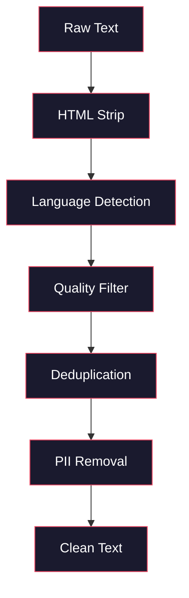
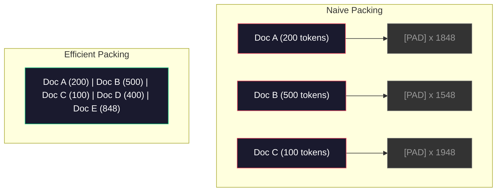

# 预训练数据管线

> 模型是镜子,它反映出你给它提供的数据,它给它垃圾,它反映垃圾,完全流利.

> **【中文解读】**模型是一个面镜子,忠实反映你给出的数据.预训数据管线包括:去重量,语言检测,内容过,流式分词,分块,打乱和批量处理.所有操作都必须在TB级数据上完成,没有加载到内存的情况下.

> **【拓展：数据质量→GPT-4/Claude】**格普特-4 和克劳德的高质量输出源于精心设计的数据管线.

**Type:** Build
**Languages:** Python
**Prerequisites:** Phase 10, Lessons 01-02 (Tokenizers, Building a Tokenizer)
**Time:** ~90 minutes

## 学习目标

- 建立一个流媒体数据管道,将图标,块,混动和批量图拉字节的文本,而不需要将其全部加载到内存中
  构建流式数据管线,实现分词、分块、打乱和批量处理,无需全部加载到内存中
- 实施在实际预训管道中使用的数据质量过器 (脱复,语言检测,内容过)
  实现真实预训管线中使用的数据质量过器(去重、语言检测、内容过)
- 建立固定长度训练序列,使用适当的注意力面具和文件边界处理
  创建具有正确注意力掩护和文档边界处理的固定长度训练序列
- 为了确保数据加载器跟上GPU训练速度
  分析管线吞吐量,确保数据加载速度跟上GPU训练速度

> **【中文解读】**本课聚焦预训练数据管线LLM 质量的真正决定因素――你将构建流式数据管线,实现重重在TB级数据上 ((MinHash+LSH) 质量过、分词打包和批量处理,并且所有操作都不能将全部数据加载到内存中――

## 问题 问题引入

你有代币,现在你需要数据.

> 你有分词器.现在你需要数据.

没有数据集,没有CSV文件. 文字的太字节 - - 清理,减倍,过质量,将其代币化成固定长度的序列,

> 不是数据集,并不是CSV文件. 数 TB 的文本经过清洗,重量过,质量过,分词为固定长度序列,并随时批次提供服务,速度快到你的8GPU集群永远不会等待下一批数据.

大多数人认为,培训LLM是关于模型架构.不是.Llama 3使用了15.6万亿代币.GPT-3使用了300亿代币.DeepSeek-V2使用了8.1万亿代币.三者的架构大致相同:堆叠的变压器块,有注意力和反层.输出质量差异主要来自数据.

> 大多数人认为训练LLM是关于模型架构的.不是的.Llama 3使用了156亿代币.GPT-3使用了3000亿代币.DeepSeek-V2使用了810亿代.

深思维的辛奇拉论文确切地说明了这一点. 对于给定的计算预算,模型参数与训练令牌的最佳比例. 奇拉表明,大多数2022年的模型都很少训练, 训练用14万亿代币 (Chinchilla-optimal) 的70B参数模型超过了训练用300亿代币 (Gopher) 的280B模型.

> 深思的智论文精确说明这一点.对于给定的计算预算,模型参数与训练代币之间存在最优比例.智表示,2022年大多数模型严重训练不足.它们对所见的数据量有太多参数.

您的数据管道决定您的模型是否学习语言或学习噪音.

> 你的数据管线决定了你学习的模型是语言还是噪音.

> **【中文解读】**智文 (DeepMind 2022) 证明:在固定算力预算下,模型参数和训练代币 数应该等比例扩展――Llama 3 的70B 模型在 15.6T代币上训练远超智智文最优比例,但Meta发现这种"过度训练"产生的模型推理成本更低――数据管线的质量决定了模型学习是语言还是噪音――

> **【拓展：数据混合比的工程经验】**拉马3公开数据配额为:约50% 网页数据,25% 代码,13% 书籍和论文,8% 数学,4% 多语言网页――GPT-4的训练数据据说包含大量代码 (提升推理能力) 和学术文献 (提升事实准确性) ――比例没有公式可循,完全依赖于实验和评估――

>  **【前置】**学本节前请先掌握:(1) 阶段10·01 和 02(分词器) 理解代币与字节流;(2) 阶段10·01 提到的奇拉规模法理解参数与代币数量最优比例;(3) Python 生成器 / `IterableDataset`现在,`datasets.stream`流式处理范式;(4) 敏哈什 + 尔SH 近似去重算法(不熟请先看Llama 3 / 精炼网论文的相关章节)

## 概念的核心概念

### 数据来源于哪里

每个大型语言模型都基于各种来源进行训练.

> 每个大语言模型都是在混合数据源上训练的. 大多数实验室对确切的组成的秘密,但我们知道足够了解各类.

| Source | Size | Quality | Used By |
|--------|------|---------|---------|
| Common Crawl | ~250 TB raw | Low (needs heavy filtering) | GPT-3, Llama, most open models |
| Wikipedia | ~20 GB | High | Every major LLM |
| GitHub code | ~1 TB+ | Medium (lots of duplicates, dead code) | StarCoder, CodeLlama, DeepSeek-Coder |
| Books (BookCorpus, Pile) | ~100 GB | High | GPT-2, GPT-3, early models |
| Academic papers (arXiv, S2ORC) | ~100 GB | High for STEM | Llama, Galactica |
| StackOverflow, Reddit | ~100 GB | Medium | Llama, Falcon |
| Curated web (C4, RefinedWeb) | ~5 TB | Medium-High (pre-filtered) | T5, Falcon |

拉马3公布了其数据组合:大约50%的网页数据,25%的代码,13%的书籍和学术论文,8%的数学数据,4%的多语言网页数据.总共来自超过5TB原始文本的15.6万亿代币.

> 拉马3公开其数据配额:约50% 网页数据,25% 代码,13% 书籍和学术论文,8% 数学数据和4% 多语言网页数据――总计156亿代币来自超过5TB原始文本的数据来源――

比例与总规模一样重要.太多的网络数据,模型变成了Reddit.太少代码,它无法编程.太少数学,它无法推理.

> 比如与总体大小同样重要. 网页数据太多,模型就变成了Reddit. 代码太少,它就不会编程. 数学数据太少,它在推理上就会失败.

### 数据清理

常见的爬垃圾包含:

> 原始网页数据非常脏.

- HTML标签和JavaScript
  中文翻译:HTML标签和JavaScript
- 炉板头,脚,导航菜单
  中文翻译:样板页眉、页脚、导航菜单
- 复制页面 (准确和接近复制)
  中文翻译:重复页面 (精确和近似重复)
- 机器生成的垃圾邮件
  中文翻译:机器生成的垃圾内容
- 个人身份信息 (PII)
  中文翻译:个人身份信息 (PII)
- 低质量的文本 (关键词列表,SEO垃圾邮件)
  中文翻译:低质量文本(关键词列表、SEO 垃圾)
- 编码为文本的非文本内容
  中文翻译:编码为文本的非文本内容

清理不是可选的.这是生成一致段落的模型和输出与产品列表混合的HTML标签之间的区别.

> 清洗不是可选的.这是生成连贯段落的模型和输出混合HTML标签和产品列表的模型之间的区别.

>  **【类比】**数据管线像"自来水厂的多级过系统":原水(常见爬行)→沉池(HTML 剥离)→沙(语言检测)→活性炭(质量分类器过SEO 垃圾)→反透(MinHash 近似去重)→紫外线(PII 脱敏)→出水口(打包成代币片) ⋅任何一级漏掉,最后流出的"水"就有杂质模型学到的就是杂质而不是语言――Chinchilla论文指出,决定模型质量不是模型大小,而是"水的净度 × 水量".



每一步都消除了一类噪音:

> 每一步消除一类噪音:

**HTML stripping:**删除所有标记,只保留可见的文本内容.`trafilatura`或`readability`提取文章内容,同时丢弃导航,广告和板.

> **HTML 剥离：**移除所有标记.`trafilatura`或`readability`等库提取文章内容,同时丢弃导航、广告和样板.

**Language detection:**使用快Text的语言识别模型 (lid.176.bin) 来分类每个文档. 过到您的目标语言.一个以0.8以下的信心分类为英语的文档可能不是清洁的英语.

> **语言检测：**使用快文的语言识别模型 (FASTTExt的语言识别模型) 对于每篇文档分类──过到目标语言── 一篇被分类为英语,但置信度低于0.8的文档可能不是干净的英语──

**Quality filtering:**这就是有趣的地方. 精炼Web (猎背后的数据集) 使用基于困难的过器:训练维基百科中的一个小语言模型,然后分分每份文档. 很高的困难意味着文档与维基百科不同 - 可能是垃圾邮件,关键词列表或机器生成的内容.

> **质量过滤：**这是有趣的部分. 精炼Web (Falcon 背后的数据集) 使用基于困惑的过器:在维基百科上训练一个小型语言模型,然后对每个文档评分.

**Deduplication:**简单的清洁步骤.普通爬行包含大量的复制页面 - - 法律豁免, Cookie通知,服务条款.

> **去重：**影响最大的清洗步骤──常见爬行 包含大量重复页面法律声明、cookie 通知、服务条款──在重复数据上训练浪费算力,也可能导致模型逐字记忆和复述特定段落──

**PII removal:**基于Regex的检测,用于结构化 PII,NER模型,用于名字的背景.

> **PII 移除：**姓名、电子邮件地址、电话号码、社会安全号码――结构化 PII 用正则检测,上下文中的姓名用 NER 模型――

> **【中文解读】**数据清洗是预训中最不性感但最重要的环节――原始网页数据充满了噪音:HTML标签,导航菜单,机器生成的SEO垃圾,个人隐私信息(PII) ─清洗管线依次执行:HTML剥离 →语言检测 →质量过 → 去重 → PII 移除──RefinedWeb 使用困惑过 在维基百科上训练了一个小语言模型,对每个文档评分,高像困惑度文档的垃圾内容删除──

> **【拓展：去重的工程影响】**拉马团队报告通过重移移约38%的网页数据――常见选中超过三分之一的页面是重复或近似重复内容――训练重复数据不仅浪费算力,还会导致模型逐字记忆特定段落,增加隐私泄露风险――MinHash+LSH 算法将O(n^2) 的两比较降至近似线性时间――

> ️ **【易错点】**据了解,**整库加载进内存** `datasets.load_dataset("common_crawl", split="train")`默认会实例化全部15T代币,必须使用`streaming=True`或`IterableDataset` ()**去重时把"高密度优质内容"误删**文档 A 包含整篇维基百科 (((5KB),文档 B 是仅引用一句话的博客 (((500字),MinHash 误判为高相似度──修复:在片中 之前对每篇文档归归一化长度,或对小文档用更保守的值;(3)**打包（pack）跨文档 attention 漏 mask**把3篇短文拼拼进2048代币,但没有添加文件边界面具,第1个末尾代币会"看到"第2个开头代币,造成跨文档污染;修复:使用FlashAttention的`varlen`接口或区块斜角注意力面具;**配比（mix）在 epoch 间漂移**混时按"文档级"而不是"标记级"采样,结果小文档被过度采样,大文档缺采样.

### 除使用 MinHash

精确的排版很容易:哈希每个文件,删除重复.但近重复是真正的问题.两个副本的相同新闻文章,周围有略有不同的广告是近重复.内容是95%相同的,但它们的字节对字节不同.

> 精确重复很简单:对每篇文档哈希,移除重复――但近似重复才是真正的问题――同一篇新闻文章的两个副本,周围广告略有不同,就是近似重复――内容95%相同,但字节不同――

微软+本地敏感密码 (LSH) 能有效地解决这一问题.

> 果的高效解决了这个问题.


他们的想法:

> 核心思想:

1. **Shingling:**转换每份文件成 n 克的集合 (例如, 5 克的词或字符). "快棕狐"与 3 字的带成为 {"快棕狐"",快棕狐"}.
   翻译: 中文**Shingling：**将每篇文档转换为一组 n-gram 集合(如5词或5字符的 n-gram) 』"快棕狐"用3词 变为 {"快棕",快棕狐"}。

2. **MinHash:**对于每个文件的纹集合,计算k哈希值.每个哈希值是在不同哈希函数下所有纹中最小的哈希值. 这会产生一个固定尺寸的"签名",它接近任何两个文件之间的Jaccard相似性.
   翻译: 中文**MinHash：**对每篇文档的章数组计算 k 个哈希值. 每个哈希值是所有章数的最小哈希值. 这形成了一个固定大小的"签名",接近任意两篇文档的Jaccard相似性.

3. **LSH:**根据他们MinHash签名的带,将文件组成桶.同一桶中的文件是候选人近重复. 这避免了每对的比较 - - 你只比较候选人.
   翻译: 中文**LSH：**根据MinHash 签名条带将文档分组到桶中.

4. **Verify:**对于每个候选对,计算出精确的Jaccard相似性. 如果相似性超过门值 (通常是0.8),则删除一本.
   翻译: 中文**验证：**如果相似度超过值 (通常是0.8),则移除一个副本.

拉马团队报告说,通过排版删除了约38%的网络数据.这并不小数.超过三分之一的通用爬虫是重复或接近重复的内容.

> 拉马团队报告通过去重移除约38%的网页数据.

### 序列包装

您的模型预计的输入序列是固定的长度.您的文件是变长度.有些是50个代币.有些是50,000个代币.

> 你的模型期望固定长度的输入序列.

简单的方法:将每个文件填充到最大的序列长度. 这就会浪费大量的计算,

> 简单方法:将每篇文档填充到最大序列长度.

较好的方法:将多份文件捆绑在一个单一的序列中,由序列结束代币分开. 2048代币的序列可能包含三个短文档,它们之间有 [EOS]代币.

> 更好的方法:将多篇文档打包到单个序列中,使用序列结束代币 分隔──一个2048代币的序列可能包含三篇短文档,中间使用 [EOS]代币 连接──

>  **【困惑】**问:既然包装会跨文档污染,为什么不直接使用填充?多浪费点算力换正确性不是更稳定吗?A: 因为预训算力极高昂Llama 3 训练成本估计为10亿美元.`cu_seqlens`或区块对角的注意) 让第1 末尾的查询 看不到第2 的关键/值――这在工程上零成本(只有一个索引),但能完全消除污染――



注意力面具必须正确设置.文件 A 的代币不应在同一包装序列内与文件 B 的代币相处.这需要一个区块斜角的注意力面具.

> 注意力掩码必须正确设置──文档A的标志 不应注意同一打包序列中文档B的标志── 这需要块对角的注意力掩码──

长文档在序列边界被缩小或分成块. 分断点是重要的:分断句子中部迫使模型看到不完整的想法.有些管道将分断与段落或句子边界进行排列,如果可能的话.

> 长文档在序列边界处被切断或分成块. 分断点很重要:在句子中分断迫使模型看到不完整的思想.

> **【中文解读】**序列打包(序列包装) 是将变长文档填充到固定长度训练序列的技术──简单方法使用 PAD 填充会浪费大量算力──高效方法将多个短文档使用 [EOS] 分隔拼接进同一序列,但需要块对角注意力掩码(区块-方形注意力掩码) 文档 A 的代币 不应该注意到同一序列中文档 B 的代币──

> **【拓展：Chinchilla 定律与过度训练】**智拉定律认为模型参数和训练代币数应等比增长――但Llama 3的70B模型在15T代币上训练(远超优优约1.4T),这是"推断优优"策略:多花的训练成本是一次性,但较小的模型服务成本永久降低――这种过度训练已成为2024年以来的行业标准――

### 奇拉尺度定律

对于固定计算预算C (以FLOP计量),最佳模型大小N和数据集大小D是:

> 对于固定的计算预算 C 以FLOP 衡量),最优模型大小N 和数据集大小D 遵循:

```
N_opt ~ C^0.5
D_opt ~ C^0.5
```

实际上,这意味着你应该大约同样扩展模型大小和数据集大小.一个具有10倍以上参数的模型需要大约10倍更多的训练令牌才能达到相同的损失.

> 在实践中,这意味着你应该大致同比例扩展模型大小和数据集大小.

| Model | Parameters | Training Tokens | Chinchilla-Optimal? |
|-------|-----------|----------------|-------------------|
| GPT-3 | 175B | 300B | No (undertrained 3-4x) |
| Chinchilla | 70B | 1.4T | Yes (by design) |
| Llama 2 | 70B | 2T | Overtrained (intentionally) |
| Llama 3 | 70B | 15T | Heavily overtrained |

拉马3故意违反了辛奇拉法.Meta发现,在更多数据上进行过度训练 - - 远远超出计算-最佳比率 - - - 产生了更好的推理模型.额外的训练成本是一次支付的,但较小的模型更便宜永远服务.这有时被称为"推理-最佳"规模化方法,并成为2024年以来的行业标准.

> 拉马3故意违反了奇拉定律. 测试发现使用更多数据过度训练远超计算优质比例能产生更好的模型. 额外的训练成本只支付一次,但更小的模型永久更便宜地服务. 这有时被称为"推理优质"缩小方法,自2024年以来已成为行业标准.

## 建立它,实现它.
```figure
l5-data-pipeline
```

## 建立它

### 第一个步骤:清洁文字

删除非文本内容,将公共领域文本 (Gutenberg项目) 作为我们的小体.

> 剥离HTML、归归化空白、移除文本内容──我们将使用公共领域文本 (古堡计划) 作为小型语料──

```python
import re

def clean_text(text):
    text = re.sub(r"<[^>]+>", "", text)
    text = re.sub(r"http\S+", "", text)
    text = re.sub(r"[^\x20-\x7E\n]", "", text)
    text = re.sub(r"\n{3,}", "\n\n", text)
    text = re.sub(r" {2,}", " ", text)
    return text.strip()

def quality_filter(text, min_words=50, max_ratio_caps=0.3, max_ratio_special=0.1):
    words = text.split()
    if len(words) < min_words:
        return False
    caps_ratio = sum(1 for w in words if w.isupper()) / len(words)
    if caps_ratio > max_ratio_caps:
        return False
    special_chars = sum(1 for c in text if not c.isalnum() and not c.isspace())
    if special_chars / max(len(text), 1) > max_ratio_special:
        return False
    return True
```

质量过器捕获SEO垃圾邮件 (ALL CAPS),机器生成的噪音 (特殊字符比例高),以及页 (太短).仅仅这些三个检查可以从网页爬行中清除惊人的垃圾量.

> 质量过器捕获SEO垃圾(全大写) 机器生成的噪音(高特殊字符比例) 和存储页面(太短) ⋅仅仅这三个检查就能从网页爬取中移动大量的垃圾──

### 步骤2: 微量化

没有需要外部图书馆,只是`hashlib`现在,我们要去.

> 从零实现MinHash──不需要外部库只需要`hashlib`,我知道.

```python
import hashlib
from collections import defaultdict

def get_shingles(text, k=5):
    words = text.lower().split()
    if len(words) < k:
        return set()
    return {" ".join(words[i:i+k]) for i in range(len(words) - k + 1)}

def minhash_signature(shingles, num_hashes=128):
    signature = []
    for i in range(num_hashes):
        min_hash = float("inf")
        for shingle in shingles:
            h = int(hashlib.sha256(f"{i}:{shingle}".encode()).hexdigest(), 16)
            min_hash = min(min_hash, h)
        signature.append(min_hash)
    return signature

def lsh_buckets(signature, bands=16):
    rows_per_band = len(signature) // bands
    buckets = []
    for b in range(bands):
        start = b * rows_per_band
        band_data = tuple(signature[start:start + rows_per_band])
        bucket_hash = hashlib.md5(str(band_data).encode()).hexdigest()
        buckets.append((b, bucket_hash))
    return buckets

def deduplicate(documents, threshold=0.8, num_hashes=128, bands=16):
    signatures = []
    shingle_sets = []
    for doc in documents:
        shingles = get_shingles(doc)
        shingle_sets.append(shingles)
        signatures.append(minhash_signature(shingles, num_hashes))

    bucket_map = defaultdict(list)
    for doc_idx, sig in enumerate(signatures):
        for band_id, bucket_hash in lsh_buckets(sig, bands):
            bucket_map[(band_id, bucket_hash)].append(doc_idx)

    duplicate_pairs = set()
    for bucket_docs in bucket_map.values():
        if len(bucket_docs) < 2:
            continue
        for i in range(len(bucket_docs)):
            for j in range(i + 1, len(bucket_docs)):
                duplicate_pairs.add((bucket_docs[i], bucket_docs[j]))

    removed = set()
    for i, j in duplicate_pairs:
        if i in removed or j in removed:
            continue
        s1, s2 = shingle_sets[i], shingle_sets[j]
        if not s1 or not s2:
            continue
        jaccard = len(s1 & s2) / len(s1 | s2)
        if jaccard >= threshold:
            removed.add(j)

    return [doc for idx, doc in enumerate(documents) if idx not in removed], len(removed)
```

其他`num_hashes=128`其他`bands=16`更多的哈希提供更准确的相似性估计.更多的频段以更大的假正值来增加回忆 (捕获更多重复).这些值对典型的网页文本工作很好.

> `num_hashes=128`和 `bands=16`参数控制精度-召回率的权衡――更多哈希值给出更准确的相似性估计――更多条带增加召回率――捕获更多重复),代价是更多的误报――这些值对典型网页文本的效果良好――

### 步骤3:标记并将序列包装

清洁的,复制的文本,将其标记成标记,然后将其包装成固定长度的序列,

> 取清洗、去重后的文本,分词,打包为固定长度序列用于训练――

```python
def tokenize_corpus(documents, tokenizer):
    all_tokens = []
    for doc in documents:
        tokens = tokenizer.encode(doc)
        all_tokens.extend(tokens)
        all_tokens.append(tokenizer.eos_id)
    return all_tokens

def pack_sequences(token_ids, seq_length, pad_id=0):
    sequences = []
    attention_masks = []
    for i in range(0, len(token_ids), seq_length):
        seq = token_ids[i:i + seq_length]
        mask = [1] * len(seq)
        if len(seq) < seq_length:
            pad_count = seq_length - len(seq)
            seq = seq + [pad_id] * pad_count
            mask = mask + [0] * pad_count
        sequences.append(seq)
        attention_masks.append(mask)
    return sequences, attention_masks
```

### 步骤4:培训数据载体

随机组装序列的结果. 这就是训练循环所消耗的.

> 随机化打包序列批次.

```python
import random

class PreTrainingDataLoader:
    def __init__(self, sequences, attention_masks, batch_size, shuffle=True):
        self.sequences = sequences
        self.attention_masks = attention_masks
        self.batch_size = batch_size
        self.shuffle = shuffle

    def __len__(self):
        return (len(self.sequences) + self.batch_size - 1) // self.batch_size

    def __iter__(self):
        indices = list(range(len(self.sequences)))
        if self.shuffle:
            random.shuffle(indices)
        for start in range(0, len(indices), self.batch_size):
            batch_idx = indices[start:start + self.batch_size]
            batch_seqs = [self.sequences[i] for i in batch_idx]
            batch_masks = [self.attention_masks[i] for i in batch_idx]
            yield batch_seqs, batch_masks
```

### 步骤5:数据集统计

计算重要数字:总代币,独特代币,压缩比,文件长度分布.

> 计算关键指标:总代币 数、唯一代币 数、压缩比、文档长度分布――

```python
from collections import Counter

def compute_statistics(documents, token_ids, sequences, tokenizer_vocab_size):
    total_chars = sum(len(d) for d in documents)
    total_tokens = len(token_ids)
    unique_tokens = len(set(token_ids))
    compression_ratio = total_chars / total_tokens

    doc_lengths = [len(d.split()) for d in documents]
    avg_doc_length = sum(doc_lengths) / max(len(doc_lengths), 1)
    max_doc_length = max(doc_lengths) if doc_lengths else 0
    min_doc_length = min(doc_lengths) if doc_lengths else 0

    token_counts = Counter(token_ids)
    top_tokens = token_counts.most_common(10)

    non_pad_tokens = sum(sum(1 for t in seq if t != 0) for seq in sequences)
    total_positions = sum(len(seq) for seq in sequences)
    utilization = non_pad_tokens / max(total_positions, 1)

    stats = {
        "total_documents": len(documents),
        "total_characters": total_chars,
        "total_tokens": total_tokens,
        "unique_tokens": unique_tokens,
        "vocab_utilization": unique_tokens / tokenizer_vocab_size,
        "compression_ratio": compression_ratio,
        "avg_doc_length_words": avg_doc_length,
        "max_doc_length_words": max_doc_length,
        "min_doc_length_words": min_doc_length,
        "num_sequences": len(sequences),
        "sequence_utilization": utilization,
        "top_10_tokens": top_tokens,
    }
    return stats
```

压缩比率告诉你代币器在这个体积上是多么高效.英语文本通常压缩到每代币约3-4个字符.如果你看到每代币1.5个字符,你的代币器会被分化过于激进.如果你看到8+,它已经学会了非常特定的域的合并.

> 压缩比告诉你分词器在语料上的效率――英语文通常缩小到每个代币约3~4个字符――如果你看到每个代币的1.5个字符,说明分词器分离过于激进――如果看到8+,说明它学到了非常特定领域的合并――

序列利用告诉你你的包装序列中的多少是真实数据与填充.90%以下意味着你的包装是不高效的 - - 你正在浪费计算在填充代币.

> 序列利用率告诉你,包装序列中的多少是真实数据与填充的比较.

## 用它实现框架

### 与"抱抱脸"数据集进行比较

通过 HuggingFace 的数据库中加载相同的数据库,并比较管道速度.

> 通过 HuggingFace的数据集 库加载相同语料并比较管线速度

```python
from datasets import load_dataset
from transformers import AutoTokenizer

ds = load_dataset("wikitext", "wikitext-2-raw-v1", split="train")
tokenizer = AutoTokenizer.from_pretrained("meta-llama/Meta-Llama-3-8B")

import time

start = time.time()
tokenized = ds.map(
    lambda x: tokenizer(x["text"], truncation=True, max_length=2048),
    batched=True,
    num_proc=4,
)
hf_time = time.time() - start
total_tokens = sum(len(t) for t in tokenized["input_ids"])
print(f"HuggingFace: {total_tokens:,} tokens in {hf_time:.2f}s ({total_tokens/hf_time:,.0f} tokens/sec)")
```

脸管道使用罩下的Rust代币,并行处理在4个核心.你的纯 Python 管道将会10-50倍慢.这差距是为什么生产团队使用编译代币.算法是一样的.实现语言是差异.

> 脸管线底层使用碎 分词器和 4 核并行处理――你的纯字thon管线会慢10-50倍――这就是为什么生产团队使用编译分词器――算法相同――实现语言是区别――

## 运送它.

本课程提供了验证和调试LLM培训管道数据质量的提示.`outputs/prompt-data-quality-checker.md`现在,我们要去.

> 本课产出用于验证和调试LLM 训练管线数据质量提示──见`outputs/prompt-data-quality-checker.md`,我知道.

## 练习题

1. **Easy:**通过简单的学 (字符集分析) 添加语言检测到清洁管道. 仅仅将英语文档过,并测量取消的文档数量.
2. **Medium:**通过使用 SHA-256 哈希和 MinHash 接近排版一起实现精确排版. 通过每个方法在网页剪辑的体积上捕获的排版数量进行比较.
3. **Hard:**建立一个基于杂性的质量过器. 在维基百科文本上训练一个小的大图语言模型,根据杂性评分每个文档,然后删除下面的20%.在训练过数据和未过数据时,比较模型输出质量.

## 关键词 快速查找表

| Term | What people say | What it actually means | 中文释义 |
|------|----------------|----------------------|---------|
| Common Crawl | "The internet" | A non-profit that crawls the web monthly -- ~250TB raw, the starting point for most LLM training data | 通用爬虫，LLM 训练数据的起点 |
| MinHash | "Some hashing trick" | A technique to estimate Jaccard similarity between sets using fixed-size signatures -- enables near-duplicate detection at scale | 最小哈希，近似重复检测的核心技术 |
| LSH | "Locality-Sensitive Hashing" | A method to group similar items into the same bucket -- reduces pairwise comparisons from O(n^2) to near-linear | 局部敏感哈希，将 O(n^2) 降为近似线性 |
| Sequence packing | "Concatenating documents" | Fitting multiple documents into fixed-length sequences with proper attention masks -- eliminates padding waste | 序列打包，消除填充浪费 |
| Chinchilla scaling | "Train on more data" | For a fixed compute budget, optimal performance requires scaling model size and training tokens roughly equally | Chinchilla 缩放定律，参数和数据应等比增长 |
| Fertility | "Tokens per word" | Average number of tokens per word -- 1.3 for English in GPT-4, higher for non-Latin scripts | 生育率，每词 token 数 |
| Data mixing | "Choosing training data" | The ratio of code vs text vs math vs multilingual data -- no formula, requires experimentation | 数据混合比，需实验确定 |
| Perplexity filter | "Quality scoring" | Use a small language model to score documents -- high perplexity means the text is unlike clean reference data | 困惑度过滤，低质量文档评分高 |
| Deduplication | "Removing copies" | Eliminating exact and near-duplicate documents -- typically removes 30-40% of raw web data | 去重，通常移除 30-40% 网页数据 |
| Attention mask | "Which tokens to look at" | A binary mask that prevents attention across document boundaries in packed sequences | 注意力掩码，阻止跨文档注意力 |

## 继续阅读 继续阅读

- [Hoffmann et al., 2022 -- Training Compute-Optimal Large Language Models (Chinchilla)](https://arxiv.org/abs/2203.15556)改变了我们对数据规模的看法.
- [Penedo et al., 2023 -- The RefinedWeb Dataset for Falcon LLM](https://arxiv.org/abs/2306.01116)--如何过普通爬虫到高质量
- [Touvron et al., 2023 -- Llama 2: Open Foundation and Fine-Tuned Chat Models](https://arxiv.org/abs/2307.09288)-- 关于Llama 2的数据管道详情
- [Lee et al., 2022 -- Deduplicating Training Data Makes Language Models Better](https://arxiv.org/abs/2107.06499)-- 为什么减倍比你想象的更重要
- [Broder, 1997 -- On the Resemblance and Containment of Documents](https://ieeexplore.ieee.org/document/666900)-- 简单的MINHASH纸
- [Meta, 2024 -- Llama 3 Technical Report](https://arxiv.org/abs/2407.21783)-- 15.6T代币,数据混合比率,过管道
