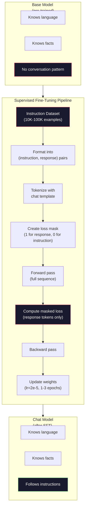

# 命令调节 (SFT) 命令微调

> 基本模型预测下一个代币.就这样了.它不遵循说明,不回答问题,也不拒绝有害请求.SFT是代币预测器和有用的助理之间的桥梁.你曾经交谈过的每个模型 - - 克劳德,GPT,Llama Chat - - 都经历了这个步骤.

> **【中文解读】**基础模型只会预测下一个代币――它不会遵循指令,回答问题或拒绝有害请求――SFT(监督微调) 是连接"代币预测器"和"有用助手"的桥梁――Claude、ChatGPT、Llama Chat 都经历了这一步──

> **【拓展：SFT→ChatGPT】**聊天GPT的训练流程:GPT-3.5 预训 → SFT(用人类标注的对话数据微调)→ RLHF(用人类偏好数据对齐) ――SFT 是让基础模型成为对话助手的关键一步――

>  **【前置】**学本节前请先掌握:阶段10·04(预训练迷你GPT) 理解预训如何得到基础模型;阶段11·08(LoRA) 理解微调的具体技术(本节是全参微调,LoRA是其轻量版);PyTorch 训练循环基础(损失、优化、退后) ⋅

**Type:** Build
**Languages:** Python (with numpy)
**Prerequisites:** Phase 10, Lesson 04 (Pre-Training a Mini GPT)
**Time:** ~90 minutes

>  **【类比】**给"博学"上课――预训让会说所有人话 (语言能力),但不会对话 (说"你好",它说"今天天气不错"纯统计接龙) ――SFT 用1万对"问答"示范教它"问你好应该回答你好"从统计变成聊天──

> ️ **【易错点】**投资者: 投资者: 投资者: 投资者: 投资者: 投资者: 投资者: 投资者: 投资者: 投资者: 投资者: 投资者: 投资者: 投资者: 投资者: 投资者: 投资者: 投资者: 投资者: 投资者: 投资者: 投资者: 投资者: 投资者: 投资者: 投资者: 投资者: 投资者: 投资者: 投资者: 投资者: 投资者: 投资者: 投资者: 投资者: 投资者: 投资者: 投资者: 投资者: 投资者: 投资者: 投资者: 投资者: 投资者: 投资者: 投资者: 投资者: 投资者: 投资者: 投资者: 投资者: 投资者: 投资者: 投资者: 投资者: 投资者: 投资者: 投资者:**指令格式不统一**有的样本用`User:`现在,我们要去.`Assistant:`没有什么.`<|user|>`现在,我们要去.`<|assistant|>`模型学不会统一格式;务必固定模板(如ChatML) ・・・(2) **拒绝样本不足**只有50条"拒绝有害请求",模型不会拒绝;至少5-10% 拒绝样本覆盖各种攻击.** catastrophic forgetting**SFT 数据太窄了 (全是客服对话),模型忘了通用能力;混入20-30%通用数据 (Alpaca、FLAN) 保住基础能力──

## 学习目标

- 实施监督细节调整 (SFT),将基语言模型转换为遵循指令的助理
  实现监督微调(SFT),将基础语言模型转换为指令跟随助手
- 使用系统,用户和助理角色的聊天模板格式化训练数据,以及非助理代币的面具损失
  使用带系统/用户/助手 角色的聊天模板格式化训练数据,并对非助手代币 进行损失掩码
- 解释为什么SFT是必要的:基本模型继续文字而不是回答问题
  解释为什么需要SFT:基础模型是继续文本而不是回答问题
- 通过对待持久的指令组的基模型与精细调节的模型响应进行评估,评估SFT质量
  通过在留出指令集中的基础模型与微调模型的回复进行比较来评估SFT质量

> **【中文解读】**本课将基础模型转换为指令跟随助手.关键概念:SFT 使用与预训练相同的训练循环,但数据从原始文本变为结构化对话.核心技巧是损失掩码.

## 问题 问题引入

它们可以预测下一个代币给给给的序列. 给它"变压器架构"并可能继续"已经彻底改变了自然语言处理". 这对下一个代币预测器来说是令人印象深刻的.

> 你在第四课训练了一个模型――给定序列,它能预测下一个代币――输入"变压器架构",它可能继续写"已经彻底改变了自然语言处理".

现在试试一下:给它提供"法国的首都是什么?"一个基本模型没有回答"巴黎". 德国的首都是什么? 因为它从包含问题列表的文件中学到. 或许它会产生"很多人问的问题",因为这是一个可信的下一个标志的延续. 模型没有"答案"的概念. 它只知道"继续".

> 现在试试这个:输入"法国的首都是什么?" 基础模型不会回答"巴黎". 它会继续模式──它可能产生"德国的首都是什么? 西班牙的首都是什么?" 因为它从包含问题列表的文档中学到了这种模式──或者它可能产生"这是许多人问的问题",因为这是一个合理的下一 续写──模型没有"代号答"的概念──它只知道"续写"──

这就是GPT-3 (基本模型,2020年6月发布) 和ChatGPT (指令调整,2022年11月发布) 之间的差距.相同的架构.相同的预训练.差异是20,000至100,000个精心设计的 (指令,反应) 双子,教导模型遵循对话模式.

> 这就是GPT-3 (基础模型,2020年6月发布) 和ChatGPT (教堂模型遵循对话模式) 的区别.

斯坦福阿尔帕卡证明你不需要数百万个例子. 在2023年3月,他们调整了Llama 7B仅在GPT-3.5生成的52,000个指示响应对.$600. The result was a chatbot that could follow instructions, answer questions, and hold conversations. Not as good as ChatGPT, but shockingly close for $六百个和几个小时的训练.

> 斯坦福阿尔帕卡 证明你不需要数百万样本――2023年3月,他们只使用52,000条GPT-3.5 生成的指令-回复对微调Llama 7B――总成本600美元――结果是一个能遵循指令的,回答问题和进行对话的聊天机器人――不像ChatGPT好,但考虑到600美元和几小时的训练,已经惊地接近――

基因分析系统的基础知识是: 质量比数量更重要. 熟练的注释者写的27,000个例子超过了从互联网上剪除的100万个噪音例子.

>  Meta 的Llama 2聊天初始SFT 阶段仅使用了约27,000条高质量样本――核心洞察:质量比数量更重要――27,000条由熟练标记者编写的样本超过了从互联网抓取的100万条噪音样本――

> **【中文解读】**两者之间差距只有2万到10万条精心构造的(指令,回复) 对应.斯坦福阿尔帕卡使用52,000条GPT-3.5 生成的指令数据微调Llama 7B,成本仅为600美元.

> **【拓展：Llama 2 的 SFT 数据质量标准】**据说OpenAI还使用大量的人工标记的高质量对话数据来训练ChatGPT的SFT阶段.

## 概念的核心概念

### 实际上SFT所做的事情

监督精细调节从训练前开始继续进行相同的训练循环 - - 进步,计算损失,倒退,更新权重 - - 但用不同的数据.

> 监督微调延续预训练的相同训练循环前向传播、计算损失、反向传播、更新权重但在不同类型的数据上──你用结构化对话代替原始文本进行训练:

```json
{
  "system": "You are a helpful assistant.",
  "user": "What is the capital of France?",
  "assistant": "The capital of France is Paris."
}
```

模型已经知道巴黎是法国的首都.它在维基百科,教科书和网页上预训练中学到了这一点.SFT不教模型新的事实.它教模型一个新的 *行为*:当你看到一个问题,产生答案.当你看到一个指示,产生完成.当你看到一个有害的请求,产生拒绝.

> 模型已经知道巴黎是法国的首都. 在预训期间,它从维基百科,教科书和网页中学到了这一点.

预训练给模型知识,SFT给模型礼仪.

> 这样想:预训给模型知识――SFT 给模型礼貌――

> **【中文解读】**基本上,SFT是继续预训练的训练循环,但数据从原始文本变为结构化对话.关键技术是损失掩码:仅在助理回复部分计算损失.这意味着模型学习"如何回答"而不是"如何继续文本"――预训赋予模型知识,SFT赋予模型礼貌让它在合适的时机以合适的格式输出.

### 数据格式

现在,我们在这个行业中,有三种格式. 每个格式都编码相同的信息,

> 业内主要有三种形式. 每种编码都具有相同的信息.

**Alpaca Format**美国政府的要求

```json
{
  "instruction": "Summarize the following article in 3 sentences.",
  "input": "The European Central Bank raised interest rates...",
  "output": "The ECB increased rates by 25 basis points..."
}
```

简单且广泛使用.`input`斯坦福发布了52,000个例子,由GPT-3.5为600美元. 这启动了开源命令调整运动.

> 简单且广泛使用.`input`字段是可选的许多指令不需要额外的下文――斯坦福以此格式发布了52,000个样本,由GPT-3.5生产,成本600美元――这开启了开源指令微调运动――

**ShareGPT Format**(共同体,2023年):

```json
{
  "conversations": [
    {"from": "system", "value": "You are a helpful assistant."},
    {"from": "human", "value": "What causes tides?"},
    {"from": "gpt", "value": "Tides are caused by the gravitational pull of the Moon..."},
    {"from": "human", "value": "How often do they occur?"},
    {"from": "gpt", "value": "Most coastal areas experience two high tides and two low tides per day..."}
  ]
}
```

支持多转交谈. "from" 字段使用"human"和"gpt"按照规则,不管实际模型.Vicuna在使用者共享的ChatGPT转录中从70,000个ShareGPT对话中训练.

> 支持多轮对话──"从"字段按惯例使用"人"和"gpt",无论实际模型是什么──Vicuna在用户分享的ChatGPT对话记录中抓取的70,000个分享GPT对话训练──

**ChatML Format**(OpenAI,许多开源模型使用):

```
<|im_start|>system
You are a helpful assistant.<|im_end|>
<|im_start|>user
What is the capital of France?<|im_end|>
<|im_start|>assistant
The capital of France is Paris.<|im_end|>
```

使用特殊代币 (`<|im_start|>`现在`<|im_end|>`文,等许多其他模型使用ChatML. 文和文的代码是通过文和文的代码来定义角色.

> 使用特殊标志`<|im_start|>`,我知道.`<|im_end|>`为了分隔角色──这些符号在微调期间添加到分词器词表中──Qwen、Yi 和许多其他模型使用ChatML──

所有三个格式都能做到同样的:它们告诉模型"这是指令,这是反应,学习这个模式".

> 三种格式都做同样的事:告诉模型"这是指令,这是回复,学习这个模式――"

### 为什么它能有效

模型已经从训练前就知道语言. 它已经看到数十亿个问题,然后得到答案,然后得到说明,然后完成,以及人们之间的对话.

> 模型在预训练中已经学会了语言. 它已经看到数十亿个问题,然后跟着答案,然后跟着命令完成,然后跟着完成的人与人对话的例子.

基于这种潜伏能力,SFT 专注于这种潜伏能力.而不是模型需要从文本中弄清楚是否应回答问题或继续文件,SFT 则明确地训练在对话模式上.经过几千个例子,模型学会了:当你看到助理角色标记时,产生有用的反应.

> 现在,SFT 集中了这种潜在能力. 从上下文推断它应该回答问题还是继续写文档,SFT 明确训练对话模式.

这就是为什么27000个例子足够的.你不教导模型英语.你不教导模型英语.你不教导模型英语.你不教导模型英语.你教导模型英语.

> 这就是为什么27000个例子足够的.你不是在教模型英语.你不是在教它关于世界的事实.

### 隐藏的损失

对于SFT来说,这是最重要的技术细节,

> 这就是SFT中最重要的技术细节,大多数教程都跳过了.

在预训练期间,你计算每个代币的损失.模型学习在序列中预测每一个下一个代币.在SFT期间,你只计算在 *响应*代币上的损失.指令代币是为了文本,但模型不会因为"预测"它们错误而受到惩罚.

> 预训时,你对每个代币计算损失――模型学习预测序列中的每个下一个代币――SFT时,你只对*回复*代币计算损失――指令代币提供上下文,但模型不会因为"预测"而被惩罚――

为什么?因为你不想模型学会*生成*指示.你想它学会*响应*指示.如果你计算了指示代币的损失,你正在训练模型预测"法国的首都是什么?"就好像是问这个问题的人.这浪费了梯度信号,可以让模型困惑于它的作用.

> 为什么?因为你不希望模型学会*生成*指令――你希望它学会*回应*指令――如果你对指令代币计算损失,你在训练模型预测"法国的首都是什么?"就好像它在问题中――

实际上,你创建一个损失面具: 1用于响应代币, 0用于指示代币.

> 实际上,你创建了一个损失掩码:回复代币为 1,指令代币为 0――在平均之前,每个代币的损失将乘以这个掩码――

```
Tokens:    [SYS] You are helpful [USER] What is the capital? [ASST] Paris is the capital [EOS]
Loss mask:   0    0    0     0      0     0   0  0     0       1     1    1   1     1      1
```

只有之后的代币`[ASST]`模型在前进传递过程中看到整个对话 (它需要指示才能产生正确的反应),但仅根据预测反应的程度更新其权重.

> 只有`[ASST]`后的标志 贡献损失――模型在前向传播中看到完整的对话(它需要指令才能产生正确的回复),但只根据预测回复的好坏来更新权重――

### 训练超参数

对于训练前的超值,SFT使用了非常不同的超值.你不是从头开始训练,而是调整已经运行的模型.

> 您不是从头上训练.您正在调整一个已经有效的模型.

| Parameter | Pre-Training (Llama 2 7B) | SFT (Llama 2 Chat) |
|-----------|---------------------------|---------------------|
| Learning rate | 3e-4 (peak) | 2e-5 |
| Epochs | 1 (single pass over data) | 2 |
| Batch size | 4M tokens | 64 examples |
| Warmup steps | 2,000 | 0-100 |
| Weight decay | 0.1 | 0.0-0.1 |
| Data size | 2T tokens | 27,000 examples |

对于SFT来说,学习率是15倍低的.这是关键的.细调过程中学习率高,破坏了预训练知识.模型"忘记"所学到的东西,并过度进入小细调数据集.这是灾难性的忘记.

> 微调时高学习率会破坏预训知识. 模型"忘记"学到的东西并过于适合小型微调数据集.

> **【中文解读】**损失掩码是SFT中最重要的技术细节――预训时对所有代币 计算损失,SFT时仅对助理的回复代币 计算损失――指令代币用于提供下文,但不参与损失计算否则模型会学习"生成指令"而不是"回应指令"――训练超参数也截然不同:SFT的学习率比预训练低15倍(2e-5vs3e-4),避免灾难性遗忘――

> **【拓展：SFT 的数据规模与成本】**信息技术技术将多个短对话拼接到同一序列提高GPU使用率――

两个时代意味着模型看到每个训练示例两次. 在一个小数据集上,超过3个时代导致记忆 -- 模型开始将训练示例复制成文字,而不是概括.

> 两个时代意味着模型看每个训练样本两次――在小型数据集上超过3个时代会导致记忆化模型开始逐字复现训练样本而不是泛化――

### 遗忘是灾难性的

调整细节可以破坏一般能力.训练太长时间使用指令后的数据,模型就会失去编码,数学或创意文本的能力.它变得非常擅长其训练数据的特定格式,而其他一切都很糟糕.

> 微调可能破坏通用能力――在指令跟随数据上训练太久,模型会失去编码,做数学或创意文本的能力――它变得非常擅长训练特定的数据格式,但在其他方面变得很糟糕――

减轻三种情况:

> 缓解策略:

1. **Low learning rate.**更新更小意味着减少了预先训练的功能破坏.

2. **Short training.**在模型过之前停止.

3. **Mix in pre-training data.**拉马2聊天将少量的原始预训数据 (2-5%) 混合到SFT数据集中.这在学习新的指示后行为时"提醒"其一般能力模型.

### 真实数字

在一个NVIDIA A100 80GB GPU上,需要大约1小时来调整7B模型,

> 在单张NVIDIA A100 80GB GPU 上使用1万条高质量指令对微调7B模型大约需要1小时――计算如下:

- 平均数量为1万个例子 × 512个代币 = 5,12M个代币
- 两个时期 = 总共1024万个代币
- 对于7B型号细调的A100输出量: ~3,000个代币/秒
- 时间: 时间:

对于我们的小GPT (4层, 128个),训练几乎是即时的.

> 对于我们的迷你GPT (四层,128维),训练几乎是即时的.



## 建立它,实现它.
```figure
loss-masking
```

## 建立它

### 步骤1:指令数据集

在生产过程中,像Scale AI和Anthropic这样的公司使用人类注释器来编写这些.我们将编程创建它们,以展示格式.

> 创建合成指令数据集. 在生产中,规模AI和人类等公司雇佣人工标记者编写这些. 我们将使用程序创建它们以演示形式.

```python
import numpy as np

INSTRUCTION_DATA = [
    {
        "instruction": "What is the capital of France?",
        "response": "The capital of France is Paris."
    },
    {
        "instruction": "Explain gravity in one sentence.",
        "response": "Gravity is the force that attracts objects with mass toward each other."
    },
    {
        "instruction": "Write a haiku about the ocean.",
        "response": "Waves crash on the shore, salt and foam beneath the sun, endless blue expanse."
    },
    {
        "instruction": "What is 15 multiplied by 7?",
        "response": "15 multiplied by 7 is 105."
    },
    {
        "instruction": "Name three programming languages.",
        "response": "Three programming languages are Python, Rust, and TypeScript."
    },
    {
        "instruction": "Summarize photosynthesis.",
        "response": "Photosynthesis converts sunlight, water, and carbon dioxide into glucose and oxygen."
    },
    {
        "instruction": "What year did World War II end?",
        "response": "World War II ended in 1945."
    },
    {
        "instruction": "Define machine learning.",
        "response": "Machine learning is a field where algorithms learn patterns from data to make predictions."
    },
]
```

斯坦福阿尔帕卡使用了52,000个,但无论你有8个还是52,000个,都是一样的:代币化,面具化,仅仅在响应上计算损失.

> 八个例子很少.斯坦福阿尔帕卡使用了52,000个.

### 步骤2:使用聊天模板标记

将命令-响应对转换为用特殊角色标记的符号序列.标记告诉模型命令结束和响应开始的地方.

> 将命令回复转换为具有特殊角色标记的标记序列.标记告诉模型命令在哪里结束,回复从哪里开始.

```python
SPECIAL_TOKENS = {
    "INST_START": 253,
    "INST_END": 254,
    "RESP_START": 255,
}


def tokenize_instruction_pair(instruction, response, vocab_size=256):
    inst_tokens = list(instruction.encode("utf-8"))
    resp_tokens = list(response.encode("utf-8"))

    inst_tokens = [min(t, vocab_size - 4) for t in inst_tokens]
    resp_tokens = [min(t, vocab_size - 4) for t in resp_tokens]

    tokens = (
        [SPECIAL_TOKENS["INST_START"]]
        + inst_tokens
        + [SPECIAL_TOKENS["INST_END"]]
        + [SPECIAL_TOKENS["RESP_START"]]
        + resp_tokens
    )

    return tokens


def create_loss_mask(tokens):
    mask = np.zeros(len(tokens), dtype=np.float32)
    in_response = False

    for i, token in enumerate(tokens):
        if token == SPECIAL_TOKENS["RESP_START"]:
            in_response = True
            continue
        if in_response:
            mask[i] = 1.0

    return mask
```

输出面具是指令令令牌的零,响应令牌的零.`RESP_START`代币本身得到0的面具,因为它是界限器,而不是响应内容的一部分.

> 损失掩码对命令代币 全为 0,对回复代币 全为 1.`RESP_START`代币的本身掩码为0,因为它是分隔符,不是回复内容的一部分.

### 步骤3: 面具的交叉透损失

标准的交叉缩,但乘以损失面具.

> 标准交叉,但乘以损失掩码.

```python
def masked_cross_entropy_loss(logits, targets, loss_mask):
    batch, seq_len, vocab_size = logits.shape
    logits_flat = logits.reshape(-1, vocab_size)
    targets_flat = targets.reshape(-1)
    mask_flat = loss_mask.reshape(-1)

    max_logits = logits_flat.max(axis=-1, keepdims=True)
    log_softmax = logits_flat - max_logits - np.log(
        np.exp(logits_flat - max_logits).sum(axis=-1, keepdims=True)
    )

    per_token_loss = -log_softmax[np.arange(len(targets_flat)), targets_flat]

    masked_loss = per_token_loss * mask_flat
    num_response_tokens = mask_flat.sum()
    if num_response_tokens == 0:
        return 0.0
    loss = masked_loss.sum() / num_response_tokens

    return loss
```

标题是`num_response_tokens`没有`seq_len`如果按全序列长度划分,长度指令会稀释梯度信号.通过响应代币数量划分,无论指令长度如何,每个响应代币的重量都保证相同.

> 分母是`num_response_tokens`没有`seq_len`△除总序列长度,更长的命令会稀释梯度信号――除回复符号数确保每个回复符号权重相等,无论命令长度如何――

### 步骤4:SFT训练循环

训练循环几乎与预训练相同,但有指示格式化和隐藏损失.

> 复用第四课的MiniGPT──训练循环看起来与预训练几乎相同,但有指令格式化和掩码损失──

```python
import sys
import os
sys.path.insert(0, os.path.join(os.path.dirname(__file__), "..", "..", "04-pre-training-mini-gpt", "code"))
from main import MiniGPT, LayerNorm, FeedForward, MultiHeadAttention, TransformerBlock, Embedding


def sft_train(model, dataset, num_epochs=2, lr=2e-5, seq_len=64):
    formatted_data = []
    for example in dataset:
        tokens = tokenize_instruction_pair(example["instruction"], example["response"])
        mask = create_loss_mask(tokens)
        formatted_data.append((tokens, mask))

    print(f"SFT Training: {len(formatted_data)} examples, {num_epochs} epochs, lr={lr}")
    print(f"Total tokens: {sum(len(t) for t, _ in formatted_data):,}")
    print()

    losses = []

    for epoch in range(num_epochs):
        epoch_loss = 0.0
        num_batches = 0

        indices = np.random.permutation(len(formatted_data))

        for idx in indices:
            tokens, mask = formatted_data[idx]

            if len(tokens) < 3:
                continue
            if len(tokens) > seq_len:
                tokens = tokens[:seq_len]
                mask = mask[:seq_len]

            input_ids = np.array(tokens[:-1]).reshape(1, -1)
            target_ids = np.array(tokens[1:]).reshape(1, -1)
            loss_mask = np.array(mask[1:]).reshape(1, -1)

            logits = model.forward(input_ids)
            loss = masked_cross_entropy_loss(logits, target_ids, loss_mask)

            batch_size, s_len, v_size = logits.shape
            probs = np.exp(logits - logits.max(axis=-1, keepdims=True))
            probs = probs / probs.sum(axis=-1, keepdims=True)
            dlogits = probs.copy()
            dlogits[np.arange(batch_size)[:, None], np.arange(s_len), target_ids] -= 1.0

            mask_expanded = loss_mask[:, :, np.newaxis]
            num_resp = loss_mask.sum()
            if num_resp > 0:
                dlogits = dlogits * mask_expanded / num_resp

            for block in model.blocks:
                block.ffn.W1 -= lr * np.random.randn(*block.ffn.W1.shape) * 0.01
                block.ffn.W2 -= lr * np.random.randn(*block.ffn.W2.shape) * 0.01
                block.ffn.b1 -= lr * np.random.randn(*block.ffn.b1.shape) * 0.01
                block.ffn.b2 -= lr * np.random.randn(*block.ffn.b2.shape) * 0.01

            epoch_loss += loss
            num_batches += 1
            losses.append(loss)

        avg_loss = epoch_loss / max(num_batches, 1)
        print(f"Epoch {epoch + 1}/{num_epochs} | Avg Loss: {avg_loss:.4f}")

    return model, losses
```

学习率是2e-5,与Llama 2聊天相匹配.比较前训练中使用的3e-4--小15倍.梯度是隐藏的:指令令令令令产生零梯度.只有响应令令令令推重.

> 学习率为2e-5,与Llama2聊一致──与预训的3e-4相比小15倍──梯度被掩盖:指令令令令令令令 产生零梯度──只有回复令令令令 推动权重更新──

### 步骤5: 基因与SFT模型进行比较

通过检查模型如何对命令格式输入进行响应而不是原始文本延续.

> 让我们通过检查模型如何应对输入指令格式与原始文本续写来衡量它.

```python
def generate_response(model, prompt_tokens, max_new_tokens=50, temperature=0.8):
    tokens = list(prompt_tokens)
    seq_len = model.embedding.pos_embed.shape[0]

    for _ in range(max_new_tokens):
        context = np.array(tokens[-seq_len:]).reshape(1, -1)
        logits = model.forward(context)
        next_logits = logits[0, -1, :]

        next_logits = next_logits / max(temperature, 1e-8)
        probs = np.exp(next_logits - next_logits.max())
        probs = probs / probs.sum()
        probs = np.clip(probs, 1e-10, 1.0)
        probs = probs / probs.sum()

        next_token = np.random.choice(len(probs), p=probs)
        tokens.append(int(next_token))

    return tokens


def evaluate_instruction_following(model, instructions):
    print("Evaluating instruction following:")
    print("-" * 50)

    for instruction in instructions:
        tokens = (
            [SPECIAL_TOKENS["INST_START"]]
            + [min(t, 252) for t in list(instruction.encode("utf-8"))]
            + [SPECIAL_TOKENS["INST_END"]]
            + [SPECIAL_TOKENS["RESP_START"]]
        )

        output = generate_response(model, tokens, max_new_tokens=30, temperature=0.6)
        response_start = len(tokens)
        response_tokens = output[response_start:]
        response_bytes = bytes([t for t in response_tokens if t < 128])
        response_text = response_bytes.decode("utf-8", errors="replace")

        print(f"  Q: {instruction}")
        print(f"  A: {response_text[:80]}")
        print()
```

在一个小模型上,有8个例子,答案不会有意义.这是预期的.重要的是*结构*:模型学习在答案标记之后输出,而不是继续生成更多的指示.

> 在只有8个例子的微型模型上,回复不会有意义――这是预期的――重要的是*结构*:模型学会在回复标记后产生输出,而不是继续产生更多指令――

### 第六步: 测量遗忘

模型在SFT之前和之后的下一个代币预测能力进行比较.如果SFT损害了一般功能,原始文本的损失将增加.

> 较SFT前后模型下一代标记预测能力.如果SFT损害通用能力,原始文本的损失会增加.

```python
def measure_forgetting(model, test_text, seq_len=64):
    tokens = np.array(list(test_text.encode("utf-8")[:512]))

    total_loss = 0.0
    num_windows = 0

    for start in range(0, len(tokens) - seq_len - 1, seq_len):
        input_ids = tokens[start:start + seq_len].reshape(1, -1)
        target_ids = tokens[start + 1:start + seq_len + 1].reshape(1, -1)

        logits = model.forward(input_ids)

        batch, s_len, vocab_size = logits.shape
        logits_flat = logits.reshape(-1, vocab_size)
        targets_flat = target_ids.reshape(-1)

        max_logits = logits_flat.max(axis=-1, keepdims=True)
        log_softmax = logits_flat - max_logits - np.log(
            np.exp(logits_flat - max_logits).sum(axis=-1, keepdims=True)
        )

        loss = -log_softmax[np.arange(len(targets_flat)), targets_flat].mean()
        total_loss += loss
        num_windows += 1

    return total_loss / max(num_windows, 1)
```

如果原始文本丢失增加了10-15%以上,你的SFT太激进了.降低学习速度或减少时代数量.

> 在真实微调中,你应该在整个训练过程中跟踪这个标志. 如果原始文本损失增加超过10-15%,说明SFT过于激进.

## 用它实现框架

### 完整的SFT管道演示

```python
if __name__ == "__main__":
    np.random.seed(42)

    test_text = """The transformer architecture processes sequences through self-attention.
Each layer applies multi-head attention followed by a feedforward network.
Residual connections and layer normalization stabilize deep networks.
The model learns to predict the next token given all previous tokens."""

    print("=" * 70)
    print("INSTRUCTION TUNING (SFT) DEMO")
    print("=" * 70)
    print()

    model = MiniGPT(
        vocab_size=256, embed_dim=128, num_heads=4,
        num_layers=4, max_seq_len=128, ff_dim=512
    )
    print(f"Model: {model.count_parameters():,} parameters")
    print(f"Config: 4 layers, 4 heads, 128 dims (mini GPT from Lesson 04)")
    print()

    print("PRE-SFT: Measuring base model loss on raw text")
    base_loss = measure_forgetting(model, test_text)
    print(f"  Base model loss: {base_loss:.4f}")
    print()

    print("=" * 70)
    print("SFT TRAINING")
    print("=" * 70)

    model, losses = sft_train(
        model, INSTRUCTION_DATA, num_epochs=3, lr=2e-5, seq_len=128
    )

    print()
    print("POST-SFT: Measuring fine-tuned model loss on raw text")
    sft_loss = measure_forgetting(model, test_text)
    print(f"  SFT model loss: {sft_loss:.4f}")
    print(f"  Change: {((sft_loss - base_loss) / base_loss * 100):+.1f}%")
    if abs(sft_loss - base_loss) / base_loss < 0.15:
        print("  Minimal forgetting (< 15% change)")
    else:
        print("  Significant forgetting detected")
    print()

    print("=" * 70)
    print("INSTRUCTION FOLLOWING EVALUATION")
    print("=" * 70)
    print()

    test_instructions = [
        "What is the capital of France?",
        "Name a programming language.",
        "Define gravity.",
    ]
    evaluate_instruction_following(model, test_instructions)

    print("=" * 70)
    print("DATA FORMAT EXAMPLES")
    print("=" * 70)
    print()

    for i, example in enumerate(INSTRUCTION_DATA[:3]):
        tokens = tokenize_instruction_pair(example["instruction"], example["response"])
        mask = create_loss_mask(tokens)
        resp_count = int(mask.sum())
        total_count = len(tokens)
        print(f"  Example {i + 1}: {total_count} tokens, {resp_count} response tokens ({resp_count/total_count:.0%} of sequence)")
        print(f"    Instruction: {example['instruction']}")
        print(f"    Response: {example['response']}")
        print()

    print("=" * 70)
    print("TRAINING LOSS CURVE")
    print("=" * 70)
    print()

    if losses:
        window = max(1, len(losses) // 5)
        for i in range(0, len(losses), window):
            chunk = losses[i:i + window]
            avg = sum(chunk) / len(chunk)
            print(f"  Steps {i:3d}-{i + len(chunk) - 1:3d}: avg loss = {avg:.4f}")
```

## 运送它.

这一课产生了`outputs/prompt-sft-data-curator.md`根据目标能力 (代码生成,数学,对话),它产生了一个数据收集计划,包含格式规格,质量标准和多样性要求.

## 练习题

1. 添加系统快速支持. 修改`tokenize_instruction_pair`创建5个例子,使用不同的系统提示 ("你是诗人","你是数学教师") 并验证模型在训练中看到不同的系统提示.

2. 实现数据混合.创建一个采用SFT数据集和原始文本体的函数,然后生成训练批次,其中5%的例子是原始文本 (没有掩盖) 和95%是指令对 (掩盖).运行3个时代,并将忘记指标与纯SFT训练进行比较.

3. 构建数据质量分数器.对于每个命令响应对,计算: (a) 代币中的响应长度, (b) 命令-响应比率, (c) 词汇多样性 (独特代币/总代币). 过出响应长度 < 10 代币或多样性 < 0.3 的例子. 显示过如何影响最终损失.

4. 实现多轮对话训练.扩展代币化以处理3轮对话 (用户助理-用户助理-用户助理).损失面具应覆盖所有三轮助理.通过打印一个例子来验证代币-面具对齐的正确性.

5. 进行学习比较. 训练相同的模型三次 lr=1e-4, lr=2e-5,和 lr=1e-6. 绘制损失曲线. 1e-4运行应该显示出快速的初始下降,但最终损失更高 (过度). 1e-6运行几乎不能移动. 2e-5运行应该是甜点.

## 关键词 快速查找表

| Term | What people say | What it actually means | 中文释义 |
|------|----------------|----------------------|---------|
| SFT | "Fine-tuning on conversations" | Supervised Fine-Tuning: continuing training on (instruction, response) pairs with loss computed only on response tokens | 监督微调，在指令-回复对上继续训练，仅对回复 token 计算损失 |
| Instruction tuning | "Teaching the model to follow instructions" | Training on explicit instruction-response pairs so the base model learns the conversation pattern, not new knowledge | 指令微调，训练基础模型学会对话模式而非新知识 |
| Loss masking | "Ignoring the prompt" | Setting loss to zero for instruction tokens so gradients only flow from response token predictions | 损失掩码，指令 token 损失设为零，梯度仅来自回复预测 |
| ChatML | "Chat Markup Language" | A token format using `<\|im_start\|>` and `<\|im_end\|>` delimiters to mark speaker roles in conversation data | 聊天标记语言，用特殊 token 标记对话角色 |
| Alpaca format | "Stanford's format" | A JSON format with instruction/input/output fields, used for 52K GPT-3.5-generated examples that cost $600 | Alpaca 格式，Stanford 的 JSON 指令格式，52K 样本成本 $600 |
| Catastrophic forgetting | "The model gets dumber" | Fine-tuning destroys pre-trained capabilities because gradient updates overwrite general knowledge with task-specific patterns | 灾难性遗忘，微调破坏预训练能力 |
| Weight tying | "Shared embeddings" | Using the same matrix for input token embeddings and output prediction head, saving parameters and improving coherence | 权重共享，输入输出共用嵌入矩阵 |
| Chat template | "How you format the prompt" | The specific token sequence (role markers, delimiters) that structures a conversation for the model | 聊天模板，格式化对话的 token 序列 |

## 继续阅读 继续阅读

- [Ouyang et al., 2022 -- "Training language models to follow instructions with human feedback" (InstructGPT)](https://arxiv.org/abs/2203.02155)-- 引入了OpenAI的指令调整+RLHF的论文
- [Taori et al., 2023 -- "Stanford Alpaca: An Instruction-following LLaMA Model"](https://github.com/tatsu-lab/stanford_alpaca)根据SFT的数据集,
- [Touvron et al., 2023 -- "Llama 2: Open Foundation and Fine-Tuned Chat Models"](https://arxiv.org/abs/2307.09288)--Meta的SFT+RLHF管道,含有27K高质量的例子
- [Chiang et al., 2023 -- "Vicuna: An Open-Source Chatbot Impressing GPT-4"](https://lmsys.org/blog/2023-03-30-vicuna/)-- 培训70K的分享GPT对话
- [Zhou et al., 2023 -- "LIMA: Less Is More for Alignment"](https://arxiv.org/abs/2305.11206)-- 证明1000个精心策划的例子可以在更大的数据集上匹配SFT
