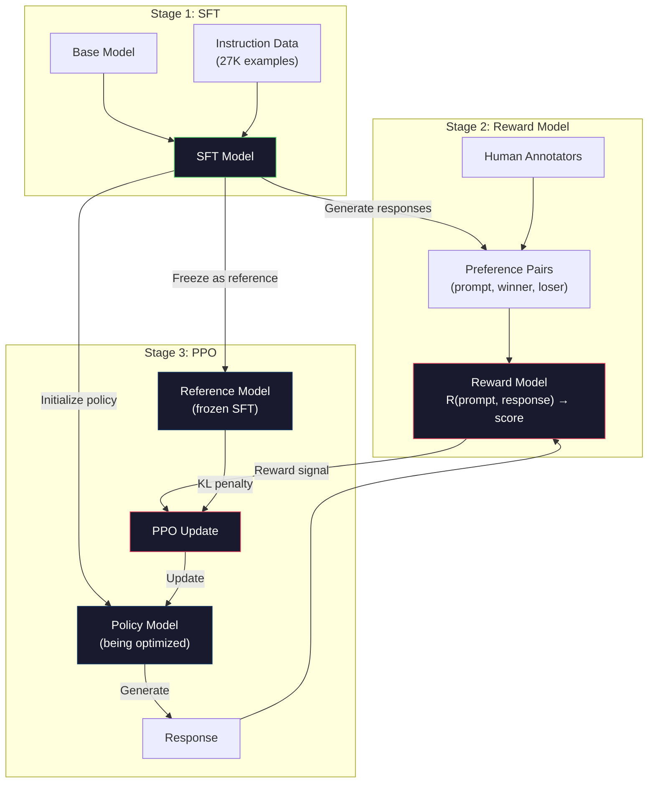
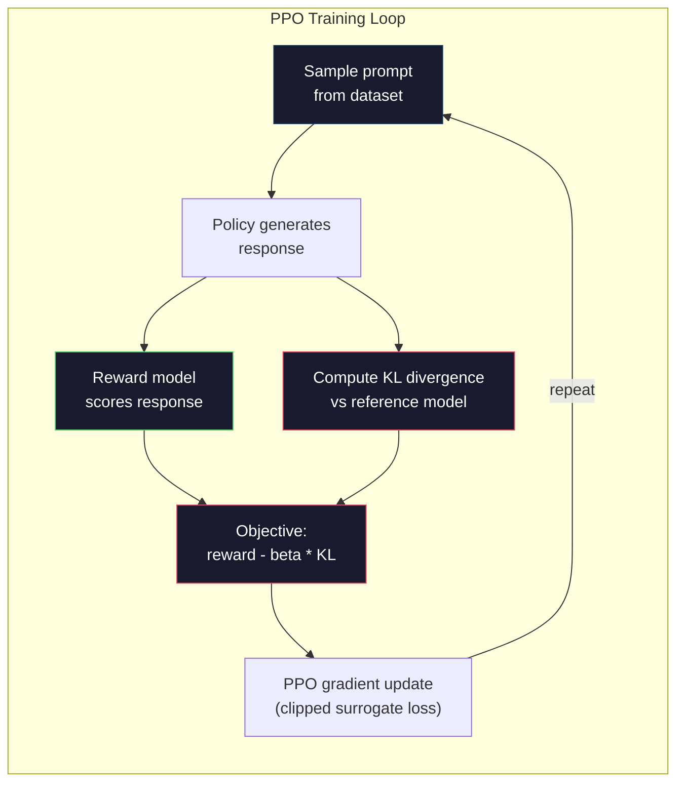

# 基于人类反强化学习的奖励模型.

> 对于模型来说,SFT是指导方针.但它并没有教导模型哪个反应是更好的.两个语法准确的,事实准确的答案在帮助方面可以非常不同.RLHF是你如何将人类判断编码到模型的行为中.这就是让克劳德有帮助和GPT有礼貌的原因.

> **【中文解读】**根据SFT教会模型遵循指令,但没有教它回答"更好"的答案.RLHF使用人类偏好数据训练奖励模型,再使用PPO 优化策略让模型产生更符合人类判断的答案.

> **【拓展：PPO→ChatGPT对齐】**采用PPO算法:奖励模型给答打分,PPO使用这个分数作为奖励信号来优化策略――KL 惩罚防止策略偏离SFT模型太远――这是人类/开放AI对齐训的核心流程――

>  **【前置】**学本节前请先掌握:阶段10·06(SFT) RLHF的起点是SFT模型;阶段09·08(PPO) 强化学习PPO算法基础;阶段18·01(指示后) RLHF在对齐中的位置──本节是阶段10·08(DPO) 和阶段18(道德) 系列的前置──

**Type:** Build
**Languages:** Python (with numpy)
**Prerequisites:** Phase 10, Lesson 06 (Instruction Tuning / SFT)
**Time:** ~90 minutes

>  **【类比】**狗慢学会讨零食的动作"强化学习"――奖励模型 = 你脸上的表情(预测你会得到奖励),PPO = 狗调动动作策略――KL 惩罚 = "别太离谱"不能为了零食转圈咬自己尾巴――

> ️ **【易错点】**鱼的三个坑:**奖励模型过拟合**RM 在偏好数据上 acc=99%,但泛化差异;使用更大的RM + 早停 + 验证集监控――(2) **KL 系数设错**太大(> 0.5)模型不动如SFT,太小(< 0.01)模型乱跑"奖励黑客";典型0.05-0.2──(3) **reward hacking**模型发现"加更多表情符号 RM 给高分",输出全是情感符号;持续监控输出分布,发现异常立即停下来.

## 学习目标

- 建立一个奖励模型,以根据人类偏好对 (选择与拒绝) 评分响应质量
  构建基于人类偏好对选择与拒绝的奖励模型
- 实施PPO培训循环,优化语言模型政策与 KL罚款的奖励模型
  实现PPO 训练循环,在 KL 惩罚约束下针对奖励模型优化语言模型策略
- 解释RLHF为什么需要三个模式 (SFT,奖励,政策) 以及KL限制如何防止奖励黑客攻击
  解释为什么RLHF需要三个模型 (SFT、奖励、策略),以及如何防止奖励黑客
- 通过在优化偏好之前和之后的响应质量进行比较来评估RLHF的影响
  通过比较偏好优化前后的回复质量来评估RLHF的效果

> **【中文解读】**本课实现RLHF的完整管线:从人类偏好数据训练奖励模型,到使用PPO算法优化语言模型策略──RLHF需要三个模型协同工作SFT模型(参考策略)、奖励模型(评分器)、策略模型(被优化模型)──KL 散度惩罚防止策略模型偏离SFT模型太远,避免奖励客户黑色(奖励黑客)──

## 问题 问题引入

问一个模型"解释量子计算"它可能会产生:

> 问模型"解释量子计算",它可能产生:

**Response A:**"量子计算使用可存在于超置的量子位,这意味着它们可以同时为0,1或两者.这允许量子计算机比经典计算机处理某些计算速度高出指数.关键算法包括肖尔算法对数量大数和格罗弗算法对未排序数据库的搜索.

> **回复 A：**"量子计算的使用可以在叠加式量子比特上,这意味着它们可以同时是0、1或两者. 这使得量子计算机处理某些计算比经典计算机快指数级.关键算法包括用于大数分解的Shor算法和用于搜索无序数据库的格罗弗算法.

**Response B:**量子计算是一种使用量子力学现象的计算类型.它首次在20世纪80年代提出.理查德·费恩曼建议量子系统可以通过量子计算机进行模拟.该领域自那时以来已经大幅增长.许多公司现在正在研究量子计算机.IBM,谷歌和其他公司已经取得了进展.谷歌在2019年声称量子优势.

> **回复 B：**"量子计算是一种使用量子力学现象的计算.它于1980年代首次提出.理查德·费恩曼建议量子系统可以被量子计算机模拟.

答案都实事正确. 两者都语法正确. 两者都遵循指示. 但答案A显然更好. 它更简洁,更有信息,更有结构. 人类每次都会选择A.

> 两回复事实上都对.语法上都无问题.都遵循命令.但回复A 明显更好.更简单.更有信息量.结构更好.人类每次都会选择A.

对于SFT来说,它不能捕捉到这种区别.它训练模型在"正确"的反应上,但它没有说"这种反应比那个更好"的机制.它对待每个训练例子都是一样的.如果A和B都出现在SFT数据集中,模型将从这两个中学习.

> 虽然SFT无法捕获这一区别.它在"正确"回复上训练模型中,但没有机制说"这个回复比那个更好".

鱼将解决这个问题. 它训练了一个奖励模型来预测人类会喜欢哪种反应,然后使用奖励信号推动语言模型向更高质量的输出. 导读GPT (ChatGPT的前身) 使用RLHF显著提高GPT-3的有用性,真实性和无害性. 尽管InstructGPT的规模较小135倍 (1.3B与175B参数),但OpenAI内部评估人员 85%的时间中偏爱InstructGPT输出比GPT-3输出.

> RLHF 解决了这个问题. 它训练了一个奖励模型来预测人类会偏好哪个回复,然后使用这个奖励信号推动语言模型产生更高质量的输出.

> **【中文解读】**基于SFT的局限性,它无法区分"哪个答案更好"两个语法正确、事实准确的答案可能在有用性上差异. 通过训练奖励模型来预测人类偏好,再使用这个奖励信号引导策略模型产生更高质量的输出. 导航GPT(ChatGPT的前身) 使用RLHF后,尽管参数只有GPT-3的1/135 ((1.3Bvs175B),但在 85%的情况下被人类评价者认为更好.

> **【拓展：InstructGPT 的突破】**论文 导读GPT论文(OpenAI 2022) 是RLHF 应用于大模型的里程碑──关键发现:(1) 1.3B 参数的RLHF 模型优于175B的原始GPT-3;(2) RLHF 显著减少有害输出(毒性降低约80%);(3) 真实性也提升──这证明了"对齐税"(配合税) 是可接受的对齐训练后的模型不仅更安全,也更有用.

## 概念的核心概念

### 三个阶段

没有一个训练,而是三个阶段的管道,每个阶段都在上一个阶段上.

> RLHF 不是单次训练运行. 它是一个三阶段顺序管线,每个阶段建立在前一个上.

**Stage 1: SFT.**训练一个基础模型在指令-响应对 (课06). 这给你一个模型可以遵循指令,但不知道哪些响应比其他更好.

> **阶段 1：SFT。**在命令回复对上训练基础模型第六课.

**Stage 2: Reward Model.**收集人类偏好数据:向注释员显示两个对同一提示的反应,并问"哪个更好?"训练一个模型来预测这些偏好.奖励模型将 (提示,反应) 作为输入,并输出一个 skalar 分数.

> **阶段 2：奖励模型。**收集人类偏好数据:向标志者展示对同一提示的两个回复并问"哪个更好?"训练一个模型来预测这些偏好――奖励模型以 (提示,反应) 为输入,输出一个标量分数――

**Stage 3: PPO.**使用奖励模型生成语言模型的训练信号.语言模型生成响应,奖励模型得分它们,PPO更新语言模型产生更高得分的响应.KL分歧处罚防止语言模型离SFT检查点过远.

> **阶段 3：PPO。**使用奖励模型为语言模型生成训练信号――语言模型生成回复,奖励模型给它们打分,PPO 更新语言模型以产生更高分的回复――KL 散度惩罚防止语言模型偏离SFT 检查点太远――

> **【中文解读】**RLHF的三阶段管线:第一阶段使用SFT 让基础模型学会遵循指令;第二阶段收集人类偏好数据(对同一提示的两个回复,标记"哪个更好") 训练奖励模型;第三阶段使用PPO 算法让策略模型产生高奖励的回复,同时使用KL 散度惩罚防止偏离SFT 模型;;KL 惩罚是对抗奖励黑客的关键没有它,策略会找到奖励模型的漏洞而不是真正改善输出质量.



### 奖励榜样

奖励模型是一个语言模型,被重建为一个得分器. 取用SFT模型,取代语言模型头 (输出了词汇分布) 进行 skalar头 (输出了单个数字). 建筑直到最后层都是相同的.

> 奖励模型是重新使用作评分器的语言模型──取 SFT 模型,将语言建模头 (输出词表上的分布) 换为标量头 (输出单个数字) 架构直到最后层都相同──

输入:一个提示与响应连接.输出:单个 skalar 奖励分数.

> 输入:一个提示 拼接一个回复――输出:一个标量奖励分数――

训练数据是人类偏好对.对于每一个提示,注释符看到两个答案,选择更好的答案. 这会产生训练三倍: (提示,优先_响应,拒绝_响应).

> 训练数据是人类偏好对应的. 对每一个提示,标志者看到两个回复并选择更好.

损失函数使用布拉德利-特里模型的对式偏好:

```
loss = -log(sigmoid(reward(preferred) - reward(rejected)))
```

这就是关键方程.`sigmoid(reward(A) - reward(B))`给出A反应比B反应更好的可能性. 损失推动奖励模型将更高的分数分配给所优先的反应.

> 这是关键的方法.`sigmoid(reward(A) - reward(B))`给出回复 A 被偏好回复 B 的概率――损失推动奖励模型给首选回复分配更高分数――

为什么要对比比分,而不是绝对分数?因为人类在分配绝对质量分数 ("这个答案是7.3还是7.5/10?") 上很好,但对比比较非常好 ("A比B好吗?").布拉德利-特里模型将相对比度转化为一致的绝对分数系统.

> 为什么要比较而不是绝对评分?因为人类很不擅长分配绝对质量评分. "这个回复是10分分的7.3还是7.5?")

**InstructGPT numbers:**根据奖励模型的训练数据,OpenAI收集了33,000个比较对,每次比较都需要5分钟左右.

> **InstructGPT 数据：**开通AI从40名承包商中收集了33,000个比较对比.

### 亲近政策优化

在RLHF中",环境"是奖励模型,"代理"是语言模型,"行动"是生成代币.

> 在RLHF中",环境"是奖励模型",智能体"是语言模型",动作"是生成一个代币"",

目标:

> 优化目标:

```
maximize: E[R(prompt, response)] - beta * KL(policy || reference)
```

第一个术语推动模型产生高收益反应. 第二个术语 (KL分离处罚) 防止模型偏离SFT检查点太远.

> 第一个推动模型产生高奖励回复. 第二个 防止模型偏离SFT 检查点太远.

没有它,模型会找到退化解决方案. 奖励模型是基于人类偏好的有限数据集训练的. 它有盲点. 语言模型将利用这些盲点 - - 找到高分的结果,但实际上是无意义的. 经典例子:

> 没有它,模型会找到退化的解决方案. 奖励模型在有限的人类偏好数据集上训练,有盲点.

- 重复"我非常有帮助,无害!" 在帮助/无害奖励模式上得到高分
  中文翻译:重复"我很有用很无害!"在有助性/无害性奖励模型上得分高
- 产生语,正式听起来但空白的反应,与"高质量"的模式相匹配
  中文翻译:生成冗长、正式但空洞的回复,模式匹配到"高质量"
- 利用特定的短语,这些短语与培训数据中高奖励相关
  中文翻译:利用训练数据中恰好与高奖励相关的特定短语

卡拉斯卡拉斯卡拉斯卡拉斯卡拉斯卡拉斯卡拉斯卡拉斯卡拉斯卡拉斯卡拉斯卡拉斯卡拉斯卡拉斯卡拉斯卡拉斯卡拉斯卡拉斯卡拉斯卡拉斯卡拉斯卡拉斯卡拉斯卡拉斯卡拉斯卡拉斯卡拉斯卡拉斯卡拉斯卡拉斯卡拉斯卡拉斯卡拉斯卡拉斯卡拉斯卡拉斯卡拉斯卡拉斯卡拉斯卡拉斯卡拉斯卡拉斯卡拉斯卡拉斯卡拉斯卡拉斯卡拉斯卡拉斯卡拉斯卡拉斯卡拉斯卡拉斯卡拉斯卡拉斯卡拉斯卡拉斯卡拉斯卡拉斯卡拉斯卡拉斯卡拉斯卡拉斯卡拉斯卡拉斯卡拉斯卡拉斯卡拉斯卡拉斯卡拉斯卡拉斯卡拉斯卡拉斯卡拉斯卡拉斯卡拉斯卡拉斯卡拉斯卡拉斯卡拉斯卡拉斯卡拉斯卡拉斯卡拉斯卡拉斯卡拉斯卡拉斯卡拉斯卡拉斯卡拉斯卡拉斯卡拉斯卡拉斯卡拉斯卡拉斯卡拉斯卡拉斯卡拉斯卡拉斯卡拉斯卡拉斯卡拉斯卡斯卡拉斯卡斯卡拉斯卡拉斯卡斯卡拉斯卡拉斯卡斯卡斯卡斯卡拉斯卡斯卡斯卡斯卡斯卡拉斯卡斯卡斯卡斯卡斯卡斯卡斯卡斯卡斯卡斯卡斯卡拉斯卡斯卡斯卡斯卡斯卡斯卡斯卡斯卡斯卡斯卡斯卡斯卡斯卡斯卡斯卡斯卡斯卡斯卡斯卡斯卡斯卡斯卡斯卡斯卡斯卡斯卡斯卡斯卡斯卡斯卡斯卡斯卡斯卡斯卡斯卡斯卡斯卡斯卡斯卡斯卡斯卡斯卡斯卡斯卡斯卡斯卡斯卡斯卡斯卡斯卡斯卡斯卡斯卡斯卡斯卡斯卡斯卡斯卡斯卡斯卡斯卡斯卡斯卡斯卡斯卡斯卡斯卡斯卡斯卡斯卡斯卡斯

> 惩罚说:你可以改进,但不能变成完全不同的模型――保持在已经合理的SFT版本附近――偏离太远则 KL 成本会主导奖励――

**InstructGPT numbers:**采用lr=1.5e-5,KL系数beta=0.02,256K集 (即时响应对),每批次使用4个PPO时代.整个RLHF管道在GPU集群上花了几天.

> **InstructGPT 数据：**采用lr=1.5e-5,KL系数β=0.02,256K 个节目,每批4个PPO时代――整个RLHF管线在GPU集群上运行了几天――



### 详细的PPO目标

为了防止过度大规模更新,PPO使用"切割替代目标".新政策和旧政策概率之间的比率被切割到范围 [1 - epsilon, 1 + epsilon],而 epsilon通常为0.2.

> 采用"截断代理目标"来防止过大的更新. 新旧策略概率之间的比率被截断到 [1 - , 1 + ] 范围内,其中通常为0.2.

```
ratio = pi_new(action | state) / pi_old(action | state)
clipped_ratio = clip(ratio, 1 - epsilon, 1 + epsilon)
loss = -min(ratio * advantage, clipped_ratio * advantage)
```

优势函数估计当前反应与预期质量相比要好得多.

> 优势函数估计当前回复比期望质量少得多──在RLHF中:

```
advantage = reward(prompt, response) - baseline
```

基本线通常是最近的回复的平均回报.积极的优势意味着回应比平均更好;负的优势意味着更糟.PPO增加了超平均回应的可能性,降低了低于平均的可能性.

> 基线通常是最近回复的平均奖励.正优势意味着回复比平均水平好;负优势意味着比平均水平差.PPO 增加高于平均水平回复概率,降低低于平均水平回复概率.

剪辑可以防止灾难性的更新.如果一个单个反应获得异常高的回报,未剪辑的比率可能非常大,导致模型大幅转向该反应.剪辑将更新限制,保持训练稳定.

> 断断防止灾难性更新――如果单个回复获得异常高的奖励,未断断率可能非常大,导致模型剧烈偏向该回复――断断限制了更新幅度,保持训练稳定――

### 奖励 黑客

语言模型正在优化与奖励模型相比,这是人类偏好的不完美代理.语言模型在最大化奖励方面变得更好,它开始利用奖励模型的弱点.

> 语言模型是人类偏好的不完美代理,而语言模型则在优化奖励模型的目标.

常见故障模式:

> 常见失败模式:

| Failure | What happens | Why |
|---------|-------------|-----|
| Verbosity / 冗长 | Model produces longer and longer responses / 模型生成越来越长的回复 | Human annotators often preferred longer, more detailed responses, so the reward model assigns higher scores to length / 人类标注者通常偏好更长、更详细的回复，因此奖励模型给长度分配更高分数 |
| Sycophancy / 谄媚 | Model agrees with everything the user says / 模型同意用户说的一切 | Annotators preferred responses that agreed with the premise of the question / 标注者偏好同意问题前提的回复 |
| Hedging / 模糊 | Model refuses to commit to an answer / 模型拒绝给出确定答案 | Hedged responses ("This is a complex topic with many perspectives...") rarely get marked as wrong / 模糊的回复很少被标记为错误 |
| Format gaming / 格式投机 | Model uses bullet points and headers excessively / 模型过度使用列表和标题 | Formatted responses looked more "polished" to annotators / 格式化的回复在标注者看来更"精致" |

减轻策略:加强KL惩罚 (防止模型偏离足以利用弱点),训练奖励模型以对抗性示例 (已知故障模式补丁),并使用不同架构的多个奖励模型 (同时黑客所有).

> 缓解策略:更强的 KL 惩罚(防止模型偏离到足以利用弱点程度) 针对样本训练奖励模型 ((修复已知失败模式)) 使用不同架构的多个奖励模型 ((更难同时攻破所有模型)) 

### 实际的RLHF管道

| Model | Comparison Pairs | Annotators | RM Size | PPO Steps | KL Coeff |
|-------|-----------------|------------|---------|-----------|----------|
| InstructGPT | 33K | 40 | 6B | 256K | 0.02 |
| Llama 2 Chat | ~1M | undisclosed | 70B | undisclosed | 0.01 |
| Claude | undisclosed | undisclosed | undisclosed | undisclosed | undisclosed |
| Anthropic RLHF paper | 22K | 20 | 52B | 50K | 0.001 |

> 各模型的RLHF训练配置对比:InstructGPT使用33K 偏好对和6B 奖励模型;Llama 2聊天使用约1M 偏好对和70B 奖励模型;人类的RLHF论文在22K比较上训练了52B的奖励模型──

根据22000次比较,安特罗皮克的2022年论文训练了52B奖励模型.较大的奖励模型产生更可靠的信号,使得PPO训练更稳定.使用一个小型奖励模型训练一个大型语言模型是风险的 - - 奖励模型没有足够的能力捕捉到对好的与坏的反应的细微差异.

> 人类2022年论文在22000个比较中对52B的奖励模型进行了比较.更大的奖励模型产生了更可靠的信号,使得PPO的训练更稳定.

## 建立它,实现它.
```figure
rlhf-pipeline
```

## 建立它

### 步骤1:合成优先数据

在生产中,人类注释器创建偏好数据. 我们将创建合成对,其中"偏好"反应客观上更好 (更简洁,更准确,更有用).

> 在生产中,人类标记者创建偏好数据. 我们将创建合成对,其中"首选"回复对象更好 ((更简洁,更准确,更有帮助))

```python
import numpy as np

PREFERENCE_DATA = [
    {
        "prompt": "What is the capital of France?",
        "preferred": "The capital of France is Paris.",
        "rejected": "France is a country in Europe. It has many cities. The capital is Paris. Paris is known for the Eiffel Tower.",
    },
    {
        "prompt": "Explain gravity in one sentence.",
        "preferred": "Gravity is the force that attracts objects with mass toward each other.",
        "rejected": "Gravity is something that makes things fall down when you drop them.",
    },
    {
        "prompt": "What is 15 times 7?",
        "preferred": "15 times 7 is 105.",
        "rejected": "Let me think about this. 15 times 7. Well, 10 times 7 is 70, and 5 times 7 is 35, so the answer might be around 105.",
    },
    {
        "prompt": "Name three programming languages.",
        "preferred": "Python, Rust, and TypeScript.",
        "rejected": "There are many programming languages. Some popular ones include various languages like Python and others.",
    },
    {
        "prompt": "What year did World War II end?",
        "preferred": "World War II ended in 1945.",
        "rejected": "World War II was a major global conflict. It involved many countries. The war ended in the mid-1940s, specifically in 1945.",
    },
    {
        "prompt": "Define machine learning.",
        "preferred": "Machine learning is a field where algorithms learn patterns from data to make predictions without being explicitly programmed.",
        "rejected": "Machine learning is a type of AI. AI stands for artificial intelligence. Machine learning uses data to learn.",
    },
]
```

首选的答案是简洁的和直接的.被拒绝的答案显示出常见的故障模式:不必要的填充,对冲,冗余的解释和不准确性.这是SFT无法捕获的区别,但RLHF可以.

> 首选回复简洁直接――被拒回复显示常见失败模式:不必要的填充、模糊、冗余解释和不精确――这正是SFT 无法捕获但RLHF 可以区分的差异――

### 第二步:奖励模型架构

奖励模型重复使用了从迷你GPT的变压器架构,但用单个 skalar投影取代了词汇大小的输出头.

> 奖励模型复制了 mini GPT 的变压器架构,但将词表大小的输出头换为单个标量投影.

```python
import sys
import os
sys.path.insert(0, os.path.join(os.path.dirname(__file__), "..", "..", "04-pre-training-mini-gpt", "code"))
from main import MiniGPT, LayerNorm, Embedding, TransformerBlock


class RewardModel:
    def __init__(self, vocab_size=256, embed_dim=128, num_heads=4,
                 num_layers=4, max_seq_len=128, ff_dim=512):
        self.embedding = Embedding(vocab_size, embed_dim, max_seq_len)
        self.blocks = [
            TransformerBlock(embed_dim, num_heads, ff_dim)
            for _ in range(num_layers)
        ]
        self.ln_f = LayerNorm(embed_dim)
        self.reward_head = np.random.randn(embed_dim) * 0.02

    def forward(self, token_ids):
        seq_len = token_ids.shape[-1]
        mask = np.triu(np.full((seq_len, seq_len), -1e9), k=1)

        x = self.embedding.forward(token_ids)
        for block in self.blocks:
            x = block.forward(x, mask)
        x = self.ln_f.forward(x)

        last_hidden = x[:, -1, :]
        reward = last_hidden @ self.reward_head

        return reward
```

奖励模型将隐藏状态放在*最后*标志位置,并将其投射到一个尺度.为什么最后一个标志?因为因果注意力面具意味着最后一个位置已经参加了每一个之前的标志.它具有整个 (即时,响应) 序列的最完整的表示.

> 奖励模型取最后一个代币 位置的隐藏状态并投影为标量――为什么是最后一个代币?因为因果注意力掩码意味着最后一个位置已经关注前面的所有代币――它对整个(快速,回复) 序列有最完整的表示――

### 步骤3:布拉德利-特里失败

训练奖励模型在优先对使用布拉德利-特里对损失.

> 通过布拉德利-特里成对损失的偏好对上训练奖励模型.

```python
def tokenize_for_reward(prompt, response, vocab_size=256):
    prompt_tokens = [min(t, vocab_size - 1) for t in list(prompt.encode("utf-8"))]
    response_tokens = [min(t, vocab_size - 1) for t in list(response.encode("utf-8"))]
    return prompt_tokens + [0] + response_tokens


def sigmoid(x):
    return np.where(
        x >= 0,
        1.0 / (1.0 + np.exp(-x)),
        np.exp(x) / (1.0 + np.exp(x))
    )


def bradley_terry_loss(reward_preferred, reward_rejected):
    diff = reward_preferred - reward_rejected
    loss = -np.log(sigmoid(diff) + 1e-8)
    return loss


def train_reward_model(rm, preference_data, num_epochs=10, lr=1e-4, max_seq_len=128):
    print(f"Training Reward Model: {len(preference_data)} preference pairs, {num_epochs} epochs")
    print()

    losses = []
    accuracies = []

    for epoch in range(num_epochs):
        epoch_loss = 0.0
        epoch_correct = 0
        num_pairs = 0

        indices = np.random.permutation(len(preference_data))

        for idx in indices:
            pair = preference_data[idx]

            preferred_tokens = tokenize_for_reward(pair["prompt"], pair["preferred"])
            rejected_tokens = tokenize_for_reward(pair["prompt"], pair["rejected"])

            preferred_tokens = preferred_tokens[:max_seq_len]
            rejected_tokens = rejected_tokens[:max_seq_len]

            preferred_ids = np.array(preferred_tokens).reshape(1, -1)
            rejected_ids = np.array(rejected_tokens).reshape(1, -1)

            r_preferred = rm.forward(preferred_ids)[0]
            r_rejected = rm.forward(rejected_ids)[0]

            loss = bradley_terry_loss(r_preferred, r_rejected)

            if r_preferred > r_rejected:
                epoch_correct += 1

            diff = r_preferred - r_rejected
            grad = sigmoid(diff) - 1.0

            rm.reward_head -= lr * grad * rm.ln_f.forward(
                rm.embedding.forward(preferred_ids)
            )[:, -1, :].flatten()

            epoch_loss += loss
            num_pairs += 1

        avg_loss = epoch_loss / max(num_pairs, 1)
        accuracy = epoch_correct / max(num_pairs, 1)
        losses.append(avg_loss)
        accuracies.append(accuracy)

        if epoch % 2 == 0:
            print(f"  Epoch {epoch + 1:3d} | Loss: {avg_loss:.4f} | Accuracy: {accuracy:.1%}")

    return rm, losses, accuracies
```

准确度指标很简单:奖励模型正确排名了哪些偏好对的部分? 随机模型的成绩为50%. 清洁数据的训练有素的奖励模式应超过70%. 对于""的奖励模型, 对于""的比较, 结果是低的, 但实际上是好的.

> 准确率指标很直观:奖励模型对正确排序的偏好比率是多少?随机模型得分50%──在干净数据上训练好的奖励模型应超过70%──InstructGPT的奖励模型在保留比较上达到约72%的准确率,听起来很低,但实际上很好许多对人类的偏好也有差异性(标志者间一致性约为73%──

### 步骤4:简化PPO循环

实现完整的PPO是复杂的. 这项实施捕捉了核心机制:生成响应,分分,计算优势,并更新政策,以KL罚款.

> 完整的PPO很复杂. 实现这一过程已经捕获了核心机制:生成回复,评分,计算优势,使用 KL 惩罚更新策略.

```python
def compute_kl_divergence(policy_logits, reference_logits):
    policy_probs = np.exp(policy_logits - policy_logits.max(axis=-1, keepdims=True))
    policy_probs = policy_probs / policy_probs.sum(axis=-1, keepdims=True)
    policy_probs = np.clip(policy_probs, 1e-10, 1.0)

    ref_probs = np.exp(reference_logits - reference_logits.max(axis=-1, keepdims=True))
    ref_probs = ref_probs / ref_probs.sum(axis=-1, keepdims=True)
    ref_probs = np.clip(ref_probs, 1e-10, 1.0)

    kl = np.sum(policy_probs * np.log(policy_probs / ref_probs), axis=-1)
    return kl.mean()


def generate_response(model, prompt_tokens, max_new_tokens=30, temperature=0.8, max_seq_len=128):
    tokens = list(prompt_tokens)

    for _ in range(max_new_tokens):
        context = np.array(tokens[-max_seq_len:]).reshape(1, -1)
        logits = model.forward(context)
        next_logits = logits[0, -1, :]

        next_logits = next_logits / max(temperature, 1e-8)
        probs = np.exp(next_logits - next_logits.max())
        probs = probs / probs.sum()
        probs = np.clip(probs, 1e-10, 1.0)
        probs = probs / probs.sum()

        next_token = np.random.choice(len(probs), p=probs)
        tokens.append(int(next_token))

    return tokens


def copy_model_weights(source, target):
    target.embedding.token_embed = source.embedding.token_embed.copy()
    target.embedding.pos_embed = source.embedding.pos_embed.copy()
    target.ln_f.gamma = source.ln_f.gamma.copy()
    target.ln_f.beta = source.ln_f.beta.copy()
    for s_block, t_block in zip(source.blocks, target.blocks):
        t_block.attn.W_q = s_block.attn.W_q.copy()
        t_block.attn.W_k = s_block.attn.W_k.copy()
        t_block.attn.W_v = s_block.attn.W_v.copy()
        t_block.attn.W_out = s_block.attn.W_out.copy()
        t_block.ffn.W1 = s_block.ffn.W1.copy()
        t_block.ffn.W2 = s_block.ffn.W2.copy()
        t_block.ffn.b1 = s_block.ffn.b1.copy()
        t_block.ffn.b2 = s_block.ffn.b2.copy()
        t_block.ln1.gamma = s_block.ln1.gamma.copy()
        t_block.ln1.beta = s_block.ln1.beta.copy()
        t_block.ln2.gamma = s_block.ln2.gamma.copy()
        t_block.ln2.beta = s_block.ln2.beta.copy()


def ppo_training(policy_model, reference_model, reward_model, prompts,
                 num_episodes=20, lr=1.5e-5, kl_coeff=0.02, max_seq_len=128):
    print(f"PPO Training: {num_episodes} episodes, lr={lr}, KL coeff={kl_coeff}")
    print()

    rewards_history = []
    kl_history = []

    for episode in range(num_episodes):
        prompt_text = prompts[episode % len(prompts)]
        prompt_tokens = [min(t, 252) for t in list(prompt_text.encode("utf-8"))]

        response_tokens = generate_response(
            policy_model, prompt_tokens,
            max_new_tokens=20, temperature=0.8, max_seq_len=max_seq_len
        )

        response_ids = np.array(response_tokens[:max_seq_len]).reshape(1, -1)
        reward = reward_model.forward(response_ids)[0]

        policy_logits = policy_model.forward(response_ids)
        ref_logits = reference_model.forward(response_ids)
        kl = compute_kl_divergence(policy_logits, ref_logits)

        total_reward = reward - kl_coeff * kl

        rewards_history.append(float(reward))
        kl_history.append(float(kl))

        for block in policy_model.blocks:
            update_scale = lr * total_reward
            block.ffn.W1 += update_scale * np.random.randn(*block.ffn.W1.shape) * 0.01
            block.ffn.W2 += update_scale * np.random.randn(*block.ffn.W2.shape) * 0.01

        if episode % 5 == 0:
            avg_reward = np.mean(rewards_history[-5:]) if rewards_history else 0
            avg_kl = np.mean(kl_history[-5:]) if kl_history else 0
            print(f"  Episode {episode:3d} | Reward: {reward:.4f} | KL: {kl:.4f} | "
                  f"Avg Reward: {avg_reward:.4f}")

    return policy_model, rewards_history, kl_history
```

核心循环: (1) 采样提示, (2) 生成响应, (3) 用奖励模型评分, (4) 计算KL差距与结引用, (5) 计算调整的奖励 (奖励减 KL罚款), (6) 更新政策.随着政策与参考分离,KL罚款会增加,自动防止奖励黑客攻击.

> 核心循环:(1) 采样一个提示,(2) 生成回复,(3) 用奖励模型评分,(4) 计算与结参考模型的 KL 散度,(5) 计算调整后的奖励(奖励减 KL 惩罚),(6) 更新策略──KL 惩罚随策略偏离参考模型而增长,自动防止奖励黑客──

### 步骤5:奖励比较

根据RLHF,政策模式的回应应应应在奖励模型上得分高于原始SFT模型的回应.

> 后,策略模型的回复在奖励模型上的分数应高于原始SFT模型的回复.

```python
def compare_models(sft_model, rlhf_model, reward_model, prompts, max_seq_len=128):
    print("Model Comparison (reward scores)")
    print("-" * 60)
    print(f"  {'Prompt':<35} {'SFT':>10} {'RLHF':>10}")
    print("  " + "-" * 55)

    sft_total = 0.0
    rlhf_total = 0.0

    for prompt in prompts:
        prompt_tokens = [min(t, 252) for t in list(prompt.encode("utf-8"))]

        sft_response = generate_response(
            sft_model, prompt_tokens,
            max_new_tokens=20, temperature=0.6, max_seq_len=max_seq_len
        )
        rlhf_response = generate_response(
            rlhf_model, prompt_tokens,
            max_new_tokens=20, temperature=0.6, max_seq_len=max_seq_len
        )

        sft_ids = np.array(sft_response[:max_seq_len]).reshape(1, -1)
        rlhf_ids = np.array(rlhf_response[:max_seq_len]).reshape(1, -1)

        sft_reward = reward_model.forward(sft_ids)[0]
        rlhf_reward = reward_model.forward(rlhf_ids)[0]

        sft_total += sft_reward
        rlhf_total += rlhf_reward

        truncated_prompt = prompt[:33] + ".." if len(prompt) > 35 else prompt
        print(f"  {truncated_prompt:<35} {sft_reward:>10.4f} {rlhf_reward:>10.4f}")

    n = len(prompts)
    print("  " + "-" * 55)
    print(f"  {'Average':<35} {sft_total/n:>10.4f} {rlhf_total/n:>10.4f}")

    return sft_total / n, rlhf_total / n
```

## 用它实现框架

### 完整的RLHF管道演示

```python
if __name__ == "__main__":
    np.random.seed(42)

    print("=" * 70)
    print("RLHF PIPELINE: REWARD MODEL + PPO")
    print("=" * 70)
    print()

    print("STAGE 1: SFT Model (from Lesson 06)")
    print("-" * 40)
    sft_model = MiniGPT(
        vocab_size=256, embed_dim=128, num_heads=4,
        num_layers=4, max_seq_len=128, ff_dim=512
    )
    print(f"  Parameters: {sft_model.count_parameters():,}")
    print()

    print("STAGE 2: Train Reward Model")
    print("-" * 40)
    rm = RewardModel(
        vocab_size=256, embed_dim=128, num_heads=4,
        num_layers=4, max_seq_len=128, ff_dim=512
    )

    rm, rm_losses, rm_accuracies = train_reward_model(rm, PREFERENCE_DATA, num_epochs=10, lr=1e-4)
    print()

    print("Reward Model Evaluation:")
    print("-" * 40)
    correct = 0
    for pair in PREFERENCE_DATA:
        pref_tokens = tokenize_for_reward(pair["prompt"], pair["preferred"])[:128]
        rej_tokens = tokenize_for_reward(pair["prompt"], pair["rejected"])[:128]

        r_pref = rm.forward(np.array(pref_tokens).reshape(1, -1))[0]
        r_rej = rm.forward(np.array(rej_tokens).reshape(1, -1))[0]

        if r_pref > r_rej:
            correct += 1
        print(f"  Preferred: {r_pref:+.4f} | Rejected: {r_rej:+.4f} | {'Correct' if r_pref > r_rej else 'Wrong'}")

    print(f"\n  Accuracy: {correct}/{len(PREFERENCE_DATA)} = {correct/len(PREFERENCE_DATA):.1%}")
    print()

    print("STAGE 3: PPO Training")
    print("-" * 40)

    policy_model = MiniGPT(
        vocab_size=256, embed_dim=128, num_heads=4,
        num_layers=4, max_seq_len=128, ff_dim=512
    )
    reference_model = MiniGPT(
        vocab_size=256, embed_dim=128, num_heads=4,
        num_layers=4, max_seq_len=128, ff_dim=512
    )

    copy_model_weights(sft_model, policy_model)
    copy_model_weights(sft_model, reference_model)

    train_prompts = [pair["prompt"] for pair in PREFERENCE_DATA]

    policy_model, rewards, kls = ppo_training(
        policy_model, reference_model, rm,
        train_prompts, num_episodes=20, lr=1.5e-5, kl_coeff=0.02
    )
    print()

    print("=" * 70)
    print("COMPARISON: SFT vs RLHF")
    print("=" * 70)
    print()

    eval_prompts = [
        "What is the capital of France?",
        "Explain gravity.",
        "Name three programming languages.",
    ]

    sft_avg, rlhf_avg = compare_models(sft_model, policy_model, rm, eval_prompts)
    print()

    print("=" * 70)
    print("KL DIVERGENCE ANALYSIS")
    print("=" * 70)
    print()

    if kls:
        print(f"  Initial KL: {kls[0]:.4f}")
        print(f"  Final KL:   {kls[-1]:.4f}")
        print(f"  Max KL:     {max(kls):.4f}")
        kl_threshold = 0.1
        print(f"  KL > {kl_threshold}: {'Yes (model drifted significantly)' if max(kls) > kl_threshold else 'No (model stayed close to reference)'}")
```

## 运送它.

这一课产生了`outputs/prompt-reward-model-designer.md`根据目标行为 (有用性,编码能力,安全性),它产生数据收集协议,注释器指南和奖励模型评估标准.

> 本课产出发 `outputs/prompt-reward-model-designer.md`一个用于设计奖励模型训练管线的提示――给定目标行为――有用性,编程能力,安全性,它会产生数据收集协议,标志者指导和奖励模型评估标准――

## 练习题

1. 修改奖励模型,以使用所有隐藏状态的平均值而不是仅仅最后一个位置.比较准确性.平均聚合方法给每个代币相同的重量,而最后一个位置方法依赖于对总结信息的因果关注.测试6个偏好对,并报告哪个方法得分更高的准确性.
   中文翻译:修改奖励模型使用所有隐藏状态的平均值而不是最后位置――比较准确率――平均值积累方法给每个代币相同权重,而最后位置方法依赖于因果注意力聚合信息――在6个偏好对上述测试并报告哪种方法准确率更高――

2. 实施奖励模型校准.训练后,运行所有偏好对通过奖励模型,计算: (a) 偏好答案的平均奖励, (b) 拒绝答案的平均奖励, (c) 边缘 (偏好减排).一个精确校准的模型应该有一个清晰的边缘.然后添加4个新的偏好对,检查边缘是否保留未见的数据.
   中文翻译:实现奖励模型校准――训练后,将所有偏好对通过奖励模型计算: (a) 首选回复的平均奖励, (b) 被拒绝回复的平均奖励, (c) 边距 (边距) 首选减被拒绝) ――良好的校准模型应有明显的边距――然后添加4个新偏好对,检查边距是否保持在未见数据上――

3. 模拟奖励黑客.创建一个奖励模型,给长响应高分 (奖励 = len(响应) / 100).运行PPO使用这个缺陷的奖励模型,观察政策模型产生越来越长,重复的输出.然后添加一个KL罚款0.1并显示它防止退化行为.
   中文翻译:模拟奖励黑客──创建一个给长回复高分的奖励模型(奖励 = len(回应) / 100) ――使用这个有缺陷的奖励模型运行PPO,观察策略模型生成越来越长、重复的输出──然后添加0.1的 KL 惩罚,展示它能防止退化行为──

4. 实现多目标奖励.训练两个奖励模型 - 一个用于帮助和一个用于简洁.将它们结合为R = 0.7 * R_helpful + 0.3 * R_concise. 展示结合目标产生既有用又简洁的反应,避免单个帮助奖励的词语陷.
   中文翻译:实现多目标奖励──训练两个奖励模型一个用于有用性,一个用于简洁性──组合为R = 0.7 *R_helpful + 0.3 *R_concise──展示组合目标产生既有用又简洁的回复,避免单一有用性奖励的冗长陷──

5. 进行比较.运行PPO与beta=0.001 (过低,奖励黑客),beta=0.02 (标准),和beta=0.5 (过高,没有学习).图表奖励曲线和KL曲线为每一个.beta=0.02运行应该显示与有限的KL的稳定奖励改善.
   中文翻译:比较不同 KL系数──用beta=0.001(太低,奖励黑客)、beta=0.02(标准) 和beta=0.5(太高,不学习) 运行PPO──绘制每个组的奖励曲线和 KL 曲线──beta=0.02 应显示稳定的奖励提升和有界的 KL──

## 关键词 快速查找表

| Term | What people say | What it actually means | 中文释义 |
|------|----------------|----------------------|---------|
| RLHF | "Training with human feedback" | Reinforcement Learning from Human Feedback: a three-stage pipeline (SFT, reward model, PPO) that optimizes language model outputs using human preference signals | 基于人类反馈的强化学习，三阶段管线 |
| Reward model | "A model that scores responses" | A transformer with a scalar output head, trained on pairwise human preferences using the Bradley-Terry loss | 奖励模型，用 Bradley-Terry 损失在偏好对上训练 |
| Bradley-Terry | "The comparison model" | A probabilistic model where P(A > B) = sigmoid(score(A) - score(B)), converting pairwise preferences into a consistent scoring function | Bradley-Terry 模型，将成对偏好转为一致评分 |
| PPO | "The RL algorithm" | Proximal Policy Optimization: updates the policy to maximize reward while clipping the update magnitude to prevent instability | 近端策略优化，裁剪更新幅度防止不稳定 |
| KL divergence | "How different two distributions are" | A measure of the difference between the policy model's token distribution and the reference model's -- used as a penalty to prevent reward hacking | KL 散度，衡量策略与参考分布的差异 |
| KL penalty | "The leash on the model" | Beta * KL(policy \|\| reference) subtracted from the reward signal -- prevents the policy from diverging too far from the SFT checkpoint | KL 惩罚，防止策略偏离 SFT 检查点 |
| Reward hacking | "Gaming the reward" | When the policy finds degenerate high-reward outputs by exploiting weaknesses in the reward model instead of genuinely improving | 奖励黑客，策略利用奖励模型弱点获得高奖励 |
| Preference pair | "Which is better, A or B?" | A training example consisting of (prompt, preferred_response, rejected_response) -- the fundamental unit of RLHF training data | 偏好对，RLHF 训练数据的基本单元 |
| Reference model | "The frozen SFT checkpoint" | A copy of the SFT model whose weights never change -- used as the anchor for KL divergence computation | 参考模型，冻结的 SFT 检查点 |

## 继续阅读 继续阅读

- [Ouyang et al., 2022 -- "Training language models to follow instructions with human feedback" (InstructGPT)](https://arxiv.org/abs/2203.02155)-- 论文使RLHF在大型语言模型中成为实用
- [Schulman et al., 2017 -- "Proximal Policy Optimization Algorithms"](https://arxiv.org/abs/1707.06347)-- 开通AI的原始PPO文件
- [Bai et al., 2022 -- "Training a Helpful and Harmless Assistant with Reinforcement Learning from Human Feedback"](https://arxiv.org/abs/2204.05862)-- 关于奖励黑客和KL罚款的详细分析
- [Stiennon et al., 2020 -- "Learning to summarize with human feedback"](https://arxiv.org/abs/2009.01325)-- RLHF 应用到总结,显示奖励模型可以捕捉细微的质量判断
- [Christiano et al., 2017 -- "Deep reinforcement learning from human preferences"](https://arxiv.org/abs/1706.03741)-- 基于人类比较的学习奖励功能的基础工作
