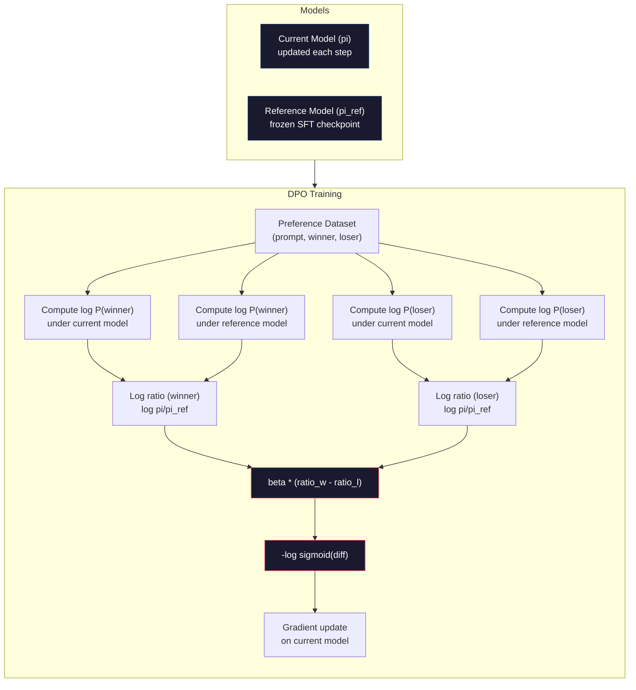

# 直接的偏好优化.

>  RLHF 工作.它还需要训练三个模型 (SFT,奖励模型,政策),管理PPO的不稳定性,并调整KL罚款.DPO问:如果你能跳过所有这些吗?DPO直接优化语言模型在偏好对.没有奖励模型.没有PPO.一个训练循环.同样的结果.

> **【中文解读】**需要训练三个模型 (SFT、奖励模型、策略),还需要处理PPO的不稳定性──DPO 直接在偏好对优化语言模型不需要奖励模型,不需要PPO,一个训练循环,效果相当──

> **【拓展：DPO→简化对齐】**作为2023年斯坦福提出的RLHF替代方案,已成为许多开源模型的首选方法.

>  **【前置】**学本节前请先掌握:阶段10·07(RLHF) 理解RLHF流程和它的问题(3个模型 + PPO不稳定);PyTorch 监督学习基础──DPO是数学优雅的"RLHF没有RL",理解为什么有效需要看原文推导──

**Type:** Build
**Languages:** Python (with numpy)
**Prerequisites:** Phase 10, Lesson 07 (RLHF)
**Time:** ~90 minutes

>  **【类比】**直接给学生看"好答案"和"坏答案"对照,让它自己学1个模型+简单交叉──数学DPO证明"在偏好数据上做分类"等于"RLHF的最佳优势",省去了显而易见的 RM──

> ️ **【易错点】**警方的三个坑:**偏好数据质量决定一切**DPO 不像RLHF有RM平滑噪音,标注错误的偏好对直接学错;务必做标注质量控制――(2) **β 系数设错**太大(> 0.5)模型不变,太小(< 0.05)模型偏离SFT 太远;典型 0.1──(3) **没做 reference model**DPO损失 需要相对 SFT 模型的日志-试验差分,忘记加载调解模型 会训练崩;用 `AutoModelForCausalLM.from_pretrained(sft_path)`参考

## 学习目标

- 实施DPO培训,直接优化语言模型在没有单独的奖励模型的偏好对
  实现DPO培训,直接在偏好对上优化语言模型,无需单独的奖励模型
- 通过保险日志概率来推导DPO损失函数并解释它如何隐含地代表奖励模型
  推导DPO损失函数,解释它如何通过策略来表达数量概率隐式表示奖励模型
- 根据训练稳定性,计算成本和需要的模型数量,比较DPO与RLHF
  从训练稳定性,计算成本和需要模型数量方面比较DPO与RLHF
- 调整beta参数,以控制训练有素政策与参考模型有多不同
  调节beta参数,控制训练策略偏离参考模型程度

> **【中文解读】**本课实现DPO(直接偏好优化),RLHF的简化替代方案──DPO的核心洞察:最优化奖励函数可以由语言模型本身的代币概率数学推导出来,因此不需要单独的奖励模型──DPO将RLHF简化为一个监督学习步骤一个模型、一个损失函数、一个训练循环──

## 问题 问题引入

您在07课时构建了RLHF管道.三个阶段.三个模型.SFT模型,奖励模型和PPO优化的政策模型.仅仅奖励模型需要数千个人类偏好对和一个独立的训练循环.PPO需要仔细调整KL系数,学习率,剪辑比和时代数.

> 你在第七课中构建了RLHF管线――三个阶段――三个模型――SFT模型――奖励模型和使用PPO优化策略模型――仅仅需要数千个个人类偏好对和单独的训练循环――PPO需要仔细调整 KL 系数,学习率,截断率和时代数――

在实践中,PPO训练是臭名昭著的不稳定.小小的超参数变化导致训练分歧.奖励模型是人类偏好的不完美代理,政策找到了利用其弱点的方法.KL惩罚有助于,但需要自己的调整 - - 太低,你得到奖励黑客,太高,模型几乎不学.

> 实践中,PPO 训练以不稳定名义.微小的超参数变化就可能导致训练的散播.奖励模型是人类偏好的不完美代理,策略会找到利用其弱点的方法.

由于这种复杂性,InstructGPT发布后,大多数开源模型多年来一直与RLHF扎.这三阶段的管道很脆弱.每个阶段都有自己的故障模式,错误复合.

> 这种复杂性是InstructGPT发布后,大多数开源模型多年来难以使用RLHF的原因.

在2023年5月,拉斐尔·拉斐尔·拉斐尔·拉斐尔·拉斐尔·拉斐尔·拉斐尔·拉斐尔·拉斐尔·拉斐尔·拉斐尔·拉斐尔·拉斐尔·拉斐尔·拉斐尔·拉斐尔·拉斐尔·拉斐尔·拉斐尔·拉斐尔·拉斐尔·拉斐尔·拉斐尔·拉斐尔·拉斐尔·拉斐尔·拉斐尔·拉斐尔·拉斐尔·拉斐尔·拉斐尔·拉斐尔·拉斐尔·拉斐尔·拉斐尔·拉斐尔·拉斐尔·拉斐尔·拉斐尔·拉斐尔·拉斐尔·拉斐尔·拉斐尔·拉斐尔·拉斐尔·拉斐尔·拉斐尔·拉斐尔·拉斐尔·拉斐尔·拉菲尔·拉菲尔·拉菲尔·拉菲尔·拉菲尔·拉菲尔·拉菲尔·拉菲尔·帕·帕·帕·帕·帕·帕·帕·帕·帕·帕·帕·帕·帕·帕·帕·帕·帕·帕·帕·帕·帕·帕·帕··帕·帕·帕········帕·帕·帕···帕····帕·帕··································································································································································································· 优质奖励函数是数学上由语言模型的自己的代币概率决定的. 你可以完全跳过奖励模型,并直接在偏好对上优化语言模型.

> 2023年5月,拉斐尔·拉斐洛夫、阿奇特·夏马和斯坦福的同事发表了"直接偏好优化:你的语言模型是秘密的奖励模型"――关键洞察:你不需要单独的奖励模型――最优的奖励函数可以由语言模型本身的代币 概率数学确定――你可以完全跳过奖励模型,直接在偏好对优化语言模型――

博将RLHF降低到一个监督学习步骤.一个模型.一个损失函数.一个训练循环.没有强化学习. Zephyr-7B,是规模上使用DPO的第一个模型之一,在几个基准上匹配或击败了与全RLHF训练的模型.Meta在Llama 3的配线管道的一部分使用DPO.人类在配线研究中引用了DPO类型的方法.

> 光-7B是首批大规模使用光-7B的模型之一,在多个基准上匹配或超越使用完整的光-3光光光光光光光光光光光光光光光光光光光光光光光光光光光光光光光光光光光光光光光光光光光光光光光光光光光光光光光光光光光光光光光光光光光光光光光光光光光光光光光光光光光光光光光光光光光光光光光光光光光光光光光光光光光光光光光光光光光光光光光光光光光光光光光光光光光光光光光光光光光光光光光光光光光光光光光光光光光光光光光光光光光光光光光光光光光光光光光光光光光光光光光光光光光光光光光光光光光光光光光光光光光光光光光光光光光光光光光光光光光光光光光光光光光光光光光光光光光光

> **【中文解读】**德波解决了RLHF的三大痛点: 1) 不需要单独训练奖励模型; 2) 不需要处理PPO的不稳定性和超参数调整; 3) 从三模型管线简化为单单训练循环.

> **【拓展：DPO 在开源社区的普及】**已成为开源模型对齐的首选方法――HuggingFace TRL库原生支持DPO,Zephyr、Tulu、OpenHermes等知名开源模型都使用DPO替代PPO──与RLHF相比,DPO的训练成本约为后者的1/3(少一个奖励模型),并且训练更稳定──Llama3的对齐训练结合了DPO和其他方法──

## 概念的核心概念

### 关键的见解

利率率优化这一目标:

> 优化这个目标:

在此,R是奖励模型,pi是政策,pi_ref是参考模型,beta是KL系数.

> 其中R是奖励模型,pi是策略,pi_ref是参考模型,beta是KL系数.

对于任何奖励函数R,最佳政策是:

> 对于任何奖励函数R,最佳策略是:

在 Z(x) 是正常化常数.

> 其中,Z(x) 是归归一化常数──重新排列:

奖励完全表达在政策模型的概率和参考模型的概率方面.你不需要训练一个独立的奖励模型.奖励是*隐含*在概率比.

> 这就是突破.奖励完全由策略模型的概率和参考模型的概率表示.你不需要单独训练奖励模型.奖励是概率比中的*隐式*量.

取代这个为布拉德利-特里偏好模型:

> 让它变成布拉德利-特里的偏好模型:

由于两个答案都在同一提示x上,Z(x) 术语取消了.剩下的只是政策模型的日志概率和参考模型的日志概率的函数.

> 由于两个回复都是相同的提示 x 为条件,因此项已消灭.

### 局的损失

```
L_DPO = -log(sigmoid(beta * (log pi(y_w|x)/pi_ref(y_w|x) - log pi(y_l|x)/pi_ref(y_l|x))))
```

我们要打开每一块包装:

> 让我们解决每个部分:

- **y_w**= 首选 (获胜) 反应
- **y_l**= 拒绝 (输掉) 的反应
- **x**快速
- **pi**=当前模型 (正在接受培训)
- **pi_ref**=参考模型 (结的SFT检查点)
- **beta**=控制偏差的温度参数 (通常是0.1至0.5)

> **【中文解读】**损失函数的核心是"对数概率比对数概率比":beta * (log pi(y_w) /pi_ref(y_w) - log pi(y_l) /pi_ref(y_l))。它衡量策略模型相对于参考模型更偏好选择回复、更不偏好拒绝回复的程度──beta 控制策略偏离参考模型的程度(类似于RLHF值中的 KL系数),典型 0.1-0.5。

> **【拓展：DPO 的数学直觉】**果的突破在于将RLHF中奖励函数"隐式"表达为策略模型和参考模型的概率比:R(x,y) =beta * log(pi(yx) /pi_ref(yx)) + const. 这意味着不需要显式训练奖励模型策略模型本身就是奖励模型.

比例`log pi(y|x) / pi_ref(y|x)`当这个比率是正确的时,当前模型将比参考结果更高的概率分配给响应 y.当负时,当前模型将更低的概率分配给.

> 比率`log pi(y|x) / pi_ref(y|x)`对于数率概率比率. 当这个比率是正确的时,当前模型给回复 y 分布比参考更高的概率.

由于DPO损失,模型可以增加优先响应的日志概率比,并减少拒绝响应的日志概率. 贝塔参数控制模型可以如何积极偏离参考 - 小贝塔意味着允许大偏差,大贝塔使模型接近参考.

> 减轻拒绝回复的数量概率比――beta 参数控制模型偏离参考模型的激进程度小βETA 允许大偏差,大βETA 保持模型接近参考――



### 为什么DPO更简单

| Aspect | RLHF (PPO) | DPO |
|--------|-----------|-----|
| Models to train | 3 (SFT + reward + policy) | 1 (policy only) |
| Training loops | 3 (SFT, RM training, PPO) | 2 (SFT, DPO) |
| Hyperparameters | lr, KL coeff, clip ratio, RM lr, epochs x3 | lr, beta, epochs |
| Reward model | Required (separate training) | Implicit in model probabilities |
| RL algorithm | PPO (complex, unstable) | Supervised learning (stable) |
| GPU memory | 3-4 models in memory during PPO | 2 models (current + reference) |
| Training stability | Sensitive to hyperparameters | Robust, similar to SFT |

对于一个70B模型,每个副本都需要140GB的FP16.消除奖励模型的存储量是相当大的. 对于一个70B模型,每个副本需要140GB的FP16.

> 需要两个模型在内存中当前模型和结尾的参考模型. 需要三或四个:策略,参考,奖励模型,以及可选的值函数基线.

### 当DPO超过RLHF时

**Small datasets.**对于5,000到20,000个优先对,DPO通常匹配或超过RLHF.RLHF中的奖励模型需要足够的数据来概括 - - 有限数据,它过度过度并产生不可靠的奖励信号.DPO通过根本不需要奖励模型来绕过这个问题.

> **小型数据集。**对于 5,000-20,000个偏好时,DPO通常匹配或超越RLHF.

**Limited compute.**对于没有大型GPU集群的团队来说,这是实际的选择.

> **有限算力。**对于没有大型GPU集团的团队来说,这是实际的选择.

**Rapid iteration.**想尝试10种不同的偏好数据集,看哪个产生最佳模型?DPO让你每次实验都在几个小时内进行.RLHF需要重新训练每个数据集的奖励模型.

> **快速迭代。**想尝试10个不同的偏好数据集看哪个产生最好的模型?DPO 让你在几小时内运行每个实验.

### 当RLHF超过DPO时

**Large-scale training.**在GPT-4或Claude的规模上,RLHF的单独奖励模型可以捕获更细微的偏好信号.奖励模型作为一种学习的损失函数,适应复杂的质量标准.

> **大规模训练。**在GPT-4或Claude的规模上,RLHF的独立奖励模型可以捕获更细致的偏好信号.

**Complex reward signals.**当"更好"涉及多个维度 (有用性,无害性,诚实), 奖励模型可以学习这种多目的的交易.

> **复杂奖励信号。**当"更好"涉及多个维度 (有用性,无害性,诚实性),奖励模型可以学习这种多目标权衡.

**Iterative alignment.**基于RLHF的方法,RLHF管道可以通过当前的政策生成新的响应,让人类评价它们,并在线循环中重新训练奖励模型.DPO在固定的偏好对数据集上工作.宪法人工智能 (Anthropic的方法) 广泛使用RLHF的重复性属性.

> **迭代对齐。**通过当前策略生成新回复,让人类评分,并在线路循环中重新训练奖励模型.

### 超越DPO:KTO,ORPO,SIMPO

部启发了一系列简化的配列方法.

> 们开始了一系列简化对齐方法.

**KTO (Kahneman-Tversky Optimization, 2024):**你甚至不需要双子. 基创技术使用无对反, 只需将每个反应标记为"好"或"坏",而不用将其与其他选择进行比较. 这使得数据收集显著简化. 没有给注释者显示两个答案,然后问"哪个更好?",你显示一个答案,然后问"这是好的吗?"损失函数应用了前景理论的损失厌恶:坏答案受到惩罚,而不是好答案被奖励.

> **KTO（Kahneman-Tversky 优化，2024）：**你甚至不需要配对. 对于使用非配对反而言,只需要将每个回复标记为"好"或"坏",无需与替代方案进行比较. 这极大简化了数据收集.

**ORPO (Odds Ratio Preference Optimization, 2024):**组合SFT和配线在一个训练步骤中.而不是首先做SFT然后DPO,ORPO修改SFT损失以包括一个偏好信号.损失有两个条款:一个标准的下一个代币预测损失在偏好响应,加上一个机会比率条款增加了偏好和拒绝响应概率之间的差距.一个训练循环而不是两个.

> **ORPO（赔率比偏好优化，2024）：**在单个训练步骤中结合SFT和对齐――ORPO 修改SFT损失以包含偏好信号,而不是先做SFT再做DPO――损失有两个:首选回复标准下一个标志 预测损失,加上增加首选和被拒绝回复概率差距的赔率比率比率――一个训练循环取代两个――

**SimPO (Simple Preference Optimization, 2024):**完全消除了参考模型. SimPO 没有计算与冷引用的日志概率比,而是用响应的平均日志概率 (长度正常化) 作为隐含的奖励.这节省了记忆 (不需要参考模型) 并简化了训练.长度正常化防止模型更短的响应.

> **SimPO（简单偏好优化，2024）：**完全消除参考模型――SIMPO 使用回复的平均对数概率 (按长度归结) 作为隐式奖励,而不是对结结的参考计算对数概率比――这节省了内存(无需参考模型) 并简化了训练――长度归结防止模型偏向更短的回复――

| Method | Year | Models in Memory | Needs Pairs? | Needs Reference? | Training Loops |
|--------|------|-----------------|-------------|-----------------|----------------|
| RLHF | 2022 | 3-4 | Yes (for RM) | Yes | 3 |
| DPO | 2023 | 2 | Yes | Yes | 2 |
| KTO | 2024 | 2 | No (unpaired) | Yes | 2 |
| ORPO | 2024 | 1 | Yes | No | 1 |
| SimPO | 2024 | 1 | Yes | No | 1 |

趋势很明显:每个方法消除了一个更多的复杂性.RLHF需要一个奖励模型和PPO.DPO消除了这两种.KTO消除了对数据.ORPO消除了单独的SFT阶段.SIMPO消除了参考模型.调整税 - 从基模型到调整模型的计算和复杂性成本 - 持续下降.

> 趋势很明确:每种方法消除一个复杂性――RLHF 需要奖励模型和PPO――DPO 消除两者――KTO 消除对数据的配对――ORPO 消除单独的SFT阶段――SIMPO 消除参考模型――对齐税从基础模型到对齐模型的计算和复杂性成本持续下降――

### 实际的DPO部署

**Zephyr-7B (HuggingFace, October 2023):**基于Mistral 7B,SFT在UltraChat (200K例),然后DPO在UltraFeedback (60K偏好对).在MT-Bench上获得6.47分,这是当时最高的7B模型.比较来说,Llama 2 Chat 70B获得6.86分,这意味着Zephyr仅使用DPO对齐使用,获得了6%,这意味着Zephyr仅使用了DPO对齐的模型的10倍.

> **Zephyr-7B（HuggingFace，2023 年 10 月）：**作为比较,Llama 2 Chat 70B 获得 6.86 分,这意味着 Zephyr 仅使用 DPO 对齐就达到比较大10倍模型的94%.

**Llama 3 (Meta, April 2024):**结合表明,DPO和RLHF可以互补--RLHF用于广泛的排列,DPO用于目标的精炼.

> **Llama 3（Meta，2024 年 4 月）：**在初始RLHF阶段之后使用DPO──这种组合表明DPO和RLHF可以互补RLHF 用于广泛的对齐,DPO 用于定向精炼──

**Neural Magic / nm-chat (2024):**应用DPO到多个开源模型,在仅针对SFT的基线上,对对准准则的5-15%的改善一直存在.

> **Neural Magic / nm-chat（2024）：**采用多个开源模型,在对齐基准上一致显示,比纯SFT基线上提高了5-15%

## 建立它,实现它.
```figure
dpo-loss
```

## 建立它

### 步骤1: 首选数据集

像RLHF一样的格式 (即时,优先,拒绝) 倍.

> 格式与RLHF 相同(快速,首选,被拒绝) 三元组──DPO 直接消费这些数据,无需中间的奖励模型──

```python
import numpy as np
import sys
import os
sys.path.insert(0, os.path.join(os.path.dirname(__file__), "..", "..", "04-pre-training-mini-gpt", "code"))
from main import MiniGPT, LayerNorm, Embedding, TransformerBlock

PREFERENCE_DATA = [
    {
        "prompt": "What is the capital of France?",
        "preferred": "The capital of France is Paris.",
        "rejected": "France is a country in Europe. It has many cities. The capital is Paris. Paris is known for the Eiffel Tower.",
    },
    {
        "prompt": "Explain gravity in one sentence.",
        "preferred": "Gravity is the force that attracts objects with mass toward each other.",
        "rejected": "Gravity is something that makes things fall down when you drop them.",
    },
    {
        "prompt": "What is 15 times 7?",
        "preferred": "15 times 7 is 105.",
        "rejected": "Let me think about this. 15 times 7. Well, 10 times 7 is 70, and 5 times 7 is 35, so the answer might be around 105.",
    },
    {
        "prompt": "Name three programming languages.",
        "preferred": "Python, Rust, and TypeScript.",
        "rejected": "There are many programming languages. Some popular ones include various languages like Python and others.",
    },
    {
        "prompt": "What year did World War II end?",
        "preferred": "World War II ended in 1945.",
        "rejected": "World War II was a major global conflict. It involved many countries. The war ended in the mid-1940s, specifically in 1945.",
    },
    {
        "prompt": "Define machine learning.",
        "preferred": "Machine learning is a field where algorithms learn patterns from data to make predictions without being explicitly programmed.",
        "rejected": "Machine learning is a type of AI. AI stands for artificial intelligence. Machine learning uses data to learn.",
    },
]
```

### 步骤2:序列记录概率

对于DPO损失,需要计算给提示的响应的总日志概率.这意味着运行模型在完整的 (提示+响应) 序列上,并总结每个响应代币的日志概率.

>  DPO 损失需要计算给定提示 下回复的总对数概率──这意味着在完整的(快速 + 回复) 序列上运行模型,并对每个回复代币的对数概率求和──

```python
def tokenize_sequence(text, vocab_size=256):
    return [min(t, vocab_size - 1) for t in list(text.encode("utf-8"))]


def compute_sequence_log_prob(model, prompt_tokens, response_tokens, max_seq_len=128):
    full_sequence = prompt_tokens + response_tokens
    if len(full_sequence) > max_seq_len:
        full_sequence = full_sequence[:max_seq_len]

    if len(full_sequence) < 2:
        return 0.0

    input_ids = np.array(full_sequence[:-1]).reshape(1, -1)
    target_ids = np.array(full_sequence[1:])

    logits = model.forward(input_ids)
    logits = logits[0]

    max_logits = logits.max(axis=-1, keepdims=True)
    log_probs = logits - max_logits - np.log(
        np.exp(logits - max_logits).sum(axis=-1, keepdims=True)
    )

    prompt_len = len(prompt_tokens)
    response_start = max(0, prompt_len - 1)
    response_end = len(target_ids)

    if response_start >= response_end:
        return 0.0

    response_log_probs = log_probs[response_start:response_end, :]
    response_targets = target_ids[response_start:response_end]

    total_log_prob = 0.0
    for i, target in enumerate(response_targets):
        total_log_prob += response_log_probs[i, target]

    return total_log_prob
```

这种函数是DPO的工作马.对于每个偏好对,它运行四次:偏好响应模型,拒绝响应模型,偏好响应参考,拒绝响应参考.这相当于每次训练示例的4次前进通过,而RLHF的生成+奖励分数+价值估计+PPO更新.更简单,更快,更稳定.

> 这个函数是DPO的主力. 对每一个偏好对,它运行四次:模型在首选回复上,模型在被拒绝回复上,参考在首选回复上,参考在被拒绝回复上.

### 步骤3: 投资者损失

文件的核心是代码,一个函数,一个损失,没有奖励模型.

> 论文核心的代码实现――一个函数――一个损失――无需奖励模型――

```python
def sigmoid(x):
    return np.where(
        x >= 0,
        1.0 / (1.0 + np.exp(-x)),
        np.exp(x) / (1.0 + np.exp(x))
    )


def dpo_loss(policy_logprob_preferred, policy_logprob_rejected,
             ref_logprob_preferred, ref_logprob_rejected, beta=0.1):
    preferred_ratio = policy_logprob_preferred - ref_logprob_preferred
    rejected_ratio = policy_logprob_rejected - ref_logprob_rejected

    logit = beta * (preferred_ratio - rejected_ratio)

    loss = -np.log(sigmoid(logit) + 1e-8)

    preferred_reward = beta * preferred_ratio
    rejected_reward = beta * rejected_ratio

    return loss, {
        "preferred_ratio": float(preferred_ratio),
        "rejected_ratio": float(rejected_ratio),
        "logit": float(logit),
        "implicit_preferred_reward": float(preferred_reward),
        "implicit_rejected_reward": float(rejected_reward),
        "reward_margin": float(preferred_reward - rejected_reward),
    }
```

其他`preferred_ratio`其他`rejected_ratio`当当前模型将更高的概率分配给首选反应 (与参考相比) 和更低的概率分配给拒绝的反应时,逻辑是正的,损失是低的.训练信号将模型推向正面方向.

> `preferred_ratio`和 `rejected_ratio`当当前模型给首选回复分配更高的概率 (比参考模型) 和被拒绝回复分配更低的概率时,逻辑为正确和损失较低.

其他`implicit_preferred_reward`其他`implicit_rejected_reward`您可以提取它们来验证训练是否有效 - - 偏好和拒绝的奖励之间的差距应该在训练上增加.

> `implicit_preferred_reward`和 `implicit_rejected_reward`选和拒绝奖励之间的边界应在训练过程中增加.

### 步骤4:DPO培训循环

没有PPO,没有奖励模型,只是向前传递和梯度更新.

> 标准监督学习训练循环――无需PPO――无需奖励模型――只有前向传播和梯度更新――

```python
def copy_model_weights(source, target):
    target.embedding.token_embed = source.embedding.token_embed.copy()
    target.embedding.pos_embed = source.embedding.pos_embed.copy()
    target.ln_f.gamma = source.ln_f.gamma.copy()
    target.ln_f.beta = source.ln_f.beta.copy()
    for s_block, t_block in zip(source.blocks, target.blocks):
        t_block.attn.W_q = s_block.attn.W_q.copy()
        t_block.attn.W_k = s_block.attn.W_k.copy()
        t_block.attn.W_v = s_block.attn.W_v.copy()
        t_block.attn.W_out = s_block.attn.W_out.copy()
        t_block.ffn.W1 = s_block.ffn.W1.copy()
        t_block.ffn.W2 = s_block.ffn.W2.copy()
        t_block.ffn.b1 = s_block.ffn.b1.copy()
        t_block.ffn.b2 = s_block.ffn.b2.copy()
        t_block.ln1.gamma = s_block.ln1.gamma.copy()
        t_block.ln1.beta = s_block.ln1.beta.copy()
        t_block.ln2.gamma = s_block.ln2.gamma.copy()
        t_block.ln2.beta = s_block.ln2.beta.copy()


def dpo_train(policy_model, reference_model, preference_data,
              num_epochs=5, lr=5e-6, beta=0.1, max_seq_len=128):
    print(f"DPO Training: {len(preference_data)} pairs, {num_epochs} epochs, "
          f"lr={lr}, beta={beta}")
    print()

    losses = []
    margins = []

    for epoch in range(num_epochs):
        epoch_loss = 0.0
        epoch_margin = 0.0
        num_examples = 0

        indices = np.random.permutation(len(preference_data))

        for idx in indices:
            pair = preference_data[idx]

            prompt_tokens = tokenize_sequence(pair["prompt"])
            preferred_tokens = tokenize_sequence(pair["preferred"])
            rejected_tokens = tokenize_sequence(pair["rejected"])

            pi_logprob_w = compute_sequence_log_prob(
                policy_model, prompt_tokens, preferred_tokens, max_seq_len
            )
            pi_logprob_l = compute_sequence_log_prob(
                policy_model, prompt_tokens, rejected_tokens, max_seq_len
            )
            ref_logprob_w = compute_sequence_log_prob(
                reference_model, prompt_tokens, preferred_tokens, max_seq_len
            )
            ref_logprob_l = compute_sequence_log_prob(
                reference_model, prompt_tokens, rejected_tokens, max_seq_len
            )

            loss, metrics = dpo_loss(
                pi_logprob_w, pi_logprob_l,
                ref_logprob_w, ref_logprob_l, beta
            )

            update_direction = 1.0 if metrics["logit"] < 0 else -0.1
            for block in policy_model.blocks:
                block.ffn.W1 += lr * update_direction * np.random.randn(*block.ffn.W1.shape) * 0.01
                block.ffn.W2 += lr * update_direction * np.random.randn(*block.ffn.W2.shape) * 0.01

            epoch_loss += loss
            epoch_margin += metrics["reward_margin"]
            num_examples += 1
            losses.append(float(loss))
            margins.append(metrics["reward_margin"])

        avg_loss = epoch_loss / max(num_examples, 1)
        avg_margin = epoch_margin / max(num_examples, 1)

        print(f"  Epoch {epoch + 1}/{num_epochs} | Loss: {avg_loss:.4f} | "
              f"Avg Margin: {avg_margin:.4f}")

    return policy_model, losses, margins
```

训练循环与RLHF相比非常简单.对于每个偏好对:计算四个日志概率 (两个模型,两个反应),将它们插入DPO损失中,计算梯度,更新政策.没有生成步骤.没有奖励模型推断.没有优势估计.没有剪辑.

> 与RLHF相比,训练循环简单令人目睹一新――对每一个偏好:计算四个对数概率――两个模型,两个回复),代入DPO损失,计算梯度,更新策略――无需生成步骤――无需奖励模型推理――无需优势估计――无需截断――

### 步骤5:比较DPO与RLHF

测量隐含的奖励利和日志概率变化,将DPO与07课程的RLHF模型进行比较.

> 测量隐形奖励边缘和对数概率偏移,将DPO与第七课的RLHF模型进行比较.

```python
def evaluate_preference_accuracy(model, reference_model, preference_data, beta=0.1, max_seq_len=128):
    correct = 0
    total = 0

    for pair in preference_data:
        prompt_tokens = tokenize_sequence(pair["prompt"])
        preferred_tokens = tokenize_sequence(pair["preferred"])
        rejected_tokens = tokenize_sequence(pair["rejected"])

        pi_w = compute_sequence_log_prob(model, prompt_tokens, preferred_tokens, max_seq_len)
        pi_l = compute_sequence_log_prob(model, prompt_tokens, rejected_tokens, max_seq_len)
        ref_w = compute_sequence_log_prob(reference_model, prompt_tokens, preferred_tokens, max_seq_len)
        ref_l = compute_sequence_log_prob(reference_model, prompt_tokens, rejected_tokens, max_seq_len)

        preferred_reward = beta * (pi_w - ref_w)
        rejected_reward = beta * (pi_l - ref_l)

        if preferred_reward > rejected_reward:
            correct += 1
        total += 1

    return correct / max(total, 1)


def analyze_implicit_rewards(model, reference_model, preference_data, beta=0.1, max_seq_len=128):
    print("Implicit Reward Analysis:")
    print("-" * 65)
    print(f"  {'Prompt':<30} {'Pref Reward':>12} {'Rej Reward':>12} {'Margin':>10}")
    print("  " + "-" * 60)

    for pair in preference_data:
        prompt_tokens = tokenize_sequence(pair["prompt"])
        preferred_tokens = tokenize_sequence(pair["preferred"])
        rejected_tokens = tokenize_sequence(pair["rejected"])

        pi_w = compute_sequence_log_prob(model, prompt_tokens, preferred_tokens, max_seq_len)
        pi_l = compute_sequence_log_prob(model, prompt_tokens, rejected_tokens, max_seq_len)
        ref_w = compute_sequence_log_prob(reference_model, prompt_tokens, preferred_tokens, max_seq_len)
        ref_l = compute_sequence_log_prob(reference_model, prompt_tokens, rejected_tokens, max_seq_len)

        pref_reward = beta * (pi_w - ref_w)
        rej_reward = beta * (pi_l - ref_l)
        margin = pref_reward - rej_reward

        truncated = pair["prompt"][:28] + ".." if len(pair["prompt"]) > 30 else pair["prompt"]
        print(f"  {truncated:<30} {pref_reward:>12.4f} {rej_reward:>12.4f} {margin:>10.4f}")

    print()
```

### 步骤 6: 贝塔敏感性分析

测试结果是DPO的等于RLHF中的KL系数.它控制模型可以从参考中偏离多大.

> 贝塔参数是DPO中相当于RLHF KL系数参数. 它控制模型可以偏离参考模型程度.

```python
def beta_sensitivity_analysis(sft_model, preference_data, betas, max_seq_len=128):
    print("Beta Sensitivity Analysis")
    print("-" * 60)
    print(f"  {'Beta':>8} {'Final Loss':>12} {'Final Margin':>14} {'Accuracy':>10}")
    print("  " + "-" * 55)

    results = []

    for beta in betas:
        policy = MiniGPT(
            vocab_size=256, embed_dim=128, num_heads=4,
            num_layers=4, max_seq_len=max_seq_len, ff_dim=512
        )
        reference = MiniGPT(
            vocab_size=256, embed_dim=128, num_heads=4,
            num_layers=4, max_seq_len=max_seq_len, ff_dim=512
        )
        copy_model_weights(sft_model, policy)
        copy_model_weights(sft_model, reference)

        policy, losses, margins_list = dpo_train(
            policy, reference, preference_data,
            num_epochs=3, lr=5e-6, beta=beta, max_seq_len=max_seq_len
        )

        accuracy = evaluate_preference_accuracy(
            policy, reference, preference_data, beta, max_seq_len
        )

        final_loss = losses[-1] if losses else 0
        final_margin = margins_list[-1] if margins_list else 0

        print(f"  {beta:>8.3f} {final_loss:>12.4f} {final_margin:>14.4f} {accuracy:>10.1%}")
        results.append({
            "beta": beta,
            "final_loss": final_loss,
            "final_margin": final_margin,
            "accuracy": accuracy,
        })

        print()

    return results
```

小β (0.01) 让模型自由偏离参考 - - 快速学习但出现退化解决方案的风险.大β (1.0) 让模型接近参考 - - 稳定但学习缓慢.大多数应用程序的甜点点是0.1到0.3.

> 小βbeta(0.01) 让模型自由偏离参考学得快但有退化解决方案风险──大βbeta(1.0) 保持模型接近参考稳定但学得慢──大多数应用的最佳值为0.1~0.3──

## 用它实现框架

### 完整的DPO管道演示

```python
if __name__ == "__main__":
    np.random.seed(42)

    print("=" * 70)
    print("DPO: DIRECT PREFERENCE OPTIMIZATION")
    print("=" * 70)
    print()

    print("STEP 1: Initialize SFT Model (from Lesson 06)")
    print("-" * 50)
    sft_model = MiniGPT(
        vocab_size=256, embed_dim=128, num_heads=4,
        num_layers=4, max_seq_len=128, ff_dim=512
    )
    print(f"  Parameters: {sft_model.count_parameters():,}")
    print()

    print("STEP 2: DPO Training")
    print("-" * 50)

    policy_model = MiniGPT(
        vocab_size=256, embed_dim=128, num_heads=4,
        num_layers=4, max_seq_len=128, ff_dim=512
    )
    reference_model = MiniGPT(
        vocab_size=256, embed_dim=128, num_heads=4,
        num_layers=4, max_seq_len=128, ff_dim=512
    )
    copy_model_weights(sft_model, policy_model)
    copy_model_weights(sft_model, reference_model)

    policy_model, losses, margins = dpo_train(
        policy_model, reference_model, PREFERENCE_DATA,
        num_epochs=5, lr=5e-6, beta=0.1
    )
    print()

    print("=" * 70)
    print("STEP 3: Evaluate")
    print("=" * 70)
    print()

    pre_accuracy = evaluate_preference_accuracy(
        sft_model, reference_model, PREFERENCE_DATA, beta=0.1
    )
    post_accuracy = evaluate_preference_accuracy(
        policy_model, reference_model, PREFERENCE_DATA, beta=0.1
    )

    print(f"  Preference accuracy (pre-DPO):  {pre_accuracy:.1%}")
    print(f"  Preference accuracy (post-DPO): {post_accuracy:.1%}")
    print()

    analyze_implicit_rewards(policy_model, reference_model, PREFERENCE_DATA, beta=0.1)

    print("=" * 70)
    print("STEP 4: Training Dynamics")
    print("=" * 70)
    print()

    if losses:
        print("  Loss curve:")
        window = max(1, len(losses) // 5)
        for i in range(0, len(losses), window):
            chunk = losses[i:i + window]
            avg = sum(chunk) / len(chunk)
            print(f"    Steps {i:3d}-{i + len(chunk) - 1:3d}: loss = {avg:.4f}")
        print()

    if margins:
        print("  Reward margin curve:")
        window = max(1, len(margins) // 5)
        for i in range(0, len(margins), window):
            chunk = margins[i:i + window]
            avg = sum(chunk) / len(chunk)
            print(f"    Steps {i:3d}-{i + len(chunk) - 1:3d}: margin = {avg:.4f}")
        print()

    print("=" * 70)
    print("STEP 5: Beta Sensitivity")
    print("=" * 70)
    print()

    beta_results = beta_sensitivity_analysis(
        sft_model, PREFERENCE_DATA, betas=[0.01, 0.1, 0.3, 1.0]
    )

    print("=" * 70)
    print("DPO vs RLHF COMPARISON")
    print("=" * 70)
    print()
    print("  DPO advantages:")
    print("    - 1 training loop (vs 3 for RLHF)")
    print("    - 2 models in memory (vs 3-4 for RLHF)")
    print("    - Supervised learning (vs RL, more stable)")
    print("    - No reward model to train or maintain")
    print()
    print("  RLHF advantages:")
    print("    - Separate reward model captures complex preferences")
    print("    - Online learning: generate, rate, retrain")
    print("    - Better for multi-objective alignment")
    print("    - Proven at largest scales (GPT-4, Claude)")
    print()
    print("  Practical guidance:")
    print("    - Start with DPO. It's simpler and often sufficient.")
    print("    - Switch to RLHF if DPO plateaus on your eval metrics.")
    print("    - Many production systems use both: RLHF first, DPO to refine.")
```

## 运送它.

这一课产生了`outputs/prompt-alignment-method-selector.md`根据您的数据可用性,计算预算和调整目标,它建议制定一种方法和培训计划.

> 本课产出发 `outputs/prompt-alignment-method-selector.md`一个帮助你选择正确的齐方法的提示.根据你的数据可用性,计算预算和齐目标,它建议一种方法和训练计划.

## 练习题

1. 实现KTO (Kahneman-Tversky优化).KTO不需要双,只需要标记每个反应为"好"或"坏".`-log(sigmoid(beta * log_ratio))`对于一个坏反应,`-log(1 - sigmoid(beta * log_ratio))`根据相同的数据 (独立地将"好"和"坏"视为好) 进行训练,并与DPO进行准确比较.
   中文翻译:实现KTO(Kahneman-Tversky 优化) ・KTO 不需要配对只需要将每个回复标记为"好"或"坏"――好回复的损失是`-log(sigmoid(beta * log_ratio))`坏回复的损失是`-log(1 - sigmoid(beta * log_ratio))`由于这些数据的不同,但在数据中, 由于这些数据的不同, 由于这些数据的不同, 由于这些数据的不同, 由于这些数据的不同, 由于这些数据的不同, 由于这些数据的不同, 由于这些数据的不同, 由于这些数据的不同, 由于这些数据的不同, 由于这些数据的不同, 由于这些数据的不同, 由于这些数据的不同, 由于这些数据的不同, 由于这些数据的不同, 由于这些数据的不同, 由于这些数据的不同, 由于这些数据的不同, 由于这些数据的不同, 由于这些数据的不同, 由于这些数据的不同, 由于这些数据的不同, 由于这些数据的不同, 由于这些数据的不同, 由于这些数据的不同, 由于这些数据的不同, 由于这些数据的不同, 由于这些数据的不同, 由于这些数据的不同, 由于这些数据的不同, 由于这些数据的不同, 由于这些数据的不同, 由于这些数据的不同, 由于这些数据的不同, 由于这些数据的不同.

2. 实现长度正常化DPO. 代替原始日志概率,按响应代币数量划分: `normalized_logprob = total_logprob / num_tokens`模型不愿意更短的响应 (总计记录检查率较高).
   中文翻译:实现长度归归一化 DPO──不使用原始对数概率,而是除以回复代币数:`normalized_logprob = total_logprob / num_tokens`△这防止模型偏向更短的回复 (短回复有更高的总对数概率) △相比有归化和无归化隐式奖励边距.

3. 建立ORPO类型的组合损失. 添加一个标准的下一个代币预测损失在首选的响应对DPO损失: `L = L_sft(preferred) + alpha * L_dpo`试试0.1,0.5和1.0的阿尔法值. 合并损失应产生一个遵循指令 (从SFT术语) 和更好的反应 (从DPO术语) 的模型,从而消除了单独的SFT阶段的需要.
   中文翻译:构建ORPO风格的组合损失.在DPO损失上添加首选回复的标准下一个标志 预测损失:`L = L_sft(preferred) + alpha * L_dpo`尝试alpha 值0.1、0.5 和 1.0──组合损失应产生既能遵循指令的模型,消除单独的SFT 阶段的需求.

4. 运行反复DPO.运行DPO3个时代,然后从训练模型中生成新的响应,将它们与原来的首选响应结合成新的首选对,然后再次运行DPO.这次"自动玩"过程的两轮.比较1轮和2轮后的首选精度,看是否反复精炼有帮助.
   中文翻译:实现代DPO──运行DPO3个时代,然后从训练后的模型产生新回复,将它们与原始首选回复配对作为新偏好对,再次运行DPO──两轮"自我对"过程──比较第一轮和第二轮后的偏好准确率,看代精炼是否有帮助──

5. 试图: (a) 基础模型 (SFT前), (b) DPO的第一时期的检查点, (c) 政策模型的指数动向平均值. 报告哪个参考产生最高的偏好准确性和最稳定的训练曲线.
   中文翻译:比较使用不同参考模型的DPO──不使用SFT 检查点作为参考,尝试:(a) 基础模型(SFT 前),(b) DPO 第1个时代的检查点,(c) 策略模型的指数移动平均──报告哪个参考产生最高偏好准确率和最稳定的训练曲线──

## 关键词 快速查找表

| Term | What people say | What it actually means | 中文释义 |
|------|----------------|----------------------|---------|
| DPO | "RLHF without RL" | Direct Preference Optimization: a supervised learning algorithm that optimizes the language model directly on preference pairs, bypassing the reward model and PPO | 直接偏好优化，无需奖励模型和 PPO 的对齐方法 |
| Implicit reward | "The reward is in the model" | The reward function is determined by the log-probability ratio between the policy and reference models -- no separate reward model needed | 隐式奖励，由策略与参考模型的概率比决定 |
| Beta (DPO) | "The temperature" | Controls how far the policy can deviate from the reference model -- small beta allows large deviations, large beta keeps the model close | Beta 参数，控制策略偏离参考模型的程度 |
| Log-probability ratio | "How much the model changed" | log pi(y\|x) - log pi_ref(y\|x) -- positive means the current model assigns higher probability than the reference | 对数概率比，衡量策略相对参考模型的概率变化 |
| Reference model | "The frozen checkpoint" | A copy of the SFT model whose weights never change -- serves as the anchor for computing probability ratios | 参考模型，冻结的 SFT 检查点 |
| KTO | "DPO without pairs" | Kahneman-Tversky Optimization: works with unpaired "good" or "bad" labels instead of requiring preference pairs | 无需偏好对的优化方法，只需"好/坏"标签 |
| ORPO | "One-step alignment" | Odds Ratio Preference Optimization: combines SFT and alignment into a single training loop by adding a preference term to the SFT loss | 一步对齐，将 SFT 和对齐合并为单一训练循环 |
| SimPO | "No reference needed" | Simple Preference Optimization: eliminates the reference model by using length-normalized average log-probability as the implicit reward | 无需参考模型，用长度归一化概率作隐式奖励 |
| Alignment tax | "The cost of making models safe" | The additional compute, data, and complexity required to go from a base model to an aligned model -- DPO reduces this significantly | 对齐税，从基础模型到对齐模型的额外成本 |

## 继续阅读 继续阅读

- [Rafailov et al., 2023 -- "Direct Preference Optimization: Your Language Model is Secretly a Reward Model"](https://arxiv.org/abs/2305.18290)-- 简化从RLHF到监督学习的调整
- [Tunstall et al., 2023 -- "Zephyr: Direct Distillation of LM Alignment"](https://arxiv.org/abs/2310.16944)-- Zephyr-7B,显示DPO在超反匹配RLHF在基准
- [Ethayarajh et al., 2024 -- "KTO: Model Alignment as Prospect Theoretic Optimization"](https://arxiv.org/abs/2402.01306)--消除对配制偏好的必要性
- [Hong et al., 2024 -- "ORPO: Monolithic Preference Optimization without Reference Model"](https://arxiv.org/abs/2403.07691)-- 结合SFT和配线在一个步骤
- [Meng et al., 2024 -- "SimPO: Simple Preference Optimization with a Reference-Free Reward"](https://arxiv.org/abs/2405.14734)--完全消除了参考模型
- [Llama 3 Technical Report](https://arxiv.org/abs/2407.21783)--Meta的配线管道,结合RLHF和DPO
