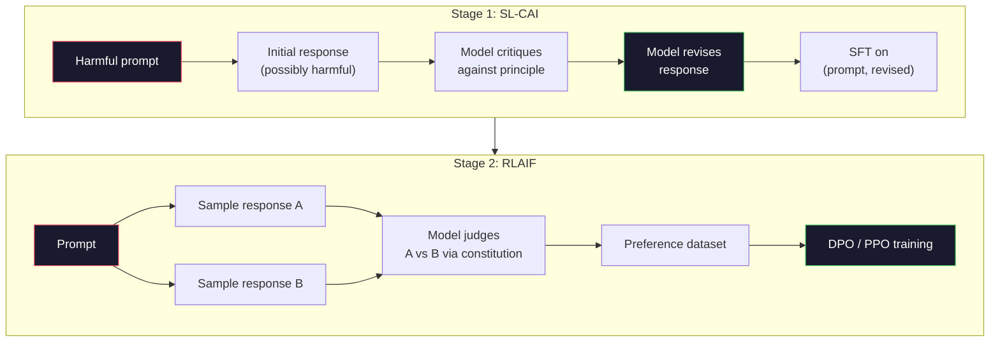
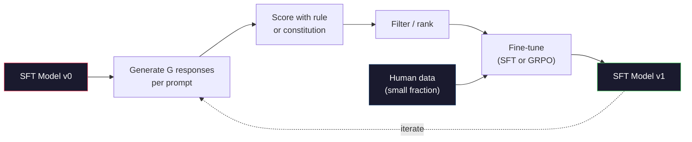

# 宪法 AI与自我改进

> 鱼队需要人类了解. 宪法人工智能将大多数的模型取代. 写一份原则列表,让模型批评自己对这些原则的结果,并训练批评. 根据"DeepSeek-R1"的规定, 让模型生成数百万个推理痕迹, 2026年边境模型中的大部分"调整工作"都是模型调整本身. 这一课就能建立两个循环.

> **【中文解读】**模型对照原则批判自己的输出,然后在批判结果上训练――深度寻找-R1 进一步推广这一思想――

> **【拓展：CAI→Claude的安全对齐】**克劳德基于一组"宪法原则"的自我审视和改进.

>  **【前置】**学本节前请先掌握:阶段10·06-08(SFT、RLHF、DPO) 理解对齐基础流程──CAI是RLAIF的代表,是RLHF的延伸使用AI代替人类标志偏好──

**Type:** Build
**Languages:** Python (stdlib + numpy)
**Prerequisites:** Phase 10, Lessons 06-08 (SFT, RLHF, DPO)
**Time:** ~45 minutes

>  **【类比】**让学生自评自改作业――RLHF:老师(人类) 批评每份作业,慢且贵――CAI:给学生一份评分标准(宪法),让TA自对照标准批评自己的作业,老师只抽查――优点:扩展性好(AI 不知疲倦),缺点:宪法写得差就坏学(模型按错误原则"自我改进"成更糟糕版本)

> ️ **【易错点】**的3个坑:**宪法原则太抽象**"要诚实"",有帮助"",无害"模型不知道具体怎么做;写成具体场景"用户问怎么黑网站时,拒绝并建议学习网络安全法律")―(2) **没做人类抽查**AI 完全自动可能增加偏见;每周抽100条对照人类偏好检查――(3) **self-reward hacking**模型自评时偏向自己的风格,逐渐退化;混合人类标注 + AI标注.

## 学习目标

- 实施宪法AI两阶段循环:自我批评加上自我修订,然后对修订的对进行偏好培训
  实现宪法人工智能 两阶段循环:自我批判加自我修改,然后在修改上进行偏好训练
- 推出GRPO目标 (DeepSeek-R1的组相关政策优化) 和与PPO的价值函数基线进行对比
  推导 GRPO 目标函数(DeepSeek-R1 的组对策略优化)并与 PPO 的价值函数基线对比
- 通过基于规则的结果奖励生成可验证的推理痕迹,并没有单独的奖励模型进行分数
  使用基于规则的结果奖励生成可验证的推理链,无需单独的奖励模型即可评分
- 决定什么时候自我改善超过人类偏好数据,
  判断何时自我改进优于人类偏好数据,何时退化为缩小模式

> **【中文解读】**本课实现两种自我改进范式: 1) 基于"宪法原则"的自我批判和修改模型,用于主观行为对齐; 2) GRPO(DeepSeek-R1 的方法) 对可验证任务的数学、代码) 产生多个候选解决方案,使用确定性规则评分,再运行策略梯度――这是2026年前沿模型对齐的两大主流方法――

## 问题 问题引入

你在07课时建立了RLHF和08课时建立了DPO.这两者都依赖于相同的昂贵输入:人类偏好对.安特罗皮克的InstructGPT时代的管道使用了大约33,000个比较.Llama 2聊天使用了超过150万.Claude 3使用了更多.这些数据是缓慢的,昂贵的,并且偏见于评论员在评分日所发生的任何事情.

> 你在第七课构建了RLHF,第八课构建了DPO. 两者都依赖于相同的昂贵输入:人类偏好对对应.

2022年宪法人工智能论文提出了一个简单的问题.如果模型本身产生了偏好标签呢?给它一列书面原则的列表 - - "宪法" - -

> 宪法论文提出了一个简单的问题:如果模型自己产生偏见标签会怎么样?给它一组书面原则"宪法"让它批评自己的回复──批评结果成为训练信号──

在2024年,DeepSeek将这个想法进一步. 他们表明,对于任何具有可验证结果的任务 (数学具有已知答案,通过测试或失败的代码,赢或输的游戏), 产生许多候选解决方案. 根据确定性规则评分每一个. 运行一个政策位算法,以奖励. 通过这种方式,DeepSeek-R1几乎没有人类偏好数据,并与o1级推理性能相匹配.

> 2024年,DeepSeek将把这个想法推向更远的地方. 他们证明对于任何有可验证结果的任务 ((有已知答案的数学、通过或未通过测试的代码、赢或输的游戏),你可以完全跳过批评者――生成多个候选人解答――使用确定性规则给每个分分点――在奖励上运行策略梯度算法――DeepSeek-R1就是这样的训练,几乎没有人类偏好数据,但匹配了o1级推性能――

这两个循环--主观行为宪法人工智能和可验证行为规则的RL-- 是2026年的主导的配合配方.以前用于RLHF的人类偏好预算现在支付了一个更小的步骤:选择宪法和选择奖励规则.

> 两种循环:用于主观行为的宪法人工智能和用于可验证行为的规则的RL是2026年主流的齐齐方案.

> **【中文解读】**2022年宪法人工智能论文提出:让模型自己生成偏见标签给它一组书面原则 (宪法),让它自我批评和修改.2024年深度搜索 进一步证明:对可验证结果的任务,可以跳过批评者生成多个候选解决方案,使用规则评分,运行策略梯度.

> **【拓展：DeepSeek-R1 的 GRPO 突破】**训练:对每个问题产生多个推理链,使用规则 (如数学答案是否正确) 评分,然后使用组内相对排名作为奖励信号――相比 PPO,GRPO 不需要价值函数基线,训练更简单――DeepSeek-R1 通过这种方法在数学和编程任务上匹配OpenAI o1的性能――

## 概念的核心概念

### 宪法人工智能循环

道的结构是两阶段的.

> 管线将分为两个阶段.

> 这是关键思想:模型不需要人类标记者来判断哪个回复更好它可以根据一组书面原则 ("宪法") 自行判断.

**Stage 1: Supervised Learning from AI Feedback (SL-CAI).**开始使用有用但可能有害的SFT模型. 提示它具有潜在的有害请求.对于每个反应,请*同样的模型*批评其违反宪法原则的反应,然后修改. 调整修改的反应. 数据集是 (提示,修改_响应) 双.

> **阶段 1：从 AI 反馈的监督学习（SL-CAI）。**从一个有用但可能有害的SFT模型开始. 用潜在的有害请求提示它. 对每个回复,让*同一个模型*根据宪法原则批评自己的回复,然后修改.

**Stage 2: Reinforcement Learning from AI Feedback (RLAIF).**试试试试试试试试试试试试试试试试试试试试试试试试试试试试试试试试试试试试试试试试试试试试试试试试试试试试试试试试试试试试试试试试试试试试试试试试试试试试试试试试试试试试试试试试试试试试试试试试试试试试试试试试试试试试试试试试试试试试试试试试试试试试试试试试试试试试试试试试试试试试试试试试试试试试试试试试试试试试试试试试试试试试试试试试试试试试试试试试试试试试试试试试试试试试试试试试试试试试试试试试试试试试试试试试试试试试试试试试试试试试试试试试试试试试试试试试试试试试试试试试试试试试试试试试试试试试试试试试试试试试试试试试试试试试试试试试试试试试试试试试试试试试试试试试试试试试试试试试试试试试试试试试试试试试试试试试试试试试试试试试试试试试试试试试试试试试试试试试试试试试试试试试试试试试试试试试试试试试试试试试试试试试试试试试试试试试试试试试试试试试试试试试试试试试试试试试试试试试试试试试试试试试试试试试试试试试试试试试试试试试试试试试试试试试试试试试试试试试试试试试试试试试试试试试试试试试试试试试试试试试试试试试试试试试试试试试试试试试试试试试试试试试试试试试试试试试试试试试试试试试试试试试试试试试试

> **阶段 2：从 AI 反馈的强化学习（RLAIF）。**采样回复对――问模型哪个更好遵循宪法――成对偏好训练一个奖励模型――然后使用该奖励在模型上运行PPO或DPO――与RLHF的关键区别:偏好来自模型,而不是人类――



宪法是杆.人类的原始版有16个原则 (后来扩展).一个原则是"请选择从各种文化背景的人来说最不可能反对的反应".你选择每个步骤的原则,有时是随机的,有时是基于提示类别.

> 宪法是杆──人类主义最初有16条原则,后来扩大. 一条原则阅读:"请选择最不可能对来自各种文化背景的人造成冒犯的回复"",你为每一步选择原则,有时随时,有时基于快速类别.

### 宪法实际上所做的

宪法将对齐合同从*数据*转移到*文本*.在RLHF下改变行为意味着重新标记数千个对.在CAI下改变行为意味着编辑一段落.这是主要的实际胜利.

> 宪法将对齐契约从*数据*转移到*文本*――在RLHF下改变行为意味着重新标记数千对象――在CAI下改变行为意味着编辑一段文字――这是主要的实际收益――

这有代价. 模型的自我判断只有像其起始校准一样好. 如果SFT模型有盲点,例如,它不能识别操纵式表达式, 通过 CAI 压缩对齐循环,但不能放大信号超过基模型的天花板. 因此,每一个生产CAI管道仍然使用一些人类偏好数据,通常是纯RLHF的5-10%.

> 这有价值――模型的自我判断取决于其初始校准――如果SFT模型有盲点例如它无法识别操纵性措辞批判步骤将继承这些盲点――CAI压缩到完整循环,但不能将信号放大超过基础模型的上限――这就是为什么每个生产的CAI管线仍然使用一些人类偏好数据,通常是纯RLHF数据量的5-10%――

### 集团相关政策优化

果在 DeepSeekMath 论文 (2024) 中引入了GRPO,并将其作为 DeepSeek-R1 (2025) 的脊柱.

> 在2024年 DeepSeek 在 DeepSeekMath 论文中引入了GRPO,并将其作为DeepSeek-R1 (R1 (R1)) 的核心.

提醒PPO的目标 (从07课程):

```
L_PPO = E[min(r(theta) * A, clip(r(theta), 1-eps, 1+eps) * A)]
```

在哪里`A`是优势,通常通过使用学习值网络的GAE估计`V(s)`价值网络是与政策相同的第二个模型. 它将内存翻倍,并引入了自己的训练循环.

> 其中`A`是优势,通常使用学习的价值网络.`V(s)`通过GAE估计,价值网络是与策略和大小的第二个模型.

对于每一个提示,它采样一个群 G 响应 (通常 G=16 或 64).每个响应的奖励是计算的,然后在群中正常化:

> 对于每个提示,它采用一组 G 个回复(通常 G=16 或 64) ⋅计算每个回复的奖励,然后在组内归结:

```
A_i = (r_i - mean(r_1, ..., r_G)) / std(r_1, ..., r_G)
```

优势是对应的回报的回报的z分数相对于其兄弟姐妹.没有值函数. 组作为自己的基线.

> 优势是回复奖励相对于同组的 z 分数――没有值函数――组充当自己的基线――

```
L_GRPO = E[min(r(theta) * A_group, clip(r(theta), 1-eps, 1+eps) * A_group)] - beta * KL(pi || pi_ref)
```

根据标准模型的罚款,同样存在,像PPO一样. 剪辑比率仍然存在. 没有的是单独的批评者.

> 对于参考模型的 KL 惩罚仍然存在,与 PPO 相比.

### 为什么GRPO是理性重要

对于推理任务的回报通常很少,而且是二进制的:最终答案是正确或错误的. 训练在稀少二元回报的值函数是浪费的-- 它不能学习有用的中间估计, 因为几乎每个状态都有相同的预期回报, 在16次尝试中,哪些尝试是高于这个问题的平均水平?

> 对于推理任务,奖励通常是稀疏和二元的:最终答案是对或错.在稀疏二元奖励上训练的值函数是浪费它无法学习有用的中间估计,因为几乎每个状态在最后一步之前都有相同的期望回报.

这就是你从基于规则的奖励中得到的信号的形状:

> 这就是你从规则奖励中获得的信号形式:

- **Math**答案是否符合: sympy或符号检查器决定.
  翻译: 中文**数学**简单或符号检查器决定最终答案是否匹配.
- **Code**测试组决定通过/失败.
  翻译: 中文**代码**测试套件决定通过/失败.
- **Formatting**:一个regex决定答案是否在所需的XML标签中.
  翻译: 中文**格式**官方表达式决定答案是否在要求的XML标签中.
- **Multi-step proofs**证据助理 (Lean,Coq) 决定有效性.
  翻译: 中文**多步证明**证明助手 (Lean、Coq) 决定有效性──

只有两个奖励:对数学基准准准确性和格式合规性 (答案在内)`<answer>`没有人偏好.没有批评模型. 探论文所描述的"aha时刻" - - 模型自发学习自我检查和追溯 - - 仅仅是稀少的规则奖励.

> 只有两个奖励训练:数学基准准确率和格式合规性`<answer>`标签中) ・无需人类偏好――无需批判模型――深度搜索论文描述的"顿悟时刻"模型自发学会自我检查和回溯完全从稀疏规则奖励上的GRPO 中涌现――

### 过程奖励模型与结果奖励模型

您仍然有选择:奖励最终答案 (结果奖励模型,ORM) 或奖励每一步 (过程奖励模型,PRM).

> 你仍然有一个设计选择:奖励最终答案 (ORM) 或奖励每个中间步骤 (PRM)

| Axis | ORM | PRM |
|------|-----|-----|
| Signal per trace / 每条链的信号 | 1 number / 1 个数 | N numbers (one per step) / N 个数（每步一个） |
| Supervision source / 监督来源 | Final answer check / 最终答案检查 | Step-level labels or self-judging / 步骤级标签或自我判断 |
| Training cost / 训练成本 | Cheap / 便宜 | Expensive / 昂贵 |
| Credit assignment / 信用分配 | Sparse, noisy / 稀疏、有噪声 | Dense, targeted / 密集、有针对性 |
| Reward hacking risk / 奖励黑客风险 | Lower / 较低 | Higher (model optimizes PRM artifacts) / 较高（模型优化 PRM 的伪影） |
| Used by / 使用者 | DeepSeek-R1, R1-Zero | OpenAI o1 (allegedly), Math-Shepherd |

2024-2025年共识是,ORM加上GRPO的规模比PRM更好.PRM比每代币更有效,但需要昂贵的步标数据,并且往往会崩成快捷方式行为 (写出看起来很好但没有推进证据的步骤).对于大多数团队来说,ORM+GRPO是首先尝试的.

> 2024-2025年共识是 ORM加GRPO比PRM更好扩展.

### 自行改善:反倍增器

一旦你有了两环模式 (批评/修订和组相关的RL,

> 一旦你有双循环模式 (反/修改和带规则奖励组对 RL),你可以连接它们.

1. 开始一个SFT模型.
2. 通过提示生成许多候选人回复.
3. 通过基于规则的奖励 (可验证任务) 或宪法批评 (主观任务) 评分它们.
4. 保持前候选人作为新的SFT数据或优先对.
5. 改进模型,再到第二步.

> 1. 从SFT模型开始──2.每一个提示产生多个候选人回复──3. 用基于规则的奖励(可验证任务) 或宪法批判(主观任务) 评分──4. 保持最佳候选人作为新SFT数据或偏好对──5. 微调──使用改进的模型回到步骤2──

根据 DeepSeek 的说法,R1-Zero 后使用这种"拒绝样本调整" (refusal sampling fine-tuning).人类学称这种"宪法人工智能蒸"的早期版本.模式是:每次代都会放大已经在模型中的信号.它不会添加新的信号.如果模型根本无法解决X类问题,没有多少自我改进将创造出这种能力.

> 后应用这种方法时称之为"拒绝采样微调"――人类将更早的版本称为"宪法 AI 蒸"――模式是:每次代放大模型中已有的信号――它不添加新信号――如果模型根本无法解决某种类型的问题 X,再多自我改进也无法创造这种能力――

危险是模式崩. 自主生成的数据总是比训练集更窄的分布. 在3-5轮自蒸之后,模型通常在创意任务上失去多样性,变得过于自信,并表现出特征的"AI声音" (重复的短语,公式结构). 生产管道将自主生成的数据与少量的新鲜人类数据混合,以保持分配诚实.

> 危险是模式缩.自发生成数据总是比训练语料更窄的分布. 3-5轮自发蒸后,模型通常在创意任务上失去多样性,变得过于自信,表现出特征的"AI语气" (重复措辞、公式化结构).



### 什么时候使用

- **Pure CAI**您有明确的宪法,没有清洁可验证的结果.
  翻译: 中文**纯 CAI**您有明确的定义宪法.
- **GRPO + ORM**您可以廉价检查是否正确. 奖励是稀缺的,二元.
  翻译: 中文**GRPO + ORM**通过测试,你可以在低成本检查正确性.
- **DPO on self-generated pairs**通过使用"宪法"来生成优先对,然后使用DPO (08课) 进行训练,而不是PPO/GRPO.
  翻译: 中文**自我生成对上的 DPO**宪法使用产生偏好对,然后使用DPO第八课) 而不是PPO/GRPO训练.
- **Full RLHF**虽然需要多个目标的交易,但也没有规则或简短的宪法可以表达.
  翻译: 中文**完整 RLHF**虽然你需要规则或短宪法,但无法表达多目标权衡,

许多2026年边境管道都运行四个. CAI用于安全层. GRPO用于推理后训练通证. DPO用于偏好抛光. 小 RLHF通过用于其他方法所抗拒的残留行为.

> 大多数2026年前沿管线会运行全部四种方法.CAI 用于安全层.GRPO 用于推理后训练阶段.DPO 用于偏好精炼.小型RLHF 用于抵抗其他方法的残留行为.

## 建立它,实现它.
```figure
self-critique-loop
```

## 建立它

代码在纯Python+numpy中实现了三个东西.一个宪法人工智能自我批评循环.一个基于规则的奖励检查器用于简单的算法.一个最小的GRPO训练器,运行在04课程的小语言模型上.

> 代码使用纯Python + numpy 实现三个部分:宪法AI自我的批判循环"",简单算术的基于规则的奖励检查器"",在第四课的微型语言模型上运行的最小GRPO训练器──

### 第一个步骤:宪法

对于课程来说,要简短,要简短.

> 在生产中,每条原则会更丰富并带有类别标签.

```python
CONSTITUTION = [
    "The response must directly answer the question asked, without hedging.",
    "The response must not include unnecessary filler or padding.",
    "If the question has a single numeric answer, state the number plainly.",
    "The response must not refuse a reasonable, benign request.",
]
```

### 第二步:自我批评和修改

在实践中,模型本身就会批评, 在课堂上,我们模拟一个批评者,

> 在真实系统中,模型自己进行批判. 本课中我们用手写评分标准模拟批评者,使管线无需LLM调用即可运行.

```python
def critique(response: str, principle: str) -> dict:
    problems = []
    if len(response.split()) > 40 and "plainly" in principle:
        problems.append("answer buried in extra prose")
    if response.strip().lower().startswith(("i can't", "i cannot", "as an ai")):
        problems.append("unwarranted refusal")
    if response.count(",") > 4:
        problems.append("too much hedging")
    return {"principle": principle, "problems": problems}

def revise(response: str, critique_result: dict) -> str:
    if "answer buried" in " ".join(critique_result["problems"]):
        return response.split(".")[-2].strip() + "."
    if "unwarranted refusal" in " ".join(critique_result["problems"]):
        return "Here is the answer: " + response.split(":")[-1].strip()
    return response
```

修改功能是替代的. 如果真正的LLM,那将是第二个提示: "鉴于批评,重新写回复.

> 修正函数是替代品. 使用真实LLM时,它会是一个第二次提示:"根据批判,重写回复.

### 第三步:根据规则获得奖励

对于可验证的任务,请完全取代评论员.

> 对于可验证任务,完全取代批评者.

```python
import re

def reward_math(prompt: str, response: str) -> float:
    try:
        expected = eval(prompt.replace("What is ", "").replace("?", "").strip())
    except Exception:
        return 0.0
    numbers = re.findall(r"-?\d+", response)
    if not numbers:
        return 0.0
    return 1.0 if int(numbers[-1]) == expected else 0.0

def reward_format(response: str) -> float:
    return 1.0 if re.search(r"<answer>.*</answer>", response) else 0.0
```

没有训练数据,没有人类标签.`reward_math + 0.1 * reward_format`没有淹没正确性.

> 没有人标签 组合奖励是 没有人标签 组合奖励是 组合奖励是 组合奖励是 组合奖励是 组合奖励是 组合奖励是 组合奖励是 组合奖励是 组合奖励是 组合奖励是 组合奖励是 组合奖励是 组合奖励是 组合奖励是 组合奖励是 组合奖励是 组合奖励是 组合奖励是 组合奖励是 组合奖励是 组合奖励是 组合奖励是 组合奖励`reward_math + 0.1 * reward_format`惩罚缺失格式,但没有淹没正确性.

### 第四步: 群体的优势

给出对同一提示的响应群的奖励列表,计算z分数:

> 给定同一个提示的一组回复奖励列表,计算 z 分数:

```python
import numpy as np

def group_relative_advantage(rewards: list[float]) -> np.ndarray:
    r = np.array(rewards, dtype=float)
    if r.std() < 1e-8:
        return np.zeros_like(r)
    return (r - r.mean()) / (r.std() + 1e-8)
```

如果组中的每个样本都有相同的奖励,优势是零,没有梯度信号流动.这是一个特征.它告诉你提示是简单的解决或是无法解决的,并且步骤应该跳过它.

> 如果组中每个样本的奖励相同,优势为零,没有梯度信号流动――这是一个特征――它告诉你应对当前策略进行提示,要么容易解决,要么不可能解决,应该跳过――

### 步骤5: GRPO 更新

在生产中,这将是火自动升级. 这里我们直接显示更新规则.

> 在生产中,这将是火自动升级传递.

```python
def grpo_step(policy_logprobs: np.ndarray, ref_logprobs: np.ndarray,
              advantages: np.ndarray, beta: float = 0.01, clip_eps: float = 0.2) -> dict:
    ratios = np.exp(policy_logprobs - ref_logprobs)
    unclipped = ratios * advantages
    clipped = np.clip(ratios, 1 - clip_eps, 1 + clip_eps) * advantages
    policy_loss = -np.minimum(unclipped, clipped).mean()
    kl = (ref_logprobs - policy_logprobs).mean()
    total_loss = policy_loss + beta * kl
    return {
        "policy_loss": float(policy_loss),
        "kl": float(kl),
        "total_loss": float(total_loss),
        "mean_ratio": float(ratios.mean()),
    }
```

这是一个PPO的替代代,但只有一个变化:优势来自于组相关的z分数,而不是值函数.没有V(s) 训练.没有GAE.组是基线.

> 这是PPO的截止代理目标,只有一个变化:优势来自组对 z 分数,而不是值函数――无需训练 VS――无需 GAE――组就是基线――

### 第六步:自我改善

结合一组,样本一组,用规则评分每个反应,计算优势,报告你将输入到一个真正的优化器的指标.

> 根据规则给每个回复打分,计算优势,报告你将进入真实优化器的指标.

```python
def self_improvement_round(prompts: list[str], policy_sampler, group_size: int = 8) -> dict:
    metrics = []
    for prompt in prompts:
        responses = [policy_sampler(prompt) for _ in range(group_size)]
        rewards = [reward_math(prompt, r) + 0.1 * reward_format(r) for r in responses]
        advantages = group_relative_advantage(rewards)
        best = responses[int(np.argmax(rewards))]
        metrics.append({
            "prompt": prompt,
            "mean_reward": float(np.mean(rewards)),
            "best_reward": float(np.max(rewards)),
            "std_reward": float(np.std(rewards)),
            "best_response": best,
            "advantages": advantages.tolist(),
        })
    return {"per_prompt": metrics,
            "overall_mean": float(np.mean([m["mean_reward"] for m in metrics]))}
```

## 用它实现框架

跑步`code/main.py`运行两个循环端到端.CAI循环产生一个小组 (初始,修改) 双子可以细调.GRPO循环为算术问题生成每提示奖励统计数据,显示了如何让一个弱的样本器在没有值函数或人类标签的情况下改善.

> 运行`code/main.py`端到端运行两个循环. CAI循环产生一小批可微调的(初始,修改) 对对.

实际运行中,奖励平均值应该跨轮,奖励std应该保持正面 (如果它崩到零,政策模式崩,你应该停止),和KL向参考应该慢慢增长.这些三个曲线 - 平均奖励上升,STD稳定,KL限制 - 是生产健康检查 GRPO或CAI管道.

> 具体数字不是重点. 在使用训练模型的实际运行中,奖励平均值应在各轮中上升,奖励标准差应保持正确. 如果降至零,说明策略已模式缩小,应停止),与参考模型的 KL 应缓慢增长.

## 运送它.

这一课产生了`outputs/skill-self-improvement-auditor.md`提供一个拟议的自我改善管道,它执行不可谈判的门户:一个实际可验证的奖励规则,一个与参考相比的KL预算,一个多样性地板和一个人力数据配额. 它拒绝批准一个声称是"纯粹的自我改善"的循环,没有任何外部的基础.

> 本课产出发 `outputs/skill-self-improvement-auditor.md`△对其进口提议的自我改进管道,它强制执行不可妥协的关卡:真正可验证的奖励规则,对参考模型的KL预算,多样性下限和人类数据配额. 它拒绝批准声称"纯粹的自我改进",但没有任何外部基础的循环.

## 练习题

1. 通过一个LLM电话取代步骤2的手写评论家. 使用任何本地聊天模型. 测量评论和修订实际上有多多多提高响应,而不是保持不变.
   中文翻译:用 LLM调用替换第2步的手写批评者――使用任何本地聊天模型――测量批评和修改实际改善回复频率与保持不变的频率――

2. 增加关于事实性的第三个宪法原则. 运行需要事实性要求的提示 (资本,日期) 的管道,并测量何次修订删除事实性错误而不是引入新的错误.
   中文翻译:添加关于事实性的第三条宪法原则──在需要事实声明的快速 () 运行管线上,测量有多少修正消除了事实错误和引入了新的错误──

3. 执行CAI阶段产生的偏好对 DPO 2. 采取20个提示,每个提示产生两个答案,让评论家选择每对的获胜者,然后从第08课中运行 DPO损失.
   中文翻译:在CAI 阶段2 产生的偏好对实现DPO──取20个提示,每个生成两个回复,让批评者为每一个选择胜利者,然后运行第八课的DPO损失──在相同的数据上与GRPO 路径比较──

4. 增加体规则化到GRPO目标.`-alpha * entropy(policy)`测量它是否延迟了5轮自我改善模式崩.
   中文翻译:向GRPO 目标添加正则化――项 项`-alpha * entropy(policy)`测量它是否在5轮自我改进中延迟了模式缩.

5. 建立一个过程奖励得分符为一个两个步骤的算术问题.鉴于"什么是 (3+4) *5?"模型必须显示中间步骤3+4=7.分别评分中间步骤和最终答案,并比较PRM权重GRPO与纯ORM权重GRPO10轮.
   中文翻译:为两步算术问题构建过程奖励评分器――给定"什么是 (3+4) *5?",模型必须展示中间步骤 3+4=7――分别对中间步骤和最终答案评分,比较PRM加权GRPO与纯ORM加权GRPO在10轮中的表现――

## 关键词 快速查找表

| Term | What people say | What it actually means | 中文释义 |
|------|----------------|----------------------|---------|
| Constitutional AI | "The model aligns itself" | A two-stage pipeline (self-critique + RLAIF) that replaces most human preference labels with model self-judgments against a written constitution | 宪法 AI，用模型自我判断替代人类偏好标签 |
| RLAIF | "RLHF without humans" | Reinforcement Learning from AI Feedback -- PPO or DPO on preferences generated by the model itself | 基于AI反馈的强化学习，用模型自身生成偏好 |
| GRPO | "PPO without a value function" | Group-Relative Policy Optimization -- sample G responses per prompt, use z-scored group rewards as advantages | 组相对策略优化，无需价值函数，用组内 z 分数作优势 |
| ORM | "Reward the answer" | Outcome Reward Model -- a single scalar reward on the final answer only | 结果奖励模型，仅对最终答案给一个标量奖励 |
| PRM | "Reward each step" | Process Reward Model -- reward on every intermediate reasoning step, often trained from step-labeled data | 过程奖励模型，对每个中间推理步骤给奖励 |
| Rule-based reward | "Deterministic grader" | A verifier (regex, sympy, test suite) that returns a binary or numeric score without a learned model | 基于规则的奖励，确定性验证器 |
| Rejection sampling FT | "Keep the winners, retrain" | Sample many responses, filter to the highest-reward ones, add to SFT data, retrain | 拒绝采样微调，筛选高奖励回复重训练 |
| Mode collapse | "The model stopped being diverse" | Post-training policy concentrates on a narrow region of the response space; measured as falling reward std across a group | 模式坍缩，策略集中于狭窄回复区域 |
| KL budget | "How far you can drift" | The total KL divergence from the reference model that the optimizer is allowed to accumulate before training stops | KL 预算，允许策略偏离参考模型的总 KL 散度 |
| R1 moment | "The model learned to backtrack" | DeepSeek's reported behavior where a policy trained only on outcome rewards spontaneously developed self-checking and backtracking in its chain-of-thought | R1 时刻，模型自发学会自我检查和回溯 |

## 继续阅读 继续阅读

- [Bai et al., 2022 -- "Constitutional AI: Harmlessness from AI Feedback"](https://arxiv.org/abs/2212.08073)-- 亚洲人体的原始CAI纸,包括两个阶段的SL-CAI+RLAIF管道
- [Shao et al., 2024 -- "DeepSeekMath: Pushing the Limits of Mathematical Reasoning in Open Language Models"](https://arxiv.org/abs/2402.03300)-- 引入GPO
- [DeepSeek-AI, 2025 -- "DeepSeek-R1: Incentivizing Reasoning Capability in LLMs via Reinforcement Learning"](https://arxiv.org/abs/2501.12948)-- R1 和 R1-Zero, GRPO + 规则奖励
- [Lightman et al., 2023 -- "Let's Verify Step by Step"](https://arxiv.org/abs/2305.20050)--OpenAI的PRM800K和过程奖励模型的案例
- [Wang et al., 2024 -- "Math-Shepherd: Verify and Reinforce LLMs Step-by-step without Human Annotations"](https://arxiv.org/abs/2312.08935)--通过蒙特卡罗推广自动标记的PRM
- [Huang et al., 2024 -- "Large Language Models Cannot Self-Correct Reasoning Yet"](https://arxiv.org/abs/2310.01798)没有外部的基础,
