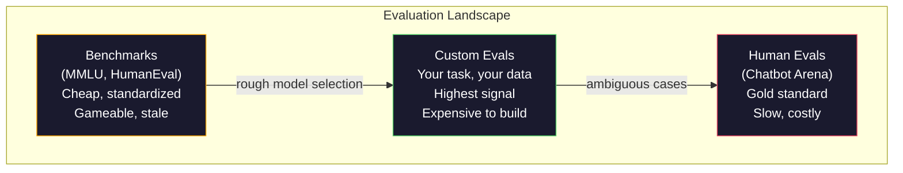
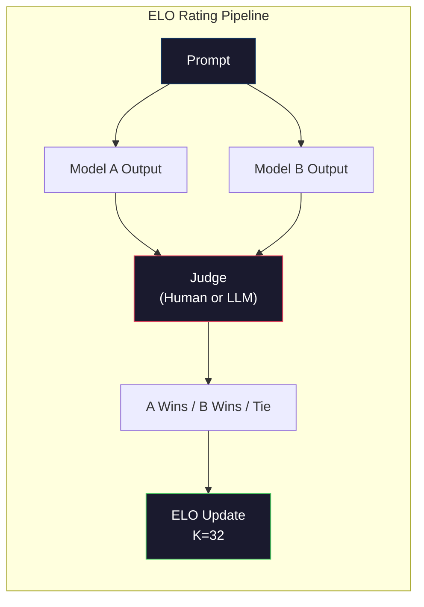

# 评价:基准,评测,LM 评价

> 格德哈特定律:当一个测量成为目标时,它不再是一个好的测量.每一个边界实验室游戏都会达到标准.MMLU的分数都会上升,而模型仍然无法可靠地计算"草"中的R数量.唯一重要的评估是您的评估 - - 在您的任务上,用您的数据.

> **【中文解读】**古德哈特定法则:当一个指标成为目标时,它就不再是一个好指标了.

> **【拓展：LLM评测→实际应用】**评测体系包括:MMLU (知识) 、人价值 (代码) 、数学 (数学) 、领域 (人类偏好) ──但真正的应用中最重要的是你自己的评测你自己的任务和数据上测试──

>  **【前置】**学本节前请先掌握:阶段10·01-05(LLM基础);阶段11·10(评估) 生产LLM应用的评估――本节聚焦模型本身的评估――

>  **【类比】**通用基准 = 全国高考(适合人,但和具体工作能力无关) ――自家评价 = 公司面试题 (精准应对你的需求) ・选模型时高考分数 ((MMLU) 只有能初,最终要看面试 ((自家评价)表现――Goodhart 定律警告:刷高考分数的学生不一定工作能力强──

**Type:** Build
**Languages:** Python
**Prerequisites:** Phase 10, Lessons 01-05 (LLMs from Scratch)
**Time:** ~90 minutes

## 学习目标

- 建立一个针对语言模型的自定义评估链,以运行多种选择和开放的基准
  构建自定义评测工具,对语言模型运行多选题和开放基准测试
- 解释为什么标准基准标准 (MMLU,HumanEval) 充满了和无法区分边界模型
  解释为什么标准基准(MMLU、HumanEval) 会和且无法区分前沿模型
- 执行任务特定的评估,使用适当的指标:精确匹配,F1,BLEU和法官认证等级
  实现带正确指标的任务特定评测:精确匹配、F1、BLEU 和 LLM作为法官 评分
- 设计一个针对您的特定使用情况而非仅仅依赖公共排名表的定制评估套件
  设计针对特定用途的自定义评测套件,而不是仅依赖公共排行榜

> **【中文解读】**本课聚焦 LLM 评估工程实践――核心观点:公共基准(MMLU、HumanEval) 已被和,前沿模型的分数压缩在3分范围内,差异是统计噪音而不是真实能力差距――唯一重要的是你的任务,你的数据,你的失败模式下的评测――

## 问题 问题引入

根据"全球数据分析"的数据,在2020年MMLU在57个学科中发表了15,908个问题.在三年内,边界模型和了它.GPT-4得分为86.4%.Claude 3 Opus得分为86.8%.Llama 3 405B得分为88.6%.排名板被压缩成3个点范围,其中差异是统计噪音,而不是实际能力差距.

> 据报道,在2020年发布的MMLU中,包含了57个学科的15908个问题.

十岁的孩子在没有思考的情况下完成任务. 克劳德3.5索尼特在MMLU上获得88.7%的分数,最初无法计算"草"中的字母. 这项任务需要零的世界知识和零的推理, 人类Eval测试了164个问题. 模型在此获得90%以上的成绩,同时还会产生任何小开发人员都会抓住的边缘案例上的代码.

> 同时,这些模型在10岁的孩子不假想能完成任务上却失败了.Claude 3.5 Sonnet MMLU获得88.7%分,但最初无法计算"草"中的几个r.这个任务不需要任何世界知识或推理,只需要字符级代.HumanEval使用164个问题测试代码生成.模型得分90%+,但仍然产生任何初级开发者都能捕获边缘崩代码.

实践性与基准绩效之间的差距是 LLM评价的核心问题. 基准指标告诉你模型在基准指标上表现如何. 它们几乎没有告诉你该模型将如何执行你的具体任务, 如果您正在构建客户支持机器人,MMLU是无关紧要的. 如果您正在构建代码助理,HumanEval只涵盖功能级生成-- 它没有说任何关于调试,重新构成或解释文件中的代码.

> 基准性能与真实世界可靠性之间的沟通是 LLM 评估的核心问题.基准告诉你模型在基准上表现.它们几乎没有任何关于模型在你的具体任务,具体数据,具体失败模式下表现的信息.如果你在构建客户支持机器人,MLU 无关紧要.如果你在构建代码助手,HumanEval 仅覆盖函数级生成对调试,重构或跨文件代码解释一无所知.

你需要定制的评估.不是因为基准是无用的,它们是用于粗略的模型选择,

> 你需要自定义评估.不是因为基准不用它们对粗略模型的选择有用,而是因为最终评估必须完全符合你的部署条件.

> **【中文解读】**基准分数与真实世界可靠性之间的沟通是LLM评估的核心问题――GPT-4MMLU 86.4%、Claude 3 Opus 86.8%、Llama 3 405B 88.6%3 分的差距是统计噪音――但这些模型在"数草里有几个r"这样的简单任务中仍然失败――基准告诉你模型在基准上的表现,几乎没有什么说出它将如何表现在你的具体任务中――

> **【拓展：Arena 评测与 Elo 评分】**聊天机器人竞技场 (LMSYS) 使用盲测 Elo 评分人类用户与两个匿名模型对话并投票选择更好的回复──这是目前公认的最可靠的模型排名方式──GPT-4o、Claude 3.5 Sonnet、Gemini 1.5 Pro 在竞技场上的 Elo 分数差距更真实地反映了实际使用体验──

## 概念的核心概念

### 伊瓦尔景观

评估有三个类别,每个类别都有不同的成本和信号质量.

> 有三类评估,各有不同的成本和信号质量.

**Benchmarks**测试组是标准化的测试套件.MMLU,HumanEval,SWE-bench, MATH,ARC,HellaSwag.你运行模型与基准值并获得分数.优势:每个人都使用相同的测试,所以你可以比较模型.缺点:模型和培训数据越来越污染这些基准.实验室训练数据包括基准问题.分数上升.能力可能不.

> **基准**优点:每个人都使用相同的测试,所以你可以比较模型.缺点:模型和训练数据越来越多地污染这些基准.实验室在包含基准问题的数据上训练.分数上升能力.未必.

**Custom evals**您定义输入,预期输出和分数功能. 法律文件总结器被评估在法律文件上. SQL 生成器被评估在数据库方案上. 这些成本很高,但它们是唯一的评估,预测生产性能.

> **自定义评估**是你为特定用途构建的测试套件. 你定义输入,期望输出和评分函数. 法律文档摘要器械法文档评估.

**Human evals**通过付费的注释器来判断模型的输出,以使用有用性,正确性,流利性和安全等标准.$0.10-$根据法庭的判决,每次裁定的时间为2.00分,速度为1小时至1天.

> **人工评估**使用付费标记者根据有用性,正确性,流性和安全性等标准评判模型输出.这是自动评分失败的开放任务的黄金标准.$0.10-$速度和速度 (数小时到几天)



### 为什么标准标准会破裂

三种机制导致基准分数不再反映实际能力.

> 三种机制导致基准分数不再反映实际能力.

**Data contamination.**训练机构在互联网上扫描. 测量问题在互联网上播放. 模型在训练中看到答案. 这不是传统意义上的欺骗 - - 实验室不故意包括测量数据. 但在网络规模的测量使得几乎不可能排除.

> **数据污染。**训练语料从互联网抓取――基准问题存在于互联网――模型在训练中看到答案――这不是传统意义上的骗局――实验室不会故意包含基准数据――但网络规模抓取使排除几乎不可能――

**Teaching to the test.**实验室优化训练混合物来实现基准性能.如果训练混合物中的5%是MMLU式多选项,模型就会学习格式和答案分布.MMLU是四方多选项.模型学习答案分布在A/B/C/D中大约均,即使模型不知道答案,这也可以帮助.

> **应试训练。**实验室为基准性能优化训练混合.如果5%的训练混合是MMLU风格的多选题,模型就学会了形式和答案分布.

**Saturation.**当每个边界模型在基准上获得85-90%的分数时,基准不再歧视.剩余的10-15%的问题可能是模糊的,错误标签的,或需要模糊的域知识.在MMLU上从87%提高到89%可能意味着模型记忆了两个模糊的问题,而不是它变得更聪明.

> **饱和。**当前沿模型在基准上都得分85-90%,基准不再有区别力.剩余的10-15%的问题可能有歧义,标记错误或需要冷门领域知识.

### 困惑: 快速检查健康

度是测量模型对代币的顺序有多惊.

> 困惑度测量模型对象序列的惊程度.

```
PPL = exp(-1/N * sum(log P(token_i | context)))
```

曲率为10意味着模型平均不确定,就像在每个代币位置中均地选择10个选项.较低更好.GPT-2在WikiText-103上得到了30个曲率.GPT-3得到了20个.Llama 3 8B得到了7个.

> 困惑度10 意思模型平均来说在每个代币中位置的不确定性相当于在 10 个选项中均选择──越低越好──GPT-2 在WikiText-103 上困惑度约 30──GPT-3约 20──Llama 3 8B约 7──

模特可以在预测常见模式方面擅长,但在罕见但重要的模式上却很糟糕.它也没有说任何关于遵循指令,推理或事实准确性的东西.使用它作为一个智力检查,而不是最终判决.

> 困惑性在相同测试集中的模型比较时有用,但有盲点. 模型可以通过擅长预测常见模式获得低困惑性,但在罕见但重要的模式上可能很差. 它也不能说明遵循指令的推理或事实准确性.

### 法律法官

根据GPT-4o的标准,GPT-4o的性能可以达到1-5的标准,以确定其正确性,有用性和安全性.这与GPT-4o-mini的判断成本约为0.01美元,与人类的判断相对相对而言,大约80%的认同在大多数任务上.

> 用强模型评估弱模型的输出. 想法很简单:让GPT-4o或Claude Sonnet在正确性,有用性和安全性上以1-5分评分.

评分提示比模型更重要.一个模糊的提示 ("评分这个答案") 生产了噪音的分数.一个结构化的提示有条目 ("评分5如果答案是事实上正确的并引用一个来源,4如果是正确的但未来源的,3如果是部分正确的...") 生产了一致的,可复制的分数.

> 评分快速比模型更重要.模糊的快速. 给这个回复打分") 产生杂的分数. 带有评分标准的结构化快速.

失败模式:评审模型显示位置偏差 (在对比中偏好第一反应),语法偏差 (偏好更长的反应),自偏 (GPT-4率高于相当的克劳德输出).减轻:随机排序,规范长度,使用不同于正在评估的模型的评审者.

> 失败模式:评审模型表现出位置偏见(在成对比中偏好第一个回复) 冗长偏见(偏好更长的回复) 和自我偏见(GPT-4对GPT-4 输出评分高于等价的Claude 输出) ◊缓解措施:随机化顺序、按长度归结、使用与被评估模型不同的评审――

### 双对比的ELO评级

通过聊天机场的方法. 显示两个不同的模型对相同提示的反应. 一个人 (或法师) 评判者选择了更好的. 从数千个比较中,计算每个模型的ELO评分 - - 象棋中使用的同一个系统.

> 通过数千次比较计算每个模型的ELO评分与棋牌使用系统相同.

博平台优势:相对排名比绝对分数更可靠,处理关系优雅,并与独立分分分的比较较少相近.截至2026年初,Chatbot Arena排名显示GPT-4o,Claude 3.5 Sonnet和Gemini 1.5 Pro在彼此之间排名最高的20个博平台.

> 优势:相对排名比绝对评分更可靠,优雅处理平局,收需要比较次次少于独立评分――截至2026年初,Chatbot Arena排名显示GPT-4o、Claude 3.5 Sonnet 和 Gemini 1.5 Pro 在顶部只有差不多20个 ELO 分──



### 平等框架

**lm-evaluation-harness**(EleutherAI):标准的开源评估框架.支持200多个基准.用一个命令运行任何Hugging Face模型与MMLU,HellaSwag,ARC等.

> **lm-evaluation-harness**支持200+基准――一条命令对任何拥抱面孔模型运行MMLU、HellaSwag、ARC等――Open LLM 领袖板 使用――

**RAGAS**评估框架,具体用于RAG管道. 衡量信任性 (答案是否符合检索的背景?),相关性 (检索的背景是否与问题相关?),以及答案正确性.

> **RAGAS**专用于RAG管线的评测框架――测量忠诚度――答案是否匹配检索上下文?

**promptfoo**设置一个测试案例,对几个模型进行测试,获得一个通过/失败报告. 对于回归测试提示有用 - 确保一个快速改变不会打破现有测试案例.

> **promptfoo**配置驱动的快速工程评测. 在YAML中定义了测试用例,对多个模型运行,获得通过/失败报告.

### 建立定制的

唯一对生产有意义的评估.

> 生产中唯一重要的评测――流程:

1. **Define the task.**具体说明. "回答问题"太模糊了. "给出客户的投诉电子邮件,提取产品名称,问题类别和情绪"是一个可以评估的任务.
   中文翻译:1. **定义任务。**模型到底应该做什么?要精确. 回答问题 太模糊. 给定客户投诉邮件,提取产品名称,问题类别和情感.

2. **Create test cases.**对于原型 eval,至少50个,生产的200个以上.每个测试案例都是 (输入,预期_输出) 双.包括边缘案例:空输入,对立输入,模糊输入,其他语言的输入.
   翻译: 翻译:**创建测试用例。**原型评测最少50个,生产200+──每一个测试用例是 (输入,期望输出) 对──包括边缘情况:空输入、对抗输入、有差义的输入、其他语言的输入────

3. **Define scoring.**对于结构化输出,完全匹配. BLEU/ROUGE对于文本相似性. LLM作为评审者对于开放式质量. F1用于提取任务. 结合多个指标和权重.
   翻译: 翻译:**定义评分。**结构化输出使用精确匹配──文本相似度使用BLEU/ROUGE──开放式质量使用LLM作为法官──抽取任务使用F1──组合多个指标并加权──

4. **Automate.**每个 eval 都用一个命令运行,没有手动步骤. 保存结果以允许时间进行比较的格式.
   翻译: 翻译:**自动化。**每个评测一个命令运行,无动步骤,以时间相比的格式存储结果.

5. **Track over time.**评分分分单独是无意义的.你需要趋势线. 评分在最后一次提示变化后是否改善? 换模型后是否退缩? 版本你的评分与你的提示.
   翻译: 五.**追踪趋势。**评分数孤立看无意义――你需要趋势线―― 上一次提示更改后分数提升了吗?切换模型后退步了吗?像版本化提示 一样版本化评测――

| Eval Type | Cost per judgment | Agreement with humans | Best for |
|-----------|------------------|----------------------|----------|
| Exact match / 精确匹配 | ~$0 | 100% (when applicable) / 100%（适用时） | Structured output, classification / 结构化输出、分类 |
| BLEU/ROUGE | ~$0 | ~60% | Translation, summarization / 翻译、摘要 |
| LLM-as-judge / LLM 评审 | ~$0.01 | ~80% | Open-ended generation / 开放式生成 |
| Human eval / 人工评估 | $0.10-$2.00 | N/A (is the ground truth) / N/A（即真实标准） | Ambiguous, high-stakes tasks / 有歧义、高风险任务 |

## 建立它,实现它.
```figure
perplexity-loss
```

## 建立它

### 第一个步骤:最低等价框架

定义核心抽象.一个 eval 案例有输入,预期输出和可选的元数据定位.一个得分者采用预测和参考,返回0到1之间的分数.

> 定义核心抽象――评测用例有输入、期望输出和可选的元数据字典――评分机接受预测和参考并返回0到1之间的分数――

```python
import json
from collections import Counter

class EvalCase:
    def __init__(self, input_text, expected, metadata=None):
        self.input_text = input_text
        self.expected = expected
        self.metadata = metadata or {}

class EvalSuite:
    def __init__(self, name, cases, scorers):
        self.name = name
        self.cases = cases
        self.scorers = scorers

    def run(self, model_fn):
        results = []
        for case in self.cases:
            prediction = model_fn(case.input_text)
            scores = {}
            for scorer_name, scorer_fn in self.scorers.items():
                scores[scorer_name] = scorer_fn(prediction, case.expected)
            results.append({
                "input": case.input_text,
                "expected": case.expected,
                "prediction": prediction,
                "scores": scores,
            })
        return results
```

### 步骤2: 评分功能

建立一个完整的匹配,F1的代币,以及一个模拟的法官的L.L.M.

> 构建精确匹配,F1标志和模拟的法师作为法官评分器.

```python
def exact_match(prediction, expected):
    return 1.0 if prediction.strip().lower() == expected.strip().lower() else 0.0

def token_f1(prediction, expected):
    pred_tokens = set(prediction.lower().split())
    exp_tokens = set(expected.lower().split())
    if not pred_tokens or not exp_tokens:
        return 0.0
    common = pred_tokens & exp_tokens
    precision = len(common) / len(pred_tokens)
    recall = len(common) / len(exp_tokens)
    if precision + recall == 0:
        return 0.0
    return 2 * (precision * recall) / (precision + recall)

def llm_judge_simulated(prediction, expected):
    pred_words = set(prediction.lower().split())
    exp_words = set(expected.lower().split())
    if not exp_words:
        return 0.0
    overlap = len(pred_words & exp_words) / len(exp_words)
    length_penalty = min(1.0, len(prediction) / max(len(expected), 1))
    return round(overlap * 0.7 + length_penalty * 0.3, 3)
```

### 步骤3:ELO评级系统

实现与ELO更新进行对比. 这正是Chatbot Arena用来排名模型的系统.

> 实现带ELO更新成对比较.

```python
class ELOTracker:
    def __init__(self, k=32, initial_rating=1500):
        self.ratings = {}
        self.k = k
        self.initial_rating = initial_rating
        self.history = []

    def _ensure_player(self, name):
        if name not in self.ratings:
            self.ratings[name] = self.initial_rating

    def expected_score(self, rating_a, rating_b):
        return 1 / (1 + 10 ** ((rating_b - rating_a) / 400))

    def record_match(self, player_a, player_b, outcome):
        self._ensure_player(player_a)
        self._ensure_player(player_b)

        ea = self.expected_score(self.ratings[player_a], self.ratings[player_b])
        eb = 1 - ea

        if outcome == "a":
            sa, sb = 1.0, 0.0
        elif outcome == "b":
            sa, sb = 0.0, 1.0
        else:
            sa, sb = 0.5, 0.5

        self.ratings[player_a] += self.k * (sa - ea)
        self.ratings[player_b] += self.k * (sb - eb)

        self.history.append({
            "a": player_a, "b": player_b,
            "outcome": outcome,
            "rating_a": round(self.ratings[player_a], 1),
            "rating_b": round(self.ratings[player_b], 1),
        })

    def leaderboard(self):
        return sorted(self.ratings.items(), key=lambda x: -x[1])
```

### 步骤4: 难以计算

实际上,你会从模型的逻辑中得到这些.我们用概率分布模拟.

> 使用标志 概率计算困惑度――实践中你从模型的逻辑中获取这些值――这里我们使用概率分布模拟――

```python
import numpy as np

def perplexity(log_probs):
    if not log_probs:
        return float("inf")
    avg_neg_log_prob = -np.mean(log_probs)
    return float(np.exp(avg_neg_log_prob))

def token_log_probs_simulated(text, model_quality=0.8):
    np.random.seed(hash(text) % 2**31)
    tokens = text.split()
    log_probs = []
    for i, token in enumerate(tokens):
        base_prob = model_quality
        if len(token) > 8:
            base_prob *= 0.6
        if i == 0:
            base_prob *= 0.7
        prob = np.clip(base_prob + np.random.normal(0, 0.1), 0.01, 0.99)
        log_probs.append(float(np.log(prob)))
    return log_probs
```

### 步骤5:总结结果

计算在评估运行中总结统计数据:平均,中位数,门的通过率,每度分类.

> 计算评测运行的汇总计:平均值,中位数,值通过率和每指标细分.

```python
def summarize_results(results, threshold=0.8):
    all_scores = {}
    for r in results:
        for metric, score in r["scores"].items():
            all_scores.setdefault(metric, []).append(score)

    summary = {}
    for metric, scores in all_scores.items():
        arr = np.array(scores)
        summary[metric] = {
            "mean": round(float(np.mean(arr)), 3),
            "median": round(float(np.median(arr)), 3),
            "std": round(float(np.std(arr)), 3),
            "min": round(float(np.min(arr)), 3),
            "max": round(float(np.max(arr)), 3),
            "pass_rate": round(float(np.mean(arr >= threshold)), 3),
            "n": len(scores),
        }
    return summary

def print_summary(summary, suite_name="Eval"):
    print(f"\n{'=' * 60}")
    print(f"  {suite_name} Summary")
    print(f"{'=' * 60}")
    for metric, stats in summary.items():
        print(f"\n  {metric}:")
        print(f"    Mean:      {stats['mean']:.3f}")
        print(f"    Median:    {stats['median']:.3f}")
        print(f"    Std:       {stats['std']:.3f}")
        print(f"    Range:     [{stats['min']:.3f}, {stats['max']:.3f}]")
        print(f"    Pass rate: {stats['pass_rate']:.1%} (threshold >= 0.8)")
        print(f"    N:         {stats['n']}")
```

### 步骤 6: 运行全管道

设置一个任务,创建测试案例,模拟两个模型,运行评估,从对比计算ELO,打印排名表.

> 将所有部分串联.定义任务.创建测试用例.模拟两个模型.运行评测.从成比较计算到ELO并打印排行榜.

```python
def demo_model_good(prompt):
    responses = {
        "What is the capital of France?": "Paris",
        "What is 2 + 2?": "4",
        "Who wrote Hamlet?": "William Shakespeare",
        "What language is PyTorch written in?": "Python and C++",
        "What is the boiling point of water?": "100 degrees Celsius",
    }
    return responses.get(prompt, "I don't know")

def demo_model_bad(prompt):
    responses = {
        "What is the capital of France?": "Paris is the capital city of France",
        "What is 2 + 2?": "The answer is four",
        "Who wrote Hamlet?": "Shakespeare",
        "What language is PyTorch written in?": "Python",
        "What is the boiling point of water?": "212 Fahrenheit",
    }
    return responses.get(prompt, "Unknown")

cases = [
    EvalCase("What is the capital of France?", "Paris"),
    EvalCase("What is 2 + 2?", "4"),
    EvalCase("Who wrote Hamlet?", "William Shakespeare"),
    EvalCase("What language is PyTorch written in?", "Python and C++"),
    EvalCase("What is the boiling point of water?", "100 degrees Celsius"),
]

suite = EvalSuite(
    name="General Knowledge",
    cases=cases,
    scorers={
        "exact_match": exact_match,
        "token_f1": token_f1,
        "llm_judge": llm_judge_simulated,
    },
)

results_good = suite.run(demo_model_good)
results_bad = suite.run(demo_model_bad)

print_summary(summarize_results(results_good), "Model A (concise)")
print_summary(summarize_results(results_bad), "Model B (verbose)")
```

对于"好"模型,就有了准确的答案. "坏"模型,就有了词汇表达. 精确的匹配对词汇模型的惩罚很严厉. 符号F1和法官的 LLM更宽恕. 这说明了为什么测量选择很重要:根据你如何得分,相同的模型看起来很好或很糟糕.

> "好"模型给出精确答案――"坏"模型给出冗长复述――精确匹配严厉惩罚冗长模型――Token F1 和 LLM作为法官更宽容――这说明了标志选择的重要性:同一个模型看起来好或坏取决于你如何评分――

### 七步:Elo赛

运行多轮模型之间的对比.

> 在多轮中运行模型之间的成对比较.

```python
elo = ELOTracker(k=32)

for case in cases:
    pred_a = demo_model_good(case.input_text)
    pred_b = demo_model_bad(case.input_text)

    score_a = token_f1(pred_a, case.expected)
    score_b = token_f1(pred_b, case.expected)

    if score_a > score_b:
        outcome = "a"
    elif score_b > score_a:
        outcome = "b"
    else:
        outcome = "tie"

    elo.record_match("model_a_concise", "model_b_verbose", outcome)

print("\nELO Leaderboard:")
for name, rating in elo.leaderboard():
    print(f"  {name}: {rating:.0f}")
```

### 步骤8: 困惑的比较

进行不同质量水平的"模型"之间的困难比较.

> 与不同质量水平的"模型"的困惑.

```python
test_text = "The quick brown fox jumps over the lazy dog in the garden"

for quality, label in [(0.9, "Strong model"), (0.7, "Medium model"), (0.4, "Weak model")]:
    log_probs = token_log_probs_simulated(test_text, model_quality=quality)
    ppl = perplexity(log_probs)
    print(f"  {label} (quality={quality}): perplexity = {ppl:.2f}")
```

## 用它实现框架

### 评价器 (EleutherAI)

标准工具用于运行任何模型的基准.

> 在任何模型上运行基准的标准工具.

```python
# pip install lm-eval
# Command line:
# lm_eval --model hf --model_args pretrained=meta-llama/Llama-3.1-8B --tasks mmlu --batch_size 8

# Python API:
# import lm_eval
# results = lm_eval.simple_evaluate(
#     model="hf",
#     model_args="pretrained=meta-llama/Llama-3.1-8B",
#     tasks=["mmlu", "hellaswag", "arc_easy"],
#     batch_size=8,
# )
# print(results["results"])
```

### 快速foo

定义YAML中的测试,并对抗多个提供商.

> 配置驱动的提示 工程评测――在YAML中定义测试并对多家提供商运行――

```yaml
# promptfoo.yaml
providers:
  - openai:gpt-4o-mini
  - anthropic:claude-3-haiku

prompts:
  - "Answer in one word: {{question}}"

tests:
  - vars:
      question: "What is the capital of France?"
    assert:
      - type: contains
        value: "Paris"
  - vars:
      question: "What is 2 + 2?"
    assert:
      - type: equals
        value: "4"
```

### 针对RAG评估的RAGAS

```python
# pip install ragas
# from ragas import evaluate
# from ragas.metrics import faithfulness, answer_relevancy, context_precision
#
# result = evaluate(
#     dataset,
#     metrics=[faithfulness, answer_relevancy, context_precision],
# )
# print(result)
```

RAGAS测量一般评估所缺少的内容:模型的答案是否基于检索的文本,而不是仅仅是答案在抽象中是否"正确".

> RAGAS测量一般评测遗漏的东西:模型的答案是否基于查询下文,而不是仅仅是答案在抽象意义上是否"正确"――

## 运送它.

这一课产生了`outputs/prompt-eval-designer.md`-- 可重复使用的提示,它为任何任务设计了定制的评估套件.给它一个任务描述,它生成了测试案例,分数函数和通过/失败门建议.

> 本课产出发 `outputs/prompt-eval-designer.md`一个可复制的提示,为任何任务设计自定义评测套件──给定任务描述,它生成测试用例、评分函数和通过/失败值建议──

它还产生了`outputs/skill-llm-evaluation.md`根据任务类型,预算和延迟要求,

> 产出`outputs/skill-llm-evaluation.md`基于任务类型,预算和延迟需求的选择正确评估策略的决策框架.

## 练习题

1. 添加一个"一致性"分数器,它通过模型运行相同的输入5次,并测量输出的频率.确定性输入的不一致答案显示了脆弱的提示或高温度设置.
   中文翻译:添加"一致性"评分器,将相同输入通过模型运行 5 次并测量输出匹配的频率――确定性输入上的不一致答案揭示脆弱的快速或高温度设置――

2. 扩展ELO跟踪器以支持多个法官功能 (精确匹配,F1,LLM-as-judge) 并重量它们.当你重量精确匹配与F1重量时,比较排名表的变化.
   中文翻译:扩展 ELO 跟踪器支持多种评审函数(精确匹配、F1、LLM-as-judge)并加权──比较重度加权精确匹配与重度加权 F1 时排行榜如何变化──

3. 建立一个特定任务的评估套件:将电子邮件分为5类.创建100个测试案例,包括多种例子 (可能属于多个类别的电子邮件,空虚的电子邮件,其他语言的电子邮件).测量不同"模型" (基于规则,关键字匹配,模拟的LLM) 的表现.
   中文翻译:为特定任务构建评测套件:邮件分为5类. 创建100个测试用例,包括多样例和边缘情况.

4. 实施污染检测:鉴于一组评估问题和培训组,检查培训数据中出现的评估问题 (或近句) 的百分比. 这就是研究人员对基准有效性进行审计的方式.
   中文翻译:实现污染检测:给定一组评测问题和训练语料,检查多少百分比的评测问题 (或近似释义) 现在出现在训练数据中.

5. 建立一个"模型差异"工具. 鉴于两个模型版本的评估结果,突出哪些具体的测试案例改善,哪些回归,哪些保持不变.这是一个代码差异的评估相当 - - 对于了解改变是否有帮助或伤害至关重要.
   中文翻译:构建"模型差"工具――给定两个模型版本的评测结果,高亮哪些测试用例改进了、哪些退步了、哪些保持不变――这是评测版的代码差理解改变是帮助还是伤害的关键――

## 关键词 快速查找表

| Term | What people say | What it actually means | 中文释义 |
|------|----------------|----------------------|---------|
| MMLU | "The benchmark" | Massive Multitask Language Understanding -- 15,908 multiple choice questions across 57 subjects, saturated above 88% by 2025 | 大规模多任务语言理解，57 科目 15908 题选择题 |
| HumanEval | "Code eval" | 164 Python function-completion problems from OpenAI, tests only isolated function generation | 代码评估，164 个 Python 函数补全题 |
| SWE-bench | "Real coding eval" | 2,294 GitHub issues from 12 Python repos, measures end-to-end bug fixing including test generation | 真实编码评估，2294 个 GitHub issue 端到端修复 |
| Perplexity | "How confused the model is" | exp(-avg(log P(token_i given context))) -- lower means the model assigns higher probability to the actual tokens | 困惑度，越低表示模型预测越准确 |
| ELO rating | "Chess ranking for models" | A relative skill rating computed from pairwise win/loss records, used by Chatbot Arena to rank 100+ models | Elo 等级分，来自成对比较的相对技能评分 |
| LLM-as-judge | "Using AI to grade AI" | A strong model scores a weaker model's outputs against a rubric, ~80% agreement with human judges at ~$0.01/judgment | LLM 评审，用强模型给弱模型打分，约 $0.01/次 |
| Data contamination | "The model saw the test" | Training data includes benchmark questions, inflating scores without improving real capability | 数据污染，训练数据包含基准题目 |
| Eval suite | "A bunch of tests" | A versioned collection of (input, expected_output, scorer) triples that measure a specific capability | 评测套件，版本化的测试集合 |
| Pass rate | "What percentage it gets right" | Fraction of eval cases scoring above a threshold -- more actionable than mean score because it measures reliability | 通过率，得分超过阈值的用例比例 |
| Chatbot Arena | "Model ranking website" | LMSYS platform with 2M+ human preference votes, producing the most trusted LLM leaderboard via ELO ratings | Chatbot Arena，200 万+人类偏好投票的模型排名平台 |

## 继续阅读 继续阅读

- [Hendrycks et al., 2021 -- "Measuring Massive Multitask Language Understanding"](https://arxiv.org/abs/2009.03300)尽管其度很高,但仍是最受引用的LLM基准.
- [Chen et al., 2021 -- "Evaluating Large Language Models Trained on Code"](https://arxiv.org/abs/2107.03374)-- 开通AI的HumanEval论文,建立了代码生成评估方法
- [Zheng et al., 2023 -- "Judging LLM-as-a-Judge"](https://arxiv.org/abs/2306.05685)--系统分析使用LLM来评估LLM,包括位置偏差和语句偏差的发现
- [LMSYS Chatbot Arena](https://chat.lmsys.org/)-- 群众共享的模型比较平台,有2M+的投票,
