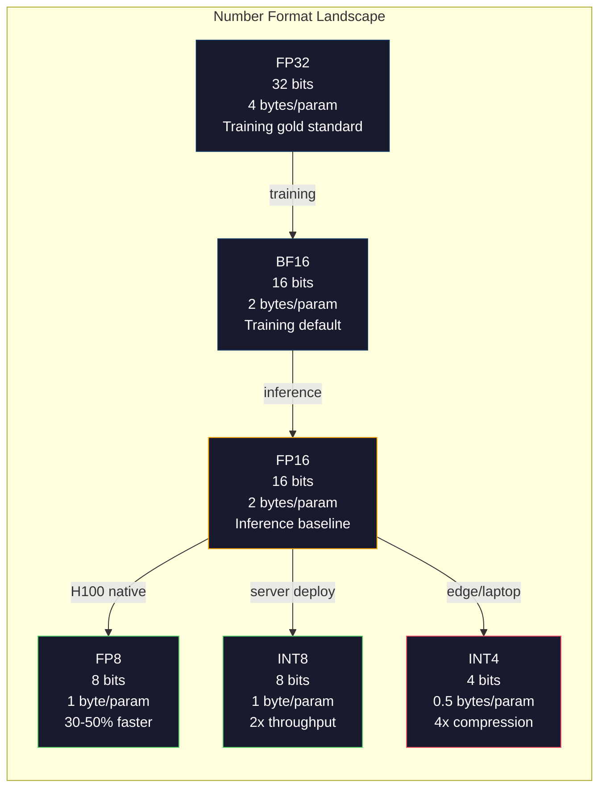
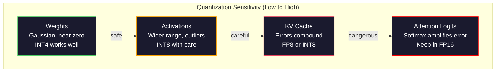
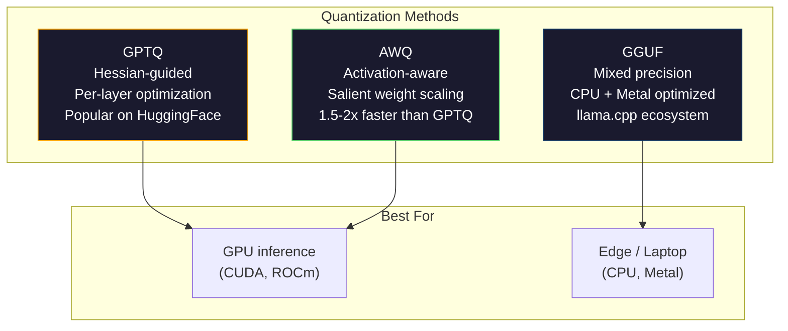

# 量化:让模型运行

> 对于FP16的70B模型,需要140GB. 只有两个A100,只需加重. 量化为FP8:一个80GB的GPU.

> **【中文解读】**需要140GB的显存储量,可在MacBook上运行.

> **【拓展：量化→llama.cpp/GGUF】**拉马.cpp 和 GGUF 格式让大模型能够在消费级硬件上运行――GPTQ、AWQ、GGUF等量化方法是将70B+ 模型部署到本地设备的关键――理解量化是理解大模型部署的基础――

>  **【前置】**学生节前请先掌握:阶段10·01-10 (LLM基础);浮点数表示(FP32/FP16/BF16/INT8/INT4);numpy 矩阵运算──

>  **【类比】**量化 = 压缩图片──原照片(FP16) 每像素 16 位,肉眼分辨不出和 8 位(FP8) 的差异,但文件大小一半──再压到 4 位──INT4)肉眼开始看到(精度损失),但文件小 4 倍──模型量化同理:FP16→INT4 大小变 1/4,性能损失通常 <5%──GGUF 格式让你在 MacBook 上跑 Llama-70B──

**Type:** Build
**Languages:** Python (with numpy)
**Prerequisites:** Phase 10, Lessons 01-10 (LLMs from Scratch)
**Time:** ~120 minutes

## 学习目标

- 实现对称和不对称的量化从FP16到INT8和INT4,包括每ensor和每道的扩展
  实现从FP16到INT8和INT4的对称/非对称量化,包括逐张量和逐通道缩小
- 计算量子化所节省的内存,并确定哪个精度适应给定的GPU的VRAM
  计算量化显存储量,确定给定GPU显存储适合的精度
- 解释训练后量化 (PTQ) 和量化意识培训 (QAT) 的区别
  解释训练后量化(PTQ) 和量化感知训练(QAT) 的区别
- 应用GPTQ或 AWQ来定量实模型,并根据基准衡量准确性记忆的交易
  应用GPTQ或 AWQ 量化真实模型,并基准上测量精度-显存权衡

> **【中文解读】**本课实现量化技术使用精度换显存和速度――核心方法:对称/非对称量化、逐张量/逐通道缩放、PTQ(训练后量化)vsQAT(量化感知训练)――量化是每个大于7B模型的标准部署路径――

## 问题 问题引入

拉马370B有70亿参数.每个参数是16位浮点号码.这就是140亿字节.140GB.一个A100有80GB的VRAM.你甚至不能在一个GPU上加载重量,更不用说推断.你需要两个A100每一个$2/小时只为服务一个模型.

> 拉马370B有7亿参数――每个参数是一个16位浮点数――即1400亿字节――140GB――单张A100有80GB的显存――你甚至无法加载权重,更不用说运行推理――你需要两张A100,每张$2/小时,只为一个模型服务――

但是每参数的16位是浪费的.在一个神经网络集群中,大多数重量接近零.FP16的全部动态范围 (从0.000000059到65.504) 几乎完全没有使用.如果你测量Llama 3 70B中的实际重量分布,其中95%在0.1到+0.1之间.你燃烧16位来表示值可以合适于4.

> 但是每参数16位是浪费的──神经网络中的大部分权重聚集在零附近──FP16的完整动态范围(从0.000000059到65,504) 几乎完全未使用──如果你测量Llama 3 70B 中权重的实际分布,95% 落在 -0.1 到 +0.1 之间──你用16位表示可以用4位表示的值──

量子化取代了高精度数字,并用更低精度的数字.FP16到FP8将内存减半.FP16到INT4将内存减半.该140GB模型变成35GB.它适合单个消费者GPU.推向2位量子化 (攻击性,损失性,但可用于某些任务),并且相同的模型运行在16GB笔记本电脑上.

> 量化使用低精度数字替换高精度数字――FP16到FP8 减半显存――FP16到INT4 减至四分之一――140GB 模型变成35GB――可放入单张消费级GPU――推至2位量化(激进的、有损的,但可用于某些任务),同样的模型可在16GB笔记本上运行――

成本是精确性.你删除的每一块都会破坏信息.问题是你失去了多少精确性,以及在哪里.一个精确量化的INT4模型在大多数基准上保持了原始的95%到99%.一个天真的量化到INT4可以完全摧毁模型.区别是技术.

> 价格是精度. 问题在于你损失的精度以及损失的位置. 良好的量化INT4模型在大多数基准上保留原质量的95%至99%.

社区对Llama 3到INT4的量子化与GPTQ显示,在WikiText上失去了大约1-2个困难点.Mistral发布了Mixtral 8x22B的FP8检查点,MMLU上没有可测量的质量损失.GGUF格式支持 llama.cpp,在M系列芯片的MacBook上运行70B模型.量子化不是一个黑客.这是7B以上的每个模型的标准部署路径.

> 社区使用GPTQ将Llama 3量化为INT4,在WikiText上仅损失约1-2个困惑度点.Mistral发布了Mixtral 8x22B的FP8检查点,MMLU上几乎零质量损失.

> **【中文解读】**每个参数16位,70B模型需要140GB.但95%的权重集中在 -0.1到 +0.1之间.使用16位表示这些值太浪费了.量化到INT4将显着存储需求降至35GB,可在消费级GPU上运行.良好的INT4量化保留原始模型的质量95%至99%.

> **【拓展：量化生态】**量化生态已经非常成熟:GPTQ(基于近似二阶段信息的逐层量化)、AWQ(激活感知权重量化,保护突出权重)、GGUF(llama.cpp的量化格式,支持2-8位混合精度)。llama.cpp 让70B模型在MacBook M系列芯片上运行,催生了本地大模型部署的生态(Ollama、LM Studio等)。

## 概念的核心概念

### 数字格式:每个比特的作用

每个浮点数有三个部分:标志,指数和位 (也称为意义).标志是一位.指数决定范围 (数量可能多大或小).位决定精度 (你得到多少个数分位).

> 每个浮点数有三部分:符号,指数和尾数(也叫有效数字) ――符号占一个人──指数决定范围(数可以多大或多小) ――尾数决定精度(有多少位小数) ――

```
FP32:  [1 sign] [8 exponent] [23 mantissa]  = 32 bits
FP16:  [1 sign] [5 exponent] [10 mantissa]  = 16 bits
BF16:  [1 sign] [8 exponent] [7  mantissa]  = 16 bits
FP8:   [1 sign] [4 exponent] [3  mantissa]  = 8  bits (E4M3)
FP8:   [1 sign] [5 exponent] [2  mantissa]  = 8  bits (E5M2)
INT8:  [1 sign] [7 value]                   = 8  bits (uniform steps)
INT4:  [1 sign] [3 value]                   = 4  bits (16 levels total)
```

**FP32**距离:大约1.2 x 10^-38 到 3.4 x 10^38.以前的训练仅在FP32中进行.它仍然适用于积累 (矩阵乘法时运行的数量).

> **FP32**是全精度──23位尾数给你约7位十进制精度──训练以前全部在FP32中进行──累加矩阵乘法中的累加和) 仍然使用FP32──

**FP16**分数为10个,使得分数大约为3.3个. 指数缩小到5个,大大减少范围 (最大值为65.504). 这对于重量 (接近零的集群) 很好,但对于在训练过程中可能会升的激活和梯度是危险的. FP16训练需要减小损失,以防止下流.

> **FP16**将位数减半──10位尾数给约3.3位十进制精度──指数缩小到5位,范围大幅减少──最大值约65,504)──这对重量没问题──聚集在零附近,但对训练中可能会升高的激活和梯度很危险──FP16训练需要损失缩小以防止下溢──

**BF16**(大脑浮动16),保持8位指数从FP32,但缩小了7位. 与FP32相同的范围,比FP16更精确. 谷歌专门为深度学习设计. 对于神经网络来说, 距离比精度更重要. 在FP16中下流到零的10^-20梯度在BF16中存活. 在BF16中,重量为0.07342圆到0.0734是足够接近的. 每个现代训练运行都使用BF16或BF16/FP32混合物.

> **BF16**(Brain Float 16) 保留FP32的8位指数,但将尾数缩小到7位.范围与FP32相似,精度低于FP16──Google 专门专为深度学习设计──直觉:对神经网络来说,范围比精度更重要.在FP16中,在BF16中,低溢为零的10^-20梯度存活着──BF16中,0.07342四舍五进到0.0734的权重足够接近──每个现代训练运行都使用BF16或BF16/FP32 混合──

**FP8**子的子是子,子是子,子是子,子是子,子是子,子是子,子是子,子是子,子是子,子是子,子是子,子是子,子是子,子是子,子是子,子是子,子是子,子是子,子是子,子是子,子是子,子是子,子是子,子是子,子是子,子是子,子是子,子是子,子是子,子,子,子,子,子,子,子,子,子,子,子,子,子,子,子,子,子,子,子,子,子,子,子,子,子,子,子,子,子,子,子,子,子,子,子,子,子,子,子,子,子,子,子,子,子,子,子,子,子,子,子,子,子,子,子,子,子,子,子,子,子,子,子,子,子,子,子,子,子,子,子,子,子,子,子,子,子,子,子,子,子,子,子,子,子,子,子,子,子,子,子,子,子,子,子,子,子,子,子,子,子,子,子,子,子,子,子,子,子,子,子

> **FP8**有两种变体――E4M3(4指数,3 尾数) 用于推理时的重量和激活――E5M2(5指数,2 尾数) 用于训练时的梯度,此时范围比精度更重要――H100 GPU 上的 FP8 推理比 FP16 快 30-50% ,质量损失可忽略――

**INT8**只有256个均间隔值从 -128到127.你需要一个尺度因子来将浮点权重映射到这个范围.

> **INT8**整数格式――无指数、无尾数――只有 256 个均间隔值,从 -128 到 127 个.你需要缩小因子将浮点权重映射到这个范围.

**INT4**只有16个可能的值. 尺寸因子是很重的. 质量完全取决于你如何选择尺寸和量化什么权重. 最先进的INT4方法 (GPTQ, AWQ) 保持了原始模型质量的95%以上.

> **INT4**更进一步――仅16个可能值――缩放因子承担重任――质量完全取决于你如何选择缩放比例和量化哪些权重――最先进的INT4方法(GPTQ、AWQ) 保留原始模型的质量95%+――



### 量化如何工作

核心操作很简单. 取一个浮点值的数,找到一个尺度因子,乘以圆到最近的整数,并存储整数加上尺度因子.

> 核心操作很简单. 取一个浮点值张量,找到缩小因子,乘以它,四舍五进近整数,然后存储整数加上缩小因子.

**Quantize:**
```
scale = max(abs(tensor)) / max_int_value
quantized = round(tensor / scale)
```

**Dequantize:**
```
reconstructed = quantized * scale
```

对于对称范围 (-127至 127) 的INT8:
```
scale = max(abs(tensor)) / 127
quantized = clamp(round(tensor / scale), -128, 127)
```

错误是圆形错误.每个值可以最大的减值`scale / 2`整个层的总误差取决于你有多少重量以及模型对这些重量的扰乱有多敏感.

> 差距是四舍五进差距.`scale / 2`△一层的总差异取决于你有多少权力以及模型对这些权力的扰动有多敏感.

**Per-tensor vs per-channel quantization.**缩器使用一个尺度因子来对整个重量矩阵进行测量. 简单但具有损失率:如果一个列具有较大的值,另一个则具有较小的值,则较小的值会失去其大部分精度. 每道使用每输出道 (按重量矩阵的行或列) 一个尺度因子. 更多的总费用 (你储存N尺度因素而不是1) 但质量显著提高. 每种生产量化方法都采用每道或更细颗粒度.

> **逐张量 vs 逐通道量化。**逐张量对整个权重矩阵使用缩小因子――简单但有损:如果一列有大值,另一列有小值,小值会失去大部分精度――逐行对每个输出通道 (权重矩阵的每行或每列) 使用缩小因子――开销更大――储存N个缩小因子而不是1个) 但质量显著更好――使用每个生产量化方法逐步通道或更大的细粒――

**Asymmetric quantization**增加零点的偏移: `quantized = round(tensor / scale) + zero_point`对于零点的分布来说,这种方法是非常有效的.例如,ReLU激活总是非负的.对称量化浪费了半个整数范围的负值,从来没有出现.对称量化将实际范围 [min,max]映射到完整整数范围.

> **非对称量化**添加零点偏移:`quantized = round(tensor / scale) + zero_point`△ 这处理不以零为中心的分布――例如,ReLU 激活值总是非负的――对称量化将将半整数范围浪费在从未出现的负值上――非对称量化将实际范围映射到完整数范围――

### 敏感性等级

模型中的所有东西都不能平等地接受量化.

> 模型中并非所有部分对量化耐受性相同.

**Weights (most robust).**模型重量在训练过程中缓慢变化,遵循接近零的大致高斯分布.它们量化良好.每道尺度的INT8重量几乎产生无损的结果.INT4需要更复杂的方法,但有效.

> **权重（最鲁棒）。**模型权重在训练中变化缓慢,遵循大致以零为中心的高斯分布.它们量化效果好.

**Activations (moderate sensitivity).**激活是推断过程中通过网络流动的中间值. 它们的动态范围比重量更广泛,并且含有异常值. 一个单一的注意力头可能会产生超过平均的100倍的激活值. 这些异常值对于模型质量至关重要. 简单地将它们量化,就会破坏信息. 解决方案:保持更精确的偏差道 (LLM.int8(),使用每代币或每道激活度.

> **激活（中等敏感度）。**激活是推理时流经网络的中值.它们比权重更宽的动态范围并包含离群值.单个注意力头可能产生比平均值大100倍的激活值. 这些离群值对模型质量至关重要.

**KV cache (high sensitivity).**关键值缓存存储所有前代币的注意状态.在长的语境长度时,KV缓存占主导地位的内存.在32K语境的70B模型中,KV缓存仅仅在FP16中为40GB.将KV缓存量为FP8或INT8节省了大量的内存,但任何错误在所有未来的注意计算中都会增加.质量影响量随着序列长度而扩大.

> **KV 缓存（高敏感度）。**关键值缓存存储所有前代币的注意力状态――在长上下文长度下,KV 缓存主导内存――70B 模型在 32K 上下文下,只有KV 缓存就有40GB FP16――将KV 缓存量化为FP8或INT8节省大量内存,但任何差异都会在所有后续注意力计算中累积――质量影响随着序列长度的增加――

**Attention logits (most sensitive).**注意力软max对输入的小变化非常敏感.在软max前的逻辑中,0.01的量化错误可以有意义地改变注意力分布.大多数量化方案都会使注意力计算更精确 (FP16或BF16) 即使其他一切都量化.

> **注意力 logits（最敏感）。**注意力中的软max对其输入的微小变化高度敏感. 在软max前的逻辑中,0.01 的量化错误可以显著改变注意力分布.



### 关与关

**Post-Training Quantization (PTQ)**对于INT8和FP8来说,简单的PTQ通常会失败,因为圆形错误积累.先进的PTQ方法 (GPTQ, AWQ) 使用校准数据以最大限度地减少量化错误.

> **训练后量化（PTQ）**量化已训练的模型――无需重训――取FP16 权重,计算缩放因子,四舍五入,部署――快速(几分钟到几小时)且便宜――INT8 和 FP8 效果好――对INT4,朴素PTQ 经常失败,因为四舍五入误差累积――高级PTQ 方法(GPTQ、AWQ) 使用校准数据最小化量化误差――

**Quantization-Aware Training (QAT)**在培训期间将假定量化操作插入前进通行. 模型学会将其重量放在圆形错误小的地方. 渐变体通过使用直径估计器 (STE) 进行虚假量化流动:假设圆化操作具有梯度1. 特生产的INT4和INT2模型比PTQ更好,但需要进行全面的培训. 谷歌使用QAT来提供双胞胎的有效服务. 对于一些拉马部署目标,Meta使用了QAT.

> **量化感知训练（QAT）**在训练前向传播中插入伪量化操作――模型学会将重权放在四舍五进误差小的位置――梯度通过直通估计器――STE)流过伪量化:假设四舍五进操作的梯度为1――QAT 产生比PTQ更好的INT4和INT2模型,但需要完整的训练运行――Google使用QAT 服务双子.

| Aspect | PTQ | QAT |
|--------|-----|-----|
| Cost / 成本 | Minutes to hours / 几分钟到几小时 | Full training run / 完整训练运行 |
| Quality at INT8 / INT8 质量 | Excellent (< 0.1% loss) / 优秀（< 0.1% 损失） | Excellent / 优秀 |
| Quality at INT4 / INT4 质量 | Good with GPTQ/AWQ (1-3% loss) / 配合 GPTQ/AWQ 良好（1-3% 损失） | Better (< 1% loss) / 更好（< 1% 损失） |
| Quality at INT2 / INT2 质量 | Poor / 差 | Usable for some tasks / 某些任务可用 |
| Calibration data / 校准数据 | 128-1024 examples / 128-1024 样本 | Full training dataset / 完整训练数据集 |
| When to use / 使用时机 | Deployment, iteration / 部署、迭代 | Maximum quality at low bit-width / 低比特宽度的最大质量 |

### 其他类型的产品

**GPTQ (GPT Quantization)**是一个一次性PTQ方法. 它一次量化重量,使用一个小的校准数据集 (128个例子是典型的) 来测量赫西亚 (关于输出对每个重量有多敏感的第二级信息). 赫西亚人认为重要的重量得到更仔细的量化. 对于 LLM来说,GPTQ是第一个使INT4量化为实用的方法. 拥抱面孔的TheBlooke通过发布数百个模型的量化版本来普及GPTQ.

> **GPTQ**是一次性PTQ方法. 它采用小校准数据集 (通常是128个样本) 测量权重. 关于输出对每个权重的敏感性的二阶段信息. 赫西亚指导重要权重被更仔细测量. GPTQ是第一个让INT4量化对 LLM的实用方法.

**AWQ (Activation-Aware Weight Quantization)**由于它们乘以大激活值,小部分重量 (约1%) 是不成比例的重要. AWQ使用校准数据识别这些突出重量,并在量化之前将它们扩大 (然后将相应的激活量降低). 这使得重要重量保持在INT4量化准确的范围内. 质量通常与GPTQ质量相匹配或略高于GPTQ质量,而应用速度则比1.5-2倍快.

> **AWQ**观察到少部分权重 (约1%) 因为与大激活值相乘而特别重要.AWQ使用校准数据识别这些显著权重并量化前将它们放大.然后缩小对应的激活.

**GGUF (GPT-Generated Unified Format)**是 llama.cpp及其生态系统所使用的文件格式. 它支持混合量化:不同的层得到不同的比特宽度. 首先和最后的层 (嵌入和输出头) 通常保持更高的精度. 中层得到INT4或INT3. 文件是自主的:重量,代币,元数据都在一个文件中. 该格式是用于CPU推断和Apple Silicon,在CPU或金属GPU上将整个模型加载到内存中并运行矩阵乘法是标准的路径. Q4_K_M是最受欢迎的GGUF量化变体,平衡质量和尺寸.

> **GGUF**是 llama.cpp 及其生态使用的文件格式. 它支持混合量化:不同层获得不同位宽.首尾层. 嵌入和输出头) 通常保持更高精度. 中层使用 INT4 或 INT3.



### 质量测量

你怎么知道你的量子模型仍然是好的吗?

> 如何判断你的量化模型仍然有用?

**Perplexity.**最常见的指标.较低更好.对原始和量化模型都计算出一个保留的数据集 (WikiText-2是标准的) 的困难. 德尔塔告诉你量化破坏了多少信息. 指规则:德尔塔 <0.5是优秀的,0.5-1.0是好,1.0-2.0是大多数任务的接受,>2.0意味着有些事情发生错误.

> **困惑度。**最常用的指标――越低越好――在保留数据集中(WikiText-2是标准) 上计算原始和量化模型的困惑度――差值告诉你量化破坏了多少信息――经验法则:差值 <0.5 优秀,0.5-1.0 好,1.0-2.0 大多数任务可接受,> 2.0 说明有问题――

**Task-specific benchmarks.**运行量化模型在MMLU,HumanEval,GSM8K或您的定制评估套件上.与原始相比较.量化影响不同能力不均.数学和代码任务对精度损失比一般知识更敏感.

> **任务特定基准。**在MMLU、HumanEval、GSM8K或你的自定义评测套件上运行量化模型──与原始模型相比──量化对不同能力的影响不均──数学和代码任务对精度损失比一般知识更敏感──

**Output comparison.**根据相同提示,生成两个模型的响应,并进行比较. 作为法官的LLM (课程10) 在这里很好. 计算一个胜利率:量子化模型的提示与原始模型相匹配或超过多少?

> **输出比较。**从两个模型在同一提示上生成回复并比较.LLM作为判断者 (第十课) 在这里非常有效.计算胜率:量化模型在多少比例的提示上匹配或超过原始模型?

**Latency and throughput.**量子化是为了使模型更快,更便宜. 每秒测量代币,时间到第一个代币,以及存储器使用.比原始慢的量化模型比无用的更糟糕.

> **延迟和吞吐量。**量化存在的目的是使模型更快,更便宜. 测量每秒代币 数,首代币 时间和内存使用. 比原始模型更慢,比无用的更糟.

| Model | Format | Size | Perplexity (WikiText-2) | MMLU | Tokens/sec (A100) |
|-------|--------|------|------------------------|------|-------------------|
| Llama 3 70B | FP16 | 140GB | 3.12 | 79.5% | 38 |
| Llama 3 70B | FP8 | 70GB | 3.14 | 79.3% | 55 |
| Llama 3 70B | GPTQ INT4 | 35GB | 4.32 | 77.8% | 72 |
| Llama 3 70B | AWQ INT4 | 35GB | 4.18 | 78.1% | 75 |
| Llama 3 70B | GGUF Q4_K_M | 40GB | 4.25 | 77.9% | 28 (CPU) |

模式:FP8几乎是免费的.INT4成本1-2MMLU点,但吞吐量和内存的四分之一. 交易几乎是值得每次部署.

> 模式:FP8 几乎免费――INT4 代价1-2 MMLU 点,但吞吐量翻倍,内存降至四分之一――这个权重对几乎所有部署都值得的――

### 真实数字

对于H100的FP16到FP8: 30-50%的推断速度, <0.1%的质量损失.这是无脑力量化.每一个H100部署都应该使用它.

> 由于这些因素,我们可以看到,在这些方面,我们需要更大程度的支持.

混合精度方法保持FP16的异常特征,同时对其他的所有内容进行量化为INT8.

> 混合精度方法保持离群特征在FP16中,而其余全部量化到INT8――

根据模型和方法,FP16到INT4 (GPTQ/AWQ): 4倍的内存减少, 1-3%的质量损失.

> 根据模型和方法,FP16到INT4(GPTQ/AWQ):4 倍内存减少,1-3% 质量损失,使70B 模型可在单张48GB的GPU上运行――

简单的计算方法是:FP16到INT4 (GGUF Q4_K_M): 3.5倍的内存减少,1-2%的质量损失.优化用于CPU推断.Q4_K_M的70B模型约为40GB,在64GB的M3 Max上运行在10-15代币/秒.

> 对于 CPU 推理优化而言,Q4_K_M 的 70B 模型约为40GB,在 64GB M3 Max 上以 10-15 个代币/秒运行.

只有在特定的狭窄任务中才可以容忍降解.研究界限,并非准备用于一般用途.

> 只有适用于可容忍退化的特定狭窄任务――研究前沿,非通用生产就绪――

## 建立它,实现它.
```figure
quantization
```

## 建立它

### 步骤1:数字格式表示

构建每个格式的位级表示,以查看符号,指数和语的确切作用.

> 构建每种格式的位级表示,看清楚符号,指数和尾数对每个位级的作用.

```python
import numpy as np


def float_to_fp32_bits(value):
    bits = np.float32(value).view(np.uint32)
    sign = (bits >> 31) & 1
    exponent = (bits >> 23) & 0xFF
    mantissa = bits & 0x7FFFFF
    return {"sign": int(sign), "exponent": int(exponent), "mantissa": int(mantissa),
            "exponent_bits": format(int(exponent), '08b'),
            "mantissa_bits": format(int(mantissa), '023b'),
            "value": float(value),
            "actual_exponent": int(exponent) - 127}


def float_to_fp16_bits(value):
    fp16 = np.float16(value)
    bits = fp16.view(np.uint16)
    sign = (bits >> 15) & 1
    exponent = (bits >> 10) & 0x1F
    mantissa = bits & 0x3FF
    return {"sign": int(sign), "exponent": int(exponent), "mantissa": int(mantissa),
            "exponent_bits": format(int(exponent), '05b'),
            "mantissa_bits": format(int(mantissa), '010b'),
            "value": float(fp16),
            "actual_exponent": int(exponent) - 15}


def float_to_bf16_bits(value):
    fp32_bits = np.float32(value).view(np.uint32)
    bf16_bits = (fp32_bits >> 16).astype(np.uint16)
    sign = (bf16_bits >> 15) & 1
    exponent = (bf16_bits >> 7) & 0xFF
    mantissa = bf16_bits & 0x7F
    reconstructed = np.uint32(bf16_bits.astype(np.uint32) << 16).view(np.float32)
    return {"sign": int(sign), "exponent": int(exponent), "mantissa": int(mantissa),
            "exponent_bits": format(int(exponent), '08b'),
            "mantissa_bits": format(int(mantissa), '07b'),
            "value": float(reconstructed),
            "actual_exponent": int(exponent) - 127}


def simulate_fp8_e4m3(value):
    sign = 1 if value < 0 else 0
    abs_val = abs(value)
    max_val = 448.0
    abs_val = min(abs_val, max_val)
    if abs_val == 0:
        return {"sign": sign, "exponent": 0, "mantissa": 0, "value": 0.0,
                "exponent_bits": "0000", "mantissa_bits": "000"}
    exp = int(np.floor(np.log2(abs_val)))
    exp = max(-6, min(8, exp))
    mantissa_val = abs_val / (2.0 ** exp) - 1.0
    mantissa_quant = round(mantissa_val * 8) / 8
    mantissa_quant = max(0, min(0.875, mantissa_quant))
    reconstructed = (1.0 + mantissa_quant) * (2.0 ** exp)
    if sign:
        reconstructed = -reconstructed
    mantissa_int = int(round(mantissa_quant * 8))
    return {"sign": sign, "exponent": exp + 7, "mantissa": mantissa_int,
            "exponent_bits": format(exp + 7, '04b'),
            "mantissa_bits": format(mantissa_int, '03b'),
            "value": float(reconstructed),
            "actual_exponent": exp}


def display_format_comparison(value):
    fp32 = float_to_fp32_bits(value)
    fp16 = float_to_fp16_bits(value)
    bf16 = float_to_bf16_bits(value)
    fp8 = simulate_fp8_e4m3(value)

    print(f"\n  Value: {value}")
    print(f"  {'Format':<8} {'Stored Value':>14} {'Error':>12} {'Sign':>5} {'Exp Bits':>10} {'Man Bits':>25}")
    print(f"  {'-'*76}")
    print(f"  {'FP32':<8} {fp32['value']:>14.6f} {abs(fp32['value'] - value):>12.8f} {fp32['sign']:>5} {fp32['exponent_bits']:>10} {fp32['mantissa_bits']:>25}")
    print(f"  {'FP16':<8} {fp16['value']:>14.6f} {abs(fp16['value'] - value):>12.8f} {fp16['sign']:>5} {fp16['exponent_bits']:>10} {fp16['mantissa_bits']:>25}")
    print(f"  {'BF16':<8} {bf16['value']:>14.6f} {abs(bf16['value'] - value):>12.8f} {bf16['sign']:>5} {bf16['exponent_bits']:>10} {bf16['mantissa_bits']:>25}")
    print(f"  {'FP8e4m3':<8} {fp8['value']:>14.6f} {abs(fp8['value'] - value):>12.8f} {fp8['sign']:>5} {fp8['exponent_bits']:>10} {fp8['mantissa_bits']:>25}")
```

### 步骤2:对称量化 (每ensor和每道)

基本的量化操作. 缩器使用一个尺度来对整个矩阵. 道使用一个尺度每行或列.

> 基本量化操作――对整个矩阵使用缩小因子的量化量化――对每行或每列使用缩小因子的通道化――

```python
def quantize_symmetric(tensor, num_bits=8):
    qmin = -(2 ** (num_bits - 1))
    qmax = 2 ** (num_bits - 1) - 1
    abs_max = np.max(np.abs(tensor))
    if abs_max == 0:
        return np.zeros_like(tensor, dtype=np.int32), 1.0
    scale = abs_max / qmax
    quantized = np.clip(np.round(tensor / scale), qmin, qmax).astype(np.int32)
    return quantized, float(scale)


def dequantize_symmetric(quantized, scale):
    return quantized.astype(np.float64) * scale


def quantize_per_channel(tensor, num_bits=8, axis=0):
    qmin = -(2 ** (num_bits - 1))
    qmax = 2 ** (num_bits - 1) - 1

    if axis == 0:
        abs_max = np.max(np.abs(tensor), axis=1, keepdims=True)
    else:
        abs_max = np.max(np.abs(tensor), axis=0, keepdims=True)

    abs_max = np.where(abs_max == 0, 1.0, abs_max)
    scales = abs_max / qmax
    quantized = np.clip(np.round(tensor / scales), qmin, qmax).astype(np.int32)
    return quantized, scales.squeeze()


def dequantize_per_channel(quantized, scales, axis=0):
    if axis == 0:
        return quantized.astype(np.float64) * scales.reshape(-1, 1)
    else:
        return quantized.astype(np.float64) * scales.reshape(1, -1)


def quantize_asymmetric(tensor, num_bits=8):
    qmin = 0
    qmax = 2 ** num_bits - 1
    t_min = np.min(tensor)
    t_max = np.max(tensor)
    if t_max == t_min:
        return np.zeros_like(tensor, dtype=np.int32), 1.0, 0
    scale = (t_max - t_min) / (qmax - qmin)
    zero_point = int(np.round(qmin - t_min / scale))
    zero_point = max(qmin, min(qmax, zero_point))
    quantized = np.clip(np.round(tensor / scale + zero_point), qmin, qmax).astype(np.int32)
    return quantized, float(scale), int(zero_point)


def dequantize_asymmetric(quantized, scale, zero_point):
    return (quantized.astype(np.float64) - zero_point) * scale
```

### 第三步:测量质量

测量量子化破坏多少信息. 平均二次错误,信号与噪音比率,以及原始和重建的子之间的共数相似性.

> 测量量化破坏了多少信息──原始张量和重建张量之间的平均差距──信噪比和余弦相似度──

```python
def quantization_error(original, reconstructed):
    diff = original - reconstructed
    mse = float(np.mean(diff ** 2))
    rmse = float(np.sqrt(mse))
    max_error = float(np.max(np.abs(diff)))
    signal_power = float(np.mean(original ** 2))
    snr_db = 10 * np.log10(signal_power / max(mse, 1e-20))

    orig_flat = original.flatten()
    recon_flat = reconstructed.flatten()
    norm_orig = np.linalg.norm(orig_flat)
    norm_recon = np.linalg.norm(recon_flat)
    if norm_orig == 0 or norm_recon == 0:
        cosine_sim = 0.0
    else:
        cosine_sim = float(np.dot(orig_flat, recon_flat) / (norm_orig * norm_recon))

    return {"mse": mse, "rmse": rmse, "max_error": max_error,
            "snr_db": float(snr_db), "cosine_similarity": cosine_sim}


def compare_quantization_methods(tensor, num_bits=8):
    q_pt, s_pt = quantize_symmetric(tensor, num_bits)
    recon_pt = dequantize_symmetric(q_pt, s_pt)
    err_pt = quantization_error(tensor, recon_pt)

    q_pc, s_pc = quantize_per_channel(tensor, num_bits, axis=0)
    recon_pc = dequantize_per_channel(q_pc, s_pc, axis=0)
    err_pc = quantization_error(tensor, recon_pc)

    q_asym, s_asym, zp = quantize_asymmetric(tensor, num_bits)
    recon_asym = dequantize_asymmetric(q_asym, s_asym, zp)
    err_asym = quantization_error(tensor, recon_asym)

    print(f"\n  Quantization Comparison ({num_bits}-bit, tensor shape {tensor.shape}):")
    print(f"  {'Method':<20} {'MSE':>12} {'SNR (dB)':>10} {'Cosine Sim':>12} {'Max Error':>12}")
    print(f"  {'-'*68}")
    print(f"  {'Per-tensor sym':<20} {err_pt['mse']:>12.8f} {err_pt['snr_db']:>10.2f} {err_pt['cosine_similarity']:>12.8f} {err_pt['max_error']:>12.8f}")
    print(f"  {'Per-channel sym':<20} {err_pc['mse']:>12.8f} {err_pc['snr_db']:>10.2f} {err_pc['cosine_similarity']:>12.8f} {err_pc['max_error']:>12.8f}")
    print(f"  {'Asymmetric':<20} {err_asym['mse']:>12.8f} {err_asym['snr_db']:>10.2f} {err_asym['cosine_similarity']:>12.8f} {err_asym['max_error']:>12.8f}")

    return {"per_tensor": err_pt, "per_channel": err_pc, "asymmetric": err_asym}
```

### 步骤4: 扫描幅度

量化相同的子在不同的位宽度 (2, 3, 4, 8, 16) 上,并测量每个级别的质量. 这就显示了质量悬崖的位置.

> 在不同位宽度 (二、3、4、8、16) 下量化相同的张量并测量每个级别的质量.

```python
def bit_width_sweep(tensor):
    print(f"\n  Bit-Width Sweep (tensor shape {tensor.shape}):")
    print(f"  {'Bits':>6} {'Levels':>8} {'MSE':>14} {'SNR (dB)':>10} {'Cosine Sim':>12} {'Compression':>12}")
    print(f"  {'-'*64}")

    results = []
    for bits in [2, 3, 4, 8, 16]:
        q, s = quantize_per_channel(tensor, bits, axis=0)
        recon = dequantize_per_channel(q, s, axis=0)
        err = quantization_error(tensor, recon)
        levels = 2 ** bits
        compression = 32.0 / bits

        print(f"  {bits:>6} {levels:>8} {err['mse']:>14.8f} {err['snr_db']:>10.2f} {err['cosine_similarity']:>12.8f} {compression:>11.1f}x")
        results.append({"bits": bits, "levels": levels, "error": err, "compression": compression})

    return results
```

### 步骤5:敏感性实验

模拟变压器的不同部件量化,测量哪些部件最敏感. 这表明了敏感度等级:重量 <激活 < KV缓存 <注意.

> 模拟量化变压器的不同部分并测量哪些组件最敏感.

```python
def simulate_transformer_layer(input_data, weights, kv_scale=1.0):
    hidden = input_data @ weights["qkv"]
    seq_len = hidden.shape[1]
    d_model = weights["qkv"].shape[1] // 3
    q, k, v = hidden[:, :, :d_model], hidden[:, :, d_model:2*d_model], hidden[:, :, 2*d_model:]

    attn_scores = (q @ k.transpose(0, 2, 1)) / np.sqrt(d_model) * kv_scale
    attn_max = np.max(attn_scores, axis=-1, keepdims=True)
    attn_exp = np.exp(attn_scores - attn_max)
    attn_weights = attn_exp / np.sum(attn_exp, axis=-1, keepdims=True)

    attn_output = attn_weights @ v
    output = attn_output @ weights["out"]
    return output, {"q": q, "k": k, "v": v, "attn_scores": attn_scores,
                    "attn_weights": attn_weights, "attn_output": attn_output}


def sensitivity_experiment(batch_size=2, seq_len=16, d_model=64, num_bits=8):
    np.random.seed(42)
    input_data = np.random.randn(batch_size, seq_len, d_model) * 0.1

    weights = {
        "qkv": np.random.randn(d_model, 3 * d_model) * (2.0 / d_model) ** 0.5,
        "out": np.random.randn(d_model, d_model) * (2.0 / d_model) ** 0.5,
    }

    baseline_output, baseline_internals = simulate_transformer_layer(input_data, weights)

    experiments = {}

    q_qkv, s_qkv = quantize_per_channel(weights["qkv"], num_bits, axis=0)
    q_out, s_out = quantize_per_channel(weights["out"], num_bits, axis=0)
    quantized_weights = {
        "qkv": dequantize_per_channel(q_qkv, s_qkv, axis=0),
        "out": dequantize_per_channel(q_out, s_out, axis=0),
    }
    weight_quant_output, _ = simulate_transformer_layer(input_data, quantized_weights)
    experiments["Weights only"] = quantization_error(baseline_output, weight_quant_output)

    _, fresh_internals = simulate_transformer_layer(input_data, weights)
    q_act, s_act = quantize_per_channel(
        fresh_internals["attn_output"].reshape(-1, d_model), num_bits, axis=0
    )
    quant_attn_out = dequantize_per_channel(q_act, s_act, axis=0).reshape(batch_size, seq_len, d_model)
    act_quant_output = quant_attn_out @ weights["out"]
    experiments["Activations only"] = quantization_error(baseline_output, act_quant_output)

    q_k, s_k = quantize_per_channel(fresh_internals["k"].reshape(-1, d_model), num_bits, axis=0)
    q_v, s_v = quantize_per_channel(fresh_internals["v"].reshape(-1, d_model), num_bits, axis=0)
    quant_k = dequantize_per_channel(q_k, s_k, axis=0).reshape(batch_size, seq_len, d_model)
    quant_v = dequantize_per_channel(q_v, s_v, axis=0).reshape(batch_size, seq_len, d_model)
    attn_scores_kv = (fresh_internals["q"] @ quant_k.transpose(0, 2, 1)) / np.sqrt(d_model)
    attn_max_kv = np.max(attn_scores_kv, axis=-1, keepdims=True)
    attn_exp_kv = np.exp(attn_scores_kv - attn_max_kv)
    attn_weights_kv = attn_exp_kv / np.sum(attn_exp_kv, axis=-1, keepdims=True)
    kv_quant_output = (attn_weights_kv @ quant_v) @ weights["out"]
    experiments["KV cache only"] = quantization_error(baseline_output, kv_quant_output)

    noise_scale = np.std(fresh_internals["attn_scores"]) * 0.05
    noisy_scores = fresh_internals["attn_scores"] + np.random.randn(*fresh_internals["attn_scores"].shape) * noise_scale
    noisy_max = np.max(noisy_scores, axis=-1, keepdims=True)
    noisy_exp = np.exp(noisy_scores - noisy_max)
    noisy_weights = noisy_exp / np.sum(noisy_exp, axis=-1, keepdims=True)
    attn_quant_output = (noisy_weights @ fresh_internals["v"]) @ weights["out"]
    experiments["Attention logits (5% noise)"] = quantization_error(baseline_output, attn_quant_output)

    print(f"\n  Sensitivity Experiment ({num_bits}-bit quantization):")
    print(f"  {'Component':<30} {'MSE':>14} {'SNR (dB)':>10} {'Cosine Sim':>12}")
    print(f"  {'-'*68}")
    for name, err in sorted(experiments.items(), key=lambda x: x[1]["mse"]):
        print(f"  {name:<30} {err['mse']:>14.8f} {err['snr_db']:>10.2f} {err['cosine_similarity']:>12.8f}")

    return experiments
```

### 步骤 6:模拟GPTQ

GPTQ一次量化一个列,使用Hessian来决定如何分配圆形错误.这是一个简化版本,捕捉了核心想法:使用校准数据来测量重量重要性,然后更积极地量化最不重要的重量.

```python
def simulated_gptq(weight_matrix, calibration_inputs, num_bits=4):
    n_in, n_out = weight_matrix.shape
    qmin = -(2 ** (num_bits - 1))
    qmax = 2 ** (num_bits - 1) - 1

    H = np.zeros((n_in, n_in))
    for x in calibration_inputs:
        x = x.reshape(-1, 1) if x.ndim == 1 else x
        for row in range(x.shape[0]):
            xi = x[row].reshape(-1, 1)
            H += xi @ xi.T
    H /= len(calibration_inputs)
    H += np.eye(n_in) * 1e-4

    weight_importance = np.diag(H)

    quantized = np.zeros_like(weight_matrix, dtype=np.int32)
    scales = np.zeros(n_out)
    errors = np.zeros(n_out)

    W = weight_matrix.copy()

    for col in range(n_out):
        w_col = W[:, col]
        abs_max = np.max(np.abs(w_col))
        if abs_max == 0:
            scales[col] = 1.0
            continue
        scale = abs_max / qmax
        scales[col] = scale

        q_col = np.clip(np.round(w_col / scale), qmin, qmax).astype(np.int32)
        quantized[:, col] = q_col

        quant_error = w_col - q_col * scale
        errors[col] = np.sqrt(np.mean(quant_error ** 2))

        if col < n_out - 1:
            importance_weights = weight_importance / (np.max(weight_importance) + 1e-10)
            for next_col in range(col + 1, min(col + 4, n_out)):
                compensation = quant_error * importance_weights * 0.1
                W[:, next_col] += compensation

    return quantized, scales, {"column_errors": errors,
                               "mean_error": float(np.mean(errors)),
                               "max_error": float(np.max(errors))}


def dequantize_gptq(quantized, scales):
    result = np.zeros_like(quantized, dtype=np.float64)
    for col in range(quantized.shape[1]):
        result[:, col] = quantized[:, col] * scales[col]
    return result
```

### 步骤 7: AWQ 模拟

AWQ识别出突出重量 (通过大激活乘以重量) 并通过量化之前扩展保护它们.

```python
def simulated_awq(weight_matrix, calibration_inputs, num_bits=4, salient_fraction=0.01):
    n_in, n_out = weight_matrix.shape
    qmin = -(2 ** (num_bits - 1))
    qmax = 2 ** (num_bits - 1) - 1

    activation_magnitudes = np.zeros(n_in)
    for x in calibration_inputs:
        if x.ndim == 1:
            activation_magnitudes += np.abs(x)
        else:
            activation_magnitudes += np.mean(np.abs(x), axis=0)
    activation_magnitudes /= len(calibration_inputs)

    n_salient = max(1, int(n_in * salient_fraction))
    salient_indices = np.argsort(activation_magnitudes)[-n_salient:]

    scale_factors = np.ones(n_in)
    for idx in salient_indices:
        col_max = np.max(np.abs(weight_matrix[idx, :]))
        if col_max > 0:
            scale_factors[idx] = min(4.0, 1.0 / (col_max + 1e-8) * np.mean(np.abs(weight_matrix)))

    scaled_weights = weight_matrix * scale_factors.reshape(-1, 1)

    quantized, scales = quantize_per_channel(scaled_weights, num_bits, axis=0)
    dequantized = dequantize_per_channel(quantized, scales, axis=0)

    result = dequantized / scale_factors.reshape(-1, 1)

    err = quantization_error(weight_matrix, result)

    return result, {"salient_indices": salient_indices,
                    "scale_factors": scale_factors[salient_indices],
                    "error": err,
                    "n_salient": n_salient}
```

### 八步: 完整的管道

通过同一个重量矩阵进行简单的量化,每道,GPTQ和 AWQ进行比较.

```python
def full_quantization_comparison(d_in=256, d_out=512, num_bits=4, n_calibration=32):
    np.random.seed(42)

    weight = np.random.randn(d_in, d_out) * 0.02
    outlier_rows = np.random.choice(d_in, size=5, replace=False)
    weight[outlier_rows] *= 10

    calibration = [np.random.randn(8, d_in) * 0.1 for _ in range(n_calibration)]

    q_naive, s_naive = quantize_symmetric(weight, num_bits)
    recon_naive = dequantize_symmetric(q_naive, s_naive)
    err_naive = quantization_error(weight, recon_naive)

    q_pc, s_pc = quantize_per_channel(weight, num_bits, axis=0)
    recon_pc = dequantize_per_channel(q_pc, s_pc, axis=0)
    err_pc = quantization_error(weight, recon_pc)

    q_gptq, s_gptq, gptq_info = simulated_gptq(weight, calibration, num_bits)
    recon_gptq = dequantize_gptq(q_gptq, s_gptq)
    err_gptq = quantization_error(weight, recon_gptq)

    recon_awq, awq_info = simulated_awq(weight, calibration, num_bits)
    err_awq = awq_info["error"]

    print(f"\n  Full Quantization Comparison ({num_bits}-bit, {d_in}x{d_out} matrix)")
    print(f"  Matrix has {len(outlier_rows)} outlier rows (10x scale)")
    print()
    print(f"  {'Method':<20} {'MSE':>14} {'SNR (dB)':>10} {'Cosine Sim':>12}")
    print(f"  {'-'*58}")
    print(f"  {'Naive per-tensor':<20} {err_naive['mse']:>14.8f} {err_naive['snr_db']:>10.2f} {err_naive['cosine_similarity']:>12.8f}")
    print(f"  {'Per-channel':<20} {err_pc['mse']:>14.8f} {err_pc['snr_db']:>10.2f} {err_pc['cosine_similarity']:>12.8f}")
    print(f"  {'Simulated GPTQ':<20} {err_gptq['mse']:>14.8f} {err_gptq['snr_db']:>10.2f} {err_gptq['cosine_similarity']:>12.8f}")
    print(f"  {'Simulated AWQ':<20} {err_awq['mse']:>14.8f} {err_awq['snr_db']:>10.2f} {err_awq['cosine_similarity']:>12.8f}")

    test_input = np.random.randn(4, d_in) * 0.1
    baseline = test_input @ weight
    output_naive = test_input @ recon_naive
    output_pc = test_input @ recon_pc
    output_gptq = test_input @ recon_gptq
    output_awq = test_input @ recon_awq

    print(f"\n  End-to-End Output Error (matmul with test input):")
    print(f"  {'Method':<20} {'Output MSE':>14} {'Output Cosine':>14}")
    print(f"  {'-'*50}")
    for name, output in [("Naive", output_naive), ("Per-channel", output_pc),
                          ("GPTQ", output_gptq), ("AWQ", output_awq)]:
        out_err = quantization_error(baseline, output)
        print(f"  {name:<20} {out_err['mse']:>14.8f} {out_err['cosine_similarity']:>14.8f}")

    return {"naive": err_naive, "per_channel": err_pc, "gptq": err_gptq, "awq": err_awq}


def memory_calculator(num_params_billions, bits_per_param):
    bytes_per_param = bits_per_param / 8
    total_bytes = num_params_billions * 1e9 * bytes_per_param
    total_gb = total_bytes / (1024 ** 3)
    return total_gb


def print_memory_table():
    print("\n  Memory Requirements by Model and Precision:")
    print(f"  {'Model':<15} {'FP32':>8} {'FP16':>8} {'FP8':>8} {'INT8':>8} {'INT4':>8} {'INT2':>8}")
    print(f"  {'-'*64}")
    for name, params in [("7B", 7), ("13B", 13), ("34B", 34), ("70B", 70), ("405B", 405)]:
        fp32 = memory_calculator(params, 32)
        fp16 = memory_calculator(params, 16)
        fp8 = memory_calculator(params, 8)
        int8 = memory_calculator(params, 8)
        int4 = memory_calculator(params, 4)
        int2 = memory_calculator(params, 2)
        print(f"  {name:<15} {fp32:>7.1f}G {fp16:>7.1f}G {fp8:>7.1f}G {int8:>7.1f}G {int4:>7.1f}G {int2:>7.1f}G")


if __name__ == "__main__":
    np.random.seed(42)

    print("=" * 70)
    print("QUANTIZATION: MAKING MODELS FIT")
    print("=" * 70)

    print("\nSTEP 1: Number Format Comparison")
    print("-" * 50)
    for val in [0.1, 3.14159, -0.00073, 42.5, 0.0000012]:
        display_format_comparison(val)

    print("\n\nSTEP 2: Memory Requirements")
    print("-" * 50)
    print_memory_table()

    print("\n\nSTEP 3: Quantization Methods Comparison")
    print("-" * 50)
    weight_matrix = np.random.randn(128, 256) * 0.02
    weight_matrix[0] *= 15
    weight_matrix[42] *= 8
    compare_quantization_methods(weight_matrix, num_bits=8)
    compare_quantization_methods(weight_matrix, num_bits=4)

    print("\n\nSTEP 4: Bit-Width Sweep")
    print("-" * 50)
    sweep_tensor = np.random.randn(64, 128) * 0.05
    bit_width_sweep(sweep_tensor)

    print("\n\nSTEP 5: Sensitivity Experiment")
    print("-" * 50)
    print("\n  INT8:")
    sensitivity_experiment(num_bits=8)
    print("\n  INT4:")
    sensitivity_experiment(num_bits=4)

    print("\n\nSTEP 6: GPTQ vs AWQ vs Naive (INT4)")
    print("-" * 50)
    full_quantization_comparison(d_in=256, d_out=512, num_bits=4)

    print("\n\nSTEP 7: Distribution Analysis")
    print("-" * 50)
    np.random.seed(0)
    simulated_weights = np.random.randn(1000) * 0.02
    abs_vals = np.abs(simulated_weights)
    pct_in_range = np.mean(abs_vals < 0.1) * 100
    print(f"\n  Simulated weight distribution (1000 params, std=0.02):")
    print(f"  Weights in [-0.1, 0.1]: {pct_in_range:.1f}%")
    print(f"  Weights in [-0.05, 0.05]: {np.mean(abs_vals < 0.05) * 100:.1f}%")
    print(f"  Weights in [-0.01, 0.01]: {np.mean(abs_vals < 0.01) * 100:.1f}%")
    print(f"  Max absolute value: {np.max(abs_vals):.6f}")
    print(f"  Mean absolute value: {np.mean(abs_vals):.6f}")

    histogram = np.histogram(simulated_weights, bins=20)
    print(f"\n  Weight histogram:")
    max_count = max(histogram[0])
    for i in range(len(histogram[0])):
        bar_len = int(histogram[0][i] / max_count * 40)
        lo = histogram[1][i]
        hi = histogram[1][i + 1]
        print(f"  [{lo:>7.4f}, {hi:>7.4f}] {'#' * bar_len} ({histogram[0][i]})")

    print("\n\n" + "=" * 70)
    print("DONE")
    print("=" * 70)
```

## 用它实现框架

### 使用AutoGPTQ进行量化

```python
# pip install auto-gptq transformers
# from auto_gptq import AutoGPTQForCausalLM, BaseQuantizeConfig
# from transformers import AutoTokenizer
#
# model_id = "meta-llama/Llama-3.1-8B"
# quantize_config = BaseQuantizeConfig(
#     bits=4,
#     group_size=128,
#     desc_act=False,
# )
#
# tokenizer = AutoTokenizer.from_pretrained(model_id)
# model = AutoGPTQForCausalLM.from_pretrained(model_id, quantize_config)
#
# calibration = [tokenizer(t, return_tensors="pt") for t in calibration_texts[:128]]
# model.quantize(calibration)
# model.save_quantized("llama-8b-gptq-int4")
```

### 通过AutoAWQ进行量化

```python
# pip install autoawq
# from awq import AutoAWQForCausalLM
# from transformers import AutoTokenizer
#
# model_id = "meta-llama/Llama-3.1-8B"
# model = AutoAWQForCausalLM.from_pretrained(model_id)
# tokenizer = AutoTokenizer.from_pretrained(model_id)
#
# model.quantize(tokenizer, quant_config={"zero_point": True, "q_group_size": 128, "w_bit": 4})
# model.save_quantized("llama-8b-awq-int4")
```

### 转换为GGUF

```bash
# pip install llama-cpp-python
# python convert_hf_to_gguf.py meta-llama/Llama-3.1-8B --outtype q4_k_m --outfile llama-8b-q4km.gguf
# llama-server -m llama-8b-q4km.gguf -c 4096 -ngl 99
```

### 提供量化模型

```python
# pip install vllm
# vllm serve model-awq --quantization awq --dtype half --max-model-len 8192
```

vLLM本地支持 AWQ 和 GPTQ 模型.它处理矩阵乘法过程中的分量化,并使用页面关注为KV缓存.在H100上的FP8中,添加 `--dtype float8_e4m3fn`现在,我们要去.

> 模型――它在矩阵乘法期间处理反量化,并使用分页注意力管理 KV 缓存――在 H100 上使用 FP8 时,添加`--dtype float8_e4m3fn`,我知道.

## 运送它.

这一课产生了`outputs/skill-quantization.md`根据模型大小,目标硬件和质量要求,它告诉您使用哪种格式,方法和验证步骤.它包括内存预算计算,每个组件的精确性建议以及vLLM, llama.cpp和TensorRT-LLM的部署配方.

> 本课产出发 `outputs/skill-quantization.md`根据标准,一个选择正确量化策略的决策框架. 给定模型大小,目标硬件和质量要求,它告诉你使用哪种格式,方法和验证步骤.

## 练习题

1. 实现组量化.每频道的尺度,使用一个尺度,每组的 128 个重量在一个频道内.这是GPTQ和 AWQ实际上使用的.在同一重量矩阵上比较组尺寸 32, 64, 128 和 256.较小的组提供更好的质量,但更大的存储费用.
   中文翻译:实现分组量化――不使用每通道一个缩小因子,而是使用通道内每128个权重一组一个缩小因子――这是GPTQ和AWQ实际使用的――在相同权重矩阵上比较32、64、128和256的组大小──较小的组质量更好,但缩小因子的存储开销更大──

2. 构建混合精度量化器.量化多层网络的第一层和最后层在INT8中,同时量化中层在INT4. 比较端到端输出质量与统一INT4和统一INT8. 与所有INT8相比,测量存储量.
   中文翻译:构建混合精度量化器──将多层网络的首尾层量化为INT8,中层量化为INT4──将端到端输出质量与统一INT4 和统一INT8比较──测量相比全INT8的内存节省──

3. 实现对量子化的意识训练的直径估计器 (STE).将简单的二层网络训练在回归任务上的前进传输中插入虚假的量子化/脱量化操作.将正常训练的模型 (然后 PTQ 到 INT4) 与从开始训练的QAT模型之间的最终损失进行比较.
   中文翻译:实现量化感觉训练的直通估计器(STE) ⋅在训练回归任务的简单两层网络的前向传播中插入伪量化/反量化操作――比较正常训练后PTQ到INT4的模型与从头QAT训练的模型的最终损失――

4. 建立一个以 LLM.int8 (法学) 启发的异常量化仪.检测激活大小超过平均的频道.将这些频道保持在FP16中,并量化其他所有内容到INT8. 从第5步开始,测量变压器层的端到端质量,具有不同异常门 (3x,6x,10x).

5. 实施量化质量仪表板. 考虑到一个重量矩阵,计算和显示:重量分布 histogram,量化错误分布,每频道尺度因素,最差量化道 (最高重建错误),以及原始和量化输出之间的共数相似性在100个随机输入中.确定哪些道应该保持更高精度.

## 关键词 快速查找表

| Term | What people say | What it actually means | 中文释义 |
|------|----------------|----------------------|---------|
| FP16 | "Half precision" | 16-bit float with 5 exponent bits and 10 mantissa bits, max value 65,504, standard inference format | 半精度浮点，5 位指数 10 位尾数 |
| BF16 | "Brain float" | 16-bit float with 8 exponent bits (same range as FP32) and 7 mantissa bits, designed by Google for training | 脑浮点，8 位指数与 FP32 相同范围 |
| FP8 | "Eight-bit float" | Two variants: E4M3 (inference, more precision) and E5M2 (training, more range), native on H100 | 8 位浮点，E4M3 用于推理，E5M2 用于训练 |
| INT8 | "Eight-bit integer" | 256 uniformly spaced values from -128 to 127, needs a scale factor to map from floats | 8 位整数，-128 到 127 均匀分布 |
| INT4 | "Four-bit integer" | 16 levels total, requires sophisticated methods (GPTQ, AWQ) to maintain quality | 4 位整数，仅 16 个级别 |
| Per-channel quantization | "One scale per row" | Uses a separate scale factor for each output channel instead of one for the whole tensor, dramatically reduces error | 逐通道量化，每个输出通道独立缩放 |
| GPTQ | "The Hessian method" | Post-training quantization using second-order information to minimize output error, one layer at a time | 基于二阶信息的训练后量化 |
| AWQ | "Activation-aware" | Scales salient weights (those multiplied by large activations) before quantization to protect them | 激活感知量化，保护关键权重 |
| GGUF | "The llama.cpp format" | Self-contained model file with mixed-precision layers, optimized for CPU and Apple Silicon inference | llama.cpp 格式，CPU 和 Apple Silicon 优化 |
| PTQ | "Quantize after training" | Convert a trained model's weights to lower precision without retraining, fast but limited at extreme compression | 训练后量化，不重新训练直接转换精度 |
| QAT | "Quantize during training" | Insert fake quantization into the forward pass so the model learns to tolerate rounding, better at INT4/INT2 | 量化感知训练，前向传播中插入伪量化 |
| Calibration data | "The 128 examples" | A small dataset run through the model to compute activation statistics for setting scale factors | 校准数据，少量样本计算激活统计 |
| Scale factor | "The multiplier" | Converts between floating-point range and integer range: `float_val = int_val * scale` | 缩放因子，浮点与整数范围的转换乘数 |
| Perplexity delta | "How much worse" | Difference in perplexity between original and quantized model, < 0.5 is excellent, > 2.0 is a problem | 困惑度差值，衡量量化后的质量损失 |

## 继续阅读 继续阅读

- [Frantar et al., 2022 -- "GPTQ: Accurate Post-Training Quantization for Generative Pre-trained Transformers"](https://arxiv.org/abs/2210.17323)-- 论文使得INT4量化在使用Hessian指导重量圆化的 LLM中成为实用
- [Lin et al., 2023 -- "AWQ: Activation-aware Weight Quantization for LLM Compression and Acceleration"](https://arxiv.org/abs/2306.00978)-- 通过量化前扩展,匹配或击败GPTQ来保护显著重量
- [Dettmers et al., 2022 -- "LLM.int8(): 8-bit Matrix Multiplication for Transformers at Scale"](https://arxiv.org/abs/2208.07339)--混合精密的INT8保持在FP16中更异常的特性,使得INT8推断无损质量
- [Xiao et al., 2023 -- "SmoothQuant: Accurate and Efficient Post-Training Quantization for Large Language Models"](https://arxiv.org/abs/2211.10438)-- 转移从激活到W8A8部署的权重量化难度
- [Micikevicius et al., 2022 -- "FP8 Formats for Deep Learning"](https://arxiv.org/abs/2209.05433)-- 现在H100上原生的E4M3和E5M2格式的NVIDIA/ARM/Intel论文
