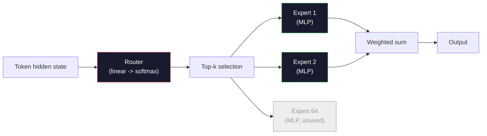

# 开源模型架构详解

> 你在第04课中从零开始建造了GPT-2小型. 2026年,边界开放模式是相同的, 没有任何其他方法, ,而不是. ,而不是学习的职位. 没有任何其他地方的政府. 专家的混合量. 你已经知道的数学覆盖了95%的数据. 这一课程将拉马3,深度寻找V3,Mixtral,Qwen和Gemma一边,并列出每个建筑的不同线程.

> **【中文解读】**你在第四课中从零构建了GPT-2小――2026年前沿开源模型只做了五个修改:RMSNorm 替代LayerNorm、SwiGLU 替代GELU、RoPE 替代学习位置编码、GQA/MLA 替代全注意力、大规模MoE──已掌握的数学覆盖了95%──

> **【拓展：DeepSeek架构】**深度搜索V3的关键创新:MLA(多头潜在注意力,压缩KV缓存) 无助损失的MoE 负载平衡、MTP(多代币预测) 和双管训练――理解这些架构选择是理解2025-2026年大模型发展方向的关键――

>  **【前置】**学本节前请先掌握:阶段10·04(预训练迷你GPT) 理解原始GPT架构;阶段10·05(扩展);阶段10·12(推理优化) 理解KV缓存才能了解MLA。本节是后续15-22节 节架构创新详解) 的概述。

>  **【类比】**看 2026 开源模型 = 看不同品牌的电动车;;Llama 3 = 特斯拉;;务实,GQA + RoPE 标准配置);DeepSeek-V3 = 比亚迪;;堆料王,MLA + MoE + MTP + 双管 全套;混合 = 大众 ID(MoE 老牌);Qwen = 小(多尺寸覆盖);Gemma = 沃尔沃(精简安全);;底层都是变压器(电动车底盘),差异在 5-6个关键模块──

**Type:** Learn
**Languages:** Python (stdlib)
**Prerequisites:** Phase 10, Lessons 04, 05, 12 (Pre-training, Scaling, Inference)
**Time:** ~45 minutes

## 学习目标

- 阅读Llama 3,Mistral,Mixtral,Gemma 2,Qwen 2.5和DeepSeek-V3的配置.json,并解释每个字段
  阅读Llama 3、Mistral、Mixtral、Gemma 2、Qwen 2.5 和DeepSeek-V3的配置.
- 具体地说明每个模型所做的建筑变化,而不是GPT-2小,并根据第一条原则证明它是正确的.
  描述每一个模型对GPT-2小的具体结构修改,并从基本原理进行论证
- 仅从配置中计算任何开放模型的计算参数,KV缓存大小和激活内存
  仅从配置计算任何开源模型的参数量 KV 缓存大小和激活内存
- 选择适合的开放模型,以考虑延迟,内存和能力限制
  根据延迟,内存和能力约束,为部署目标选择合适的开源模型

## 问题 问题引入

在第04课中,你写了350行曲,并有一个GPT-2-形模型. 拉马3405B的技术报告有200页. 你的直觉是,这些是不同的野兽. 他们不是. 两百页面描述了同一个对象,有五到六个有理由的修改, 骨架--嵌入,变体块,注意力,MLP,规范,头--没有改变.

> 你在第四课中写了350行的模板,就像GPT-2的模型一样. 拉马3405B有一个200页的技术报告. 你的直觉告诉你它们是完全不同的东西. 事实上不是.200页的描述是同一个对象,只有五六个有充分动机的修改,加上一千个关于扩展的实现细节.

对于每个主要的开放模型家族,我们列出了从GPT-2发生了什么变化,为什么,以及它花费了多少.

> 本课是一个不同之处.对于每个主要开源模型家族,我们列出了GPT-2的基本变化,为什么改变,价格是什么.

实际的回报是,当Meta发布Llama 5或DeepSeek发布V4时,你不需要新的心理模型.你会看看配置,看看已知的按移动,并知道下游的影响是什么.2026架构是一个有限的工具箱.每个新模型都选择不同的子集.

> 实际收益是:当Meta发布Llama 5或DeepSeek发布V4时,你不需要新的心智模型――你看配置,看看已知旋转被调整了,就知道下游影响是什么――2026年的架构是一个有限的工具箱――每个新模型选择不同的子集――

## 概念的核心概念

> **【中文解读】**本课对比开源LLM的架构演进:GPT 系列 密集变压器)→ 拉马 2/3(RMSNorm、SwiGLU、RoPE、GQA)→ 迷你(滑动窗口注意力)→ 混合(MOE 稀疏激活) ――理解这些架构差异是选择合适模型的基础──

> **【拓展：架构演进的趋势】**2024-2025年架构趋势:RoPE 旋转位置编码已取代绝对位置编码,GQA(分组查询注意力) 减少KV缓存大小,SwiGLU 替代ReLU 提高性能,RMSNorm 替代层Norm 降低计算开销――MOE(混合专家) 通过稀疏激活降低推测成本,DeepSeek-V3 的MOE 每次只激活约37B/671B参数――


### 变化不变的核心

所有自动退缩式开放模型都分享:

- 符号嵌入矩阵 (语音_大小 x 隐藏_dim).
- 堆积N解码器块:标准,自注意,残留,标准,MLP,残留.
- 终极标准和直线头投射到语音大小 (通常有嵌入式重量绑定).
- 原因面具,下一个代号交叉缩损失.

其他都是子.

### 实际上移动的六个节点

在每一个2024-2026年开放的边境模型中,

1. **Normalization.**标准层 -> RMSNorm.
2. **Positional encoding.**学习绝对 -> RoPE (加上 YaRN, NTK).
3. **Activation.** (GELU) ->  (GELU)
4. **Attention head sharing.**美国政府政府政府政府政府政府政府政府政府政府政府政府政府政府政府政府政府政府政府政府政府政府政府政府政府政府政府政府政府政府政府政府政府政府政府政府政府政府政府政府政府政府政府政府政府政府政府政府政府政府政府政府政府政府政府政府政府政府政府政府政府政府政府政府政府政府政府政府政府政府政府政府政府政府政府政府政府政府政府政府政府政府政府政府政府政府政府政府政府政府政府政府政府政府政府政府政府政府政府政府政府政府政府政府政府政府政府政府政府政府政府政府政府政府政府政府政府政府政府政府政府政府政府政府政府政府政府政府政府政府政府政府政府政府政府政府政府政府政府政府政府政府政府政府政府政府政府政府政府政府政府政府政府政府政府政府政府政府政府政府政府政府政府政府政府政府政府政府政府政府政府政府政府政府政府政府政府政府政府政府政府政府政府政府政府政府政府政府政府政府政府政府政府政府政府政府政府政府政府政府政府政府政府政府政府政府政府政府政府政府政府政府政府政府政府政府政府政府政府政府政府政府政府政府政府政府政府政府政府政府政府政府政府政府政府政府政府政府政府政府政府政府政府政府政府政府政府政府政府政府政府政府政府政府政府政府政府政府政府政府政府政府政府政府政府政府政府政府政府政府政府政府政府政府政府政府政府政府政府政府政府政府政府政府政府政府政府政府政府政府政府政府政府政府政府政府政府政府政府政府政府政府政府政府政府政府政府政府政府政府政府政府政府政府政府政府政府政府政府政府政府政府政府政府政府政府政府政府政府政府政府政府.
5. **Dense vs sparse MLP.**密集的专家混合物.
6. **Pre-norm placement.**之前的规范仍然存在,后的规范已经消失了.

其他一切 (学习速度时间表,数据组合,批量大小,背景长度) 都存在于训练配置中,而不是架构中.

### 按1:RMSNorm

层规则减小了平均值,分为std,尺度和转移.RMSNorm只保留了尺度:

```
RMSNorm(x) = x / sqrt(mean(x^2) + eps) * gamma
```

没有中减.没有偏见.每代币少了一个matmul.张和森尼里希 (2019) 认为它在机器翻译上匹配LayerNorm,同时速度更快10%.每一个现代开放模型都运行它.

成本:没有. 优势: 产量较小,代码更简单.

### 子 2: 子

学习位置嵌入式是GPT-2中1024槽查找表. 1025文本是表的末端.模型不能超出其训练长度.

转动位置嵌入 (RoPE, Su等. 通过在注意点产品之前双旋转每个Q和K向量来注射位置. 旋转角是位置的定性函数,所以没有什么可以学习,没有什么可以耗尽. 通过扩展技巧 (NTK意识到插射,YaRN),在8k环境上训练的模型可以在推断下延伸到128k,而小的精度损失.

```
q_rotated = rotate(q, angle(pos))
k_rotated = rotate(k, angle(pos))
score = q_rotated . k_rotated
```

每个Llama,Mistral,Qwen,DeepSeek和Gemma都使用RoPE.Gemma2使用混合物 (大多数层上使用RoPE,其他层上使用本地滑动窗口).

### 结3: 转移

GPT-2的MLP是`x -> gelu(xW1 + b1) -> (...)W2 + b2`. SwiGLU (Shazeer 2020) 将激活取代一个封闭产品:

```
SwiGLU(x) = (xW1) * sigmoid(xW1) * xV
```

两个平行投影而不是一个,被Swish激活关闭.对每个参数的困难性具有实验性强度.Llama 2采用它,每个人都遵循它.MLP的隐藏尺寸通常设置以使参数总数与原始密集MLP相匹配:如果使用GPT-2`ff_dim = 4 * hidden`滑使用`ff_dim = (2/3) * 4 * hidden = 8/3 * hidden`现在,我们要去.

### 节点4: 关注头部共享

使用GPT-2**Multi-Head Attention (MHA)**每个头都具有自己的Q,K,V投影.

**Multi-Query Attention (MQA, Shazeer 2019)**通过数_heads,将KV缓存减小12x至32x,在典型模型上.在硬度基准上,精度略有下降.

**Grouped-Query Attention (GQA, Ainslie et al. 2023)**是中间线:Q头G组共享一个K和一个V. Llama 3 8B使用GQA,有32个Q头和8个KV头 (G=8),因此KV缓存缩小了4x对完全MHA.

**Multi-Head Latent Attention (MLA, DeepSeek 2024)**通过将K和V压缩到共享的低级隐形中,将它们投影到每头上.进一步减少KV缓存,同时保持每头表达性.

| Scheme | KV Heads | KV Cache | Accuracy |
|--------|----------|----------|----------|
| MHA    | num_heads | full | best |
| GQA    | num_groups (G < num_heads) | num_heads / G reduction | near-MHA |
| MQA    | 1 | num_heads reduction | small hit |
| MLA    | latent, per-head decompression | smaller than MQA | near-MHA |

对于超过13B参数的任何模型,GQA或MLA实际上是强制性的.

### 五节:专家组合

密集MLP为每个代币激活所有参数.一个MoE MLP每个区块都有K专家,一个路由器选择每个代币的顶级k专家 (通常是顶级-2).只有这些专家的权重才能看到该代币的前进通过.

```
router_logits = xW_r
indices, weights = top_k(router_logits, k=2)
output = sum_i weights[i] * expert[indices[i]](x)
```

吸引力:你可以拥有64位7B尺寸的专家 (因此总参数数量巨大),同时只运行每代币的2个 (因此每代币计算匹配密集的7B模型).Mixtral 8x7B总参数为47B,但每代币只激活13B.DeepSeek-V3总参数为671B,但每代币只激活37B.



优点:相同的计算,更多参数,更好的容量. 缺点:专家内存仍然必须住在某个地方 (因此服务需要比密集的相当数量更多的VRAM),负载平衡路由器很难,并调整路由器在调整过程中是其自己的研究领域.

### 按6: 预规停留

变压器原始的层规范在每个子层之后应用.自GPT-2以来的每一个开放模型都把它放在每个子层之前.预规格在深度训练非常容易.没有什么可争辩的.

### 模型以模型的差异

这里是制造这一切混凝土的表.

| Model | Year | Total Params | Active Params | Norm | Activation | Position | Attention | MoE | Context |
|-------|------|-------------|---------------|------|-----------|----------|-----------|-----|---------|
| GPT-2 Small | 2019 | 124M | 124M | LayerNorm | GELU | Learned | MHA (12 heads) | no | 1k |
| Llama 3 8B | 2024 | 8B | 8B | RMSNorm | SwiGLU | RoPE | GQA (32/8) | no | 128k |
| Llama 3 70B | 2024 | 70B | 70B | RMSNorm | SwiGLU | RoPE | GQA (64/8) | no | 128k |
| Llama 3 405B | 2024 | 405B | 405B | RMSNorm | SwiGLU | RoPE | GQA (128/16) | no | 128k |
| Mistral 7B | 2023 | 7.2B | 7.2B | RMSNorm | SwiGLU | RoPE | GQA | no | 32k |
| Mixtral 8x7B | 2023 | 47B | 13B | RMSNorm | SwiGLU | RoPE | GQA | yes (8 experts, top-2) | 32k |
| Gemma 2 9B | 2024 | 9B | 9B | RMSNorm (pre+post) | GeGLU | RoPE + sliding | GQA | no | 8k |
| Qwen 2.5 72B | 2024 | 72B | 72B | RMSNorm | SwiGLU | RoPE (YaRN) | GQA (64/8) | no | 128k |
| DeepSeek V2 236B | 2024 | 236B | 21B | RMSNorm | SwiGLU | RoPE | MLA | yes (160 experts, top-6) | 128k |
| DeepSeek V3 | 2024 | 671B | 37B | RMSNorm | SwiGLU | RoPE | MLA | yes (256 experts, top-8) | 128k |

扫描列.RMSNorm是通用的.SwiGLU或其GeGLU表兄弟是通用的.RoPE是通用的.GQA是通用的7B以上,除非被MLA取代.MoE是顶端的区分符.

### 阅读一个config.json

号3 8B配置:

```
{
  "hidden_size": 4096,
  "intermediate_size": 14336,
  "num_hidden_layers": 32,
  "num_attention_heads": 32,
  "num_key_value_heads": 8,
  "max_position_embeddings": 131072,
  "rope_theta": 500000.0,
  "rms_norm_eps": 1e-5,
  "vocab_size": 128256
}
```

每个领域都与你已经实施的东西相匹配.

- `hidden_size`嵌入式尺寸
- `intermediate_size`缩的数据是:
- `num_hidden_layers`积深度
- `num_attention_heads`头.
- `num_key_value_heads`:KV头 (GQA).
- `max_position_embeddings`培训背景长度.
- `rope_theta`基频率:RoPE. Meta将其从默认10k到500k进行长文本外分.
- `rms_norm_eps`数字稳定性
- `vocab_size`标记

通过这些单独计算总参数,KV缓存和最高激活内存.`code/main.py`对于准确的公式.

### 激活内存预算

激活在几十亿参数以上的训练记忆中占主导地位.

```
activation_mem ~ batch_size * seq_len * hidden_size * num_layers * bytes_per_element
```

对于Llama 3 8B,第1批,次数8192,BF16,32层,隐藏4096:大约8GB只用于检查点的激活,40GB没有.这就是为什么闪光注意力和环节注意力重要--他们重写注意力计算,使激活适合.

### 库存预算

为了在最大的背景下推断:

```
kv_cache = 2 * num_layers * num_kv_heads * head_dim * max_seq_len * bytes_per_element
```

号 3 8B 在 128k 语境中,BF16,头_dim =隐藏 / num_heads = 128:
`2 * 32 * 8 * 128 * 131072 * 2 = 17.2 GB`按顺序进行.

8B重量为16GB,BF16中.单个128k序列的KV缓存量比重量大.这是驱动GQA,MLA和KV缓存量化研究的内存压力.

### 每个模特都会赢得

- **Single 80GB GPU, no MoE**马3 8B,米斯特拉7B,Gemma2 9B. 很容易使用,宽的工具.
- **Single node (8x80GB), big capacity**门2.572B. 密度最大的开放能力.
- **Biggest open capability, accept MoE complexity**果:深度搜索V3,Mixtral 8x22B. 每个活跃的FLOP最好的功能.
- **Long-context needs**: Llama 3 (128k 具有ROPE扩展),深度搜索 (MLA优势).
- **Low-latency serving**:Gemma 2 9B (滑窗切断长文本计算).


> **【拓展：开源模型的选型指南】**2024-2025年开源模型选型:通用对话选 Llama-3-70B,推理任务选 DeepSeek-R1,代码生成选 DeepSeek-Coder-V2,长上下文选 Qwen-2.5-72B(128K 上下文),轻量级选 Llama-3-8B 或 Qwen-2.5-7B──


## 建立它,实现它.
```figure
rmsnorm-vs-layernorm
```

## 建立它

课程代码是计算器. 给出任何 config.json,它会按组件打印参数数,KV缓存在最大的背景下,SwiGLU MLP比率,以及对架构的简短判决 (密度 / GQA / MLA / MoE).

```python
config = {
    "hidden_size": 4096, "intermediate_size": 14336,
    "num_hidden_layers": 32, "num_attention_heads": 32,
    "num_key_value_heads": 8, "vocab_size": 128256,
    "max_position_embeddings": 131072,
}
```

脚本将建筑领域按字段进行行程,计算嵌入,注意 (GQA减小),MLP (SwiGLU扩展),层规范和头.然后计算KV缓存在指定的文本长度上并打印总结.

看到`code/main.py`执行.

## 用它实现框架

运行计算器在Llama 3 8B,Mistral 7B,Mixtral 8x7B和DeepSeek V3配置中. 进行参数分解的比较. 注意MoE模型的总参数数数量超过密集型号,但活性参数数数量通常较小. 注意DeepSeek V3的KV缓存量比Llama 3 405B小,尽管总参数更大 - 即是MLA在操作中.

然后将本地任何模型的配置插入,阅读摘要,

## 运送它.

这一课产生了`outputs/skill-open-model-picker.md`鉴于部署目标 (GPU类型,VRAM,文本长度,延迟预算) 和任务配置文件 (聊天,代码,推理,长文本),它建议一个开放模型,从第11课中进行量化方案,以及从第12课中进行推断堆,明确推理六个架构按.

> 本课产出发 `outputs/skill-open-model-picker.md`提供了部署目标,GPU类型,显存,上下文长度,延迟预算) 和任务配置,它推了开源模型,第十一课量化方案和第十二课的推,并提供了六个结构旋律的明确推.

## 练习题

1. 阅读 HuggingFace 的 Qwen 2.5 72B 配置.从零开始计算总参数.与 HF 报告值进行比较,并确定任何三角形来自哪里 (头部缩,KV 分享因子等).
   中文翻译:阅读 HuggingFace 上的Qwen 2.5 72B配置──从零计算总参数量──与HF 报告值比较,找出差异来源(头维度舍入、KV 共享因子等)──

2. 根据 DeepSeek V3 的数据,使用256名专家,并提供8位专家的路由.计算活跃专家与总专家的比例,并与Mixtral 8x7B的8位专家的2位专家进行比较.从稀疏 (25%) 到更密集稀疏 (3%) 的转变意味着每 FLOP的容量是什么?
   中文翻译:DeepSeek V3 用256 专家前8 路由――计算激活专家与总专家的比率,与 Mixtral 8x7B的前2个8比较――从稀疏(25%) 到更密稀疏(3%) 的转变对每一个FLOP容量意味着什么?

3. 在 FP8 和 BF16 中计算 Llama 3 405B 的 KV缓存在 128k 语境中.在 FP8 中,它是 BF16 号码的一半.在一个 8xH100 节点上,你可以提供多少个并行序列 (每一个 80GB = 640GB 总量,减减重内存)?
   中文翻译:计算 Llama 3 405B 在 128K 上下文下 FP8 和 BF16 的 KV 缓存――FP8 是 BF16 的一半――单个 8xH100 节点(每张 80GB = 总共 640GB,减权重内存)能服务多少并行序列?

4. 基玛2交替全注意和滑动窗口注意层.写出KV缓存的数学,当一半层使用4096代币滑动窗口而不是全文本时.这在8k总文本上节省了多少内存?
   中文翻译:Gemma 2 交换使用全注意力和滑动窗口注意力层――写出一半层使用4096代码滑动窗口而不是全上下文时 KV 缓存的数学公式――在8K 总上下文省多少内存?

5. 找一个最近发布的边界开放模型,这个课程写完后. 确定它选择的六个按中的哪个,以及它是否推出了第七个按. 新的建筑设计开始时,课程将会感到过时 - - 目标是更新你的表格,而不需要重建你的心理模型.
   中文翻译:找一篇本课编写后发布的最新前沿开源模型――识别它选择了六旋中的哪个以及是否引入了第七旋――课程在新架构发布时就会过时目标是更新你的表格而不重建心智模型――

## 关键词 快速查找表

| Term | What people say | What it actually means | 中文释义 |
|------|----------------|----------------------|---------|
| RMSNorm | "LayerNorm without the mean" | Normalize by root mean square only, with a learned scale — cheaper and comparable to LayerNorm | 均方根归一化，仅按均方根归一化，更廉价 |
| RoPE | "Rotary positions" | Rotate each Q and K vector in 2D pairs by an angle that depends on position — extrapolates beyond training length with scaling tricks | 旋转位置编码，按位置旋转 Q/K 向量 |
| SwiGLU | "The new MLP activation" | Gated linear unit with Swish: `(xW1) * sigmoid(xW1) * xV` — standard in every 2024+ open model | SwiGLU 激活，门控线性单元，2024+ 模型标配 |
| GQA | "Middle ground attention" | Grouped-Query Attention: G groups of Q heads share one K and one V head — shrinks KV cache without MQA's accuracy hit | 分组查询注意力，Q 头分组共享 K/V |
| MLA | "DeepSeek's attention" | Multi-Head Latent Attention: compress K/V into a shared low-rank latent, decompress per head — smallest KV cache for large models | 多头潜在注意力，将 K/V 压缩为低秩潜在向量 |
| MoE | "Sparse experts" | Mixture of Experts: N MLPs per block, router picks top-k per token — huge total params, small active params | 混合专家，每块 N 个 MLP，路由器选 top-k |
| Top-k routing | "Pick k experts per token" | The router computes a score per expert and activates the k highest — typical k is 2 (Mixtral) to 8 (DeepSeek) | Top-k 路由，每个 token 激活 k 个专家 |
| YaRN | "Stretch RoPE" | Yet another RoPE extension — interpolates rotary angles to extend context from 8k to 128k+ at inference time | YaRN，通过插值旋转角度扩展上下文 |
| Sliding-window attention | "Don't attend to everything" | Each token attends only to the last W tokens — caps attention cost at O(W) per token, used in Gemma 2 and early Mistral | 滑动窗口注意力，每个 token 只关注最近 W 个 token |
| Active params | "What runs per token" | For MoE models, the parameter count that sees a forward pass per token (much smaller than total params) — governs per-token FLOPs | 激活参数，MoE 模型每 token 实际使用的参数量 |

## 继续阅读 继续阅读

- [Dubey et al., 2024 -- "The Llama 3 Herd of Models"](https://arxiv.org/abs/2407.21783)-- 密集的Llama 3家族的建筑和培训参考
- [DeepSeek-AI, 2024 -- "DeepSeek-V3 Technical Report"](https://arxiv.org/abs/2412.19437)-- MLA加上辅助减损免负载平衡加上671B MoE
- [Jiang et al., 2024 -- "Mixtral of Experts"](https://arxiv.org/abs/2401.04088)-- 开放式的"MoE"模型文件
- [Su et al., 2021 -- "RoFormer: Enhanced Transformer with Rotary Position Embedding"](https://arxiv.org/abs/2104.09864)-- RoPE纸
- [Shazeer, 2020 -- "GLU Variants Improve Transformer"](https://arxiv.org/abs/2002.05202),,和朋友
- [Ainslie et al., 2023 -- "GQA: Training Generalized Multi-Query Transformer Models"](https://arxiv.org/abs/2305.13245)-- 关于GQA的论文
- [Gemma 2 Team, 2024 -- "Gemma 2: Improving Open Language Models at a Practical Size"](https://arxiv.org/abs/2408.00118)--混合式全+滑动注意力,前+后标准
- [Qwen Team, 2024 -- "Qwen 2.5 Technical Report"](https://arxiv.org/abs/2412.15115)-- YaRN 背景扩展和长文本培训配方
