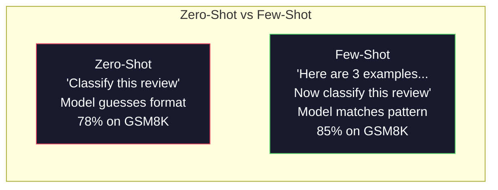
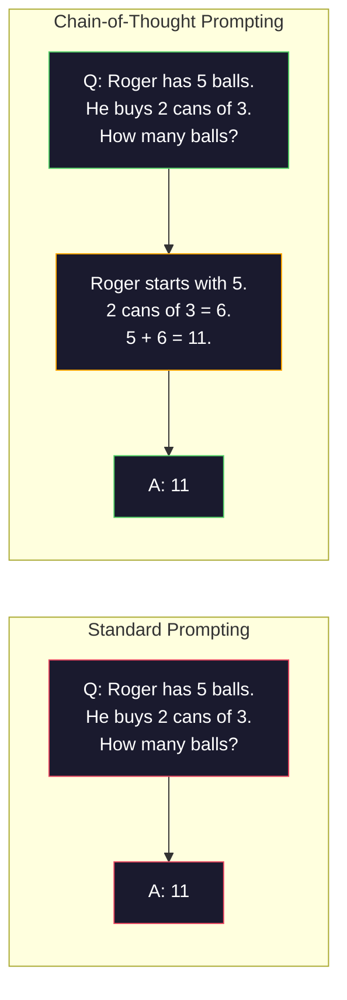
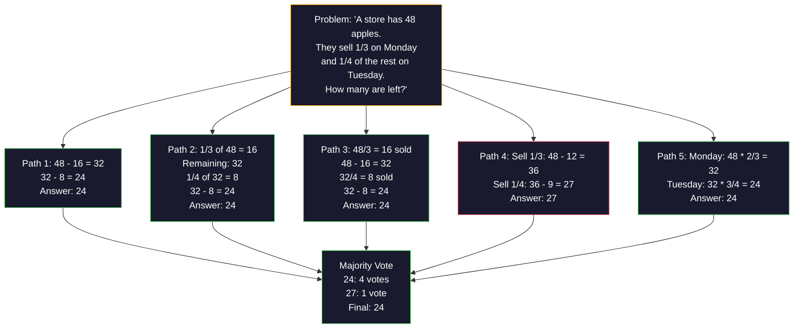
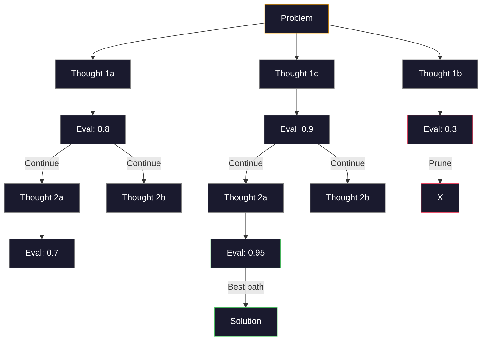

# 简单的,链接的,思维树.

> 告诉模型该做什么是促使. 展示它如何思考是工程. 在同一模型,同一任务,相同数据上,78%到91%的准确度之间的差距不是更好的模型.

> **【中文解读】**告诉模型"做什么"是提示,展示"如何思考"才是工程――从78%到91%的准确率提高不是基于更好的模型,而是基于更好的推理策略少样本示例"",链式思考"",自我一致投票等技术――

> **【拓展：推理策略→AI Agent】**复习的思想行动观察循环是 长链,创作AI等代理框架的核心模式.

>  **【前置】**学习节前请先掌握:阶段11·01(即时工程) 理解系统提示、角色、限制等基本模式──本节是其延伸,要求你已经能够写出结构化提示──本节将用于OpenAI/人类SDK──

**Type:** Build | **类型:** 构建
**Languages:** Python | **语言:** Python
**Prerequisites:** Lesson 11.01 (Prompt Engineering) | **前置知识:** Phase 11 · 01 (提示工程)
**Time:** ~45 minutes | **时间:** ~45 分钟

## 学习目标

- 通过选择和格式化最大限度地完成任务准确性的示例,实现少数拍摄提示
  通过选择和格式化示例演示实现少量样本提示,最大化任务准确率
- 应用链思维 (CoT) 推理,以提高多步骤问题上的准确性,如数学词题
  应用链式思维 (CoT) 推理提高多步骤问题 (如数学应用题) 的准确率
- 建立一个思考树提示,探索多种推理路径,选择最好的
  构建思维树提示,探索多条推理路径并选择最佳路径
- 测量从零射击对少数射击对CoT的准确性提高,根据标准基准
  在标准基准上测量零样本vs少样本vsCoT的准确率提升

> **【中文解读】**本课目标:掌握少数投注的方法 (在即时中提供示例引导输出格式) 和思维链 (需要模型思考一步一步以提高推理能力) 两大技术之一.


## 问题 问题引入

你建立了一个数学教学应用程序.你的提示是"解决这个词问题".GPT-5在GSM8K上得到了94%的时间,这是标准的小学数学基准.你认为你已经达到顶峰.你没有思想链仍然增加3-4分.

> 你构建了一个数学辅导应用. 你的提示:"解决这个应用问题. "GPT-5在 GSM8K的标准小学数学基准上正确率是94%.

添加五个单词, "让我们一步一步思考" - - 精度跳到91%.添加几种工作的例子,它达到95%.同样的模型.同样的温度.同样的API成本.唯一的区别是你给了模型的草纸.

> 加上五个词"让我们一步一步思考"准确率就跳到91%.

这不是一个黑客.这是推理工作的方式.人类不会在一个心理跳跃中解决多步骤的问题.转变器也不会.当你迫使模型生成中间代币时,这些代币成为下一个代币的背景的一部分.每一步推理都能给下一个代币提供食物.模型字面上计算到答案.

> 这不是花招. 这就是推理工作方式.人类不会一次完成多步骤的问题推理. 变压器也不会. 当你强制模型生成中间代币时,这些代币就成为下一个代币的下文的一部分. 每个推理步骤都为下一步提供信息.

>  **【类比】**不用Ct 像让人"心算17 × 24"大多数人会算错或卡住.用Ct 像给一张草稿纸:"17 × 24 = 17 × 20 + 17 × 4 = 340 + 68 = 408"步骤写下来就不会错.LLM 一样:每个生成的代币将成为下一轮前进传输的输入,"显式写过程"等于让模型使用"外部记忆"做长链推理,而不是一次前进传输完成.

> ️ **【易错点】**没有人能看到.**示例数量错误**0射击 CoT加"让我们一步一步思考"就够了,再加上3-5个少射击示例能再2-5点;超过8个示例性价格比下降(快速太长,成本上) 2)**示例顺序敏感**与3个例子相对A,B,C排和C,B,A排,准确率差 5-10%;务必把"最相关的例子"放最后 (靠近问题) )**CoT 不适用于简单任务**"今天几号?"加 CoT 反而让模型出错;CoT只对多步推理数学,逻辑,规划有效.

但"一步一步思考"是开始,而不是结束.如果你采用五种推理方法,并获得多数票,你会怎么样?如果你让模型探索一个可能性树,评估和剪枝?如果你将推理与工具的使用交织在一起呢?这些不是假设.它们是有测量改进的发表技术,你将在这个课程中构建它们.

> 但是"逐步思考"只是开始,不是终点.如果你采用五条推理路径,然后进行多数投票,你会怎么做?如果你让模型探索一个可能性的树,评估和剪枝分支会如何?如果你将推理和工具使用交换,你会怎么做?这些不是假设.

## 概念的核心概念

> **【中文解读】**简单学习 (少样本学习) 和思维链 (Chain-of-Thought, CoT) 是快速工程的两个核心技术.

> **【拓展：CoT 的推理提升效果】**谷歌2022年的论文证明,在数学推理任务上,CoT将提高PaLM 540B的准确率从17%提高到56%.

>  **【困惑】**问:2026年原生推理模型(Claude Extended Thinking、o3) 都自带了 CoT了,我还需要手写"思考一步一步"吗?答:不需要,但有前提:(1) 用于支持原生推理模型Claude 4.5+、GPT-5、o3、DeepSeek-R1等;(2) 任务确实需要推理简单分类任务原生思考反而拖延――对老模型PT-4、Claude 3) 或开源模型Llama 3) 仍然需要手写 CoT──判断:如果模型有`reasoning_effort`或`thinking`参数,使用它;否则使用提示──


### 零射击与少射击:当例子击败指令时

零射击提示给模型一个任务,而没有其他任务. 少数射击提示首先给它举例.

> 零样本提示只给模型一个任务,不加其他内容.

微等人 (2022) 在8个基准中测量了这一点.对于像情感分类这样的简单任务,零射击和少射击在彼此的2%内执行.对于多步数学和象征性推理这样的复杂任务,少射击提高了10-25%的准确性.

> 微等 (2022) 在8个基准上测量了这一点.对于情感分类等简单任务,零样本和少样本的性能差异在2%内.对于多步算术和符号推理等复杂任务,少样本的准确率将提高10-25%.

直觉:例子是压缩的指令.你不描述输出格式,而是显示它.你不解释推理过程,而是展示它.模型模式比解释抽象指令更可靠地匹配例子.

> 直觉:示例是压缩的指令. 与其描述输出格式,不如直接展示它. 与其解释推理过程,不如直接演示它.



**When few-shot wins:**对于格式敏感任务,分类,结构化提取,特定领域的语,任何模型需要匹配特定模式的任务.

> **少样本胜出的场景**任何模型都需要匹配特定模式的任务.

**When zero-shot wins:**简单的事实问题,创意任务,例子限制创造力,找到好的例子比写好说明更难的任务.

> **零样本胜出的场景**简单的事实问题,示例会限制创造力创意任务,寻找比编写好命令更难的任务的好示例.

### 选择例子:类似的击球随机

不是所有例子都是相同的.选择类似于目标输入的例子在分类任务上比随机选择5-15%更好 (Liu等人, 2022).三个原则:

> 不是所有示例都一样好. 选择与目标输入相似的示例在分类任务上比随机选择高出5-15% (Liu 等人,2022):

1. **Semantic similarity**: 选择最接近输入空间的例子
   **语义相似性**选择嵌入空间中最接近输入的示例
2. **Label diversity**: 涵盖您的示例中的所有输出类别
   **标签多样性**包含所有输出类别:
3. **Difficulty matching**根据目标问题的复杂性水平
   **难度匹配**符合目标问题的复杂性级别

在3下,模型没有足够的信号来提取模式.在5上,你会击中减少回报和浪费文本窗口代币.对于许多标签的分类,请使用每个标签的一个例子.

> 大多数任务的最佳示例数量为3-5个. 低于3个,模型没有足够的信号来提取模式. 超过5个,边际收益递减和浪费在下文窗口标志.

### 思想链:提供模特的草纸

推出了"链思维" (CoT) 提示,由微等人 (2022) 在谷歌大脑上推出. 这个想法很简单:而不是仅仅要求模型回答,请它先显示其推理步骤.

> 链式思维 (CoT) 提示由Google Brain的 Wei等 (等) 推介.



由于这种方法是机械的,变压器生成的每个代币都会成为下一个代币的背景.没有CoT,模型必须将所有推理压缩到单个前进传递的隐藏状态中.

> 为什么这在机制上有效?变压器生产的每个代币都成为下一个代币的上下文――没有CT,模型必须将所有推理压缩到单次前向传播的隐藏状态――有CT,模型将被中间计算外化为代币――每个推理代币都扩大了有效计算深度――

**GSM8K benchmarks (grade-school math, 8.5K problems):**

| Model | Zero-Shot | Zero-Shot CoT | Few-Shot CoT |
|-------|-----------|---------------|--------------|
| GPT-4o | 78% | 91% | 95% |
| GPT-5 | 94% | 97% | 98% |
| o4-mini (reasoning) | 97% | — | — |
| Claude Opus 4.7 | 93% | 97% | 98% |
| Gemini 3 Pro | 92% | 96% | 98% |
| Llama 4 70B | 80% | 89% | 94% |
| DeepSeek-V3.1 | 89% | 94% | 96% |

**Note on reasoning models.**开放AI的o系列 (o3,o4-mini) 和DeepSeek-R1等模型在发出答案之前内部运行思想链.在推理模型中添加"让我们一步一步思考"是冗余的,有时是反效的.

> **关于推理模型的说明。**像OpenAI的 o 系列 ((o3、o4-mini) 和DeepSeek-R1这样的模型在输出答案之前会在内部运行链式思考.

两种风味:

> 两种形式:

**Zero-shot CoT**没有需要举例.科吉马等人 (2022) 表明,这个单一句子在算术,常识和象征性推理任务中提高了准确性.

> **零样本 CoT**,,,,,,,,,,,,,,,,,,,,,,,,,,,,,,,,,,,,,,,,,,,,,,,,,,,,,,,,,,,,,,,,,,,,,,,,,,,,,,,,,,,,,,,,,,,,,,,,,,,,,,,,,,,,,,,,,,,,,,,,,,,,,,,,,,,,,,,,,,,,,,,,,,,,,,,,,,,,,,,,,,,,,,,,,,,,,,,,,,,,,,,,,,,,,,,,,,,,,,,,,,,,,,,,,,,,,,,,,,,,,,,,,,,,,,,,,,,,,,,,,,,,,,,

**Few-shot CoT**模型可以看到你预期的正确的推理格式,因此比零射击CoT更有效.

> **少样本 CoT**提供包含推理步骤的示例. 比零样本更有效,因为模型看到了你期望的精确推理形式.

**When CoT hurts**简单的事实回忆 ("法国的首都是什么?"),单步分类,速度比精确性更重要的工作.

> **CoT 何时有害**简单的事实回忆:"法国的首要是什么?") 单步分类,速度比准确率更重要任务.

### 统一: 抽取许多人,一次投票

等人 (2023) 引入了自相一致性. 洞察:单个CoT路径可能包含推理错误. 但如果你采用N独立推理路径 (使用温度>0) 并对最终答案获得多数票,错误会被取消.

> 张等 (Wang 等人) 提出自一致性.洞察:单条 CoT 路径可能包含推理错误.



自律性提高了GSM8K精度,从56.5% (单次CoT) 提高到74.4%,在最初的PaLM 540B实验中N=40 在GPT-5上,改善很小 (97%至98%) 因为基准已经和. 这种技术最能在60-85%的基准CT模型上发挥作用. 单路错误经常发生,但并非系统. 对于推理模型 (o系列,R1) 的自相一致性由内置的内部采样进行.

> 自一致性在原始 PaLM 540B 实验中将GSM8K 准确率从56.5% (单条 CoT) 提高到74.4% (N=40) ⋅在GPT-5上改进很小 ((97%到98%),因为基础准确率已经和――该技术在基础 CoT 准确率为60-85%的模型上表现最佳这是单路误频繁但非系统性的最佳区间.

交易:N样本意味着Nx API成本和延迟.实际上,N=5占据了大部分的好处.N=3是有意义的投票的最低值.N>10对大多数任务的回报率下降.

> 权衡:N个样本意味着N倍的API 成本和延迟――实践中,N=5 捕获了大部分收益――N=3 是有意义的投票最低要求――N > 10 对大多数任务的边际收益递减――

### 思想树:分支探索

等人 (2023) 引入了思维树 (ToT).在CT遵循一个线性推理路径时,ToT在继续之前探索多个分支并评估最有前途的.

>  等人 () 于2023年引入了思维树 (思维树)    沿着一条线性推理路径进步,而 探索多个分支并继续评估哪些有最前景.



托特有三个组成部分:

> 它们有三个组成部分:

1. **Thought generation**: 产生多个候选人下一步
   **思维生成**产生多个候选人的下一步
2. **State evaluation**:每位候选人都能获得分数 (可以作为评估者使用LLM本身)
   **状态评估**:为每位候选人打分 ((可以使用LLM本身作为评估器)
3. **Search algorithm**: BFS或 DFS 穿过树木,切割低分分分的枝
   **搜索算法**通过BFS或DFS 遍历树木,剪除低分分支

在24任务游戏中 (通过算法结合4个数字,使24),GPT-4与标准提示解决7.3%的问题.在CoT中,4.0% (CoT实际上在这里很痛苦,因为搜索空间很宽).在ToT中,74%.

> 在24任务的游戏中,GPT-4 使用标准提示解决7.3%的问题.

树中的每个节点都需要一个LLM调用.一个分分数3和深度3的树需要高达39个LLM调用.只用于搜索空间很大但可评估的问题 - 规划,解题,创造性解决问题,但有限制.

> 树中的每个节点都需要一次LLM调用. 一个分支因子为3个深度为3个树最需要39次LLM调用.

### 反应:思考+行动

雅奥等人 (2022) 将推理的痕迹与行动结合在一起.该模型在思考 (产生推理) 和行动 (调用工具,搜索,计算) 之间交替.

>  等人 () 将推理轨迹与行动结合――模型在思考 () 产生推理 () 和行动 () 调用工具 () 搜索 (计算) 之间交换――

```mermaid
graph LR
    Q["Question:\nWhat is the\npopulation of the\ncountry where\nthe Eiffel Tower\nis located?"]
    T1["Thought: I need to\nfind which country\nhas the Eiffel Tower"]
    A1["Action: search\n'Eiffel Tower location'"]
    O1["Observation:\nParis, France"]
    T2["Thought: Now I need\nFrance's population"]
    A2["Action: search\n'France population 2024'"]
    O2["Observation:\n68.4 million"]
    T3["Thought: I have\nthe answer"]
    F["Answer:\n68.4 million"]

    Q --> T1 --> A1 --> O1 --> T2 --> A2 --> O2 --> T3 --> F

    style Q fill:#1a1a2e,stroke:#ffa500,color:#fff
    style T1 fill:#1a1a2e,stroke:#51cf66,color:#fff
    style A1 fill:#1a1a2e,stroke:#e94560,color:#fff
    style O1 fill:#1a1a2e,stroke:#808080,color:#fff
    style T2 fill:#1a1a2e,stroke:#51cf66,color:#fff
    style A2 fill:#1a1a2e,stroke:#e94560,color:#fff
    style O2 fill:#1a1a2e,stroke:#808080,color:#fff
    style T3 fill:#1a1a2e,stroke:#51cf66,color:#fff
    style F fill:#1a1a2e,stroke:#51cf66,color:#fff
```



在知识密集任务中,ReAct 优于纯粹的CoT,因为它可以将其推理基于真实的数据.在HotpotQA (多跳答题),ReAct 与GPT-4实现了35.1%的精确匹配,而仅仅为CoT而言,达到29.4%的精确匹配.真正的力量是,推理错误通过观察得到纠正 - 模型可以在执行中更新计划.

> 在知识密集型任务中,ReAct优于纯CT,因为它可以基于真实数据推断.在HotpotQA (HotpotQA) 上,ReAct与GPT-4的准确匹配率达到35.1%,而纯CT为29.4%.真正的力量在于推断错误可以通过观察来纠正模型可以在执行过程中更新计划.

反应是现代人工智能代理的基础.每个代理框架 (长链, CrewAI,自动生成) 实现了思考-行动-观察循环的某种变化.你将在第14阶段构建完整的代理.

> 反应是现代人工智能代理的基础.每个代理框架都实现了某种思维行动观察循环的变化.

### 结构化提示:XML标签,界限符,标题

随着提示变得复杂,结构可以防止模型混乱的部分.

> 随着提示变得复杂,结构可以防止模型混不同部分.

**XML tags**(与克劳德最好,在任何地方都很坚固):
```
<context>
You are reviewing a pull request.
The codebase uses TypeScript and React.
</context>

<task>
Review the following diff for bugs, security issues, and style violations.
</task>

<diff>
{diff_content}
</diff>

<output_format>
List each issue with: file, line, severity (critical/warning/info), description.
</output_format>
```

**Markdown headers**(普遍):
```
## Role
Senior security engineer at a fintech company.

## Task
Analyze this API endpoint for vulnerabilities.

## Input
{api_code}

## Rules
- Focus on OWASP Top 10
- Rate each finding: critical, high, medium, low
- Include remediation steps
```

**Delimiters**(最小但有效):
```
---INPUT---
{user_text}
---END INPUT---

---INSTRUCTIONS---
Summarize the above in 3 bullet points.
---END INSTRUCTIONS---
```

### 快速链接:序列分解

一些任务对于一个提示来说太复杂了. 提示链将它们分成步骤,其中一个提示的输出成为下一个提示的输入.

> 有些任务太复杂,无法用单个提示完成.提示链将它们分解成步骤,一个提示的输出成为下一个提示的输入.


链接跳动单次,原因是三个:

> 链式优于单提示有三个原因:

1. **Each step is simpler**:模型处理一个集中任务,而不是道所有事情
   **每个步骤更简单**模型处理一个聚焦的任务,而不是同时处理所有事情
2. **Intermediate outputs are inspectable**您可以在步骤之间验证和纠正
   **中间输出可检查**您可以在步骤之间验证和修改
3. **Different steps can use different models**采用便宜的模型来提取,而昂贵的模型来推理
   **不同步骤可以使用不同模型**采用便宜的模型,采用昂贵的模型进行推

### 性能比较

| Technique | Best For | GSM8K Accuracy (GPT-5) | API Calls | Token Overhead | Complexity |
|-----------|----------|------------------------|-----------|----------------|------------|
| Zero-Shot | Simple tasks | 94% | 1 | None | Trivial |
| Few-Shot | Format matching | 96% | 1 | 200-500 tokens | Low |
| Zero-Shot CoT | Quick reasoning boost | 97% | 1 | 50-200 tokens | Trivial |
| Few-Shot CoT | Maximum single-call accuracy | 98% | 1 | 300-600 tokens | Low |
| Self-Consistency (N=5) | High-stakes reasoning | 98.5% | 5 | 5x token cost | Medium |
| Reasoning model (o4-mini) | Drop-in CoT replacement | 97% | 1 | hidden (2-10x internal) | Trivial |
| Tree-of-Thought | Search/planning problems | N/A (74% on Game of 24) | 10-40+ | 10-40x token cost | High |
| ReAct | Knowledge-grounded reasoning | N/A (35.1% on HotpotQA) | 3-10+ | Variable | High |
| Prompt Chaining | Complex multi-step tasks | 96% (pipeline) | 2-5 | 2-5x token cost | Medium |

对于大多数生产系统,只有3个样本自相一致性倒退的少量COT覆盖90%的使用情况.

> 正确的技术取决于三个因素:准确率需求,延迟预算和成本耐受性.

## 建立它,实现它.
```figure
few-shot-curve
```

## 建立它

我们将构建一个数学问题解决方案,将短暂的提示,链条思维推理和自律投票结合成一个管道.

> 我们将构建一个数学问题求解器,将少量提示,链式思考推理和自一致性投票组合组合成一个流水线.

全面实施在`code/advanced_prompting.py`它们是主要的组成部分.

> 完整实现在`code/advanced_prompting.py`中──以下是关键组件──

### 步骤1:少拍的例子商店

第一个组件管理了少数镜头的例子,并选择了对特定问题的最相关的例子.

> 第一个组件管理少样本示例,并为给定问题选择最相关的示例.

```python
GSM8K_EXAMPLES = [
    {
        "question": "Janet's ducks lay 16 eggs per day. She eats three for breakfast every morning and bakes muffins for her friends every day with four. She sells every egg at the farmers' market for $2. How much does she make every day at the farmers' market?",
        "reasoning": "Janet's ducks lay 16 eggs per day. She eats 3 and bakes 4, using 3 + 4 = 7 eggs. So she has 16 - 7 = 9 eggs left. She sells each for $2, so she makes 9 * 2 = $18 per day.",
        "answer": "18"
    },
    ...
]
```

每个例子都有三个部分:问题,推理链和最终答案.推理链是将一个普通的几次例子转化为一个CoT的几次例子.

> 每个示例都有三个部分:问题"",推理链"和最终答案.

### 第二步: 构建思想链的提示

提示构造器将系统信息,一些投影例子与推理链,以及目标问题组合成一个提示.

> 提示构建器把系统信息带推理链的少量样本示例和目标问题组装成单个提示.

```python
def build_cot_prompt(question, examples, num_examples=3):
    system = (
        "You are a math problem solver. "
        "For each problem, show your step-by-step reasoning, "
        "then give the final numerical answer on the last line "
        "in the format: 'The answer is [number]'."
    )

    example_text = ""
    for ex in examples[:num_examples]:
        example_text += f"Q: {ex['question']}\n"
        example_text += f"A: {ex['reasoning']} The answer is {ex['answer']}.\n\n"

    user = f"{example_text}Q: {question}\nA:"
    return system, user
```

格式限制 ("答案是[数]") 很重要.没有它,自相一致性无法从样本中提取和比较答案.

> 格式约束 (("答案是[数量]")至关重要――没有它,自一致性无法在不同样本之间提取和比较答案――

### 步骤3:自主投票

采用N推理方式,并取多数答案.

> 采样 N 条推理路径,取多数答案──

```python
def self_consistency_solve(question, examples, client, model, n_samples=5):
    system, user = build_cot_prompt(question, examples)

    answers = []
    reasonings = []
    for _ in range(n_samples):
        response = client.chat.completions.create(
            model=model,
            messages=[
                {"role": "system", "content": system},
                {"role": "user", "content": user}
            ],
            temperature=0.7
        )
        text = response.choices[0].message.content
        reasonings.append(text)
        answer = extract_answer(text)
        if answer is not None:
            answers.append(answer)

    vote_counts = Counter(answers)
    best_answer = vote_counts.most_common(1)[0][0] if vote_counts else None
    confidence = vote_counts[best_answer] / len(answers) if best_answer else 0

    return best_answer, confidence, reasonings, vote_counts
```

温度是0.7很重要.在温度是0.0,所有N样本都会相同,从而打败目的.你需要足够的随机性来进行不同的推理方式,但不是那么多,模型产生语.

> 在温度下,所有N个样本都会相同,失去了意义.

### 第四步:思考树的解决方法

在线性推理失败的问题上,ToT探讨多种方法,并评估哪个方向最有前途.

> 对于线性推理失败的问题,

```python
def tree_of_thought_solve(question, client, model, breadth=3, depth=3):
    thoughts = generate_initial_thoughts(question, client, model, breadth)
    scored = [(t, evaluate_thought(t, question, client, model)) for t in thoughts]
    scored.sort(key=lambda x: x[1], reverse=True)

    for current_depth in range(1, depth):
        next_thoughts = []
        for thought, score in scored[:2]:
            extensions = extend_thought(thought, question, client, model, breadth)
            for ext in extensions:
                ext_score = evaluate_thought(ext, question, client, model)
                next_thoughts.append((ext, ext_score))
        scored = sorted(next_thoughts, key=lambda x: x[1], reverse=True)

    best_thought = scored[0][0] if scored else ""
    return extract_answer(best_thought), best_thought
```

评估者本身就是一个LLM. 你问模型:"在0.0到1.0的尺度上,这个推理方法如何解决问题?"这是ToT的关键见解 - - 模型评估自己的部分解决方案.

> 评估器本身就是一个 LLM调用. 你问模型:"在0.0到1.0范围内,这个推理路径如何解决问题的前景?"这是 TOT的关键洞察.

### 步骤5: 完整的管道

管道将所有技术与升级战略结合在一起.

> 流水线结合所有技术和升级策略.

```python
def solve_with_escalation(question, examples, client, model):
    system, user = build_cot_prompt(question, examples)
    single_response = call_llm(client, model, system, user, temperature=0.0)
    single_answer = extract_answer(single_response)

    sc_answer, confidence, _, _ = self_consistency_solve(
        question, examples, client, model, n_samples=5
    )

    if confidence >= 0.8:
        return sc_answer, "self_consistency", confidence

    tot_answer, _ = tree_of_thought_solve(question, client, model)
    return tot_answer, "tree_of_thought", None
```

升级逻辑:首先尝试便宜的 (单个CT).如果自相一致性信心低于0.8 (五个样本中有4个不赞成),升级到ToT. 这平衡了成本和精度 - - 大多数问题是便宜地解决的,

> 升级逻辑:先尝试廉价的(单次CT) ⋅如果自一致性信任度低于0.8(5个样本中低于4个一致),则升级到ToT──这平衡了成本和准确率大多数问题用低成本解决,难以获得更多计算资源──

## 用它实现框架

### 基于模板的几次拍摄提示

兰格链为快速模板和输出解析提供内置支持,简化了少量拍摄和CoT模式:

> 简化少量样本和CT模式提供提示模板和输出解析内置支持:

```python
from langchain_core.prompts import FewShotPromptTemplate, PromptTemplate
from langchain_openai import ChatOpenAI

example_prompt = PromptTemplate(
    input_variables=["question", "reasoning", "answer"],
    template="Q: {question}\nA: {reasoning} The answer is {answer}."
)

few_shot_prompt = FewShotPromptTemplate(
    examples=examples,
    example_prompt=example_prompt,
    suffix="Q: {input}\nA: Let's think step by step.",
    input_variables=["input"]
)

llm = ChatOpenAI(model="gpt-4o", temperature=0.7)
chain = few_shot_prompt | llm
result = chain.invoke({"input": "If a train travels 120 km in 2 hours..."})
```

长链也有了`ExampleSelector`语义相似性选择类:

> 长链还存在`ExampleSelector`类用于语义相似性选择:

```python
from langchain_core.example_selectors import SemanticSimilarityExampleSelector
from langchain_openai import OpenAIEmbeddings

selector = SemanticSimilarityExampleSelector.from_examples(
    examples,
    OpenAIEmbeddings(),
    k=3
)
```

### 编译的提示

作为一个可优化模块,DSPy将提示策略视为可优化模块.

> 您定义一个签名,让 DSPy 优化提示,而不是手工编写 CoT提示:

```python
import dspy

dspy.configure(lm=dspy.LM("openai/gpt-4o", temperature=0.7))

class MathSolver(dspy.Module):
    def __init__(self):
        self.solve = dspy.ChainOfThought("question -> answer")

    def forward(self, question):
        return self.solve(question=question)

solver = MathSolver()
result = solver(question="Janet's ducks lay 16 eggs per day...")
```

鱼的鱼`ChainOfThought`它们可以自动增加推理的痕迹.`dspy.majority`实现自律性:

> 鱼类的`ChainOfThought`自动添加推理轨迹`dspy.majority`实现自一致性:

```python
result = dspy.majority(
    [solver(question=q) for _ in range(5)],
    field="answer"
)
```

### 比较:从零到框架

| Feature | From-Scratch (this lesson) | LangChain | DSPy |
|---------|--------------------------|-----------|------|
| Control over prompt format | Full | Template-based | Automatic |
| Self-consistency | Manual voting | Manual | Built-in (`dspy.majority`) |
| Example selection | Custom logic | `ExampleSelector` | `dspy.BootstrapFewShot` |
| Tree-of-Thought | Custom tree search | Community chains | Not built-in |
| Prompt optimization | Manual iteration | Manual | Automatic compilation |
| Best for | Learning, custom pipelines | Standard workflows | Research, optimization |

## 运送它.

这一课产生了两个文物.

> 本课产出两种产物.

**1. Reasoning Chain Prompt**(`outputs/prompt-reasoning-chain.md`):为自行一致的短拍CT即可生产的提示模板. 插入您的例子和问题域.

> **1. 推理链提示**(`outputs/prompt-reasoning-chain.md`):一个生产就绪的少样本 配合自一致性提示模板――插入你的示例和问题领域即可使用――

**2. CoT Pattern Selection Skill**(`outputs/skill-cot-patterns.md`):根据任务类型,准确性要求和成本限制,选择正确推理技术的决策框架.

> **2. CoT 模式选择技能**(`outputs/skill-cot-patterns.md`):根据任务类型,准确率需求和成本约束选择正确推理技术的决策框架.

## 练习题

1. **Measure the gap**根据GSM8K的10个问题,每一个问题都用零射,少射,零射,和少射的 CoT来解决.
   **测量差距**采用零样本、少样本、零样本 CoT 和少样本 CoT 分别求解.记录每种方法的准确率.

2. **Example selection experiment**对于相同的10个问题,比较随机的例子选择与手动选择的类似例子.测量精度差异.在哪个时候,示例质量比示例数量更重要?
   **示例选择实验**对于相同的10个方法题,比较随机示例选择和手动选择的相似示例――测量准确率差异――示例质量何时比示例数量更重要?

3. **Self-consistency cost curve**运行自行一致性与N=1,3,5,7,10在20GSM8K问题.图谱精度与成本 (总代币).您的模型曲线的膝盖在哪里?
   **自一致性成本曲线**图片的拐点在哪里? 图片的拐点在哪里?

4. **Build a ReAct loop**通过计算器工具扩展管道.当模型生成数学表达式时,用Python执行它.`eval()`测量是否基于工具的推理比纯粹的CoT更有效.
   **构建 ReAct 循环**通过计算器工具扩展流水线.`eval()`测量工具辅助推理是否优于纯CT

5. **ToT for creative tasks**根据"创意写作任务"的方法,可以使用"创意写作"的方法.
   **ToT 用于创意任务**创意写作任务:"写一个既有趣又悲伤的六词故事"",使用LLM作为评估器.

## 关键词 快速查找表

| Term | What people say | What it actually means | 中文释义 |
|------|----------------|----------------------|---------|
| Few-shot prompting | "Give it some examples" / "给些示例" | Including input-output demonstrations in the prompt to anchor the model's output format and behavior | 少样本提示：在提示中包含输入/输出演示，锚定模型的输出格式和行为 |
| Chain-of-Thought | "Make it think step by step" / "让它一步步想" | Eliciting intermediate reasoning tokens that extend the model's effective computation before producing a final answer | 链式思维：引出中间推理 token，在产生最终答案之前扩展模型的有效计算 |
| Self-Consistency | "Run it multiple times" / "多跑几次" | Sampling N diverse reasoning paths at temperature > 0 and selecting the most common final answer by majority vote | 自一致性：在 temperature > 0 下采样 N 条多样推理路径，通过多数投票选择最常见的最终答案 |
| Tree-of-Thought | "Let it explore options" / "让它探索选项" | Structured search over reasoning branches where each partial solution is evaluated and only promising paths are expanded | 思维树：对推理分支进行结构化搜索，评估每个部分解，只扩展有前景的路径 |
| ReAct | "Thinking + tool use" / "思考+工具使用" | Interleaving reasoning traces with external actions (search, compute, API calls) in a Thought-Action-Observation loop | ReAct：在 Thought-Action-Observation 循环中交替推理轨迹与外部行动 |
| Prompt chaining | "Break it into steps" / "分成几步" | Decomposing a complex task into sequential prompts where each output feeds the next input | 提示链：将复杂任务分解为顺序提示，每个输出作为下一个输入 |
| Zero-shot CoT | "Just add 'think step by step'" / "加一句'一步步想'" | Appending a reasoning trigger phrase to a prompt without any examples, relying on the model's latent reasoning capability | 零样本 CoT：在提示末尾添加推理触发短语，不使用任何示例，依赖模型的潜在推理能力 |

## 继续阅读 继续阅读

- [Chain-of-Thought Prompting Elicits Reasoning in Large Language Models](https://arxiv.org/abs/2201.11903)谷歌脑部的原始COT论文.
  微博的核心结果:
- [Self-Consistency Improves Chain of Thought Reasoning in Language Models](https://arxiv.org/abs/2203.11171)张等同.2023年.自律论文.表1有你需要的所有数字.
  张 等人 2023──自一致性论文──表 1 包含你需要的所有数据──
- [Tree of Thoughts: Deliberate Problem Solving with Large Language Models](https://arxiv.org/abs/2305.10601)和其他2023年. 关于24场比赛的结果在第4节是最突出的.
   等人 2023──思维树论文──第4节的24场比赛结果是亮点──
- [ReAct: Synergizing Reasoning and Acting in Language Models](https://arxiv.org/abs/2210.03629)现在,我们在研究人工智能的基础上,我们将在研究中发现,
  雅等人 2022──现代人工智能代理的基础──第3节解释了思维行动观察循环──
- [Large Language Models are Zero-Shot Reasoners](https://arxiv.org/abs/2205.11916)让我们一步一步思考"的论文. 对于它的简单性来说,这令人惊地有效.
  科吉马等 2022年――"让我们一步一步思考"论文――如此简单却出奇地有效――
- [DSPy: Compiling Declarative Language Model Calls into Self-Improving Pipelines](https://arxiv.org/abs/2310.03714)哈塔布等2023年. 处理提示作为编译问题.
  哈塔布 等人 2023──将提示视为编译问题──如果你想超越手动提示工程,值得一读──
- [OpenAI — Reasoning models guide](https://platform.openai.com/docs/guides/reasoning)供应商指导, 思考链是什么时候成为一个内部的,价格为每代币的"推理"模式,
  关于推理模型的指导:链式思维何时成为内部的,按代币计费的"推理"模式而不是提示级技巧.
- [Lightman et al., "Let's Verify Step by Step" (2023)](https://arxiv.org/abs/2305.20050)-- 过程奖励模型 (PRM) 评分链中的每一步; 推理监督信号,
  过程奖励模型 (PRM),对链的每一步评分;超越仅结果奖励的推理监督信号.
- [Snell et al., "Scaling LLM Test-Time Compute Optimally" (2024)](https://arxiv.org/abs/2408.03314)-- 系统研究CoT长度,自相一致性样本采集,以及MCTS; "一步一步思考"是什么时候的,
  对于CT长度,自一致性采样和MCTS的系统研究;当准确率比延迟更重要时",逐步思考"的发展方向.
