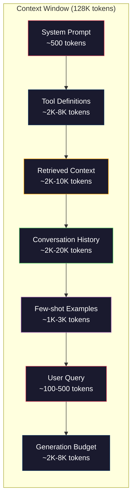
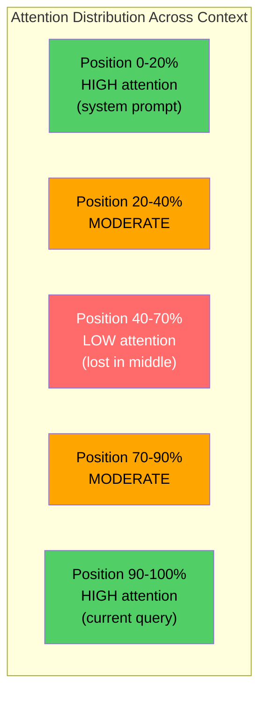
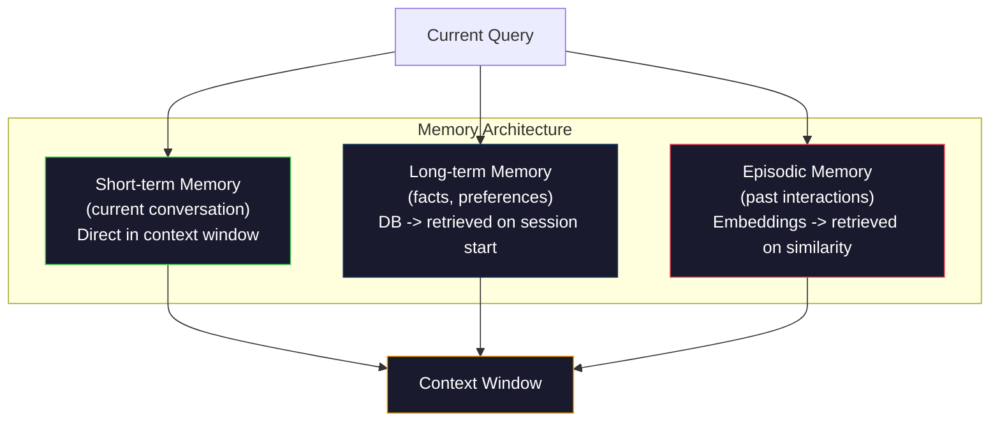

# 文本工程:Windows,预算,内存和检索.

> 提示工程是一个子集.语境工程是整个游戏.提示是你输入的字符串.背景是所有进入模型窗口的东西:系统说明,检索的文件,工具定义,对话历史,几次示例,以及提示本身.2026年最好的人工智能工程师是语境工程师.他们决定什么进去,什么留下,以及什么顺序.

> **【中文解读】**提示工程只是上下文工程的子集. 上下文工程管理模型窗口中的一切内容. 系统指令,检查文档,工具定义,对话历史等.

> **【拓展：上下文工程→Claude生态】**通过统一的协议管理模型实现了下文工程的标准.

>  **【前置】**学习节前请先掌握:(1) 阶段11·01-02(快速工程、少拍的CT);(2) 阶段11·04(嵌入式) 和阶段11·06(RAG) 理解检索如何取文档;(3) 代币 概念本节重度讨论代币 预算──如果不知道"200K文本窗口"指什么,先看10个阶段──

**Type:** Build | **类型:** 构建
**Languages:** Python | **语言:** Python
**Prerequisites:** Phase 10 (LLMs from Scratch), Phase 11 Lesson 01-02 | **前置知识:** Phase 10（从零理解 LLM）、Phase 11 Lesson 01-02
**Time:** ~90 minutes | **时间:** ~90 分钟
**Related:**阶段11 · 15 (即时缓存) 缓存友好的布局是文本工程的延伸.阶段5 · 28 (长文本评估) 如何测量中失的NIAH/RULER.**相关:**阶段11 · 15 (提示缓存) 缓存友好布局是上下文工程的延伸.

## 学习目标

- 计算所有语境窗口组件 (系统提示,工具,历史记录,检索文件,生成头空间) 的代币预算
  跨所有上下文窗口组件(系统提示、工具、历史、检索文档、生成余量) 计算代币 预算
- 实现文本窗口管理策略:截图,总结和对话历史滑动窗口
  实现上下文窗口管理策略:截截截,摘要,滑动窗口管理对话历史
- 优先考虑和排序文本组件,以最大限度地使模型关注最相关的信息
  按优先级排序下文组件,最大化模型对最相关的信息的关注
- 建立一个基于查询类型和可用窗口空间的语境组装器,
  根据查询类型和可用窗口空间动态分配代币的上下文组装器

> **【中文解读】**本课目标:超越快速工程,系统化管理进入模型上下文所有信息――在有限上下文窗口内放入最相关的信息是核心挑战――


## 问题 问题引入

克劳德·奥普斯 4.7 有200K的代币窗口 (1M在beta). GPT-5 有400K. 双子座 3 Pro 有2M. Llama 4 声称10M. 这些数字听起来很大,直到你填充它们.

> 克劳德·奥普斯 4.7 有200K的代币 窗口(beta 版 1M) ・GPT-5 有400K ・Gemini 3 Pro 有2M――这些数字听起来很大,直到你填满它们――

系统提示:500个代码. 50个工具的工具定义:8,000个代码. 获取的文档:4,000个代码. 对话历史 (10轮):6,000个代码. 当前用户查询:200个代码. 代码预算 (最大输出):4,000个代码. 总数: 22,700个代码. 这仅占128K窗口的18%.

> 这是一个编程助手的真实分解. 系统提示:500代币──50个工具定义:8,000代币──检索文档:4000代币──对话历史★10轮:6,000代币──当前查询:200代币──生成预算:4000代币──总计:22,700代币──这仅占128K窗口的18%.

>  **【类比】**上下文窗口像书桌面面200K代币 听起来很大,但放上"教科书(系统提示) "+"参考书(恢复文档) "+"草稿纸(历史) "+"计算器(工具) "就快满了。**Lost in the Middle**现象如找东西:书桌上摆满东西时,最容易被忽视的是中间堆的你只会注意桌面开头最近放的和结尾手边的.

> ️ **【易错点】**上下文管理的3个坑:(1) **历史无限增长**对话越长历史 越大,最终撞窗口;修复:用总结(每轮压缩成摘要) 或滑动窗口(只保留最近的 K 轮 + 第一轮) 』2)**工具定义重复发送**每次调用都把50个工具方案 全发一遍;修复:用快速缓存(阶段11·15),Claude / OpenAI 都支持,省90%成本──(3) **检索文档全塞**召回50个块 全塞快速 模型迷失;修复:上-5 高质量块 + 交叉编码重排――

但注意力并不是按照背景长度进行线性扩展. 一种拥有128K语境代币的模型在尼拉变压器中支付了四方形注意力成本 (O(n^2),尽管大多数生产模型使用高效的注意力变体. 更重要的是,检索的精度会降低. 模型在长文本中难以找到信息. 等人研究 (2023) 显示,在长文本开始和结束时,LLM几乎完全准确地获取信息,但在中间的信息 (文本中的位置为40-70%) 的准确度下降了10-20%. 这种"中途失落"效果因模型而异,但影响了所有当前的建筑.

> 但注意力不会随下文长度线性扩展. 更重要的是,检索准确率会下降. 大海捞针测试表明,模型难以找到放在长上下文中位置的信息.

实际的教训:拥有200K代币并不意味着使用200K代币是有效的.一个精心策划的10K代币背景通常比一个倾倒的100K代币背景更高. 语境工程是在语境窗口内最大化信号-噪音比率的学科.

> 实际教训:有200K代币可用并不意味着使用200K代币是有效的.精心策划的10K代币上下文通常比倾倒的100K代币上下文. 上下文工程在上下文窗口内最大化信噪比的学科.

每个你放入窗口的代币都会取代一个可能带有更多相关信息的代币. 每个无关的工具定义,每一个过时的对话转,每一个不回答问题的检索文本,

> 你放进窗口的每个代币都占据了一个可能带有更多相关信息的代币――每个不相关的工具定义――每个过往的对话轮――每个不回答的问题检查文本块――每个让模型在任务上有所变化――

## 概念的核心概念

> **【中文解读】**上下文工程 (上下文工程) 是超越即时工程的概念不仅仅是写好即时,而是系统化管理进入模型下文窗口的所有信息:检索结果,对话历史,工具输出,系统指令等.

> **【拓展：上下文窗口的有效利用】**据研究显示,模型对中间位置的信息"注意力下降" (注意力下降) 问题.


### 文本窗口是稀缺的资源

设想文本窗口是RAM,而不是磁盘. 它快速,直接访问,但有限. 你不能容纳一切. 你必须选择.

> 把上下文窗口想成RAM,不是磁盘.



每个组件都在争夺空间.添加更多工具定义意味着对话历史的空间减少.添加更多获取的文本意味着少量示例的空间.文本工程是分配这个预算的艺术,以最大限度地提高任务性能.

> 每个组件争抢空间――加更多工具定义意味着对话历史空间更少――加更多查询上下文意味着较少样本示例空间更少――上下文工程是分配这个预算以最大化任务性能的艺术――

### 迷失在中间

环境工程中最重要的实验发现.模型更好地关注文本的开始和结束时的信息.中间的信息获得了较低的注意力分数,更有可能被忽视.

> 上下文工程中最重要的实验发现――模型对上下文开端和结尾的信息的注意力更好――中部位置信息得到了较低的注意力分数,更容易被忽略――

等人 (2023) 系统地测试了这一点.他们将相关文件放在20个无关的文件中,并测量了答案的准确性.当相关文件是第一个或最后的时,准确性为85-90%.当它在中间时 (20个位置的10个),准确性下降到60-70%.

> 等 () 系统测试了这一现象. 相关文档将在20个不相关文档中放置在不同的位置,测量答案准确率.

这对工程业产生了直接影响:

> 这有直接的工程含义:

- 首先要把最重要的信息放在第一位 (系统提示,关键指令)
  将最重要信息放最前面 (系统提示,关键指令)
- 关键词: 关键词: 关键词: 关键词:
  将当前查询和最相关的下文放最后 (由于偏差有利)
- 处理环境中部为最低优先级区域
  将上下文中视为最低优先级区域
- 如果要在中间包含信息,最后重复关键点
  如果必须在中间放信息,在结尾重复关键点



### 文本组件

**System prompt**克劳德代码使用大约6,000个代币用于系统提示,包括工具定义和行为说明.保持紧密.系统提示中的每个字都在每个API调用中重复.

> **系统提示**设定个性,约束和行为规则――放最前面和跨轮次保持不变――克劳德代码的系统提示约有6,000个代币,包含工具定义和行为指令――保持紧――系统提示中每个词在每次API调用中重复――

**Tool definitions**每个工具都会添加50-200个代币 (名称,描述,参数方案).每一个50个代币的50个工具在任何对话发生之前,每个代币都会达到7,500个代币.

> **工具定义**工具的选择只包含与当前查询相关的工具,可减少60至80%──

**Retrieved context**检索的质量直接决定了响应的质量. 检索不良比没有检索更糟糕 - - 它会填满窗口的噪音,并积极误导模型.

> **检索上下文**检查质量直接决定响应质量. 坏检查比不检查更糟. 它用噪音填满窗口并主动误导模型.

**Conversation history**交换时间:每次用户消息和助理响应. 交谈长度随着交谈时间的推移而增长. 每次交换时50次交谈的200个代币相当于10,000个历史代币. 大多数是与当前查询无关的.

> **对话历史**随着对话长度的线性增长,对话的50轮每轮200个代币,即10,000个代币.

**Few-shot examples**输入/输出对,证明所需的行为. 两到三个精心选择的例子通常会提高输出质量,超过数千个指令代币.

> **少样本示例**演示期望行为输入/输出对──2-3个精心挑选的示例往往比数千个代币的指令更能提高输出质量──但它们耗费空间──

**Generation budget**模型的代币为模型的响应保留. 如果填充到容量的窗口,模型就没有答案的空间. 储备至少2000至4,000代币用于生成.

> **生成预算**模型没有空间回答. 至少保留2000至4000个用于生成的代币.

### 环境压缩策略

**History summarization**总结对话的时间: "我们讨论了X,决定了Y,用户想要Z"在100代币中取代了2000代币的10次转换. 运行总结时历史超过门 (例如5000代币).

> **历史摘要**没有逐字保留所有前序轮次,定期总结对话――"我们讨论了X,决定Y,用户想要Z"用100个代币 替换10轮2000个代币――当历史超过值(如5,000个代币)时运行摘要――

**Relevance filtering**您的文件在一个门以下. 如果您检索了10个块,但只有3个是相关的,则丢弃其他7.比10个中等的部分更好有3个非常相关的块.

> **相关性过滤**查询文件和当前查询分分,丢弃低于值的.

**Tool pruning**编码问题不需要日历工具.编程问题不需要文件系统工具. 这可以将工具定义从8,000个代币降至1,000个.

> **工具裁剪**编码问题不需要日历工具.日程安排问题不需要文件系统工具.

**Recursive summarization**首先要总结每个部分,然后要总结.一个50页的文档变成一个500个代币的摘要,捕捉到关键点.

> **递归摘要**对于超长文档,分阶段总结――先总结每节,再总结摘要――50页文档变成500个代币的摘要,捕获关键点――

### 记忆系统

文本工程跨越了三个时间视野.

> 上下文工程跨越三个时间尺度.

**Short-term memory**直接存储在文本窗口中.随着每次转折而增长.通过总结和缩短来管理.

> **短期记忆**通过摘要和截截图管理.

**Long-term memory**文件:在对话中持续存在的事实和偏好. "用户更喜欢TypeScript". "项目使用PostgreSQL."存储在数据库中,在会议开始时获取.Claude Code将这些存储在CLAUDE.md文件中.ChatGPT将其存储在其内存功能中.

> **长期记忆**通过"用户偏好TypeScript"",项目使用PostgreSQL"",存储在数据库中,会话开始检查时.

**Episodic memory**通过"Auth"模块调试了类似的问题. 存储为嵌入式,当当前对话与过去事件匹配时获取.

> **情景记忆**其他类型的对话与过去情景相匹配的检索.



### 动态语境组件

关键见解:不同的查询需要不同的语境.静态系统提示 +静态工具 +静态历史是浪费的.最好的系统每一个查询动态组装语境.

> 关键洞察:不同查询需要不同上下文──静态系统提示 + 静态工具 + 静态历史是浪费──最好的系统按查询动态组装上下文──

1. 分类查询意图
   分类查询意图
2. 选择相关工具 (不是所有工具)
   选择相关工具 (不是全部工具)
3. 检索相关文件 (不是固定集)
   检索相关文档(不是固定集合)
4. 包含相关历史转折 (不是全部历史)
   包含相关历史轮次 (不是全部历史)
5. 添加与任务类型相匹配的几次示例
   添加与任务类型相匹配的少量样本示例
6. 按重要点排序:最先关键,最后重要,中间是可选的
   按重要性排序:关键在前,重要在后,可选在中间

这就是区分一个好的人工智能应用程序和一个伟大的应用程序的原因.

> 这就是区分优秀AI应用与卓越AI应用的关键.

## 建立它,实现它.
```figure
lost-in-the-middle
```

## 建立它

### 步骤1: 代币计数器

构建一个简单的代币计数 (使用白空分数的近似,因为确切的计数取决于代币表).

> 你不能为无法测量的事情做预算. 构建简单的代币计数器.

```python
import json
import numpy as np
from collections import OrderedDict

def count_tokens(text):
    if not text:
        return 0
    return int(len(text.split()) * 1.3)

def count_tokens_json(obj):
    return count_tokens(json.dumps(obj))
```

### 步骤2: 环境预算管理员

预算管理员会追踪每个组件使用多少代币,并执行限制.

> 核心抽象――预算管理器追踪每个组件使用多少代币并强制限制制――

```python
class ContextBudget:
    def __init__(self, max_tokens=128000, generation_reserve=4000):
        self.max_tokens = max_tokens
        self.generation_reserve = generation_reserve
        self.available = max_tokens - generation_reserve
        self.allocations = OrderedDict()

    def allocate(self, component, content, max_tokens=None):
        tokens = count_tokens(content)
        if max_tokens and tokens > max_tokens:
            words = content.split()
            target_words = int(max_tokens / 1.3)
            content = " ".join(words[:target_words])
            tokens = count_tokens(content)

        used = sum(self.allocations.values())
        if used + tokens > self.available:
            allowed = self.available - used
            if allowed <= 0:
                return None, 0
            words = content.split()
            target_words = int(allowed / 1.3)
            content = " ".join(words[:target_words])
            tokens = count_tokens(content)

        self.allocations[component] = tokens
        return content, tokens

    def remaining(self):
        used = sum(self.allocations.values())
        return self.available - used

    def utilization(self):
        used = sum(self.allocations.values())
        return used / self.max_tokens

    def report(self):
        total_used = sum(self.allocations.values())
        lines = []
        lines.append(f"Context Budget Report ({self.max_tokens:,} token window)")
        lines.append("-" * 50)
        for component, tokens in self.allocations.items():
            pct = tokens / self.max_tokens * 100
            bar = "#" * int(pct / 2)
            lines.append(f"  {component:<25} {tokens:>6} tokens ({pct:>5.1f}%) {bar}")
        lines.append("-" * 50)
        lines.append(f"  {'Used':<25} {total_used:>6} tokens ({total_used/self.max_tokens*100:.1f}%)")
        lines.append(f"  {'Generation reserve':<25} {self.generation_reserve:>6} tokens")
        lines.append(f"  {'Remaining':<25} {self.remaining():>6} tokens")
        return "\n".join(lines)
```

### 步骤3: 失落的中部重组

实施重组策略:最重要的项目首先和最后,最不重要的项目在中间.

> 实现重排策略:最重要项放最前和最后,最不重要项放中.

```python
def reorder_lost_in_middle(items, scores):
    paired = sorted(zip(scores, items), reverse=True)
    sorted_items = [item for _, item in paired]

    if len(sorted_items) <= 2:
        return sorted_items

    first_half = sorted_items[::2]
    second_half = sorted_items[1::2]
    second_half.reverse()

    return first_half + second_half

def score_relevance(query, documents):
    query_words = set(query.lower().split())
    scores = []
    for doc in documents:
        doc_words = set(doc.lower().split())
        if not query_words:
            scores.append(0.0)
            continue
        overlap = len(query_words & doc_words) / len(query_words)
        scores.append(round(overlap, 3))
    return scores
```

### 步骤4:对话历史压缩机

总结一下,老话语回归,回归代币预算.

> 总结旧对话轮次以收回标志 预算.

```python
class ConversationManager:
    def __init__(self, max_history_tokens=5000):
        self.turns = []
        self.summaries = []
        self.max_history_tokens = max_history_tokens

    def add_turn(self, role, content):
        self.turns.append({"role": role, "content": content})
        self._compress_if_needed()

    def _compress_if_needed(self):
        total = sum(count_tokens(t["content"]) for t in self.turns)
        if total <= self.max_history_tokens:
            return

        while total > self.max_history_tokens and len(self.turns) > 4:
            old_turns = self.turns[:2]
            summary = self._summarize_turns(old_turns)
            self.summaries.append(summary)
            self.turns = self.turns[2:]
            total = sum(count_tokens(t["content"]) for t in self.turns)

    def _summarize_turns(self, turns):
        parts = []
        for t in turns:
            content = t["content"]
            if len(content) > 100:
                content = content[:100] + "..."
            parts.append(f"{t['role']}: {content}")
        return "Previous: " + " | ".join(parts)

    def get_context(self):
        parts = []
        if self.summaries:
            parts.append("[Conversation Summary]")
            for s in self.summaries:
                parts.append(s)
        parts.append("[Recent Conversation]")
        for t in self.turns:
            parts.append(f"{t['role']}: {t['content']}")
        return "\n".join(parts)

    def token_count(self):
        return count_tokens(self.get_context())
```

### 步骤5:动态工具选择器

仅包括与当前查询相关的工具. 分类意图,然后过.

> 只有包含与当前查询相关的工具.

```python
TOOL_REGISTRY = {
    "read_file": {
        "description": "Read contents of a file",
        "tokens": 120,
        "categories": ["code", "files"],
    },
    "write_file": {
        "description": "Write content to a file",
        "tokens": 150,
        "categories": ["code", "files"],
    },
    "search_code": {
        "description": "Search for patterns in codebase",
        "tokens": 130,
        "categories": ["code"],
    },
    "run_command": {
        "description": "Execute a shell command",
        "tokens": 140,
        "categories": ["code", "system"],
    },
    "create_calendar_event": {
        "description": "Create a new calendar event",
        "tokens": 180,
        "categories": ["calendar"],
    },
    "list_emails": {
        "description": "List recent emails",
        "tokens": 160,
        "categories": ["email"],
    },
    "send_email": {
        "description": "Send an email message",
        "tokens": 200,
        "categories": ["email"],
    },
    "web_search": {
        "description": "Search the web for information",
        "tokens": 140,
        "categories": ["research"],
    },
    "query_database": {
        "description": "Run a SQL query on the database",
        "tokens": 170,
        "categories": ["code", "data"],
    },
    "generate_chart": {
        "description": "Generate a chart from data",
        "tokens": 190,
        "categories": ["data", "visualization"],
    },
}

def classify_intent(query):
    query_lower = query.lower()

    intent_keywords = {
        "code": ["code", "function", "bug", "error", "file", "implement", "refactor", "debug", "test"],
        "calendar": ["meeting", "schedule", "calendar", "appointment", "event"],
        "email": ["email", "mail", "send", "inbox", "message"],
        "research": ["search", "find", "what is", "how does", "explain", "look up"],
        "data": ["data", "query", "database", "chart", "graph", "analytics", "sql"],
    }

    scores = {}
    for intent, keywords in intent_keywords.items():
        score = sum(1 for kw in keywords if kw in query_lower)
        if score > 0:
            scores[intent] = score

    if not scores:
        return ["code"]

    max_score = max(scores.values())
    return [intent for intent, score in scores.items() if score >= max_score * 0.5]

def select_tools(query, token_budget=2000):
    intents = classify_intent(query)
    relevant = {}
    total_tokens = 0

    for name, tool in TOOL_REGISTRY.items():
        if any(cat in intents for cat in tool["categories"]):
            if total_tokens + tool["tokens"] <= token_budget:
                relevant[name] = tool
                total_tokens += tool["tokens"]

    return relevant, total_tokens
```

### 步骤 6: 完整的环境组合管道

根据查询,动态组装最佳的文本.

> 给定查询,动态组装最优上下文.

```python
class ContextEngine:
    def __init__(self, max_tokens=128000, generation_reserve=4000):
        self.budget = ContextBudget(max_tokens, generation_reserve)
        self.conversation = ConversationManager(max_history_tokens=5000)
        self.system_prompt = (
            "You are a helpful AI assistant. You have access to tools for "
            "code editing, file management, web search, and data analysis. "
            "Use the appropriate tools for each task. Be concise and accurate."
        )
        self.knowledge_base = [
            "Python 3.12 introduced type parameter syntax for generic classes using bracket notation.",
            "The project uses PostgreSQL 16 with pgvector for embedding storage.",
            "Authentication is handled by Supabase Auth with JWT tokens.",
            "The frontend is built with Next.js 15 using the App Router.",
            "API rate limits are set to 100 requests per minute per user.",
            "The deployment pipeline uses GitHub Actions with Docker multi-stage builds.",
            "Test coverage must be above 80% for all new modules.",
            "The codebase follows the repository pattern for data access.",
        ]

    def assemble(self, query):
        self.budget = ContextBudget(self.budget.max_tokens, self.budget.generation_reserve)

        system_content, _ = self.budget.allocate("system_prompt", self.system_prompt, max_tokens=1000)

        tools, tool_tokens = select_tools(query, token_budget=2000)
        tool_text = json.dumps(list(tools.keys()))
        tool_content, _ = self.budget.allocate("tools", tool_text, max_tokens=2000)

        relevance = score_relevance(query, self.knowledge_base)
        threshold = 0.1
        relevant_docs = [
            doc for doc, score in zip(self.knowledge_base, relevance)
            if score >= threshold
        ]

        if relevant_docs:
            doc_scores = [s for s in relevance if s >= threshold]
            reordered = reorder_lost_in_middle(relevant_docs, doc_scores)
            doc_text = "\n".join(reordered)
            doc_content, _ = self.budget.allocate("retrieved_context", doc_text, max_tokens=3000)

        history_text = self.conversation.get_context()
        if history_text.strip():
            history_content, _ = self.budget.allocate("conversation_history", history_text, max_tokens=5000)

        query_content, _ = self.budget.allocate("user_query", query, max_tokens=500)

        return self.budget

    def chat(self, query):
        self.conversation.add_turn("user", query)
        budget = self.assemble(query)
        response = f"[Response to: {query[:50]}...]"
        self.conversation.add_turn("assistant", response)
        return budget


def run_demo():
    print("=" * 60)
    print("  Context Engineering Pipeline Demo")
    print("=" * 60)

    engine = ContextEngine(max_tokens=128000, generation_reserve=4000)

    print("\n--- Query 1: Code task ---")
    budget = engine.chat("Fix the bug in the authentication module where JWT tokens expire too early")
    print(budget.report())

    print("\n--- Query 2: Research task ---")
    budget = engine.chat("What is the best approach for implementing vector search in PostgreSQL?")
    print(budget.report())

    print("\n--- Query 3: After conversation history builds up ---")
    for i in range(8):
        engine.conversation.add_turn("user", f"Follow-up question number {i+1} about the implementation details of the system")
        engine.conversation.add_turn("assistant", f"Here is the response to follow-up {i+1} with technical details about the architecture")

    budget = engine.chat("Now implement the changes we discussed")
    print(budget.report())

    print("\n--- Tool Selection Examples ---")
    test_queries = [
        "Fix the bug in auth.py",
        "Schedule a meeting with the team for Tuesday",
        "Show me the database query performance stats",
        "Search for best practices on error handling",
    ]

    for q in test_queries:
        tools, tokens = select_tools(q)
        intents = classify_intent(q)
        print(f"\n  Query: {q}")
        print(f"  Intents: {intents}")
        print(f"  Tools: {list(tools.keys())} ({tokens} tokens)")

    print("\n--- Lost-in-the-Middle Reordering ---")
    docs = ["Doc A (most relevant)", "Doc B (somewhat relevant)", "Doc C (least relevant)",
            "Doc D (relevant)", "Doc E (moderately relevant)"]
    scores = [0.95, 0.60, 0.20, 0.80, 0.50]
    reordered = reorder_lost_in_middle(docs, scores)
    print(f"  Original order: {docs}")
    print(f"  Scores:         {scores}")
    print(f"  Reordered:      {reordered}")
    print(f"  (Most relevant at start and end, least relevant in middle)")
```

## 用它实现框架

### 带管理的环境

克劳德代码使用层次方法管理文本.系统提示包含行为规则和工具定义 (~6K代币).当您打开文件时,其内容被注入为文本.当您搜索时,结果被添加.旧对话转换总结.CLAUDE.md提供长期内存,持续在整个会议中.

> 克劳德代码 用分层方法管理上下文──系统提示包含行为规则和工具定义──约6K代币)──打开文件时其内容注入下文──搜索时结果被添加──旧对话轮次被摘要──CLAUDE.md 提供跨会话持久的长期记忆──

关键的工程决定:Claude Code不把整个代码库放入文本中. 它在需求上检索相关文件.

> 关键工程决策:克劳德代码不把整个代码库倾倒进下文.

### 库尔索动态文本载荷
### 动态文本加载

库尔索将整个代码库索引成嵌入式.当你输入查询时,它会使用向量相似性检索最相关的文件和代码块.只有这些块进入文本窗口. 500K 行的代码库被压缩成5到10个最相关的代码块.

> 库尔多将整个代码库索引嵌入. 输入查询时,使用向量相似度查询最相关的文件和代码块.

现在,我们需要的东西,

> 这就是模式: 嵌入一切,按需检查,只包含重要.

### 聊GPT 记忆
### 长期记忆助理

聊天GPT将用户的偏好和事实存储为长期内存.每次对话开始,相关的记忆都会被检索到系统提示中. "用户更喜欢Python"的代价为5个代币,但在对话中保存了数百个重复指令的代币.

> 聊天GPT将用户偏好和事实存储为长期记忆. 每次对话开始,相关记忆被检查并包含在系统提示中.

### 作为文本工程的RAG

复苏增强的生成是文本工程正式化. 您在查询时检索相关文件,并将它们注入文本窗口. 整个RAG管道-- 碎片化,嵌入,检索,重新排名-- 存在于解决一个问题:将正确的信息放入文本窗口.

> 检索增强生成是上下文工程的形式化――不把知识塞进模型权重 (训练) 或系统提示 (系统提示) ),而在查询时检索相关文档并注入下文窗口――整个RAG管线分块、嵌入、检索、重排存在就是为了解决一个问题:把正确信息放入下文窗口――

## 运送它.

这一课产生了`outputs/prompt-context-optimizer.md`-- 复用提示,审计一个语境组装策略并建议优化. 给它提供系统提示,工具数量,平均历史长度和检索策略,

> 本课产出发 `outputs/prompt-context-optimizer.md`审计上下文组装策略并推优化可复用提示.把系统提示,工具数,平均历史长度和检查策略给它,它识别标志 浪费并建议改进.

它还产生了`outputs/skill-context-engineering.md`--基于任务类型,背景窗口大小和延迟预算的决策框架.

> 同时产出`outputs/skill-context-engineering.md`基于任务类型,下文窗口大小和延迟预算设计下文组装管线的决策框架.

## 练习题

1. 加入一个"代币废物检测器"到 ContextBudget类. 它应该标记使用超过30%的预算的组件,并建议针对每个组件类型的压缩策略 (概括历史,剪切工具,重新排名文件).
   给 ContextBudget 添加"代码浪费检测器"――应标记使用超过30%的预算组件,并建议针对每个组件类型的压缩策略 (摘要历史,剪裁工具,重排文档)

2. 实现检索文本的语义排序.如果两个检索文档80%以上相似 (通过词汇重叠或嵌入式相似性),只保留更高分数的文本.测量这项文本的恢复额.
   实现检索上下文的语义去重重──若两个检索文档超过80%相似之处,只保留比分数更高的──测量它收回了多少代币的预算──

3. 建立一个"语境重播"工具. 给出对话转录,通过语境引擎重播它,并可视化预算分配如何随时变化. 随着时间的推移,绘制每个组件的代币使用情况. 确定文本开始压缩的转折.
   构建"上下文回放"工具――给定对话转录,通过 ContextEngine 回放并可视化预算分配如何轮次变化――绘制每个组件随时间的标志――使用――识别上下文开始被压缩的轮次――

4. 实现基于优先级的工具选择器. 取而代之的是,将每个工具分配到当前查询中的相关性分数. 包含工具在下降相关性顺序中,直到工具预算被耗尽. 与 5, 10, 20 和 50 个工具的任务性能进行比较.
   实现基于优先级的工具选择器――非二元包含/排除,而是给每个工具对当前查询的相关性打分――按相关性降低包含工具的序列直到工具预算耗尽――比较包含5、10、20、50个工具时任务性能――

5. 建立一个多策略背景压缩机. 实施三种压缩策略 (缩小,总结,取取出关键句子) 并根据20份文件进行比较. 测量压缩比和信息保留之间的权衡 (压缩版本是否仍然包含查询答案?).
   构建多策略上下文压缩机.实现三种压缩策略. 截断,摘要,关键句提取.

## 关键词 快速查找表

| Term | What people say | What it actually means | 中文释义 |
|------|----------------|----------------------|---------|
| Context window | "How much the model can read" | The maximum number of tokens (input + output) the model processes in a single forward pass -- 400K for GPT-5, 200K (1M beta) for Claude Opus 4.7, 2M for Gemini 3 Pro | 上下文窗口：模型单次前向传播处理的最大 token 数（输入+输出）|
| Context engineering | "Advanced prompt engineering" | The discipline of deciding what goes into the context window, in what order, and at what priority -- encompasses retrieval, compression, tool selection, and memory management | 上下文工程：决定什么进入上下文窗口、什么顺序、什么优先级的学科——包含检索、压缩、工具选择、记忆管理 |
| Lost-in-the-middle | "Models forget stuff in the middle" | Empirical finding that LLMs attend better to the beginning and end of context, with 10-20% accuracy drop for information placed in the middle | 中间丢失：LLM 对上下文开头和结尾注意力更好的实证发现；中间位置准确率下降 10-20% |
| Token budget | "How many tokens you have left" | An explicit allocation of context window capacity across components (system prompt, tools, history, retrieval, generation) with per-component limits | token 预算：跨组件的上下文窗口容量显式分配（系统提示、工具、历史、检索、生成）带每组件限制 |
| Dynamic context | "Loading stuff on the fly" | Assembling the context window differently for each query based on intent classification, relevant tool selection, and retrieval results | 动态上下文：基于意图分类、相关工具选择和检索结果，为每个查询不同地组装上下文窗口 |
| History summarization | "Compressing the conversation" | Replacing verbatim old conversation turns with a concise summary, reducing token cost while preserving key information | 历史摘要：用简洁摘要替代逐字旧对话轮次，减少 token 成本同时保留关键信息 |
| Tool pruning | "Only including relevant tools" | Classifying query intent and only including tool definitions that match, reducing tool token cost by 60-80% | 工具裁剪：分类查询意图只包含匹配的工具定义，减少工具 token 成本 60-80% |
| Long-term memory | "Remembering across sessions" | Facts and preferences stored in a database and retrieved at session start -- CLAUDE.md, ChatGPT Memory, and similar systems | 长期记忆：跨会话存储在数据库并在会话开始时检索的事实和偏好——CLAUDE.md、ChatGPT Memory 等 |
| Episodic memory | "Remembering specific past events" | Past interactions stored as embeddings and retrieved when the current query is similar to a past conversation | 情景记忆：作为嵌入存储的过去交互，当前查询相似时检索 |
| Generation budget | "Room for the answer" | Tokens reserved for the model's output -- if the context fills the window completely, the model has no room to respond | 生成预算：为模型输出保留的 token——若上下文填满窗口，模型没有空间响应 |

## 继续阅读 继续阅读

- [Liu et al., 2023 -- "Lost in the Middle: How Language Models Use Long Contexts"](https://arxiv.org/abs/2307.03172)模型在长时间的背景下与信息扎
  等,"中途失落" (2023) 位置相关注意力权威研究,表明模型难以处理长上下文中途信息
- [Anthropic's Contextual Retrieval blog post](https://www.anthropic.com/news/contextual-retrieval)-- 如何让人类对文本意识的部分检索进行处理,
  人类 上下文检索博客人类 如何处理下文感知分块检索,将检索失败减少49%
- [Simon Willison's "Context Engineering"](https://simonwillison.net/2025/Jun/27/context-engineering/)-- 博客文章命名了该学科,
  赛蒙·威利森的"文本工程"命名该学科并区分它与提示工程的博文
- [LangChain documentation on RAG](https://python.langchain.com/docs/tutorials/rag/)-- 实际实施以检索增强发电作为文本工程模式
  长链RAG 文档将检索增强生成作为上下文工程模式的实用实现
- [Greg Kamradt's Needle in a Haystack test](https://github.com/gkamradt/LLMTest_NeedleInAHaystack)-- 标志显示所有主要模型中存在位置依赖的检索失败
  格雷格·卡马拉德的大海捞针测试揭示所有主要模型位置相关检查失败的基准
- [Pope et al., "Efficiently Scaling Transformer Inference" (2022)](https://arxiv.org/abs/2211.05102)背景长度为什么驱动内存和延迟,以及KV缓存,MQA和GQA如何改变预算计算.
  普等"高效扩展变压器推理" (2022) 如何改变预算计算?
- [Agrawal et al., "SARATHI: Efficient LLM Inference by Piggybacking Decodes with Chunked Prefills" (2023)](https://arxiv.org/abs/2308.16369)两个期的推断,使得长时间的提示在TTFT中昂贵,但在TPOT中便宜;
  现在,我在博中说,我在博中说,我在博中说,我在博中说,我在博中说,我在博中说,我在博中说,我在博中说,我在博中说,我在博中说,我在博中说,我在博中说,我在博中说,我在博中说,我在博中说,我在博中说,我在博中说,我在博中说,我在博中说,我在博中说,我在博中说,我在博中说,我在博中说,我在博中说,我在博中说,我在博中说,我在博中说,我在博中说,我在博中说,我在博中说,我说,我在博的真相反,我在博的真相反,我说.
- [Ainslie et al., "GQA: Training Generalized Multi-Query Transformer Models from Multi-Head Checkpoints" (EMNLP 2023)](https://arxiv.org/abs/2305.13245)通过集成的查询注意力纸, 无损质量, 切断了生产解码器中的KV内存8倍.
  分组查询注意力论文,在生产解码器中将KV内存减少8倍而无质量损失.
