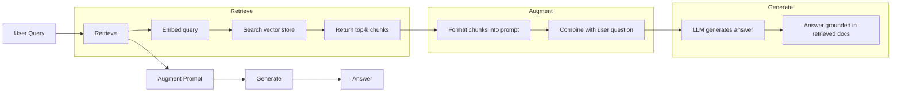
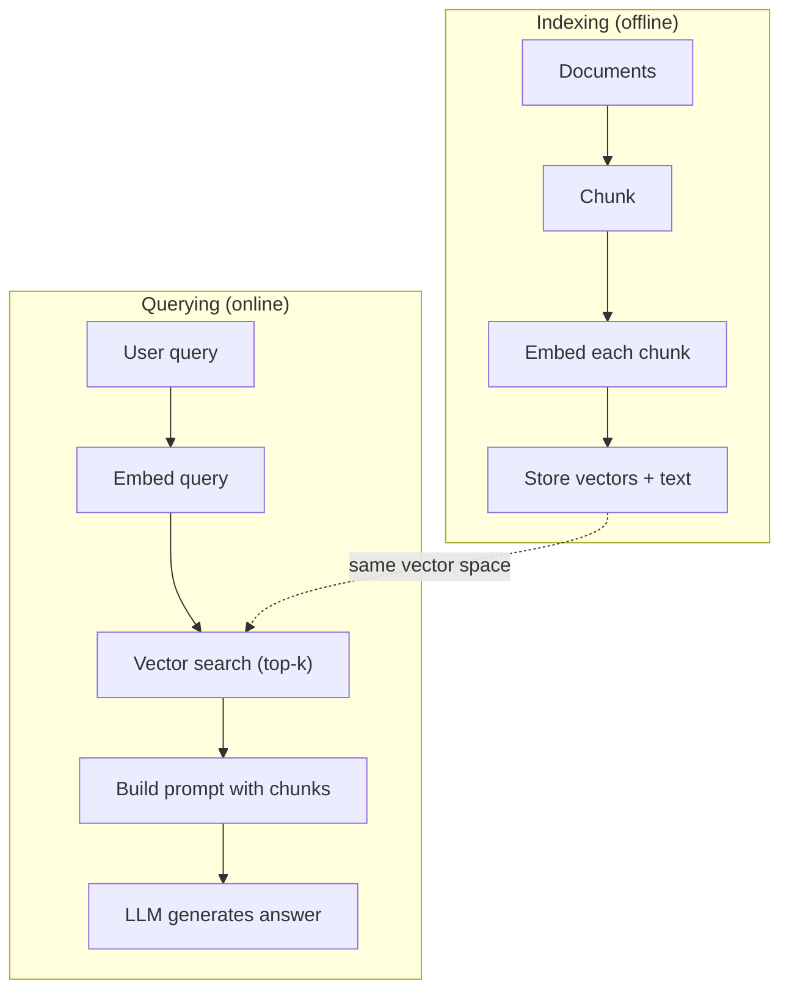

# 检索增强生成

> 你的LLM知道一切,直到培训截止.它不知道任何关于你的公司的文件,你的代码库,或上周会议笔记.RAG通过检索相关文件和填充它们在提示中解决了这一问题.这是生产人工智能最广泛的模式.如果你从这个课程中构建一个东西,构建一个RAG管道.

> **【中文解读】**通过查询相关文档并注入提示来弥补知识缺陷.这是生产环境部署最广泛的人工智能模式.

> **【拓展：RAG→企业AI应用】**据了解,RAG是企业落地AI的首选方案:知识库问答,合同审查,技术文档助理,金融研究报道分析等场景都依赖RAG管道.

>  **【前置】**学本节前请先掌握:(1) 阶段11·04(嵌入式) 理解向量空间、相似度、HNSW;(2) 阶段05·23(缩策略) 理解文档切分;(3) 阶段10(LLM从零开始) 理解提示 如何影响生成──本节会用到`chromadb`或`faiss`,我知道.`langchain`或`llamaindex`,我知道.

**Type:** Build | **类型:** 构建
**Languages:** Python | **语言:** Python
**Prerequisites:** Phase 10 (LLMs from Scratch), Phase 11 Lessons 01-05 | **前置知识:** Phase 10（从零理解 LLM）、Phase 11 Lesson 01-05
**Time:** ~90 minutes | **时间:** ~90 分钟
**Related:**阶段5 · 23 (RAG的缩减策略) 六个缩减算法和当每个算法获胜时.阶段5 · 22 (嵌入模型深度潜水) 选择嵌入器.阶段11 · 07 (高级RAG) 混合搜索,重新排名和查询转换.**相关:**阶段 5 · 23(RAG 分块策略) 介绍六种分块算法及各自适用场景――阶段 5 · 22(嵌入模型深度解析) 介绍如何选择嵌入器――阶段 11 · 07(高级RAG)介绍混合搜索、重排和查询转换――

## 学习目标

- 构建完整的RAG管道:文件加载,分块化,嵌入,向量存储,检索和生成
  构建完整的RAG管线:文档加载,分块,嵌入,向量存储,检索,生成
- 执行使用向量数据库 (ChromaDB, FAISS或Pinecone) 的语义搜索,并进行适当的索引
  用向量数据库(ChromaDB、FAISS 或 Pinecone)实现语义搜索并正确索引
- 解释为什么RAG优先于基于知识的应用程序的细节调整 (成本,新鲜性,归因)
  解释为什么知识接地应用更好于RAG而不是微调(成本、新鲜度、归因)
- 通过检索指标 (精度,召回) 和生成指标 (忠实性,相关性) 评估RAG质量
  用检索指标 (准确性,回忆) 和生成指标 (忠实性,相关性) 评估RAG质量

> **【中文解读】**本课目标:实现完整的RAG (检查增强生成) 管线文档切分,嵌入生成,向量检查,上下文注入,答案生成.RAG是解决LLM知识时效和幻觉问题的主流方案.


## 问题 问题引入

公司的客户问:"企业计划的退款政策是什么?"LLM回答了一个关于典型的SaaS退款政策的通用答案.实际的政策,埋在一个200页的内部维基,说企业客户获得60天的退款窗口.LLM从未见过这个文件.它不能知道它没有接受培训的内容.

> 你为公司构建了一个聊天机器人.客户问"企业版退款政策是什么?"LLM 给出关于典型的SaaS退款政策的一般答案.实际政策藏在200页的内部维基中,说企业客户有60天窗口期并按比例退款.LLM从未见过这个文档.

调整是一个解决方案. 拿下LLM,训练它在你的内部文件上,并部署更新模型. 这种方法有效,但有严重的问题.调整成本数千美元的计算. 模型变得陈旧一旦文件改变. 你没有办法知道模型来源. 如果公司下个月收购了另一个产品线,你再次调整.

> 微调是一种解决方案.但是微调需要数千美元的计算成本. 文件变化模型已经过时了.

另一种解决方案是RAG. 让模型保持无损. 当一个问题出现时,请搜索文件库中相关段落,将它们粘贴在问题前的提示符中, 文件库可以在几分钟内更新. 您可以看到哪些文件被检索出来. 模型本身永远不会改变. 这就是为什么RAG是生产中的主导模式:它更便宜,更新鲜,更可审计,

> RAG是另一种解决方案. 保持模型不变. 当问题出现时,搜索您的文档存储库找到相关段落,将它们粘贴在提示中问题前面,让模型使用这些段落作为上下文来回答. 这就是为什么RAG是生产中的主流模式:更便宜,更新,更可审计,适用于任何 LLM.

>  **【类比】**拉格像开卷考试:学生(LLM) 不必把所有的课本背下来(细节调整),而是带一本笔记本(向量库)进场。考题一来,先翻笔记本找相关章节(检索),把翻到的几页摊开桌上(增长),然后看这些章节答题(生成) ・换教材时(知识更新) 只需要重印笔记本,不用让学生重学四年。

## 概念的核心概念

> **【中文解读】**基于检查结果生成答案. 基于检查结果生成答案. 基于检查结果生成答案. 基于检查结果生成答案.

> **【拓展：RAG 的生产实践】**典型RAG管线:文档切分(chunking) 到嵌入生成到向量存储(Pinecone/Weaviate/Chroma) 到相似度检索到重排序(重排) 到注入提示──LlamaIndex 和 LangChain是最流行的RAG框架──Meta的研究显示RAG在知识密集型任务上将准确率提高30-50%.


### 红色电气模式

整个模式是四个步骤:

> 整个模式就在四步:



查询 -> 检索 -> 增强提示 -> 生成.每个RAG系统都遵循这个模式.生产RAG系统之间的区别在于每个步骤的细节:你如何分块,如何嵌入,如何搜索,以及如何构建提示.

> 查询 -> 检索 -> 增强提示 -> 生成──每个RAG系统都遵循这个模式──生产RAG系统的差异在每个步骤的细节:如何分块、如何嵌入、如何搜索、如何构建提示──

>  **【困惑】**问:为什么不直接把整个文档装进快速?现在克劳德有200万上下文窗口,装得下吧?**精度下降**研究显示(如"迷失中",等人2023),LLM 在长上下文中召回中文内容的能力显著下降,超过32K 后准确率掉下20%+;(2) **成本爆炸**200万代币输入约$3/查询，而 RAG 检索 top-5 块只占 2K tokens（$其他国家**响应慢**长快速 推理延迟数倍于短快点――RAG 用精准检索换全量加载――

### 为什么RAG比调整更好

| Concern | Fine-tuning | RAG |
|---------|------------|-----|
| Cost / 成本 | $1,000-$100,000+ per training run / 每训练 1K-100K+ 美元 | $0.01-$0.10 per query (embedding + LLM) / 每查询 0.01-0.10 美元 |
| Freshness / 新鲜度 | Stale until retrained / 重训前都过时 | Updated in minutes by re-indexing docs / 重新索引文档即可在几分钟内更新 |
| Auditability / 可审计性 | Cannot trace answer to source / 无法追溯答案来源 | Can show exact retrieved passages / 可显示精确检索段落 |
| Hallucination / 幻觉 | Still hallucinates freely / 仍自由幻觉 | Grounded in retrieved documents / 基于检索文档接地 |
| Data privacy / 数据隐私 | Training data baked into weights / 训练数据固化在权重中 | Documents stay in your vector store / 文档留在你的向量存储中 |

调整将模型的重量永久改变.RAG暂时改变模型的背景.对于大多数应用程序,临时背景是你想要的.

> 微调永久改变模型权重――RAG 临时改变模型上下文――对大多数应用,临时上下文就是你要的――

只有在调整细节的情况下,你需要模型采用特定的风格,语调或推理模式,而不能仅通过提示实现.

> 微调胜的唯一情况:当你需要模型采用特定风格,语气或推理模式时,这是仅靠提示无法实现的.

> ️ **【易错点】**现在,我们在一个地方,**切分粒度错误**块太大(> 1024代币) 嵌入被稀释召回不到,块太小(< 64代币) 丢失上下文;起点:256-512代币 + 50 重叠──(2) **没做 query 改写**用户问"它怎么用?"指代不明,向量库找不到;修复:先用LLM把问题改写成包含上下文的完整查询――(3) **只看召回率不看准确率**顶-10 召回90%但只有3条相关,模型被噪音干扰幻觉;加交叉编码重排到顶-3 高质量块――

### 嵌入模型

嵌入模型将文本转换为密集的向量.类似的文本在这个高维空间中产生密集的向量. "我如何重置密码?"和"我需要更改密码"虽然分享了几个字,但几乎相同的向量. "猫坐在床上"产生了非常不同的向量.

> 嵌入模型将文本转换为密向量――类似文本在这个高维空间产生接近的向量――"如何重新置密码?"和"我需要修改密码"尽管共享单词不多,但产生几乎相同的向量――"猫坐在子上"产生截然不同的向量――

常见嵌入型号 (2026年排列  查看第5阶段 · 22 详细分析):

> 常见嵌入模型(2026年阵容完整分析见5期 · 22期):

| Model | Dimensions | Provider | Notes |
|-------|-----------|----------|-------|
| text-embedding-3-small | 1536 (Matryoshka) | OpenAI | Best price/performance for most use cases / 大多数场景最佳性价比 |
| text-embedding-3-large | 3072 (Matryoshka) | OpenAI | Higher accuracy, truncatable to 256/512/1024 / 更高精度，可截断到 256/512/1024 |
| Gemini Embedding 2 | 3072 (Matryoshka) | Google | Top MTEB retrieval; 8K context / 顶级 MTEB 检索；8K 上下文 |
| voyage-4 | 1024/2048 (Matryoshka) | Voyage AI | Domain variants (code, finance, law) / 领域变体（代码、金融、法律）|
| Cohere embed-v4 | 1024 (Matryoshka) | Cohere | Strong multilingual, 128K context / 强多语言，128K 上下文 |
| BGE-M3 | 1024 (dense + sparse + ColBERT) | BAAI (open-weight) | Three views from one model / 一个模型三种视图 |
| Qwen3-Embedding | 4096 (Matryoshka) | Alibaba (open-weight) | Top open-weight retrieval score / 顶级开源权重检索分数 |
| all-MiniLM-L6-v2 | 384 | Open-weight (Sentence Transformers) | Prototyping baseline / 原型基线 |

我们使用TF-IDF构建了自己的简单嵌入式,而不是因为TF-IDF是生产系统使用的,而是因为它使这个概念成为具体的:文本进入,向量出,类似的文本产生类似的向量.

> 我们使用TF-IDF构建自己的简单嵌入式. 不是因为TF-IDF是生产系统的,而是因为它使概念具体化:文本进,文本出,类似文本产生类似向量.

### 矢量相似性

鉴于两个向量,你如何测量相似性?

> 给定两个向量,如何衡量相似性?

**Cosine similarity**距离为 - 1 (相反) 到 1 (相同). 忽略大小,只关心方向.这是RAG的默认标准.

> **余弦相似度**两个向量角的余弦──范围 -1(相反) 到 1(相同) ⋅忽略幅度,只关心方向──这是RAG的默认选择──

```
cosine_sim(a, b) = dot(a, b) / (||a|| * ||b||)
```

**Dot product**较大的向量得到更高的分数. 很有用,当大小携带信息时 (更长的文档可能更相关).

> **点积**长档可能更相关) 更多信息

```
dot(a, b) = sum(a_i * b_i)
```

**L2 (Euclidean) distance**距离在向量空间中直线距离.较小距离 =更相似.对大小差异敏感.

> **L2（欧氏）距离**距离越小越相似――对幅差异敏感――

```
L2(a, b) = sqrt(sum((a_i - b_i)^2))
```

随着一个人说"向量搜索",他们几乎总是指随量相似.

> 余弦相似度是标准. 它很优雅处理不同长度文档,因为它按幅度归结.

### 碎策略

文件太长了,不能作为单个向量嵌入. 50 页的 PDF 可能会产生一个可怕的嵌入,因为它包含了几十个主题.

> 文档太长了,无法作为单个向量嵌入. 50页的PDF可能产生糟糕的嵌入,因为它包含几十个主题. 相反,你将文档分成块,分别嵌入每个块.

**Fixed-size chunking**简单且可预测.一个512代币的部分和50代币的重叠意味着1个部分是代币0-511,2个部分是代币462-973,等等.重叠确保你不会在一个不好的边界分开句子.

> **固定大小分块**按下下列:每一个N代币 分开一次――简单可预测――512代币 块加50代币 重叠意味着块1是代币0-511,块2是代币462-973,依据此推推推――重叠确保你不会在不幸运行的边界分开句子――

**Semantic chunking**部分或标记标题. 每个部分是一个连贯的意义单位. 实施更复杂,但产生更好的回收.

> **语义分块**标题:在自然界分断.段落.章节或标记.

**Recursive chunking**试图先在最大边界分开 (节目标题).如果一个节目仍然太大,则分开在段落边界.如果一个段落仍然太大,则分开在句子边界.这是LangChain RecursiveCharacterTextSplitter方法,它在实践中很好工作.

> **递归分块**首先在最大边界 (第1章章节标题) 分裂.若节仍然太大,在段落边界分裂.若段落仍然太大,在句子边界分裂.这是长链复发性字符分裂方法,实践中效果好.

碎片的尺寸比人们想象的更重要:

> 块大小比人们想象的更重要:

- 太小 (64-128个代币):每块都没有文本. "上季度增长了15%",没有什么意思,如果不知道"它"指的是什么.
  太小(64-128代币):每块缺乏上下文──"上季度增长15%"在不知道"它"指代什么时毫无意义──
- 太大 (2048+代币):每个部分涵盖多个主题,从而稀释相关性.当你搜索收入数据时,你会得到10%的收入和90%的员工.
  太大(2048+代币):每块涵盖多个主题,稀释相关性.
- 甜点点 (256-512代币):足够的背景以保持自主性,足够的关注以保持相关性.
  最佳点 ((256-512代币):足够自含的上下文,足够聚焦以相关的.

大多数生产RAG系统使用256-512个代币块,50个代币重叠.安тропо克的RAG指南建议使用这种范围.

> 大多数生产RAG 系统使用256-512代币块加50代币重叠――人类的RAG指南推这个范围――

### 矢量数据库

一旦你有嵌入式,你需要存储和搜索它们的地方.

> 一旦有嵌入,你需要存储和搜索它们的某个地方.

| Database | Type | Best for |
|----------|------|----------|
| FAISS | Library (in-process) / 库（进程内）| Prototyping, small to medium datasets / 原型、中小数据集 |
| Chroma | Lightweight DB / 轻量 DB | Local development, small deployments / 本地开发、小型部署 |
| Pinecone | Managed service / 托管服务 | Production without ops overhead / 无运维开销的生产 |
| Weaviate | Open source DB / 开源 DB | Self-hosted production / 自托管生产 |
| pgvector | Postgres extension / Postgres 扩展 | Already using Postgres / 已在用 Postgres |
| Qdrant | Open source DB / 开源 DB | High-performance self-hosted / 高性能自托管 |

对于这个课程,我们建立了一个简单的内存向量存储器.它存储在列表中的向量,并进行粗武宇宙相似性搜索.这相当于 FAISS 具有平板索引.它在放缓之前扩展到可能10万个向量.生产系统使用HNSW等近邻 (ANN) 算法在毫秒内搜索数百万个向量.

> 本课我们构建简单内存向量存储器. 它将向量存储在列表中并进行暴力余弦相似性搜索. 这等于带平面索引的FAISS. 它扩大到约10万向量后开始变慢.

### 整个管道



索引阶段每份文件都运行一次 (或文件更新时).查询阶段运行在每个用户请求上.在生产中,索引可能会在数小时内处理数百万份文件.查询必须在不到一秒内响应.

> 索引阶段 每个文档运行一次 (或文档更新时) ◊查询阶段 每个用户请求运行一次――在生产中,索引可能数小时处理百万文档――查询必须在 1 秒内响应――

### 真实数字

大多数生产RAG系统使用以下参数:

> 大多数生产RAG系统使用这些参数:

- **k = 5 to 10**查询中的检索分数
  每次查询检查 5-10块
- **Chunk size = 256 to 512 tokens**具有50个代币重叠
  块大小 256-512代币加50代币 重叠
- **Context budget**:每次查询中获取的内容的2500至5000个代币
  上下文预算:每次查询2,500至5,000个代币查询内容
- **Total prompt**: ~ 8,000-16,000个代币 (系统提示 + 获取的块 + 对话历史记录 + 用户查询)
  总提示:约8,000-16,000代币(系统提示 + 检索块 + 对话历史 + 用户查询)
- **Embedding dimension**: 384-3072 根据模型
  嵌入维度:384-3072 取决于模型
- **Indexing throughput**:每秒100-1,000份文件,包含API嵌入式
  索引吞吐量:使用API 嵌入每秒100-1,000 文档
- **Query latency**获取时间为50-200ms,生成时间为500-3000ms
  查询延迟:检索50-200ms,生成500-3000ms

## 建立它,实现它.
```figure
rag-chunking
```

## 建立它

### 步骤1:文件的分化

```python
def chunk_text(text, chunk_size=200, overlap=50):
    words = text.split()
    chunks = []
    start = 0
    while start < len(words):
        end = start + chunk_size
        chunk = " ".join(words[start:end])
        chunks.append(chunk)
        start += chunk_size - overlap
    return chunks
```

### 步骤2:TF-IDF嵌入

我们构建了一个简单的嵌入函数.TF-IDF (Term Frequency-Inverse Document Frequency) 并不是一个神经嵌入,但它以捕捉词的重要性的方式将文本转换为向量.文档中的频繁字体获得更高的TF.体内的罕见字体获得更高的IDF.产品给出了重要的,独特的词体具有高值的向量.

> 我们构建简单的嵌入函数――TF-IDF (词频-逆文档频率) 不是神经嵌入,但它以捕获词的重要性方式将文本转化为向量――文档中的频繁词高于TF――语料库中的稀有词高于IDF――乘积给出重要,独特的词具有高价值的向量――

>  **【困惑】**问:教程为什么使用TF-IDF而不是真正的神经嵌入式?**零依赖**本节使用纯Python 标准库教学,不要求你注册API或下模型;(2) **可读**TF-IDF的数学简单到可以写在黑板上看懂,神经嵌入是黑盒;**教学聚焦**本节核心是RAG流程(chunk→embed→retrieve→prompt→generate),嵌入器换掉流程不变──**生产环境务必换神经嵌入**TF-IDF 不理解语义,"付款失败"和"扣款不成功"在TF-IDF 下完全不匹配,但神经嵌入能识别它们的含义相同.

```python
import math
from collections import Counter

def build_vocabulary(documents):
    vocab = set()
    for doc in documents:
        vocab.update(doc.lower().split())
    return sorted(vocab)

def compute_tf(text, vocab):
    words = text.lower().split()
    count = Counter(words)
    total = len(words)
    return [count.get(word, 0) / total for word in vocab]

def compute_idf(documents, vocab):
    n = len(documents)
    idf = []
    for word in vocab:
        doc_count = sum(1 for doc in documents if word in doc.lower().split())
        idf.append(math.log((n + 1) / (doc_count + 1)) + 1)
    return idf

def tfidf_embed(text, vocab, idf):
    tf = compute_tf(text, vocab)
    return [t * i for t, i in zip(tf, idf)]
```

### 步骤3:寻找相似性

```python
def cosine_similarity(a, b):
    dot = sum(x * y for x, y in zip(a, b))
    norm_a = math.sqrt(sum(x * x for x in a))
    norm_b = math.sqrt(sum(x * x for x in b))
    if norm_a == 0 or norm_b == 0:
        return 0.0
    return dot / (norm_a * norm_b)

def search(query_embedding, stored_embeddings, top_k=5):
    scores = []
    for i, emb in enumerate(stored_embeddings):
        sim = cosine_similarity(query_embedding, emb)
        scores.append((i, sim))
    scores.sort(key=lambda x: x[1], reverse=True)
    return scores[:top_k]
```

### 第四步: 快速建造

接下来,我们将这些部分进行编程,将它们格式化为提示,并要求法师根据所提供的背景回答.

> 这就是RAG中"增强"发生的地方.

> ️ **【易错点】**快速模板的3个坑:(1) **没说"基于上下文回答"**模型会调用自己的参数知识回答(产生幻觉),把"答案仅基于下列文本"加到快 最前;(2) **没给"不知道就说不知道"的退路**模型宁可盲编也不承认无能为力,必须显式写"如果文本没有答案,说'我没有足够的信息'";(3) **没要求引用来源**答案无法追溯,审计失败;修复:要求模型在答案末尾加`[Source N]`标记,让用户能点开看原文.

```python
def build_rag_prompt(query, retrieved_chunks):
    context = "\n\n---\n\n".join(
        f"[Source {i+1}]\n{chunk}"
        for i, chunk in enumerate(retrieved_chunks)
    )
    return f"""Answer the question based ONLY on the following context.
If the context doesn't contain enough information, say "I don't have enough information to answer that."

Context:
{context}

Question: {query}

Answer:"""
```

### 步骤5:完整的RAG管道

```python
class RAGPipeline:
    def __init__(self):
        self.chunks = []
        self.embeddings = []
        self.vocab = []
        self.idf = []

    def index(self, documents):
        all_chunks = []
        for doc in documents:
            all_chunks.extend(chunk_text(doc))
        self.chunks = all_chunks
        self.vocab = build_vocabulary(all_chunks)
        self.idf = compute_idf(all_chunks, self.vocab)
        self.embeddings = [
            tfidf_embed(chunk, self.vocab, self.idf)
            for chunk in all_chunks
        ]

    def query(self, question, top_k=5):
        query_emb = tfidf_embed(question, self.vocab, self.idf)
        results = search(query_emb, self.embeddings, top_k)
        retrieved = [(self.chunks[i], score) for i, score in results]
        prompt = build_rag_prompt(
            question, [chunk for chunk, _ in retrieved]
        )
        return prompt, retrieved
```

### 步骤 6: 产物 (模拟)

在生产中,这是你称之为LLM API的位置. 在这个课程中,我们通过从中获取的文本中提取最相关的句子来模拟生成.

> 生产中这是你调用LLM API的地方. 本课我们通过检索上下文中提取最相关的句子来模拟生成.

```python
def simple_generate(prompt, retrieved_chunks):
    query_words = set(prompt.lower().split("question:")[-1].split())
    best_sentence = ""
    best_score = 0
    for chunk in retrieved_chunks:
        for sentence in chunk.split("."):
            sentence = sentence.strip()
            if not sentence:
                continue
            words = set(sentence.lower().split())
            overlap = len(query_words & words)
            if overlap > best_score:
                best_score = overlap
                best_sentence = sentence
    return best_sentence if best_sentence else "I don't have enough information."
```

## 用它实现框架

通过实质的嵌入模式和LLM,

> 实际嵌入模型和LLM,代码几乎不变:

```python
from openai import OpenAI

client = OpenAI()

def embed(text):
    response = client.embeddings.create(
        model="text-embedding-3-small",
        input=text
    )
    return response.data[0].embedding

def generate(prompt):
    response = client.chat.completions.create(
        model="gpt-4o-mini",
        messages=[{"role": "user", "content": prompt}],
        temperature=0
    )
    return response.choices[0].message.content
```

或是人类:

> 或用人类:

```python
import anthropic

client = anthropic.Anthropic()

def generate(prompt):
    response = client.messages.create(
        model="claude-sonnet-5",
        max_tokens=1024,
        messages=[{"role": "user", "content": prompt}]
    )
    return response.content[0].text
```

管道是相同的. 换嵌件函数. 换生成函数. 取回逻辑,分块,快速构建 - - 所有的相同,不管你使用哪种模型.

> 管线相同. 换嵌函数. 换生成函数.检索逻辑. 分块. 提示构造. 不管用哪些模型都完全相同.

为了进行量级向量存储,用适当的向量数据库取代原力搜索:

> 对于大规模的量存储,使用合适的量数据库替换暴力搜索:

```python
import chromadb

client = chromadb.Client()
collection = client.create_collection("my_docs")

collection.add(
    documents=chunks,
    ids=[f"chunk_{i}" for i in range(len(chunks))]
)

results = collection.query(
    query_texts=["What is the refund policy?"],
    n_results=5
)
```

克罗玛内部处理嵌入式 (默认使用全MiniLM-L6-v2) 并存储向量在本地数据库中.

> Chroma 内部处理嵌入式 (默认使用全MiniLM-L6-v2)并将向量存在本地数据库.

## 运送它.

这一课产生了:
- `outputs/prompt-rag-architect.md`-- 针对特定使用情况设计RAG系统的提示
  为特定的设计 RAG 系统提示
- `outputs/skill-rag-pipeline.md`能教导代理人如何构建和调试RAG管道
  教导代理 如何构建和调试RAG管线的技能

## 练习题

1. 替换TF-IDF嵌入式使用简单的单词包方法 (二进制:如果词存在,则1;如果没有).对样本文件的检索质量进行比较.TF-IDF应该比较高,因为它重量较高的罕见单词.
   用简单词袋方法(二值:词出现为 1,否则为 0) 替换TF-IDF 嵌入.

2. 试用部分大小:试用同一文件集中的50个,100个,200个,500个字.对于每个大小,运行相同的5个查询,并计算在前3个中返回相关的部分的数量.
   实验块大小:在同一文档集中试试50、100、200、500 词――每种大小运行同样 5 个查询,统计前3中返回相关块的数量――寻找检索质量峰值的最佳点――

3. 添加各部分的元数据 (来源文档名称,部分位置). 修改提示模板以包含源属性,以便LLM引用其来源.
   给每块添加元数据(源文档名、块位置) 修改提示模板包含源归因,让LLM引用其来源──

4. 执行一个简单的评估:给出10个问题-答案对,通过RAG管道运行每个问题,并测量检索的部分中含有多少个百分比的答案.
   实现简单评估:给定10个问答对,将每个问题通过RAG管线运行,测量检索块中包含答案的百分比.

5. 建立一个熟悉对话的RAG管道:记录过去3个交易所,并将它们与检索的部分一起添加到提示中.
   构建对话感知 RAG 管线:维护近期 3次交换历史,与检索块一起包含在提示中.

## 关键词 快速查找表

| Term | What people say | What it actually means | 中文释义 |
|------|----------------|----------------------|---------|
| RAG | "AI that reads your docs" | Retrieve relevant documents, paste them into the prompt, and generate an answer grounded in those documents | RAG：检索相关文档、粘贴进提示、基于这些文档生成接地答案 |
| Embedding | "Convert text to numbers" | A dense vector representation of text where similar meanings produce similar vectors | 嵌入：文本的稠密向量表示，相似含义产生相似向量 |
| Vector database | "Search engine for AI" | A data store optimized for storing vectors and finding the nearest neighbors by similarity | 向量数据库：为存储向量和按相似度找近邻优化的数据存储 |
| Chunking | "Split docs into pieces" | Breaking documents into smaller segments (typically 256-512 tokens) so each can be embedded and retrieved independently | 分块：将文档拆为更小段（通常 256-512 token）以便独立嵌入和检索 |
| Cosine similarity | "How similar are two vectors" | The cosine of the angle between two vectors; 1 = identical direction, 0 = orthogonal, -1 = opposite | 余弦相似度：两向量夹角余弦；1=同向，0=正交，-1=反向 |
| Top-k retrieval | "Get the k best matches" | Return the k most similar chunks to the query from the vector store | Top-k 检索：从向量存储返回与查询最相似的 k 个块 |
| Context window | "How much text the LLM can see" | The maximum number of tokens the LLM can process in a single request; retrieved chunks must fit within this | 上下文窗口：LLM 单次请求能处理的最大 token 数；检索块必须放得下 |
| Augmented generation | "Answer using given context" | Generating a response using retrieved documents as context rather than relying solely on trained knowledge | 增强生成：用检索文档作为上下文生成响应，而非仅依赖训练知识 |
| TF-IDF | "Word importance scoring" | Term Frequency times Inverse Document Frequency; weights words by how distinctive they are within a corpus | TF-IDF：词频乘逆文档频率；按词在语料库中的独特性加权 |
| Indexing | "Preparing docs for search" | The offline process of chunking, embedding, and storing documents so they can be searched at query time | 索引：分块、嵌入、存储文档的离线过程，以便查询时搜索 |

## 继续阅读 继续阅读

- 路易斯等人",知识密集型NLP任务的恢复增强代" (2020) - - 来自Facebook人工智能研究的原始RAG论文,正式化了恢复然后生成模式
  路易斯等",知识密集型NLP任务的恢复增强代" (2020) Facebook人工智能研究的原始RAG论文,形式化了先检索后生成模式
- 关于"人类"的RAG文档 (docs.anthropic.com) - - 关于零件尺寸,快速构建和评估的实际指南
  人类RAG 文档块大小、提示构建和评估的实用指南
- 松学习中心"RAG是什么?" - - 清晰的视觉解释RAG管道与生产考虑
  松学习中心 RAG管线的清晰可视化解释,含生产考量
- 句子-BERT:Reimers & Gurevych (2019) -- 全 MiniLM 嵌入模型背后的论文,展示如何训练双码码器以实现语义相似性
  文本-BERT:Reimers & Gurevych(2019) 全MiniLM 嵌入模型背后的论文,展示如何为语义相似度训练双编码器
- [Karpukhin et al., "Dense Passage Retrieval for Open-Domain Question Answering" (EMNLP 2020)](https://arxiv.org/abs/2004.04906)通过DPR文件证明密集的双码码检索比BM25在开放域的QA,
  卡普希恩等,"DPR"(EMNLP 2020) 证明密双编码器检索在开放域QA 上胜过BM25的DPR论文,设定了现代RAG检索器的模式──
- [LlamaIndex High-Level Concepts](https://docs.llamaindex.ai/en/stable/getting_started/concepts.html)构建RAG管道时需要知道的主要概念:数据加载器,节点分类器,索引器,检索器,响应合成器.
  拉马指数 高级概念构建RAG管线需要知的主要概念:数据加载器、节点解析器、索引、检索器、响应合成器──
- [LangChain RAG tutorial](https://python.langchain.com/docs/tutorials/rag/)它们可以在一个单个模式中进行检测,然后生成.
  长链RAG教程不同风味的编排器;同一个先检查后生成模式的可运行链视图──
