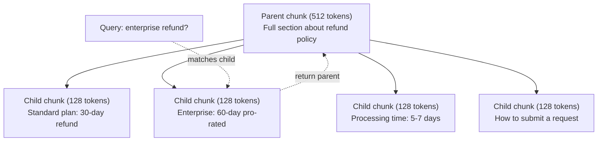
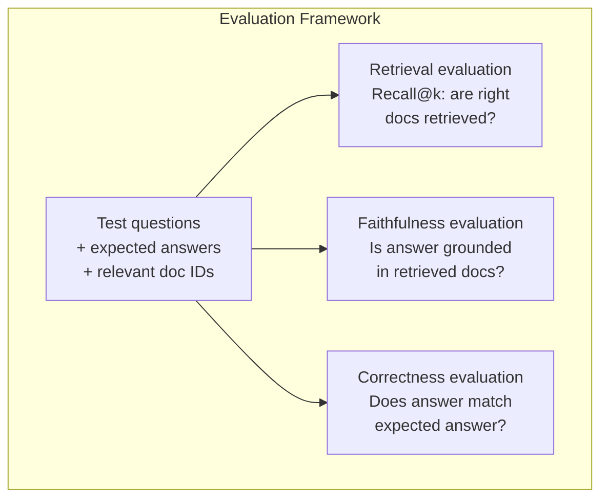

# 现在,我们在一个新的平台上,

> 基本RAG检索了最相似的顶部k块. 这适用于简单的问题. 它用于多个跳槽推理,模糊的查询和大体. 高级RAG是 10 文件的演示和 10 百万文件的系统之间的区别.

> **【中文解读】**基础RAG 检查顶-k 相似块,适用于简单问题――但在多跳推理、歧义查询和大规模语料上会失效――高级RAG是"10篇文档的演示"和"千万文档的生产系统"之间的分水──

> **【拓展：高级RAG→金融场景】**金融研报分析需要多跳推理 (跨文档关联数据),混合搜索 (混合搜索) 关键词+语义) 可以显著提升财报数据检索准确率.

>  **【前置】**学本节前请先掌握:阶段11·06(RAG) 理解基础RAG流程──本节是其进阶段,假设你已经能写出 chunk→embed→retrieve→prompt→generate 的最小可用的RAG──会用`chromadb`,我知道.`rank_bm25`,我知道.`sentence-transformers`或`cohere`升级的API.

**Type:** Build | **类型:** 构建
**Languages:** Python | **语言:** Python
**Prerequisites:** Phase 11, Lesson 06 (RAG) | **前置知识:** Phase 11 · 06 (RAG)
**Time:** ~90 minutes | **时间:** ~90 分钟
**Related:**阶段5 · 23 (RAG的零碎策略) 涵盖了所有六种零碎算法递归,语义,句子,母文档,晚期零碎,文本检索使用VECTARA/Anthropic基准.这个课程建立在顶部:混合搜索,重新排名,查询转换.**相关:**阶段 5 · 23(RAG 分块策略) 覆盖全部六种分块算法归归、语义、句子、父文档、晚分块、上下文检索含向/人类基准──本课在其上构建:混合搜索、重排、查询转换──

## 学习目标

- 实施先进的分断策略 (语义,递归,父母和孩子) 保存文档结构和文本
  实现保留文档结构和上下文的高级分块策略 (语义、递归、父子)
- 构建一个混合搜索管道,结合BM25关键字匹配与语义向量搜索和跨编码重排器
  构建结合BM25 关键词匹配、语义向量搜索和交叉编码器重排器的混合搜索管线
- 应用查询转换技术 (HyDE,多查询,退步) 改善对模糊或复杂的问题的检索
  应用查询转换技术 (HyDE、多查询、退步) 改善模糊或复杂问题的查询
- 诊断和修复常见的RAG故障:错误的部分检索,答案不在文本中,多跳推理分断
  诊断和修复常见RAG 失败:检索错误块、答案不在下文中、多跳推理崩

> **【中文解读】**本课目的:掌握高级RAG技术查询重写,混合检查,重排序,自适应检查,多跳推理――这些技术解决RAG在复杂查询上的局限性基础――

>  **【类比】**基础RAG 像新手书管理员说"营收",他按字面找带"营收"的书──高级RAG 像资深管理员:(1) **Query 改写**你说"营收",他翻译成"上一季度财报中的收入数字"再找;**混合搜索**既翻主题目录 (语义) 又翻关键词索引 (BM25),两边结果合并;(3) **重排**召回100本后,仔细看每本摘要排序挑出最相关的5本(跨编码器)

> ️ **【易错点】**高级RAG 的3个坑:(1) **HyDE 用错场景**HyDE(让LLM先生成假设答案再使用答案检查) 在事实查询上反而误导检查;只对开放性问题有效――(2) **重排模型选错**使用双码码器 当交叉码器重排自己 (如BGE-M3)),没有得到真正交叉码器的精度提升;使用专门的BGE-重排器-v2、Cohere Rerank──3)**混合搜索没归一化**BM25 分数 0-30,向量相似度 0-1,直接相加向量永远被淹没;使用相互级合并 (RRF) 或最小最大归一化──

>  **【困惑】**问:多跳推理该让模型做还是检查做? A: 检查做.让模型在快速推理,每跳检查一次,把上一个跳结果作为下一个跳查询的输入. 例如:"哪个团队满意度提升最大?"→先检查"所有团队满意度分数"→让模型比较→得出"A 团队"→再检查"A 团队详细"――一次跳检查,避免一次性塞所有可能相关文档――


## 问题 问题引入

在第06课中,你建立了一个基本的RAG管道.

> 你在第06课中建立了一个基础RAG流水线.

**Ambiguous query**语义搜索显示了收入战略,收入预测和财务总监对收入增长的想法.所有这些都与"收入"这个词类似.没有包含实际数字.正确的部分说:"$47.2M in Q3 2025" but uses the word "earnings" instead of "revenue." The embedding model thinks "revenue strategy" is closer to the query than "Q3 earnings were $其他国家

> **模糊查询**:"上个季度营收是多少?"语义搜索回归了关于营收策略,营收预测和CFO对营收增长的看法片段──都和"收入"语义相似,但没有一个包含实际数字──

**Multi-hop question**答案: "哪个团队获得了最高的客户满意度评分改善?" 这需要找到每个团队的满意度评分,将它们比较,并确定最大的.没有单个部分包含答案.信息分散在团队报告中.

> **多跳问题**:"哪个团队的客户满意度评分最高?"这需要找到每个团队的满意度评分,比较它们,并识别最大值――没有任何单一段子包含答案――

**Large corpus problem**您有200万块.正确的答案是#1,847,293块.您的前五个检索引入了#14,#89,201,#1,200,000,#44,#901,333块. 嵌入空间很近,但没有包含答案.在这个规模上,近邻搜索引入了足够的错误,使相关结果被推出了上层k.

> **大型语料库问题**您的前五条检索出了其他段子. 在这个规模下,近似近邻搜索引入了足够的错误.

基本RAG失败,因为向量相似性与相关性不同. 一个部分可以从语义上看似一个查询,但没有用于回答它. 高级RAG使用四种技术解决这一问题:混合搜索 (添加关键词匹配),重新排名 (更仔细评分候选人),查询转换 (在搜索之前修复查询),更好的分量 (在正确的细分度中检索).

> 基础RAG 失败是因为向量相似度不等于相关性――高级RAG 用四种技术解决:混合搜索(添加关键词匹配)、重排序(更仔细评分候选人)、查询转换(搜索前修复查询) 和更好的分块(以正确的粒度检查)。

## 概念的核心概念

> **【中文解读】**高级RAG 技术解决基础RAG的局限性:查询重写将模糊问题转为精确查询) 混合检索(向量 + 关键词) 重排序(使用跨编码器 精排) 自适应检索(判断是否需要检索) 多跳推理(分解复杂问题为多次检索) ⋅

> **【拓展：高级 RAG 的工业应用】**生产级RAG 系统通常包含:查询意图分类到查询扩展/重写到混合检索(BM25 + 向量) 到跨编码重排到上下文缩小到答案生成 + 引用标注――概念 AI、乱等产品都使用高级RAG 技术――自行RAG 让模型自己决定何时检索――


### 混合搜索:语义 +关键词

语义搜索 (向量相似性) 很好理解意义. "我如何取消订阅?"与"取消你的计划的步骤"相匹配,尽管他们没有分享任何单词.但它没有准确的匹配. "错误代码E-4021"可能不匹配含有"E-4021"的部分,如果嵌入模型把它视为噪音.

> 语义搜索(向量相似度) 擅长理解含义──"如何取消订阅?"匹配"终止计划的步骤"尽管不共享单词──但它错过精确匹配──"错误码E-4021"可能不匹配包含"E-4021"的块,如果嵌入模型将视为噪音──

关键字搜索 (BM25) 是相反的.它在精确匹配时优异. "E-4021"匹配完美. 但如果文件说"终止你的计划",则"取消我的订阅"返回零结果.

> 关键词搜索(BM25) 相反──它擅长精确匹配──"E-4021"完美匹配──但"取消我的订阅"如果文档说"终止你的计划"则返回零结果──

混合搜索运行了两者,然后将结果合并.

> 混合搜索同时运行两者,然后合并结果.

**BM25**搜索引擎的核心是自1990年代以来.

> **BM25**(最佳匹配 25) 是标准关键词搜索算法――自1990年代起就是搜索引擎的支柱――公式:

```
BM25(q, d) = sum over terms t in q:
    IDF(t) * (tf(t,d) * (k1 + 1)) / (tf(t,d) + k1 * (1 - b + b * |d| / avgdl))
```

在文件d中的tf,d是t的术语频率, IDF(t) 是反向文件频率,

> 其中 tf(t,d) 是 t 在文档中 d 中的词频,IDF(t) 是逆文档频率,

简单地说:当包含查询术语 (特别是罕见的) 时,BM25的文档得分更高,但重复术语的回报率却下降.一个用字母"收入"50倍的文档并不比一次使用的文档50倍更相关.

> 简而言之:BM25 给包含查询词 (尤其是稀有词) 的文档更高分,但重复词有递减收益.

### 相互级别融合 (RRF)

它们是如何组合的? 相互排列融合是标准方法.

> 你有两个排列列表:一个来自向量搜索,一个来自BM25......如何合并它们?倒数排列名融合(RRF) 是标准方法――

```
RRF_score(d) = sum over rankings R:
    1 / (k + rank_R(d))
```

在这种情况下, k 是一个常数 (通常是60),它阻止了排名最高的结果占据主导地位.

> 其中 k 是常数 (通常是60),防止排名第一的结果主导.

在向量搜索中排名第一的文件和BM25中排名第五的文件得到: 1/(60+1) + 1/(60+5) = 0.0164 + 0.0154 = 0.0318

在向量搜索中排名第3的文件和BM25中排名第2的文件得到: 1/(60+3) + 1/(60+2) = 0.0159 + 0.0161 = 0.0320

> 在向量搜索排名第一、BM25 排名第五的文档得:1/(60+1) +1/(60+5) =0.0164 +0.0154 =0.0318。在向量搜索排名第三、BM25 排名第二的文档得:1/(60+3) +1/(60+2) =0.0159 +0.0161 =0.0320。

根据RRF的数据,RRF自然会平衡两个信号.在两个列表中排名高的文档获得最佳分数.在一个列表中排名第一但不在另一个列表中排名的文档获得中等分数.这是强大的,因为它使用排名,而不是原始分数,因此两种系统之间的分数分布差异并不重要.

> RRF自然平衡两个信号. 在两个列表中,排名最高的文档获得最高分数. 在一个列表中排名第一,但在另一个列表中缺失的文档获得中等分数.

### 排名重定

检索 (无论是向量,关键字或混合) 是快速的,但不准确的.它使用双编码器:查询和每个文档都独立嵌入,然后进行比较.嵌入式计算一次并缓存.这可扩展到数百万文档.

> 检索(无论向量、关键词还是混合) 快但不精确――它使用双编码器:查询和每个文档独立嵌入,然后比较――嵌入计算一次并缓存――这可扩展到百万文档――

排名使用跨编码器:查询和候选文件被合并成一个输出相关性分数的模型.该模型同时看到两个文本,并可以捕获它们之间的细微互动.跨编码器可以理解"Q3的收益是什么?"对于包含"Q3中的47.2M美元"的部分非常相关,即使双编码器错过了连接.

> 重排使用交叉编码器:查询和候选文件一起输入一个输出相关性分数的模型――模型同时看到两个文本,能捕捉它们之间的细微分量交互――交叉编码器能理解"Q3 收益多少?"与包含"Q3 为47.20万美元"的块高度相关,即使双编码器错过了这个关联――

交换:交叉编码器比双编码器100-1000倍慢,因为它们共同处理查询文档对.你不能预先计算100万份文档的交叉编码分数.解决方案:获取更大的候选人集 (来自混合搜索的Top-50),然后再使用交叉编码器排名以获得最终的Top-5.

> 权衡:交叉编码器比双编码器慢100-1000倍,因为它联合处理查询-文档对――你无法为百万文档预计算交叉编码器分数――解决方案:检索更大候选集(混合搜索前-50),然后使用交叉编码器重排得到最终前五――


常见的重新排名模型 (2026年排行):

> 常见重排模型(2026年阵容):

- 协同排名3.5:管理 API,多语言,混合体中最佳回忆收益
  托管API、多语言、混合语料最大回收增长
- 旅行重新排名-2.5:管理 API,最低的延迟
  托管 API、托管选项中最小延迟
- 简单的语言:开放式,100多种语言
  开源权重、100+ 语言
- bge-renanker-v2-m3:开放权重,强基线
  开源权重、强基线
- 跨码码器/ms-marco-MiniLM-L-6-v2:开放权重,运行于CPU用于原型设计
  开源权重,可在CPU上运行原型
- 结合后期交互多向量重排器  O(代币) 不是 O(doc) 在得分时间
  后期交互多向量重排器评分时 O(tokens) 而不是 O(docs)

### 查询转换

有时问题不是检索,而是查询本身. "新政策变化是什么?"是一个可怕的搜索查询.它没有具体的术语.嵌入模糊.没有检索系统可以从中找到正确的文件.

> 有时问题不在查询,而在查询本身. "新政策变化那东西是什么?"是糟糕的查询.

**Query rewriting**通过将用户的查询转换为更好的搜索查询.

> **查询重写**对于更好的搜索查询.

```
User: "What was that thing about the new policy change?"
Rewritten: "Recent policy changes and updates"
```

**HyDE (Hypothetical Document Embeddings)**代替查询,生成一个假设答案,嵌入,并搜索类似的真实文档.

> **HyDE（假设文档嵌入）**没有查询搜索,而是生成假设答案,嵌入其中,搜索相似的真实文档.

```
Query: "What is the refund policy for enterprise?"
Hypothetical answer: "Enterprise customers are eligible for a full refund
within 60 days of purchase. Refunds are pro-rated based on the remaining
subscription period and processed within 5-7 business days."
```

嵌入假设答案,并寻找类似于它的真实文档.直觉:假设答案在嵌入空间中比原始问题更接近真实答案.问题和答案具有不同的语言结构.通过生成假设答案,你将在嵌入中的"问题空间"和"答案空间"之间的差距弥合.

> 嵌入假设答案并搜索与它相似的真实文档.直觉:假设答案在嵌入空间中比原始问题更接近真实答案.问题和答案有不同的语言结构.通过生成假设答案,你弥合嵌入中的"问题空间"和"答案空间"的差距.

代在检索之前添加一个LLM调用. 这增加了500-2000ms的延迟.

> 检查中增加一次LLM调用.

### 亲子的分手

标准的碎片化需要进行折扣:小块用于精确的检索,大块用于足够的文本化.

> 标准分块强制权衡:小块精确检索,大块足够上下文――父子分块消除这个权衡――

索引小块 (128个代币) 获取.当一个小块被获取时,返回其母块 (512个代币) 为提示.小块与查询精确匹配.母块为LLM产生一个好的答案提供了足够的背景.

> 索引小块(128代币) 用于检查.检查到小块时,返回其父块.



查询"企业退款?"与小部分C2精确相匹配. 但提示收到完整的父母部分P,其中包括处理时间和提交过程的周围环境.

> 查询"企业退款?" 精确匹配子块C2――但提示收到完整的子块P,包含关于处理时间和提议交流过程的周围下文――

### 分析数据

在执行向量搜索之前,按日期,来源,类别,作者,语言过数据. 这减少了搜索空间,防止无关的结果.

> 在运行量搜索前,按元数据过语料库:日期、来源、类别、作者、语言──这缩小了搜索空间并防止不相关结果──

没有过度过的元数据,你会搜索整个库,并可能找到一个两年历史的安全文件,

> 没有任何数据过,你搜索了整个语料库,可能检索到一个巧合语义相似的 2年前的安全文档.

产品RAG系统将元数据存储在每个部分旁边:源文件,创建日期,类别,作者,版本.向量数据库支持在搜索相似性之前预先过元数据,这对于规模性能至关重要.

> 生产RAG 系统在每个块旁边存储元数据:源文档"",创建日期"",类别"",作者"",版本"",向量数据库支持相似性搜索前按元数据预测,这对大规模性能至关重要.

### 评估

你建立了RAG系统.你怎么知道它是否有效?

> 你建立了RAG系统. 如何知道它有效?

**Retrieval relevance (Recall@k)**对于已知相关文件的测试问题,在前k结果中显示的相关文件的百分比是多少?

> **检索相关性（Recall@k）**相关文件在前五中出现的百分比是多少?如果一个问题在第47块,第47块是否出现在前五?

**Faithfulness**如果检索的部分写"60天退款窗口"和模型说"90天退款窗口",那就是忠诚度失败.模型虽然有正确的文本,但却产生了幻觉.

> **忠实度**查询块说"60天退款窗口"而模型说"90天退款窗口",那就是忠诚度失败了.

**Answer correctness**产生的答案是否符合预期答案?这是端到端的指标. 它结合检索质量和生成质量.

> **答案正确性**结果是否匹配预期结果?这是端到端指标.

简单的忠实性检查:在生成的答案中,检查每一个索赔,并验证它在检索的部分中出现 (实质上).如果答案中包含一个没有检索的部分的事实,那么它可能是幻觉的.

> 简单忠实检查:取生成答案中的每一个声明,验证它在实质上) 出现在检查块中.



## 建立它,实现它.
```figure
agentic-rag-loop
```

## 建立它

### 步骤1:BM25的实施

```python
import math
from collections import Counter

class BM25:
    def __init__(self, k1=1.2, b=0.75):
        self.k1 = k1
        self.b = b
        self.docs = []
        self.doc_lengths = []
        self.avg_dl = 0
        self.doc_freqs = {}
        self.n_docs = 0

    def index(self, documents):
        self.docs = documents
        self.n_docs = len(documents)
        self.doc_lengths = []
        self.doc_freqs = {}

        for doc in documents:
            words = doc.lower().split()
            self.doc_lengths.append(len(words))
            unique_words = set(words)
            for word in unique_words:
                self.doc_freqs[word] = self.doc_freqs.get(word, 0) + 1

        self.avg_dl = sum(self.doc_lengths) / self.n_docs if self.n_docs else 1

    def score(self, query, doc_idx):
        query_words = query.lower().split()
        doc_words = self.docs[doc_idx].lower().split()
        doc_len = self.doc_lengths[doc_idx]
        word_counts = Counter(doc_words)
        score = 0.0

        for term in query_words:
            if term not in word_counts:
                continue
            tf = word_counts[term]
            df = self.doc_freqs.get(term, 0)
            idf = math.log((self.n_docs - df + 0.5) / (df + 0.5) + 1)
            numerator = tf * (self.k1 + 1)
            denominator = tf + self.k1 * (1 - self.b + self.b * doc_len / self.avg_dl)
            score += idf * numerator / denominator

        return score

    def search(self, query, top_k=10):
        scores = [(i, self.score(query, i)) for i in range(self.n_docs)]
        scores.sort(key=lambda x: x[1], reverse=True)
        return scores[:top_k]
```

### 步骤2:相互级别的融合

```python
def reciprocal_rank_fusion(ranked_lists, k=60):
    scores = {}
    for ranked_list in ranked_lists:
        for rank, (doc_id, _) in enumerate(ranked_list):
            if doc_id not in scores:
                scores[doc_id] = 0.0
            scores[doc_id] += 1.0 / (k + rank + 1)
    fused = sorted(scores.items(), key=lambda x: x[1], reverse=True)
    return fused
```

### 步骤3:混合搜索管道

```python
def hybrid_search(query, chunks, vector_embeddings, vocab, idf, bm25_index, top_k=5, fusion_k=60):
    query_emb = tfidf_embed(query, vocab, idf)
    vector_results = search(query_emb, vector_embeddings, top_k=top_k * 3)
    bm25_results = bm25_index.search(query, top_k=top_k * 3)
    fused = reciprocal_rank_fusion([vector_results, bm25_results], k=fusion_k)
    return fused[:top_k]
```

### 步骤4:简单的重排

在制作中,你会使用一个跨编码模型.在这里我们构建一个重排器,

> 生产中你会使用交叉编码器模型――这里我们用词重叠,词重要性和短语匹配构建评分查询-文档相关性重排器――

```python
def rerank(query, candidates, chunks):
    query_words = set(query.lower().split())
    stop_words = {"the", "a", "an", "is", "are", "was", "were", "what", "how",
                  "why", "when", "where", "do", "does", "for", "of", "in", "to",
                  "and", "or", "on", "at", "by", "it", "its", "this", "that",
                  "with", "from", "be", "has", "have", "had", "not", "but"}
    query_terms = query_words - stop_words

    scored = []
    for doc_id, initial_score in candidates:
        chunk = chunks[doc_id].lower()
        chunk_words = set(chunk.split())

        term_overlap = len(query_terms & chunk_words)

        query_bigrams = set()
        q_list = [w for w in query.lower().split() if w not in stop_words]
        for i in range(len(q_list) - 1):
            query_bigrams.add(q_list[i] + " " + q_list[i + 1])
        bigram_matches = sum(1 for bg in query_bigrams if bg in chunk)

        position_boost = 0
        for term in query_terms:
            pos = chunk.find(term)
            if pos != -1 and pos < len(chunk) // 3:
                position_boost += 0.5

        rerank_score = (
            term_overlap * 1.0
            + bigram_matches * 2.0
            + position_boost
            + initial_score * 5.0
        )
        scored.append((doc_id, rerank_score))

    scored.sort(key=lambda x: x[1], reverse=True)
    return scored
```

### 步骤5:HyDE (假设文件嵌入)

```python
def hyde_generate_hypothesis(query):
    templates = {
        "what": "The answer to '{query}' is as follows: Based on our documentation, {topic} involves specific policies and procedures that define how the process works.",
        "how": "To address '{query}': The process involves several steps. First, you need to initiate the request. Then, the system processes it according to the defined rules.",
        "default": "Regarding '{query}': Our records indicate specific details and policies related to this topic that provide a comprehensive answer."
    }
    query_lower = query.lower()
    if query_lower.startswith("what"):
        template = templates["what"]
    elif query_lower.startswith("how"):
        template = templates["how"]
    else:
        template = templates["default"]

    topic_words = [w for w in query.lower().split()
                   if w not in {"what", "is", "the", "how", "do", "does", "a", "an",
                                "for", "of", "to", "in", "on", "at", "by", "and", "or"}]
    topic = " ".join(topic_words) if topic_words else "this topic"

    return template.format(query=query, topic=topic)


def hyde_search(query, chunks, vector_embeddings, vocab, idf, top_k=5):
    hypothesis = hyde_generate_hypothesis(query)
    hypothesis_emb = tfidf_embed(hypothesis, vocab, idf)
    results = search(hypothesis_emb, vector_embeddings, top_k)
    return results, hypothesis
```

### 第六步:父母与孩子的分化

```python
def create_parent_child_chunks(text, parent_size=200, child_size=50):
    words = text.split()
    parents = []
    children = []
    child_to_parent = {}

    parent_idx = 0
    start = 0
    while start < len(words):
        parent_end = min(start + parent_size, len(words))
        parent_text = " ".join(words[start:parent_end])
        parents.append(parent_text)

        child_start = start
        while child_start < parent_end:
            child_end = min(child_start + child_size, parent_end)
            child_text = " ".join(words[child_start:child_end])
            child_idx = len(children)
            children.append(child_text)
            child_to_parent[child_idx] = parent_idx
            child_start += child_size

        parent_idx += 1
        start += parent_size

    return parents, children, child_to_parent
```

### 第七步: 评估忠诚

```python
def evaluate_faithfulness(answer, retrieved_chunks):
    answer_sentences = [s.strip() for s in answer.split(".") if len(s.strip()) > 10]
    if not answer_sentences:
        return 1.0, []

    grounded = 0
    ungrounded = []
    context = " ".join(retrieved_chunks).lower()

    for sentence in answer_sentences:
        words = set(sentence.lower().split())
        stop_words = {"the", "a", "an", "is", "are", "was", "were", "and", "or",
                      "to", "of", "in", "for", "on", "at", "by", "it", "this", "that"}
        content_words = words - stop_words
        if not content_words:
            grounded += 1
            continue

        matched = sum(1 for w in content_words if w in context)
        ratio = matched / len(content_words) if content_words else 0

        if ratio >= 0.5:
            grounded += 1
        else:
            ungrounded.append(sentence)

    score = grounded / len(answer_sentences) if answer_sentences else 1.0
    return score, ungrounded


def evaluate_retrieval_recall(queries_with_relevant, retrieval_fn, k=5):
    total_recall = 0.0
    results = []

    for query, relevant_indices in queries_with_relevant:
        retrieved = retrieval_fn(query, k)
        retrieved_indices = set(idx for idx, _ in retrieved)
        relevant_set = set(relevant_indices)
        hits = len(retrieved_indices & relevant_set)
        recall = hits / len(relevant_set) if relevant_set else 1.0
        total_recall += recall
        results.append({
            "query": query,
            "recall": recall,
            "hits": hits,
            "total_relevant": len(relevant_set)
        })

    avg_recall = total_recall / len(queries_with_relevant) if queries_with_relevant else 0
    return avg_recall, results
```

## 用它实现框架

通过一个真正的跨编码器来重新排名:

> 用真实交叉编码器重排:

```python
from sentence_transformers import CrossEncoder

reranker = CrossEncoder("cross-encoder/ms-marco-MiniLM-L-6-v2")

def rerank_with_cross_encoder(query, candidates, chunks, top_k=5):
    pairs = [(query, chunks[doc_id]) for doc_id, _ in candidates]
    scores = reranker.predict(pairs)
    scored = list(zip([doc_id for doc_id, _ in candidates], scores))
    scored.sort(key=lambda x: x[1], reverse=True)
    return scored[:top_k]
```

科赫的管理者:

> 用Cohere的托管重排器:

```python
import cohere

co = cohere.Client()

def rerank_with_cohere(query, candidates, chunks, top_k=5):
    docs = [chunks[doc_id] for doc_id, _ in candidates]
    response = co.rerank(
        model="rerank-english-v3.0",
        query=query,
        documents=docs,
        top_n=top_k
    )
    return [(candidates[r.index][0], r.relevance_score) for r in response.results]
```

对于HyDE,具有真正的法学士学位:

> 用真实的法学士做 HyDE:

```python
import anthropic

client = anthropic.Anthropic()

def hyde_with_llm(query):
    response = client.messages.create(
        model="claude-sonnet-5",
        max_tokens=256,
        messages=[{
            "role": "user",
            "content": f"Write a short paragraph that would be a good answer to this question. Do not say you don't know. Just write what the answer would look like.\n\nQuestion: {query}"
        }]
    )
    return response.content[0].text
```

对于Weaviate的生产混合搜索:

> 用编织做生产混合搜索:

```python
import weaviate

client = weaviate.connect_to_local()

collection = client.collections.get("Documents")
response = collection.query.hybrid(
    query="enterprise refund policy",
    alpha=0.5,
    limit=10
)
```

位数控制了平衡:0.0 =纯键词 (BM25),1.0 =纯向量,0.5 =等重.大多数生产系统使用0.3至0.7之间的位数.

> 基本的生产系统使用了alpha 在0.3 到0.7 之间.

## 运送它.

这一课产生了:
- `outputs/prompt-advanced-rag-debugger.md`-- 诊断和解决RAG质量问题的提示
  诊断和修复RAG质量问题提示
- `outputs/skill-advanced-rag.md`-- 通过混合搜索和重新排名建立生产级RAG的技能
  构建带混合搜索和重排的生产级RAG的技能

## 练习题

1. 对于每一个5个测试查询,记录哪个方法返回最相关的部分位置#1. 混合搜索应该至少在5中赢得3个.
   在样本文档上比较BM25对向量搜索对混合搜索.对5个测试搜索,记录哪种方法在位置#1 返回最相关的块.

2. 执行一个元数据过器. 添加一个"类别"字段到每个文档 (安全,账单,API,产品). 在运行向量搜索之前,过块到只有相关类别. 测试使用"使用什么加密?"并验证它只搜索安全类别的块.
   实现元数据过器──给每个文档加"类别"字段(安全性、结账、api、产品)──运行向量搜索前,过块到相关类别──用"使用什么加密?"测试,验证它只搜索安全性 类块──

3. 通过从06课程中简单生成函数构建一个完整的HyDE管道.在所有5项测试查询中,比较直接查询和HyDE搜索之间的检索质量 (前三相关性).HyDE应改善模糊查询的结果.
   用第06课的简单生成函数构建完整的HyDE管线――比较直接查询查询和HyDE查询在5个测试查询上的查询质量――前三相关性――HyDE应改进模糊查询的结果――

4. 执行父母-孩子分量策略.使用 child_size=30和 parent_size=100.使用儿童分量搜索,但返回提示中父母分量.将生成的标准分量答案与 chunk_size=50进行比较.
   在样本文档中实现父子分块策略──使用 child_size=30 和 parent_size=100──使用子块搜索但返回父块到提示──比较生成答案与 chunk_size=50 的标准分块──

5. 创建评估数据集: 10 个问题,已知答案分类. 测量 Recall@3, Recall@5, Recall@10 仅用于 (a) 矢量搜索, (b) 仅用于 BM25, (c) 混合搜索, (d) 混合+重新排名. 绘制结果并确定重新排名最有帮助的地方.
   创建评估数据集:10 个带已知答案块问题──为 (a) 仅向量搜索、((b) 仅 BM25、((c) 混合搜索、(d) 混合 + 重排测量 Recall@3、Recall@5、Recall@10──绘制结果并识别重排在哪里最大的帮助──

## 关键词 快速查找表

| Term | What people say | What it actually means | 中文释义 |
|------|----------------|----------------------|---------|
| BM25 | "Keyword search" | A probabilistic ranking algorithm that scores documents by term frequency, inverse document frequency, and document length normalization | BM25：按词频、逆文档频率和文档长度归一化给文档评分的概率排序算法 |
| Hybrid search | "Best of both worlds" | Running semantic (vector) and keyword (BM25) search in parallel, then merging results with rank fusion | 混合搜索：并行运行语义（向量）和关键词（BM25）搜索，然后用排名融合合并结果 |
| Reciprocal Rank Fusion | "Merge ranked lists" | Combining multiple ranked lists by summing 1/(k + rank) for each document across all lists | 倒数排名融合：通过对每个文档在所有列表中求和 1/(k + rank) 合并多个排序列表 |
| Reranking | "Second pass scoring" | Using a more expensive cross-encoder model to re-score a candidate set from initial retrieval | 重排：用更昂贵的交叉编码器模型对初始检索的候选集重新评分 |
| Cross-encoder | "Joint query-document model" | A model that takes a query and document as a single input, producing a relevance score; more accurate than bi-encoders but too slow for full corpus search | 交叉编码器：将查询和文档作为单一输入的模型，输出相关性分数；比双编码器精确但太慢无法全语料搜索 |
| Bi-encoder | "Independent embedding model" | A model that embeds queries and documents independently; fast because embeddings are precomputed, but less accurate than cross-encoders | 双编码器：独立嵌入查询和文档的模型；快因为嵌入预计算，但比交叉编码器精度低 |
| HyDE | "Search with a fake answer" | Generate a hypothetical answer to the query, embed it, and search for real documents similar to it | HyDE：生成查询的假设答案，嵌入它，搜索相似真实文档 |
| Parent-child chunking | "Small search, big context" | Index small chunks for precise retrieval but return the larger parent chunk to provide sufficient context | 父子分块：索引小块精确检索但返回较大父块提供足够上下文 |
| Metadata filtering | "Narrow before searching" | Filtering documents by attributes (date, source, category) before running vector search to reduce the search space | 元数据过滤：运行向量搜索前按属性（日期、来源、类别）过滤文档以缩小搜索空间 |
| Faithfulness | "Did it stay grounded" | Whether the generated answer is supported by the retrieved documents, as opposed to hallucinated from the model's training data | 忠实度：生成的答案是否被检索文档支持，而非从模型训练数据幻觉 |

## 继续阅读 继续阅读

- 罗伯逊和萨拉戈萨,"概率相关性框架:BM25和其它" (2009) - - 概率相关性框架的最终参考,解释了公式背后的概率基础
  罗伯逊和萨拉戈萨,"概率相关性框架:BM25及以上" (2009) BM25的权威参考,解释公式背后的概率基础
- 科尔麦克等人",互惠级合并优于康多塞特和个人级学习方法" (2009) - 原始的RRF论文显示它超过了更复杂的合并方法
  科尔麦克等,"互惠级别融合..." (2009) RRF 原始论文,展示它击败更复杂的融合方法
- 盖奥等人",没有相关标签的精确零射击密集检索" (2022) -- HyDE论文证明假设文件嵌入式改善了没有任何培训数据的检索
  等",精确零射集密度检索..."2022) HyDE论文,展示假设文档嵌入无需训练数据即可改进检索
- 诺格耶拉和乔, "通过BERT重新排名" (2019) -- 显示,在BM25上方的跨编码重新排名显著提高了检索质量
  诺格耶拉和乔,"通过重新排名与BERT" (Bert 2019) 展示在BM25上交叉编码器重排显著改善检索质量
- [Khattab et al., "DSPy: Compiling Declarative Language Model Calls into Self-Improving Pipelines" (2023)](https://arxiv.org/abs/2310.03714)根据"快速LLM"的定义, 快速构建和重量选择是对检索管道进行优化的问题.
  哈塔布等,"DSPy" (DSPy) 将提示构建和权重选择视为检索管线上的优化问题;读它来编程LLM而不是"提示LLM".
- [Edge et al., "From Local to Global: A Graph RAG Approach to Query-Focused Summarization" (Microsoft Research 2024)](https://arxiv.org/abs/2404.16130)-- 图形RAG论文:实体关系提取+莱登社区检测,以查询为重点的总结;全球与本地检索区别.
  边缘等",从本地到全球:一个图形RAG方法...""微软研究 2024) 图形RAG论文:实体关系抽取 + 莱登 社区检测用于查聚焦摘要;全局vs局部检索的区别──
- [Asai et al., "Self-RAG: Learning to Retrieve, Generate, and Critique through Self-Reflection" (ICLR 2024)](https://arxiv.org/abs/2310.11511)通过反射代币进行自我评估, 通过静态检索生成的代理边界.
  作为一个"自行RAG" (ICLR 2024) 带反思代币的自行评估RAG;静态先检索后生成之外的智能体前沿――
- [LangChain Query Construction blog](https://blog.langchain.dev/query-construction/)如何将自然语言查询转化为结构化数据库查询 (文本到SQL,加密)
  如何将自然语言查询翻译为结构化数据库查询 (文本到SQL、Cypher) 作为预检索步骤.
