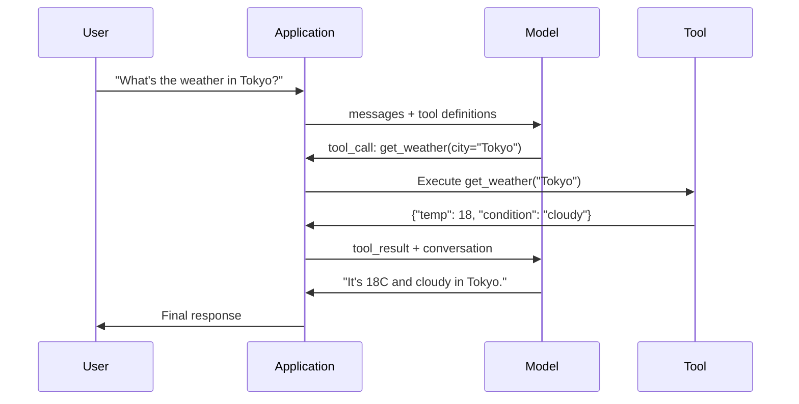

# 函数调用与工具使用

> 法律法师什么都不能做. 他们生成了短信. 这就是全部能力. 他们无法检查天气,查询数据库,发送电子邮件,运行代码或阅读文件. 你见过的每一个"AI代理"都是一个LLM生成JSON的, 模型是大脑. 工具是手. 功能调用是神经系统连接它们.

> **【中文解读】**简单的语言是语言,语言是语言,语言是语言,语言是语言,语言是语言,语言是语言,语言是语言,语言是语言,语言是语言,语言是语言,语言是语言,语言是语言,语言是语言,语言是语言,语言是语言,语言是语言,语言是语言,语言是语言,语言是语言,语言是语言,语言是语言,语言是语言,语言是语言,语言是语言,语言是语言,语言是语言,语言是语言,语言是语言,语言是语言,语言是语言,语言是语言,语言是语言,语言是语言,语言是语言,语言是语言,语言是语言,语言是语言,语言是语言,语言是语言,语言是语言,语言是语言,语言是语言,语言是语言,语言是语言,语言是语言,语言是语言,语言是语言,语言是语言,语言是语言,语言是语言,语言是语言,语言是语言的语言.

> **【拓展：Function Calling→MCP与Agent】**函数调用是AI代理的核心机制,MCP协议基于此标准化工具描述和调用流程,是Claude 生态的基础协议.

>  **【前置】**学本节前请先掌握:(1) 阶段11·01(快速工程) 理解LLM 如何处理快速;(2) 阶段11·03(结构化输出) 理解JSON方案,本节重度依赖;(3) Python 字典、JSON 序列化、试/除了异常处理──如果不会写JSON方案,先看jonschema 库文档本节不会从头讲――

**Type:** Build | **类型:** 构建
**Languages:** Python | **语言:** Python
**Prerequisites:** Phase 11 Lesson 03 (Structured Outputs) | **前置知识:** Phase 11 · 03 (结构化输出)
**Time:** ~75 minutes | **时间:** ~75 分钟
**Related:**阶段11 · 14 (模式语境协议) 当工具被共享在主机之间,从线性函数调用到MCP服务器毕业.这个课程涵盖了线性案例;MCP涵盖了协议案例.**相关:**阶段11 · 14 (模型上下文协议) 当工具需要跨主机共享时,从内联函数调用升级为MCP 服务器――本课讲内联场景;MCP 讲协议场景――

## 学习目标

- 实现函数调用循环:定义工具方案,分析模型的工具调用JSON,执行函数,返回结果
  实现函数调用循环:定义工具方案、解析模型的工具调用 JSON、执行函数并返回结果
- 设计工具方案,具有明确的描述和输入参数,模型可可靠地使用
  设计具有清晰的描述和类型化参数的工具方案,使模型能够可靠调整
- 构建一个多转机代理循环,链接多个函数调用来回答复杂的查询
  构建多轮代理 循环,链式调用多个函数来回答复杂的查询
- 处理函数调用边缘情况:并行工具调用,错误传播,防止无限工具循环
  处理函数调用边缘情况:并行工具调用、错误传播和防止无限工具循环

> **【中文解读】**本课目标:掌握函数调用 (Funktion Calling) 让LLM调用外部工具――这是构建AI代理的基础模型通过调用搜索,数据库,API等工具获取信息和执行操作――


## 问题 问题引入

你建立了一个聊天机器人. 一个用户问:"现在东京的天气是什么?"

> 你建立了一个聊天机器人.用户问:"东京现在天气怎么样?"

根据季节,东京的气温可能是15摄氏度...

> 模型回复一个带着免责声明的幻觉答案.

模型不知道天气,永远不会.天气每小时都会变化.模型的训练数据已经有几个月了.

> 模型不知道天气,也永远不会知道天气每小时都在变化.

答案是:需要调用OpenWeatherMap API,获取当前温度,返回真数.模型不能调用API.你的代码可以.缺少的部分:一个结构化的协议,让模型说"我需要用这些参数调用天气API",并让你的代码执行它并返回结果.

> 正确答案需要调用OpenWeatherMap API――模型不能调用API,你的代码可以――缺失的是结构化协议――

模型输出结构化的JSON描述哪个函数需要使用哪些参数.你的应用程序执行该函数.结果返回对话中.模型使用结果来生成最终答案.

> 这就是调用函数.模型输出结构化 JSON 描述要调用哪个函数.

没有职能调用,LLM是百科全书.

> 没有调用函数,LLM是百科全书.

>  **【类比】**像一位"嘴强王者"能讲清楚任何概念,但不能动手.调用函数就是给这位嘴强王者配一个"小弟"系统:它说"小弟,去查看东京天气"→小弟照做→回来报告"18度阴天"→它转述给用户.模型从不离开王座 (生成代币),但通过发号施令 (施令) 和接收战报 (接收战报) 工具_结果),它可以调用整个外部世界.

## 概念的核心概念

> **【中文解读】**函数调用 (函数调用) 让LLM 生成结构化的工具调用请求,而不是纯文本回复.

> **【拓展：函数调用与 Agent 系统】**基于函数调用构建的框架包括:模型决定调用搜索API获取实时信息、调用SQL查询数据库、调用Python 执行计算――


### 调用循环的功能

每个工具使用互动都遵循相同的5步循环.

> 每次使用工具交互都遵循相同的五步循环.



步骤1:用户发送信息. 步骤2:模型收到信息,并附工具定义 (描述可用的函数的JSON方案). 步骤3:模型不用文字回复,而是输出一个工具调用--一个结构化的JSON对象, 步骤4:你的代码执行函数并捕获结果. 步骤5:结果回到模型,现在有实际数据来产生最终答案.

> 步骤1:用户发送消息――步骤2:模型接收消息以及工具定义(描述可用的函数的JSON方案) 步骤3:模型不返回文本,而是输出工具调用包含函数名称和参数的结构化JSON对象――步骤4:你的代码执行函数并捕获结果――步骤5:结果回到模型,模型现在有真实数据来产生最终答案――

模型从来没有执行任何东西,它只决定什么叫什么和什么参数.你的代码是执行器.

> 模型从来没有执行任何东西. 它只决定调用什么.

>  **【困惑】**问:为什么模型不直接执行代码?这样不省一步?**隔离**模型在沙盒外执行会有安全风险;;删除数据库;发恶意邮件;分两步让你能够在执行前校验.**可观测**执行在你的进程里,能加日志、限流、审计;**可移植**同一个模型能驱动不同语言的工具集,模型本身不绑定运行时――

### 工具定义:JSON方案合同

每个工具都由一个JSON方案定义,该模型告诉该函数做什么,它需要哪些参数,以及这些参数必须是什么类型.

> 每个工具由JSON Schema定义,告诉模型该函数做什么,接受什么参数,参数必须是什么类型.

```json
{
  "type": "function",
  "function": {
    "name": "get_weather",
    "description": "Get current weather for a city. Returns temperature in Celsius and conditions.",
    "parameters": {
      "type": "object",
      "properties": {
        "city": {
          "type": "string",
          "description": "City name, e.g. 'Tokyo' or 'San Francisco'"
        },
        "units": {
          "type": "string",
          "enum": ["celsius", "fahrenheit"],
          "description": "Temperature units"
        }
      },
      "required": ["city"]
    }
  }
}
```

其他`description`模型读取它们,以决定使用工具的时间和方法. "气候变化"这样的模糊描述会产生更糟糕的工具选择,而不是"为城市获得当前的气候.返回温度在摄氏度和条件".

> `description`字段至关重要. 模型阅读这些描述来决定何时以及如何使用工具. 模糊描述如"获取天气"产生的工具选择效果差于"获取城市当前天气,回归摄氏度温度和天气状况"的描述本身就是工具选择提示.

> ️ **【易错点】**工具描述的3个坑:(1) **描述太短**"获取数据"的描述,模型分不清该使用`get_weather`其他`get_stock_price`写清"做什么 + 输入 + 输出"――(2) **描述互相重叠**两个工具都写"获取信息",模型选哪个全凭运气;修复:每个描述强调独特场景("获取实时天气"vs"获取历史天气")―(3) **隐藏前置条件**比如`delete_file(path)`需要先`confirm()`描述不说模型会直接删除;修复:把约束写入描述或拆成两个工具.

### 提供商的比较

每个主要供应商都支持函数调用,但API表面不同.

> 每个主要供应商都支持调用函数,但API接口不同.

| Provider | API Parameter | Tool Call Format | Parallel Calls | Forced Calling |
|----------|--------------|-----------------|---------------|----------------|
| OpenAI (GPT-5, o4) | `tools` | `tool_calls[].function` | Yes (multiple per turn) | `tool_choice="required"` |
| Anthropic (Claude 4.6/4.7) | `tools` | `content[].type="tool_use"` | Yes (multiple blocks) | `tool_choice={"type":"any"}` |
| Google (Gemini 3) | `function_declarations` | `functionCall` | Yes | `function_calling_config` |
| Open-weight (Llama 4, Qwen3, DeepSeek-V3) | Native `tools` on Llama 4; Hermes or ChatML on others | Mixed | Model-dependent | Prompt-based or `tool_choice` if supported |

到2026年,三个关闭的提供商将 konverge 在几乎相同的JSON-Schema基于格式.`tools`对于跨主机共享工具,更好选择MCP (Phase 11 · 14) 而不是直线函数调用.服务器对所有服务器都是相同的.

> 到2026年,三个关闭源提供商已经趋向到几乎相同的基于JSON方案的格式.`tools`字段匹配OpenAI的结构──开源权重微调模型仍然不同Hermes 格式──NousResearch) 是第三方微调中最常见的──跨主机共享工具时优先使用MCP──Phase 11 · 14) 而非内联函数调用服务器对所有这些都一样──

### 工具选择:自动,要求,具体

你控制模型使用工具时.

> 您可以控制模型使用工具的时间.

**Auto**模型决定是否打电话给工具,或者直接回答. "2+2是什么?" - - 直接回答. "天气是什么?" - - 打电话给工具.
**自动（默认）**模型自行决定是调用工具还是直接回复.

**Required**模型必须调用至少一个工具. 当你知道用户的意图需要工具时,使用此方法. 防止模型猜测而不是寻找真实数据.
**必需**模型必须至少调用一个工具. 当你明确知道用户意图需要工具时使用.

**Specific function**强迫模型调用特定函数. `tool_choice={"type":"function", "function": {"name": "get_weather"}}`无论查询如何,使用这个方法来路由 - - 当上游逻辑已经确定了需要哪个工具.
**特定函数**强制模型调用某个特定函数.`tool_choice={"type":"function", "function": {"name": "get_weather"}}`保证天气工具被调用,无论查询是什么.

### 并行函数调用

基普特-4o和克劳德可以在一次转换中调用多个函数.一个用户问:"东京和纽约的天气是什么?"模型同时输出两个工具调用:

> 用户问:"东京和纽约天气怎么样?"模型同时输出两个调用工具:

```json
[
  {"name": "get_weather", "arguments": {"city": "Tokyo"}},
  {"name": "get_weather", "arguments": {"city": "New York"}}
]
```

您的代码执行了两者 (理想情况下同时),返回了两者结果,模型合成了单个响应. 这将回复次数从2降至1.对于每次查询的5-10个工具调用的代理人来说,并行调用会减少60-80%.

> 你的代码执行两者 (理想情况并发执行),返回两个结果,模型综合出单一回复――这把往返次数从2减至1――每次查询需要5-10次调用工具代理,并行调用减少60-80%延迟――

> ️ **【易错点】**没有调用 2 个坑:**顺序依赖未声明**用户问"先查看A 公司股价,再查看B 公司",模型可能并行调用两个 `get_price`但你不能保证一个先回来;修复:让 `get_price`工具的描述 写明"用于独立查询",需要顺序时使用`compare_stocks(A, B)`单工具封装──(2) **共享状态竞争**并行调用`increment_counter()`两次,结果只增加 1;修复:工具实现加锁,或让模型串行调用副作用工具.

### 结构化输出与函数调用

课程03涵盖结构化输出. 函数调用使用相同的JSON方案机器,但用不同的目的.

> 课程3讲了结构化输出.函数调用相同的JSON方案机制,但目的不同.

**Structured outputs**输出是最终产品. 举个例子:从文本中提取产品信息.`{name, price, in_stock}`现在,我们要去.
**结构化输出**输出就是最终产品.`{name, price, in_stock}`,我知道.

**Function calling**模型声明执行行动的意图.输出是中间步骤. 示例: `get_weather(city="Tokyo")`模型要求采取行动,而不是产生最终答案.
**函数调用**模型声明执行某个动作的意图――输出是中间步骤――例:`get_weather(city="Tokyo")`模型在请求动作,不是产生最终答案.

需要数据提取时使用结构化输出. 需要模型与外部系统交互时使用函数调用.
进行数据抽取时使用结构化输出.

### 安全:不可谈判的规则

函数调用是您可以给LLM最危险的功能.模型选择执行什么.如果您的工具集包括数据库查询,模型构建查询.如果它包括命令,模型会写它们.

> 函数调用是你赋予的 LLM 最危险的能力――模型决定执行什么――如果你的工具集包含数据库查询,模型会构建查询语句――如果包含子命令,模型会写命令――

**Rule 1: Never pass model-generated SQL directly to a database.**模型可以生成DROPTABLE,UNION注射或查询,返回每行. 始终参数化.始终验证.始终使用允许操作列表.
**规则 1：永远不要把模型生成的 SQL 直接传给数据库。**模型会(也会) 生成 DROP TABLE、UNION 注入或返回所有者的查询──始终参数化──始终校验──始终使用操作白名单──始终使用操作白名单──始终使用操作白名单──始终使用操作白名单──始终使用操作白名单──始终使用操作白名单──始终使用操作白名单──始终使用操作白名单──始终使用操作白名单──始终使用模型模型模型.

**Rule 2: Allowlist functions.**模型只能调用您明确定义的函数. 永远不要构建一个通用的"以名称执行任何函数"工具. 如果您有50个内部函数,只会暴露用户需要的5.
**规则 2：函数白名单。**模型只能调用你明确的函数――永远不要使用"按名执行任意函数"工具――如果有50个内部函数,只能暴露用户需要的5个函数――

**Rule 3: Validate arguments.**模型可能会通过一个城市的名字`"; DROP TABLE users; --"`执行前验证所有对预期类型,范围和格式的参数.
**规则 3：校验参数。**模型可能传入`"; DROP TABLE users; --"`作为城市名称. 执行前对照期望的类型,范围和形式.

**Rule 4: Sanitize tool results.**如果工具返回敏感数据 (API密钥,PII,内部错误),在将其返回模型之前过它.模型将将工具结果包含在其响应中.
**规则 4：净化工具结果。**如果工具返回敏感数据 (API 密钥、PII、内部错误),发回模型前先过──模型会在回复中原样包含工具结果──

**Rule 5: Rate limit tool calls.**循环中的模型可以将工具调用数百次.设置最大的 (10-20次通话是合理的).打破无限的循环.
**规则 5：限流工具调用。**循环中的模型可能调用工具几百次.设上限.

> ️ **【易错点】**循环失控的实战案例:模型调`get_weather("Tokyo")`东京返回"雨"→模型"觉得不对"→再调一次→还是雨→继续调... 5 分钟烧了200次调用──修复:(1) 全局 `max_tool_calls=20`计数器,超过即终止;(2) 同样的参数相同工具的连续调调用,3次后强制跳出;(3) 用阶段15·13的成本统治器 监控代币 消耗,超值杀死开关──

### 错误处理

工具失败,API时间停用,数据库下降,文件不存在,模型需要知道工具何时失败以及为什么.

> 工具会失败――API会超时――数据库会机――文件不存在――模型需要知道工具何时失败以及为什么失败――

作为结构化工具结果,而不是例外的错误返回:

> 把错误作为结构化工具的结果返回,不要抛出异常:

```json
{
  "error": true,
  "message": "City 'Toky' not found. Did you mean 'Tokyo'?",
  "code": "CITY_NOT_FOUND"
}
```

模型读取此,调整其参数,再尝试.模型擅长自修改结构错误信息.它们擅长从空洞答案或通用"有些事情错了"错误中恢复.

> 模型读这个,调整参数重试――模型擅长从结构错误信息中自我纠正――但不擅长从空响应或泛化的"出错了"错误中恢复――

>  **【困惑】**问:为什么不直接抛异常让上层试/除处理?答: 因为抛异常会让代理循环崩,模型永远看不到错误它不知道工具失败了,会认为成功继续推理,最终输出"幻觉答案"――把错误格式化为JSON 返回模型,模型可以看到`"error": true`并决定下一步:换参数重试,换工具,或老实告诉用户"我做不到"――这是我自己纠正的基础――

### 标准:模式背景协议

MCP是安卓的工具互操作性开放标准.而不是每个应用程序定义其自己的工具,MCP提供了通用协议:工具由MCP服务器提供,由MCP客户端 (如Claude Code,Cursor或您的应用程序) 消费.

> MCP 是人类的开放标准,用于工具互操作. MCP 提供通用协议:工具由 MCP 服务器提供,由 MCP 客户端 (如Claude Code、Cursor 或你的应用) 消费,而不是每个应用各自定义工具.

一个MCP服务器可以向任何兼容的客户端暴露工具.一个Postgres MCP服务器可以让任何兼容MCP的代理数据库访问.一个GitHub MCP服务器可以让任何代理存储库访问.这些工具被定义一次,在任何地方都使用.

> 一个MCP 服务器可向任何兼容客户端曝光工具――Postgres MCP 服务器给任何MCP 兼容代理 数据库访问权限――GitHub MCP 服务器给任何代理 仓库访问权限――工具定义一次,到处使用――

通过MCP,它将运输层标准化,使工具变得便携式.

> 作为 HTTP 之所以在网络中调用函数,它标准化传输层,使工具变得可移植.

>  **【前置】**如何从内联函数调用升级到MCP?三个信号:(1) 工具超过10个,即时装不下;(2) 同一工具需要在多个代理框架中共享;(3) 工具有独立维护团队,需要版本管理.

## 建立它,实现它.
```figure
mx-tool-call-loop
```

## 建立它

### 步骤1:定义工具登记库

建立一个存储工具定义及其实现的登记库.每个工具都有一个JSON Schema定义 (模型看到的) 和一个Python函数 (你的代码执行的).

> 构建注册表存储工具定义和实现――每个工具有一个JSON Schema定义 (模型看到的) 和一个Python 函数 (你的代码执行的) ――

```python
import json
import math
import time
import hashlib


TOOL_REGISTRY = {}


def register_tool(name, description, parameters, function):
    TOOL_REGISTRY[name] = {
        "definition": {
            "type": "function",
            "function": {
                "name": name,
                "description": description,
                "parameters": parameters,
            },
        },
        "function": function,
    }
```

### 步骤 2: 实施5种工具

建立一个计算器,天气查找,网页搜索模拟器,文件阅读器和代码运行器.

> 构建计算器,天气查询,网络搜索模拟器,文件读取器和代码运行器.

```python
def calculator(expression, precision=2):
    allowed = set("0123456789+-*/.() ")
    if not all(c in allowed for c in expression):
        return {"error": True, "message": f"Invalid characters in expression: {expression}"}
    try:
        result = eval(expression, {"__builtins__": {}}, {"math": math})
        return {"result": round(float(result), precision), "expression": expression}
    except Exception as e:
        return {"error": True, "message": str(e)}


WEATHER_DB = {
    "tokyo": {"temp_c": 18, "condition": "cloudy", "humidity": 72, "wind_kph": 14},
    "new york": {"temp_c": 22, "condition": "sunny", "humidity": 45, "wind_kph": 8},
    "london": {"temp_c": 12, "condition": "rainy", "humidity": 88, "wind_kph": 22},
    "san francisco": {"temp_c": 16, "condition": "foggy", "humidity": 80, "wind_kph": 18},
    "sydney": {"temp_c": 25, "condition": "sunny", "humidity": 55, "wind_kph": 10},
}


def get_weather(city, units="celsius"):
    key = city.lower().strip()
    if key not in WEATHER_DB:
        suggestions = [c for c in WEATHER_DB if c.startswith(key[:3])]
        return {
            "error": True,
            "message": f"City '{city}' not found.",
            "suggestions": suggestions,
            "code": "CITY_NOT_FOUND",
        }
    data = WEATHER_DB[key].copy()
    if units == "fahrenheit":
        data["temp_f"] = round(data["temp_c"] * 9 / 5 + 32, 1)
        del data["temp_c"]
    data["city"] = city
    return data


SEARCH_DB = {
    "python function calling": [
        {"title": "OpenAI Function Calling Guide", "url": "https://platform.openai.com/docs/guides/function-calling", "snippet": "Learn how to connect LLMs to external tools."},
        {"title": "Anthropic Tool Use", "url": "https://docs.anthropic.com/en/docs/tool-use", "snippet": "Claude can interact with external tools and APIs."},
    ],
    "MCP protocol": [
        {"title": "Model Context Protocol", "url": "https://modelcontextprotocol.io", "snippet": "An open standard for connecting AI models to data sources."},
    ],
    "weather API": [
        {"title": "OpenWeatherMap API", "url": "https://openweathermap.org/api", "snippet": "Free weather API with current, forecast, and historical data."},
    ],
}


def web_search(query, max_results=3):
    key = query.lower().strip()
    for db_key, results in SEARCH_DB.items():
        if db_key in key or key in db_key:
            return {"query": query, "results": results[:max_results], "total": len(results)}
    return {"query": query, "results": [], "total": 0}


FILE_SYSTEM = {
    "data/config.json": '{"model": "gpt-4o", "temperature": 0.7, "max_tokens": 4096}',
    "data/users.csv": "name,email,role\nAlice,alice@example.com,admin\nBob,bob@example.com,user",
    "README.md": "# My Project\nA tool-use agent built from scratch.",
}


def read_file(path):
    if ".." in path or path.startswith("/"):
        return {"error": True, "message": "Path traversal not allowed.", "code": "FORBIDDEN"}
    if path not in FILE_SYSTEM:
        available = list(FILE_SYSTEM.keys())
        return {"error": True, "message": f"File '{path}' not found.", "available_files": available, "code": "NOT_FOUND"}
    content = FILE_SYSTEM[path]
    return {"path": path, "content": content, "size_bytes": len(content), "lines": content.count("\n") + 1}


def run_code(code, language="python"):
    if language != "python":
        return {"error": True, "message": f"Language '{language}' not supported. Only 'python' is available."}
    forbidden = ["import os", "import sys", "import subprocess", "exec(", "eval(", "__import__", "open("]
    for pattern in forbidden:
        if pattern in code:
            return {"error": True, "message": f"Forbidden operation: {pattern}", "code": "SECURITY_VIOLATION"}
    try:
        local_vars = {}
        exec(code, {"__builtins__": {"print": print, "range": range, "len": len, "str": str, "int": int, "float": float, "list": list, "dict": dict, "sum": sum, "min": min, "max": max, "abs": abs, "round": round, "sorted": sorted, "enumerate": enumerate, "zip": zip, "map": map, "filter": filter, "math": math}}, local_vars)
        result = local_vars.get("result", None)
        return {"success": True, "result": result, "variables": {k: str(v) for k, v in local_vars.items() if not k.startswith("_")}}
    except Exception as e:
        return {"error": True, "message": f"{type(e).__name__}: {e}"}
```

### 步骤3: 记录所有工具

> 登记所有工具.

```python
def register_all_tools():
    register_tool(
        "calculator", "Evaluate a mathematical expression. Supports +, -, *, /, parentheses, and decimals. Returns the numeric result.",
        {"type": "object", "properties": {"expression": {"type": "string", "description": "Math expression, e.g. '(10 + 5) * 3'"}, "precision": {"type": "integer", "description": "Decimal places in result", "default": 2}}, "required": ["expression"]},
        calculator,
    )
    register_tool(
        "get_weather", "Get current weather for a city. Returns temperature, condition, humidity, and wind speed.",
        {"type": "object", "properties": {"city": {"type": "string", "description": "City name, e.g. 'Tokyo' or 'San Francisco'"}, "units": {"type": "string", "enum": ["celsius", "fahrenheit"], "description": "Temperature units, defaults to celsius"}}, "required": ["city"]},
        get_weather,
    )
    register_tool(
        "web_search", "Search the web for information. Returns a list of results with title, URL, and snippet.",
        {"type": "object", "properties": {"query": {"type": "string", "description": "Search query"}, "max_results": {"type": "integer", "description": "Maximum results to return", "default": 3}}, "required": ["query"]},
        web_search,
    )
    register_tool(
        "read_file", "Read the contents of a file. Returns the file content, size, and line count.",
        {"type": "object", "properties": {"path": {"type": "string", "description": "Relative file path, e.g. 'data/config.json'"}}, "required": ["path"]},
        read_file,
    )
    register_tool(
        "run_code", "Execute Python code in a sandboxed environment. Set a 'result' variable to return output.",
        {"type": "object", "properties": {"code": {"type": "string", "description": "Python code to execute"}, "language": {"type": "string", "enum": ["python"], "description": "Programming language"}}, "required": ["code"]},
        run_code,
    )
```

### 步骤4: 建立一个叫环的功能

这就是核心引擎.它模拟模型,决定要调用哪个工具,执行工具,并传递结果.

> 它模拟模型决定调用哪个工具,执行工具,将结果反回去.

```python
def simulate_model_decision(user_message, tools, conversation_history):
    msg = user_message.lower()

    if any(word in msg for word in ["weather", "temperature", "forecast"]):
        cities = []
        for city in WEATHER_DB:
            if city in msg:
                cities.append(city)
        if not cities:
            for word in msg.split():
                if word.capitalize() in [c.title() for c in WEATHER_DB]:
                    cities.append(word)
        if not cities:
            cities = ["tokyo"]
        calls = []
        for city in cities:
            calls.append({"name": "get_weather", "arguments": {"city": city.title()}})
        return calls

    if any(word in msg for word in ["calculate", "compute", "math", "what is", "how much"]):
        for token in msg.split():
            if any(c in token for c in "+-*/"):
                return [{"name": "calculator", "arguments": {"expression": token}}]
        if "+" in msg or "-" in msg or "*" in msg or "/" in msg:
            expr = "".join(c for c in msg if c in "0123456789+-*/.() ")
            if expr.strip():
                return [{"name": "calculator", "arguments": {"expression": expr.strip()}}]
        return [{"name": "calculator", "arguments": {"expression": "0"}}]

    if any(word in msg for word in ["search", "find", "look up", "google"]):
        query = msg.replace("search for", "").replace("look up", "").replace("find", "").strip()
        return [{"name": "web_search", "arguments": {"query": query}}]

    if any(word in msg for word in ["read", "file", "open", "cat", "show"]):
        for path in FILE_SYSTEM:
            if path.split("/")[-1].split(".")[0] in msg:
                return [{"name": "read_file", "arguments": {"path": path}}]
        return [{"name": "read_file", "arguments": {"path": "README.md"}}]

    if any(word in msg for word in ["run", "execute", "code", "python"]):
        return [{"name": "run_code", "arguments": {"code": "result = 'Hello from the sandbox!'", "language": "python"}}]

    return []


def execute_tool_call(tool_call):
    name = tool_call["name"]
    args = tool_call["arguments"]

    if name not in TOOL_REGISTRY:
        return {"error": True, "message": f"Unknown tool: {name}", "code": "UNKNOWN_TOOL"}

    tool = TOOL_REGISTRY[name]
    func = tool["function"]
    start = time.time()

    try:
        result = func(**args)
    except TypeError as e:
        result = {"error": True, "message": f"Invalid arguments: {e}"}

    elapsed_ms = round((time.time() - start) * 1000, 2)
    return {"tool": name, "result": result, "execution_time_ms": elapsed_ms}


def run_function_calling_loop(user_message, max_iterations=5):
    conversation = [{"role": "user", "content": user_message}]
    tool_definitions = [t["definition"] for t in TOOL_REGISTRY.values()]
    all_tool_results = []

    for iteration in range(max_iterations):
        tool_calls = simulate_model_decision(user_message, tool_definitions, conversation)

        if not tool_calls:
            break

        results = []
        for call in tool_calls:
            result = execute_tool_call(call)
            results.append(result)

        conversation.append({"role": "assistant", "content": None, "tool_calls": tool_calls})

        for result in results:
            conversation.append({"role": "tool", "content": json.dumps(result["result"]), "tool_name": result["tool"]})

        all_tool_results.extend(results)
        break

    return {"conversation": conversation, "tool_results": all_tool_results, "iterations": iteration + 1 if tool_calls else 0}
```

### 步骤5:证明论点

在执行之前,建立一个验证器,以对JSON方案进行工具调用参数的检查.

> 构建校验器,在执行前对照 JSON 方案 检查工具调用参数。

```python
def validate_tool_arguments(tool_name, arguments):
    if tool_name not in TOOL_REGISTRY:
        return [f"Unknown tool: {tool_name}"]

    schema = TOOL_REGISTRY[tool_name]["definition"]["function"]["parameters"]
    errors = []

    if not isinstance(arguments, dict):
        return [f"Arguments must be an object, got {type(arguments).__name__}"]

    for required_field in schema.get("required", []):
        if required_field not in arguments:
            errors.append(f"Missing required argument: {required_field}")

    properties = schema.get("properties", {})
    for arg_name, arg_value in arguments.items():
        if arg_name not in properties:
            errors.append(f"Unknown argument: {arg_name}")
            continue

        prop_schema = properties[arg_name]
        expected_type = prop_schema.get("type")

        type_checks = {"string": str, "integer": int, "number": (int, float), "boolean": bool, "array": list, "object": dict}
        if expected_type in type_checks:
            if not isinstance(arg_value, type_checks[expected_type]):
                errors.append(f"Argument '{arg_name}': expected {expected_type}, got {type(arg_value).__name__}")

        if "enum" in prop_schema and arg_value not in prop_schema["enum"]:
            errors.append(f"Argument '{arg_name}': '{arg_value}' not in {prop_schema['enum']}")

    return errors
```

### 步骤 6: 运行演示

> 运行演示.

```python
def run_demo():
    register_all_tools()

    print("=" * 60)
    print("  Function Calling & Tool Use Demo")
    print("=" * 60)

    print("\n--- Registered Tools ---")
    for name, tool in TOOL_REGISTRY.items():
        desc = tool["definition"]["function"]["description"][:60]
        params = list(tool["definition"]["function"]["parameters"].get("properties", {}).keys())
        print(f"  {name}: {desc}...")
        print(f"    params: {params}")

    print(f"\n--- Argument Validation ---")
    validation_tests = [
        ("get_weather", {"city": "Tokyo"}, "Valid call"),
        ("get_weather", {}, "Missing required arg"),
        ("get_weather", {"city": "Tokyo", "units": "kelvin"}, "Invalid enum value"),
        ("calculator", {"expression": 123}, "Wrong type (int for string)"),
        ("unknown_tool", {"x": 1}, "Unknown tool"),
    ]
    for tool_name, args, label in validation_tests:
        errors = validate_tool_arguments(tool_name, args)
        status = "VALID" if not errors else f"ERRORS: {errors}"
        print(f"  {label}: {status}")

    print(f"\n--- Tool Execution ---")
    direct_tests = [
        {"name": "calculator", "arguments": {"expression": "(10 + 5) * 3 / 2"}},
        {"name": "get_weather", "arguments": {"city": "Tokyo"}},
        {"name": "get_weather", "arguments": {"city": "Mars"}},
        {"name": "web_search", "arguments": {"query": "python function calling"}},
        {"name": "read_file", "arguments": {"path": "data/config.json"}},
        {"name": "read_file", "arguments": {"path": "../etc/passwd"}},
        {"name": "run_code", "arguments": {"code": "result = sum(range(1, 101))"}},
        {"name": "run_code", "arguments": {"code": "import os; os.system('rm -rf /')"}},
    ]
    for call in direct_tests:
        result = execute_tool_call(call)
        print(f"\n  {call['name']}({json.dumps(call['arguments'])})")
        print(f"    -> {json.dumps(result['result'], indent=None)[:100]}")
        print(f"    time: {result['execution_time_ms']}ms")

    print(f"\n--- Full Function Calling Loop ---")
    test_queries = [
        "What's the weather in Tokyo?",
        "Calculate (100 + 250) * 0.15",
        "Search for MCP protocol",
        "Read the config file",
        "Run some Python code",
        "Tell me a joke",
    ]
    for query in test_queries:
        print(f"\n  User: {query}")
        result = run_function_calling_loop(query)
        if result["tool_results"]:
            for tr in result["tool_results"]:
                print(f"    Tool: {tr['tool']} ({tr['execution_time_ms']}ms)")
                print(f"    Result: {json.dumps(tr['result'], indent=None)[:90]}")
        else:
            print(f"    [No tool called -- direct response]")
        print(f"    Iterations: {result['iterations']}")

    print(f"\n--- Parallel Tool Calls ---")
    multi_city_query = "What's the weather in tokyo and london?"
    print(f"  User: {multi_city_query}")
    result = run_function_calling_loop(multi_city_query)
    print(f"  Tool calls made: {len(result['tool_results'])}")
    for tr in result["tool_results"]:
        city = tr["result"].get("city", "unknown")
        temp = tr["result"].get("temp_c", "N/A")
        print(f"    {city}: {temp}C, {tr['result'].get('condition', 'N/A')}")

    print(f"\n--- Security Checks ---")
    security_tests = [
        ("read_file", {"path": "../../etc/passwd"}),
        ("run_code", {"code": "import subprocess; subprocess.run(['ls'])"}),
        ("calculator", {"expression": "__import__('os').system('ls')"}),
    ]
    for tool_name, args in security_tests:
        result = execute_tool_call({"name": tool_name, "arguments": args})
        blocked = result["result"].get("error", False)
        print(f"  {tool_name}({list(args.values())[0][:40]}): {'BLOCKED' if blocked else 'ALLOWED'}")
```

## 用它实现框架

### 开放AI函数调用

> 开放AI 函数调用――

```python
# from openai import OpenAI
#
# client = OpenAI()
#
# tools = [{
#     "type": "function",
#     "function": {
#         "name": "get_weather",
#         "description": "Get current weather for a city",
#         "parameters": {
#             "type": "object",
#             "properties": {
#                 "city": {"type": "string"},
#                 "units": {"type": "string", "enum": ["celsius", "fahrenheit"]}
#             },
#             "required": ["city"]
#         }
#     }
# }]
#
# response = client.chat.completions.create(
#     model="gpt-4o",
#     messages=[{"role": "user", "content": "Weather in Tokyo?"}],
#     tools=tools,
#     tool_choice="auto",
# )
#
# tool_call = response.choices[0].message.tool_calls[0]
# args = json.loads(tool_call.function.arguments)
# result = get_weather(**args)
#
# final = client.chat.completions.create(
#     model="gpt-4o",
#     messages=[
#         {"role": "user", "content": "Weather in Tokyo?"},
#         response.choices[0].message,
#         {"role": "tool", "tool_call_id": tool_call.id, "content": json.dumps(result)},
#     ],
# )
# print(final.choices[0].message.content)
```

开放AI返回工具调用为 `response.choices[0].message.tool_calls`每次电话都有一个号码.`id`模型使用这个ID来匹配结果与调用.GPT-4o可以在一个回应中返回多个工具调用 - 代并执行它们全部.

> 开放AI 把工具调用作为`response.choices[0].message.tool_calls`返回. 每个调用有.`id`返回结果时必须包含.模型使用这个ID 将结果匹配调用.

### 人类工具的使用

> 人类工具使用――

```python
# import anthropic
#
# client = anthropic.Anthropic()
#
# response = client.messages.create(
#     model="claude-sonnet-5",
#     max_tokens=1024,
#     tools=[{
#         "name": "get_weather",
#         "description": "Get current weather for a city",
#         "input_schema": {
#             "type": "object",
#             "properties": {
#                 "city": {"type": "string"},
#                 "units": {"type": "string", "enum": ["celsius", "fahrenheit"]}
#             },
#             "required": ["city"]
#         }
#     }],
#     messages=[{"role": "user", "content": "Weather in Tokyo?"}],
# )
#
# tool_block = next(b for b in response.content if b.type == "tool_use")
# result = get_weather(**tool_block.input)
#
# final = client.messages.create(
#     model="claude-sonnet-5",
#     max_tokens=1024,
#     tools=[...],
#     messages=[
#         {"role": "user", "content": "Weather in Tokyo?"},
#         {"role": "assistant", "content": response.content},
#         {"role": "user", "content": [{"type": "tool_result", "tool_use_id": tool_block.id, "content": json.dumps(result)}]},
#     ],
# )
```

类返回工具调用为内容块`type: "tool_use"`工具结果将在用户消息中输入`type: "tool_result"`注意主要的区别:人类用法`input_schema`工具参数定义,而OpenAI使用`parameters`现在,我们要去.

> 作为一个工具调用`type: "tool_use"`内容块返回.`type: "tool_result"`关键差异:人类用 `input_schema`定义工具参数,OpenAI 用 `parameters`,我知道.

### 集成MCP

> 集成:

```python
# MCP servers expose tools over a standardized protocol.
# Any MCP-compatible client can discover and call these tools.
#
# Example: connecting to a Postgres MCP server
#
# from mcp import ClientSession, StdioServerParameters
# from mcp.client.stdio import stdio_client
#
# server_params = StdioServerParameters(
#     command="npx",
#     args=["-y", "@modelcontextprotocol/server-postgres", "postgresql://localhost/mydb"],
# )
#
# async with stdio_client(server_params) as (read, write):
#     async with ClientSession(read, write) as session:
#         await session.initialize()
#         tools = await session.list_tools()
#         result = await session.call_tool("query", {"sql": "SELECT count(*) FROM users"})
```

软件将工具实现与工具消费分离.Postgres服务器知道SQL.GitHub服务器知道API.您的代理只会发现和调用工具 - - 它不需要供应商特定代码,每个集成.

> 解了工具实现和工具消费――Postgres 服务器懂SQL――GitHub 服务器懂API――你的代理只需要找到和调用工具不需要为每个集成写作提供商特定代码――

## 运送它.

这一课产生了`outputs/prompt-tool-designer.md`-- 设计工具定义的可重复使用提示模板. 给它描述你想要工具做什么,它会产生完整的JSON Schema定义,包含描述,类型和限制.

> 本课产出发 `outputs/prompt-tool-designer.md`设计工具定义的可复用提示模板――给它工具做什么的描述,它产生完整的 JSON 方案定义(含描述、类型和约束) ――

它还产生了`outputs/skill-function-calling-patterns.md`-- 解决方案,包括工具设计,错误处理,安全和供应商特定模式.

> 产出`outputs/skill-function-calling-patterns.md`生产环境实现函数调用决策框架,覆盖工具设计,错误处理,安全和供应商特定模式.

## 练习题

1. **Add a 6th tool: database query.**实现一个模拟的SQL工具,使用内存表.该工具接受表名和过条件 (而不是原始SQL).验证表名在允许列表中,并且过操作员被限制在`=`现在`>`现在`<`现在`>=`现在`<=`返回匹配的行为JSON.
   **添加第 6 个工具：数据库查询。**用内存表实现模拟 SQL 工具──工具接受表名和过条件(不是原始 SQL)──校验表名在白名单中、过操作符限定为`=`,我知道.`>`,我知道.`<`,我知道.`>=`,我知道.`<=`△回归匹配行 JSON。

2. **Implement retry with error feedback.**当工具调用失败时 (例如,城市未找到),将错误信息返回模型决策函数,让它纠正其参数. 追踪每个调用需要多少次重复. 每次调用工具,设置最大3次重复.
   **实现带错误反馈的重试。**当工具调用失败时,把错误信息反给模型决策函数让它纠正参数――跟踪每次调用重试几次――设上限3次重试――

3. **Build a multi-step agent.**某些查询需要链接工具: "阅读配置文件,告诉我是什么模型配置,然后在网上搜索该模型的定价". 实现一个循环,直到模型决定不再需要工具,将积累的结果传递到每个决策步骤中. 限制到10次代以防止无限循环.
   **构建多步 agent。**部分查询需要链式调用工具:"读配置文件告诉我配置了什么模型,然后上网搜索这个模型的定价――"实现循环,运行到模型决定不再需要工具,把累计结果传输到每个决策的步骤――限制10次代防无限循环――

4. **Measure tool selection accuracy.**创建30个测试查询,使用预期的工具名称.在所有30个工具上运行您的决策函数,并测量它选择正确的工具的百分比.确定哪些查询导致工具之间的最多混乱.
   **测量工具选择准确率。**创建30个预期工具名的测试查询――对所有30个运行决策函数进行测量,对工具进行选择的百分比――识别哪些查询最容易混工具――

5. **Implement tool call caching.**如果在60秒内使用相同的参数调用相同的工具,则返回缓存结果,而不是重新执行.`(tool_name, frozenset(args.items()))`通过20个查询来测量一个对话中的缓存访问率.
   **实现工具调用缓存。**60秒内如果同一个工具使用相同参数调用,返回缓存结果而不是重新执行.`(tool_name, frozenset(args.items()))`为键的字典──测量20 查询对话的缓存命中率──

## 关键词 快速查找表

| Term | What people say | What it actually means | 中文释义 |
|------|----------------|----------------------|---------|
| Function calling | "Tool use" | The model outputs structured JSON describing a function to invoke with specific arguments -- your code executes it, not the model | 函数调用：模型输出结构化 JSON 描述要调用的函数及参数——你的代码执行，而非模型 |
| Tool definition | "Function schema" | A JSON Schema object describing a tool's name, purpose, parameters, and types -- the model reads this to decide when and how to use the tool | 工具定义：JSON Schema 描述工具名、用途、参数和类型——模型读它决定何时如何使用 |
| Tool choice | "Calling mode" | Controls whether the model must call a tool (required), may call a tool (auto), or must call a specific tool (named) | 工具选择：控制模型必须调用（required）、可以调用（auto）或必须调用特定工具（named） |
| Parallel calling | "Multi-tool" | The model outputs multiple tool calls in a single turn, reducing round trips -- GPT-4o and Claude both support this | 并行调用：模型单轮内输出多个工具调用，减少往返——GPT-4o 和 Claude 都支持 |
| Tool result | "Function output" | The return value from executing a tool, sent back to the model as a message so it can use real data in its response | 工具结果：执行工具的返回值，作为消息送回模型，让其在回复中使用真实数据 |
| Argument validation | "Input checking" | Verifying that model-generated arguments match the expected types, ranges, and constraints before executing the tool | 参数校验：执行前验证模型生成的参数是否匹配期望的类型、范围和约束 |
| MCP | "Tool protocol" | Model Context Protocol -- Anthropic's open standard for exposing tools via servers that any compatible client can discover and call | MCP：模型上下文协议——Anthropic 开放标准，通过服务器暴露工具，任何兼容客户端可发现和调用 |
| Agent loop | "ReAct loop" | The iterative cycle of model-decides-tool, code-executes-tool, result-feeds-back until the model has enough information to respond | Agent 循环：模型决定-代码执行-结果反馈的迭代循环，直到模型有足够信息回复 |
| Tool poisoning | "Prompt injection via tools" | An attack where tool results contain instructions that manipulate the model's behavior -- sanitize all tool outputs | 工具投毒：工具结果含操纵模型行为的指令的攻击——净化所有工具输出 |
| Rate limiting | "Call budget" | Setting a maximum number of tool calls per conversation to prevent infinite loops and runaway API costs | 限流：设每次对话工具调用上限，防无限循环和失控 API 成本 |

## 继续阅读 继续阅读

- [OpenAI Function Calling Guide](https://platform.openai.com/docs/guides/function-calling)-- GPT-4o的工具使用的最终参考,包括并行调用,强制调用和结构性论证
  开放AI 函数调用指南GPT-4o 工具使用权力参考,含并行调用、强制调用和结构化参数
- [Anthropic Tool Use Guide](https://docs.anthropic.com/en/docs/tool-use)-- 克劳德的工具使用输入_方案,多工具响应和工具_选择配置的实现
  人类化 工具使用指南 Claude 工具使用实现,含输入_方案、多工具响应和工具_选择 配置
- [Model Context Protocol Specification](https://modelcontextprotocol.io)-- 通过服务器/客户端架构,在人工智能应用中实现工具互操作性的开放标准
  模型上下文协议规范 AI 应用间工具互操作的开放标准,采用服务器/客户端架构
- [Schick et al., 2023 -- "Toolformer: Language Models Can Teach Themselves to Use Tools"](https://arxiv.org/abs/2302.04761)关于培训法定法律学士的基础论文,以决定何时和如何调用外部工具
  士等 2023 "工具演员"训练 LLM决定何时如何调用外部工具的基础论文
- [Patil et al., 2023 -- "Gorilla: Large Language Model Connected with Massive APIs"](https://arxiv.org/abs/2305.15334)-- 精细调整LLM,以实现在1645个API中精确的API调用,减少幻觉
  升到2023年"哥里拉"微调 LLM 在1645个API上准确调用并减少幻觉
- [Berkeley Function Calling Leaderboard](https://gorilla.cs.berkeley.edu/leaderboard.html)实时基准比较函数调用精度在GPT-4o,Claude,双胞胎和开放模型中
  伯克利函数调用排行榜比较GPT-4o、Claude、Gemini 和开源模型函数调用准确率的实时基准
- [Yao et al., "ReAct: Synergizing Reasoning and Acting in Language Models" (ICLR 2023)](https://arxiv.org/abs/2210.03629)作为一个外在的代理环绕每个工具调用; 在这个课程结束时,阶段14开始.
  思考行动观察循环,是每个工具调用外层代理循环;本课结束处,阶段14接力.
- [Anthropic — Building effective agents (Dec 2024)](https://www.anthropic.com/research/building-effective-agents)-- 五种可组合的模式 (即时链接,路由,并行,管弦工作者,评估者优化器) 从单个工具使用原始的构建.
  基于单一工具使用原语的五种可组合模式.
