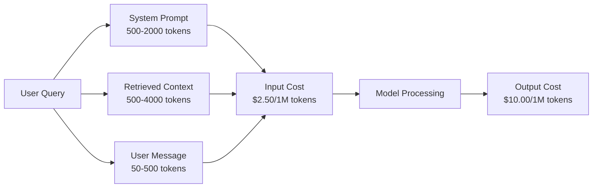
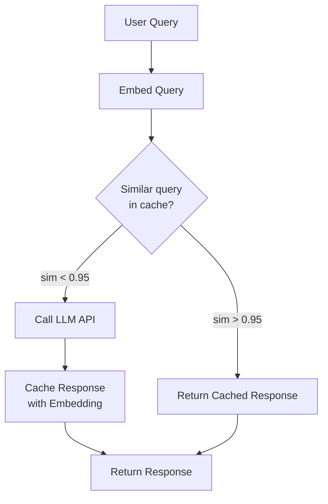
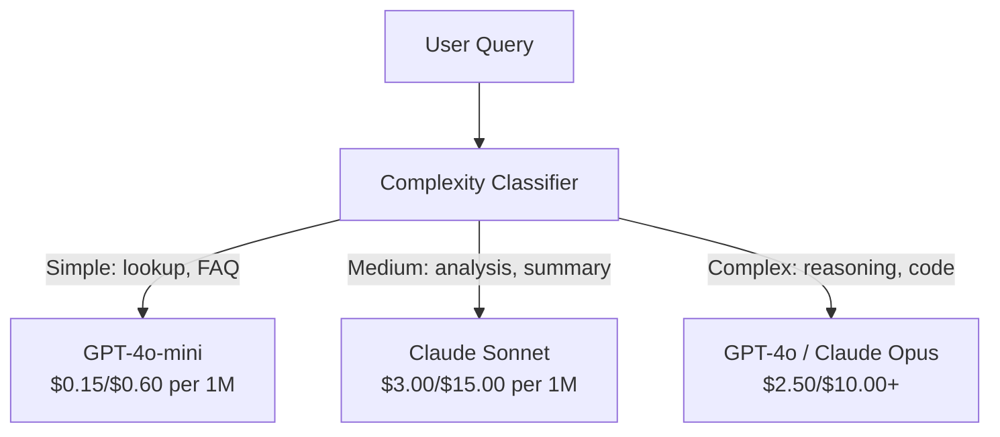

# 缓存,限制流量和成本优化

> 大多数人工智能初创公司不会死于糟糕的模型.它们死于糟糕的单元经济学. 一个GPT-4o电话成本是百分之几.每天10次电话的10千用户仅需250美元的输入代币 - - 在你收取一个美元之前.幸存的公司是那些把每个API电话都视为金融交易,而不是函数电话.

> **【中文解读】**创业公司大多是因为糟糕的单位经济模型而不是糟糕的模型.

> **【拓展：成本优化→AI商业化】**提示缓存(即时缓存) 可降低50-90%的推理成本,语义缓存(语义缓存) 可相似查询重调调合并,是AI 产品实现利的关键──

>  **【前置】**学本节前请先掌握:(1) 阶段11·09(函数调用);(2) 阶段11·04(嵌入式) 语义缓存依赖嵌入;(3) 红化或Memcached 基础──本节会用`redis`,我知道.`fastapi-cache`或`gptcache`,我知道.

**Type:** Build | **类型:** 构建
**Languages:** Python | **语言:** Python
**Prerequisites:** Phase 11 Lesson 09 (Function Calling) | **前置知识:** Phase 11 · 09 (函数调用)
**Time:** ~45 minutes | **时间:** ~45 分钟
**Related:**课程11 · 15 (即时缓存) 本课涵盖应用层缓存 (语义缓存,精确哈希缓存,模型路由).课程15涵盖提供商层即时缓存 (人类缓存_控制,自动开放AI,双胞胎缓存内容). 结合这两者,降低成本50-95%.**相关:**课程15 讲提供商提示缓存 类型缓存 控制 开放AI自动 双子缓存内容 结合两者可降低50-95% 成本。

## 学习目标

- 实现重复或类似的缓存查询,而不是进行新的API调用
  实现语义缓存,从缓存服务重复或相似查询,而不是每次新建API调用
- 计算各供应商的每次请求成本,并实施对代币的意识率限制和预算警报
  跨供应商计算每次请求成本,实现感知代币的流量限制和预算告警
- 建立一个成本优化层,即时压缩,模型路由 (昂贵而廉价),以及响应缓存
  建设成本优化层,含提示压缩,模型路由,
- 设计一个层次缓存策略,使用不同查询类型的精确匹配,语义相似性和预写缓存
  设计分层缓存策略,针对不同的查询类型,使用精确匹配,语义相似度和前缓存

> **【中文解读】**本课目的:掌握LLM 应用成本优化策略快速缓存、语义缓存、模型路由、批量处理――LLM API 成本是生产部署的主要支出――

>  **【类比】**没有缓存的 LLM 应用像餐厅每一个客户就重新种菜慢且贵――三层缓存像三级食材柜:(1)**精确哈希缓存**冰箱里现成菜(同问题直接返回,毫秒);(2) **语义缓存**冷藏室的相似菜嵌入相似度 > 0.95 视为同样的问题,5-20ms);(3) **prompt caching**供应商预切好的菜系统快速使用,省90%的输入成本)

> ️ **【易错点】**缓存的3个坑:**缓存中毒**用户问"我的账户余额多少?"语义缓存命中"上次别人问的余额",返回错误的数字;修复:带用户身份哈希 进缓存密钥,PII/个性化查询不缓存――(2) **相似度阈值过高**0.95 太严,命中率 < 5%;降至0.85 +加 LLM 二次验证("这两个问题是否等价?")―(3) **TTL 太长**新闻类查询缓存24h,模型答案过时;区分查询类型,事实查询TTL=1h,聊TTL=24h──


## 问题 问题引入

你建立了一个RAG聊天机器人,它非常好运作.用户喜欢它.

然后收到账单.

> 你建立了一个RAG聊天机器人. 它运行得很好. 用户很喜欢.

GPT-5成本$5 per million input tokens and $产量为每百万产量15美元.$15 input / $双子座3 Pro的成本$1.25 input / $输出5个.$0.25/$2. 下面的价格说明; 总是查看提供商的当前价格页面.

> GPT-5 每百万输入代币$5，每百万输出 $其他国家$15/$七十五,三星三星是$1.25/$五,五

这就是杀死初创公司的数学:

> 这就是让初创公司倒闭的数学:

- 每天有1万名活跃用户
  十万日利用户
- 每日每用户10次查询
  每日10次查询
- 每次查询的1000个输入代码 (系统提示+文本+用户消息)
  每次查询 1,000 输入代币
- 每个响应的输出代币500个
  每次响应 500 输出代币

**Monthly total:** **$22,500/month**

现在,我们需要一个机器人,一个机器人,一个机器人,一个机器人,一个机器人,一个机器人.

> 这只是一个LLM费用.加上嵌入式,量数据库管理,基础设施.

残酷的部分:这些查询中,40%至60%几乎是重复的.用户用略有不同的词来问相同的问题.系统提示 - - 在每个请求中相同 - - 每次都会被收费. RAG 检索的文本文件在同一主题上重复使用者中.

> 酷的部分:40-60%的查询是近似重复的.用户使用稍微不同的词问相同的问题.

你为冗余的计算付出了全部代价.

> 你在额外计算中支付全部价格.

## 概念的核心概念

> **【中文解读】**简单问题用便宜模型处理 批量处理 合并请求减少调用次数

> **【拓展：LLM 成本的实际数据】**定价$5/$子 子 子 子 子 子 子 子 子 子 子 子 子 子 子 子 子 子 子 子 子 子 子 子 子 子 子 子 子 子 子 子 子 子 子 子 子 子 子 子 子 子 子 子 子 子 子 子 子 子 子 子 子 子 子$3/$通过快速缓存可降低约50% ,使用GPT-4o-mini 替代简单查询可再降低30%──


### 法律法师招聘的成本解剖学

每次API调用都有五个成本组件.

> 每次调用 API 有五个成本组件.



系统提示是无声杀手,一个1500个代币的系统提示,$3.75 per million requests just for that prefix. At 100K requests per day, that is $375天,每月11,250美元,每次不变的文字.

> 系统提示是沉默杀手. 1,500个代币的系统提示每次请求都发送,每百万请求只在前面就花了.$3.75。每天 10 万请求就是 $为了不变的文本.

### 提供商缓存:内置折扣

两家主要供应商都在2026年提供供应商端即时缓存,但机制不同.

> 提供商方面提示缓存,但机制不同.

| Provider | Mechanism | Discount | Minimum | Cache Duration |
|----------|-----------|----------|---------|----------------|
| Anthropic | Explicit cache_control markers | 90% on cache hits (pay 25% extra on write) | 1,024 tokens (Sonnet/Opus), 2,048 (Haiku) | 5 min default; 1h extended (2x write premium) |
| OpenAI | Automatic prefix matching | 50% on cache hits | 1,024 tokens | Best-effort up to 1 hour |
| Google Gemini | Explicit CachedContent API | ~75% reduction (plus storage) | 4,096 (Flash) / 32,768 (Pro) | User-configurable TTL |

**Anthropic's approach**您将标记您的提示部分`cache_control: {"type": "ephemeral"}`首先,要付25%的写费,然后再用相同的预写字符,要获得90%的折扣.$0.005 normally costs $超过100,000个请求,节省了每天437.50美元.

> **Anthropic 方式**是显而易见的.`cache_control: {"type": "ephemeral"}`标记提示段――第一次请求付25% 写入溢价――后续同前请求获得90%折扣――2,000代币 系统提示正常$0.005，缓存命中 $要求省 $437.50/天.

**OpenAI's approach**任何与之前的请求相匹配的提示前置都会获得50%的折扣.不需要标记. 折扣:减少折扣,控制,但实现的努力是零.

> **OpenAI 方式**任何匹配的提示前得到50%折扣.

### 语义缓存:您的定制层

提供商缓存只适用于相同的预先文件.语义缓存处理更难的情况:相同意义的不同的查询.

> 提供商缓存只对相同的前生效而言.

"返回政策是什么?"和"我如何返回一个项目?"是不同的字符串,但意图相同.一个语义缓存嵌入了两个查询,计算了可西因相似性,并返回缓存的响应,如果相似性超过了门 (通常是0.92-0.95).

> "退货政策是什么?"和"我怎么退货?"是不同字符串但意图相同.



嵌入成本是微不足道的.OpenAI的文本嵌入3小程序每百万代币成本为0.02美元.与一个完整的LLM电话相比,检查缓存成本几乎没有什么.

> 嵌入成本可忽略──OpenAI文本嵌入3小 每百万代币0.02美元──检查缓存相比完整的LLM调用几乎零成本──

### 准确缓存:哈希和匹配

对于确定性调用 (温度=0,相同模型,相同提示),准确缓存更简单更快.

> 对于确定性调用 (),精确缓存更简单更快――哈希完整提示,检查缓存,命中则返回――

这对:

> 这对以下场景是非常适合的:

- 系统提示+固定语境+相同的用户查询
  系统提示 + 固定上下文 + 相同用户查询
- 具有相同的工具定义的函数调用
  相同工具定义的函数调用
- 批量处理,其中相同的文件被处理多次
  相同文档多次处理的批量处理

### 限制费用:保护预算

限制率不仅仅是公平,

> 流量不仅仅是公平的问题,是生存的问题.

**Token bucket algorithm:**每个用户都会获得一个桶N代币,以每秒的速度R来充满.一个请求从桶中消耗代币.如果桶空,则请求被拒绝.这允许爆发 (同时使用整个桶) 执行平均率.
**令牌桶算法**每个用户一个N代币桶,按R/秒速率补充. 要求消耗桶中代币.

**Per-user quotas:**设定每用户层每天/月的代币限制.
**每用户配额**按用户级设日/月代币上限.

| Tier | Daily Token Limit | Max Requests/min | Model Access |
|------|------------------|------------------|-------------|
| Free | 50,000 | 10 | GPT-4o-mini only |
| Pro | 500,000 | 60 | GPT-4o, Claude Sonnet |
| Enterprise | 5,000,000 | 300 | All models |

### 模式路由:适合工作的正确模式

不是每一个查询都需要GPT-4o.

> 不是每一个查询都需要GPT-4o.

没有需要一个"什么时候关闭店?"$10/M-output model. GPT-4o-mini at $简单的分类器将廉价查询送到廉价模型,复杂查询送到昂贵模型.

> "店几点关门?"不需要$10/M 输出模型。$输出GPT-4o-mini 完全胜任──$1.25/M 输出Claude Haiku也可以──简单分类器把便宜查询路由到便宜模型,复杂查询路由到贵模型──



通过调节路由器,仅仅在模型成本上节省40-70%.

> 调好路由器单在模型成本上省4070%的成本.

### 追踪成本:知道资金去哪里

您不能优化您不测量的内容.

> 没有任何测量量.

- 时间标签
  时间
- 模型名称
  模型名
- 输入代码
  输入代币
- 输出代码
  输出代币
- 延迟 (ms)
  延迟(毫秒)
- 计算成本 ($)
  计算成本($)
- 用户身份
  用户身份证
- 缓存中击/错失
  缓存命中/未中
- 要求类别
  要求类别

这些数据显示哪些功能昂贵,哪些用户是重量消费者,哪些缓存有最大影响.

> 数据显示哪些功能是贵的,哪些用户消耗量是大,哪些功能存在影响最大.

### 批量:大批折扣

开放AI的批量API以50%折扣处理异步请求.你提交一批多达50,000个请求,结果在24小时内返回.

> 开放AI批量API 异步处理请求,50%折扣――提交最大5万份请求,24小时内回复结果――

使用批量:

> 批量处理用于:

- 晚间处理文件
  晚间文档处理
- 批量分类
  批量分类
- 评估运行
  评估运行
- 数据丰富管道
  数据 流水线

对于:实时用户查询 (延迟问题).
不用于:实时面向用户查询

### 预算警报和断路

没有一个,错误或滥用可以在几个小时内消耗你的月薪.

> 断路器在达到上限时停止支出.没有它,错误或滥用几小时就烧光月预算.

设定三个门:

> 设三个值:

1. **Warning**(预算的70%):发送警报
   **警告**发告警
2. **Throttle**只有更便宜的模型可转换
   **降速**预算85%:只转换为更便宜模型
3. **Stop**拒绝新请求,只返回缓存回复
   **停止**预算95%:拒绝新请求,只返回缓存响应

### 优化堆

按照这些技术进行排序,每个层都与前层相结合.

> 按顺序应用这些技术.

| Layer | Technique | Typical Savings | Implementation Effort |
|-------|-----------|----------------|----------------------|
| 1 | Provider prompt caching | 30-50% | Low (add cache markers) |
| 2 | Exact caching | 10-20% | Low (hash + dict) |
| 3 | Semantic caching | 15-30% | Medium (embeddings + similarity) |
| 4 | Model routing | 40-70% | Medium (classifier) |
| 5 | Rate limiting | Budget protection | Low (token bucket) |
| 6 | Prompt compression | 10-30% | Medium (rewrite prompts) |
| 7 | Batching | 50% on eligible | Low (batch API) |

应用1-5层通常降低成本$22,500/month to $燃烧跑道和建立企业的区别是这么多.

> 应用 1-5层的RAG 应用通常将月费从$22,500 降到 $这就是烧钱和做生意的区别.

### 实际储蓄:前后

这是一个为10万达达尔的RAG聊天机器人提供了真正的破解.

> 这就是服务1万达澳元的RAG机器人的真实分解.

| Metric | Before Optimization | After Optimization | Savings |
|--------|--------------------|--------------------|---------|
| Monthly LLM cost | $22,500 | $5,200 | 77% |
| Avg cost per query | $0.0075 | $0.0017 | 77% |
| Cache hit rate | 0% | 52% | -- |
| Queries routed to mini | 0% | 65% | -- |
| P95 latency | 2,800ms | 900ms (cache hits: 50ms) | 68% |
| Monthly embedding cost | $0 | $180 | (new cost) |
| Total monthly cost | $22,500 | $5,380 | 76% |

语义缓存的嵌入成本 (每月180美元) 在缓存访问的第一小时内自偿.

> 语义缓存的嵌入成本 ($180/月) 在缓存命中的第一小时内就回本.

## 建立它,实现它.
```figure
semantic-cache
```

## 建立它

### 步骤1:成本计算器

建立一个代币成本计算器, 知道主要模型的当前价格.

> 构建代币 成本计算器,知道主要模型当前定价──

```python
import hashlib
import time
import json
import math
from dataclasses import dataclass, field


MODEL_PRICING = {
    "gpt-4o": {"input": 2.50, "output": 10.00, "cached_input": 1.25},
    "gpt-4o-mini": {"input": 0.15, "output": 0.60, "cached_input": 0.075},
    "gpt-4.1": {"input": 2.00, "output": 8.00, "cached_input": 0.50},
    "gpt-4.1-mini": {"input": 0.40, "output": 1.60, "cached_input": 0.10},
    "gpt-4.1-nano": {"input": 0.10, "output": 0.40, "cached_input": 0.025},
    "o3": {"input": 2.00, "output": 8.00, "cached_input": 0.50},
    "o3-mini": {"input": 1.10, "output": 4.40, "cached_input": 0.55},
    "o4-mini": {"input": 1.10, "output": 4.40, "cached_input": 0.275},
    "claude-opus-4": {"input": 15.00, "output": 75.00, "cached_input": 1.50},
    "claude-sonnet-4": {"input": 3.00, "output": 15.00, "cached_input": 0.30},
    "claude-haiku-3.5": {"input": 0.80, "output": 4.00, "cached_input": 0.08},
    "gemini-2.5-pro": {"input": 1.25, "output": 10.00, "cached_input": 0.3125},
    "gemini-2.5-flash": {"input": 0.15, "output": 0.60, "cached_input": 0.0375},
}


def calculate_cost(model, input_tokens, output_tokens, cached_input_tokens=0):
    if model not in MODEL_PRICING:
        return {"error": f"Unknown model: {model}"}
    pricing = MODEL_PRICING[model]
    non_cached = input_tokens - cached_input_tokens
    input_cost = (non_cached / 1_000_000) * pricing["input"]
    cached_cost = (cached_input_tokens / 1_000_000) * pricing["cached_input"]
    output_cost = (output_tokens / 1_000_000) * pricing["output"]
    total = input_cost + cached_cost + output_cost
    return {
        "model": model,
        "input_tokens": input_tokens,
        "output_tokens": output_tokens,
        "cached_input_tokens": cached_input_tokens,
        "input_cost": round(input_cost, 6),
        "cached_input_cost": round(cached_cost, 6),
        "output_cost": round(output_cost, 6),
        "total_cost": round(total, 6),
    }
```

### 步骤2: 准确缓存

按全提示,返回相同请求的缓存响应.

> 哈希完整提示,对相同请求返回缓存响应.

```python
class ExactCache:
    def __init__(self, max_size=1000, ttl_seconds=3600):
        self.cache = {}
        self.max_size = max_size
        self.ttl = ttl_seconds
        self.hits = 0
        self.misses = 0

    def _hash(self, model, messages, temperature):
        key_data = json.dumps({"model": model, "messages": messages, "temperature": temperature}, sort_keys=True)
        return hashlib.sha256(key_data.encode()).hexdigest()

    def get(self, model, messages, temperature=0.0):
        if temperature > 0:
            self.misses += 1
            return None
        key = self._hash(model, messages, temperature)
        if key in self.cache:
            entry = self.cache[key]
            if time.time() - entry["timestamp"] < self.ttl:
                self.hits += 1
                entry["access_count"] += 1
                return entry["response"]
            del self.cache[key]
        self.misses += 1
        return None

    def put(self, model, messages, temperature, response):
        if temperature > 0:
            return
        if len(self.cache) >= self.max_size:
            oldest_key = min(self.cache, key=lambda k: self.cache[k]["timestamp"])
            del self.cache[oldest_key]
        key = self._hash(model, messages, temperature)
        self.cache[key] = {
            "response": response,
            "timestamp": time.time(),
            "access_count": 1,
        }

    def stats(self):
        total = self.hits + self.misses
        return {
            "hits": self.hits,
            "misses": self.misses,
            "hit_rate": round(self.hits / total, 4) if total > 0 else 0,
            "cache_size": len(self.cache),
        }
```

### 步骤3:语义缓存

嵌入查询,并在相似度超过门时返回缓存的答案.

> 嵌入查询,相似度超值时返回缓存响应.

```python
def simple_embed(text):
    words = text.lower().split()
    vocab = {}
    for w in words:
        vocab[w] = vocab.get(w, 0) + 1
    norm = math.sqrt(sum(v * v for v in vocab.values()))
    if norm == 0:
        return {}
    return {k: v / norm for k, v in vocab.items()}


def cosine_similarity(a, b):
    if not a or not b:
        return 0.0
    all_keys = set(a) | set(b)
    dot = sum(a.get(k, 0) * b.get(k, 0) for k in all_keys)
    return dot


class SemanticCache:
    def __init__(self, similarity_threshold=0.85, max_size=500, ttl_seconds=3600):
        self.entries = []
        self.threshold = similarity_threshold
        self.max_size = max_size
        self.ttl = ttl_seconds
        self.hits = 0
        self.misses = 0

    def get(self, query):
        query_embedding = simple_embed(query)
        now = time.time()
        best_match = None
        best_sim = 0.0
        for entry in self.entries:
            if now - entry["timestamp"] > self.ttl:
                continue
            sim = cosine_similarity(query_embedding, entry["embedding"])
            if sim > best_sim:
                best_sim = sim
                best_match = entry
        if best_match and best_sim >= self.threshold:
            self.hits += 1
            best_match["access_count"] += 1
            return {"response": best_match["response"], "similarity": round(best_sim, 4), "original_query": best_match["query"]}
        self.misses += 1
        return None

    def put(self, query, response):
        if len(self.entries) >= self.max_size:
            self.entries.sort(key=lambda e: e["timestamp"])
            self.entries.pop(0)
        self.entries.append({
            "query": query,
            "embedding": simple_embed(query),
            "response": response,
            "timestamp": time.time(),
            "access_count": 1,
        })

    def stats(self):
        total = self.hits + self.misses
        return {
            "hits": self.hits,
            "misses": self.misses,
            "hit_rate": round(self.hits / total, 4) if total > 0 else 0,
            "cache_size": len(self.entries),
        }
```

### 步骤4: 率限制

标记桶率限制器,每用户配额.

> 让牌桶限流器,含每用户配额.

```python
class TokenBucketRateLimiter:
    def __init__(self):
        self.buckets = {}
        self.tiers = {
            "free": {"capacity": 50_000, "refill_rate": 500, "max_requests_per_min": 10},
            "pro": {"capacity": 500_000, "refill_rate": 5_000, "max_requests_per_min": 60},
            "enterprise": {"capacity": 5_000_000, "refill_rate": 50_000, "max_requests_per_min": 300},
        }

    def _get_bucket(self, user_id, tier="free"):
        if user_id not in self.buckets:
            tier_config = self.tiers.get(tier, self.tiers["free"])
            self.buckets[user_id] = {
                "tokens": tier_config["capacity"],
                "capacity": tier_config["capacity"],
                "refill_rate": tier_config["refill_rate"],
                "last_refill": time.time(),
                "request_timestamps": [],
                "max_rpm": tier_config["max_requests_per_min"],
                "tier": tier,
                "total_tokens_used": 0,
            }
        return self.buckets[user_id]

    def _refill(self, bucket):
        now = time.time()
        elapsed = now - bucket["last_refill"]
        refill = int(elapsed * bucket["refill_rate"])
        if refill > 0:
            bucket["tokens"] = min(bucket["capacity"], bucket["tokens"] + refill)
            bucket["last_refill"] = now

    def check(self, user_id, tokens_needed, tier="free"):
        bucket = self._get_bucket(user_id, tier)
        self._refill(bucket)
        now = time.time()
        bucket["request_timestamps"] = [t for t in bucket["request_timestamps"] if now - t < 60]
        if len(bucket["request_timestamps"]) >= bucket["max_rpm"]:
            return {"allowed": False, "reason": "rate_limit", "retry_after_seconds": 60 - (now - bucket["request_timestamps"][0])}
        if bucket["tokens"] < tokens_needed:
            deficit = tokens_needed - bucket["tokens"]
            wait = deficit / bucket["refill_rate"]
            return {"allowed": False, "reason": "token_limit", "tokens_available": bucket["tokens"], "retry_after_seconds": round(wait, 1)}
        return {"allowed": True, "tokens_available": bucket["tokens"]}

    def consume(self, user_id, tokens_used, tier="free"):
        bucket = self._get_bucket(user_id, tier)
        bucket["tokens"] -= tokens_used
        bucket["request_timestamps"].append(time.time())
        bucket["total_tokens_used"] += tokens_used

    def get_usage(self, user_id):
        if user_id not in self.buckets:
            return {"error": "User not found"}
        b = self.buckets[user_id]
        return {
            "user_id": user_id,
            "tier": b["tier"],
            "tokens_remaining": b["tokens"],
            "capacity": b["capacity"],
            "total_tokens_used": b["total_tokens_used"],
            "utilization": round(b["total_tokens_used"] / b["capacity"], 4) if b["capacity"] else 0,
        }
```

### 步骤5: 成本追踪器

记录每一次电话,计算运行总数.

> 记录每次调用并计算累计总额――

```python
class CostTracker:
    def __init__(self, monthly_budget=1000.0):
        self.logs = []
        self.monthly_budget = monthly_budget
        self.alerts = []

    def log_call(self, model, input_tokens, output_tokens, cached_input_tokens=0, latency_ms=0, user_id="anonymous", cache_status="miss"):
        cost = calculate_cost(model, input_tokens, output_tokens, cached_input_tokens)
        entry = {
            "timestamp": time.time(),
            "model": model,
            "input_tokens": input_tokens,
            "output_tokens": output_tokens,
            "cached_input_tokens": cached_input_tokens,
            "latency_ms": latency_ms,
            "cost": cost["total_cost"],
            "user_id": user_id,
            "cache_status": cache_status,
        }
        self.logs.append(entry)
        self._check_budget()
        return entry

    def _check_budget(self):
        total = self.total_cost()
        pct = total / self.monthly_budget if self.monthly_budget > 0 else 0
        if pct >= 0.95 and not any(a["level"] == "stop" for a in self.alerts):
            self.alerts.append({"level": "stop", "message": f"Budget 95% consumed: ${total:.2f}/${self.monthly_budget:.2f}", "timestamp": time.time()})
        elif pct >= 0.85 and not any(a["level"] == "throttle" for a in self.alerts):
            self.alerts.append({"level": "throttle", "message": f"Budget 85% consumed: ${total:.2f}/${self.monthly_budget:.2f}", "timestamp": time.time()})
        elif pct >= 0.70 and not any(a["level"] == "warning" for a in self.alerts):
            self.alerts.append({"level": "warning", "message": f"Budget 70% consumed: ${total:.2f}/${self.monthly_budget:.2f}", "timestamp": time.time()})

    def total_cost(self):
        return round(sum(e["cost"] for e in self.logs), 6)

    def cost_by_model(self):
        by_model = {}
        for e in self.logs:
            m = e["model"]
            if m not in by_model:
                by_model[m] = {"calls": 0, "cost": 0, "input_tokens": 0, "output_tokens": 0}
            by_model[m]["calls"] += 1
            by_model[m]["cost"] = round(by_model[m]["cost"] + e["cost"], 6)
            by_model[m]["input_tokens"] += e["input_tokens"]
            by_model[m]["output_tokens"] += e["output_tokens"]
        return by_model

    def cache_savings(self):
        cache_hits = [e for e in self.logs if e["cache_status"] == "hit"]
        if not cache_hits:
            return {"saved": 0, "cache_hits": 0}
        saved = 0
        for e in cache_hits:
            full_cost = calculate_cost(e["model"], e["input_tokens"], e["output_tokens"])
            saved += full_cost["total_cost"]
        return {"saved": round(saved, 4), "cache_hits": len(cache_hits)}

    def summary(self):
        if not self.logs:
            return {"total_calls": 0, "total_cost": 0}
        total_latency = sum(e["latency_ms"] for e in self.logs)
        cache_hits = sum(1 for e in self.logs if e["cache_status"] == "hit")
        return {
            "total_calls": len(self.logs),
            "total_cost": self.total_cost(),
            "avg_cost_per_call": round(self.total_cost() / len(self.logs), 6),
            "avg_latency_ms": round(total_latency / len(self.logs), 1),
            "cache_hit_rate": round(cache_hits / len(self.logs), 4),
            "cost_by_model": self.cost_by_model(),
            "cache_savings": self.cache_savings(),
            "budget_remaining": round(self.monthly_budget - self.total_cost(), 2),
            "budget_utilization": round(self.total_cost() / self.monthly_budget, 4) if self.monthly_budget > 0 else 0,
            "alerts": self.alerts,
        }
```

### 步骤 6: 路由器模型

导向最便宜的模型,可以处理它们.

> 让查询路由到处理它们的最便宜模型.

```python
SIMPLE_KEYWORDS = ["what time", "hours", "address", "phone", "price", "return policy", "hello", "hi", "thanks", "yes", "no"]
COMPLEX_KEYWORDS = ["analyze", "compare", "explain why", "write code", "debug", "architect", "design", "trade-off", "evaluate"]


def classify_complexity(query):
    q = query.lower()
    if len(q.split()) <= 5 or any(kw in q for kw in SIMPLE_KEYWORDS):
        return "simple"
    if any(kw in q for kw in COMPLEX_KEYWORDS):
        return "complex"
    return "medium"


def route_model(query, tier="pro"):
    complexity = classify_complexity(query)
    routing_table = {
        "simple": {"free": "gpt-4.1-nano", "pro": "gpt-4o-mini", "enterprise": "gpt-4o-mini"},
        "medium": {"free": "gpt-4o-mini", "pro": "claude-sonnet-4", "enterprise": "claude-sonnet-4"},
        "complex": {"free": "gpt-4o-mini", "pro": "gpt-4o", "enterprise": "claude-opus-4"},
    }
    model = routing_table[complexity].get(tier, "gpt-4o-mini")
    return {"query": query, "complexity": complexity, "model": model, "tier": tier}
```

### 步骤 7: 运行演示

> 运行演示.

```python
def simulate_llm_call(model, query):
    input_tokens = len(query.split()) * 4 + 500
    output_tokens = 150 + (len(query.split()) * 2)
    latency = 200 + (output_tokens * 2)
    return {
        "model": model,
        "response": f"[Simulated {model} response to: {query[:50]}...]",
        "input_tokens": input_tokens,
        "output_tokens": output_tokens,
        "latency_ms": latency,
    }


def run_demo():
    print("=" * 60)
    print("  Caching, Rate Limiting & Cost Optimization Demo")
    print("=" * 60)

    print("\n--- Model Pricing ---")
    for model, pricing in list(MODEL_PRICING.items())[:6]:
        cost_1k = calculate_cost(model, 1000, 500)
        print(f"  {model}: ${cost_1k['total_cost']:.6f} per 1K in + 500 out")

    print("\n--- Cost Comparison: 100K Requests ---")
    for model in ["gpt-4o", "gpt-4o-mini", "claude-sonnet-4", "claude-haiku-3.5"]:
        cost = calculate_cost(model, 1000 * 100_000, 500 * 100_000)
        print(f"  {model}: ${cost['total_cost']:.2f}")

    print("\n--- Anthropic Cache Savings ---")
    no_cache = calculate_cost("claude-sonnet-4", 2000, 500, 0)
    with_cache = calculate_cost("claude-sonnet-4", 2000, 500, 1500)
    saving = no_cache["total_cost"] - with_cache["total_cost"]
    print(f"  Without cache: ${no_cache['total_cost']:.6f}")
    print(f"  With 1500 cached tokens: ${with_cache['total_cost']:.6f}")
    print(f"  Savings per call: ${saving:.6f} ({saving/no_cache['total_cost']*100:.1f}%)")

    exact_cache = ExactCache(max_size=100, ttl_seconds=300)
    semantic_cache = SemanticCache(similarity_threshold=0.75, max_size=100)
    rate_limiter = TokenBucketRateLimiter()
    tracker = CostTracker(monthly_budget=100.0)

    print("\n--- Exact Cache ---")
    messages_1 = [{"role": "user", "content": "What is the return policy?"}]
    result = exact_cache.get("gpt-4o-mini", messages_1, 0.0)
    print(f"  First lookup: {'HIT' if result else 'MISS'}")
    exact_cache.put("gpt-4o-mini", messages_1, 0.0, "You can return items within 30 days.")
    result = exact_cache.get("gpt-4o-mini", messages_1, 0.0)
    print(f"  Second lookup: {'HIT' if result else 'MISS'} -> {result}")
    result = exact_cache.get("gpt-4o-mini", messages_1, 0.7)
    print(f"  With temp=0.7: {'HIT' if result else 'MISS (non-deterministic, skip cache)'}")
    print(f"  Stats: {exact_cache.stats()}")

    print("\n--- Semantic Cache ---")
    test_queries = [
        ("What is the return policy?", "Items can be returned within 30 days with receipt."),
        ("How do I return an item?", None),
        ("What are your store hours?", "We are open 9am-9pm Monday through Saturday."),
        ("When does the store open?", None),
        ("Tell me about quantum computing", "Quantum computers use qubits..."),
        ("Explain quantum mechanics", None),
    ]
    for query, response in test_queries:
        cached = semantic_cache.get(query)
        if cached:
            print(f"  '{query[:40]}' -> CACHE HIT (sim={cached['similarity']}, original='{cached['original_query'][:40]}')")
        elif response:
            semantic_cache.put(query, response)
            print(f"  '{query[:40]}' -> MISS (stored)")
        else:
            print(f"  '{query[:40]}' -> MISS (no match)")
    print(f"  Stats: {semantic_cache.stats()}")

    print("\n--- Rate Limiting ---")
    for i in range(12):
        check = rate_limiter.check("user_1", 1000, "free")
        if check["allowed"]:
            rate_limiter.consume("user_1", 1000, "free")
        status = "OK" if check["allowed"] else f"BLOCKED ({check['reason']})"
        if i < 5 or not check["allowed"]:
            print(f"  Request {i+1}: {status}")
    print(f"  Usage: {rate_limiter.get_usage('user_1')}")

    print("\n--- Model Routing ---")
    routing_queries = [
        "What time do you close?",
        "Summarize this quarterly earnings report",
        "Analyze the trade-offs between microservices and monoliths",
        "Hello",
        "Write code for a binary search tree with deletion",
    ]
    for q in routing_queries:
        route = route_model(q, "pro")
        print(f"  '{q[:50]}' -> {route['model']} ({route['complexity']})")

    print("\n--- Full Pipeline: Before vs After Optimization ---")
    queries = [
        "What is the return policy?",
        "How do I return something?",
        "What are your hours?",
        "When do you open?",
        "Explain the difference between TCP and UDP",
        "Compare TCP vs UDP protocols",
        "Hello",
        "What is your phone number?",
        "Write a Python function to sort a list",
        "Analyze the pros and cons of serverless architecture",
    ]

    print("\n  [Before: no caching, single model (gpt-4o)]")
    tracker_before = CostTracker(monthly_budget=1000.0)
    for q in queries:
        result = simulate_llm_call("gpt-4o", q)
        tracker_before.log_call("gpt-4o", result["input_tokens"], result["output_tokens"], latency_ms=result["latency_ms"], cache_status="miss")
    before = tracker_before.summary()
    print(f"  Total cost: ${before['total_cost']:.6f}")
    print(f"  Avg cost/call: ${before['avg_cost_per_call']:.6f}")
    print(f"  Avg latency: {before['avg_latency_ms']}ms")

    print("\n  [After: caching + routing + rate limiting]")
    exact_c = ExactCache()
    semantic_c = SemanticCache(similarity_threshold=0.75)
    tracker_after = CostTracker(monthly_budget=1000.0)

    for q in queries:
        messages = [{"role": "user", "content": q}]
        cached = exact_c.get("gpt-4o", messages, 0.0)
        if cached:
            tracker_after.log_call("gpt-4o-mini", 0, 0, latency_ms=5, cache_status="hit")
            continue
        sem_cached = semantic_c.get(q)
        if sem_cached:
            tracker_after.log_call("gpt-4o-mini", 0, 0, latency_ms=15, cache_status="hit")
            continue
        route = route_model(q)
        result = simulate_llm_call(route["model"], q)
        tracker_after.log_call(route["model"], result["input_tokens"], result["output_tokens"], latency_ms=result["latency_ms"], cache_status="miss")
        exact_c.put(route["model"], messages, 0.0, result["response"])
        semantic_c.put(q, result["response"])

    after = tracker_after.summary()
    print(f"  Total cost: ${after['total_cost']:.6f}")
    print(f"  Avg cost/call: ${after['avg_cost_per_call']:.6f}")
    print(f"  Avg latency: {after['avg_latency_ms']}ms")
    print(f"  Cache hit rate: {after['cache_hit_rate']:.0%}")

    if before["total_cost"] > 0:
        savings_pct = (1 - after["total_cost"] / before["total_cost"]) * 100
        print(f"\n  SAVINGS: {savings_pct:.1f}% cost reduction")
        print(f"  Latency improvement: {(1 - after['avg_latency_ms'] / before['avg_latency_ms']) * 100:.1f}% faster")

    print("\n--- Budget Alerts Demo ---")
    alert_tracker = CostTracker(monthly_budget=0.01)
    for i in range(5):
        alert_tracker.log_call("gpt-4o", 5000, 2000, latency_ms=500)
    print(f"  Total spent: ${alert_tracker.total_cost():.6f} / ${alert_tracker.monthly_budget}")
    for alert in alert_tracker.alerts:
        print(f"  ALERT [{alert['level'].upper()}]: {alert['message']}")

    print("\n--- Cost Breakdown by Model ---")
    multi_tracker = CostTracker(monthly_budget=500.0)
    for _ in range(50):
        multi_tracker.log_call("gpt-4o-mini", 800, 200, latency_ms=150)
    for _ in range(30):
        multi_tracker.log_call("claude-sonnet-4", 1500, 500, latency_ms=400)
    for _ in range(10):
        multi_tracker.log_call("gpt-4o", 2000, 800, latency_ms=600)
    for _ in range(10):
        multi_tracker.log_call("claude-opus-4", 3000, 1000, latency_ms=1200)
    breakdown = multi_tracker.cost_by_model()
    for model, data in sorted(breakdown.items(), key=lambda x: x[1]["cost"], reverse=True):
        print(f"  {model}: {data['calls']} calls, ${data['cost']:.6f}, {data['input_tokens']:,} in / {data['output_tokens']:,} out")
    print(f"  Total: ${multi_tracker.total_cost():.6f}")

    print("\n" + "=" * 60)
    print("  Demo complete.")
    print("=" * 60)


if __name__ == "__main__":
    run_demo()
```

## 用它实现框架

### 人类即时缓存

> 人类提示缓存──

```python
# import anthropic
#
# client = anthropic.Anthropic()
#
# response = client.messages.create(
#     model="claude-sonnet-5",
#     max_tokens=1024,
#     system=[
#         {
#             "type": "text",
#             "text": "You are a helpful customer support agent for Acme Corp...",
#             "cache_control": {"type": "ephemeral"},
#         }
#     ],
#     messages=[{"role": "user", "content": "What is the return policy?"}],
# )
#
# print(f"Input tokens: {response.usage.input_tokens}")
# print(f"Cache creation tokens: {response.usage.cache_creation_input_tokens}")
# print(f"Cache read tokens: {response.usage.cache_read_input_tokens}")
```

首次调用时,将其写入缓存中 (25%的溢价).每次使用相同的系统提示前的接下来的调用都会从缓存中读取 (90%折扣).缓存持续5分钟,每次击中时,会重新设置计时器.

> 首次调用写缓存(25% 溢价) ・后续同系统提示前的调用读缓存(90% 折扣) ・缓存 5 分钟,每次命中重置计时器──

### 开放AI自动缓存

> 开放AI自动缓存

```python
# from openai import OpenAI
#
# client = OpenAI()
#
# response = client.chat.completions.create(
#     model="gpt-4o",
#     messages=[
#         {"role": "system", "content": "You are a helpful customer support agent..."},
#         {"role": "user", "content": "What is the return policy?"},
#     ],
# )
#
# print(f"Prompt tokens: {response.usage.prompt_tokens}")
# print(f"Cached tokens: {response.usage.prompt_tokens_details.cached_tokens}")
# print(f"Completion tokens: {response.usage.completion_tokens}")
```

任何与最近的请求相匹配的1024+代币的提示预先符号都获得50%的折扣.不需要更改代码 - 只需查看`prompt_tokens_details.cached_tokens`为了验证它是否有效.

> 任何 1,024+ 代币 匹配近期请求的提示前获得 50% 折扣`prompt_tokens_details.cached_tokens`验证即可.

### 开放AI批量API

> 开放AI批量API──

```python
# import json
# from openai import OpenAI
#
# client = OpenAI()
#
# requests = []
# for i, query in enumerate(queries):
#     requests.append({
#         "custom_id": f"request-{i}",
#         "method": "POST",
#         "url": "/v1/chat/completions",
#         "body": {
#             "model": "gpt-4o-mini",
#             "messages": [{"role": "user", "content": query}],
#         },
#     })
#
# with open("batch_input.jsonl", "w") as f:
#     for r in requests:
#         f.write(json.dumps(r) + "\n")
#
# batch_file = client.files.create(file=open("batch_input.jsonl", "rb"), purpose="batch")
# batch = client.batches.create(input_file_id=batch_file.id, endpoint="/v1/chat/completions", completion_window="24h")
# print(f"Batch ID: {batch.id}, Status: {batch.status}")
```

批量API给所有代币提供50%折扣.结果到达24小时内. 非常适合非实时工作负载:评估,数据标签,批量总结.

> 批量API 统一 50% 折扣. 结果 24 小时内回归.

### 制作语义缓存与Redis

> 生产语义缓存配 红色

```python
# import redis
# import numpy as np
# from openai import OpenAI
#
# r = redis.Redis()
# client = OpenAI()
#
# def get_embedding(text):
#     response = client.embeddings.create(model="text-embedding-3-small", input=text)
#     return response.data[0].embedding
#
# def semantic_cache_lookup(query, threshold=0.95):
#     query_emb = np.array(get_embedding(query))
#     keys = r.keys("cache:emb:*")
#     best_sim, best_key = 0, None
#     for key in keys:
#         stored_emb = np.frombuffer(r.get(key), dtype=np.float32)
#         sim = np.dot(query_emb, stored_emb) / (np.linalg.norm(query_emb) * np.linalg.norm(stored_emb))
#         if sim > best_sim:
#             best_sim, best_key = sim, key
#     if best_sim >= threshold and best_key:
#         response_key = best_key.decode().replace("cache:emb:", "cache:resp:")
#         return r.get(response_key).decode()
#     return None
```

在生产中,用向量索引 (Redis Vector Search,Pinecone,或pgvector) 取代线性扫描.线性扫描对<1,000条目工作.此外,使用ANN (近邻近) 搜索O(log n).

> 生产中使用向量索引(Redis Vector Search、Pinecone 或 pgvector) 替换线性扫描──线性扫描适用 <1,000条目──超过使用 ANN(近似近邻)实现 O(log n) 查找──

## 运送它.

这一课产生了`outputs/prompt-cost-optimizer.md`分析您的LLM申请,并建议您预计节省的具体成本优化.

> 本课产出发 `outputs/prompt-cost-optimizer.md`分析 LLM 应用并推具体成本优化 (含预计节省) 的可复用提示.

它还产生了`outputs/skill-cost-patterns.md`-- 选择合适的缓存策略,限制速度配置,以及适用于您的使用情况的路由规则的决策框架.

> 产出`outputs/skill-cost-patterns.md`基于使用例选择合适缓存策略,限流配置和模型路由规则的决策框架.

## 练习题

1. **Implement LRU eviction for the semantic cache.**取代最古老的首次驱逐出,用最不近期的驱逐出. 追踪每个输入的最后访问时间,并在缓存充满时驱逐出最古老的访问时间的输入. 比较两种策略之间的攻击率超过100个查询.
   **为语义缓存实现 LRU 淘汰。**用最久未使用替换最早优先淘汰――追踪每条最后访问时间,缓存满时淘汰访问时间最旧条目――在100个查询上比较两种策略命运率――

2. **Build a cost projection tool.**根据API调用日志 (CostTracker日志),根据后期7天的平均值,预测月费. 计算周末/周末的模式. 如果预测月费超过预算20%.
   **构建成本预测工具。**给定API 调用日志(CostTracker 日志),按7天移动平均预测月成本──考虑工作日/周末模式──若预测月成本超预算20% 触发告警──

3. **Implement tiered semantic caching.**使用两个类似性门:高信任率的击中为0.98 (立即返回) 和中等信任率的击中为0.90 (返回免责声明:"基于类似的前面问题..."). 追踪每个击中来自哪个层次,并测量用户满意度差异.
   **实现分层语义缓存。**用两个相似度值:0.98 高置信命中 ((立即回归) 和0.90 中置信命中 ((带免责声明回归:"基于类似的过往问题...") 追踪每次命中来源层次,测量用户满意度差异――

4. **Build a model routing classifier.**替换基于关键字的分类器,使用基于嵌入式的分类器.嵌入50个标记式查询 (简单/中等/复杂),然后通过找到最近的标记式示例来分类新查询.测量分类精度与20个查询的测试集.
   **构建模型路由分类器。**通过找到最近的标签样本分类新查询,在20个测试集中测试分类准确率.

5. **Implement a circuit breaker with degradation levels.**在70%的预算下,记录一个警告.在85%的预算下,自动将所有路由转换到最便宜的模型 (gpt-4o-mini).在95%的预算下,只提供缓存的响应,拒绝新的查询.通过模拟1000个请求与1.00美元的预算进行测试,并检查每个门的触发正确.
   **实现带降级层级的断路器。**只有服务缓存响应并拒绝新查询――使用1000个请求模拟1.00美元 预算测试,验证各值正确触发――

## 关键词 快速查找表

| Term | What people say | What it actually means | 中文释义 |
|------|----------------|----------------------|---------|
| Prompt caching | "Cache the system prompt" | Provider-level caching where repeated prompt prefixes get a discount (90% Anthropic, 50% OpenAI) -- no code changes for OpenAI, explicit markers for Anthropic | 提示缓存：提供商级缓存，重复提示前缀得折扣（Anthropic 90%，OpenAI 50%）——OpenAI 无需改代码，Anthropic 需显式标记 |
| Semantic caching | "Smart caching" | Embedding the query, computing similarity to past queries, and returning the cached response if similarity exceeds a threshold -- catches paraphrases that exact matching misses | 语义缓存：嵌入查询，与过往查询算相似度，超阈值返回缓存响应——抓住精确匹配漏掉的改写 |
| Exact caching | "Hash caching" | Hashing the full prompt (model + messages + temperature) and returning the cached response for identical inputs -- only works for temperature=0 deterministic calls | 精确缓存：哈希完整提示（模型 + 消息 + 温度），相同输入返回缓存响应——仅 temperature=0 确定性调用可用 |
| Token bucket | "Rate limiter" | An algorithm where each user has a bucket of N tokens that refills at rate R per second -- allows bursts up to N while enforcing an average rate of R | 令牌桶：每用户 N token 桶按 R/秒补充——允许最大 N 突发同时强制平均速率 R |
| Model routing | "Cheapskate routing" | Using a classifier to send simple queries to cheap models (GPT-4o-mini, Haiku) and complex queries to expensive models (GPT-4o, Opus) -- saves 40-70% on model costs | 模型路由：用分类器把简单查询送便宜模型、复杂查询送贵模型——节省 40-70% 模型成本 |
| Cost tracking | "Metering" | Logging every API call with model, tokens, latency, cost, and user ID so you know exactly where money goes and which features are expensive | 成本追踪：每次 API 调用记录模型、token、延迟、成本和用户 ID，精确知道钱花在哪里 |
| Circuit breaker | "Kill switch" | Automatically degrading service (cheaper models, cached-only) or stopping requests entirely when spending approaches the budget limit | 断路器：支出接近预算上限时自动降级（便宜模型、仅缓存）或完全停止请求 |
| Batch API | "Bulk discount" | OpenAI's asynchronous processing at 50% discount -- submit up to 50,000 requests, get results within 24 hours | Batch API：OpenAI 异步处理 50% 折扣——提交最多 5 万请求，24 小时内得结果 |
| Prompt compression | "Token diet" | Rewriting system prompts and context to use fewer tokens while preserving meaning -- shorter prompts cost less and often perform better | 提示压缩：重写系统提示和上下文用更少 token 保含义——更短提示更便宜且常更优 |
| Cache hit rate | "Cache efficiency" | The percentage of requests served from cache instead of calling the LLM -- 40-60% is typical for production chatbots, saves proportionally on cost | 缓存命中率：从缓存而非调用 LLM 服务的请求百分比——生产聊天机器人典型 40-60%，按比例省钱 |

## 继续阅读 继续阅读

- [Anthropic Prompt Caching Guide](https://docs.anthropic.com/en/docs/build-with-claude/prompt-caching)-- 对于安卓的明确缓存控制标记,定价和缓存寿命行为的官方文件
  人类提示缓存指南 人类显然缓存_控制 标记、定价和缓存生命周期行为的官方文档
- [OpenAI Prompt Caching](https://platform.openai.com/docs/guides/prompt-caching)-- OpenAI的自动缓存,如何通过使用字段验证缓存击中,以及最低预写长度
  开放AI提示缓存开放AI自动缓存、如何通过使用 字段验证缓存命中、最小前长度
- [OpenAI Batch API](https://platform.openai.com/docs/guides/batch)-- 50%的折扣,以异步处理,JSONL格式,24小时完成窗口,以及50K的请求限制
  开放AI批量API异步处理 50%折扣 JSONL 格式、24小时完成窗口和5万请求限制
- [GPTCache](https://github.com/zilliztech/GPTCache)-- 支持多个嵌入式后端,向量存储和驱逐政策的开源语义缓存库
  支持多种嵌入后端,向量存储和淘汰策略
- [Martian Model Router](https://docs.withmartian.com)-- 生产模型路由,自动选择能够处理每个查询的最便宜模型
  火星模型路由器生产级模型路由,自动选择能处理每次查询的最便宜模型
- [Not Diamond](https://www.notdiamond.ai)--基于ML的路由器模型,从你的流量模式中学习,以优化提供商之间的成本/质量交易
  不是基于ML的模型路由,从流量模式学习以优化跨供应商的成本/质量权衡
- [Helicone](https://www.helicone.ai)-- 具有成本跟踪,缓存,利率限制和预算警报的LLM可观测平台作为代理层
  作为代理层,包括成本追踪,缓存,限流和预算告警.
- [Dean & Barroso, "The Tail at Scale" (CACM 2013)](https://research.google/pubs/the-tail-at-scale/)延迟,吞吐量,TTFT/TPOT百分比,以及对冲要求;
  迪恩和巴罗索"尾在规模" (CACM 2013) 延迟、吞吐、TTFT/TPOT 百分位和对冲请求;"选满足P95最便宜模型"背后的成本模型――
- [Kwon et al., "Efficient Memory Management for Large Language Model Serving with PagedAttention" (SOSP 2023)](https://arxiv.org/abs/2309.06180)由于"KV缓存"+连续批量超过了24倍的无辜服务器,
  由于"缓存与成本"下基础设施层,
- [Dao et al., "FlashAttention-2: Faster Attention with Better Parallelism and Work Partitioning" (ICLR 2024)](https://arxiv.org/abs/2307.08691)根据本核级成本降低的指标, 提示缓存; 阅读与投机解码和GQA一起,
  根据"FlashAttention-2" (ICLR 2024) 的数据,核成本下降,与投机解码和GQA的相关信息进行了全面的理解.
