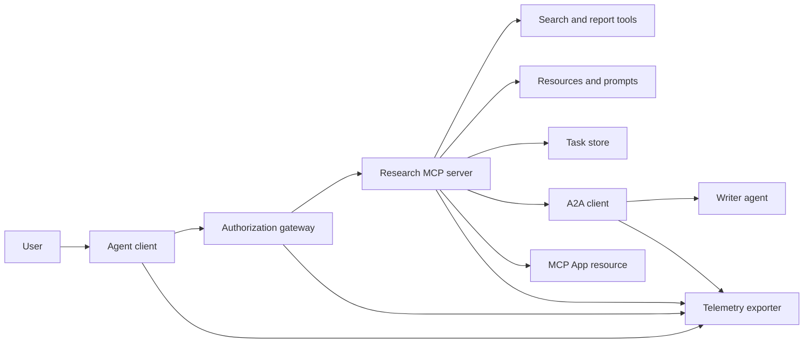
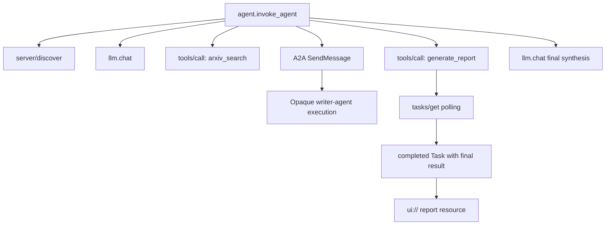
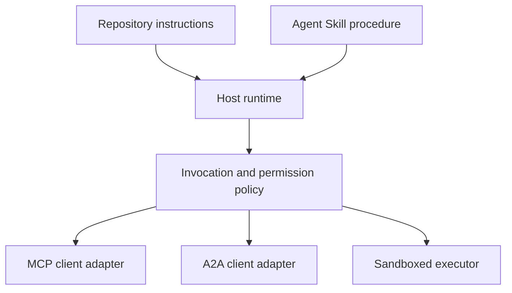

# 没有状态的工具生态系统

> 生产代理系统是一个界限集,而不是一个功能堆. 这块结石分开了可读的过程模拟,从协议客户端,授权服务器,沙箱和远程仪表出口者,一个实际部署仍然需要.

> **【中文解读】**产阶级代理 系统是一个边界,不是一堆功能. 本毕业项目根据MCP 2026-07-28 规范将一个"研究与报告"场景分解成可读的过程模拟:协议版本/客户端身份/能力随着每个请求携带先.`server/discover`再用工具长任务走任务扩展 A2A委托写作 代理`ui://`报告资源、OTel 全链路跨度──模拟与生产的边界被明确标记着,每个模拟层都应对一个必须被替换的真实组件──

> **【拓展：为什么强调"无状态"】**移除协议会话与 `initialize`握手,也移除了`Mcp-Session-Id`版本,能力,身份,每一个请求都改变了`_meta`字段,服务器必须实现`server/discover`应应第18课"每一个请求独立验证"),长任务必须落在持久的任务 存储而不是连接. 本毕业项目正是围绕这个新集成边界组织的.

>  **【前置】**本课是第十三阶段收官,综合 01-22 全部课程:01-05(工具接口与方案) 、06-14(无状态 MCP 信封、发现、传输、资源、提示、扩展与应用) 、15-18(投毒防御、OAuth、网关、生产认证) 、19(A2A 委托) 、20(OTel GenAI 追踪) 、21(模型路由) 、22(技能契约) 建议先完成第十八课和第十二课再学本课.

**Type:** Build | **类型:** 构建
**Languages:** Python (stdlib, in-process simulation) | **语言:** Python（标准库，进程内模拟）
**Prerequisites:** Phase 13 · 01 through 22, using MCP revision `2026-07-28` | **前置知识:** Phase 13 · 01 至 22（基于 MCP `2026-07-28` 修订版）
**Time:** ~120 minutes | **时间:** 约 120 分钟

## 学习目标

- 编写工具调用,任务形状的结果,委托工作,UI资源,授权政策,并将记录记录记录集成到一个流程中.
  中文翻译:把工具调用"",任务形态的结果"",委托工作"",UI资源"",授权策略和追踪记录组合进一个流程"",
- 在每个MCP请求中运行协议版本,客户端身份和功能,而不是依赖连接会话.
  中文翻译: 在每个MCP 请上携带协议版本、客户端身份和能力,而不是依赖连接会话──
- 在使用前发现服务器,并通过官方任务扩展程序进行长时间工作.
  中文翻译:使用前先发现服务器,并通过官方任务 扩展驱动长时工作。
- 区分一个协议形状的模拟与MCP,A2A,OAuth或OpenTelemetry实现.
  中文翻译:区分"形似协议的模拟"与真正的MCP、A2A、OAuth或OpenTelemetry实现.
- 绘制每个模拟的边界,将其取代的生产元件绘制出来.
  中文翻译:把每个模拟边界映射到必须替换它的生产组件.
- 保持`AGENTS.md`机器,机器,安全政策,
  中文翻译:让 `AGENTS.md`‧代理技能‧运行时适配器‧工具和安全策略各位位──
- 解释哪些索赔可以从本地输出中验证,哪些需要实时集成测试.
  中文翻译:说明哪些断言可以从本地输出验证,哪些需要真实集成测试――

## 问题 问题引入

> **【中文解读】**设计一个"研究与报告"系统:用户需要代理协议论文,系统搜索论文目录,委托摘要,生成报告,返回UI资源并记录全链路.`code/main.py`用普通函数和字典把这些边界保持可见,不打开传输,不联系 arXiv,不做 OAuth,不染应用,不导出遥测,不把模拟伪装成合规服务.

设计一个研究和报告系统.用户要求关于代理协议的论文.系统搜索了纸质目录,委托了总结,生成了报告,返回了一个UI资源,并记录了系统的路径.

> 设计一个研究与报告系统.用户需要代理协议相关论文.系统搜索论文目录.委托摘要.生成报告.返回UI资源.并记录系统的路径.

这句话隐藏了几个独立的合同:

> 这句话背后包含了几个独立契约:

- 模型面向的工具方案;
  中文翻译:面向模型的工具方案;
- 无国籍请求包和服务器发现合同;
  中文翻译:无状态请求信封与服务器发现契约;
- 关口决定参与者,范围和工具身份;
  中文翻译:针对演员的网关决策;
- 长期运营合同;
  中文翻译:长时操作契约;
- 委托议定书;
  中文翻译:委托协议;
- 接待者与应用程序之间的桥梁;
  中文翻译:宿主到应用的桥接;
- 痕迹传播和出口;
  中文翻译:trace 传播与导出;
- 可重复使用的操作程序.
  中文翻译:可复用操作流程──

`code/main.py`它不会打开传输,联系 arXiv,执行 OAuth,调用A2A服务器,染MCP应用程序或导出远程测量.这使得控制流程很容易检查,而不需要呈现模拟为符合服务.

> `code/main.py`使用普通的Python函数和字典把这些边界保持可见――它不打开传输、不联系 arXiv、不执行 OAuth、不调用A2A 服务器、不染 MCP App、不导出遥测――这使控制流易于检查,同时不把模拟包装成合规服务――

## 概念的核心概念

> **【中文解读】**本节给出目标架构与目标追踪 (Mermaid) 现行协议面速查表,2026-07-28 无状态MCP对集成边界的变化,安全状况,技能是流程而不是传输,课程工件元数据是本地适应器,模拟和生产的层次对照表,以及第13期全课程贡献图.

### 目标架构



建筑是公共协议模式的概念组成. 它不是关于任何产品的私人内部的声明.

> 这架构是公开协议模式的概念组合,而不是对任何产品的私有内幕断言.

### 目标追踪



在实际实现中,每个跳跃都传播了痕迹背景. 跨度名称和属性必须遵循由选定的仪器版本支持的OpenTelemetry语义公约.单独的共享痕迹识别符不能证明正确的亲属,出口或后端摄入.

> 在真实实现中,每一个跳都要传播痕迹 上下文──西班牙名称和属性必须遵循所选的仪器 版本支持的OpenTelemetry语义约定──只有一个共享的痕迹ID 并不能证明父子关系、导出或后端摄取正确──

### 现行协议表面

使用当前协议所定义的方法名称,而不是从旧草案中记忆的名称:

> 使用当前协议定义的方法名,而不是旧草案记忆里的名字:

| Boundary | Current surface | What the capstone simulates |
|---|---|---|
| MCP discovery | Mandatory `server/discover` | A direct function returning versions, capabilities, and server identity |
| MCP request context | Version, capabilities, and client identity in every `params._meta` | Fresh request metadata passed to every simulated call |
| MCP tool call | `tools/call` | Direct Python function dispatch |
| MCP task polling | `io.modelcontextprotocol/tasks` with `tasks/get` | A working handle followed by a completed task carrying its final result |
| A2A delegation | `SendMessage` in gRPC and JSON-RPC; `POST /message:send` in HTTP+JSON | One nested span with no remote call or artificial delay |
| MCP App calling a server tool | `app.callServerTool({ name, arguments })` | An HTML string with no live bridge |
| OAuth authorization | Authorization server, protected-resource metadata, audience and scope validation | Static token lookup and scope membership |
| OpenTelemetry | SDK, propagator, exporter, and collector or backend | In-memory span dictionaries |

协议名称仅仅是第一层. 生产测试必须在实线上进行序列化,身份验证故障,取消,时间切断,重试和版本兼容性.

> 协议名仅仅是第一层.生产测试必须在真实线上演练序列化,认证失败,取消,超时,重试和版本兼容.

### 无国籍的MCP改变了集成边界

> **【中文解读】**2026-07-28 修订版移除协议会话与 `initialize`现在,我们要去.`notifications/initialized`握手,也移除`Mcp-Session-Id`,每个请求都带着命名空间.`_meta`字段(协议版本、客户端能力、客户端身份) ――服务器必须实现`server/discover`普通结果使用`resultType: "complete"`任务句柄用`resultType: "task"` 扩展任务只有`tasks/get`,我知道.`tasks/update`,我知道.`tasks/cancel` `tasks/result`和 `tasks/list`已不属于当前扩展;客户端必须在可能收到任务句柄的相同请求中声明`io.modelcontextprotocol/tasks`能力,否则服务器返回 `-32021`附加`requiredCapabilities`,我知道.

修订`2026-07-28`删除协议会议和`initialize`现在,`notifications/initialized`握手,也可以消除`Mcp-Session-Id`每个请求都包含这些名字空间`_meta`字段:

> `2026-07-28`修订版移除了协议会话与`initialize`现在,`notifications/initialized`握手,也移除了`Mcp-Session-Id`,每个请求都带着这些空间化名称.`_meta`字段:

```json
{
  "io.modelcontextprotocol/protocolVersion": "2026-07-28",
  "io.modelcontextprotocol/clientCapabilities": {
    "extensions": {
      "io.modelcontextprotocol/tasks": {}
    }
  },
  "io.modelcontextprotocol/clientInfo": {
    "name": "capstone-client",
    "version": "1.0.0"
  }
}
```

服务器必须实现`server/discover`常见结果使用`resultType: "complete"`任务处理器使用`resultType: "task"`每个结果都应该在 `_meta.io.modelcontextprotocol/serverInfo`现在,我们要去.

> 服务器必须实现`server/discover`△普通结果使用`resultType: "complete"`任务句柄使用`resultType: "task"`,每个结果都应在`_meta.io.modelcontextprotocol/serverInfo`中标明服务器身份──

任务延长已`tasks/get`现在`tasks/update`其他`tasks/cancel`一个工具可能首先返回`resultType: "task"`其他`tasks/get`它们本身回来了.`resultType: "complete"`完成的`Task`总体而言,`tasks/result`其他`tasks/list`客户必须宣传 `io.modelcontextprotocol/tasks`如果没有,服务器会返回 `-32021`随着`requiredCapabilities`形状为缺失客户能力对象,包括`extensions.io.modelcontextprotocol/tasks`现在,我们要去.

> 任务 扩展有`tasks/get`,我知道.`tasks/update`,我知道.`tasks/cancel`工具可以先回来`resultType: "task"`其他`tasks/get`自身回归`resultType: "complete"`完成的`Task`里装着最终结果.`tasks/result`与`tasks/list`不属于当前扩展. 客户端必须在可能收到任务句子的相同请求中声明.`io.modelcontextprotocol/tasks`能力;若不声明,服务器返回 `-32021`并且`requiredCapabilities`中 提供缺失的客户端能力对象形态`extensions.io.modelcontextprotocol/tasks`

### 安全姿势

> **【中文解读】**目标部署采用纵深防御:PKCE (按客户端类型) 资源与受众绑定,网关 RBAC 检查工具和范围 上游凭证设置于模型可见上下文之外的锁定或审查过的工具描述清单 针对不可信的输入/敏感数据/后果行为规则 两 条 以及由主管在审查 技能之外的强制执行沙箱 文件系统/进程/网络/凭证/资源限制) 展示只实现静态代币,范围检查和描述哈希希适用于演练策略流,不适用于安全验证.

预期部署使用深度防御:

> 目标部署采用全身防御:

- 客户端类型要求的PKCE的OAuth授权;
  中文翻译:按客户端类型需要启用带PKCE的 OAuth 授权;
- 发行访问令牌的资源和观众绑定;
  中文翻译:对签发的访问代币做资源与受众绑定;
- 通过RBAC检查所需工具和范围的门口;
  中文翻译:网关 RBAC 检查被请求的工具和范围;
- 存储在模型可见的背景之外的上游凭证;
  中文翻译:上游凭证保存在模型可见上下文之外;
- 置或审查的工具描述说明书;
  中文翻译:锁定或经审查的工具描述清单;
- 对于不值得信赖的输入,敏感数据和后续行动的第二规则审查;
  中文翻译:对不可信的输入,敏感数据和后果性行为执行第二条规则审查;
- 执行沙箱,其文件系统,进程,网络,凭证和资源限制在技能之外被执行.
  中文翻译:执行沙箱的文件系统、进程、网络、凭证和资源限制在技能之外强制执行.

演示程序只实现静态代币,范围检查和描述哈希. 它是用于政策流动,而不是安全验证.

> 演示仅实现静态代币,范围检查和描述哈希.

### 技能是程序,而不是交通

经理技能可以告诉运行时间如何执行研究工作流程,哪些工具合约预期,什么证据保存,何时停止.它不能使一个MCP服务器存在,建立A2A兼容性,授予范围,或创建沙箱.

> 经理技能可以告诉运行时如何执行研究工作流,期望哪些工具合约,保存什么证据,何时停止. 它不能让MCP服务器空存在,建立A2A兼容性,赋予范围或创建沙箱.



程序引用伴侣文件时,请发送完整的技能目录.这块旧的顶石中的平面文物是课程蓝图,而不是主机保存可移植的捆绑的证据.24-27课程构建和测试完整的捆绑生命周期.

> 当流程引用伴生文件时,要交付完整的技能 目录. 本毕业项目中的平工件是课程蓝图,不能证明主办会保留可移植包. 第24至27课程构建并测试完整的包生命周期.

### 课程文物元数据是本地适配器

课程目录和安装器识别名为平板文件`skill-*.md`它们的最小前面材料解析器只读取顶级键.因此,这个课程保持了可移植的身份字段和课程目录字段在相同的水平:

> 课程目录与安装器识别名为`skill-*.md`它们的最小前面材料 解析器只读顶层键.因此本课把可移植身份字段和课程目录字段放在同一层次:

```yaml
---
name: ecosystem-blueprint
description: Produce a full Phase 13 ecosystem architecture for a product need.
version: "1.0.0"
phase: "13"
lesson: "23"
tags: [mcp, capstone, ecosystem, architecture, a2a, otel]
---
```

`name`其他`description`它们是可移植的身份字段.`version`现在`phase`现在`lesson`其他`tags`课程分析器需要`tags`作为一个直线列表`--tag capstone`能匹配它.

> `name`与`description`是可移植身份字段──`version`,我知道.`phase`,我知道.`lesson`,我知道.`tags`是课程专属的目录扩展──课程解析器要求 `tags`为了在列表中,`--tag capstone`才能适应它.

可移植目录技能可能会使用可选的`metadata`字符串值扩展数据的地图.`metadata`如果这个平板文件子`version`或`tags`下面`metadata`产品主机应该使用安全的YAML解析器并验证自己的记录式方案.

> 可移植目录技能可使用可选的`metadata`图 承载字符串值扩展数据――但这并不意味着`metadata`随着本仓库的目录方案可以互换.`version`或`tags`嵌入式`metadata`产业主应使用安全的YAML 解析器并验证自己文档化方案――

### 模拟与生产

> **【中文解读】**层次对照表就是交接边界:发现,认证,授权,搜索,任务,委托,应用,遥测,沙箱每层都写明`code/main.py`里模拟物、生产替代件和必需证据――本地绿灯只验证模拟,不能当作生产断言――

| Layer | `code/main.py` | Production replacement | Required evidence |
|---|---|---|---|
| Discovery | `server_discover()` plus static `TOOLS` | `server/discover` followed by cache-aware `tools/list` | Wire transcript, deterministic order, and schema validation |
| Authentication | Token-keyed dictionary | OAuth authorization and resource server validation | Issuer, audience, scope, expiry, and failure tests |
| Authorization | Scope membership | Gateway policy bound to actor, tool, target, and tenant | Allow and deny audit cases |
| Search | Static paper fixtures | Search API or MCP server | Source provenance, ranking, and error tests |
| Tasks | Local handle plus immediate `tasks/get` | Durable `io.modelcontextprotocol/tasks` store with `tasks/get`, `tasks/update`, `tasks/cancel`, and TTL | State-transition, input, cancellation, and recovery tests |
| Delegation | Sleep plus nested span | A2A client and remote Agent Card | Contract, timeout, retry, and opacity tests |
| App | HTML string and URI | MCP Apps resource and `App` bridge | CSP, permissions, tool-call, and browser tests |
| Telemetry | In-memory list | OTel SDK and exporter | Collector receipt and trace-parent assertions |
| Sandbox | None | Host-enforced isolated executor | Escape, egress, secret, and resource-limit tests |

绿色局部运行仅验证了模拟.

> 这张表就是交接边界.

### 阶段13地图

| Lessons | Contribution |
|---|---|
| 01-05 | Tool interfaces, calls, schemas, structured results, and deterministic validation |
| 06-14 | Stateless MCP request envelopes, discovery, transports, resources, prompts, extensions, and Apps |
| 15-18 | Poisoning defenses, OAuth, gateways, registries, and production authentication |
| 19 | A2A message and task delegation |
| 20 | OpenTelemetry GenAI trace design |
| 21 | Model-provider routing |
| 22 | Portable skill contract and runtime boundary |

```figure
t3-capstone-chain
```

## 动手构建

> **【中文解读】**运行过程内线束后检查五件事:`server/discover`公布 2026-07-28 与任务 扩展;阿里丝可读可生成报告而Bob的写作范围被拒绝;一次编排运行内所有时间共享相同的痕迹 id 并记录父时间;报告先以任务句柄出现`tasks/get`返回带来最终结果与`ui://`引用完成任务;被委托写作 代理保持不透明――脚本运行两次产生两根痕迹;审计条目是本地进程――

运行过程中的带:

> 运行进程内线束:

```bash
cd phases/13-tools-and-protocols/23-capstone-tool-ecosystem
python3 code/main.py
```

检查五件事:

> 检视五件事:

1. `server/discover`宣传修订`2026-07-28`并且扩展任务.
  翻译: 中文`server/discover`公布`2026-07-28`修订版与任务 扩展――
2. 爱丽丝可以读取和生成报告,而勃的写作电话被拒绝.
  中文翻译:阿丽丝能读也能生成报告,而勃的写作范围调用被拒绝.
3. 每个在一个管弦乐队运行的本地跨度都共享一个痕迹识别符,并记录了父母跨度识别符.
  中文翻译:一次编排运行中的每本地跨度 共享同一个痕迹 标识符并记录父跨度 标识符。
4. 报告开始作为一个任务处理.`tasks/get`返回完成任务,最终结果包含文本和一个`ui://`参考
  中文翻译:报告先以任务句柄出现──`tasks/get`返回完成任务,其最终结果包含文本和`ui://`引用:
5. 委托的作者仍然不透明,因为乐团主持人只记录了边界跨度.
  中文翻译:被委托的写作 代理保持不透明,因为编排者只记录边界跨度――
6. 没有输出索赔网络连接,OAuth交换,集装器出口,浏览器染或沙箱执行发生.
  中文翻译:任何输出都不得声称发生网络连接、OAuth 交换、收藏器 导出、浏览器 染或沙箱执行。

编程运行两次,所以产生两个根痕迹.审计输入是过程本地,然后在下一次运行上重置.

> 脚本运行两次,因此产生两根痕迹.

## 实际使用

> **【中文解读】**逐层晋升:先换真实的`server/discover`与`tools/list`接着,我们将重新授权服务器,然后实现任务扩展`tasks/result`或`tasks/list`),接下来是A2A 客户端、官方SDK的App、OTel 导出、第26课的沙箱契约、第27课的发布门──每次升级都需要一个跨新边界的集成测试;线缆变真后不要删除底层的策略测试──

推广一个层次:

> 一次晋升一层:

1. 取代`server_discover()`和现实的静态工具列表`server/discover`其他`tools/list`发送版本,身份和功能在每个请求中.
  中文翻译:用真实`server/discover`与`tools/list`调用替换`server_discover()`和静态工具列表. 每个请求都发送版本.
2. 通过授权服务器和保护资源验证来取代静态代币.
  中文翻译:用授权服务器与受保护资源验证替换静态代币──
3. 执行`io.modelcontextprotocol/tasks`延长和测试`tasks/get`现在`tasks/update`现在`tasks/cancel`没有添加`tasks/result`或`tasks/list`现在,我们要去.
  中文翻译:实现`io.modelcontextprotocol/tasks`扩展并测试`tasks/get`,我知道.`tasks/update`,我知道.`tasks/cancel`超时,TTL 和恢复恢复.`tasks/result`或`tasks/list`,我知道.
4. 替换代理文件,用A2A客户端来解决代理卡并发送消息.
  中文翻译:用能解析代理卡并发送消息的A2A客户端替换委托──
5. 使用官方SDK构建应用程序,并通过 调用服务器工具`app.callServerTool`现在,我们要去.
  中文翻译:用官方SDK 构建应用程序,经 `app.callServerTool`调用服务器工具――
6. 输出到检测器,并在接收器确认亲属.
  中文翻译:把跨度导出到测试收藏器,并接收端断言父子关系。
7. 运行工具和脚本执行从课26的沙盒合同中.
  中文翻译:在第26课的沙箱契约内运行工具与脚本执行.
8. 包装程序作为一个完整的目录捆绑,然后通过27课的释放门.
  中文翻译:把流程打包为完整目录包并通过第27课的发布门.

每次促销都需要一个跨越新界限的集成测试.

> 每次升级都需要一个跨新边界的集成测试.

## 运送它.

这一课产生了`outputs/skill-ecosystem-blueprint.md`要求一个页面的架构,涵盖原始,安全,委托,远程测量,包装和最难的运营风险.其顶级目录领域由库的真实目录和安装器进行.

> 本课产出发 `outputs/skill-ecosystem-blueprint.md`一个遗留的单文件课程工件――它需要一个页面的架构,覆盖原语,安全,委托,遥测,打包和最难运维的风险――它的顶层目录字段由本仓库真实的目录和安装器解析器演练――

由于它不是目录捆绑,它不能携带参考,脚本,资产或评估设置.在本课外发布可重复使用技能时,使用从课程22和24到27的包格式.

> 由于它不是目录包,不能携带参考文件,脚本,资产或评价器. 在本课程之外发布可复用技能时,请使用第22课和第24至27课的包格式.

## 练习题

1. 跑步`code/main.py`产量证明的单独事实与生产索赔,仍然需要集成证据.
   中文翻译:运行 `code/main.py` 输出证明事实与仍需集成证据的生产断言分开.

2. 添加第二个静态后端,并定义两个同名工具的碰撞规则.然后将两个列表替换为真`tools/list`电话.
   中文翻译:添加第二静态后端并定义两个同名工具的冲突规则――然后把两个列表都变为真实的.`tools/list`调用.

3. 取代写作器的片用A2A测试服务器记录代理卡,消息请求,时间过关路径,返回的文物.
   中文翻译:用A2A测试服务器替换写作──记录代理卡、消息请求、超时路径和返回工件──

4. 添加一个存储任务, 保存进程重启. 证明客户端可以恢复`tasks/get`尊重`pollIntervalMs`阅读完成任务的最终结果`tasks/result`现在,我们要去.
   中文翻译:添加一个可以通过进程重启的任务存储库.`tasks/get`恢复 遵守`pollIntervalMs`、并没有使用`tasks/result`在读取完成任务的最终结果的情况下.

5. 建立一个最小的MCP应用程序,并验证`app.callServerTool`在具有限制性CSP和明确许可的浏览器中.
   中文翻译:构建一个最小的MCP应用程序,并带严格的CSP与显式权限的浏览器中验证 `app.callServerTool`,我知道.

6. 通过OTel SDK将模拟的跨度输出到本地收藏器. 声明收件,追踪标识符,亲属和错误状态.
   中文翻译:把模拟 span 经过OTel SDK 导出到本地收藏器──断言接收、痕迹 标识符、父子关系和错误状态──

7. 写下`AGENTS.md`对于整个库的维护规则和可重复使用的研究程序的单独技能包.解释为什么没有文件都授予工具权.
   中文翻译:为仓库级维护规则编写 `AGENTS.md`解释为什么这两份文件都没有授予工具权.

## 关键词 快速查找表

| Term | What people say | What it actually means |
|---|---|---|
| Capstone | "Everything wired together" | A staged integration whose simulated and live boundaries remain explicit |
| Protocol-shaped simulation | "It is basically MCP" | Local data and calls that resemble a protocol without implementing its wire contract |
| Tasks extension | "Long tool call" | An optional `io.modelcontextprotocol/tasks` lifecycle with durable identity, polling, client input, final result, and cancellation semantics |
| Opacity boundary | "The other agent handles it" | The caller sees the declared interface and artifacts, not private reasoning or internal state |
| Runtime adapter | "Skill integration" | Host code that maps portable procedure to discovery, invocation, tools, policy, and context |
| Integration evidence | "It passed" | A transcript, artifact, or receiver-side observation proving the real boundary was crossed |

## 继续阅读 继续阅读

- [MCP specification 2026-07-28](https://modelcontextprotocol.io/specification/2026-07-28)对于无国籍请求,发现,工具,授权和运输行为.
  中文翻译:MCP 2026-07-28 规范无状态请求、发现、工具、授权与传输行为
- [MCP 2026-07-28 key changes](https://modelcontextprotocol.io/specification/2026-07-28/changelog)对于删除会议,按请求的元数据,MRTR,延长和减记.
  中文翻译:MCP 2026-07-28 关键变更会话移除、每请求元数据、MRTR、扩展与弃用项
- [MCP Tasks extension](https://tasks.extensions.modelcontextprotocol.io/specification/draft/tasks)为了`tasks/get`现在`tasks/update`现在`tasks/cancel`终端任务的最终结果.
  中文翻译:MCP任务 扩展`tasks/get`,我知道.`tasks/update`,我知道.`tasks/cancel`与终态任务带来的最终结果
- [MCP Apps SDK](https://github.com/modelcontextprotocol/ext-apps/blob/main/docs/overview.md)为了`App`其他`app.callServerTool`现在,我们要去.
  中文翻译:MCP应用程序SDK`App`与`app.callServerTool`
- [A2A protocol](https://a2a-protocol.org/latest/)对于代理卡,消息传递,任务,文物和运输绑定.
  中文翻译:A2A 协议代理卡、消息投递、任务、工件与传输绑定
- [OpenTelemetry GenAI semantic conventions](https://opentelemetry.io/docs/specs/semconv/gen-ai/)对于跟踪和属性公约.
  中文翻译:开放电气基因AI 语义约定痕与属性约定
- [Agent Skills specification](https://agentskills.io/specification)对于程序层所使用的便携式包装合同.
  中文翻译:代理技能 规范流程层使用可移植包契约
