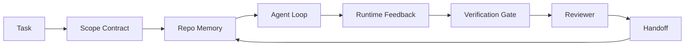

# 工程工作台为什么能否模型仍然失败

> 能否使用模型不够.可靠的代理人需要工作台:指令,状态,范围,反,验证,审查和交付.

**Type:** Learn + Build | **类型:** 构建
**Languages:** Python (stdlib) | **语言:** Python (标准库)
**Prerequisites:** Phase 14 · 01 (Agent Loop), Phase 14 · 26 (Failure Modes) | **前置知识:** 见原文
**Time:** ~45 minutes | **时间:** 见原文

>  **【前置】**节前请先掌握:阶段14·01(代理循环) 阶段14·26(失败模式) ⋅本节是后续阶段14·32-42(工作台系列7节) 的入门,讲为什么"光有好模型不够"──

>  **【类比】**经理工作台:光有好厨师 (强模型) 不够,还需要干净的备餐区 (状态) 清晰的菜谱 (说明) 有限的食材范围 (范围) 品味检查 (验证) 主厨审核 (审查) 任何一项都少了,再好的厨师也出错了错误的食材,漏步骤,用错调料.

## 学习目标

- 单独的模型能力与执行可靠性.
- 给出一个代理是否出海的七个工作桌面的名称.
- 进行一个小的回复任务的即时运行与工作台指导运行.
- 输出失败模式报告,将每个错过的表面映射到它引起的症状.

## 问题 问题引入

您将边界模型放入一个真正的备忘录中,并要求它添加输入验证.它打开四个文件,写出可信的代码,声明成功,然后停止.您运行测试.两个失败. 触及第三个文件与验证无关. 没有记录代理假设了什么,它首先尝试了什么,或者剩下什么.

> 你把一个前沿模型放进真实代码仓库,让它添加输入验证. 它打开了四个文件,写出看起来合理的代码,宣布成功,然后停止. 你运行测试.

模型对Python没有错,它对工作有错,它不知道什么被认为是完成的,它被允许写什么,哪些测试是权威的,或者下一个会议应该如何接下来.

> 模型在Python上没有错误. 它在工作上错误. 它不知道什么算完成. 它允许在哪里写入.


> **【中文解读】**代理在真实仓库中失败的原因分析:(1) 命令遵循失败忽略约束或编制不存在的能力;(2) 上下文窗口耗尽长代码库超出窗口导致关键信息丢失;(3) 错误累积小错误在多步骤执行中暴跌放大;(4) 项目记忆缺乏不知道代码库的约定和架构.

这不是模型错误,而是工作台错误. 代理周围的表面缺少了将一击生成变成可靠的,可重启工程的零件.

> 这不是模型错误. 这是一个工作台错误. 周围的表面缺陷将一次性生成转变为可靠的工程部分.

> 分析模型失败的根本原因.主要失败模式包括:指令遵循失败.

## 概念的核心概念

工作台是模型在任务中包裹的操作环境. 它有七个表面:

> 分析模型失败的根本原因.主要失败模式包括:指令遵循失败.

| Surface | What it carries | Failure when missing |
|---------|-----------------|----------------------|
| Instructions | Startup rules, forbidden actions, definition of done | Agent guesses what shipping means |
| State | Current task, touched files, blockers, next action | Each session restarts from zero |
| Scope | Allowed files, forbidden files, acceptance criteria | Edits leak into unrelated code |
| Feedback | Real command output captured into the loop | Agent declares success on a 400 |
| Verification | Tests, lint, smoke run, scope check | "Looks good" reaches main |
| Review | A second pass with a different role | Builder marks own homework |
| Handoff | What changed, why, what is left | Next session re-discovers everything |


> **【中文解读】**代理在真实仓库中失败的原因分析:(1) 命令遵循失败忽略约束或编制不存在的能力;(2) 上下文窗口耗尽长代码库超出窗口导致关键信息丢失;(3) 错误累积小错误在多步骤执行中暴跌放大;(4) 项目记忆缺乏不知道代码库的约定和架构.

工作台独立于模型.你可以换模型并保留表面.你不能换表面并保持可靠性.

> 工作台独立于模型. 你可以替换模型而保留表面.

> 分析模型失败的根本原因.主要失败模式包括:指令遵循失败.



循环在状态文件上关闭,而不是聊天历史.聊天是不动态的. 备忘录是记录系统.

> 循环在状态文件上关闭,而不是在聊天历史上.

> 分析模型失败的根本原因.主要失败模式包括:指令遵循失败.

### 工作台与快速工程

提示告诉模型你想要什么转换.一个工作台告诉模型如何在转换和跨会议上做工作.大多数代理失败故事是工作台失败穿着提示工程服装.

> 提示告诉模型这个轮子你想要什么.工作台告诉模型如何跨轮次和跨会话做工作.

> 分析模型失败的根本原因.主要失败模式包括:指令遵循失败.

### 工作台与框架

框架给你一个运行时间 (LangGraph, AutoGen, Agents SDK).一个工作台给代理一个工作的地方在运行时间.你需要两者.这个迷你轨道是关于第二个.

> 框架给你一个运行时的工作台给代理在运行时的工作场所.

> 分析模型失败的根本原因.主要失败模式包括:指令遵循失败.

### 从原始的推理,而不是从供应商的分类

现在很多关于"带工程"的文章. 艾迪·奥斯曼尼,OpenAI,人类,兰格链,马丁·福勒,蒙古DB,人层,增强代码,思维,行程实验室的惊人的列表, 他们不同意什么是带,什么是范围,以及使用什么词汇. 我们不需要选择一边. 七个表面是UX层; 每个工作台下面都是同一组分布式系统原始的,

> 分析模型失败的根本原因.主要失败模式包括:指令遵循失败.

运行代理是跨越时间,过程和机器的计算.为了使其可靠,你需要任何生产系统所需的原始元素.

> 暂时删除代理标签. 代理运行是跨时间,进程和机器的计算.

> 分析模型失败的根本原因.主要失败模式包括:指令遵循失败.

| Primitive | What it is | What it carries for an agent |
|-----------|------------|------------------------------|
| Function | Typed handler. Pure where possible. Owns its inputs and outputs. | A tool call, a rule check, a verification step, a model invocation |
| Worker | Long-lived process that owns one or more functions and a lifecycle | The builder, the reviewer, the verifier, an MCP server |
| Trigger | Event source that invokes a function | Agent loop tick, HTTP request, queue message, cron, file change, hook |
| Runtime | The boundary that decides what runs where, with what timeouts and resources | Claude Code's process, LangGraph's runtime, a worker container |
| HTTP / RPC | The wire between caller and worker | Tool-call protocol, MCP request, model API |
| Queue | Durable buffer between trigger and worker; back-pressure, retry, idempotency | The task board, the feedback log, the review inbox |
| Session persistence | State that survives crashes, restarts, model swaps | `agent_state.json`, checkpoints, KV stores, the repo itself |
| Authorization policy | Who can call what function with which scope | Allowed/forbidden files, approval boundaries, MCP capability lists |

现在将七个工作桌面地图绘制在这些原始的表面上.

> 分析模型失败的根本原因.主要失败模式包括:指令遵循失败.

- **Instructions**政策+函数元数据.规则是检查 (函数).路由器 (`AGENTS.md`) 是运行时间启动的政策.
- **State** 会议持久性.一个键存储每个步骤都会读取运行时间.文件,KV或DB;持久性语义是重要的,存储后端不是.
- **Scope**每任务授权政策.允许/禁止的球是ACL.需要的批准是授权网格.
- **Feedback** 召唤日志写入队列. 每次电话都是记录,持久,可播放.
- **Verification**函数. 输入的确定性. 任务关闭时触发. 失败关闭.
- **Review**一个独立的工人,只能阅读建筑物和只能写作审查报告的著作权.
- **Handoff**由一个会议结束触发器发射的持久记录. 下一个会议的启动触发器读取它.

代理循环本身是一个消耗事件 (用户消息,工具结果,计时器点击),调用函数 (模型,然后模型选择的工具),编写记录 (状态,反),并发出触发器 (验证,审查,转发).

> 分析模型失败的根本原因.主要失败模式包括:指令遵循失败.

### 流通的模式,转换为原始

每个流行的带纹都缩小到八个原始的.

> 分析模型失败的根本原因.主要失败模式包括:指令遵循失败.

| Vendor or community pattern | What it actually is |
|------------------------------|--------------------|
| Ralph Loop (Claude Code, Codex, agentic_harness book) — re-inject original intent into a fresh context window when the agent tries to stop early | A trigger that re-enqueues a task with a clean context; session persistence carries the goal forward |
| Plan / Execute / Verify (PEV) | Three workers, one per role, communicating via state and a queue between phases |
| Harness-compute separation (OpenAI Agents SDK, April 2026) — split control plane from execution plane | Restating control-plane / data-plane. Predates the agent label by decades |
| Open Agent Passport (OAP, March 2026) — sign and audit every tool call against a declarative policy before execution | An authorization policy enforced by a pre-action worker, with a signed audit queue |
| Guides and Sensors (Birgitta Böckeler / Thoughtworks) — feedforward rules + feedback observability | Authorization policy + verification functions + observability traces |
| Progressive compaction, 5-stage (Claude Code reverse engineering, April 2026) | A state-management worker that runs cron-like over session persistence to keep it within a budget |
| Hooks / middleware (LangChain, Claude Code) — intercept model and tool calls | Triggers + functions wrapped around the runtime's invocation path |
| Skills as Markdown with progressive disclosure (Anthropic, Flue) | A function registry where the function metadata is loaded into context just-in-time |
| Sandbox agents (Codex, Sandcastle, Vercel Sandbox) | The compute plane: a runtime with isolated filesystem, network, and lifecycle |
| MCP servers | Workers exposing functions over a stable RPC, with capability lists as authorization |

每个进口都是在该表中,代理社区到达一个原始的分布式系统中已经有一个名字,给它一个新的.有用的标签用于营销;不有用的工程词汇.

> 分析模型失败的根本原因.主要失败模式包括:指令遵循失败.

### 收据实际上说什么

现在,这种"超级型号"的说法有很多数字,值得知道,因为它们也是唯一一个诚实的反对"等待更聪明的模型"的论点.

> 分析模型失败的根本原因.主要失败模式包括:指令遵循失败.

- 终端台2.0 相同的模型,使用权变化将编码代理从前30名之外移至第五名 (LangChain, *Anatomy of an Agent Harness*).
- 公司删除了其代理工具的80%;成功率从80%升至100% (MongoDB).
- 通过仅仅利用利用优化 (MongoDB) 提高了法律代理的准确度.
- 企业AI代理项目中有88%未能达到生产.失败的原因是运行时间而不是推理 (preprints.org,2026年3月*语言代理商的利用工程).
- 根据2025年的三个受欢迎的开源框架的基准研究,任务完成率为50%;长文本WebAgent在长文本条件下从40-50%下降到10%以下,主要是由于无限循环和目标损失 (在2026年初的写作中广泛覆盖).

模型确实随着时间的推移吸收了这种技巧. 结果是,今天,载荷工程是围绕模型而不是内部的,并且承载这种负载的原始品是每个生产系统都需要的.

> 结论不是"杆永远赢"――模型确实随着时间吸收杆技巧――结论是今天,承载工程重量是模型周围的部分,而不是模型内部的,承载这个重量的原语是每个生产系统一直需要的――

> 分析模型失败的根本原因.主要失败模式包括:指令遵循失败.

### 销售人员的写字停止短暂

这就是你不需要对此有礼貌的部分.

> 分析模型失败的根本原因.主要失败模式包括:指令遵循失败.

- 兰格链的*代理的解剖学*列出了十一个组件:提示,工具,,沙盒,配套,内存,技能,子弹和运行时间"循环".它不列表排队,作为部署单位的员工,触发语义,作为单独的关注,或授权政策的会议持久性.它将作为一个你配置的对象,而不是一个你部署的系统.
- 艾迪·奥斯曼尼的"机器人"工程部`Agent = Model + Harness`没有说一个带是什么. 它读作立场,而不是规范.
- 亚洲人体和OpenAI在表面上最深入,但保持在自己的运行时间内. 2026年4月的Agents SDK中的"带计算分离"公告是第一个明确支持控制平面/数据平面分离的供应商.这是一个原始的想法,不是新的.
- 机器人带书将带视为一个配置对象 (Jaymin West的*Agentic Engineering*第6章),其中最强的条款是"机器人系统中的首要安全边界是带".
- 黑客新闻线程不断到达同一地点. 2026年4月的线程*代理链接属于沙盒外*认为该链接应该像"一个在一切之外的超级监视器,根据环境和用户授权访问".

它们是写出已经存在的系统的 UX描述.我们正在写出系统.当系统正确构建时,七面都会从原始中掉下来.当它被错误构建时,没有多少`AGENTS.md`抛光解决了缺失的排队.

> 分析模型失败的根本原因.主要失败模式包括:指令遵循失败.

所以,当你听到"带工程"的时候, 转换为原始. 提示和规则是政策和功能. 架是跑步时间. 防护轨道是授权+验证. 子是触发器. 记忆是持续的会议. 拉尔夫环是排队. 们是工人. 沙盒是计算飞机. 词汇库改变,工程学不会. 工作台是面向代理的UX; 带,在下一个供应商重组中存活的意义上, 是功能,工人,触发器,运行时间,排队,坚持和政策正确连接在一起.

> 分析模型失败的根本原因.主要失败模式包括:指令遵循失败.

## 建立它,实现它.
```figure
wb-seven-surfaces
```

## 建立它

`code/main.py`首先是只作为提示,然后是有线的七个表面.相同的模型,相同的任务.脚本计算失败运行中缺失的表面,然后打印失败模式报告.

> 分析模型失败的根本原因.主要失败模式包括:指令遵循失败.

备忘录任务是小的:将输入验证添加到一个文件 FastAPI 式处理器中,并写一个通过测试.

> 分析模型失败的根本原因.主要失败模式包括:指令遵循失败.

运行它:

```
python3 code/main.py
```

输出:两次运行的隔离记录,`failure_modes.json`总结了即时运行, 并为工作台运行作出一线判决.

> 分析模型失败的根本原因.主要失败模式包括:指令遵循失败.

经纪人是一个基于规则的小块, 问题是表面, 而不是模型. 在这个迷你轨道的其他部分,

> 分析模型失败的根本原因.主要失败模式包括:指令遵循失败.

## 用它实现框架

现在,三个工作桌面已经存在于自然界,

> 分析模型失败的根本原因.主要失败模式包括:指令遵循失败.

- **Claude Code, Codex, Cursor.** `AGENTS.md`其他`CLAUDE.md`命令是范围,子是验证.
- **LangGraph, OpenAI Agents SDK.**检查点和会议店是州的表面. 交付是交付的表面.
- **CI on a real repo.**检测,,检查类型是验证.  PR 模板是交付. 编码所有者是审查.

工作台工程是使这些表面明确和可重复使用的学科,而不是让每个团队重新发现它们.

> 分析模型失败的根本原因.主要失败模式包括:指令遵循失败.

## 运送它.

`outputs/skill-workbench-audit.md`现在,我们可以在一个工作桌上进行检查,检查一个现有 repo 面积和报告,这些报告是缺失的,是部分的,并且是健康的.

> `outputs/skill-workbench-audit.md`是一个可移植的技能,审计现有仓库的七个工作台表面,报告哪些缺失,哪些部分存在,哪些健康.

> 分析模型失败的根本原因.主要失败模式包括:指令遵循失败.

## 练习题

1. 选择一个已经运行代理的备忘录,从0 (缺失) 到2 (健康) 评分.你最弱的表面是什么?
  中文翻译:思考并实践此练习──
2. 延长时间`main.py`检查验网关会发现它.
  中文翻译:思考并实践此练习──
3. 给自己的产品添加一个第八个表面,证明为什么它不会崩到现有的七个.
  中文翻译:思考并实践此练习──
4. 通过不同的片代理重新运行脚本,让一个额外的文件写出幻觉.
  中文翻译:思考并实践此练习──
5. 从14·26阶段到7个表面上映出五种行业重复故障模式.每个表面都设计成吸收哪种模式?
  中文翻译:思考并实践此练习──

## 关键词 快速查找表

| Term | What people say | What it actually means |
|------|----------------|------------------------|---|
| Workbench | "The setup" | Engineered surfaces around the model that make work reliable |  |
| Surface | "A doc" or "a script" | A named, machine-readable input the agent reads or writes every turn |  |
| System of record | "The notes" | The file the agent treats as truth when chat history is gone |  |
| Definition of done | "Acceptance" | An objective, file-backed checklist the agent cannot fake |  |
| Workbench audit | "Repo readiness check" | A pass over the seven surfaces that flags missing pieces before work begins |  |

## 继续阅读 继续阅读

读这些作为数据点,而不是权威. 每一个都是部分分类. 在决定是否采用之前,把每个概念都转化为原始 (函数,工作者,触发器,运行时间,HTTP/RPC,排队,持久性,政策).

> 分析模型失败的根本原因.主要失败模式包括:指令遵循失败.

供应商的框架:

- [Addy Osmani, Agent Harness Engineering](https://addyosmani.com/blog/agent-harness-engineering/) `Agent = Model + Harness`子的图案;基础设施薄
  中文翻译:见原文.
- [LangChain, The Anatomy of an Agent Harness](https://blog.langchain.com/the-anatomy-of-an-agent-harness/)十一个组件:提示,工具,子,配乐,沙盒,记忆,技能,子弹,运行时间;遗漏排列,部署, authz
  中文翻译:见原文.
- [OpenAI, Harness engineering: leveraging Codex in an agent-first world](https://openai.com/index/harness-engineering/)Codex团队对它们运行时间周围的表面的视角
  中文翻译:见原文.
- [OpenAI, Unrolling the Codex agent loop](https://openai.com/index/unrolling-the-codex-agent-loop/) 代理循环缩小到一个`while`函数调用
  中文翻译:见原文.
- [Anthropic, Effective harnesses for long-running agents](https://www.anthropic.com/engineering/effective-harnesses-for-long-running-agents)在特定运行时间内长视界表面
  中文翻译:见原文.
- [Anthropic, Harness design for long-running application development](https://www.anthropic.com/engineering/harness-design-long-running-apps)应用设计说明
  中文翻译:见原文.
- [LangChain Deep Agents harness capabilities](https://docs.langchain.com/oss/python/deepagents/harness)运行时间配置表面
  中文翻译:见原文.

实践者用处细节的作品:

- [Martin Fowler / Birgitta Böckeler, Harness engineering for coding agent users](https://martinfowler.com/articles/harness-engineering.html)指导 (前进传输) +传感器 (反);最干净的控制理论框架
  中文翻译:见原文.
- [HumanLayer, Skill Issue: Harness Engineering for Coding Agents](https://www.humanlayer.dev/blog/skill-issue-harness-engineering-for-coding-agents)"这不是模型问题,而是配置问题"
  中文翻译:见原文.
- [MongoDB, The Agent Harness: Why the LLM Is the Smallest Part of Your Agent System](https://www.mongodb.com/company/blog/technical/agent-harness-why-llm-is-smallest-part-of-your-agent-system)收据:80%至100%的真实性,哈维两倍的准确性,终端位最高30至最高5
  中文翻译:见原文.
- [Augment Code, Harness Engineering for AI Coding Agents](https://www.augmentcode.com/guides/harness-engineering-ai-coding-agents) 限制-第一步通行
  中文翻译:见原文.
- [Sequoia podcast, Harrison Chase on Context Engineering Long-Horizon Agents](https://sequoiacap.com/podcast/context-engineering-our-way-to-long-horizon-agents-langchains-harrison-chase/) 运行时间问题与模型问题
  中文翻译:见原文.

书籍,论文和参考实施:

- [Jaymin West, Agentic Engineering — Chapter 6: Harnesses](https://www.jayminwest.com/agentic-engineering-book/6-harnesses) 长度处理,把带作为主要的安全边界
  中文翻译:见原文.
- [preprints.org, Harness Engineering for Language Agents (March 2026)](https://www.preprints.org/manuscript/202603.1756)作为控制/代理/运行时间的学术框架
  中文翻译:见原文.
- [walkinglabs/awesome-harness-engineering](https://github.com/walkinglabs/awesome-harness-engineering) 评选文本,评估,可观测性,编排
  中文翻译:见原文.
- [ai-boost/awesome-harness-engineering](https://github.com/ai-boost/awesome-harness-engineering)替代选定列表 (工具,评估,内存,MCP,权限)
  中文翻译:见原文.
- [andrewgarst/agentic_harness](https://github.com/andrewgarst/agentic_harness) 随着Redis支持的内存和评估套件的生产准备的参考实现
  中文翻译:见原文.
- [HKUDS/OpenHarness](https://github.com/HKUDS/OpenHarness) 开放代理带内置个人代理
  中文翻译:见原文.

哈克新闻值得阅读的线程是因为分歧,而不是共识:

> 分析模型失败的根本原因.主要失败模式包括:指令遵循失败.

- [HN: Effective harnesses for long-running agents](https://news.ycombinator.com/item?id=46081704)
  中文翻译:见原文.
- [HN: Improving 15 LLMs at Coding in One Afternoon. Only the Harness Changed](https://news.ycombinator.com/item?id=46988596)
  中文翻译:见原文.
- [HN: The agent harness belongs outside the sandbox](https://news.ycombinator.com/item?id=47990675)要求作为单独飞机授权
  中文翻译:见原文.

在本课程中交叉引用:

- 阶段14 · 23  开放Telemetry GenAI公约:传感器文献指出的可观性层
- 阶段 14 · 26  失败模式目录七个表面是设计的吸收
- 阶段14 · 27  直接注射的防御措施,在授权政策原始状态下
- 阶段14 · 29  制作运行时间 (排列,事件, cron):本课中的原始在部署中生活
