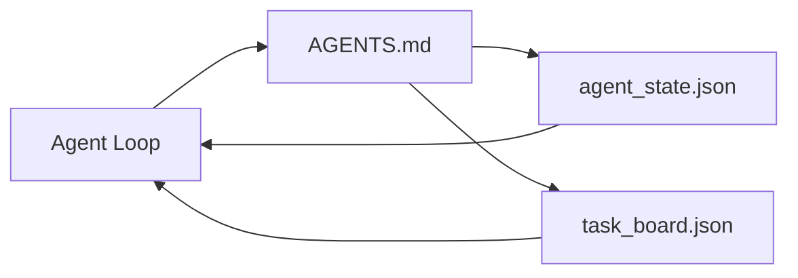

# 工作台 最小的小程序

> 最小的有用工作台是三个文件:根指令路由器,状态文件和任务板.其他所有东西都被层次叠加在上面.如果一个备忘录不能携带这三个文件,则没有模型会保存它.

**Type:** Build | **类型:** 构建
**Languages:** Python (stdlib) | **语言:** Python (标准库)
**Prerequisites:** Phase 14 · 31 (Why Capable Models Still Fail) | **前置知识:** 见原文
**Time:** ~45 minutes | **时间:** 见原文

>  **【前置】**学习节前请先掌握:阶段14·31(工作台为什么需要) ――本节实现最小可用的工作台:3 个文件(根路由器、状态、任务板)

>  **【类比】**最小工作台 = 厨房最基础的3件物品:菜单板(根路由器,告诉厨师今天做什么) 备菜笔记(状态,记录已经切了什么) 待办清单(任务板,还剩什么没做) ‧Claude Code、Cursor等代理 工具底层都是这3件套的扩展`CLAUDE.md`是路由器,`memory/`是国家,`tasks/`是任务委员会.

## 学习目标

- 定义构成最小可行的工作台的三个文件.
- 解释为什么一个短的根路由器比一个长的单形路由器更好`AGENTS.md`现在,我们要去.
- 建立一个状态文件, 代理可以在每一个转折阅读,
- 建立一个可以在不需要聊天历史的情况下进行多次工作的任务板.

## 问题 问题引入

大多数团队通过写一个3000行来达到工作台`AGENTS.md`模型将其加载,忽略无法总结的部分,

> 大多数团队通过写一个3000行.`AGENTS.md`并且称之为完成,以寻求工作台.模型加载它,忽略它无法总结的部分,仍然在相同的表面失败.

需要相反的东西.一个小的根文件,只能将代理导向更深的文件,只有当它相关时. 持久状态,代理在行动之前读取,然后写出.一个任务板,说明飞行中什么,被阻止什么,以及接下来什么.

> 你需要相反的做法――一个小的根文件,只要在相关时将代理路由到更深层次的文件――代理在行动前阅读行动后写入的持久状态――一个说明正在进行的,被阻碍的,在下一步任务板的内容――


> **【中文解读】**最小化代理工作台是理解编码代理内部机制的起点――它包含五个核心组件: 1) 文件读写工具; 2) 代码执行沙盒; 3) 简单的反应循环; 4) 消息缓冲区; 5) 停止条件――目标是让学习者从头上理解每个组件的作用和交互――

每个文件都有一个工作,每个文件都能被机器读取,以后可以演变成一个真正的系统.

> 每个人都有自己的职责. 每个都足够的机器可读,以便后面演变成真实的系统.

> 最小的代理工作台是一个用于实验和调试代理行为的轻量级环境. 它提供了隔离的执行空间和详细的轨迹分析工具.

## 概念的核心概念




> **【中文解读】**最小化代理工作台是理解编码代理内部机制的起点――它包含五个核心组件: 1) 文件读写工具; 2) 代码执行沙盒; 3) 简单的反应循环; 4) 消息缓冲区; 5) 停止条件――目标是让学习者从头上理解每个组件的作用和交互――

### 代理.md 是一个路由器,而不是一个手册

一个好`AGENTS.md`简短,指向代理人:

> 最小的代理工作台是一个用于实验和调试代理行为的轻量级环境. 它提供了隔离的执行空间和详细的轨迹分析工具.

- 州文件 (你所在的地方).
- 任务板 (剩下的).
- 更深层次的规则 (`docs/agent-rules.md`)
- 验证命令 (如何知道它运行).

长时间的文件只能在需要时加载,长时间的手册被忽视,短时间的路由器被追踪.

> 长手册被忽略,短路由被遵循.

> 最小的代理工作台是一个用于实验和调试代理行为的轻量级环境. 它提供了隔离的执行空间和详细的轨迹分析工具.

### 代理_状态.json是记录系统

状态载有:活动任务ID,触及的文件,所做的假设,阻塞器和下一步操作. 代理在每次转机上读取它. 下一次会议读取它,而不是重播聊天.

> 最小的代理工作台是一个用于实验和调试代理行为的轻量级环境. 它提供了隔离的执行空间和详细的轨迹分析工具.

由于聊天历史是不可靠的,会议会死亡,对话会被削减.

> 状态存在于文件中,因为聊天历史是不可靠的. 会话会消失.

> 最小的代理工作台是一个用于实验和调试代理行为的轻量级环境. 它提供了隔离的执行空间和详细的轨迹分析工具.

### 任务板.json是排队

任务委员会将每个任务都进行状态`todo | in_progress | done | blocked`随着该状态空,代理人从哪里拉到的排队,

> 最小的代理工作台是一个用于实验和调试代理行为的轻量级环境. 它提供了隔离的执行空间和详细的轨迹分析工具.

工作板上有个ID,一个目标,一个主 (`builder`现在`reviewer`其他`human`面板是故意小的:它在屏幕上长大时,你有计划问题,而不是面板问题.

> 最小的代理工作台是一个用于实验和调试代理行为的轻量级环境. 它提供了隔离的执行空间和详细的轨迹分析工具.

### 三个文件是地板,而不是天花板

后来的课程增加了范围合约,反运行器,验证门户,审查员检查列表和交付包.

> 后续课程将增加范围契约"",反运行器"",验证门控"",审核者检查清单和交接包――这三个文件都是它们假设存在的基础――

> 最小的代理工作台是一个用于实验和调试代理行为的轻量级环境. 它提供了隔离的执行空间和详细的轨迹分析工具.

## 建立它,实现它.
```figure
wb-three-files
```

## 建立它

`code/main.py`写出最小工作桌子为空置 repo,并证明一个单个代理转换:

> 最小的代理工作台是一个用于实验和调试代理行为的轻量级环境. 它提供了隔离的执行空间和详细的轨迹分析工具.

1. 阅读`agent_state.json`现在,我们要去.
2. 从 中拉下一个任务`task_board.json`如果国家是空的.
3. 触及一个文件的范围.
4. 写回更新状态.

运行它:

```
python3 code/main.py
```

剧本创造了`workdir/`转换一个转换,然后打印了差异. 再次运行,看第二转换如何继续前进.

> 最小的代理工作台是一个用于实验和调试代理行为的轻量级环境. 它提供了隔离的执行空间和详细的轨迹分析工具.

## 用它实现框架

在生产代理产品中,相同的三份文件以不同的名称出现:

> 最小的代理工作台是一个用于实验和调试代理行为的轻量级环境. 它提供了隔离的执行空间和详细的轨迹分析工具.

- **Claude Code:** `AGENTS.md`或`CLAUDE.md`对于路由器,`.claude/state.json`对于州的风格店,对于董事会的子.
- **Codex / Cursor:**路由器的工作空间规则,状态的会议内存,板块的聊天侧排列任务.
- **Custom Python agent:**你刚刚写的文件.

名称改变,形状却不改变.

## 野生生产模式

工作桌面在三种模式上层时会与真正的单机机保持联系.

> 最小的代理工作台是一个用于实验和调试代理行为的轻量级环境. 它提供了隔离的执行空间和详细的轨迹分析工具.

**Nested `AGENTS.md` with nearest-wins precedence.**开放AI船 88 `AGENTS.md`编程,课件,克劳德代码和Copilot都从工作文件走向 repo 根,并连接每一个`AGENTS.md`它们在路上找到. 字母目录文件扩大了根文件.`AGENTS.override.md`增强代码的测量是最重要的:最好的方法是:`AGENTS.md`文件的质量跳跃相当于升级从海库到Opus; 最差的文件的输出比根本没有文件更糟.

**Anti-patterns to refuse, even when they look like coverage.**矛盾的指示默默地将代理从互动模式下放到贪模式 (ICLR 2026 AMBIG-SWE: 48.8% → 28% 分辨率); 编号优先级,而不是堆它们. 没有执行命令的不可验证的风格规则 ("遵循Google Python Style Guide") 让代理发明遵守;将每个风格规则与精确的 lint命令结合起来. 引导用风格而不是命令埋葬了验证路径;命令先,风格最后. 写作是为了人类而不是代理人,

**Cross-tool symlinks.**单个根文件,具有符号链接 (`ln -s AGENTS.md CLAUDE.md`现在`ln -s AGENTS.md .github/copilot-instructions.md`现在`ln -s AGENTS.md .cursorrules`让每个编码代理都能找到相同的真相来源.`nx ai-setup`通过一个配置,可自动化了Cloade Code,Cursor,Copilot,Gemini,Codex和OpenCode.

## 运送它.

`outputs/skill-minimal-workbench.md`创建任何新的 repo 的三文件工作台:`AGENTS.md`路由器调整到项目,一个`agent_state.json`按右键,`task_board.json`现在的后备.

> 最小的代理工作台是一个用于实验和调试代理行为的轻量级环境. 它提供了隔离的执行空间和详细的轨迹分析工具.

## 练习题

1. 添加一个`last_run`时间标签`agent_state.json`如果文件超过24小时,除非经营者确认.
  中文翻译:思考并实践此练习──
2. 添加一个`priority`按键盘,然后更改拉机,以选择最高优先级.`todo`现在,我们要去.
  中文翻译:思考并实践此练习──
3. 迁移`task_board.json`为了使每个任务都是一个行,并且在版本控制中,差异是清洁的.
  中文翻译:思考并实践此练习──
4. 写一个`lint_workbench.py`如果`AGENTS.md`超过80行或引用一个不存在的文件.
  中文翻译:思考并实践此练习──
5. 决定哪个文件最伤害失去.
  中文翻译:思考并实践此练习──

## 关键词 快速查找表

| Term | What people say | What it actually means |
|------|----------------|------------------------|---|
| Router | `AGENTS.md` | Short root file that points the agent at deeper docs and files |  |
| State file | "The notes" | Machine-readable record of where the agent is, written every turn |  |
| Task board | "The backlog" | JSON queue of work with status, owner, acceptance |  |
| System of record | "Source of truth" | The file the workbench treats as authoritative when chat is gone |  |

## 继续阅读 继续阅读

- [agents.md — the open spec](https://agents.md/)由Cursor,Codex,Claude Code,Copilot,Gemini,OpenCode采用
  中文翻译:见原文.
- [Augment Code, A good AGENTS.md is a model upgrade. A bad one is worse than no docs at all](https://www.augmentcode.com/blog/how-to-write-good-agents-dot-md-files)测量质量跳跃
  中文翻译:见原文.
- [Blake Crosley, AGENTS.md Patterns: What Actually Changes Agent Behavior](https://blakecrosley.com/blog/agents-md-patterns)经验性工作,不
  中文翻译:见原文.
- [Datadog Frontend, Steering AI Agents in Monorepos with AGENTS.md](https://dev.to/datadog-frontend-dev/steering-ai-agents-in-monorepos-with-agentsmd-13g0)实践中的先进性
  中文翻译:见原文.
- [Nx Blog, Teach Your AI Agent How to Work in a Monorepo](https://nx.dev/blog/nx-ai-agent-skills) 六种工具的单源生成
  中文翻译:见原文.
- [The Prompt Shelf, AGENTS.md Best Practices: Structure, Scope, and Real Examples](https://thepromptshelf.dev/blog/agents-md-best-practices/) 部分订单,经过审查
  中文翻译:见原文.
- [Anthropic, Claude Code subagents and session store](https://docs.anthropic.com/en/docs/agents-and-tools/claude-code/sub-agents)
  中文翻译:见原文.
- [Anthropic, Claude Code subagents](https://code.claude.com/docs/en/sub-agents)
-                
- 阶段14 · 34  长期状态方案本课前景
