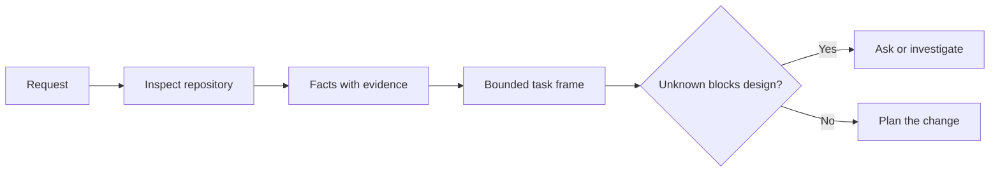

# 在代理写代码之前, 制任务,再写代码

> 编码代理可以快速执行一个清晰的任务. 它也可以快速执行一个不清晰的任务. 速度相同. 成本不一样.

> **【中文解读】**编码代理 实现清晰任务很快,实现模糊任务同样很快速度,成本完全不同. 本课讲 编码之前的第一步:把一个模糊请求变成一个由仓库证据支、边界明确的任务框架.

>  **【前置】**学本课前请先掌握:阶段14 第31课 ((为什么模型会失败先理解失败模式,才理解为什么需要框架) 和第36课 ((范围合同,范围契约本课的任务框架是它在任务定义阶段的前置形态) ⋅本课产`outputs/task-frame.md`会议在第44课成为证据支的执行计划.

**Type:** Learn + Build | **类型:** 学习 + 动手实践
**Languages:** Python (stdlib) | **语言:** Python（标准库）
**Prerequisites:** Phase 14 lessons 31 and 36 | **前置知识:** Phase 14 第 31、36 课
**Time:** ~60 minutes | **时间:** 约 60 分钟

## 学习目标

- 在编辑之前将请求转换为有限任务框架.
  中文翻译:在动手编辑之前,把一个请求转化为有边界的任务框架.
- 独立的数据库数据与假设和公开问题.
  中文翻译:把仓库事实与假设的区分,等待决策问题.
- 定义允许的路径,禁止的路径,以及接受证据.
  中文翻译:定义允许路径、禁止路径和验收证证──
- 确定什么时候侦察足以开始工作.
  中文翻译:判断什么时候侦察已经足够了,可以开始动手.

## 昂贵的失败

添加重复电子邮件保护听起来是具体的.它不是. 独特性是否属于API,域服务或数据库?比较是否敏感?哪种错误形式已经公开?是否允许迁移?哪种测试证明了行为?

> 对于"加上重复邮箱保护"听起来很具体,实际上并不具体. 唯一性应该放在API领域服务还是数据库?

能否执行的操作程序,将会通过可行的选择来填补这些空白.

> 一个有能力的代理人会使用看似合理的选择来填补这些空白.

因此,编码代理工作的第一单元不是编辑,而是由存储证据支持的任务框架.

> 因此,编码代理工作的第一单元不是一次编辑,而是由仓库证据支的任务框架.

> **【中文解读】**昂贵的失败指的是不是代码写坏了,而是代码写对代码的错误,但任务理解错误了. 代理不会因为任务模糊而变慢,它会自信地替你做决定. 这些替你做出的决定 (放哪层,什么语义,什么错误码) 一旦埋入代码,返工成本远高于先前问清楚.

## 任务框架

有效的框架有六个领域:

| Field | Question |
|---|---|
| Goal | What observable behavior must change? |
| Repository facts | What did you verify in code, tests, config, or history? |
| Allowed paths | Where may the change land? |
| Forbidden paths | What must remain untouched? |
| Acceptance evidence | Which commands or observations prove the goal? |
| Unknowns | Which decisions still need evidence or human judgment? |

> **【中文解读】**六个字段分别是:目标 (什么可观察行为必须改变) 仓库事实 (你在代码,测试,配置或历史核实过什么) 允许路径 (你在代码中允许落在哪里) 允许路径 (什么绝不能碰) 验收证据 (哪些命令或观察可以证明目标实现) 未知项目 (哪些决定还需要证据或人的判断) 最容易被忽视的是禁止路径和未知项目前者划出负面空间,后者则不合格做出决定显然保留下来.

文件需要收件. API使用409为重复文件是没有事实,直到你可以指向现有测试或处理器.一个文件路径和行是足够的.一个命令结果更好,当行为重要.

> 事实需要证据. "API对重复返回409"之前都不算事实.



>  **【类比】**任务框架像装修前的墙审批单:哪面墙能动 (允许的路径) 哪面是承重墙绝不能动 (禁止的路径) 验收入住的标准是什么 (验收入住的标准是什么) 验收证) 没有这张单子,装修队 (装修队) 行动越快,错墙的概率越大――

## 侦察就是寻找约束.

查找限制变更的表面:

> 不要通读整个仓库,去找那些真正的约束者.

1. 现在的行为和它的调用者.
   中文翻译:当前行为以及调用它的代码──
2. 最接近现有的测试.
   中文翻译:离得最近现存测试──
3. 公共合同或序列化形状.
   中文翻译:公开契约或序列化后的数据形状.
4. 项目指令,指导路径.
   中文翻译:管辖这些路径的项目规范(如AGENTS.md) 〔
5. 建立和验证命令.
   中文翻译:构建与验证命令.
6. 类似的完成变化, 显示了当地模式.
   中文翻译:类似的已完成改动,它们揭示本地惯例.

停止当每一个计划的决定都被证据支持,明确委托,或列为未知的.

> 当每个计划中的决定都有证据支持,被明确授权或已被列为未知的项目,就停止侦察.

> **【中文解读】**侦察的目的不是了解整个代码库,而是寻找约束:谁调用它,哪个试管它,公开契约长什么样,本地惯例怎么写.

## 不知不觉不是失败

无人是控制的空白. 假设是对空白的不受控制的答案.

> 不知项是一个受控的空洞;假设则是对这个空洞的失控作答.

分类每个未知的:

- **Discoverable:**存储库或运行系统可以回答.
  翻译: 中文**可发现：**仓库或运行中的系统能回答它.
- **Decidable:**任务合同赋予代理人选择权.
  翻译: 中文**可决定：**任务契约已授权 代理 自行选择.
- **Human:**选择改变产品行为,成本,风险或公众兼容性.
  翻译: 中文**需人来定：**这种选择会改变产品行为,成本,风险或公开兼容性.
- **Deferred:**选择是不属于这个部分的,属于非目标的.
  翻译: 中文**可延后：**这个选择不属于本次切片,应放进非目标.

代理应该继续通过可发现和委托的未知, 在选择被埋葬在代码之前,它应该停留在人类未知.

> 对于可发现和授权的未知项目, 代理应继续推进;对于需要人来确定的未知项目, 代理应暂停在这个选择被埋入代码之前.

> **【中文解读】**处理四种类型:可发现的查询,可决定的自选,需要人来确定的先决问题,可延迟的记入非目标. 最怕的是隐藏的第三类 代理将本人拍摄的产品决策,作为可决定的 完成了.

## 接受之前的执行 接受之前的实现

在补丁之前写出证据.

> 首先写证,再写补丁.证明可以是:

- 集中单位或集成测试指令;
  中文翻译:一条聚焦的单元或集成测试命令;
- 浏览器行程,具有命名的视角码和预期状态;
  中文翻译:一次指明视口与期望状态的浏览器操作旅程;
- 通过电子邮件请求和准确响应合同;
  中文翻译:一个线上请求和精确的响应契约;
- 具有门值的性能测量;
  中文翻译:一个带值的性能测量;
- 检查范围,确认没有相关文件发生变更.
  中文翻译:一个确认没有无关文件被改动的范围检查.

测试通过不是一个证明计划. 举个证明性测试和它支持的要求.

> 测试通过不是一个证明计划.

> **【中文解读】**接受之前实现 应是TDD 在代理工程中的变体:在代理动手之前就确定什么命令的输出能宣告任务完成 ──这从代理的自我报告中得到了完成的定义,回到一个可执行的命令.

## 建立它,实现它.

实验室创造了一个`TaskFrame`证据和证据,并写道`outputs/task-frame.md`现在,我们要去.

> 实验部分会创建一个`TaskFrame`校验其边界与证据,并写出`outputs/task-frame.md`,我知道.

运行从这个课程目录:

```bash
python3 code/main.py
python3 -m unittest discover code/tests -v
```

通过四种方式来解剖这个例子:删除目标,删除事实收件,重叠允许和禁止的路径,删除接受命令.验证器应以不同的原因拒绝每个框架.

> 用四种方式破坏这个例子:删除目标,删除事实证明,让允许路径和禁止路径重叠,删除验收命令.

## 在真实仓库中使用

在要求代理编辑之前:

> 在让代理动手改代码之前:

1. 写目标作为一种行为,而不是文件的变化.
   中文翻译:把目标写成一个行为,而不是一次文件改动.
2. 记录两三个事实,并提供准确的证据.
   中文翻译:记录两三条带精确凭据的事实──
3. 指定最小的允许路径.
   中文翻译:点名最小集合的允许路径──
4. 给一个负空间明确的名称.
   中文翻译:显式点名不做什么的负空间。
5. 写下完成任务的命令或观察.
   中文翻译:写下关闭 这条任务的命令或观察.
6. 列出你还没有做过的决定.
   中文翻译:列出你还没有证据支、尚无资格做决定──

框架应适应一个屏幕.如果不能,任务可能包含多个独立可验证的变化.

> 任务框架应该被放下. 如果放下,这个任务可能包含多个可独立验证的变化.

> **【中文解读】**这六步是本课的实战清单,可以直接贴在你的工作流中:目标写成行为、事实带证据、允许路径最小化、负空间显式化、接受命令先行、未决事项列出―― 一屏放下是一个很好的启动式放不下框架往往意味着任务应该被拆除――

## 练习,练习.

1. 设置一个真实的错误从你的存储库之一,
   中文翻译:从你的仓库里挑选一个真实的错误做框架,不许提出解决方案.
2. 在框架中找到一个假设的说法,并用证据来取代它.
   中文翻译:找出框架里一条实际是假设的事实,用证据替代它
3. 加入一个未知的人类,他的答案会改变公共合同.
   中文翻译:加一个需要人来确定未知的项目,它的答案会改变公开契约.
4. 开放一个宽的路径,进入最小的安全套.
   中文翻译:把一条过宽的允许路径拆成最小安全集合――
5. 加入接受证书的范围收据.
   中文翻译:给验收证据加一条范围凭据──

## 继续阅读 继续阅读

- [Nuseibeh and Easterbrook, Requirements Engineering: A Roadmap](https://www.cs.toronto.edu/~sme/papers/2000/ICSE2000.pdf)为了将实施与现实目标和不断发展的限制联系起来.
  中文翻译:Nuseibeh 与Easterbrook需求工程:路线图如何实现定在真世界目标和演化中的约束上.
- [Yang et al., SWE-agent: Agent-Computer Interfaces Enable Automated Software Engineering](https://arxiv.org/abs/2405.15793)对于编码剂的界面改变其有效性,
  中文翻译:Yang 等SWE代理 证明编码代理 周围的接口设计会改变其实际效果.

## 你留下什么,你留下什么产品.

保持`outputs/task-frame.md`作为下一个课程的输入,

> 留下`outputs/task-frame.md`在下课中,任务框架将变成一个由证据支的执行计划.
