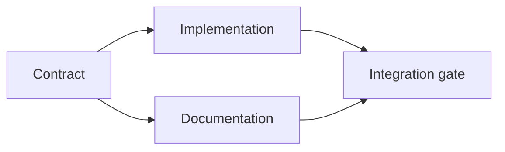

# 建立一个证据支持的执行计划.

> 计划不是一个更漂亮的任务列表. 它是一个依赖图表,其中每个变化都有原因,每个终端节点都有证明.

> **【中文解读】**计划不是"更好看的待办清单",而是一个依赖图:每个变动都有理由,每个终端节点都有证明.

>  **【前置】**首先要掌握第14阶段 第43课 首先要完成任务,再写代码`outputs/task-frame.md` 课产出`outputs/evidence-plan.json`作为多代理委托的契约.

**Type:** Learn + Build | **类型:** 学习 + 动手实践
**Languages:** Python (stdlib) | **语言:** Python（标准库）
**Prerequisites:** Phase 14 lesson 43 | **前置知识:** Phase 14 第 43 课
**Time:** ~65 minutes | **时间:** 约 65 分钟

## 学习目标

- 转换一个任务框架成用证据和证据的工作项目.
  中文翻译:把任务框架转化为带证据和证明工作项.
- 模型的顺序是依赖性而不是散文序列.
  中文翻译:用依赖关系建模先后顺序而不是散文式叙述.
- 在编辑之前,检测缺失的事实,未知的依赖性和周期.
  中文翻译:在动手编辑之前,检测缺失的事实、未知的依赖和循环依赖──
- 单独的步骤可以一起运行,
  中文翻译:区分可以同时运行的步骤和必须等待的步骤.

## 为什么代理计划失败?

软弱的计划将在未来重复请求:

> 弱计划只是把请求复述成未来时:

1. 更新API.
   中文翻译:更新API。
2. 增加测试.
   中文翻译:加测试──
3. 更新文件.
   中文翻译:更新文档──

没有什么在列表中说出发现了什么,为什么这些文件是正确的,哪个合同先改变,或者同时发生什么.

> 没有任何说明:发现了什么,为什么这些文件,哪些协议先变,哪些步骤可以发行.

> **【中文解读】**弱计划的特征是"复述请求"它看起来有序号,有动词,但没有仓库证据.强计划对每个工作项目做五项承诺.

一个强有力的计划为每个工作项目作出了五项承诺:

| Commitment | Purpose |
|---|---|
| Identifier | Stable reference for dependencies and handoff |
| Change | The smallest behavior or contract change |
| Evidence | Repository facts that justify the change |
| Dependencies | Work that must be true first |
| Proof | The exact check that closes the item |

> **【中文解读】**五个承诺分别是:标识符 (标识符) 变化 (变化) 最小的行为或契约变化 (变化) 证据 (证据) 证明这种变化是合理的仓库事实 (实实) 依赖 (依赖) 必须先为真工作 (实务) 证明 (关闭这个工作项目的确切检查) :"变化要最小和:"证明要确切是最常被省略的两个省份前任任务膨胀,省略后任"完成"失去定义"".

## 计划合同之前的执行,先定约,再做实现.

当多个表面依赖于相同的行为时,首先定义行为.测试,实现,文档和集成可以分享一个合同,而不是发明四种版本.

> 当多个表面依赖于相同行为时,先定义行为本身――测试实现文档集成,然后共享相同的契约,而不是各自发明四个版本――

>  **【类比】**契约先行如先定国标插头再生产电器.插座厂.实现.和电器厂.文档) 可以同时开工,因为接口已经锁定了.验收员.集成门.只需对照相同的标准检查两边.



合同的实施和文件可以在合同确定后一起进行. 整合等待两者.

> 后,实现和文件可以同时推进; 集成等等都完成.

## 证据改变了计划

存储证据不是装饰,它应该能够改变工作:

> 仓库证据不是装饰品. 它必须有能力改变工作内容:

- 现有辅助者删除了计划的新抽象.
  中文翻译:一个已存在的辅助函数,切掉了计划中的新抽象──
- 兼容性测试强迫迁移步骤.
  中文翻译:一个兼容性测试,逼出计划外的迁移步骤.
- 部署限制将一个方案变化转移到另一个任务.
  中文翻译:一个部署约束,把方案变更转移到另一个任务.
- 公共响应类型改变了实施和文档的顺序.
  中文翻译:一个公开的响应类型,改变了实现与文档的前后顺序.

如果证据不能改变计划,那么这可能不是决定的证据.

> 如果证据改变不计划,它是大多数决定的证据.

> **【中文解读】**这是一个非常有用的假证标准:把"证据"贴在决定旁边,问"如果反过来,计划会改变吗?"不会改变,说明它只是装饰真正支这个决定是别的东西(习惯猜测或代理默认值) 证据里每条都应该通过这个关键.

## 设计为中断.

编码代理会议突然结束.可重复计划的工作项目足够小,以使另一个会议可以确定:

> 编码代理会话意外结束.可继续运行的计划要求工作项足够小,小到另一个会话能够判断:

- 哪个项目已完整;
  中文翻译:哪个工作项已完成;
- 哪些证据被运行;
  中文翻译:哪个证明已经跑过;
- 哪些文物发生了变化;
  中文翻译:哪些产物变了;
- 现在哪些依赖性已解锁;
  中文翻译:哪些依赖已解锁;
- 接下来安全的东西是什么?
  中文翻译:下一个安全工作项是什么?

不要只在聊天室内的选项框中编码状态.

> 不要把状态编码在聊天记录的勾选框里.

> **【中文解读】**代理会话自然短命:上下文窗口会满、网络会断、你会开新会话――所以计划状态必须被外置到文件系统就像游戏要存储盘一样――"哪些证明已经跑过"这一条特别关键:新会话不应该重复跑过昂贵的验证,更不应该跳过来以为它已经跑过――

## 计划验证. 计划测试.

在执行之前拒绝计划,如果:

> 在下列情况发生时,在执行之前拒绝该计划:

- 标识符是复制的;
  中文翻译:标识符重复;
- 工作件没有证据;
  中文翻译:某个工作项没有证据;
- 工作件没有证据;
  中文翻译:某个工作项没有证明;
- 依赖性名称是未知的项目;
  中文翻译:某个依赖指向不存在的工作项;
- 图表包含一个周期;
  中文翻译:依赖图里有环;
- 在解决相关不确定性之前,第一项不可逆转的行动发生.
  中文翻译:第一不可逆动作,出现它所依赖的不确定性被解决之前.

首先,五项检查是机械的,最后一个检查需要判断,

> 检查是机械的.最后一条需要判断力,应该显然单独指出.

> **【中文解读】**六条拒绝规则里藏着本课程最重要的排序原则:不可逆动作 (迁移,删除,发布,公开契约变更) 必须排在不确定性之后.循环依赖通常不是笔错,而是两个工作项后有一个没有摊摊的产品分歧,先解决分歧,再改图.

## 建立它,实现它.

`code/main.py`模型工作项目,验证其收据,计算执行波以拓类型,并写`outputs/evidence-plan.json`现在,我们要去.

> `code/main.py`建模工作项目的证据,并写出`outputs/evidence-plan.json`,我知道.

运行:

> 运行:

```bash
python3 code/main.py
python3 -m unittest discover code/tests -v
```

具体情况是: 合同定义是第一,实施和文档是最后的,集成门是最后的.

> 示例产出三个波次:契约定义最先运行,实现和文档同时运行,集成门最后运行.

> **【中文解读】**"波次"是拓排序的直接应用:每一波的工作项目不相互依赖,可以分为不同代理并行;跨波次必须等上一波完成.

## 用它与编码代理合作

让代理人在改变文件之前制作计划.

> 让代理在文件改之前先出出计划.

1. 每个路径和行为要求都有存储收据.
   中文翻译:每条路径和行为断言都有仓库凭证.
2. 每个项目都有一个明确的完成证据.
   中文翻译:每个工作项目都有一个明确的完成证明.
3. 图表延迟昂贵或不可逆转的工作,直到它所依赖的不确定性得到解决.
   中文翻译:依赖图把昂贵或不可逆的工作,延迟到依赖的不确定性被解决后.

批准计划,而不是保证要小心.

> 批准了这个计划,不是一句"我会小心"的模糊承诺.

## 练习,练习.

1. 添加一个需要人明确批准的迁移项目.
   中文翻译:加一个需要人工显然批准的迁移工作项.
2. 创造一个循环,并解释背后的隐藏产品分歧.
   中文翻译:制造一个循环依赖,并解释它背后隐藏的产品分歧.
3. 分开一个有两个证明命令的项目.
   中文翻译:把一个带两条证明命令的工作项拆开.
4. 加入一个可以在第二波中运行的工作项目,而不需要触及任何现有分支.
   中文翻译:加一个可以在第二波运行,且不触碰两条现有分支工作项.
5. 让计划作为Markdown,同时保留JSON作为真相来源.
   中文翻译:把计划染成标记,同时保持JSON作为唯一的事实来源.

## 继续阅读 继续阅读

- [Nuseibeh and Easterbrook, Requirements Engineering: A Roadmap](https://www.cs.toronto.edu/~sme/papers/2000/ICSE2000.pdf)为了实现目标,规格,协议和进化之间的反复关系.
  中文翻译:Nuseibeh与Easterbrook需求工程:路线图目标、规格、共识与演化之间的代关系。
- [Barry Boehm, A Spiral Model of Software Development and Enhancement](https://dl.acm.org/doi/10.1145/12944.12948)对于规划风险解决方案而不是固定线性序列的发展.
  中文翻译:巴里·博姆软件开发的螺旋模型围绕风险消解而不是固定线性顺序来安排开发.

## 你留下什么,你留下什么产品.

保持`outputs/evidence-plan.json`在下课中,它成为代表合同.

> 留下`outputs/evidence-plan.json`,它将在下课中变成委托契约.
