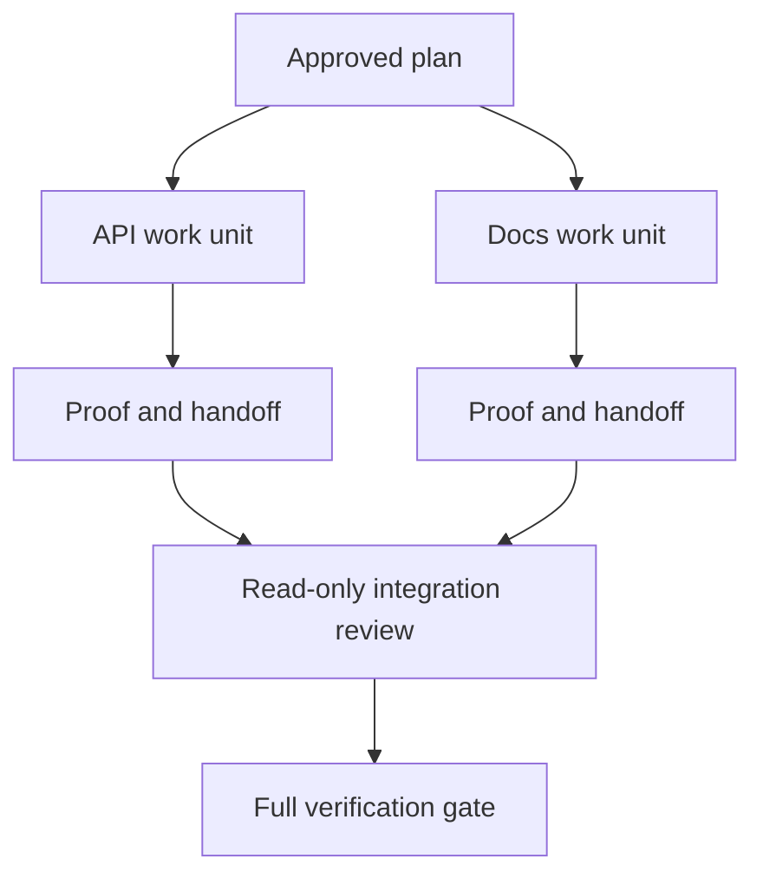

# 代表代理与隔离和合并合同合作

> 只有工作独立时才可以节省墙上的时间.否则,它们将一个清晰的任务转化为一个更快的失败率的协调问题.

> **【中文解读】**并行经理只有在工作真正独立时才能省时间;否则它将一个清晰的任务变成一个协调问题,而且更快地失败.

>  **【前置】**审核员 审核员 审核员 审核员 审核员 审核员 审核员 审核员 审核员 审核员 审核员 审核员 审核员 审核员 审核员 审核员 审核员 审核员 审核员 审核员 审核员 审核员 审核员 审核员 审核员 审核员 审核员 审核员 审核员 审核员 审核员 审核员 审核员 审核员 审核员 审核员 审核员 审核员 审核员 审核员 审核员 审核员 审核员 审核员 审核员 审核员 审核员 审核员 审核员 审核员 审核员 审核员 审核员 审核员 审核员 审核员 审核员 审核员 审核员 审核员 审核员 审核员 审核员 审核员 审核员 审核员 审核员 审核员 审核员 审核员 审核员 审核员 审核员 审核员 审核员 审核员 审核员 审核员 审核员 审核员 审核员 审核员 审核员 审核员 审核员 审核员 审核员 审核员 审核员 审核员 审核员 审核员 审核员 审核员 审核员 审核员 审核员 审 审 审 审 审 审核员 审 审 审 审 审 审 审 审 审 审 审 审 审 审 审 审 审 审 审 审 审 审 审 审 审 审 审 审 审 审 审 审 审 审 审 审 审 审 审 审 审 审 审 审 审 审 审 审 审 审 审 审 审 审`outputs/evidence-plan.json`执行波后直接决定哪些工人可以并行.`outputs/delegation-plan.json`记录分开为什么安全, 归归谁的路, 集成要得到什么证据.

**Type:** Learn + Build | **类型:** 学习 + 动手实践
**Languages:** Python (stdlib) | **语言:** Python（标准库）
**Prerequisites:** Phase 14 lessons 39 and 44 | **前置知识:** Phase 14 第 39、44 课
**Time:** ~70 minutes | **时间:** 约 70 分钟

## 学习目标

- 决定是否由真正的独立性证明授权是合理的.
  中文翻译:判断委托是否被真实的独立性所支.
- 给每一个工人独家文件所有权和明确的证据.
  中文翻译:给每一个工人独占文件所有权和明确证明.
- 计算执行波来自依赖.
  中文翻译:从依赖关系计算执行波次.
- 设计一个合并合同,以安全地结合代理工作.
  中文翻译:设计一个安全合并代理 工作的合并契约。

## 随机测试.

没有其他代理人可以委托,但至少有一个是真的:

> 不要因为"有更多的代理可用"就委托.

- 两项调查可以独立回答不同未知的问题;
  中文翻译:两项调查能独立回答不同的未知项;
- 两个实施机构的文件和合同是分离的;
  中文翻译:两个实现拥有相互不相对的文件与契约;
- 审查员可以在不改变完成的文物进行检查;
  中文翻译:一个评审员可以检查完成的产品而不修改它;
- 在本地工作继续时,可以进行缓慢的外部检查.
  中文翻译:一个慢速外部检查可以同时运行在本地工作继续.

工作要保持序列,当代理人需要相同的文件,相同的未解决的决定,或相同的可变环境.

> 当多个代理人需要相同的文件,或者一个未决的环境,保持串行.

> **【中文解读】**"并行测试"是本课的第一门:可用性不是理由,独立性才是.四条判断的共同点是"不共享可变状态"

## 一个工作单位是一个合同.

每个委托单位需要:

> 每个委托单位需要:

| Field | Meaning |
|---|---|
| Goal | One observable result |
| Owner | One accountable worker |
| Paths | Exclusive write ownership |
| Dependencies | Completed units required before starting |
| Proof | Exact evidence returned to the integrator |
| Handoff | Files changed, decisions made, remaining risk |

> **【中文解读】**六段中最关键的是路径 (独占写入所有权) 和证据 (交付给集成者确切证据) :"搞定后端"之所以不合格,是因为它既没有独占的路径,也没有可接受的证据 责任不能落在一个工人的头上.

处理后端不是一个工作单位. 执行复制检查.`app/accounts.py`通过专注的账户测试证明它是.

> 搞定后端不是一个工作单元.`app/accounts.py`实现重复检查,并使用聚焦的账户测试证明它"才是.

## 隔离有三个层.

1. **Filesystem isolation:**单独的工作树或沙盒可以防止意外共享编辑.
   翻译: 中文**文件系统隔离：**独立工作树或沙箱防止意外的共享编辑
2. **Ownership isolation:**合同阻止两个工人故意编辑相同的路径.
   翻译: 中文**所有权隔离：**契约防止两个工人有意编辑相同的路径.
3. **State isolation:**单独的日志和输出防止一个工人覆盖其他工人的证据.
   翻译: 中文**状态隔离：**独立日志与输出防止一个工人覆盖另一个工人的证据

文件系统隔离不能解决所有权.两个干净的工作树仍然可以产生相互矛盾的设计.合并合同必须在工作开始之前解决共享接口.

> 文件系统隔离解决了所有权问题. 两个干净的工作树仍然可能产生相互冲突的设计.

> **【中文解读】**三层隔离常被误认为"开启了工作树就完成了"――但工作树只能防止意外碰撞,防止不存在两个工人, 设计了各自朝的冲突走走那就是所有权层的责任;日志相互覆盖则是状态层的责任――三层各管一类失败,缺一层就留一类坑――



> 图解:已批准的计划分成两个工作单元,各自交交回证明与交交接说明;集成者先做只读评审,最后运行完整的验证门.

## 集成者不重做工作

集成器应:

> 集成者应该:

1. 确认每次交付符合其分配范围;
   中文翻译:确认每份交接与它分配的范围一致;
2. 阅读证明结果,而不仅仅是工人摘要;
   中文翻译:读证明输出本身,而不仅仅是工人的总结;
3. 结合依赖顺序的变化;
   中文翻译:按依序合并改动;
4. 运行整个跨单位门;
   中文翻译:运行完整的跨单元验证门;
5. 拒绝隐藏范围扩展;
   中文翻译:拒绝隐藏的范围扩张;
6. 记录冲突作为新的决定,而不是默默的编辑.
   中文翻译:把冲突记录为新的决定,而不是改掉.

如果整合需要重写一个工人的大部分结果,那么原始的分解是错误的.

> 如果集成需要重写工作者结果的大部分,说明最初的分解是错误的.

> **【中文解读】**集成员的角色是"收件员",不是"补刀选手"――第六条职责第2条最容易被跳过只读工人的自述就放弃,等于把收件外包给受收件者――最后一段是分解质量的试金石:集成阶段的大规模回归,问题永远出现在上游的分离,而不是集成者的手工――

## 人与代理角色

委托并不能消除人类的判断力.人类仍然拥有改变公共行为,风险,权威或不可逆转的成本的选择.代理人可以拥有有限的调查,实施,验证和审查.

> 委托不取代人的判断. 人继续拥有改变公开行为,风险,授权或不可逆成本的选择. 代理可以拥有有界限的调查,实现,验证和评审.

这是一种校准自主性:系统在证据和反弹强度的情况下给予自由,并且在后果很高的情况下需要检查点.

> 这就是校准自主权:系统在证据和回滚能力强的环节放放权,在后果严重的环节设检查点.

> **【中文解读】**"校准自主权"是本课的价值观主张:自主程度不是越高越好,而应与"证据强度 × 可回滚性"成正比.

## 建立它,实现它.

实验室检查路径重叠,验证依赖性,计算安全执行波,并写`outputs/delegation-plan.json`现在,我们要去.

> 实验部分会检查重叠路径,校验依赖,计算安全的执行波次,并写出`outputs/delegation-plan.json`,我知道.

运行:

> 运行:

```bash
python3 code/main.py
python3 -m unittest discover code/tests -v
```

换个医疗单位,`app/`计划应该被阻止,因为这个母路线覆盖了API单元.

> 把文档单元改成拥有`app/`◎计划应该被拦截,因为这个路径与API 单元重叠.

> **【中文解读】**破坏实验 把 doc 单元所有权改成`app/`) 演示了所有权分离的机械化:路径重叠不依赖于自我,靠校验器直接拒绝.

## 练习,练习.

1. 分解一个真正的变化成两个独立的工作单位和一个集成器.
   中文翻译:把一个真实改动分解成两个独立工作单元和一个集成者.
2. 找到一个拟议的平行分区,看起来只独立.
   中文翻译:找一个看起来独立的并行分方案,说它共享的决定.
3. 添加一个只读的研究人员,其输出是一个事实表.
   中文翻译:加一个只读的调研工,它的产品是一个事实表.
4. 添加一个合并门,检查最后的更改文件组与所有单元合约.
   中文翻译:加一个合并门:把最终改动文件集合与所有单元契约逐一核对.
5. 确定一个因依赖无效的工人取消规则.
   中文翻译:为一个依赖失效的工人 定义取消规则──

## 继续阅读 继续阅读

- [Reid Smith, The Contract Net Protocol](https://doi.org/10.1109/TC.1980.1675516)为了早期正式处理分布式任务分配和结果报告.
  中文翻译:雷德·史密斯契约网协议分布式任务分配与结果汇报的早期形式化处理,本课"工作单元即契约"的思想源头.
- [Eric Horvitz, Principles of Mixed-Initiative User Interfaces](https://dl.acm.org/doi/10.1145/302979.303030)机器人应该何时行动,何时将控制权归还给一个人.
  中文翻译:埃里克·霍维茨混合主动界面的原则决定自动化何时该行动何时应交回控制权,即"校准的自主权"的出处.

## 你留下什么,你留下什么产品.

保持`outputs/delegation-plan.json`它记录了分离是为什么安全的,每个路径是谁的,以及必须获得哪些证据的集成.

> 留下`outputs/delegation-plan.json`,它记录了分离为什么安全,每个路径归归谁所有,以及集成必须得到什么证据.
