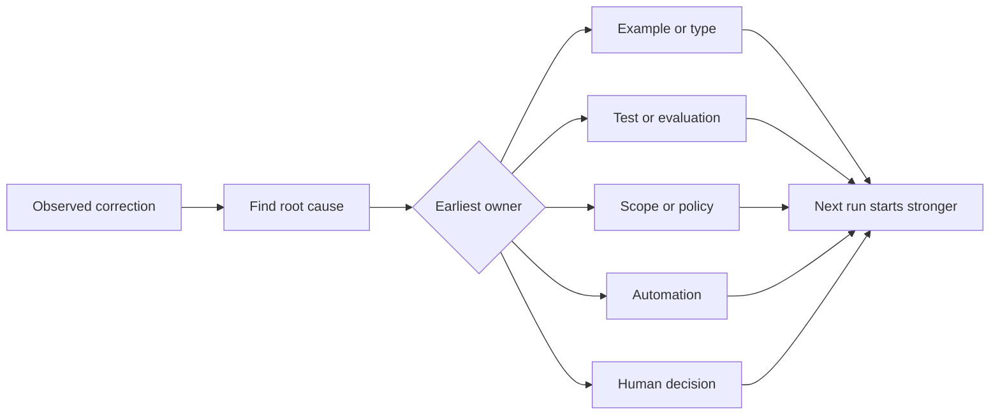

# 让每一个纠正代理变成一个系统改进,把反变成一个系统.

> 只有在聊天中存在的修正,只能修复一个运行.

> **【中文解读】**只有活在聊天记录中的纠正,只修复一次运行;升级为测试,边界,示例或工具的纠正,每一次运行,改善后的.本课讲"反棘轮":对代理的每次人工纠正工作系统的观测数据进行查询,找到根源,升级到能够预防复发的最早层次,并定期淘汰失效控制.

>  **【前置】**课前请先掌握第14阶段 第37-41课 运行时反循环,验证门,审查员 代理商,多会话交接,真实仓库工作台) 本课是把整个反机制收录成一个"只进不回"的系统改进记录.本课产出`outputs/feedback-ratchet.json`现在,它是未来工作台的转变输入.

**Type:** Learn + Build | **类型:** 学习 + 动手实践
**Languages:** Python (stdlib) | **语言:** Python（标准库）
**Prerequisites:** Phase 14 lessons 37 to 41 | **前置知识:** Phase 14 第 37-41 课
**Time:** ~65 minutes | **时间:** 约 65 分钟

## 学习目标

- 转换对应剂为耐用控制.
  中文翻译:把对代理的纠正转化为持久的控制手段.
- 设置每个控制器在最早的层,以防止重复.
  中文翻译:把每个控制放在能预防复发的最早层.
- 通过稳定的指纹复制重复课程.
  中文翻译:用稳定的指纹重复的教训去重复.
- 退休控制器不再保护真正的风险.
  中文翻译:退役那些不再保护真风险的控制.

## 纠正就是证据.

当你告诉代理人不要编辑该文件时,你已经知道范围界限是无法执行的.当你说出输出形状是错误的时,你已经知道一个例子或测试缺失了.当设置再次失败时,你已经知道环境知识属于自动化.

> 当你对代理说:"别改那份文件"",你学会了:范围边界不可执行"",这个输出形状不对"",你学会了:缺少一个示例或测试――当环境建设再次失败时,你学会了:环境知识应该自动化――

处理纠正是关于工作系统的观察,而不是简单的写作失败.

> 纠正对工作系统的观测,而不是一次性写作失败.

> **【中文解读】**这一节改变了个角度:每次纠正都是系统报告自己的漏洞""边界不可执行""示例缺失""知识没有落盘""把纠正作为证据而不是事故,你才会问"哪一层应该负责",而不是反复在聊天中说同一个句话.

## 升级到最早的有效层

使用以下顺序:

> 按这个顺序升级:

| Recurring failure | Durable destination |
|---|---|
| Wrong result or regression | Test or evaluation |
| Off-scope or unsafe action | Scope or permission policy |
| Repeated setup or command mistake | Automation or tool |
| Repeated output-format mistake | Canonical example plus validator |
| Ambiguous local convention | Instruction with a scenario check |
| Product disagreement | Human decision record |

早期的控制更便宜.防止不有效状态的类型比后来发现的评论更强大. 专注测试比要求代理记住的段落更强大.

> 越早的控制越便宜――一种防止非法状态出现的类型,强过一条事后才抓住它的评审评论――一个聚焦的测试,强过一段求代理的文字:"记住""――

> **【中文解读】**这张表是本课程的核心决策表:结果错升级为测试/评估;越界升级为范围/权限策略;反复踩环境坑升级为自动化;格式错升级为规范示例加校验仪;约定含糊升级为场景检查的指令;产品分歧升级为人工决定记录.原则是"越靠前的控制越便宜"能在类型系统中停留,别留到评审;能用测试钉死,别写在快速里里.



> 图解:观察到纠正 → 找根因 → 判定最早的责任层(示例/类型、测试/评估、范围/策略、自动化、人工决定)→ 下一次运行从更强的起点开始──

## 子记录

捕获:

> 记录这些字段:

- 症状;
  中文翻译:症状;
- 根本原因;
  中文翻译:根因;
- 结果;
  中文翻译:后果;
- 复发数量;
  中文翻译:复发次数;
- 选择的控制;
  中文翻译:选定的控制;
- 进行检查;
  中文翻译:控制自己验证方式;
- 拥有者;
  中文翻译:负责人;
- 审查或退休日期.
  中文翻译:复审或退役日期──

避免每一次偏好,而是在复发或后果证明永久复杂时,促进纠正.

> 只有当复发次数或后果严重到值得引入永久复杂时,才会升级这一条文.

> **【中文解读】**八段里",控制自己验证方式"和"退役日期"最容易被省略.前者保证这种控制真的被阻止了.

>  **【类比】**棘轮手像一个只不跌的储蓄──之前:每次纠正都从零开始、说完就忘了;之后:每次纠正都推动轮单向前进一格(一条可验证的控制),系统只会变强,不会回来──

## 原因与症状的区别

 编辑的README是症状. 可能的原因包括:

> 由于这些病因,

- 任务允许存储器根;
  中文翻译:任务允许仓库根目录;
- 文件被隐含认为安全;
  中文翻译:文档被默认当作安全区;
- 计划的综合执行和文档;
  中文翻译:计划把实现和文档捆绑在一起;
- 两名工人拥有重叠的财产.
  中文翻译:两个工人的所有权有重叠.

每个原因都属于不同的控制. 只是重复症状的规则,

> 每个原因都应对不同的控制. 只要重复症状的规则,下一次会有不同的情况,就会失效.

> **【中文解读】**这是最容易偷的步骤:把"别改 README"写成规则很容易,找出"为什么会被改变"很难.

## 控制也会腐烂

旧控制器可能会发生冲突,膨胀的环境,并编码已经不存在的系统.每一个推广的规则都需要退休检查.

> 旧控制会相互冲突,并固化一个已经不存在的系统. 每条升级过的规则都需要退役检查.

- 基础架构发生了变化;
  中文翻译:底层架构已经变了;
- 强大的可执行控制取代了它;
  中文翻译:更强的可执行控制取代了它;
- 由于未经经过任何有效的窗口出现故障,
  中文翻译:在一个有意义的时间窗内故障再未复发;
- 控制的摩擦比它所防止的风险更大.
  中文翻译:控制制造的摩擦已经超过了它防住风险.

目标不是最长的指令文件,而是最小的系统,

> 目标不是最长的指令文件,而是保存的最轻微的判断力系统.

> **【中文解读】**棘轮只进不退,但控制会过期――"每条规则都必须有退役检查"与项目目标文件的维护直接相关:不加清理的规则堆积,最终会相互矛盾、淹没重点、描述一个不存在的系统――目标是"保存判断力的最小系统",不是最长的说明书――

## 建立它,实现它.

实验室将纠正分类,将它们推广为控制,`outputs/feedback-ratchet.json`现在,我们要去.

> 实验部分将对纠正分类进行调整,升级它们进行控制,使用指纹重复,并写出`outputs/feedback-ratchet.json`,我知道.

运行:

> 运行:

```bash
python3 code/main.py
python3 -m unittest discover code/tests -v
```

添加两个不同的编写,相同的原因的纠正. 改善正常化,直到它们崩成一个控制器,而不会崩的不相关的故障.

> 加入两条措辞不同,但根源相同的纠正. 改进归化逻辑,直到它们合并成为一个控制,同时不让无关的失败被误合并.

> **【中文解读】**破坏实验演示指纹重重的关键张力:归一化太松,同根因的两条纠正各立一条控制;太紧,无关失败被错合并(错伤) ;;去重点的点是根因,不是措辞

## 练习,练习.

1. 根据最近的编码会议的五项修正,
   中文翻译:从最近一次编码会话里取五条纠正,分类它们的真正责任层.
2. 换一个散文规则一个可执行的测试.
   中文翻译:把一条文字规则换成一个可执行的测试.
3. 增加后果权重,以便立即促进严重的第一次发生.
   中文翻译:加后果权重,让严重的第一次发生可以立即升级.
4. 添加一个所有者和退休日期到实验室输出.
   中文翻译:给实验输出加上负责人和退役日期.
5. 检查现有代理指令,并仅在证明有更强的控制后删除.
   中文翻译:审查一条现有代理指令,只有在证明存在更强的控制后才删除它.

## 继续阅读 继续阅读

- [Basili, Caldiera, and Rombach, The Goal Question Metric Approach](https://www.cs.toronto.edu/~sme/CSC444F/handouts/GQM-paper.pdf)目标将目标转化为问题和操作测量.
  中文翻译:Basili、Caldiera 与 Rombach 目标问题量法把目标转化为问题和可操作的量量――
- [Shinn et al., Reflexion](https://arxiv.org/abs/2303.11366)通过反痕迹来改善后期决策,而不会改变模型重量.
  中文翻译:Shinn 等反轨迹改进后续决策而不改动模型权重──
- [Madaan et al., Self-Refine](https://arxiv.org/abs/2303.17651)对于任务循环内部的反和修改.
  中文翻译:Madaan 等自精任务循环内部的代反与修订──

## 你留下什么,你留下什么产品.

保持`outputs/feedback-ratchet.json`作为助理工程的终结,它是未来工作台变化的输入.

> 留下`outputs/feedback-ratchet.json`是"代理辅助工程"路线的永久终点,也是未来工作台变动的输入.
