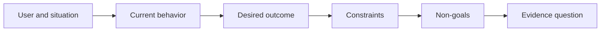

# 在选择输出之前,定义结果.

> 快速执行增加了选择错误的问题的惩罚.

> **【中文解读】**""产出"",输出"是你决定建造的东西一个助手"",一个页面"",一个模型;"结果"",结果") 是世界里可观察的变化谁在什么情况下变得好了什么.实现越快,选择错误的问题成本越高. 本课教你先写"结果框架"",结果框架":用户"",情况"",当前行为"",期望结果"",约束"",非目标"全程不提任何具体解法.

>  **【前置】**无硬性前置课程──本课是47-54 课程"塑造构建"路径(结果定义 → 工作流发现 → 假设与风险 → 最小切片 → 规格 → 指标 → 分阶段发布 → 反所有权) 的起点──

**Type:** Learn + Build | **类型:** 学习 + 动手实践
**Languages:** Python (stdlib) | **语言:** Python（标准库）
**Prerequisites:** None | **前置知识:** 无
**Time:** ~60 minutes | **时间:** 约 60 分钟

## 学习目标

- 写出一个结果框架,而不是命名一个解决方案.
  中文翻译:写出一个不点名任何解决方案的结果框架.
- 识别用户,情况,当前的行为,以及所需的变化.
  中文翻译:识别用户的情况,当前行为和期望的变化.
- 具体说明限制和非目标.
  中文翻译:把约束和非目标写明确.
- 在溶液硬化到范围之前检测到溶液泄漏.
  中文翻译:在解决方案泄漏硬化成范围之前检测到它.

## 产出不等于结果.

构建一个事件助理命名输出. 它不说明谁需要它,什么变得更好,或者什么必须保持安全.

> 没有说谁需要它,什么会变得好,什么必须保持安全.

结果框架说:

> 结果框架这样说:

> 随着生产警报的到来,现场工程师在两分钟内确定故障服务和安全下一步行动,而诊断仍然仅可读和可审计.

> 译文:当生产告警到达时,值班工程师可以在两分钟内定位故障服务并找到安全的下一步行动,同时诊断整个过程保持只可读和可审计.

通过软件,运行簿,数据维修或更小的界面更改,

> 这句话可以由一个软件,一个运行手册,一次数据修复或更小的界面改变来满足. 它让团队决定结果,而不是决定某人最早想象的产品.

> **【中文解读】**产出与结果的区别是本课的基础:产出只是解空间的入口,结果才是要到达的终点.上面的样板句子值得仔细看它没有提及"助手"",AI"",界面"",只写谁"",何时"",多快"",什么不允许改变――因为它没有解法,软件"",手册"",数据修复"",小改才有资格与台竞争.

## 六段式框架

| Part | Question |
|---|---|
| User | Who experiences the problem directly? |
| Situation | When and where does it occur? |
| Current behavior | What happens today, including workarounds? |
| Desired outcome | What observable state should improve? |
| Constraints | Which safety, policy, cost, or compatibility limits are fixed? |
| Non-goals | What tempting adjacent work is excluded? |



> 图解:用户与情境 → 当前行为 → 期望结果 → 约束 → 非目标 → 证据问题,六段依序收紧。

> **【中文解读】**六段是有序的:先有人和情境,才谈到行为;先看清现状;先看清现状;先谈到改变;束收紧解空间,非目标住顺手的诱惑,最后落到"观察能证明结果是实现的"......表中最常被跳过的是当前行为不写现状的"期望结果"的大部分是想象.

## 找出解决方案 泄漏

结果声明在包含未经证据获得的产品形式,界面,模型选择,框架或架构时泄漏解决方案.

> 当结果陈述包含未经证实的产品形态,界面,模型选择,框架或架构时,解决方案就泄露了.

- 用户收到每周的AI总结泄漏总结和序列.
  中文翻译::"用户每周收到一个人工智能摘要"",泄露了"摘要"这个形式和"每周"这个节奏.
- 用户在批准之前了解账户变化表示结果.
  中文翻译::"用户在批准前理解账户变更""陈述结果.
- 部署一个向量数据库泄漏基础设施.
  中文翻译:"部署一个向量数据库"",泄露了基础设施.
- 审查期间可获得相关政策证据指出能力.
  中文翻译:"评审时能获得相关政策证据"的陈述是一种能力.

限制可以命名技术,当兼容性真正解决它.

> 当兼容性确实被锁定在技术选择时,约束里可以点名技术――记下为什么它被固定――

> **【中文解读】**泄漏检测的判断:句子中出现了"产品形态/界面/模型/框架/架构"级别的词语(AI 摘要、向量库、应用),而它还没有得到证据,就是泄漏.四个例句

## 限制保护结果

限制不是执行细节,而是现实目标的一部分:

> 约束不是实现细节.

- 在诊断期间没有产品写作;
  中文翻译:诊断期间不写生产库;
- 应对事件时间预算内;
  中文翻译:在事故时间预算内响应;
- 目前的审计活动仍然具有权威性;
  中文翻译:现存审计事件保持权威性;
- 没有新的运行时间依赖性;
  中文翻译:不引入新的运行时依赖;
- 访问性行为仍然不变.
  中文翻译:无障碍行为保持完好――

通过违反限制而达到结果的建设并没有达到结果.

> 根据约束抵达的构建,没有真正的抵达结果.

> **【中文解读】**约束写在结果框架中而不是 PR 描述中,原因是最后一句话:违约的"成功"不算成功. 这些条款通常编码安全,合规或兼容性.它们是目标的一部分,也将成为后续收获的一部分.

## 没有目标 建立一个边界

没有目标阻止一个有用的片子变成平台.好的没有目标足以拒绝工作:

> 没有目标是防止一个有用的片子成一个平台.

- 没有自动补救;
  中文翻译:不做自动修复;
- 没有新的警报路由系统;
  中文翻译:不建新的告警路由系统;
- 没有取代事件指挥官;
  中文翻译:不取代事故指挥官;
- 没有历史分析.
  中文翻译:本切片不做历史分析.

> **【中文解读】**没有目标是范围的负空间,与第43课任务框架中的"禁止路径"的构成. 判断一个非目标条文写得不好,就问它能否被用来拒绝一个具体的诱惑 ("顺便做一个自动修复吧?") 拒绝不了的"非目标"只是装饰.

## 建立它,实现它.

实验室验证了`OutcomeFrame`他写了`outputs/outcome-frame.json`现在,我们要去.

> 实验部分会校验一个`OutcomeFrame`写出来`outputs/outcome-frame.json`,我知道.

```bash
python3 code/main.py
python3 -m unittest discover code/tests -v
```

使用事件助理.验证器应标记拟议输出泄漏到结果中.

> 预期结果转换为"使用事故助手"――校验器应标记:拟议产品出炉进入结果――

> **【中文解读】**破坏实验把"泄漏检测"变成一个机械规则:期望结果一一旦出现解法形态(使用/构建/部署加产品名),校验器就拒绝了――人工评审时也只需要问一句:"这句话删掉产品名还成立吗??"

## 练习,练习.

1. 作为结果框架,将您的后期记录中的功能请求重写.
   中文翻译:把你后备 里 一条功能请求重写成结果框架――
2. 增加一个限制,改变哪些解决方案仍然是可能的.
   中文翻译:加一条能改变"哪些解仍可行"的约束.
3. 加入两个非目标,保持第一块小.
   中文翻译:加两条非目标,让第一个切片保持小.
4. 确定最早的观察,可以驳斥所需结果.
   中文翻译:指出最早的、能证伪期望结果的观察──
5. 写出三种不同的结果,可以满足相同的结果.
   中文翻译:写出三种不同的产出,它们都能满足同一个结果.

## 继续阅读 继续阅读

- [Nuseibeh and Easterbrook, Requirements Engineering: A Roadmap](https://www.cs.toronto.edu/~sme/papers/2000/ICSE2000.pdf)对于对待现实目标而言,
  中文翻译:Nuseibeh 与Easterbrook需求工程:路线图把真世界目标当作软件工作的点──
- [Dardenne, van Lamsweerde, and Fickas, Goal-Directed Requirements Acquisition](https://doi.org/10.1016/0167-6423(93)为了使高层目标变得有限和运营要求.
  中文翻译:达尔登·万·兰斯韦尔德与菲卡斯目标导向的需求获取把高层目标精化为束与可操作的需求

## 你留下什么,你留下什么产品.

保持`outputs/outcome-frame.json`下一堂课试验了人们实际的工作流程.

> 留下`outputs/outcome-frame.json`下课将对人们实际执行工作流进行检查.
