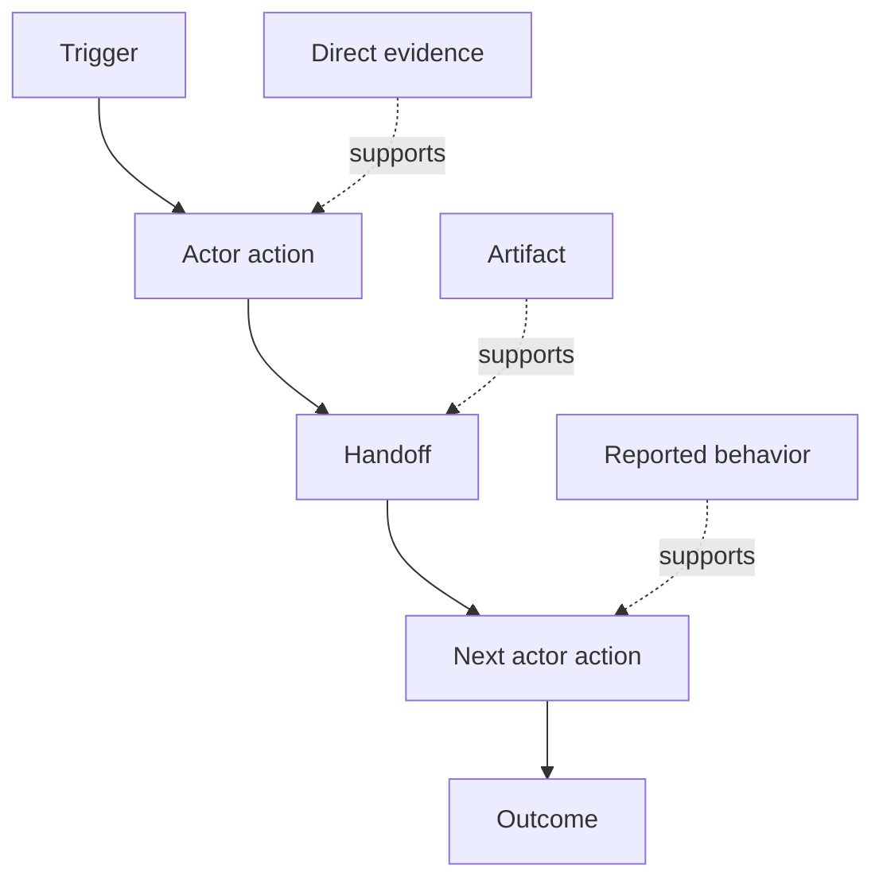

# 发现人们实际上做的工作流程

> 要求不是在会议上等待收集,而是分散在行动,解决方案,记录和分歧中.

> **【中文解读】**需求不是躺在会议里等等来收取的,而是散落在动作,绕行方法,记录和分歧里. 本课教你从"现在真的是发生什么"发出做工作流发现:给每个步骤的行动者,触发,动作,输入输出摩擦,权限,证据,给证据分级,并保持分歧而不是把它平均掉.这是"塑造构建路径"的第二课.

>  **【前置】**课前请先掌握第14阶段 第47课. 课前结果产生的正是这个课试的结果框架:预期的结果必须落在人们实际执行的工作流中,而不是想象的工作流中.`outputs/workflow-evidence.json`下一课将观察到的摩擦和不确定性变成一个假设地图.

**Type:** Learn + Build | **类型:** 学习 + 动手实践
**Languages:** Python (stdlib) | **语言:** Python（标准库）
**Prerequisites:** Phase 14 lesson 47 | **前置知识:** Phase 14 第 47 课
**Time:** ~70 minutes | **时间:** 约 70 分钟

## 学习目标

- 模型当前工作流程作为有序的行动,有证据.
  中文翻译:把当前工作流建模为带证据的有序动作──
- 单独的直接观察与报告或推断行为.
  中文翻译:把直接观察与口述的行为区分开来.
- 找出摩擦,交手,权威和隐藏状态.
  中文翻译:定位摩擦、交接、权限和隐藏状态──
- 让不确定的要求显而易见,而不是把它们变成要求.
  中文翻译:让不确定的断言保持可见,而不是把它们变成需求.

## 开始从当前系统开始

首先不要问人们想要什么特征,而是重新构建现在发生的事情.

> 不要问人们想要什么功能.

记录每一步:

> 记录每一步:

| Field | Example |
|---|---|
| Actor | On-call engineer |
| Trigger | Production alert arrives |
| Action | Opens alert, then searches dashboards |
| Input | Alert payload and deployment record |
| Output | Candidate service and owner |
| Friction | Context switching across three tools |
| Authority | Incident commander approves a write |
| Evidence | Screen recording, incident log, runbook |

工作流程比屏幕更大,包括等待,复制粘贴,侧路,批准,错误恢复以及人们已经停止注意到的步骤.

> 工作流比屏幕大. 工作流比屏幕大. 工作流比屏幕大. 工作流比屏幕大. 工作流比屏幕大. 工作流比屏幕大. 工作流比屏幕大. 工作流比屏幕大. 工作流比屏幕大. 工作流比屏幕大. 工作流比屏幕大. 工作流比屏幕大. 工作流比屏幕大. 工作流比屏幕大. 工作流比屏幕大. 工作流比屏幕大. 工作流比屏幕大. 工作流比屏幕大. 工作流比屏幕大. 工作流比屏幕大. 工作流比屏幕大. 工作流比屏幕大. 工作流比屏幕大.

> **【中文解读】**起点决定质量:从"想要什么"发出就是愿望清单,从"现在怎么做"发出才是约束清单.

## 证据有强度,证据有弱度.

通过简单的证据梯度:

> 通过一个简单的证据阶梯:

1. **Direct behavior:**观察,追踪,记录或系统事件.
   翻译: 中文**直接行为：**观察,追踪,录制或系统事件.
2. **Artifact:**票,运行簿,日志,表格或完成输出.
   翻译: 中文**产物：**工单,运维手册,日志,表单或已完成的作品.
3. **Reported behavior:**一个人描述他们的行为.
   翻译: 中文**口述行为：**某人描述自己怎么做.
4. **Inference:**团队得出可能发生的事情的结论.
   翻译: 中文**推断：**团队推断了发生了什么事.

只有前两种直接证明当前的行为. 标签剩下的,这样信心不会沉默地膨胀.

> 只有前两级可以直接证明当前行为.

> **【中文解读】**证据阶梯是本课的衡量量:同样说:"值班工程师先查仪表盘"",直接观察的"",工单里留痕"",个人说的"",团队猜测的",可信度差好几档.

>  **【类比】**证据阶梯像新闻信源分级级.之前:会议纪要里"大家都这样做"和录屏观察写得如理直气壮;之后:每条记录带等级标签.



> 图解:触发 → 行动者动作 → 交接 → 下一个行动者动作 → 结果;不同强度的证据(直接证据、产物、口述) 分别支不同的步骤。

## 搜索四件事

- **Friction:**复制努力,延迟,重新进入或恢复.
  翻译: 中文**摩擦：**重复劳动、延迟、重新录取或恢复补救.
- **Hidden state:**记忆,聊天或个人笔记中的事实.
  翻译: 中文**隐藏状态：**通过记忆,聊天记录或个人笔记带来的事实.
- **Authority:**允许人或系统进行后续变化.
  翻译: 中文**权限：**允许做出有后果变化的个人或系统.
- **Exceptions:**正常工作流程不再正常的情况.
  翻译: 中文**例外：**工作流程不再正常.

由于幸福之路是唯一的道路,所以人工智能的特征在交付和例外时经常失败.

> 由于最初只形成了顺利的路径 (路)

> **【中文解读】**这四是工作流的高价值目标:摩擦指示改进点;隐藏状态是自动化的最大障碍;权限决定哪里必须留下人工检查点;例外是"演示环境正常"",生产环境翻车"的常见源泉.最后一个句子值得抄下的是仅按照设计的AI 功能,在第一次交接或第一次例外中就会暴露.

## 不要把分歧平均化

两个用户可以做不同的工作流程,有充分的理由.

> 两个用户可能在执行不同的工作流,而且每个人都有正当理由.

- 不同角色;
  中文翻译:不同的角色;
- 风险水平不同;
  中文翻译:不同的风险等级;
- 遗产和当前流程;
  中文翻译:旧流程与新流程并存;
- 专业知识差异;
  中文翻译:熟练度差异;
- 实际的政策分歧.
  中文翻译:一场真正的政策分歧──

平均工作流程无法描述任何人.

> 一个被平均过的工作流可能也没有描述.

> **【中文解读】**组建两个变体为一个"平均工作流"是最省略的,也是最危险的做法:它描述了一个不存在的用户.

## 建立它,实现它.

实验室存储了工作流程的每一步的证据,验证了订单和信任,计算了直接证据的比率,`outputs/workflow-evidence.json`现在,我们要去.

> 实验部分将给每一个工作流的步骤存储证据,`outputs/workflow-evidence.json`,我知道.

```bash
python3 code/main.py
python3 -m unittest discover code/tests -v
```

添加一个缺失部署记录的例外路径. 保持主序完整,并记录分支开始的地方.

> 加一条"部署记录缺失"的例外路径――保持主序不变,记录分支从哪里开始――

> **【中文解读】**破坏实验实践是例外的构建:主流的方法保持线性,例外作为带自己证据的分支挂上去,而不是塞进某个主步的注释.

## 练习,练习.

1. 没有人接受采访.
   中文翻译:不访谈任何人,只从一日志重建工作流.
2. 面试用户,并标记所有仍缺乏直接证据的指控.
   中文翻译:访谈一位用户,标记每条仍缺乏直接证据的断言.
3. 增加一个权限界限和一个失败恢复步骤.
   中文翻译:加一个权限边界和一个失败恢复步骤.
4. 没有合并的两个工作流程变体模型.
   中文翻译:建模两条工作流变体,不合并它们──
5. 确定一个提议的特征,它可以删除可见的步骤,但不影响隐藏的工作.
   中文翻译:找一个"切掉看见的步骤"",却没有碰到隐藏工作"的提议功能.

## 继续阅读 继续阅读

- [Nuseibeh and Easterbrook, Requirements Engineering: A Roadmap](https://www.cs.toronto.edu/~sme/papers/2000/ICSE2000.pdf)尤其是它对诱导的处理,作为解释,建模和验证而不是简单的捕获.
  中文翻译:Nuseibeh 与Easterbrook需求工程:路线图特别是把需求获取看作解释、建模与验证,而不是简单采集──
- [Gotel and Finkelstein, An Analysis of the Requirements Traceability Problem](https://doi.org/10.1109/ICRE.1994.292398)要求与其来源之间的关系难以维持.
  中文翻译:酒店与芬克尔斯坦需求可追踪性问题分析 保留需求与其来源之间的关系困难.

## 你留下什么,你留下什么产品.

保持`outputs/workflow-evidence.json`观察到的摩擦和不确定性将在下课中变成一个假设地图.

> 留下`outputs/workflow-evidence.json`下课将观察到的摩擦与不确定性变成一个假设地图.
