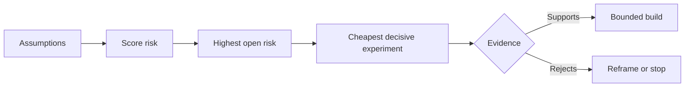

# 首先,我们要把最危险的假设解开

> 路线图隐藏了某些特征的不确定性.

> **【中文解读】**路线图将不确定性藏在一个"功能"里;假设地图将"这些功能值得存在的前提"放在桌面上. 本课是经纪人工程方法论系列的第一部分. 第48课发现人们实际执行的工作流程,本课将"这件事值得做"本身分解成一个可证实的假设,根据影响,不确定性,不可逆的三维排行风险,然后先确定最便宜的,最有力的实验,然后先做最令人兴奋的功能.

>  **【前置】**课前请先掌握:第14阶段 第48课 发现真实工作流假设地图必须覆盖真实发生的工作,而不是想象中的工作流)`outputs/assumption-map.json`作为一个"可产生决定性证据的最小片子"的选择.

**Type:** Learn + Build | **类型:** 学习 + 动手实践
**Languages:** Python (stdlib) | **语言:** Python（标准库）
**Prerequisites:** Phase 14 lesson 48 | **前置知识:** Phase 14 第 48 课
**Time:** ~65 minutes | **时间:** 约 65 分钟

## 学习目标

- 将拟议的工作转化为明确的假设.
  中文翻译:把提议工作转化为显而易见的假设.
- 分别评分影响,不确定性和不可逆转性.
  中文翻译:分别给影响、不确定性和不可逆性打分──
- 选择下一个实验,以风险而不是热情.
  中文翻译:按风险而不是热情来选择下一个实验.
- 取代经过测试的假设,用证据和决定.
  中文翻译:用证据和决策代替已检验的假设.

## 每个建筑都包含了注.

事件工具可能取决于所有这些都是真的:

> 一个事故处理工具可能依赖以下每条都成立:

- 警报环境包含足够的信息来识别服务;
  中文翻译:告警上下文包含足以识别服务的信息;
- 工程师相信他们自己没有得到的建议;
  中文翻译:工程师会信任一条不是自己推出的建议;
- 需要的响应时间在运营方面是重要的;
  中文翻译:期望的响应时间在运维上真的很重要;
- 要求的数据可以在不安全的权威的情况下访问;
  中文翻译:所需数据无需危险权限即可访问;
- 工作流程发生的频率足以证明维护是合理的.
  工作流发生了足够频繁,值得长期维护.

这些不是执行任务,而是构建的条件,使其具有价值,可用,可行和安全性.

> 这些不是实现任务,而是构建"有价值"",可用"",可行"",安全"的前提条件.

> **【中文解读】**功能列表的每一行背后都压缩着几种隐性注:用户会这样使用吗?数据能得到吗?组织能养成吗?路线图从来没有显示这些注,它们只会在完成后被重新使用或废弃形式显现.

## 假设类

| Class | Question |
|---|---|
| Value | Will the outcome matter enough? |
| Usability | Can the user understand and act on it? |
| Feasibility | Can the system produce it with available data and constraints? |
| Viability | Can the organization sustain cost, ownership, and operation? |
| Safety | Can it fail without unacceptable consequence? |

> **【中文解读】**五类假设各问一个问题:价值 (值) 结果是否足够重要 (可用性) 可用性 (可用性) 用户看懂并能根据此行动吗) 可用性 (可用性) 基于现有数据和约束,系统能得到吗) 生存力 (组织能承担成本,归属和运维吗) 安全性 (组织能承担成本,运维吗) 安全性 (组织能承担成本,归属和运维吗) 安全性 (组织能承担成本,归属和运维吗) 否?

该功能是有用的不能测试的. 十名电话工程师中八名通过只读取结果更快地识别正确的服务.

> 假设写成可证实的陈述. ""这个功能有用"",没有检查; ""十名值得的工程师中有八人只借助阅读结果更快地定位到正确的服务""就可以了.

## 风险不是一个数字

实验室使用1到5的三维度:

> 实验代码用三个 1 到 5 的维度:

- **Impact:**如果假设是错误的,损害.
  翻译: 中文**影响：**假设为假时的损失.
- **Uncertainty:**目前证据的弱点.
  翻译: 中文**不确定性：**现有证据有多弱点.
- **Irreversibility:**承诺后学习成本.
  翻译: 中文**不可逆性：**押上承诺后再学习的代价.

结果是为了让团队解释为什么一个未知的问题应该在另一个问题之前解决.

> 例子评分将影响乘以不确定性,再加上不可逆性. 这个公式并不通用,它的目的是让团队清楚地说:为什么这个未知项目要先解决.

>  **【类比】**假设排雷像拆迁前的房屋检查:每面墙(假设) 分别量三已倒塌多大面积(影响) 、结构判断有多拿不准(不确定性) 、错了还能不能回去(不可逆性) 。先处理"倒塌最疼 + 最拿不准 + 不回去"那面墙,而不是最好那面──



> **【中文解读】**这张流程图是本课的发动机:假设 → 打风险分 → 找到风险最高且仍然开放的假设 → 为它设计最便宜的决定性实验 → 证据要么支持(进入有边界的建设),要么反对(重建问题或直接停止)  注意两个出口都不叫"继续按照原计划做"实验的意义就是让失败发生在一个便宜的地方

## 设计一个实验,而不是一个确认仪式.

有用的测试包括:

> 一个有用的测试设备:

- 可能是错误的索赔;
  中文翻译:一个可能为假的断言;
- 人口或现实样本;
  中文翻译:一个真实总体或现实样本;
- 观察到的结果;
  中文翻译:一个可观察的结果;
- 在结果之前确定的门;
  中文翻译:一个在看到结果之前就确定好的值;
- 接下来决定通过,失败,以及模糊的证据.
  中文翻译:为通过、失败和模糊证据分别准备好下一步决策.

避免测试,只能证明团队能够构建这个想法.

> 避免那些只能证明团队能做到这一点的测试.

> **【中文解读】**"确认仪式"指那些无论结果如何都会继续做演示演示成功上线,失败修复上线.

## 逆转性改变秩序 可逆性改变序列

具有高效性,不可逆转的选择需要早期的证据.只读的重播可以先于生产集成.临时适配器可以先于数据迁移.人类批准的建议可以先于自动行动.

> 后果重大且不可逆的选择需要更早的证据. 仅可以在生产集成之前进行放放放; 临时适配器可以在数据迁移之前进行放放; 人工审批建议可以在自动执行之前进行放放放.

建筑的形状应该遵循不确定性的形状.

> 建筑的形状应随着不确定性的形状而成.

> **【中文解读】**排序原则只有一句话:越难回归的决定,越需要先在便宜的替代形式上得到证据――三组进进只读回放→生产集成、临时适配→数据迁移、人工批准→自动执行都是"先用可逆形态问题,再用不可逆形态执行"――这一思想在第53课时升级为原型/试点/生产三档的完整方法――

## 建立它,实现它.

实验室将假设排名, 区分测试的和开放的要求, 选择最高的开放风险,`outputs/assumption-map.json`现在,我们要去.

> 实验代码给假设排序,区分已检查和仍开放的断言,选择最有风险的开放项目,并写出`outputs/assumption-map.json`,我知道.

```bash
python3 code/main.py
python3 -m unittest discover code/tests -v
```

改变最高风险假设的证据,观察下一次实验的变化.

> 修改风险最高那条假设的证据 字段,观察"下一个实验"如何随之改变──

> **【中文解读】** `risk_score = impact * uncertainty + irreversibility`是故意简单的算术它的存在意义不是精确的,而是把"先做哪个实验"变成一个可争辩的可复数的显式问题.给给某条假设补充证据后,它的状态从开放到测试,下一个实验自动落在新的最高风险上:这是"用证据推动优先级",而不是通过会议推动.

## 练习,练习.

1. 写出你想要构建的功能的五种假设.
   中文翻译:为你想做某个功能写下五条假设――
2. 添加一个安全假设,您的功能列表遗漏.
   中文翻译:补一条你的功能清单遗漏的安全假设──
3. 设定一个限制,让你停止建造.
   中文翻译:定义一个会让你停止这个构建的值.
4. 换一个大型实验,一个更便宜的决定性实验.
   中文翻译:把一个大实验换成一个更便宜的,但也具有决定性的测试.
5. 比较风险排名与路线图优先级,并解释不匹配情况.
   中文翻译:对比风险排序与路线图优先级,并解释两者的错位──

## 继续阅读 继续阅读

- [Barry Boehm, A Spiral Model of Software Development and Enhancement](https://dl.acm.org/doi/10.1145/12944.12948)对于一个以风险为导向的发展周期,在更深入的承诺之前,解决不确定性.
  中文翻译:Boehm螺旋模型风险驱动的发展循环:在更深的承诺之前先解决不确定性.
- [Dardenne, van Lamsweerde, and Fickas, Goal-Directed Requirements Acquisition](https://doi.org/10.1016/0167-6423(93)通过"化"的方法,可以在消除障碍和限制的情况下实现目标.
  中文翻译:达尔登等目标导向的需求获取在精确目标同时浮现障碍与约束

## 你留下什么,你留下什么产品.

保持`outputs/assumption-map.json`下一堂课时,我们用它来选择最小的证据.

> 留下`outputs/assumption-map.json`下一课将使用它来选择能产生决定性证据的最小片段.
