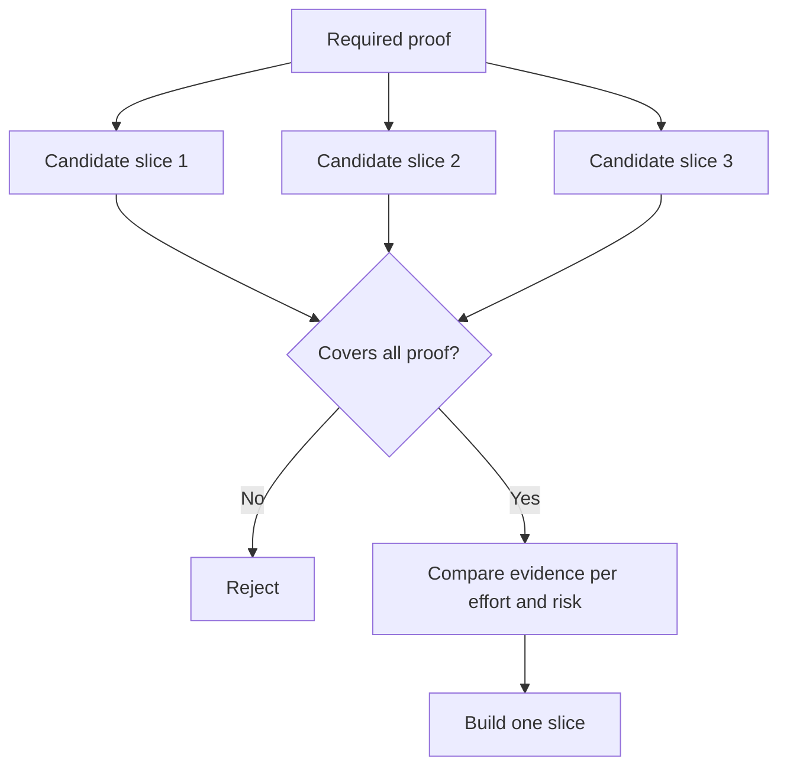

# 选择最小的片段,可以改变决策.

> 只有当它证明了重要的事情时,一个小的构建才会改变下一个决定,只是不完整.

> **【中文解读】**"做小"只有在能够证明要紧要的事情的时候才有价值一个改变不了下一步决策的小构建,不是最小可行的小块,只是没有完成.本课承担第49课假设地图:先从风险最高的开放假设推出"必需证明集",再把它作为过器候选片,最后通过的片里比"单位投入的翻译证据"――关键转换是:先确定证明、再谈大小,而不是先做小的、再想它证明了什么――

>  **【前置】**课前请先掌握:第14阶段 第49课  映射假设与风险本课的"必备证明集"直接来自那里风险最高的开放假设)`outputs/slice-decision.json`会成为第51课规格文档的输入.

**Type:** Learn + Build | **类型:** 学习 + 动手实践
**Languages:** Python (stdlib) | **语言:** Python（标准库）
**Prerequisites:** Phase 14 lesson 49 | **前置知识:** Phase 14 第 49 课
**Time:** ~65 minutes | **时间:** 约 65 分钟

## 学习目标

- 根据它证明的假设来定义一个部分.
  中文翻译:用"切片能证明哪些假设"来定义切片──
- 均衡结果价值,减少不确定性,努力和后果.
  中文翻译:在结果价值、不确定性消减、投入和后果之间做权衡.
- 偏爱可逆证据,而不是早产承诺.
  中文翻译:优先选择可逆的证据,而不是过早的生产阶段承诺.
- 拒绝省略工作流程的危险部分的切片.
  中文翻译:拒绝那些恰好绕开工作流风险部分的片段.

## 垂直意味着证据端到端

实用切片可以通过观察结果所需的最小实际工作流程.它可能是用户,数据,持续时间和能力的狭窄.它不应该通过消除你需要测试的确切不确定性来缩小.

> 一个有用的切片可以穿过"观察一个结果"所需的最小真实工作流程. 它可以缩小用户,数据,时间,能力,但不能通过切断"你正在检查的不确定性"来缩小.

举个例子:

> 孩子:

- 通过10个真实事件进行阅读的重播,测试服务的身份和运营商的信任.
  中文翻译:跨十次真实事故的只读回放,能检验服务识别和操作员信任.
- 合成数据上的抛光仪表板可以测试理解性,但不能测试数据可行性.
  中文翻译:基于合成数据的精美仪表盘或许可以检查"看懂",但检查不了数据可行性.
- 生产自动调整器一次性测试一切,
  中文翻译:生产环境的自动修复一次检查了一切,但后果是不可接受的.

> **【中文解读】**"纵向"的意思是端到端打通真实工作流:输入是真的;决策路径是真的;能观察一个结果.

>  **【类比】**最小的切片像楼盘开售前的样板间:只能有一个户,一种户型,但必须有真实的水电如果样板间没有通水电,它永远证明不能"住下去"这个最紧迫的问题,再精美也只是布景――

## 定义必要的证据 首先定义必要的证据

假设是最有风险的,并将其转化为所需的证据集.

> 取出风险最高的开放假设,把它们变成一个"必需证明集"―― 候选片只覆盖这个集,才有评价资格――

然后将可接受的片段进行比较:

> 然后在有资格的片段之间进行比较:

| Dimension | Direction |
|---|---|
| Outcome value | More is better |
| Uncertainty reduced | More is better |
| Effort | Less is better |
| Consequence | Less is better |
| Reversibility | More is better |

实验室的成绩是故意简单的.

> 实验代码的评分故意简单――资格比算术更重要――



> **【中文解读】**这里的顺序是本课的核心:资格门 (门) 在前面,评分算术在后面. 评分再高,只要缺1条必备证明就不参评. 这阻止了"便宜但也证明不了"的方案.

## 常见的假最小片

- **The UI-only minimum:**消除数据和运营不确定性.
  翻译: 中文**只有 UI 的最小：**切除了数据和运输层面的不确定性.
- **The infrastructure-only minimum:**证明技术可能性,而无用户价值.
  翻译: 中文**只有基础设施的最小：**技术上的成就证明了用户价值.
- **The happy-path minimum:**没有任何例外,
  翻译: 中文**只有正常路径的最小：**错过了制造风险的绝大多数.
- **The demo minimum:**能产生一种说服力的器件,但没有可重复的测量.
  翻译: 中文**演示级最小：**产生了有说服力的演示,但没有可重复的测量.
- **The platform minimum:**在一个工作流程获得之前,建立可重复使用的机器.
  翻译: 中文**平台级最小：**在任何工作流证明价值之前先制造可复制机器.

> **【中文解读】**五种假最小的各种诱惑:UI 最小出图快,基础设施最小对工程师的胃口,演示最小最能动动领导.它们的共同点是系统地绕开真正的风险,而"最小"的意思恰恰是让风险早点暴露.

## 加入一个停止规则.

在执行之前,写下如果切片失败发生什么情况:

> 在动手实现之前,先写好"切片失败了会怎样":

- 放弃结果;
  中文翻译:放弃这个结果;
- 改变目标用户或情况;
  中文翻译:更换目标用户或使用场景;
- 测试不同的机制;
  中文翻译:换一种机制再测;
- 收集更好的证据;
  中文翻译:先收集更好的证据;
- 进一步限制权力.
  中文翻译:把授权收得更窄.

如果每一个结果都导致了保持建筑,那么切片不是实验.

> 如果每种结果都向"继续做下去",那么这个片段不是实验.

> **【中文解读】**停止规则是实验的"诚实检查":一个所有结局都是"继续建设"的片段,只是穿着实验外衣的既定计划.

## 建立它,实现它.

实验室通过必要证据来过候选人,`outputs/slice-decision.json`现在,我们要去.

> 实验代码根据必要证明过候选人,给有资格的切片打分,并写出`outputs/slice-decision.json`,我知道.

```bash
python3 code/main.py
python3 -m unittest discover code/tests -v
```

加入一个只证明一个要求假设的更便宜的候选人.即使其数值得高,它也应该不合格.

> 另外一个证明一个必要假设,但更便宜的候选人.

> **【中文解读】** `score = (结果价值 + 不确定性消减) / (投入 + 后果 × 不可逆系数)`只是排序工具;真正的守门员是集包含检查.`required_proof <= set(item.proves)`△后课破坏实验专门验证这一点:一个便宜但不覆盖所有必需证明的候选人,评分再高也进不入候选池

## 练习,练习.

1. 设计三片片,以达到不同的效果水平.
   中文翻译:为同一个结果设计三个不同的后果等级的切片.
2. 在打分之前,请说明所需的证据.
   中文翻译:在打分之前先写下必备证明集──
3. 删除一个能力,同时保留决定性证据.
   中文翻译:砍掉一项能力,同时保住决定性的证据.
4. 给失败的飞行员添加一个停止规则.
   中文翻译:为一次失败的试点补一条停止规则.
5. 确定可重复使用的平台组件,该组件应等到切片完成后.
   中文翻译:指出一个应该等切片后再做可复用平台组件──

## 继续阅读 继续阅读

- [Barry Boehm, A Spiral Model of Software Development and Enhancement](https://dl.acm.org/doi/10.1145/12944.12948)为了使每个发展周期与必须解决的风险相匹配.
  中文翻译:Boehm螺旋模型让每轮发展循环应应应应应应应应解决风险
- [Lenarduzzi and Taibi, MVP Explained: A Systematic Mapping Study on the Definitions of Minimal Viable Product](https://arxiv.org/abs/1609.07592)软件产品实践中最小和可行的模糊性.
  中文翻译:列纳鲁齐与台北MVP 解析软件产品实践中"最小"和"可行"两个词的歧义理──

## 你留下什么,你留下什么产品.

保持`outputs/slice-decision.json`它记录了为什么这个片子是最小的改变决定.

> 留下`outputs/slice-decision.json`,它记录了为什么这个片子是"改变决策的最小片子".
