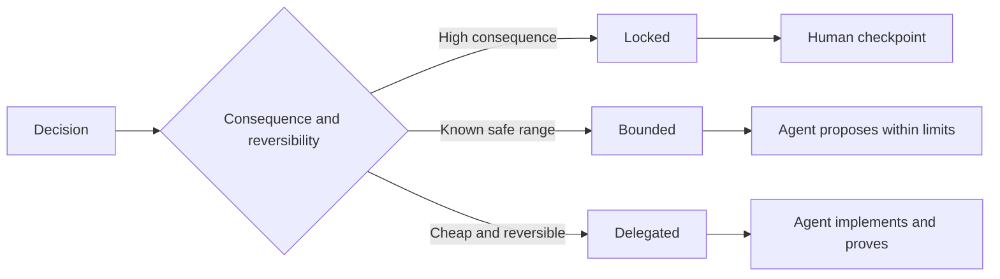

# 写出保留判断力的规范

> 有用的规格可以修复变量和证据,同时让可逆的实施选择保持开放.

> **【中文解读】**一个好的规则锁定"不变量与证据",把可逆的实现选择留给执行者它是决策边界,不是剧本. 本课回应 代理时代的一个真实问题:任务写得太粗,代理只能盲猜系统;写得太细,再把代理退化为打字员,照抄一个可能存在错误的设计. 出路是把规则写成六面的可执行契约,并用"锁定/限制/委托"三个模式显明声明每个决定.

>  **【前置】**课前请先掌握:第14阶段 第50课 选择能改变决策的最小片 课规则服务的正是那个片) 和第33课 把命令写成可执行的束,命令作为限制的思想在这里扩展到完整的规则)`outputs/executable-specification.json`是编码代理与人类评审共享协议.

**Type:** Learn + Build | **类型:** 学习 + 动手实践
**Languages:** Python (stdlib) | **语言:** Python（标准库）
**Prerequisites:** Phase 14 lesson 50 | **前置知识:** Phase 14 第 50 课
**Time:** ~75 minutes | **时间:** 约 75 分钟

## 学习目标

- 单独的结果,不变量,例子,非目标和证据.
  中文翻译:区分结果、不变量、示例、非目标和证明──
- 标记决定为被锁定,限制或委托.
  中文翻译:把每个决定标注为锁定、受限或委托──
- 保持代理判断力,在选择便宜和可逆的情况下.
  中文翻译:在选择廉价可逆的地方保留代理人的判断力.
- 要求人检查点,
  中文翻译:在后果重大或公开行为变化的地方强制人工检查点.

## 两个极端坏的极端.

过度指定任务要求代理猜测系统,过度指定任务要求它转载可能已经错误的设计.

> 规范不足的任务让代理猜测系统;规范过度的任务让它抄袭可能存在错误的设计.

有效的中位是可执行的合同:

> 有用的中间形态是可执行的契约:

| Surface | Purpose |
|---|---|
| Outcome | The observable result |
| Invariants | Conditions that must always remain true |
| Examples | Concrete cases that reveal intent |
| Non-goals | Adjacent behavior intentionally excluded |
| Decision policy | Which choices are locked, bounded, or delegated |
| Proof | Evidence required before completion |

> **【中文解读】**两个极端应对两种浪费:规格不足浪费在返工上(代理猜错了重做),规格过度浪费在翻译上(人把设计写成伪代码,代理再转抄成代码,中间没有增量智能) 六面契约是中间路:结果说清"要什么"、不变量说清"任何时候不能破坏什么"、示例传递意图、非目标划边界、决策政策声明授权、证明定义"完成"每个方面都给执行留下了判断空间――

## 现在,我们需要一个方法.

- **Locked:**代理人不得选择使用,用于公共兼容性,权威性,安全性,不可逆转的成本或产品承诺.
  翻译: 中文**锁定（Locked）：**代理人不需要自行选择.用于公开兼容性,权限,安全性,不可逆成本或产品承诺.
- **Bounded:**代理可以在明确的限制内选择.用于搜索预算,重复计算,允许的依赖性或已知界面家族.
  翻译: 中文**受限（Bounded）：**代理可以在明确的界限内选择. 用于搜索预算,重试次数,允许依赖,已知的接口群.
- **Delegated:**经理拥有选择,必须解释它. 用于本地结构,名称,可逆的回变器和实施细节.
  翻译: 中文**委托（Delegated）：**代理拥有这个选择,但必须能够解释它.



> **【中文解读】**三种模式的分类标准只有一个问题:后果与可逆性――后果大、不可逆 → 锁定并设置人工检查点;后果可控但有安全范围 → 受限,代理在界内自由;便宜且可逆 → 委托,代理自定但要解释――常见错误是两个方向同时犯:把命名风格这样的小事锁死(浪费人的判断力),再把"不能写生产库"这样的大事默认委托 (把产品风险交运)

>  **【类比】**三种决策模式如装修合同的三类条款:承重墙和水电走向写死;锁错要出人命;预算有限区间;品牌任选;房间内部如何布置工人看办;

## 通过例子来定义行为.

  强,  生产准备的是无法执行的.一个小组的正常,边缘,失败和禁止的例子给了构建者和验证者都具备了具体的东西.

> 举例比形容词更能缩小意图:"有帮助"",健壮"",可生产"都是不可执行的. 一组覆盖正常"",边界"",失败和禁止场景的少量例子,给了构建者和验证者双方可以抓住的具体东西.

没有任何例子可以取代不变的元素.

> 实例不能替代不变量.

> **【中文解读】**这节解决"形容词陷":写:"输出要干净"等于什么都没有写,写:"给一个带部署ID的告警应解析出服务负责人"才传递意图.

## 证据必须与说法相匹配

- 一个单位测试证明了本地函数合同.
  中文翻译:单元测试证明局部函数契约。
- 电线测试证明了序列化和运输行为.
  中文翻译:线上(线)测试证明序列化与传输行为──
- 浏览器的旅行证明了接口路径.
  中文翻译:浏览器旅程证明一条界面路径──
- 复制集证明了对代表性案件的行为.
  中文翻译:回放集证明行为在代表性用例上的表现.
- 审计日志证明了权限限制.
  中文翻译:审计日志证明权限边界确实守住了──

应不要接受低层作为高层的证据.

> 不要用低层证据支持高层的断言.

> **【中文解读】**每种证据都有其管辖范围:单元测试管函数,线路测试管协议,浏览器旅程管界面,回放集管整体行为,审计日志管权限.证据错层是最常见的"假验收"使用一堆绿灯的单元测试宣称"权限边界安全",层对不上,等于拿体温计血压正常.

## 蓄意保留未知的东西

具体说明可以说: 执行程序可以选择任何在预算内返回的只可读的来源.

> 规格可以写:"实现可以选择任何在时间预算内返回的只读数据源".

根据证据的变化,规格应不断变化. 保持锁定和限制的选择背后的原因,以便后来的团队可以在没有考古学的情况下修改它们.

> 证据变化时规格也应演变――保留锁定与限制选择背后的理由,后来的团队才不需要"古典"修改它们――

> **【中文解读】**"有意保留未知"与"没想清楚"的区别在于边界和证明:前者写明选择空间 (任何只读源) 约束 (时间预算) 和验收 (验收) 证明),后者什么都没有写下来.

## 建立它,实现它.

实验室验证了每一个合同表面,检查了决策模式,`outputs/executable-specification.json`现在,我们要去.

> 实验代码校验契约的每一个面对,检查决策模式,并写出`outputs/executable-specification.json`,我知道.

```bash
python3 code/main.py
python3 -m unittest discover code/tests -v
```

移动生产写决策从锁定到委托.解释为什么方案接受值,而产品风险不接受.

> 转换成委托. 解释为什么数据模式 (图) 接受这个价值,而产品风险不接受.

> **【中文解读】**校验器的两条硬规则值得注意:六面缺一不可,且非委托模式必须带有理由"无理由锁定"和"没有面契约"都会被判定不完整.

## 练习,练习.

1. 转换一个后期票到六个规格表面.
   中文翻译:把一张后备份 工单转写成六面的规格──
2. 取代三个执行说明一个不变和两个例子.
   中文翻译:把三条实现命令替换成一条不变量加两个例子.
3. 记住每一个决定,并证明每个被锁定或限制的选择是正确的.
   中文翻译:给每一个决定标注模式,并给每一个锁定或限制的选择一个理由.
4. 添加每一个不变的证明收据.
   中文翻译:为每条不变量补一条对应的证明凭证.
5. 消除没有证据或风险合理性的限制.
   中文翻译:删掉一条既无证也无风险理由支的约束──

## 继续阅读 继续阅读

- [Nuseibeh and Easterbrook, Requirements Engineering: A Roadmap](https://www.cs.toronto.edu/~sme/papers/2000/ICSE2000.pdf)对于目标,精确规格,验证,一致性和进化之间的关系.
  中文翻译:Nuseibeh与Easterbrook需求工程:路线图目标、精确规格、验证、共识与演化之间的关系──
- [Zave and Jackson, Four Dark Corners of Requirements Engineering](https://doi.org/10.1145/267895.267896)对于环境假设,要求和规格的分离.
  中文翻译:Zave与杰克逊的需求工程的四个黑暗角落 区分环境假设、需求与规格──
- [Gotel and Finkelstein, An Analysis of the Requirements Traceability Problem](https://doi.org/10.1109/ICRE.1994.292398)为了保护要求的存在和来源.
  中文翻译:Gotel 与Finkelstein 需求可追溯性问题分析 保留"需求为什么存在?从哪里来"

## 你留下什么,你留下什么产品.

保持`outputs/executable-specification.json`编码代理人和人类审查员的合同.

> 留下`outputs/executable-specification.json`将成为编码代理与人类评审共享协议.
