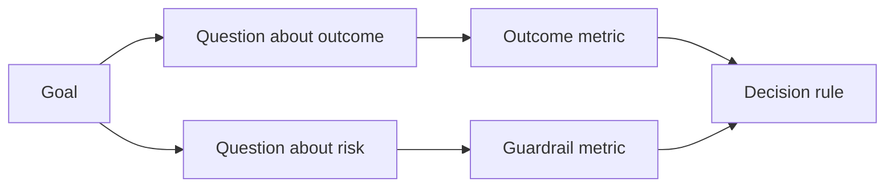

# 设计成功指标 结果存在之前

> 测量应该回答一个决定,而不是装饰仪表板. 首先要从目标开始,提问,然后选择回答这些问题的最小指标.

> **【中文解读】**测量应回答一个决策,而不是装点一块仪表盘――本课讲 GQM 目标问题 标志) 方法在 工程中的落地:从结果目标推出问题,从问题推出最小一组指标,并看到任何数据之前,对每个指标标标签好"契约"方向、值、窗口、来源、人群――顺序颠倒(先有数据再找解释) 是所有"指标化术"的根源――

>  **【前置】**课前请先掌握:第14阶段 第47课 (成果先于产出本课的"目标"从那里) 和第51课 (写保留判断力规则的"证明"面在此展开成测量计划)`outputs/measurement-report.json`是第53课原型/试点/生产三档的证据门。

**Type:** Learn + Build | **类型:** 学习 + 动手实践
**Languages:** Python (stdlib) | **语言:** Python（标准库）
**Prerequisites:** Phase 14 lessons 47 and 51 | **前置知识:** Phase 14 第 47、51 课
**Time:** ~70 minutes | **时间:** 约 70 分钟

## 学习目标

- 根据一个结果目标来提取问题和指标.
  中文翻译:从结果目标推导出问题和标志――
- 在观察结果之前,定义门,窗户,来源和方向.
  中文翻译:在观察结果之前定义值、窗口、来源和方向──
- 结合结果指标与防护和反指标.
  中文翻译:给结果指标配上护指标和反指标.
- 评估证据与建筑必须支持的决定相匹配.
  中文翻译:让评估证据与建设必须支的决策相匹配.

## 目标,问题,指标.

开始一个目标:

> 从一个目标开始:

> 减少确定受影响服务的时间,而不会增加不安全的行动.
其他
> 在不增加不安全操作的前提下,缩短受影响服务所需的定位时间.

导出问题:

> 推导出问题:

- 如何快速确定正确的服务?
  中文翻译:正确服务被定位得多快吗?
- 检测到的服务是正确的多么频繁?
  中文翻译:定位出服务有多少大概率是对的?
- 诊断是否只能读取?
  中文翻译:诊断过程是否保持只读?
- 工作流增加了警报的解雇或操作员的工作负载吗?
  工作流是否增加了警方忽视率或操作员负担?

然后选择运行这些问题的指标.

> 然后选择把这些问题变成可测数量的指标.



> **【中文解读】**标志是决策语言 (快不险),问题是研究语言 (多快?多准?只读吗?),标志才是数字语言 (中位秒数、正确率、写次数) .跳过中层直接从目标构成标志,就会得到"平均响应时间"这种既不回答决策也不暴露风险的仪表盘装饰品.

## 一个指标需要一份合同

每个标准需要:

> 每个标志都需要:

| Field | Example |
|---|---|
| Name | `median_identification_seconds` |
| Direction | at most |
| Threshold | 120 |
| Window | ten incident replays |
| Source | replay event log |
| Population | on-call engineers in the pilot |
| Kind | outcome or guardrail |

没有源头和窗口,一个数字不能复制.

> 没有源和窗口,一个数字无法复制;没有值,它无法驱动决策.

> **【中文解读】**契约的七个字段回答四个问题:叫什么 (名字) 朝哪边好 (方向) 多好算好 (门) 在哪测的 (窗口/来源/人口) 哪类的 (类型) 缺"在哪测的,同数换个环境就不可复现;缺"多好算好",指标永远只会"看起来变好"――这和第51 课程规格契约和构建指标也是一项需要收收款规格的规格.

>  **【类比】**没有参考区间的化验单只是一串数字你不知道450是应该庆祝还是应该挂号值、窗口、来源就是标志的"参考区间+抽血条件"──

## 结果指标,护指标与反指标

- **Outcome metric:**想要的状态有没有改善?
  翻译: 中文**结果指标：**期望的状况有没有改善?
- **Guardrail:**一个固定的限制是否仍然是真的?
  翻译: 中文**护栏指标：**固定约束是否仍然存在?
- **Counter-metric:**地方改进的转移成本或损害在其他地方吗?
  翻译: 中文**反指标：**局部改善是否将成本或损害转移到其他地方?

对于一个事件工作流程,速度不够. 正确性,生产写作,操作员工作负载和错过的警报保护于快速但不安全的结果.

> 对于事故工作流程而言,只有速度不够的――正确率,生产记录次数,操作员负担和漏报警,防范是"快但不安全"的结果――

> **【中文解读】**三种指标构成一个三角形:结果指标证明"变好了",护指标守住"没变坏" ((如生产写入恒为零),反指标住"坏处是不是被挪走了" ((本团队快了,是不是把负担给下游值班) 了.

## 离线证据和在线证据

线下重播对于重复性和边缘覆盖性有用.一个有限的试点对于真实行为,信任和工作流的影响是有用的.

> 离线回放的价值在于可重复性和边界覆盖;有界试点的价值在于真实行为,信任和工作流效应――两者互不替代――

仅仅因为实施已经准备好,不要暴露真正的用户.

> 实际用户的数据是很好的,但实际用户的数据是很好的.

> **【中文解读】**离线/在线的取舍标准是"当前决策需要什么",不是"实现进展到哪里"......回放集答"算法对不对",试点答"人信不用"",用不用"......最常见的错误是使用离线指标回答只有试点才能回答问题 ((工程师"应该"会信任这个建议),或者反过来功能一篇写完就急于对真流量了――

## 在你测量之前决定,先决定,再测量数据

在看到结果之前,写出通过,失败和模糊的路径.否则团队将移动门以保护构建.

> 否则团队一定要保持这个构建和动作值.

举个例子:

> 孩子:

- 通过:正确的服务速度至少为0.9秒,平均时间最多为120秒;
  中文翻译:通过:正确服务率不低于0.9 且中位耗时不超过120秒;
- 产品输出或正确率低于0.75的任何产品输出率;
  中文翻译:失败:出现任何生产写入,或正确率低于0.75;
- 模糊:较小改进,变异很大,需要更大的重播集.
  中文翻译:模糊:改善幅度小且方差大,需要扩大回放集再测.

> **【中文解读】**"先决决策"是针对人性防御的:数据出发后重新确定值,几乎每个人都将值定在自己的数据刚刚通过的位置.

## 建立它,实现它.

实验室验证了测量计划,评估包括在内的门值,记录缺失值,并写下`outputs/measurement-report.json`现在,我们要去.

> 实验代码校验一个测量计划,根据含边界值的值求值记录缺失值,并写出`outputs/measurement-report.json`,我知道.

```bash
python3 code/main.py
python3 -m unittest discover code/tests -v
```

删除防护轨迹指标,观察计划的无效性,即使结果指标仍然存在.

> 删除护标志,观察为什么即使结果标志都存在,整个计划也会被判为无效.

> **【中文解读】**校验器的规则是本课程的代码化:缺目标,缺问题,缺结果指标,缺结果类,缺护类,方向非法,缺来源或窗口任何条都会使状态变得无效,后面的数值全部失去了意义特别注意:护缺失不会让报告"少一项",而是让整整计划废除没有护的结果指标等于允许"快但不安全"地通过──

## 练习,练习.

1. 根据一个目标,可以提取三个问题.
   中文翻译:从一个结果目标推导出三个问题――
2. 增加一个反衡量,以捕捉转移到另一个角色的成本.
   中文翻译:加一个能抓住"成本被转移到另一个角色"的反标志.
3. 定义每个指标的来源,人口和窗口.
   中文翻译:为每一个标志定义来源、人群和窗口──
4. 在生成值之前,写出通过,失败和模糊的决定.
   中文翻译:在生成数值之前写好通过、失败和模糊三条决策──
5. 确定一个容易收集的指标,但不能改变决定.
   中文翻译:找出一个容易采集但改变不了决策的指标,把它删除.

## 继续阅读 继续阅读

- [Basili, Software Modeling and Measurement: The Goal/Question/Metric Paradigm](https://drum.lib.umd.edu/items/8119803a-362b-42ec-b6ce-2311713e7236)通过明确的目标来推导运营测量.
  中文翻译:Basili软件建模与测量:GQM 范式从显式目标推导可操作测量。
- [Basili, Caldiera, and Rombach, The Goal Question Metric Approach](https://www.cs.toronto.edu/~sme/CSC444F/handouts/GQM-paper.pdf)对于应用该方法作为反和改进系统.
  中文翻译:Basili、Caldiera 与 RombachGQM 方法把该方法用作反与改进系统

## 你留下什么,你留下什么产品.

保持`outputs/measurement-report.json`确定原型,试点或生产阶段的证据门口.

> 留下`outputs/measurement-report.json`△它定义了原型,试点或生产阶段的证据门.
