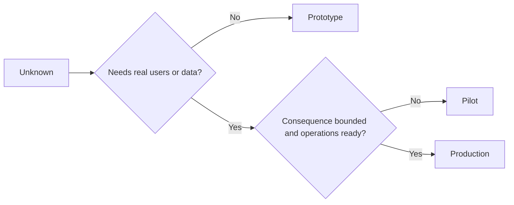

# 选择原型,试点还是生产:三档慎选

> 选择一个可以对目前未知的情况进行反应的阶段,

> **【中文解读】**原型、试点、生产是三种不同的学习环境,不是打磨程度的三档. 选档标准只有一个:哪个可以以最小的不必要后果回答当前未知. 本课把第50-52 课的"切片"",规格"",标志"接到最后一环环境控制:原型随时可以扔掉,试点必须有界限和可回归,生产意味着组织承担持续责任. 最容易发生的事故不是选档错误,而是原型"地"变成生产系统.

>  **【前置】**学本课前请先掌握:第14阶段 第50课 ((最小片) 首先确定要证明什么) 第51课 ((规格契约控制与证明条款) 和第52课 ((成功指标每档的证据门) 〕本课产出`outputs/stage-decisions.json`是第54课反棘轮的运营基线.

**Type:** Learn + Build | **类型:** 学习 + 动手实践
**Languages:** Python (stdlib) | **语言:** Python（标准库）
**Prerequisites:** Phase 14 lessons 50 to 52 | **前置知识:** Phase 14 第 50-52 课
**Time:** ~70 minutes | **时间:** 约 70 分钟

## 学习目标

- 选择一个不知名的构建阶段, 观众,数据,后果和准备.
  中文翻译:根据未知项,受众,数据,后果和就绪度选择构建档位.
- 确定具体阶段的控制和退出标准.
  中文翻译:定义档位专属的控制措施和退出标准.
- 防止原型然变成生产系统.
  中文翻译:防止原型变成生产系统──
- 延迟真正的权威,直到证据和操作证明它是合理的.
  中文翻译:把真实权限推迟到证据与运维能力都配得上它的时候.

## 现在,我们有三个问题.

| Stage | Primary question |
|---|---|
| Prototype | Can this mechanism produce the evidence at all? |
| Pilot | Does it work safely with a bounded real audience and real conditions? |
| Production | Can we own it continuously at the promised reliability and risk level? |

试点可以使用生产数据,但观众和权威仍然有限. 当组织接受持续责任时,生产开始.

> **【中文解读】**三档问有三个不同的问题:原型问"这个机制是否能产生证据",试点问"在一群有界的真实受众和真实条件下,它安全吗",生产问"我们能否以承诺的可靠性和风险水平继续拥有它"――技术完成与档次无关

## 原型原型

使用原型,当未知不需要真正的用户或真正的数据时.

> 当未知项不需要真实用户或真实数据时,使用原型.

- 可拆除;
  中文翻译:随时可扔;
- 隔离;
  中文翻译:隔离;
- 行为有限;
  中文翻译:行为面窄;
- 关于学习问题的明确性;
  中文翻译:把学习问题写明白;
- 没有虚假的运营保障.
  中文翻译:不带任何虚假的运维保证.

在机器获得另一个阶段之前,不要优化架构.

> 在这个机制赢得下一个档位之前,不要优化架构.

> **【中文解读】**基本的五条规则中最难的是"隔离"和"不带假运维保证":隔离保证它失败时波及面为零;不承诺可用性则保证没有人开始依赖它.最后,是给工程师清醒剂机制本身还没有证明价值,在建筑磨损上花费的每小时都是给一个可能丢弃的东西金.

## 飞行员试点

使用试点,当未知需要实际行为,现实数据或实际工作流程,但后果或准备尚未与广泛发布相容时.

> 当未知项目需要真实行为、真实感觉的数据或真实工作流,但后果或现象也不能容纳大范围发布时,使用试点.

飞行员需要:

> 试点需要:

- 已指定的观众;
  中文翻译:点名的人群;
- 人类所有者;
  中文翻译:一位人类负责人;
- 限期和权限;
  中文翻译:有界的时长与权限;
- 审计和反弹;
  中文翻译:审计与回滚;
- 输出和防护门值;
  中文翻译:结果与护值 ((来自第52课);
- 扩大,修改或停止的退出标准.
  中文翻译:扩展、修订或停止的退出标准──

> **【中文解读】**试点的定义性特征是"真实但有界":使用真实数据、真实的人群,但受众点名、时长封顶、权限收窄.

## 生产生产

生产需要不仅仅是部署:

> 产品需要比部署多:

- 服务水平目标;
  中文翻译:服务级别目标(SLO);
- 电话及事件的所有权;
  中文翻译:值班与事故归属;
- 安全和隐私审查;
  中文翻译:安全与隐私审查;
- 成本和容量控制;
  中文翻译:成本与容量控制;
- 逆转和恢复;
  中文翻译:回滚与恢复;
- 持续监测;
  中文翻译:持续监控;
- 退休的路径.
  中文翻译:一条退役路径──



> **【中文解读】**七项最反直觉的最后一个"退役路径":进入生产之前要写好它如何退出.这不是悲观,而是承认每个系统都有生命周期.没有退役路径的系统,最终都变成了"没人敢动也没人知道为什么在运行"的遗产.

>  **【类比】**三档像学车的三个阶段:驾校模拟器 (原型撞重开零后果) 贴实习牌+老司机陪驾上路 (试点真路,但有界、有负责人、随时可以接管) 独立跑高速 (生产你自己承担全部责任,车还得年检、上保险) ⋅最危险的是不是新手,是开模拟器的人认为自己在高速跑的.

## 阶段漂移

标记原型和试点界限,配置,访问控制,远程测量和文档.一个警告标志不够.

> 当原型代码在没有归属的情况下获得用户数据或权限时,它就会变得危险了.

系统本身可以观察到这个阶段.

> 档位应从系统本身中被观察到.

> **【中文解读】**阶段漂移 (阶段漂移) 是最常见的静默事故:"临时跑一下"的原型脚本进入了真流,三个月后它成为没有人敢重启的关键路径.防御必须落在技术控制上配置中的开关,访问控制中的权限,远测中的标记而不是UI横幅或口头约定.判断标准很简单:一个新来的工程师不能不问任何人看出"这是原型".

## 建立它,实现它.

实验室从决策背景中选择一个阶段,返回所需的控制,并写下`outputs/stage-decisions.json`现在,我们要去.

> 实验代码从决策中下文选出档位,返回必要的控制清单,并写出`outputs/stage-decisions.json`,我知道.

```bash
python3 code/main.py
python3 -m unittest discover code/tests -v
```

试点例子将运行准备性降低到低效率,说明生产是否有其他证据.

> 解释需要什么额外证据才能支持生产.

> **【中文解读】** `choose_stage`后期实验的答案不在代码里:就算判定落产,仍然缺乏证据如SLO 运行一段时间的实际表现,安全审查通过值班机制建立.档次判定是"最低档约束",而不是"通行证".

## 练习,练习.

1. 根据学习阶段,而不是部署状态,分类三个当前项目.
   中文翻译:按学习阶段 (而不是部署状态) 给你头上的三个项目分类.
2. 写出包括停止决定的试点退出标准.
   中文翻译:为试点写包含"停止"决策的退出标准.
3. 添加技术控制,防止原型达到生产数据.
   中文翻译:加一条技术控制,阻止原型碰到生产数据.
4. 确定构建生产的第一项运营责任.
   中文翻译:指出第一个"接下它,构建就成了生产"的运营责任.
5. 设计一个对边界飞行员的回滚收证.
   中文翻译:为有界试点设计一份回滚凭证.

## 继续阅读 继续阅读

- [Barry Boehm, A Spiral Model of Software Development and Enhancement](https://dl.acm.org/doi/10.1145/12944.12948)为了使每次代的承诺与解决风险相匹配.
  中文翻译:螺旋模型让每一轮代的承诺与已解决风险相匹配
- [Fagerholm et al., Building Blocks for Continuous Experimentation](https://doi.org/10.1145/2601248.2601276)对于持续运行实验所需的组织和技术条件.
  中文翻译:Fagerholm等持续实验的构建块持续进行实验所需的组织和技术条件

## 你留下什么,你留下什么产品.

保持`outputs/stage-decisions.json`它记录了每一个阶段是为什么合理的,以及哪些控制必须在下一个阶段之前存在.

> 留下`outputs/stage-decisions.json`,它记录了每个阶段的成立以及进入下阶段之前必须存在的控制.
