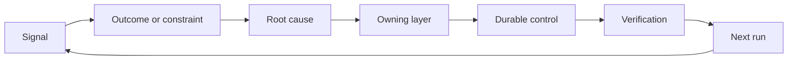

# 建立一个反 Ratchet 拥有和退休. 反棘轮:改进有主,控制可退役

> 运输关闭一个构建循环,打开学习循环. 证据必须改变系统,否则它会变成无人拥有的远程测量.

> **【中文解读】**发布关上一个构建循环,同时开启学习循环.证据必须改变系统,否则它就会变成无人认可的遥测数据. 本课是代理工程方法论系列的收官:将事故,评估,用户行为和纠正转化为"有主持人,有验证,有退役条件"的棘手动作,让系统只朝着变好的方向一轮一轮锁定,而旧控制可以被撤销.

>  **【前置】**学本课前请先掌握:第14阶段 第46课 ((把每次纠正变成系统改进本课把那套机制扩展到产品和运营信号) 和第53课 ((原型/试点/生产三阶段试点的审计和监控正是本课信号的来源) ⋅本课是"产品判断和交付"路径的最后工件,也是下一个结果框架的输入.

**Type:** Learn + Build | **类型:** 学习 + 动手实践
**Languages:** Python (stdlib) | **语言:** Python（标准库）
**Prerequisites:** Phase 14 lessons 46 and 53 | **前置知识:** Phase 14 第 46、53 课
**Time:** ~75 minutes | **时间:** 约 75 分钟

## 学习目标

- 让事件,评估,用户行为和纠正成为自己的行为.
  中文翻译:把事故,评估,用户行为和纠正转化为主人的行动.
- 调向每个信号的背景,评估,政策,运行时间或后期.
  中文翻译:把每类信号路由到上下文、评估、策略、运行时或等待列表――
- 根据重度和频率优先考虑重复.
  中文翻译:按严重程度与复发频率排排优先级.
- 给所有控制者一个退休条件.
  中文翻译:给每个控制措施配一条退役条件.

## 反是基础设施.

团队可以收集痕迹,评估,支持票和事件日志,而不会从其中任何一个学习.缺失的机制是促进:从观察到持久变化的定义路径与所有者和证据.

> 一个团队可以整理记录,评估,工单和事故日志,但从任何一条中都学不到什么. 缺失的机制是"晋升" (晋升):从观察到持久变化的明确路径,变更带着主人和证明.

循环是:

> 这是一个循环:

1. 观察一个具体的信号;
   中文翻译:观察到一个具体信号;
2. 连接到结果,约束或假设;
   中文翻译:把它关联到某个结果、约束或假设;
3. 确定最早的系统层,它是原因的;
   中文翻译:找到"拥有这个根因"的最早系统层;
4. 创造一个有限的变化;
   中文翻译:创建一个有边界的变更;
5. 检查复发的可能性变得较小;
   中文翻译:验证复发概率确实下降了;
6. 审查是否应该继续进行控制.
   中文翻译:复核这个控制是否还应保留──

> **【中文解读】**"反是基础设施"的意思是:学习不依赖于态度靠机制――可观测性,评估,工单系统只是原材料的管道,真正的设施是那条六步升级路,特别是第五,六步,它们在大多数团队的工作流程中根本不存在:改完不验证复发率,装完永不复核――没有这两步,"复盘"只是一次集体情绪活动――

## 进入所有者层的路径

| Signal | Destination |
|---|---|
| False positive, regression, wrong result | Evaluation or test |
| Missing context, duplicate work, stale fact | Context source or retrieval route |
| Unsafe action or authority gap | Policy or permission boundary |
| Timeout, retry storm, unavailable dependency | Runtime control |
| New product need or unresolved tradeoff | Shaped backlog item |

检测或许可可能使失败成为不可能时,不要再添加另一个提示段落.

> 在最早生效的修根层中.当一个测试或一个权限就能让某种失败变得不可能时,不要再往急于加一段话.



> **【中文解读】**路由表把"什么信号去哪里"变成查表操作:错误结果进行评估、缺上下文进行检查、越权进行策略、超时进行运行、新产品要求进行待遇.核心纪律是"最早有效层"快速是最贵的修复位置(每轮都占下文、随着模型变化),测试和权限是最便宜的位置 ((一次写入、永久生效) .大多数"我们重新优化下提示词"的讨论,其实应该发生在另一个层次的.

## 归属是控制的一部分.

每个子行动都需要:

> 每个轮动作都需要:

- 一个所有者;
  中文翻译:恰好一个主人;
- 基于后果和重复的优先事项;
  中文翻译:基于后果和复发频率的优先级;
- 变更的文物;
  中文翻译:要改那个工件;
- 证明变化的验证;
  中文翻译:证明该变更生效的验证;
- 审查或过期窗口;
  中文翻译:一个复核或到期窗口;
- 退休条件.
  中文翻译:一条退役条件――

没有任何改进,就是一个更好的格式化观察.

> 没有主人的改进,只是一个更好的观察记录.

> **【中文解读】**六段里"恰好一个主人"和"退役条件"构成棘轮的两个单向:主人保证变更真实落地(观察→行动),退役条件保证控制不会无限堆积(行动→清理) .最后那句话值得贴在工单系统门口把"建议改成X"写得更漂亮不会让它发生,签署一个名字和一个验证命令才会见.

## 退休了, 退休了.

反系统会积累政策. 这种政策可能会变得矛盾和昂贵.

> 系统会积累策略,而这些策略可能相互矛盾,成本高昂.

- 建筑或工作流程的变化;
  中文翻译:架构或工作流发生变化;
- 低级不变量取代了高级指令;
  中文翻译:某个更低层次的不变量取代了更高层次的指令;
- 已选定的窗口中未出现受保护故障;
  中文翻译:被防护的失败在整个观察窗户内一次都没有出现;
- 控制阻碍合法工作的频率比防止伤害更高.
  中文翻译:这个控制阻碍正常工作的次数超过了它住伤害的次数.

退休还需要证据. 不要因为它感觉老了而删除一个控制器.

> 退役也需要证据. 不要因为"感觉过去了"而删除一个控制.

> **【中文解读】**这节是给"棘轮"装回松扣:只进不回的棘轮最终将机器锁死――四个复核信号中的第四个最实用 当一个控制拦截的合规请求远远于拦截的风险,它就从保险变成税――但退役还要说证:窗户内零复发≠永远不会复发,删除前先确认防护已经由更低层的不变量接管――棘轮的完整定义是"当锁锁死,当放松开".

## 打通构建反与编码代理反

两条轨道都用同一条子:

> 同一个棘轮服务两条轨道:

- 产品证据改变了结果框架,假设,切片或测量计划.
  中文翻译:产品证据改变结果框架、假设、切片或测量计划──
- 编码代理的纠正改变了测试,背景,范围,自动化或转发.
  中文翻译:编码代理的纠正改变测试、上下文、范围、自动化或交接──
- 事件可以改变产品界限和代理工作台.
  中文翻译:事故既可以改变产品边界,也可以改变代理工作台──

这就是为什么构建不是在编码之前结束的阶段. 它在每一个被接受的变化中继续.

> 这就是为什么"塑料结构"不是编码开始前就结束的阶段,

> **【中文解读】**这节将第43-54 系列的任务框架结局:第43 课程的任务框架假设:"工程师会信任这个建议") 被试点的真实证据推翻时,改动不仅仅是代码,还有下一个任务框架本身――产品轨道与代理轨道共享一套棘轮,事故同时给两边――方法论不是布前置的文档工作,而是随着每次变化而不断运转的活机制――

## 建立它,实现它.

实验室分类信号,创建自己的动作,优先考虑它们,并写下`outputs/feedback-backlog.json`现在,我们要去.

> 实验代码给信号分类,创建主人的棘轮动作,排好优先级,并写出`outputs/feedback-backlog.json`,我知道.

```bash
python3 code/main.py
python3 -m unittest discover code/tests -v
```

添加运行时间停机信号,确认它将路由到运行时间而不是一般的滞后.

> 加一条运行时超时信号,确认它被路由到运行时间而不是进入通用待机.

> **【中文解读】** `destination()`用关键词匹配演示路由表的思想 (真实系统可以换成成分类器或人工分诊),`promote()`则把六字段动作象征:优先级 = 严重度 × 频率,每个目的都绑定固定的持久工件(如`evaluations/regression-suite.json` 证据和带天数的退役条件.`expires_after_days`没有"到期自动删除",而是"到期必须复核"退役要证据,复核是证据的入口.

## 练习,练习.

1. 让一个事件和一个用户投诉变成刺行动.
   中文翻译:把一次事故和一条用户投诉转写成棘轮动作。
2. 提前列出哪个可以防止每一次重复.
   中文翻译:指出能阻止每次复发的最早层次.
3. 添加验证命令或观察到实验室输出.
   中文翻译:给实验输出补上验证命令或观察.
4. 确定保险规则的退休条件.
   中文翻译:为一条策略规则定义退役条件――
5. 追踪一个接受的纠正回到下一个任务框架.
   中文翻译:把一条被接受的纠正追溯到下一个任务框架里去.

## 继续阅读 继续阅读

- [Basili, Caldiera, and Rombach, The Goal Question Metric Approach](https://www.cs.toronto.edu/~sme/CSC444F/handouts/GQM-paper.pdf)通过目标定向的测量来进行组织学习.
  中文翻译:Basili、Caldiera 与 RombachGQM 方法通过目标导向的测量实现组织学习。
- [Fagerholm et al., Building Blocks for Continuous Experimentation](https://doi.org/10.1145/2601248.2601276)技术和组织循环,将证据与继续产品开发联系起来.
  中文翻译:Fagerholm等持续实验的构建块把证据接回持续产品开发的技术与组织循环
- [Nuseibeh and Easterbrook, Requirements Engineering: A Roadmap](https://www.cs.toronto.edu/~sme/papers/2000/ICSE2000.pdf)系统生命周期中不断发展的要求.
  中文翻译:Nuseibeh 与Easterbrook需求工程:路线图把需求视为在系统生命周期中持续演变.

## 你留下什么,你留下什么产品.

保持`outputs/feedback-backlog.json`产品判断和交付路径的结尾文物,以及进入下一个结果框架.

> 留下`outputs/feedback-backlog.json`是"产品判断与交付"路径的最后工件,也是下一个结果框架的输入.
