# 通信协议

> 那些不能说同样的语言的代理人不是一个团队,而是陌生人,在空中喊着.

> **【中文解读】**本节介绍了多代理通信协议 代理间交换信息的标准化方式.

> **【拓展：communication protocols→具体应用】**现代多代理通信协议的三个层次: 1) 传输层A2A (HTTP+JSON)、MCP (JSON-RPC)、gRPC; 2) 语义层代理卡 描述能力,任务描述意图; 3) 协调层发言人选择、投票、协商──2026年的实践表明,通信协议的选择主要取决于延迟要求和是否需要跨组织合作──


**Type:** Build | **类型:** 构建
**Languages:** TypeScript | **语言:** TypeScript
**Prerequisites:** Phase 14 (Agent Engineering), Lesson 16.01 (Why Multi-Agent) | **前置知识:** Phase 14 (Agent 工程), Lesson 16.01 (为什么需要多 Agent)
**Time:** ~120 minutes | **时间:** ~120 分钟

>  **【前置】**学本节前请先掌握:阶段14(代理 工程基础) 阶段16·01-02(多代理 动机与FIPA 历史) 阶段13(MCP协议)  本节动手实现多代理 通信 选项协议应按延迟和协作范围权衡──
>  **【类比】**多 通信 通信 = "团队沟通工具"──HTTP+JSON(A2A) = 邮件(异步、跨组织);JSON-RPC(MCP) = Slack(工具调用);gRPC = 内部电话(低延迟、强类型)──选错协议 = 团队效率灾难──

## 学习目标

- 实现MCP工具的发现和调用,使代理人可以使用外部服务器暴露的工具
  中文翻译:实现MCP 工具发现和调用,使代理能够使用外部服务器暴露的工具
- 构建一个A2A代理卡和任务终点,允许一个代理通过HTTP将工作委托给另一个
  中文翻译:构建A2A代理 卡片和任务端点,允许一个代理通过HTTP向另一个代理委派工作
- 比较MCP (工具访问),A2A (代理对代理),ACP (企业审计),和ANP (分散信任) 并解释哪个协议解决哪个问题
  中文翻译:比较MCP(工具访问) 、A2A(代理对代理)、ACP(企业审计) 和ANP(去中心化信任),解释哪个协议解决哪个问题
- 通过MCP发现工具并通过A2A授权任务的代理人将多个协议连接到一个系统中
  中文翻译:在单一系统中连接多个协议,代理通过MCP 发现工具并通过A2A 委派任务

## 问题 问题引入

你把系统分成多个代理人,一个研究人员,一个编码人员,一个评论员. 他们在各自的工作上很擅长.

> 你将系统分为多个代理人:一个研究员,一个编码器,一个审核者.

你的第一个尝试是显而易见的:传递字符串.研究人员返回一个文本,编码器尽可能分析它.它运作直到编码器误解研究摘要,或两个代理人等待彼此,或者你需要由不同的团队构建的代理人合作.突然"只传递字符串"崩.

> 你第一次尝试很明显:传递字符串. 研究员回到了一块文本,编码器尽力解析它. 这是在编码器误解研究摘要.

没有共享合同, 代理交换信息的方式, 多代理系统是脆弱的,无法审视的,

> 这就是通信协议的问题. 没有代理 信息交换的共享协议,多代理 系统是脆弱的,无法审计的,无法扩展到你自己编写的少数代理人之外.

人工智能生态系统使用了四个协议来解决问题:

- **MCP**工具的访问
  翻译: 中文**MCP**用于访问工具
- **A2A**代理人与代理人的合作
  翻译: 中文**A2A**用于代理间协作
- **ACP**企业审计能力
  翻译: 中文**ACP**企业审计性
- **ANP**实现分散的身份和信任
  翻译: 中文**ANP**用于去中心化身份和信任

这一课深入,你将从每个规范中读取真实的电线格式,构建工作实现,

> 本课程将详细讲解. 你将阅读每个规范的真实线形态,构建可运行的实现,并将所有四个协议连接到一个统一的系统中.

## 概念的核心概念

### 议定书的景观

想象这些四个协议是层次的,

> 将这四个协议视为不同的层次,

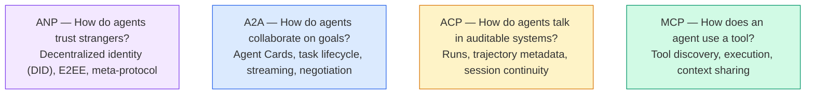

他们不是竞争对手,而是在不同层面解决不同的问题.

> 它们不是竞争关系.

一个真正的生产系统使用多个协议:MCP用于组织内部的工具,A2A用于代理合作,ACP式的轨迹记录用于合规,ANP用于跨组织身份.

> 真正的生产系统组合使用多个协议:MCP用于组织内工具,A2A用于代理协作,ACP风格轨迹日志用于合规,ANP用于跨组织身份,选择一个并强制一切通过它产生比关注点混合更糟糕的系统.

### 经过回调的 MCP

简单简单:MCP标准化了 LLM与外部工具和数据来源的连接方式.**client-server**协议中,代理 (客户端) 发现并调用服务器暴露的工具.

> 快速回顾:MCP 标准化了LLM 连接到外部工具和数据源的方式.**客户端-服务器**协议,代理 (客户端) 发现并调用服务器暴露的工具.

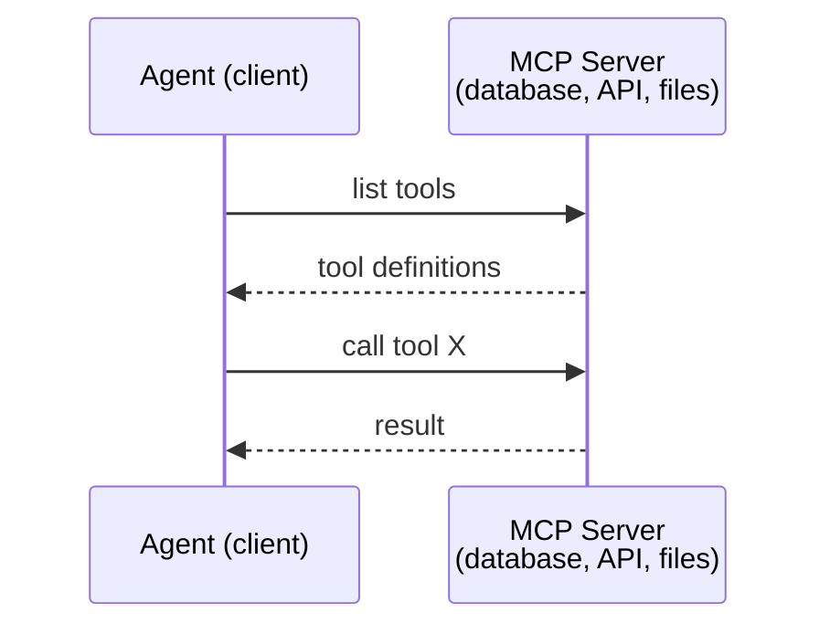

股是**agent-to-tool**没有帮助代理人互相交谈.

> 子**Agent 到工具**通信. 它不能帮助代理人相互通信.

垂直/水平分隔是清洁的:MCP是垂直线 (代理伸至工具/数据);A2A是水平线 (代理伸至同行代理).生产系统需要两者.

> 垂直/水平分离清晰:MCP 是垂直线;A2A 是水平线;A2A 是水平线;A2A 是水平线;A2A 是水平线;A2A 是水平线;A2A 是水平线;A2A 是水平线;A2A 是水平线;A2A 是水平线;A2A 是水平线;A2A 是水平线;A2A 是水平线;A2A 是水平线;A2A 是水平线;A2A 是水平线;A2A 是水平线;A2A 是水平线;A2是水平线;A2是水平线;A2是水平线;A2是水平线;A2是水平线;A2是水平线;A2是水平线;A2是水平线;A2是水平线;A2是水平线;A3是水平线;A3是水平线;A3是线;A3是线;A3是线;A3是线;

### 其他类型的产品

**Created by:**谷歌 (现在在Linux基金会下)`lf.a2a.v1`)
**Spec version:**其他
**Problem:**如何自主代理人合作,谈判,并委托任务?

> **创建者：**现在由Linux基金会管理为`lf.a2a.v1`)
> **规范版本：**其他
> **问题：**独立代理 如何合作,协商和相互委托任务?

 A2A是协议**peer-to-peer agent collaboration**任何代理都会发布一个信息,**Agent Card**其他代理人发现,与谈判,并委托任务.

>   **点对点 Agent 协作**协议――MCP 连接代理到工具,A2A 连接代理到其他代理――每个代理在已知URL 发布一个**Agent 卡片**其他代理人可以找到,协商和向其委托任务.

#### 如何使用A2A

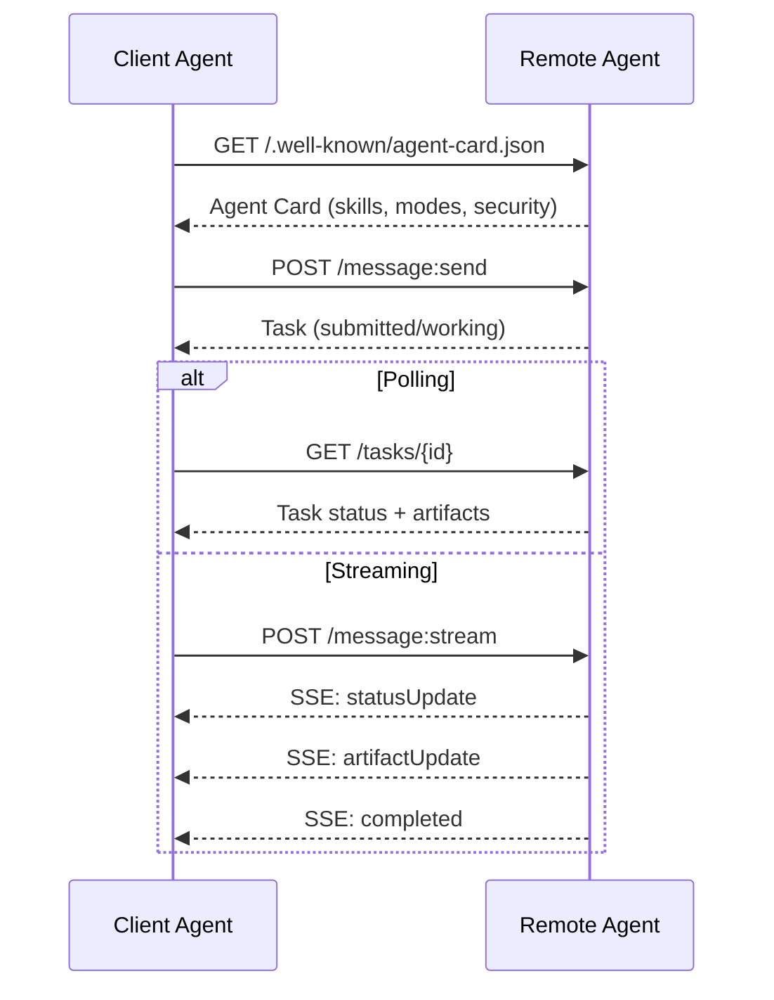

#### 真正的代理卡

作为一个A2A代理卡,`GET /.well-known/agent-card.json`其他:

```json
{
  "name": "Research Agent",
  "description": "Searches documentation and summarizes findings",
  "version": "1.0.0",
  "supportedInterfaces": [
    {
      "url": "https://research-agent.example.com/a2a/v1",
      "protocolBinding": "JSONRPC",
      "protocolVersion": "1.0"
    },
    {
      "url": "https://research-agent.example.com/a2a/rest",
      "protocolBinding": "HTTP+JSON",
      "protocolVersion": "1.0"
    }
  ],
  "provider": {
    "organization": "Your Company",
    "url": "https://example.com"
  },
  "capabilities": {
    "streaming": true,
    "pushNotifications": false
  },
  "defaultInputModes": ["text/plain", "application/json"],
  "defaultOutputModes": ["text/plain", "application/json"],
  "skills": [
    {
      "id": "web-research",
      "name": "Web Research",
      "description": "Searches the web and synthesizes findings",
      "tags": ["research", "search", "summarization"],
      "examples": ["Research the latest changes in React 19"]
    },
    {
      "id": "doc-analysis",
      "name": "Documentation Analysis",
      "description": "Reads and analyzes technical documentation",
      "tags": ["docs", "analysis"],
      "inputModes": ["text/plain", "application/pdf"],
      "outputModes": ["application/json"]
    }
  ],
  "securitySchemes": {
    "bearer": {
      "httpAuthSecurityScheme": {
        "scheme": "Bearer",
        "bearerFormat": "JWT"
      }
    }
  },
  "security": [{ "bearer": [] }]
}
```

值得注意的关键点:
- **Skills**客户端代理可以做什么.每个都有一个ID,标签,以及支持的输入/输出MIME类型. 这就是客户端代理决定该远程代理是否可以处理其请求.
  翻译: 中文**技能**是代理能做的事情.每个人都有ID,标签和支持的输入/输出MIME类型.客户端代理由此决定远程代理是否能够处理其请求.
- **supportedInterfaces**一个代理可以同时使用 JSON-RPC,REST和gRPC.
  翻译: 中文**supportedInterfaces**列出多个协议绑定. 单个代理可以同时使用JSON-RPC,REST和gRPC.
- **Security**客户在提出单项请求之前知道需要什么作者.
  翻译: 中文**安全性**在发出单个请求之前,客户端就知道需要什么证书.

#### 任务生命周期

任务是A2A的工作核心单位.它们通过定义状态进行移动:

> 任务是A2A中核心工作单元.它们在定义状态之间转换:

状态机是使A2A与简单的RPC不同之处.任务可以暂停 (输入要求),恢复 (客户端提供输入),失败或取消.客户端不需要阻止;它投票或订阅更新.

> 状态机是A2A与简单的RPC的不同之处.任务可以暂停 (需要输入),恢复 (需要输入),失败或取消.

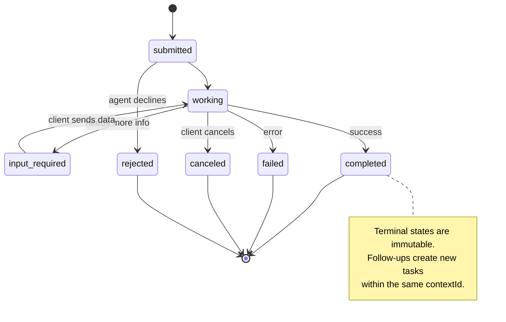

标准也定义了`UNSPECIFIED`作为哨兵,在此未删除):

> 所有8个状态规范也定义了`UNSPECIFIED`作为哨兵,此处省略):

| State | Terminal? | Meaning / 含义 |
|---|---|---|
| `TASK_STATE_SUBMITTED` | No | Acknowledged, not yet processing / 已确认，尚未处理 |
| `TASK_STATE_WORKING` | No | Actively being processed / 正在处理 |
| `TASK_STATE_INPUT_REQUIRED` | No | Agent needs more info from client / Agent 需要客户端更多信息 |
| `TASK_STATE_AUTH_REQUIRED` | No | Authentication needed / 需要认证 |
| `TASK_STATE_COMPLETED` | Yes | Finished successfully / 成功完成 |
| `TASK_STATE_FAILED` | Yes | Finished with error / 出错完成 |
| `TASK_STATE_CANCELED` | Yes | Canceled before completion / 完成前取消 |
| `TASK_STATE_REJECTED` | Yes | Agent declined the task / Agent 拒绝任务 |

终端状态 (完成,失败,取消,拒绝) 是不可改变的 一旦任务达到一个,不允许进一步更新. 后续工作必须在同一任务中创建新的任务`contextId`保持会议连续性.

> 终态 (终态) 终止 (终态) 终止 (终态) 终止 (终态) 终止 (终态) 终止 (终态) 终止 (终态) 终止 (终态) 终止 (终态) 终止 (终态) 终止 (终态) 终止 (终态) 终止 (终态) 终止 (终态) 终态) 终止 (终态) 终态) 终止 (终态) 终态) 终态 (终态) 终态) 终态 (终态) 终态 (终态) 终态) 终态 (终态) 终态 (终态) 终态) 终态 (终态) 终态 (终态) 终态) 终态 (终态) 终态 (终态) 终态) 终态 (终态) 终态 (终态) 终态) 终态 (终态) 终态) 终态 (终态) 终态) 终态 (终态) 终态) 终态 (终态) 终态) 终态 (终态) 终态) 终态 (终态)`contextId`中创建新任务以保持会话连续性.

一旦任务达到终端状态,它是不可改变的. 没有更多的消息. 后续创建一个新的任务在同一任务中.`contextId`现在,我们要去.

> 一旦任务到达终点状态,它是不可变的.`contextId`创建新任务.

#### 电缆格式

简单的信息交换方式是这样的:

**Client sends a task:**
```json
{
  "jsonrpc": "2.0",
  "id": 1,
  "method": "SendMessage",
  "params": {
    "message": {
      "messageId": "msg-001",
      "role": "ROLE_USER",
      "parts": [{ "text": "Research React 19 compiler features" }]
    },
    "configuration": {
      "acceptedOutputModes": ["text/plain", "application/json"],
      "historyLength": 10
    }
  }
}
```

**Agent responds with a task:**
```json
{
  "jsonrpc": "2.0",
  "id": 1,
  "result": {
    "task": {
      "id": "task-abc-123",
      "contextId": "ctx-xyz-789",
      "status": {
        "state": "TASK_STATE_COMPLETED",
        "timestamp": "2026-03-27T10:30:00Z"
      },
      "artifacts": [
        {
          "artifactId": "art-001",
          "name": "research-results",
          "parts": [{
            "data": {
              "findings": [
                "React 19 compiler auto-memoizes components",
                "No more manual useMemo/useCallback needed",
                "Compiler runs at build time, not runtime"
              ]
            },
            "mediaType": "application/json"
          }]
        }
      ]
    }
  }
}
```

**Streaming via SSE:**
```text
POST /message:stream HTTP/1.1
Content-Type: application/json
A2A-Version: 1.0

data: {"task":{"id":"task-123","status":{"state":"TASK_STATE_WORKING"}}}

data: {"statusUpdate":{"taskId":"task-123","status":{"state":"TASK_STATE_WORKING","message":{"role":"ROLE_AGENT","parts":[{"text":"Searching documentation..."}]}}}}

data: {"artifactUpdate":{"taskId":"task-123","artifact":{"artifactId":"art-1","parts":[{"text":"partial findings..."}]},"append":true,"lastChunk":false}}

data: {"statusUpdate":{"taskId":"task-123","status":{"state":"TASK_STATE_COMPLETED"}}}
```

### 亚太地区 (代理通信议定书)

**Created by:**国际电脑/比亚
**Spec version:**其他技术
**Status:**在Linux基金会下合并到A2A
**Problem:**如何通过完整的审计,会议连续性和轨迹跟踪来通信?

> **创建者：**国际电脑/比亚
> **规范版本：**其他技术
> **状态：**正在 Linux 基金会的A2A中
> **问题：**如何在完全可审核的会话连续性和轨迹跟踪的情况下通信?

 ACP是**enterprise protocol**与许多总结所说的不同,ACP确实是**not**简单的REST/JSON API是通过OpenAPI定义的.**TrajectoryMetadata**答案的每个代理人都能记录出其产生的推理步骤和工具调用.

> 非洲国家和地区**企业协议**与许多摘要声称不同,ACP**不**使用JSON-LD. 它是一个简单的REST/JSON API通过OpenAPI定义.**TrajectoryMetadata**应对应应应应应应应应应应应应应应应应应应应应应应应应应应应应应应应应应应应应应应应应应应应应应应应应应应应应应应应应应应应应应应应应应应应应应应应应应应应应应应应应应应应应应应应应应应应应应应应应应应应应应应应应应应应应应应应应应应应应应应应应应应应应应应应应应应应应应应应应应应应应应应应应应应应应应应应应应应应应应应应应应应应应应应应应应应应应应应应应应应应应应应应应应应应应应应应应应应应应应应应应应应应应应应应应应应应应应应应应应应应应应应应应应应应应应应应应应应应应应应应应应应应应应应应应应应应应应应应应应应应应应应应应应应应应应应应应应应应应应应应应应应应应应应应应应应应应应应应应应应应应应应应应应应应应应应应应应应应应应应应应应应应应应应应应应应应应应应应应应应应应应应应应应应应应应应应应应应应应应应应应应应应应应应应应应应应应应应应应应应应应应应应应应应应应应应应应应应应应应应应应应应应应应应应应应应应应应应应应应应应应应应应应应应应应应应应应应应应应应应应应应应应应应应应应应应应应应应应应应应应应应应应应应应应应应应应应应应应应应应应应应应应应应应应应应应应应应应应应应应应应应应应应应应应

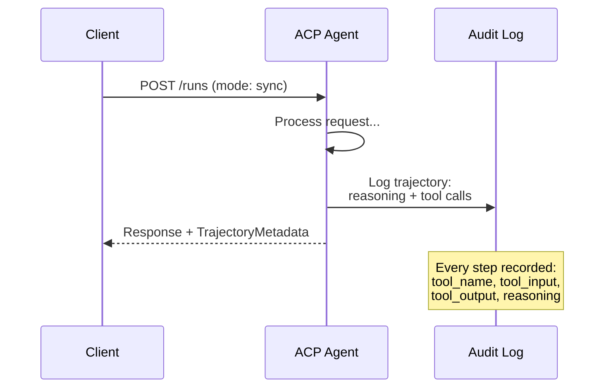

#### 发现代理在ACP

亚太地区的发现方法有四种:

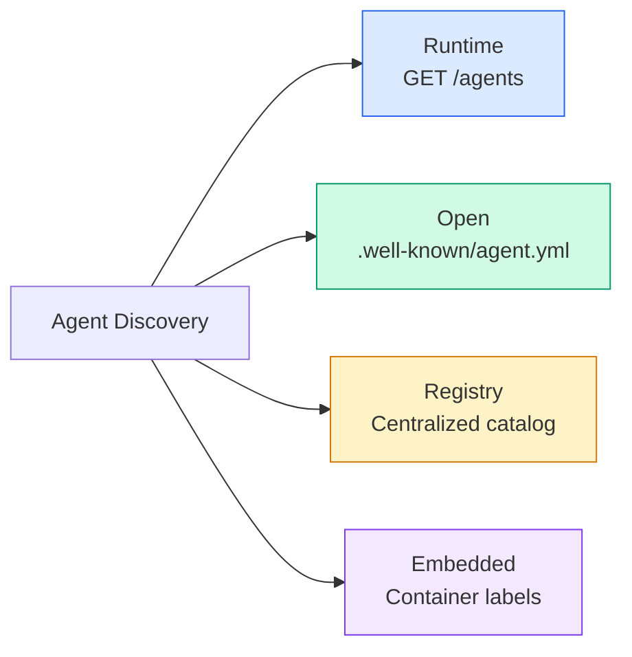

其他**AgentManifest**简单于A2A的代理卡:

> **AgentManifest**简单的说法:

```json
{
  "name": "summarizer",
  "description": "Summarizes documents with source citations",
  "input_content_types": ["text/plain", "application/pdf"],
  "output_content_types": ["text/plain", "application/json"],
  "metadata": {
    "tags": ["summarization", "RAG"],
    "framework": "BeeAI",
    "capabilities": [
      {
        "name": "Document Summarization",
        "description": "Condenses long documents into key points"
      }
    ],
    "recommended_models": ["llama3.3:70b-instruct-fp16"],
    "license": "Apache-2.0",
    "programming_language": "Python"
  }
}
```

没有协议绑定 (单个REST API),没有安全方案 (被委托到服务器级别),没有技能列表 (功能是平坦的元数据).

> 没有协议绑定 (单一 REST API) 没有安全方案 (无安全方案) 没有技能列表 (无技能列表) 能力是平元数据 (平元数据) 权衡:部署更简单,自描述性较差――

#### 运行生命周期

运行是执行代理的三个模式:

> 运行是具有三种模式的代理执行:

| Mode | Behavior |
|---|---|
| `sync` | Blocking. Response contains the complete result. |
| `async` | Returns 202 immediately. Poll `GET /runs/{id}` for status. |
| `stream` | SSE stream. Events fire as the agent works. |

> 现在,我们在做什么?
> 没有什么可做.
> 现在,我在做什么?`sync`阻塞. 响应包含完整的结果.
> 现在,我在做什么?`async`现在回来吧.`GET /runs/{id}`获得状态.
> 现在,我在做什么?`stream`现在,我在做什么?

模式选择将用户体验要求映射到:快速查询的同步,背景工作的同步,用户想要进展指标的长期任务的流.

> 模式选择映射到用户体验需求:同步 用于快速查询,同步 用于后台作业,流 用于用户想要进步指示的长时间运行任务.

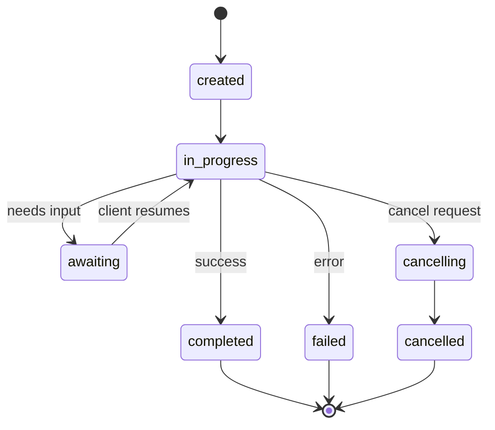

#### 轨迹 计量数据 (审计轨迹)

任何信息部分都能包含显示代理所做的事情的元数据:

```json
{
  "role": "agent/researcher",
  "parts": [
    {
      "content_type": "text/plain",
      "content": "The weather in San Francisco is 72F and sunny.",
      "metadata": {
        "kind": "trajectory",
        "message": "I need to check the weather for this location",
        "tool_name": "weather_api",
        "tool_input": { "location": "San Francisco, CA" },
        "tool_output": { "temperature": 72, "condition": "sunny" }
      }
    }
  ]
}
```

对于受监管的行业来说,这是黄金. 每个答案都伴随着一个可证明的推理链:

> 对于受监管行业来说,这是无价的宝藏.

银行,医疗保健和政府部署需要这种审计性.ACP的轨迹转移数据使得LLM代理人在这些环境中被接受.

> 银行,医疗和政府部署需要这种可审计性.

非洲国家及地区的发展**CitationMetadata**对于源归因:

> 支持**CitationMetadata**用于来源归属:

```json
{
  "kind": "citation",
  "start_index": 0,
  "end_index": 47,
  "url": "https://weather.gov/sf",
  "title": "NWS San Francisco Forecast"
}
```

### 代理网络协议 (ANP)

**Created by:**开源社区 (由高伟长创立)
**Repo:** [github.com/agent-network-protocol/AgentNetworkProtocol](https://github.com/agent-network-protocol/AgentNetworkProtocol)
**Problem:**如何让不同组织的代理人,

> **创建者：**开源社区(由高伟长创立)
> **代码库：** [github.com/agent-network-protocol/AgentNetworkProtocol](https://github.com/agent-network-protocol/AgentNetworkProtocol)
> **问题：**如何在没有中央权力的情况下相互信任?

美国国家安全局**decentralized identity protocol**通过W3C分散识别器 (DID) 和端到端加密建立信任.与A2A不同,在A2A中通过已知终端点发现代理人,ANP允许代理人通过加密证明他们的身份.

>   **去中心化身份协议**△它使用W3C 去中心化标识符 (DID) 和端到端加密建立信任──通过已知端发现代理的A2A不同,ANP让代理以加密方式证明其身份──

 ANP有三个层:

> 美国的三层次:

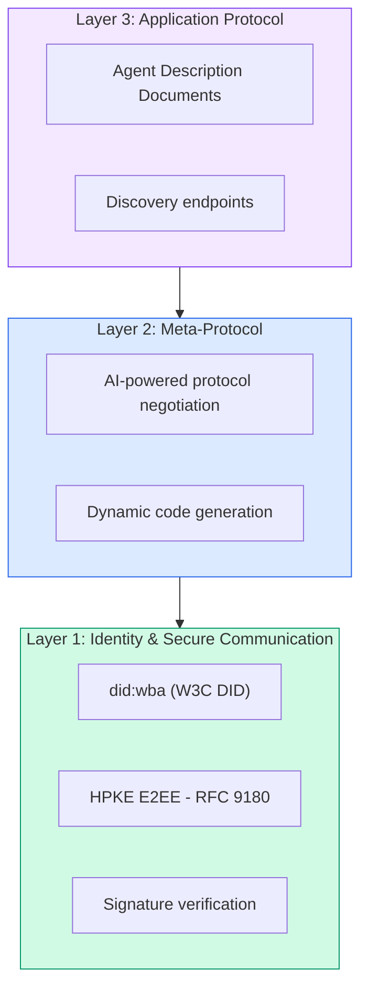

#### 关于"实体结构"的文件

 ANP使用一个名为 `did:wba`据悉,这次的调查结果是`did:wba:example.com:user:alice`解决问题`https://example.com/user/alice/did.json`其他:

```json
{
  "@context": [
    "https://www.w3.org/ns/did/v1",
    "https://w3id.org/security/suites/jws-2020/v1",
    "https://w3id.org/security/suites/secp256k1-2019/v1"
  ],
  "id": "did:wba:example.com:user:alice",
  "verificationMethod": [
    {
      "id": "did:wba:example.com:user:alice#key-1",
      "type": "EcdsaSecp256k1VerificationKey2019",
      "controller": "did:wba:example.com:user:alice",
      "publicKeyJwk": {
        "crv": "secp256k1",
        "x": "NtngWpJUr-rlNNbs0u-Aa8e16OwSJu6UiFf0Rdo1oJ4",
        "y": "qN1jKupJlFsPFc1UkWinqljv4YE0mq_Ickwnjgasvmo",
        "kty": "EC"
      }
    },
    {
      "id": "did:wba:example.com:user:alice#key-x25519-1",
      "type": "X25519KeyAgreementKey2019",
      "controller": "did:wba:example.com:user:alice",
      "publicKeyMultibase": "z9hFgmPVfmBZwRvFEyniQDBkz9LmV7gDEqytWyGZLmDXE"
    }
  ],
  "authentication": [
    "did:wba:example.com:user:alice#key-1"
  ],
  "keyAgreement": [
    "did:wba:example.com:user:alice#key-x25519-1"
  ],
  "humanAuthorization": [
    "did:wba:example.com:user:alice#key-1"
  ],
  "service": [
    {
      "id": "did:wba:example.com:user:alice#agent-description",
      "type": "AgentDescription",
      "serviceEndpoint": "https://example.com/agents/alice/ad.json"
    }
  ]
}
```

值得注意的关键点:
- **Key separation**签字密钥 (secp256k1) 与加密密钥 (X25519) 分开.
  翻译: 中文**密钥分离**签名密钥: 签名密钥: 签名密钥: 签名密钥: 签名密钥: 签名密钥: 签名密钥: 签名密钥: 签名密钥: 签名密钥: 签名密钥: 签名密钥: 签名密钥: 签名密钥: 签名密钥: 签名密钥: 签名密钥: 签名密钥: 签名密钥: 签名密钥: 签名密钥: 签名密钥: 签名密钥: 签名密钥: 签名密钥: 签名密钥: 签名密钥: 签名密钥: 签名密钥: 签名密钥: 签名密钥: 签名密钥: 签名密钥: 签名密钥: 签名密钥: 签名密钥: 签名密钥: 签名密钥: 签名密钥: 签名密钥: 签名密钥: 签名密钥: 签名
- **`humanAuthorization`**通过这些密钥,使用者必须在使用前明确的人类批准 (生物识别,密码,HSM).
  翻译: 中文**`humanAuthorization`**通过此路径进行. 通过此路径进行.
- **`keyAgreement`**密钥用于HPKE端到端加密 (RFC 9180).
  翻译: 中文**`keyAgreement`**密钥用于HPKE端到端加密(RFC 9180)。
- 其他**service**部分链接到代理描述文件.
  翻译: 中文**service**部分链接到 代理 描述文档.

关键分离模式是现实世界加密系统所需的,但JSON协议通常会跳过. ANP执行它,因为跨组织代理处理货币,合同,以及 PII 一个被破坏的关键不能解锁每个功能.

> 密钥分离模式是现实加密系统所要求的,但JSON协议经常跳过.

#### 如何在ANP中建立信任

美国国家安全局**not**使用信任网或认可图.信任是双边的,并且每次互动都被验证:

> 美国国家**不**使用信任网络或背书图.信任是双边的,每次交往都会验证:

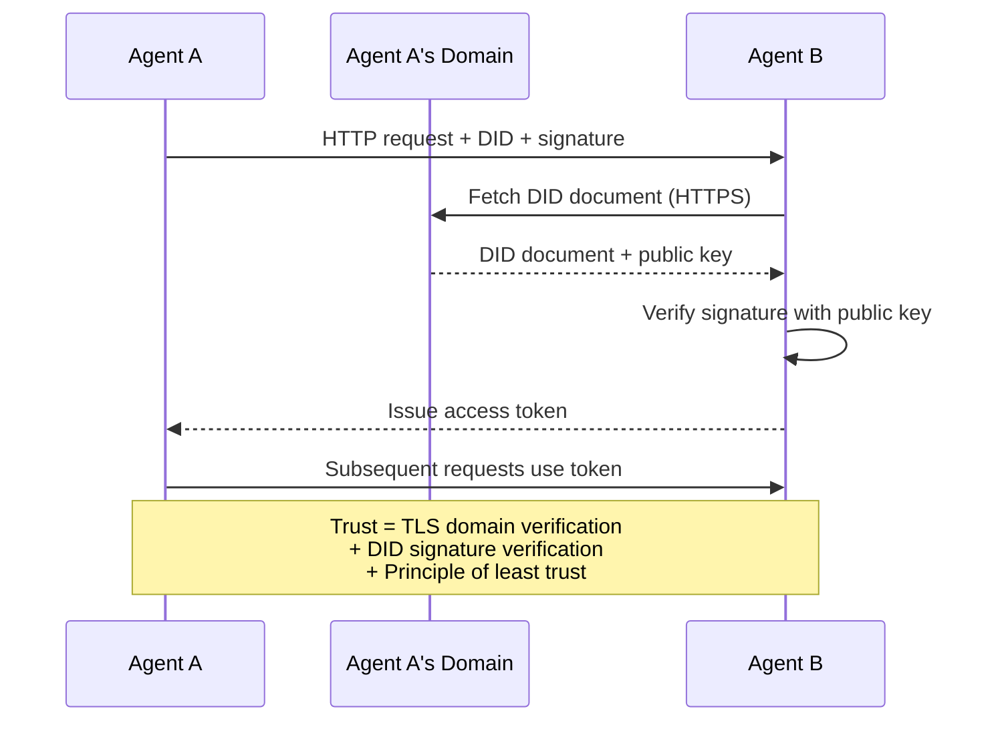

信心来自三个来源:
1. **Domain-level TLS**验证了DID文件的主机
   翻译: 中文**域级 TLS**验证 DID 文档主机
2. **DID cryptographic signatures**验证代理人的身份
   翻译: 中文**DID 加密签名**验证代理身份
3. **Principle of least trust**仅授予最低许可
   翻译: 中文**最小信任原则**仅授予最低权限

通过三源设计避免单个失败点.单独的TLS是不够的 (任何拥有证书的人都可以托管DID).单独的DID是不够的 (盗窃密钥伪造身份).与最小信任授权相结合,你得到了没有中央权威的深度防御.

> 三源设计避免单点故障――只有TLS不够――任何有证书的人都可以托管DID)――只有DID不够――被盗密钥伪造身份――――与最小信任授权结合,你获得了深厚的防御而无需中央权力――

没有基于言的信任传播或页面排名评分.

> 没有基于八的信任传播或页面排名评分.

#### 标签协议谈判

两位来自不同生态系统的代理人会面时,他们不需要预先达成的数据格式.

> 这就是ANP最新的功能. 当来自不同生态系统的两个代理人相遇时,它们不需要预先确定的数据格式.

```json
{
  "action": "protocolNegotiation",
  "sequenceId": 0,
  "candidateProtocols": "I can communicate using:\n1. JSON-RPC with hotel booking schema\n2. REST with OpenAPI 3.1 spec\n3. Natural language over HTTP",
  "modificationSummary": "Initial proposal",
  "status": "negotiating"
}
```

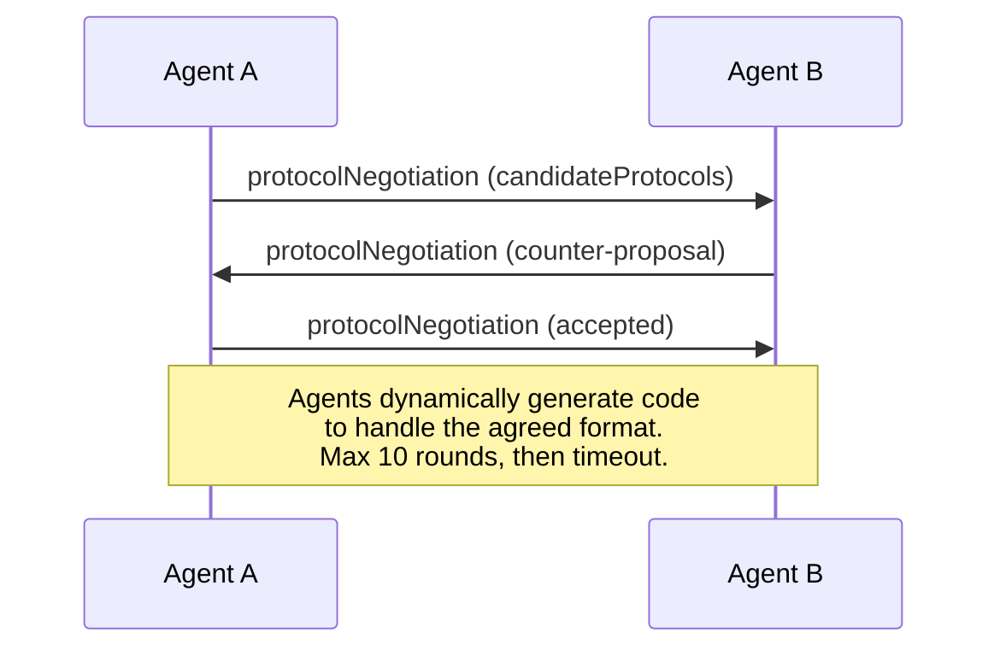

代理人往前回 (最大10次发射) 直到他们达成协议,然后动态生成代码来处理它.`negotiating`现在`rejected`现在`accepted`现在`timeout`现在,我们要去.

> 经纪人回来协商,直到达成协议,然后动态生成代码来处理它.`negotiating`关于""的建议`rejected`没有人能接受.`accepted`(接受) `timeout`现在,我在做什么?

这意味着两个从未见过的代理人可以在没有人预先定义共享方案的情况下找到如何沟通.

> 这意味着两个从未见过的代理人可以在没有人预先定义共享模式的情况下找到如何通信的方式.

愿景:一个开放的代理网,任何代理可以与任何其他代理商,无需先前的集成工作,交谈.这是否超越玩具演示,是一个开放的2026问题.反弹总是"使用A2A和预先同意方案".

> 愿景:开放代理 网络中的任何代理都可以与任何其他代理 临时对话,无需前期集成工作.

### 较量 (已修正)

| | MCP | A2A | ACP | ANP |
|---|---|---|---|---|
| **Created by** | Anthropic | Google / Linux Foundation | IBM / BeeAI | Community |
| **Spec format** | JSON-RPC | JSON-RPC / REST / gRPC | OpenAPI 3.1 (REST) | JSON-RPC |
| **Primary use** | Agent to Tool | Agent to Agent | Agent to Agent | Agent to Agent |
| **Discovery** | Tool listing | `/.well-known/agent-card.json` | `GET /agents`, `/.well-known/agent.yml` | `/.well-known/agent-descriptions`, DID service endpoints |
| **Identity** | Implicit (local) | Security schemes (OAuth, mTLS) | Server-level | W3C DID (`did:wba`) with E2EE |
| **Audit trail** | N/A | Basic (task history) | TrajectoryMetadata (tool calls, reasoning) | Not formally specified |
| **State machine** | N/A | 9 task states | 7 run states | N/A |
| **Streaming** | N/A | SSE | SSE | Transport-agnostic |
| **Unique feature** | Tool schemas | Agent Cards + Skills | Trajectory audit trail | Meta-protocol negotiation |
| **Best for** | Tools & data | Dynamic collaboration | Regulated industries | Cross-org trust |
| **Status** | Stable | Stable (v1.0) | Merging into A2A | Active development |

### 他们如何合作

实际的企业系统使用多种:

> 实际企业系统使用多个协议:

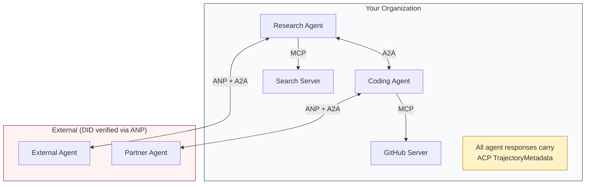

- **MCP**连接每个代理到其工具
  翻译: 中文**MCP**将每个代理 连接到其工具
- **A2A**管理代理人之间的合作 (内部和外部)
  翻译: 中文**A2A**处理 代理之间的协作 (内部和外部)
- **ACP**封装响应为可审计的轨迹元数据
  翻译: 中文**ACP**用轨迹数据包装响应实现可审计性
- **ANP**提供身份验证,为你无法控制的代理人
  翻译: 中文**ANP**为你无法控制的代理提供身份证

## 建立它,实现它.
```figure
swarm-message-bus
```

## 建立它

### 第一个步骤:核心信息类型

我们定义了将数据映射到实际协议中使用的类型:

> 每个多个代理系统都以消息格式开始. 我们定义了映射到真实协议使用的类型:

```typescript
import crypto from "node:crypto";

type MessageRole = "user" | "agent";

type MessagePart =
  | { kind: "text"; text: string }
  | { kind: "data"; data: unknown; mediaType: string }
  | { kind: "file"; name: string; url: string; mediaType: string };

type TrajectoryEntry = {
  reasoning: string;
  toolName?: string;
  toolInput?: unknown;
  toolOutput?: unknown;
  timestamp: number;
};

type AgentMessage = {
  id: string;
  role: MessageRole;
  parts: MessagePart[];
  trajectory?: TrajectoryEntry[];
  replyTo?: string;
  timestamp: number;
};

function createMessage(
  role: MessageRole,
  parts: MessagePart[],
  replyTo?: string
): AgentMessage {
  return {
    id: crypto.randomUUID(),
    role,
    parts,
    replyTo,
    timestamp: Date.now(),
  };
}

function textMessage(role: MessageRole, text: string): AgentMessage {
  return createMessage(role, [{ kind: "text", text }]);
}
```

注意:`MessagePart`像真正的A2A和ACP规格一样,它是多模式的 (文字,结构数据,文件). `TrajectoryEntry`采集了基于ACP的轨迹数据的推理链.

> 注意:`MessagePart`文件,就像真实的A2A和ACP规范一样.`TrajectoryEntry`捕获推理链,匹配ACP的轨迹

### 步骤2:A2A代理卡和注册表

建立一个与A2A的真实规格相匹配的发现代理:

> 构建匹配真实A2A规范的代理发现:

```typescript
type Skill = {
  id: string;
  name: string;
  description: string;
  tags: string[];
  inputModes: string[];
  outputModes: string[];
};

type AgentCard = {
  name: string;
  description: string;
  version: string;
  url: string;
  capabilities: {
    streaming: boolean;
    pushNotifications: boolean;
  };
  defaultInputModes: string[];
  defaultOutputModes: string[];
  skills: Skill[];
};

class AgentRegistry {
  private cards: Map<string, AgentCard> = new Map();

  register(card: AgentCard) {
    this.cards.set(card.name, card);
  }

  discoverBySkillTag(tag: string): AgentCard[] {
    return [...this.cards.values()].filter((card) =>
      card.skills.some((skill) => skill.tags.includes(tag))
    );
  }

  discoverByInputMode(mimeType: string): AgentCard[] {
    return [...this.cards.values()].filter(
      (card) =>
        card.defaultInputModes.includes(mimeType) ||
        card.skills.some((skill) => skill.inputModes.includes(mimeType))
    );
  }

  resolve(name: string): AgentCard | undefined {
    return this.cards.get(name);
  }

  listAll(): AgentCard[] {
    return [...this.cards.values()];
  }
}
```

通过技能标签,输入MIME类型或名称,就像真正的A2A规范支持的那样.

> 通过技能标签输入MIME类型或名称发现代理,就像真实的A2A规范支持一样.

### 步骤3:A2A任务生命周期

构建一个完整的任务状态机:

> 构建完整任务状态机:

```typescript
type TaskState =
  | "submitted"
  | "working"
  | "input-required"
  | "auth-required"
  | "completed"
  | "failed"
  | "canceled"
  | "rejected";

const TERMINAL_STATES: TaskState[] = [
  "completed",
  "failed",
  "canceled",
  "rejected",
];

type TaskStatus = {
  state: TaskState;
  message?: AgentMessage;
  timestamp: number;
};

type Artifact = {
  id: string;
  name: string;
  parts: MessagePart[];
};

type Task = {
  id: string;
  contextId: string;
  status: TaskStatus;
  artifacts: Artifact[];
  history: AgentMessage[];
};

type TaskEvent =
  | { kind: "statusUpdate"; taskId: string; status: TaskStatus }
  | {
      kind: "artifactUpdate";
      taskId: string;
      artifact: Artifact;
      append: boolean;
      lastChunk: boolean;
    };

type TaskHandler = (
  task: Task,
  message: AgentMessage
) => AsyncGenerator<TaskEvent>;

class TaskManager {
  private tasks: Map<string, Task> = new Map();
  private handlers: Map<string, TaskHandler> = new Map();
  private listeners: Map<string, ((event: TaskEvent) => void)[]> = new Map();

  registerHandler(agentName: string, handler: TaskHandler) {
    this.handlers.set(agentName, handler);
  }

  subscribe(taskId: string, listener: (event: TaskEvent) => void) {
    const existing = this.listeners.get(taskId) ?? [];
    existing.push(listener);
    this.listeners.set(taskId, existing);
  }

  async sendMessage(
    agentName: string,
    message: AgentMessage,
    contextId?: string
  ): Promise<Task> {
    const handler = this.handlers.get(agentName);
    if (!handler) {
      const task = this.createTask(contextId);
      task.status = {
        state: "rejected",
        timestamp: Date.now(),
        message: textMessage("agent", `No handler for ${agentName}`),
      };
      return task;
    }

    const task = this.createTask(contextId);
    task.history.push(message);
    task.status = { state: "submitted", timestamp: Date.now() };

    this.processTask(task, handler, message).catch((err) => {
      task.status = {
        state: "failed",
        timestamp: Date.now(),
        message: textMessage("agent", String(err)),
      };
    });
    return task;
  }

  getTask(taskId: string): Task | undefined {
    return this.tasks.get(taskId);
  }

  cancelTask(taskId: string): boolean {
    const task = this.tasks.get(taskId);
    if (!task || TERMINAL_STATES.includes(task.status.state)) return false;
    task.status = { state: "canceled", timestamp: Date.now() };
    this.emit(taskId, {
      kind: "statusUpdate",
      taskId,
      status: task.status,
    });
    return true;
  }

  private createTask(contextId?: string): Task {
    const task: Task = {
      id: crypto.randomUUID(),
      contextId: contextId ?? crypto.randomUUID(),
      status: { state: "submitted", timestamp: Date.now() },
      artifacts: [],
      history: [],
    };
    this.tasks.set(task.id, task);
    return task;
  }

  private async processTask(
    task: Task,
    handler: TaskHandler,
    message: AgentMessage
  ) {
    task.status = { state: "working", timestamp: Date.now() };
    this.emit(task.id, {
      kind: "statusUpdate",
      taskId: task.id,
      status: task.status,
    });

    try {
      for await (const event of handler(task, message)) {
        if (TERMINAL_STATES.includes(task.status.state)) break;

        if (event.kind === "statusUpdate") {
          task.status = event.status;
        }
        if (event.kind === "artifactUpdate") {
          const existing = task.artifacts.find(
            (a) => a.id === event.artifact.id
          );
          if (existing && event.append) {
            existing.parts.push(...event.artifact.parts);
          } else {
            task.artifacts.push(event.artifact);
          }
        }
        this.emit(task.id, event);
      }
    } catch (err) {
      task.status = {
        state: "failed",
        timestamp: Date.now(),
        message: textMessage("agent", String(err)),
      };
      this.emit(task.id, {
        kind: "statusUpdate",
        taskId: task.id,
        status: task.status,
      });
    }
  }

  private emit(taskId: string, event: TaskEvent) {
    for (const listener of this.listeners.get(taskId) ?? []) {
      listener(event);
    }
  }
}
```

这实现了真正的A2A任务生命周期:提交,工作,输入要求,终端状态.处理器是异步生成器,生成与SSE流模式相匹配的事件 (状态更新和文物块).

> 这实现了真正的A2A任务生命周期:提交的,工作的,输入的,需要的,终态.处理程序是异步生成器,产生匹配的SSE流模型事件状态更新和工件块)

### 步骤4:ACP风格审计之路

包装通信与轨迹跟踪:

> 用轨迹跟踪包装通信:

```typescript
type AuditEntry = {
  runId: string;
  agentName: string;
  input: AgentMessage[];
  output: AgentMessage[];
  trajectory: TrajectoryEntry[];
  status: "created" | "in-progress" | "completed" | "failed" | "awaiting";
  startedAt: number;
  completedAt?: number;
  sessionId?: string;
};

class AuditableRunner {
  private log: AuditEntry[] = [];
  private handlers: Map<
    string,
    (input: AgentMessage[]) => Promise<{
      output: AgentMessage[];
      trajectory: TrajectoryEntry[];
    }>
  > = new Map();

  registerAgent(
    name: string,
    handler: (input: AgentMessage[]) => Promise<{
      output: AgentMessage[];
      trajectory: TrajectoryEntry[];
    }>
  ) {
    this.handlers.set(name, handler);
  }

  async run(
    agentName: string,
    input: AgentMessage[],
    sessionId?: string
  ): Promise<AuditEntry> {
    const entry: AuditEntry = {
      runId: crypto.randomUUID(),
      agentName,
      input: structuredClone(input),
      output: [],
      trajectory: [],
      status: "created",
      startedAt: Date.now(),
      sessionId,
    };
    this.log.push(entry);

    const handler = this.handlers.get(agentName);
    if (!handler) {
      entry.status = "failed";
      return entry;
    }

    entry.status = "in-progress";
    try {
      const result = await handler(input);
      entry.output = structuredClone(result.output);
      entry.trajectory = structuredClone(result.trajectory);
      entry.status = "completed";
      entry.completedAt = Date.now();
    } catch (err) {
      entry.status = "failed";
      entry.trajectory.push({
        reasoning: `Error: ${String(err)}`,
        timestamp: Date.now(),
      });
      entry.completedAt = Date.now();
    }
    return entry;
  }

  getFullAuditLog(): AuditEntry[] {
    return structuredClone(this.log);
  }

  getAuditLogForAgent(agentName: string): AuditEntry[] {
    return structuredClone(
      this.log.filter((e) => e.agentName === agentName)
    );
  }

  getAuditLogForSession(sessionId: string): AuditEntry[] {
    return structuredClone(
      this.log.filter((e) => e.sessionId === sessionId)
    );
  }

  getTrajectoryForRun(runId: string): TrajectoryEntry[] {
    const entry = this.log.find((e) => e.runId === runId);
    return entry ? structuredClone(entry.trajectory) : [];
  }
}
```

每个代理执行都会产生一个完整的审计输入:进入的,出出的,以及工具调用和推理步骤的完整轨迹.你可以按代理,按会议或单个运行查询.

> 每次执行代理都会产生一个完整的审计条目:输入了什么,输出了什么,以及工具调用和推理步骤之间的完整轨迹.

### 步骤5:ANP风格身份验证

建立基于DID的身份和验证:

> 基于ID身份和验证的构建:

```typescript
type VerificationMethod = {
  id: string;
  type: string;
  controller: string;
  publicKeyDer: string;
};

type DIDDocument = {
  id: string;
  verificationMethod: VerificationMethod[];
  authentication: string[];
  keyAgreement: string[];
  humanAuthorization: string[];
  service: { id: string; type: string; serviceEndpoint: string }[];
};

type AgentIdentity = {
  did: string;
  document: DIDDocument;
  privateKey: crypto.KeyObject;
  publicKey: crypto.KeyObject;
};

class IdentityRegistry {
  private documents: Map<string, DIDDocument> = new Map();

  publish(doc: DIDDocument) {
    this.documents.set(doc.id, doc);
  }

  resolve(did: string): DIDDocument | undefined {
    return this.documents.get(did);
  }

  verify(did: string, signature: string, payload: string): boolean {
    const doc = this.documents.get(did);
    if (!doc) return false;

    const authKeyIds = doc.authentication;
    const authKeys = doc.verificationMethod.filter((vm) =>
      authKeyIds.includes(vm.id)
    );

    for (const key of authKeys) {
      const publicKey = crypto.createPublicKey({
        key: Buffer.from(key.publicKeyDer, "base64"),
        format: "der",
        type: "spki",
      });
      const isValid = crypto.verify(
        null,
        Buffer.from(payload),
        publicKey,
        Buffer.from(signature, "hex")
      );
      if (isValid) return true;
    }
    return false;
  }

  requiresHumanAuth(did: string, operationKeyId: string): boolean {
    const doc = this.documents.get(did);
    if (!doc) return false;
    return doc.humanAuthorization.includes(operationKeyId);
  }
}

function createIdentity(domain: string, agentName: string): AgentIdentity {
  const did = `did:wba:${domain}:agent:${agentName}`;
  const { publicKey, privateKey } = crypto.generateKeyPairSync("ed25519");

  const publicKeyDer = publicKey
    .export({ format: "der", type: "spki" })
    .toString("base64");

  const keyId = `${did}#key-1`;
  const encKeyId = `${did}#key-x25519-1`;

  const document: DIDDocument = {
    id: did,
    verificationMethod: [
      {
        id: keyId,
        type: "Ed25519VerificationKey2020",
        controller: did,
        publicKeyDer,
      },
      {
        id: encKeyId,
        type: "X25519KeyAgreementKey2019",
        controller: did,
        publicKeyDer,
      },
    ],
    authentication: [keyId],
    keyAgreement: [encKeyId],
    humanAuthorization: [],
    service: [
      {
        id: `${did}#agent-description`,
        type: "AgentDescription",
        serviceEndpoint: `https://${domain}/agents/${agentName}/ad.json`,
      },
    ],
  };

  return { did, document, privateKey, publicKey };
}

function signPayload(identity: AgentIdentity, payload: string): string {
  return crypto
    .sign(null, Buffer.from(payload), identity.privateKey)
    .toString("hex");
}
```

这反映了ANP的真实身份模式:代理人拥有独立的身份验证,关键协议和人权授权密钥的DID文件.`IdentityRegistry`模拟了DID分辨率 (在生产中,这将是HTTP将其带到代理域).

> 这反映了真正的ANP身份模型:代理拥有独立认证,密钥协议和人工授权密钥的ID文件.`IdentityRegistry`模拟 DID 解析在生产环境中,这将是向代理域的HTTP 获取)

### 步骤 6: 协议门户

连接所有四个协议到一个统一的系统:

> 将所有四个协议连接到一个统一的系统:

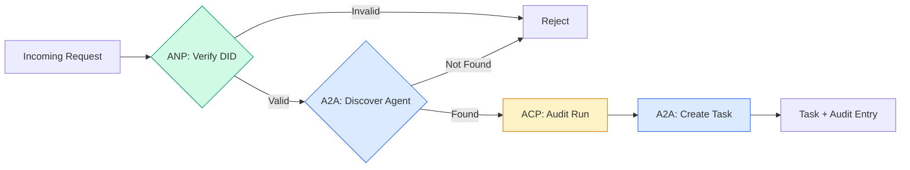

```typescript
class ProtocolGateway {
  private registry: AgentRegistry;
  private taskManager: TaskManager;
  private auditRunner: AuditableRunner;
  private identityRegistry: IdentityRegistry;

  constructor(
    registry: AgentRegistry,
    taskManager: TaskManager,
    auditRunner: AuditableRunner,
    identityRegistry: IdentityRegistry
  ) {
    this.registry = registry;
    this.taskManager = taskManager;
    this.auditRunner = auditRunner;
    this.identityRegistry = identityRegistry;
  }

  async delegateTask(
    fromDid: string,
    signature: string,
    targetAgent: string,
    message: AgentMessage,
    sessionId?: string
  ): Promise<{ task: Task; audit: AuditEntry } | { error: string }> {
    if (!this.identityRegistry.verify(fromDid, signature, message.id)) {
      return { error: "Identity verification failed" };
    }

    const card = this.registry.resolve(targetAgent);
    if (!card) {
      return { error: `Agent ${targetAgent} not found in registry` };
    }

    const audit = await this.auditRunner.run(
      targetAgent,
      [message],
      sessionId
    );
    const task = await this.taskManager.sendMessage(targetAgent, message);

    return { task, audit };
  }

  discoverAndDelegate(
    fromDid: string,
    signature: string,
    skillTag: string,
    message: AgentMessage
  ): Promise<{ task: Task; audit: AuditEntry } | { error: string }> {
    const candidates = this.registry.discoverBySkillTag(skillTag);
    if (candidates.length === 0) {
      return Promise.resolve({
        error: `No agents found with skill tag: ${skillTag}`,
      });
    }
    return this.delegateTask(
      fromDid,
      signature,
      candidates[0].name,
      message
    );
  }
}
```

门户在一个电话中做了四件事:
1. **ANP**:通过DID签名验证调用者的身份
   翻译: 中文**ANP**通过DID 签名验证调用者身份
2. **A2A**: 发现目标代理和检查能力
   翻译: 中文**A2A**发现目标代理并检查能力
3. **ACP**: 结执行过程在一个轨迹的审计轨迹中
   翻译: 中文**ACP**运行审计跟踪包装执行
4. **A2A**: 创建一个任务,使用完整的生命周期跟踪
   翻译: 中文**A2A**创建一个完整的生命周期跟踪任务

### 七步:把所有东西都放在一起

```typescript
async function protocolDemo() {
  const registry = new AgentRegistry();
  registry.register({
    name: "researcher",
    description: "Searches and summarizes findings",
    version: "1.0.0",
    url: "https://researcher.local/a2a/v1",
    capabilities: { streaming: true, pushNotifications: false },
    defaultInputModes: ["text/plain"],
    defaultOutputModes: ["text/plain", "application/json"],
    skills: [
      {
        id: "web-research",
        name: "Web Research",
        description: "Searches the web",
        tags: ["research", "search", "summarization"],
        inputModes: ["text/plain"],
        outputModes: ["application/json"],
      },
    ],
  });
  registry.register({
    name: "coder",
    description: "Writes code from specs",
    version: "1.0.0",
    url: "https://coder.local/a2a/v1",
    capabilities: { streaming: false, pushNotifications: false },
    defaultInputModes: ["text/plain", "application/json"],
    defaultOutputModes: ["text/plain"],
    skills: [
      {
        id: "code-gen",
        name: "Code Generation",
        description: "Generates code",
        tags: ["coding", "generation"],
        inputModes: ["text/plain", "application/json"],
        outputModes: ["text/plain"],
      },
    ],
  });

  const taskManager = new TaskManager();
  const auditRunner = new AuditableRunner();

  const researchTrajectory: TrajectoryEntry[] = [];

  taskManager.registerHandler(
    "researcher",
    async function* (task, message) {
      yield {
        kind: "statusUpdate" as const,
        taskId: task.id,
        status: { state: "working" as const, timestamp: Date.now() },
      };

      researchTrajectory.push({
        reasoning: "Searching for React 19 documentation",
        toolName: "web_search",
        toolInput: { query: "React 19 compiler features" },
        toolOutput: {
          results: ["react.dev/blog/react-19", "github.com/react/react"],
        },
        timestamp: Date.now(),
      });

      researchTrajectory.push({
        reasoning: "Extracting key findings from search results",
        toolName: "doc_analysis",
        toolInput: { url: "react.dev/blog/react-19" },
        toolOutput: {
          summary:
            "React 19 compiler auto-memoizes, no manual useMemo needed",
        },
        timestamp: Date.now(),
      });

      yield {
        kind: "artifactUpdate" as const,
        taskId: task.id,
        artifact: {
          id: crypto.randomUUID(),
          name: "research-results",
          parts: [
            {
              kind: "data" as const,
              data: {
                findings: [
                  "React 19 compiler auto-memoizes components",
                  "No more manual useMemo/useCallback needed",
                  "Compiler runs at build time, not runtime",
                ],
                sources: ["react.dev/blog/react-19"],
              },
              mediaType: "application/json",
            },
          ],
        },
        append: false,
        lastChunk: true,
      };

      yield {
        kind: "statusUpdate" as const,
        taskId: task.id,
        status: { state: "completed" as const, timestamp: Date.now() },
      };
    }
  );

  auditRunner.registerAgent("researcher", async () => ({
    output: [
      textMessage("agent", "React 19 compiler auto-memoizes components"),
    ],
    trajectory: researchTrajectory,
  }));

  const identityRegistry = new IdentityRegistry();

  const coderIdentity = createIdentity("coder.local", "coder");
  const researcherIdentity = createIdentity("researcher.local", "researcher");

  identityRegistry.publish(coderIdentity.document);
  identityRegistry.publish(researcherIdentity.document);

  const gateway = new ProtocolGateway(
    registry,
    taskManager,
    auditRunner,
    identityRegistry
  );

  console.log("=== Protocol Demo ===\n");

  console.log("1. Agent Discovery (A2A)");
  const researchAgents = registry.discoverBySkillTag("research");
  console.log(
    `   Found ${researchAgents.length} agent(s):`,
    researchAgents.map((a) => a.name)
  );

  console.log("\n2. Identity Verification (ANP)");
  const message = textMessage("user", "Research React 19 compiler features");
  const signature = signPayload(coderIdentity, message.id);
  const verified = identityRegistry.verify(
    coderIdentity.did,
    signature,
    message.id
  );
  console.log(`   Coder DID: ${coderIdentity.did}`);
  console.log(`   Signature verified: ${verified}`);

  console.log("\n3. Task Delegation (A2A + ACP + ANP)");
  const result = await gateway.delegateTask(
    coderIdentity.did,
    signature,
    "researcher",
    message,
    "session-001"
  );

  if ("error" in result) {
    console.log(`   Error: ${result.error}`);
    return;
  }

  console.log(`   Task ID: ${result.task.id}`);
  console.log(`   Task state: ${result.task.status.state}`);
  console.log(`   Artifacts: ${result.task.artifacts.length}`);

  console.log("\n4. Audit Trail (ACP)");
  console.log(`   Run ID: ${result.audit.runId}`);
  console.log(`   Status: ${result.audit.status}`);
  console.log(`   Trajectory steps: ${result.audit.trajectory.length}`);
  for (const step of result.audit.trajectory) {
    console.log(`     - ${step.reasoning}`);
    if (step.toolName) {
      console.log(`       Tool: ${step.toolName}`);
    }
  }

  console.log("\n5. Full Audit Log");
  const fullLog = auditRunner.getFullAuditLog();
  console.log(`   Total runs: ${fullLog.length}`);
  for (const entry of fullLog) {
    const duration = entry.completedAt
      ? `${entry.completedAt - entry.startedAt}ms`
      : "in-progress";
    console.log(`   ${entry.agentName}: ${entry.status} (${duration})`);
  }
}

protocolDemo().catch((err) => {
  console.error("Protocol demo failed:", err);
  process.exitCode = 1;
});
```

## 发生错误

协议解决了幸福的道路.

> 协议解决了正常的路径.

**Schema drift.**代理A发布了代理卡广告`application/json`编辑器:JSON 版本:JSON 版本:JSON 版本:JSON 版本:JSON 版本:JSON 版本:JSON 版本:JSON 版本:JSON 版本:JSON 版本:JSON 版本:JSON 版本:JSON 版本:JSON 版本:JSON 版本:JSON 版本:JSON 版本:JSON 版本:JSON 版本:JSON 版本:JSON 版本:JSON 版本:JSON 版本:JSON 版本:JSON 版本:JSON 版本:JSON 版本:JSON 版本:JSON 版本:JSON 版本:JSON 版本:JSON 版本:JSON 版本:JSON 版本:JSON 版本:JSON 版本:JSON 版本:JSON 版本:JSON 版本:JSON 版本:JSON 版本:JSON 版本:JSON 版本:JSON 版本:JSON 版本:JSON 版本:JSON 版本:JSON 版本:JSON 版本:JSON 版本:JSON 版本:JSON 版本:JSON 版本:JSON 版本:JSON 版本:JSON:JSON:JSON:JSON:JSON:JSON:JSON:JSON:JSON:JSON:JSON:JSON:JSON:JSON:JSON:JSON:JSON:JSON:JSON:JSON:J:J:J:J:J:J:J:J:J:J:J:J:J:J:J:J:J:J:J:J:J:J:J:J:J:J:J:J:J:J:J:J:J:J:J:J:J:J:J:J:J:J:J:J:J:J:J:J:J:J:J:J:J:J:J:J:J:J:J:J:J:J:J:J:J:J:J:J:J:J:J:J:J:J:J:J:J:J:J:J:J:J:J:J:J:`version`由于这个原因,我在 Agent Cards 上.

> **模式漂移。**代理A 发布宣传`application/json`输出代理卡片──但JSON模式在版本之间发生了变化──Agent B 解析旧格式并得到垃圾数据──修复:版本化你的技能和输出模式──A2A 规范为此支持代理卡片上的`version`,我知道.

**State machine violations.**经理提供了`completed`您的代码默默地放弃更新或抛弃. 修复:在放弃之前检查终端状态. `TaskManager`通过"`break`在终端状态之后.

> **状态机违规。**处理程序产生一个`completed`事件,然后试图产生更多的工件.任务是不可变的.你的代码会默默丢弃更新或抛出异常.`TaskManager`通过终态后的`break`强制执行.

**Trust resolution failures.**代理A试图验证B代理的DID,但B代理的域名是下载的.DID文件不能得到.你是否未能打开 (接受未经验证的代理) 或未能关闭 (拒绝一切)?ANP建议使用最小信任原则关闭.

> **信任解析失败。**试图验证B代理的身份,但B代理的域名已机机了.

**Trajectory bloat.**记录ACP轨迹是强大的,但昂贵的.一个复杂的代理每次运行中进行200次工具调用,产生大量的审计输入.

> **轨迹膨胀。**复杂的代理每次运行200次调用工具会产生大量审计条款.

**Discovery thundering herd.**50名代理人全部查询`GET /agents`解决问题:缓存TTL的代理卡,按发现间隔,或者使用基于推的注册而不是投票.

> **发现惊群。**五十名代理人在启动时同时查询`GET /agents`△修复:使用TTL 缓存代理卡片,交错发现间隔,或使用基于推送的注册而非轮询.

## 用它实现框架

### 实际实施

**A2A**谷歌的果是最成熟的.[official spec](https://github.com/google/A2A)如果您的代理人需要动态的发现和合作,请从这里开始.

> **A2A**是最成熟的.[官方规范](https://github.com/google/A2A)如果你的代理需要动态发现和合作,从这里开始.

**ACP**现在,我们正在将公司融入A2A.[BeeAI project](https://github.com/i-am-bee/acp)通过使用A2A作为运输工具,使用ACP模式 (轨迹记录,运行生命周期).

> **ACP**现在正在合并到A2A.IBM的[BeeAI 项目](https://github.com/i-am-bee/acp)创建了ACP作为REST优先的替代方案,但轨迹元数据概念正在被吸收到A2A生态系统中――即使你使用A2A作为传输,也需要使用ACP模式 (轨迹日志、运行生命周期)

**ANP**它们是最实验性的.[community repo](https://github.com/agent-network-protocol/AgentNetworkProtocol)通过使用Python SDK (AgentConnect) 进行交易,该概念是真正的新概念.

> **ANP**是最实验性的.[社区仓库](https://github.com/agent-network-protocol/AgentNetworkProtocol)据悉,该公司的公司已在3月9日发布了该协议.

**MCP**如果您希望代理使用工具,MCP是标准.

> **MCP**已在第13阶段涵盖了.如果你想让代理使用工具,MCP是标准.

### 选择正确的协议

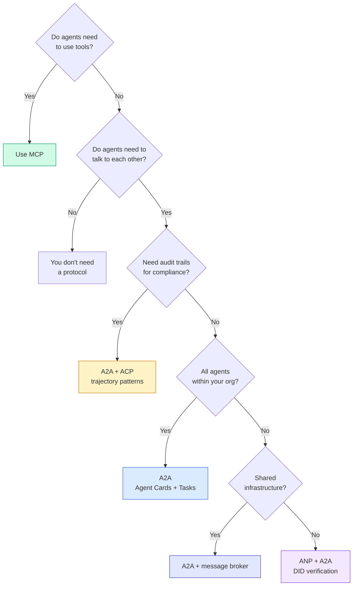

## 运送它.

这一课产生了:
- `code/main.ts`-- 完成四个协议模式的实施
  翻译: 中文`code/main.ts` 所有四种协议模式的完整实现
- `outputs/prompt-protocol-selector.md`-- 提示帮助你选择系统的协议
  翻译: 中文`outputs/prompt-protocol-selector.md` 帮助你为系统选择协议的提示

## 练习题

1. **Multi-hop task delegation.**扩大`TaskManager`调查人员接收一个任务,向两个专业代理"搜索"和"总结"的子任务,等待两者完成,然后将结果合并到自己的文物中.
   翻译: 中文**多跳任务委派。**扩展`TaskManager`让代理处理程序可以转移到其他代理委托任务. 研究员接收任务,将"搜索"和"总结"子任务委托给两个专家代理,等待两者完成,然后合并结果.

2. **Streaming audit trail.**修改`AuditableRunner`为了支持流媒体模式.`AuditEntry`随着轨迹输入的增加,实时更新. 使用一个异步生成器,生成审计快照.
   翻译: 中文**流式审计跟踪。**修改`AuditableRunner`以支持流式模式──不是等待完整的结果,而是在增加轨迹条目时实际产生`AuditEntry`更新──使用产生审计快照的异步生成器──

3. **DID rotation.**添加键旋转到 `IdentityRegistry`代理人应能够发布一个新的DID文件,同时保持更新的密钥.`previousDid`验证者应在宽限期内接受当前和前钥匙的签名.
   翻译: 中文**DID 轮换。**向`IdentityRegistry`添加密钥轮换. 代理应能够发布带有更新密钥的新DID文件,同时维护`previousDid`引用──验证人应在宽限期内接受当前和先前密钥的签名──

4. **Protocol negotiation.**执行ANP的元协议概念.`protocolNegotiation`通过"JSON-RPC"和"REST"的形式,他们可以使用一个模拟形式或时间限制.`TaskManager`或`AuditableRunner`他们使用.
   翻译: 中文**协议协商。**实现ANP的元协议概念.`protocolNegotiation`消息(如"我可以说JSON-RPC"对比"我更喜欢REST") 多 3轮后,它们就在达成一致或超时的形式.

5. **Rate-limited discovery.**添加一个`RateLimitedRegistry`模拟一个响的群体100名代理在启动时发现彼此,并测量差异.
   翻译: 中文**限速发现。**添加一个`RateLimitedRegistry`包装器,使用可配置的TL缓存 代理卡片查找,并限制每秒每一个代理的发现查询.模拟100个代理 启动时互相发现的惊群效果并测量差异.

## 关键词 快速查找表

| Term | What people say | What it actually means |
|------|----------------|----------------------|
| MCP | "The protocol for AI tools" / "AI 工具协议" | A client-server protocol for agents to discover and use tools. Agent-to-tool, not agent-to-agent. / 用于 Agent 发现和使用工具的客户端-服务器协议。Agent 到工具，不是 Agent 到 Agent。 |
| A2A | "Google's agent protocol" / "Google 的 Agent 协议" | A peer-to-peer protocol for agent collaboration under the Linux Foundation. Discovery via Agent Cards, 9-state task lifecycle, streaming via SSE. Supports JSON-RPC, REST, and gRPC bindings. / Linux Foundation 下的 Agent 协作点对点协议。通过 Agent 卡片发现，9 状态任务生命周期，SSE 流。支持 JSON-RPC、REST 和 gRPC 绑定。 |
| ACP | "Enterprise agent messaging" / "企业 Agent 消息" | IBM/BeeAI's REST API for agent runs with TrajectoryMetadata: every response carries the full chain of reasoning and tool calls. Merging into A2A. / IBM/BeeAI 的 Agent 运行 REST API，带轨迹元数据：每个响应携带完整的推理链和工具调用。正在合并到 A2A。 |
| ANP | "Decentralized agent identity" / "去中心化 Agent 身份" | A community protocol using `did:wba` (DID) for cryptographic identity, HPKE for E2EE, and AI-powered meta-protocol negotiation for agents that have never seen each other. / 使用 `did:wba` (DID) 进行加密身份、HPKE 进行端到端加密、AI 驱动的元协议协商的社区协议。 |
| Agent Card / Agent 卡片 | "An agent's business card" / "Agent 的名片" | A JSON document at `/.well-known/agent-card.json` describing skills, supported MIME types, security schemes, and protocol bindings. / 描述技能、支持的 MIME 类型、安全方案和协议绑定的 JSON 文档。 |
| DID | "Decentralized ID" / "去中心化 ID" | W3C standard for cryptographically verifiable identities hosted on the agent's own domain. ANP uses `did:wba` method. / W3C 标准，用于托管在 Agent 自己域上的加密可验证身份。ANP 使用 `did:wba` 方法。 |
| TrajectoryMetadata / 轨迹元数据 | "The audit receipt" / "审计收据" | ACP's mechanism for attaching reasoning steps, tool calls, and their inputs/outputs to every agent response. / ACP 的机制，将推理步骤、工具调用及其输入/输出附加到每个 Agent 响应。 |
| Meta-protocol / 元协议 | "Agents negotiating how to talk" / "Agent 协商如何对话" | ANP's approach where agents use natural language to dynamically agree on data formats, then generate code to handle them. / ANP 的方法，Agent 使用自然语言动态就数据格式达成一致，然后生成代码处理。 |
| Task / 任务 | "A unit of work" / "工作单元" | A2A's stateful object tracking work from submission through completion. Immutable once terminal. / A2A 的有状态对象，跟踪从提交到完成的工作。一旦终态则不可变。 |

## 继续阅读 继续阅读

- [Google A2A specification](https://github.com/google/A2A)--官方规格和SDK (v1.0.0,Linux Foundation)
  中文翻译:谷歌A2A 规范  官方规范和SDK(v1.0.0,Linux基金会)
- [IBM/BeeAI ACP specification](https://github.com/i-am-bee/acp)-- 代理运行和轨迹元数据的OpenAPI 3.1规范
  中文翻译:IBM/BeeAI ACP 规范  代理运行和轨迹元数据的OpenAPI 3.1 规范
- [Agent Network Protocol](https://github.com/agent-network-protocol/AgentNetworkProtocol)--基于DID的身份,E2EE,元协议谈判
  中文翻译:代理网络协议  基于 DID 的身份、端到端加密、元协议协商
- [Model Context Protocol docs](https://modelcontextprotocol.io/)-- 人公司的MCP规范 (包括13期)
  中文翻译:模拟文本协议文档 人类的MCP规范
- [W3C Decentralized Identifiers](https://www.w3.org/TR/did-core/)-- ANP的身份标准
  中文翻译:W3C 去中心化标识符  支 ANP的身份标准
- [RFC 9180 (HPKE)](https://www.rfc-editor.org/rfc/rfc9180)-- ANP用于E2EE的加密方案
  中文翻译:RFC 9180 (HPKE)  ANP 用于端到端加密的加密方案
- [FIPA Agent Communication Language](http://www.fipa.org/specs/fipa00061/SC00061G.html)作为现代代理协议的学术前.
  中文翻译:FIPA代理 通信语言  现代代理 协议的学术前身
