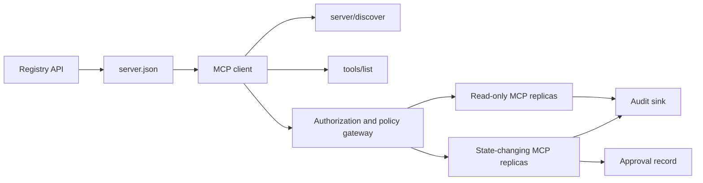

# 无状态MCP服务器:注册中心与管理

> 生产MCP不是一个服务器流程. 它是一个合同链:可发布的元数据,现场发现,无国籍请求包裹,授权,政策,审计和部署证据.

> **【中文解读】**本课是毕业项目:构建可生产的MCP服务器――难点不是将函数注册到框架中,而是保持一个条款的"契约链"可发布的注册中心元数据、实时发现、无状态请求信封、授权、策略、审计与部署证据,环环相扣──MCP`2026-07-28`删除初始化 握手与协议会话,任何副本都必须独立处理任何请求,这让"管理"从部署配置上升到协议本身的约束.

> **【拓展：MCP 生产生态】**2026年MCP已是AI工具调用的事实标准:人类化,OpenAI、Google与主流IDE均内置MCP客户端,官方登记库使用版本化的服务器发布和发现.本课将第13期的四个深潜课程 (工具契约,可靠性,注册中心供应链,一致性运维) 集成成成一个端到端的交付,是整个课程管理维度的顶点.

>  **【前置】**学本课前先完成第11阶段 (LLM 工程) ‧第13阶段 (工具与MCP,特别是第28-31课) ‧第14阶段 (代理人) ‧第17阶段 (基础设施) ‧第18阶段 (安全) ・本课不引入新知识,只检查你能否把已学过的契约组装成一个经过安全审查的系统──

**Type:** Capstone | **类型:** 结业项目
**Languages:** Python and TypeScript reference models; any production language | **语言:** Python 与 TypeScript 参考模型；任意生产语言
**Prerequisites:** Phase 11, Phase 13, Phase 14, Phase 17, and Phase 18 | **前置知识:** Phase 11、Phase 13、Phase 14、Phase 17、Phase 18
**Required MCP deep dives:** [Lesson 28: Tool Contracts](../../../13-tools-and-protocols/28-mcp-tool-contracts-and-content/docs/en.md)现在[Lesson 29: Reliability](../../../13-tools-and-protocols/29-mcp-reliability-cancellation-and-flow-control/docs/en.md)现在[Lesson 30: Registry Supply Chain](../../../13-tools-and-protocols/30-mcp-registry-supply-chain-and-drift/docs/en.md)其他[Lesson 31: Conformance Operations](../../../13-tools-and-protocols/31-mcp-conformance-versioning-and-operations/docs/en.md)现在,我在做什么?**必读 MCP 深潜课:**第28课 工具契约 第29课 可靠性 第30课 注册中心供应链 第31课 一致性运维
**Protocol target:**股`2026-07-28`现在,我在做什么?**协议目标:**股`2026-07-28`
**Time:** ~25 hours | **时间:** 约 25 小时

## 学习目标

- 执行无国籍MCP请求和结果包.
  中文翻译:实现无状态的MCP 请求与结果信封。
- 保持注册表的元数据与现场协议发现分开.
  中文翻译:把注册中心元数据与实时协议发现分开维护──
- 建立一个确定性,缓存意识的工具发现.
  中文翻译:构建确定性的、可缓存的工具发现──
- 执行发行商,受众,范围和批准政策,
  中文翻译:对每种工具调用强制性校验签发者、受众、权限范围和审批策略──
- 部署流式HTTP,没有会议亲密性.
  中文翻译:部署不带会话粘性流式HTTP──
- 证明在线,授权,政策,注册和审计边界的行为.
  中文翻译:在线格式"",授权"",策略"",注册中心与审计五边界上验证行为――

## 需要MCP 需要MCP 必须MCP 必须MCP 必须MCP 必须MCP 必须MCP 必须MCP 必须MCP

> **【中文解读】**本节把四节 第十三期 深潜课定义为毕业项目"输入契约": 第28节 课给工具/内容/分页/错误契约, 第29节 课给取消竞竞态、截止日期、等与重连语义, 第30节 课给命名空间、准入、漂移与回滚证据, 第31节 课给给金样本/负样本与发布门控.毕业项目是集成这些产品,而不是用一个快乐的路径的SDK测试取代它们.

在处理这个结石为生产准备的之前,完成四个连接的13期课程:

1. [Lesson 28](../../../13-tools-and-protocols/28-mcp-tool-contracts-and-content/docs/en.md)定义该服务器必须暴露的工具,方案,内容,页面化,完成,路由和错误合约.
2. [Lesson 29](../../../13-tools-and-protocols/29-mcp-reliability-cancellation-and-flow-control/docs/en.md)定义取消竞赛,截止日期,无力,压力,重新尝试和重新联系行为.
3. [Lesson 30](../../../13-tools-and-protocols/30-mcp-registry-supply-chain-and-drift/docs/en.md)定义名称空间,来源,录取针,注册表状态,漂移,本书和反弹证据.
4. [Lesson 31](../../../13-tools-and-protocols/31-mcp-conformance-versioning-and-operations/docs/en.md)定义黄金和负面的转录,严格的版本时代,SDK差异检查,代理证明,编辑,健康和发布门.

终点石将这些文物集成在一起,它不会用一个快乐路的SDK测试取代它们.

## 问题 问题引入

> **【中文解读】**难点不是注册一个函数,而是在让"六个真相"保持齐齐:server.json 说服务器在哪里,服务器/发现说进程现在支持什么,每个请求自带协议版本与客户端能力,授权调用者绑定到正确的发发件者/资源/权限范围,策略决定这个具体行动是否能执行,审计在不泄露的前提下记录跨界内容.

内部平台需要只读数据工具和一个小组变态工具.开发人员必须能够发现服务器,了解如何连接,检查其现场功能,并只调用他们授权使用的操作.

> 一个内部平台只需要阅读数据工具和一个小批量状态工具――开发者必须能够发现服务器,弄清楚如何连接,检查其实时能力,并且只能调用自己授权的操作――

难的是不注册函数,难的是保持六个不同的真理一致:

1. `server.json`显示服务器可以安装或访问的地方.
2. `server/discover`现在的现场流程支持的.
3. 每个请求都显示了它使用的协议修改和客户端功能.
4. 授权将调用者与正确的发行者,资源和范围联系在一起.
5. 政策决定该具体行动是否可实施.
6. 审计证据记录了什么跨越了边界,没有泄露秘密或敏感的有效载荷.

> 六个真相依次是:`server.json`说服务器在哪安装或连接;`server/discover`通过" 程序现在支持什么;每个请求声明自己使用协议修订和客户端能力;授权调用者绑定到正确的发行者,资源和权限范围;策略决定该具体行动是否可执行;审计在不泄露秘密或敏感负载的前提下记录跨境内容.

如果其中任何一个漂移,平台可能列出无法访问的服务器,路由一个不兼容的客户端,接受为另一种资源发明的代币,或在未经预期审查的情况下暴露破坏性行动.

> 任何一个移动,平台就可能列出一个根本不连接的服务器,将不兼容的客户端路由进入,接受一个发送令牌的资源,或在无人审查的情况下暴露破坏性操作.

## 两个发现层的发现机制.

> **【中文解读】**注册中心和实时服务器回答了两个不同的问题:`server.json`+ 注册表API 回答"该服务器是什么、包或远端点在哪、如何配置";`server/discover`回答"这个进程目前支持哪些协议版本"",能力"",扩展与身份"――两层各有不同的方案:注册表方案 版本与MCP 协议修订号彼此独立,别把两个日期改成一样――方案 合法也不等于命名空间所有权只有通过`example.com`域名验证的发行人才能使用`com.example/*`命名空间.

现场MCP服务器和登记处回答不同的问题.

| Layer | Contract | Question it answers |
|---|---|---|
| Publication | `server.json` and Registry API | What is this server, where is its package or remote endpoint, and how is it configured? |
| Runtime | `server/discover` | Which protocol versions, capabilities, extensions, and server identity does this process support? |

官方登记处使用了已改编的版本`server.json`远程输入可以命名一个流式HTTPURL:

```json
{
  "$schema": "https://static.modelcontextprotocol.io/schemas/2025-12-11/server.schema.json",
  "name": "com.example/internal-readonly",
  "title": "Internal Read-Only Tools",
  "description": "Read-only incident and data lookup tools.",
  "version": "1.0.0",
  "remotes": [
    {
      "type": "streamable-http",
      "url": "https://mcp.internal.example.com/readonly"
    }
  ]
}
```

登记器方案版本和MCP协议修订是独立的.不要重写一个日期以匹配另一个日期.根据自己的合同验证每个文件.

> 报名方案与MCP协议修订号相互独立――不要把一个日期改写成另一个;每个文件都必须用自己的契约来进行校验――

项目有效性不证明名称空间的所有权.`example.com`使用反向DNS名称空间`com.example/*`登记器身份验证流证明了所有权. 保持域名标签在他们的普通顺序命名一个不同的名称空间.

> 通过 标签: 标签: 标签: 标签: 标签:`example.com`验证的发行者使用反向 DNS 命名空间 `com.example/*`或其子命名空间;注册表 认证流程负责证明这个层所有权.

们的模型`validate_registry_document`功能是故意部分远程配置文件验证器.`name`现在`description`其他`version`选项 `title`; 已发布的名称和长度限制;具体版本形状;`streamable-http`或`sse`远程的HTTP(S) URL形状.它还需要一个不空的`remotes`因为这块石头总是活着探测遥控器.`validate_publisher_namespace`单独检查名称与经验证的出版商域名,而`validate_runtime_alignment`与现场版本相比`serverInfo`官方方案还支持仅为包装记录和更多远程领域. 在发布之前,使用附加的官方JSON方案验证整个文档或`mcp-publisher`;不要将这种无依赖子集作为完整的方案验证.

> 标准库参考模型里`validate_registry_document`刻意只做"远程资料"的部分校验:官方必填的`name`现在,我们要去.`description`现在,我们要去.`version`可选`title`、命名与长度约束、具体版本号形状、每个`streamable-http`或`sse`远程的HTTP(S) URL 形状,并因本课总是实测远程端点而额外要求非空`remotes`,我知道.`validate_publisher_namespace`另行把名字对照已验证的发行者域名,`validate_runtime_alignment`则把发布名字与版本和实时`serverInfo`对于. 官方发布前,请使用钉住的官方JSON方案或`mcp-publisher`校验完整文档,不要把这个零依赖集集作为完整的方案校验.

服务器必须实现`server/discover`客户端可以在其他方法之前调用它.这个终端客户端在解决终端点后这样做,并获得当前协议修改和现场功能:

```json
{
  "resultType": "complete",
  "supportedVersions": ["2026-07-28"],
  "capabilities": {
    "tools": {
      "listChanged": false
    }
  },
  "_meta": {
    "io.modelcontextprotocol/serverInfo": {
      "name": "com.example/internal-readonly",
      "version": "1.0.0"
    }
  },
  "ttlMs": 3600000,
  "cacheScope": "public"
}
```

个人目录可能会索引额外的所有权,审查或生命周期数据,但不能作为MCP线程字段或根发明这些数据.`server.json`保存组织政策在出版记录旁边.当需要公开的定制元数据时,请使用登记处的`_meta.io.modelcontextprotocol.registry/publisher-provided`延长时间,并保持在4 KB的限制范围内.

> 个人目录可以索引额外的所有权,评审或生命周期数据,但不得把这些数据伪造成MCP线形字段或服务器.`_meta.io.modelcontextprotocol.registry/publisher-provided`扩展并遵守4 KB 上限

## 无国无国 MCP核心

> **【中文解读】**股`2026-07-28`移除协议会话与`initialize`现在,`notifications/initialized`握手,也移除了`Mcp-Session-Id`△协议上下文由每个请求改`params._meta`携带版本与能力是"请求事实"而不是"连接事实",负载均衡器可以将相邻请求发送给不同的副本.`resultType: "complete"`没有在`_meta`里放服务器身份;版本缺失或非字符串是`-32602`只有"给字符串但不支持"才使用`-32022`且数据必须恰好`{"supported": [...], "requested": "..."}`,我知道.

经过MCP修订`2026-07-28`删除协议会议和`initialize`现在,`notifications/initialized`握手,也可以消除`Mcp-Session-Id`现在,我们要去.

>  修订版`2026-07-28`移除协议会话与`initialize`现在,`notifications/initialized`握手,也移除了`Mcp-Session-Id`,我知道.

每个请求都包含协议文本.`params._meta`其他:

```json
{
  "io.modelcontextprotocol/protocolVersion": "2026-07-28",
  "io.modelcontextprotocol/clientCapabilities": {},
  "io.modelcontextprotocol/clientInfo": {
    "name": "internal-platform-client",
    "version": "1.0.0"
  }
}
```

版本和功能是请求事实,而不是连接事实.负载平衡器可以向不同的健康复制器发送连续请求,因为任何复制器都能通过消息本身验证请求.

> 版本与能力是请求事实,不是连接事实.负载平衡器可以将相邻请求发送给不同的健康副本,因为任一副本都能从消息本身完成校验.

通常的结果包括`resultType: "complete"`服务器应将其身份放入`_meta.io.modelcontextprotocol/serverInfo`错失或不符串协议版本是无效的参数`-32602`错误`-32022`只有一个不支持的供应字符串,`{"supported": ["2026-07-28"], "requested": "..."}`作为其数据.

### 隐藏的发现

> **【中文解读】** `tools/list`必须返回确定性结果:稳定的工具顺序让相同列表能复用提示缓存;`ttlMs`是给客户端的新鲜感提示;`cacheScope`根据用户授权的工具可见性通常应产生`private`绝对不要把用户专属的工具放入共享公共缓存中.

`tools/list`结果包括:

- `ttlMs`对于客户来说,
- `cacheScope`任何一个`public`或`private`其他
- 一个稳定的工具顺序,使相同的列表能够重复使用即时缓存;
- `resultType: "complete"`服务器身份元数据.

用户的授权通常应产生`cacheScope: "private"`勿将用户特定工具可见性置于共享的公共缓存后面.

## 流通的HTTP

> **【中文解读】**流式HTTP只会暴露一个接受 POST 的 MCP端点,每个 JSON-RPC 请求或通知每个占一个 POST. 请求的响应要么是单个 JSON 对象,要么是仅限于该请求的 SSE 流;长活的`subscriptions/listen`承载选入的变更通知──当前传输没有独立 GET流、会话 DELETE、会话头或`Last-Event-ID`每个请求都需要带镜像头`MCP-Protocol-Version`,我知道.`Mcp-Method`,我知道.`Mcp-Name`),不匹配就按`-32020`拒绝这住"头说A"",身体说B"的走私.

网络服务器将一个接受 POST 的 MCP 终端点暴露出来.每个 JSON-RPC 请求或通知都会获得自己的 POST.

服务器返回一个JSON对象或一个针对该请求的SSE流.`subscriptions/listen`没有独立的GET流,会议 DELETE,会议标题,或`Last-Event-ID`在当前运输中重播.

> 对于一个请求,服务器要么返回单个JSON对象,要么返回仅限于该请求的SSE流――长活的`subscriptions/listen`请承载选入的变更通知. 当前传输中没有独立的GET流,会话 DELETE、会话头,也没有`Last-Event-ID`放下

每个请求包括:

- `MCP-Protocol-Version`,与体内的元数据相匹配;
- `Mcp-Method`,与JSON-RPC方法相匹配;
- `Mcp-Name`为了`tools/call`现在`resources/read`其他`prompts/get`其他
- `Accept: application/json, text/event-stream`现在,我们要去.

拒绝与指定的反射标题不匹配`-32020`错误.验证`Origin`通过网络网络,将本地开发服务器绑定到循环回放,验证远程客户端,并将封闭请求范围的SSE响应视为取消.

> 根据规则,对不匹配的镜头部`-32020`错误拒绝.`Origin`要求级 SSE 响应关闭即视为取消──



```figure
cf-mcp-gate
```

## 授权和策略

> **【中文解读】**传输层元数据不是授权每次调用都必须重新校验──远程服务器的授权链路有八步:发现受保护资源元数据 → 选择该资源的授权服务器 → 优先使用客户端ID元数据文件注册客户端(动态注册只做兼容)→ 授权时发送资源指标 → 校验返回的`iss`客户端凭据按发发放者隔离、绝不跨发发放者重复使用 → 在MCP服务器上验证牌的发发放者/受众/过期/权限范围 → 对具体工具和参数重叠一次策略决策──`readOnlyHint`,我知道.`destructiveHint`其他工具注解只帮助客户端呈现风险,而不是可信的授权控制.

运输元数据不是授权.

对于远程服务器:

1. 发现保护资源的元数据.
2. 选择该资源的授权服务器.
3. 优先使用客户端登记的客户端ID元数据文件. 作为兼容支持,请将动态客户端登记视为兼容性支持.
4. 在授权期间发送资源指标.
5. 验证返回的数据`iss`对于流量记录的权限服务器的值.
6. 发行人对客户的关键认证. 永远不要再使用发行人之间的注册数据.
7. 验证MCP服务器的代币发行者,受众或资源,过期期和范围.
8. 应用第二个政策决定到具体的工具和论点.

工具注释如`readOnlyHint`其他`destructiveHint`帮助客户提出风险.

> `readOnlyHint`,我知道.`destructiveHint`这类工具可以帮助客户端呈现风险,但它们不是可信的授权控制.

### 批准是记录,而不是魔法范围

> **【中文解读】**破坏性调用需要是一个审批记录,不是塞进访问令牌的魔术范围.记录绑定行动者,工具,规范参数 (或其摘要) 目标环境,过期时间和一次性/可复用策略.

变化状态的电话需要与演员,工具,正常化论证或消化,目标环境,过期和一次性或重复使用政策相关的批准记录.单独的聊天消息并不是批准证明.

> 一次变化状态调用需要一个审批记录,绑定到行动者,工具,规范参数或其摘要,目标环境,过期时间以及一次性或可重复的策略.

字符串模型将可行的JSON与排序密钥进行哈希,然后将其与代币主体,工具名称,服务器URL和过期联系起来.改变即使是一个参数后重播记录在处理器运行之前失败.批准是单独的证据,而不是添加到访问代币的范围.

> 字符串引用模型对按键排序规范化 JSON做哈希,再把摘要与令牌主题,工具名,服务器URL过期时间绑定.

保持高危工具在可单独检查的表面上,如果这显著减少爆炸半径.分离只有在凭证,政策,部署身份和审计控制也分开时才有用.

> 只有当分离确实能够实质缩小爆炸半径时,才将高风险工具放到单独可审查的界面上;分离只在证据,策略,部署身份和审计控制中,也只有当各自独立时才有用.

## 动手构建

> **【中文解读】**十步对应十个契约面:发布元数据(方案 合法的服务器.json)→ 实时发现(服务器/发现 先于任何功能 RPC)→ 无状态信封(每次请求带版本和能力,结果带结果Type与身份)→ 工具面(两个只读+一个变化状态,边界清晰的 JSON 方案、确定性结果形状、诚实的注释)→ 可缓存列表稳定序列 + ttlMs + cacheScope)→ 授权与策略(发行者/观众/期权/限范围 + 每次调用策略 + 绑定具体操作审批)→ 注册与行时测试分离静态记录决策二次 实验 + 漂移报告) 审核证据或检测器 检查后续运行 实时测器 实时测器 实时测器 实时测器 实时测器 实时测器 实时测器 实时测器 实时测器 实时测器 实时测器 实时测器 实时测器 实时测器 实时测器 实时测器 实时测器 实时测器 实时测器 实时测器 实时测器 实时测器 实时测器 实时测器 实时测器 实时测器 实时测器 实时测器 实时测器 实时测器 实时测器 实时测器 实时测器 实时测器 实时测器 实时测器 实时测器 实时测器 实时测器 实时测器 实时测器 实时测器 实时测器 实时测器 实时测器 实时测器 实时测器 实时测器 实时测器 实时测器 实时测器 实时测器 实时测器

### 1. 发布模型的元数据

创建和验证方案`server.json`包含一个稳定名称在出版商认证的名称空间中,加上版本,描述,官方`repository`或`packages`隐私作为环境变量输入,永远不会是字面值.

### 2. 实现现场发现

实施`server/discover`在任何功能 RPC 之前. 广告支持的协议版本,功能,扩展和服务器身份. 添加版本拒绝案例使用 `-32022`现在,我们要去.

### 3. 实施无国籍封筒

要求每个请求中需要协议版本和客户端功能. 返回 `resultType`删除初始状态,连接扩展能力缓存和会议标识符.

### 4. 构建工具表面

开始使用两种只读的工具和一个变状态工具.给每个工具一个有限的JSON方案,准确的描述,确定性结果形状和诚实的注释.当客户依赖结构化结果时,添加输出方案.

### 5. 添加缓存意识列表

稳定顺序的返回工具`ttlMs`其他`cacheScope`单独执行缓存过期和改变列表通知行为.

### 6. 添加授权和政策

验证发行商,受众,过期和范围. 执行每个工具调用政策决定. 绑定批准到高风险的具体行动. 在执行处理器之前拒绝缺失或过时批准.

### 7. 单独的登记和运行时间验证

验证静态`server.json`记录,然后用远程终点探测`server/discover`报告漂移,当发布的远程,身份,版本或所需功能与现场进程不一致时.

### 8. 添加审计证据

记录参与者,发行者,资源,工具,政策决定,请求识别器,追踪背景,延迟和结果. 在持续之前编写或消化敏感的论点和结果. 保持审计槽在模型可见的背景之外.

### 9. 向度练习

设置两个无状态复制品在负载平衡器后面. 发送至少100个同时请求. 证明正确性不取决于亲密性. 如果工具需要交叉调用状态, 打造一个明确的不透明的手柄, 并存储在共享的耐用系统.

### 10. 穿过真正的线

运行与实际服务器二进制进行合规性检查.捕获请求标题和JSON体,不仅是SDK对象. 练习错误版本,标题不匹配,缺失范围,错误的观众,错误的参数,处理器故障,取消和缓存过期.

## 需要证据包,需要证据包.

提交的文件是不完整的,直到包含所有五类证据:

| Evidence | Minimum proof | Source lesson |
|---|---|---|
| Wire | Redacted raw headers and JSON-RPC bodies for golden and negative cases, including metadata type failure, header mismatch, unsupported version, missing or unknown `resultType`, notification no-response, and response ID matching | [Lesson 31](../../../13-tools-and-protocols/31-mcp-conformance-versioning-and-operations/docs/en.md) |
| Proxy | The same stable case run directly and through the deployed intermediary, with ingress, origin, and egress status and body digests; prove protocol errors are not collapsed into generic 500 responses and streaming is not buffered | [Lessons 29](../../../13-tools-and-protocols/29-mcp-reliability-cancellation-and-flow-control/docs/en.md) and [31](../../../13-tools-and-protocols/31-mcp-conformance-versioning-and-operations/docs/en.md) |
| Admission | Verified publisher namespace, immutable Registry record digest, artifact or remote provenance, live `server/discover` identity and capability observation, descriptor pin, current Registry status, and admission-ledger event | [Lesson 30](../../../13-tools-and-protocols/30-mcp-registry-supply-chain-and-drift/docs/en.md) |
| Retry | A cancellation-versus-completion race, explicit timeout, safe read retry, mutation idempotency key, reconnect refetch, and proof that request cancellation cannot silently become durable task cancellation | [Lesson 29](../../../13-tools-and-protocols/29-mcp-reliability-cancellation-and-flow-control/docs/en.md) |
| Rollback | Exact previous version, admission and artifact digests, descriptor pin, active Registry status, current health window, route restoration result, and redacted decision evidence | [Lessons 30](../../../13-tools-and-protocols/30-mcp-registry-supply-chain-and-drift/docs/en.md) and [31](../../../13-tools-and-protocols/31-mcp-conformance-versioning-and-operations/docs/en.md) |

随着发布保存编辑包的摘要.如果任何类都没有发布,请保留发布.不要从进程中发送器推断代理行为,从注册表存在的录取,从新的JSON-RPCID中重新尝试安全性,或者从前部署中重新回放准备性.

> 随着发布,随着发布的存档;任何类型的缺失就在发布中置.不要使用进程中的调度器推断代理行为"",现存的登录里"推断准入"",使用新的JSON-RPC id 推断重试安全"",或使用"上一次部署还在"推断回滚就绪".

## 地方参考模型

 Python 模型展示了注册表的元数据,反向DNS发布者名称空间验证,发布到运行时间的身份检查,现场发现,确定性工具列表,每请求的元数据,可信赖发行者,观众,过期和范围检查,行动相关的批准,无需打开网络插座的记录部分注册表验证器,政策和审计:

>  Python 参考模型在不开网套接字的前提下演示:注册中心元数据"",反向 DNS 发行者命名空间校验"",发布到运行时的身份验证"",实时发现"",确定性工具列表"",每请求元数据"",可信发行者/受众/过期/权限范围校验"",绑定动作审批"",文件化部分登记器校验器"",策略和审计:

```bash
cd phases/19-capstone-projects/13-mcp-server-with-registry
python3 code/main.py
python3 -m unittest discover -s code/tests -v
```

通过无MCP SDK,该项目将无状态的JSON-RPC形状暴露在工作室上.`tools/call`路径执行了广告的相同的限制输入方案`tools/list`已知工具的无效参数返回一个完整的结果`isError: true`没有召唤执行人:

> 项目不依赖MCP SDK,在工作室上暴露无状态 JSON-RPC 形状――它的`tools/call`路径强制执行`tools/list`广告的相同的输入方案;对已知工具的非法参数将回归带`isError: true`没有调用执行器:

```bash
cd phases/19-capstone-projects/13-mcp-server-with-registry/code/ts
npm install
npm run typecheck
npm test
npm run demo
```

这些模型证明了本地合同逻辑.它们不证明HTTP标题,OAuth交换,注册表出版,OPA集成,负载平衡或收藏收件.

> 这些模型证明是本地契约逻辑,不证明HTTP头,OAuth 交换,注册表发布,OPA集成,负载均衡或收藏器接收.

## 线形图案

```http
POST /mcp HTTP/1.1
Host: mcp.internal.example.com
Content-Type: application/json
Accept: application/json, text/event-stream
MCP-Protocol-Version: 2026-07-28
Mcp-Method: tools/call
Mcp-Name: postgres.readonly
Authorization: Bearer REDACTED

{
  "jsonrpc": "2.0",
  "id": 42,
  "method": "tools/call",
  "params": {
    "name": "postgres.readonly",
    "arguments": {"sql": "SELECT 1"},
    "_meta": {
      "io.modelcontextprotocol/protocolVersion": "2026-07-28",
      "io.modelcontextprotocol/clientCapabilities": {},
      "io.modelcontextprotocol/clientInfo": {
        "name": "internal-platform-client",
        "version": "1.0.0"
      }
    }
  }
}
```

> 注意镜头和身体`params._meta`的一致性:`MCP-Protocol-Version`必须匹配数据中的版本,`Mcp-Name`必须匹配`params.name`否则按`-32020`拒绝并不进入策略与工具执行.

## 发射上线

运输包含以下内容的存储库:

- 一个有效的方案`server.json`其他
- 仅可读和变状态服务器表面;
- `server/discover`确定性`tools/list`政策目标`tools/call`其他
- 具有两个可替换的复制符号的流式HTTP部署;
- 授权和批准集成;
- 一个注册表出版商或私人注册表 API 适配器;
- 政策定义和行动相关的批准记录;
- 编辑审计输出和踪迹传播;
- 电线和代理故障证据;
- 检查,检查,健康和反弹证据,包括已删除的包装.

| Weight | Criterion | Evidence |
|---:|---|---|
| 25 | Protocol correctness | Stateless request metadata, discovery, results, headers, and negative cases |
| 20 | Authorization | Issuer, audience, expiry, scope, and action-bound approval cases |
| 15 | Registry integrity | Valid `server.json`, publication record, live discovery probe, and drift report |
| 15 | Policy and safety | Allow, deny, malformed, stale approval, and sensitive-data cases |
| 15 | Scale and reliability | Two replicas, no affinity dependency, cancellation, timeout, and recovery |
| 10 | Auditability | Redacted receiver-side audit and trace evidence |

## 练习题

1. 让登录验证报告确切的漂移.
2. 发送`tools/list`并且证明字节稳定的工具顺序.`ttlMs`让我们放心.
3. 送一个有效的身体与另一个`MCP-Protocol-Version`标题,回来`-32020`没有使用政策或工具.
4. 证明观众验证在处理器运行之前失败.
5. 绑定一个批准与一个正常化参数消化. 改变一个字段,证明不能重复批准.
6. 连续调用交换复制器. 任何工作流程需要持续的位置,都用明确共享的手柄取代隐藏的进程内存.
7. 打断请求范围的SSE连接,再尝试使用新的JSON-RPC请求ID.`Last-Event-ID`使用恢复路径.

## 关键词 关键词

| Term | What people say | What it actually means |
|---|---|---|
| Stateless MCP | "No state anywhere" | No protocol session; cross-call state is explicit and server-managed |
| `server.json` | "The tool manifest" | Registry metadata for naming, packaging, configuration, and transports |
| `server/discover` | "The handshake" | A normal mandatory RPC for live versions and capabilities, not a session initializer |
| Cache scope | "Can I cache it?" | Whether a cacheable result is safe for shared or private reuse |
| Policy decision | "The token allows it" | A separate decision over actor, tool, target, arguments, and context |
| Approval record | "A human clicked yes" | Evidence bound to one actor and consequential action under an expiry policy |
| Explicit handle | "A session ID" | Ordinary application data for named server-managed state, not protocol connection state |

## 继续阅读 继续阅读

- [MCP 2026-07-28 key changes](https://modelcontextprotocol.io/specification/2026-07-28/changelog)
- [Streamable HTTP](https://modelcontextprotocol.io/specification/2026-07-28/basic/transports/streamable-http)
- [Server discovery](https://modelcontextprotocol.io/specification/2026-07-28/server/discover)
- [MCP authorization](https://modelcontextprotocol.io/specification/2026-07-28/basic/authorization)
- [Official Registry server.json requirements](https://github.com/modelcontextprotocol/registry/blob/main/docs/reference/server-json/official-registry-requirements.md)
- [Official Registry OpenAPI contract](https://registry.modelcontextprotocol.io/openapi.yaml)
