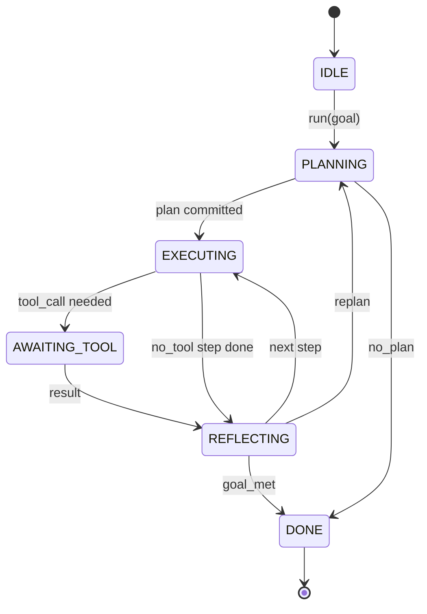

# 警方说,我们要做什么?

> 导弹是代理,模型是共处理器,这个课程结了任何模型的循环合约.

> **【中文解读】**本节是综合项目 构建代理线束循环和契约验证系统.


**Type:** Build | **类型:** Build
**Languages:** Python | **语言:** Python
**Prerequisites:** Phase 13 lessons 01-07, Phase 14 lesson 01 | **前置知识:** Phase 13 lessons 01-07, Phase 14 lesson 01
**Time:** ~90 minutes | **时间:** ~90 minutes

>  **【前置】**综合阶段 13·01-07 +阶段 14·01──
>  **【类比】**运行: 运行: 运行: 运行: 运行: 运行: 运行: 运行: 运行: 运行: 运行: 运行: 运行: 运行: 运行: 运行: 运行: 运行: 运行: 运行: 运行: 运行: 运行: 运行: 运行: 运行: 运行: 运行: 运行: 运行: 运行: 运行: 运行: 运行: 运行: 运行: 运行: 运行: 运行: 运行: 运行: 运行: 运行: 运行: 运行: 运行: 运行: 运行: 运行: 运行: 运行: 运行: 运行: 运行: 运行: 运行: 运行: 运行: 运行: 运行: 运行: 运行: 运行: 运行: 运行: 运行: 运行: 运行: 运行: 运行: 运行: 运行: 运行: 运行: 运行: 运行: 运行: 运行: 运行: 运行: 运行: 运行: 运行: 运行: 运行: 运行: 运行: 运行: 运行: 运行: 运行: 运行: 运行: 运行: 运行: 运行: 运行: 运行: 运行: 运行: 运行: 运行: 运行: 运行: 运行: 运行: 运行: 运行: 运行: 运行: 运行: 运行: 运行: 运行: 运行:运行:运行:运行:运行:运行:运行:运行:运行:运行:运行:运行:运行:运行:运行:运行:运行:运行

## 学习目标
- 指定一个代理圈作为一个明确过渡的确定状态机.
  中文翻译:指定一个代理利用循环作为一个明确的过渡的确定性状态机器.
- 运营商将电线政策,远程测量和防护线路纳入的10个生命周期曲主题.
  中文翻译:实施运营商将电线政策,远程测量和防护线的10个生命周期鱼主题.
- 定义两个拉点,循环将控制权返回调用者,并在新输入中恢复.
  中文翻译:定义两个拉点,循环将控制回归给调用者,并在新输入中恢复.
- 执行每次会议预算 (转换,工具调用,墙钟) 并且不过度时会泄露部分状态.
  中文翻译:执行每次会议预算 (转换,工具调用,墙钟) 没有过度时泄露部分状态.
- 发出11种事件类型的输入流,以便下游UI和跟踪器可以订阅,而不直接检查循环.
  中文翻译:发出11种事件类型的输入流,以便下游UI和跟踪器可以直接检查循环,而不会订阅.

```figure
cf-loop-contract
```

## 框架

> **【中文解读】**核心观点:运行40轮编码代理 不是聊天循环,而是状态机操作员可以拦截节点、审计边缘. 一旦写定契约,替代模型/工具/策略不再是重构,而是注册调用. 本课定义了6个状态,10个子主题,2个拉取点,11个事件类型和一个预算信封.这是 Agent Harness的架构,其余所有组件工具注册,传输,调度器都插入了这个形状.

> **【拓展：Agent Harness 状态机设计】**主流编码 代理(Claude Code、Cursor、Devin) 都采用类似状态机架构──6个状态通常包括:IDLE(等待输入)、PLANNING(规划)、执行(执行工具)、AWAITING_TOOL(等待工具返回)、OBSERVING(观察结果)、TERMINAL(终止)──10个 主题覆盖完整生命周期:SessionStart/End、Pre/PostToolUse、UserPromptSubmit、Notification、Stop、PreCompact、等预算信封限制每话的轮次/工具调用/运行时间──

编码代理四十轮无监督运行,不是聊天循环.它是一个状态机,操作员可以拦截节点,操作员可以审计边缘.一旦你写下合同,交换模型,工具或政策不再是重构者.它变成了注册电话.

> 一个无监督四十轮运行的编码代理不是聊天循环.它是一个状态机,操作员可以拦截其节点,操作员可以审计其边缘.一旦你写下合同,交换模型,工具或政策不再是重构者.它成为一个注册呼叫.


这一课构建了合同.我们命名了六个州,十个子主题,两个拉点,十一个事件类型,一个预算包裹. 工具登记器,JSON-RPC运输,发送器,规划器) 其他所有东西都插入了这个形状.

> 本课构建该契约.


## 美国

循环有6个状态,5个状态是活跃的,一个状态是终端的.



`IDLE`只有一个合法入口点.`DONE`只有法律办法.`AWAITING_TOOL`只有一个引力点,其他转变都是内部的.

> `IDLE`是唯一的合法入口点.


状态机是确定性的. 给出相同的事件日志,带重返相同的状态. 这种属性是允许你重播调试,而不需要重新调用模型.

> 状态机是确定性的. 给定相同事件日志,框架重新进入相同的状态.


## 子的主题

子是操作员的连接. 连接器开火十个主题. 每个主题都接受任何数量的订阅者.订阅者按注册顺序开火.订阅者可以改变有效载荷,升级取消转换,或返回哨兵跳过下一步.

> 是操作者接入循环的接口.


```text
before_plan         after_plan
before_tool_call    after_tool_call
before_step         after_step
on_error
on_pause
on_budget_exceeded
on_complete
```

模板反映了2025年中旬的克劳德代码,库尔索和开源代码的融合.这些名称是功能性的,而不是标志性的.`rm -rf`住在`before_tool_call`子可以运送开放电气跨度.`after_step`一个恢复停顿的子生活在`on_pause`现在,我们要去.

> 这种形态反映了2025年中期的克劳德代码,课程和开放代码共识.


## 引力点

循环给出了两次控制.`AWAITING_TOOL`没有工具的结果,它无法取得进展.`on_pause`预算耗尽,或者一个子明确要求人力审查.

> 循环两次让出控制权.


拉动点不是例外,而是回报. 呼叫者检查了带状况,拿出了带要求的东西,然后打电话.`resume(payload)`带从停留的地方恢复. 这与Python发电机相同的形状. 运输在拉点是你的选择. 在TUI中,它是键盘. 在MCP上,它是`tools/call`在排队里,这是一个工作调查.

> 拉取点不是异常,而是回来.


## 事件流程

循环将事件添加到合同中特定点的输入流中.该流只添加,用户可以从任何偏移中重播.实施的十一种事件类型是:

> 循环在合约的特定点将事件增加到类型化流中.


- `session.start`发射一次,当`run(goal)`称为
  翻译: 中文`session.start`发射一次,当`run(goal)`称为
- `plan.draft` 发出计划者返回计划草案时
  翻译: 中文`plan.draft` 发出计划者返回计划草案时
- `plan.commit` 作为活动计划的承诺后发行草案
  翻译: 中文`plan.commit` 作为活动计划的承诺后发行草案
- `step.start`每一步执行的开始发射
  翻译: 中文`step.start`每一步执行的开始发射
- `step.end`每一步执行结束时发放
  翻译: 中文`step.end`每一步执行结束时发放
- `tool.call`在需要工具的步骤给调用者提供控制时发射
  翻译: 中文`tool.call`在需要工具的步骤给调用者提供控制时发射
- `tool.result` 发出简历,并附工具结果
  翻译: 中文`tool.result` 发出简历,并附工具结果
- `tool.error`在简历上发出错误或断电话时
  翻译: 中文`tool.error`在简历上发出错误或断电话时
- `budget.warn`在预算限制达到时发行
  翻译: 中文`budget.warn`在预算限制达到时发行
- `session.pause`当循环在暂停时产生 (预算或)
  翻译: 中文`session.pause`当循环在暂停时产生 (预算或)
- `session.complete`当循环达到时发射一次`DONE`
  翻译: 中文`session.complete`当循环达到时发射一次`DONE`

事件不会重复杆有效载荷.杆是必不可少的 (变化,中断).事件是观测 (记录,船).把它们视为直角.

> 事件不重复子 负载──子 是命令式的(修改、停止),事件是观察性的(记录、发送) 。


## 预算包裹

一个会议包含三个限制.转数,工具调用数,墙钟秒.每轮增长一次.每次工具调用增长一次.墙钟在每次状态过渡时检查.当达到任何限制时,循环启动.`on_budget_exceeded`发射`budget.warn`之后转向`IDLE`在下一个拉动点上,

> 会议带有三个限制:轮次计数,工具调用计数,挂钟秒数.


预算不是杀号开关,而是收益,调用者决定是否延长预算,恢复,还是关闭会议.

> 预算不是终止开关,而是让出.调用者决定是否扩大预算并恢复,或关闭会话.


## 这一课不做什么

它不调用模型,它不注册真正的工具,它不实现运输.这是下一个四个课程.

> 它不调用模型,不注册真实工具,不实现传输.


确定性规划者在`main.py`它们是一个替代程序. 它返回一个硬码的计划,三个步骤,其中两个需要工具结果.

> 确定性规划器是一个替代品. 它返回一个硬编码的三步计划,其中两个步骤需要工具结果.


## 如何读取代码

`HarnessLoop`火,发射活动.`Budget`追踪限制.`Event`的字体是输入的字体.`HookRegistry`现在,我们要把它放在机上.`_transition`状态变化是唯一的函数,所以状态机的变化不变在一个地方.

> `HarnessLoop`是主要课程.


阅读`main.py`读一读.`code/tests/test_loop.py`测试记录了每一个转移和每一个子发射命令.

> 读一读.


## 走得更远

制造一个带的最困难部分不是国家机器.它使合同可执行.合同必须存活于规划器的热重装.它必须存活于一个返回错误的JSON的工具.它必须存活于一个子.`before_tool_call`试验中,这些试验都在执行失败模式,运行它们,打破它们,增加案例.

> 构建框架最难的部分不是状态机,而是使契约可强制执行.


接下来课程将添加工具登记库.之后,JSON-RPC运输.之后,发送器.到第二十四课时,这个文件中的循环将与实际工具进行真正的计划,实际预算被执行.

> 下一课将添加工具注册表

