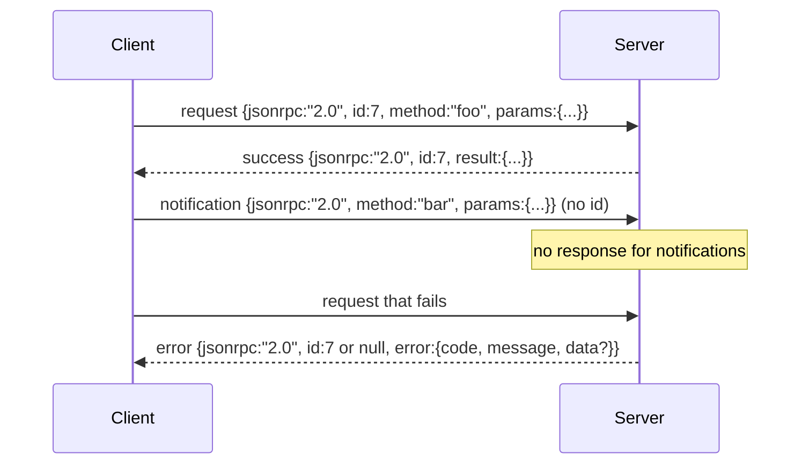

# 通过新线-限度工作室,JSON-RPC 2.0通过新线-德利 (中文翻译待补)

> 模型客户端和工具服务器之间的运输是通过工作室进行JSON-RPC. 一旦手动滚动它,你会学到每个框架层都为什么付费.

> **【中文解读】**本节是综合项目 构建JSONRPC/STDIO传输层.


**Type:** Build | **类型:** Build
**Languages:** Python | **语言:** Python
**Prerequisites:** Phase 13 lessons 01-07, Phase 14 lesson 01 | **前置知识:** Phase 13 lessons 01-07, Phase 14 lesson 01
**Time:** ~90 minutes | **时间:** ~90 minutes

>  前置代理 3/10。参考13·15-18期(MCP 协议套件使用JSON-RPC) 』
>  JSON-RPC over stdio = MCP 标准传输――手写一次让你看懂每个框架层在付什么代价――换行分隔消息(NDJSON),简单可靠,跨进程无网络──

## 学习目标
- 采用JSON-RPC 2.0作为新线程的JSON框架,在 stdin 和 stdout 上.
  中文翻译:用新线程的JSON框架进行JSON-RPC 2.0在 stdin 和 stdout 上.
- 绘制五个标准错误代码 (-32700, -32600, -32601, -32602, -32603) ,并用正确的语义来表现它们.
  中文翻译:将五个标准错误代码 (-32700, -32600, -32601, -32602, -32603) 映射出来,并用正确的语义来表现它们.
- 区分请求,响应,通知和批量,而不发明新的包裹密钥.
  中文翻译:不发明新的封筒密钥,区分请求,响应,通知和批量.
- 处理每行一个解析错误,而不致害其他流.
  中文翻译:每行处理一个解析错误,而不致毒毒其余的流.
- 通过 io.BytesIO 构建一个自杀式演示,
  中文翻译:使用 io.BytesIO构建一个自杀式演示,以便课程在没有产生的孩子过程中运行.

```figure
cf-jsonrpc-frames
```

## 为什么JSON-RPC仍然是语言法语

> **【中文解读】**自2013年以来,JSON-RPC 2.0一直是代理与工具服务器通信的标准协议. 它只有两个页规范,但对称地支持studio、socket、websocket 和 HTTP 传输. 与gRPC、自定义二进制协议不同,JSON-RPC 不在流式/批量处理/传输合之间进行交换.

> **【拓展：JSON-RPC 在 AI Agent 中的应用】**模型语境协议 (MCP) 的传输层直接基于 JSON-RPC 2.0 通过studio──Claude Code 的工具调用──Cursor 的插件通信、VS Code 的语言服务器协议 (LSP) 都采用相同的 JSON-RPC 框架──理解这一层是理解AI 代理工具链基础设施的关键──

2026年,一个编码代理会在一次会议中与12个工具服务器交谈. 每个服务器都是一个独立的进程或远程终端. 电线格式自2013年以来一直是相同的. 两个页面的规格. 它存活着,因为替代方案 (gRPC,每次呼叫的HTTP,定制二进制) 都会施加交易, 通过 stdio,sockets,websocket和HTTP,JSON-RPC是对称的,并且客户端可以驱动一个未见过的服务器,如果两者都尊重规格.

> 一个编码代理在2026年会在一次会议中与12个工具服务器交谈. 每个服务器都是一个独立的进程或远程终端. 电线格式自2013年以来一直是相同的. 两个页面的规格. 它存活着,因为替代方案 (gRPC,每次呼叫的HTTP,定制二进制) 都会施加交易, 通过 stdio,sockets,websocket和HTTP,JSON-RPC是对称的,并且客户端可以驱动一个未见过的服务器,如果两者都尊重规格.


根据本课程的定义,我们可以使用一个字符串,一个字符串,一个字符串,一个字符串,一个字符串,一个字符串,一个字符串,一个字符串,一个字符串,一个字符串,一个字符串,一个字符串,一个字符串,一个字符串,一个字符串,一个字符串,一个字符串,一个字符串,一个字符串,一个字符串,一个字符串,一个字符串,一个字符串,一个字符串,一个字符串,一个字符串,一个字符串,一个字符串,一个字符串,一个字符串,一个字符串,一个字符串,一个字符串,一个字符串,一个字符串,一个字符串,一个字符串,一个字符串,一个字符串,一个字符串,一个字符串,一个字符串,一个字符串,一个字符串,一个字符串,一个字符串,一个字符串,一个字符串,一个字符串,一个字符串,一个字符串,一个字符串,一个字符串,一个字符串,一个字符串,一个字符串,一个字符串,一个字符,一个字符串,一个字符串,一个字符串,一个字符,一个字符串,一个字符串,一个字符串,一个字符号,一个字符串,一个字符串,一个字符号,一个字符号,一个字符号,一个字符,一个字符号,一个字符号,一个字符号,一个字符号,一个字符号,一个字符号,一个字符号,一个字符号,一个字符号,一个字符号,一个字符号,一个字符号,一个字符号,一个字符号,一个字符号,一个字符号,一个字符号,一个字符号,一个字符号,一个字符号,`\n`现在,我们要去.

> 本课构建该契约.


## 电线的形状

> **【中文解读】**通过JSON-RPC 2.0定义了四种信封形状:请求(请求) 、成功响应(响应) 、通知(通知) 和错误响应(错误) ⋅关键规则是没有通知`id`字段,服务器不得应答通知 这保持了计算的简洁性──批处理(批处理) 是请求数组,服务器回应数组──

> **【拓展：MCP 协议中的消息类型】**克劳德的MCP协议严格遵循这一信封结构.`tools/call`是请求响应模式,`notifications/progress`是单向通知,`cancelled`通知用于取消进行调用. 这种设计使代理能够在等待工具返回时同时接收进度更新.

客户端发言,服务器发言,

> 包裹有四个形状. 两个由客户端发言.




没有通知`id`如果服务器回复通知,客户端无法将其连接到呼叫站点. 这一单一规则使框架数学保持简单.

> 一个通知没有`id`如果服务器回复通知,客户端无法将其连接到呼叫站点. 这一单一规则使框架数学保持简单.


批量是请求或通知的JSON阵列.服务器以任何顺序的响应阵列回复,每一个不通知输入.如果批量的每个输入都是通知,服务器不会回复任何信息.

> 一个批量是请求或通知的JSON阵列.服务器以任何顺序的响应阵列回复,每一个不通知输入.如果批量中的每个输入都是通知,服务器不会回复任何信息.


## 五个错误代码

> **【中文解读】**定义了五个标准错误码:-32700(解析错误) 、-32600(无效请求) 、-32601(方法未找到) 、-32602(无效参数) 、-32603(内部错误) ٬解析错误的响应中`id`必须为`null`由于请求未能解析到足以提取ID的程度.

> **【拓展：错误码在 LLM 工具调用中的映射】**当GPT-4或Claude调用工具失败时,错误码直接映射到这些语义:参数类型不匹配返回 -32602,工具不存在返回 -32601,工具内部异常返回 -32603――模型根据错误信息自动修改参数并重试,这是代理自修能力的基础――

```text
-32700  Parse error      JSON could not be parsed
-32600  Invalid Request  Envelope shape is wrong
-32601  Method not found
-32602  Invalid params
-32603  Internal error
```

服务器定义错误的代码为-32099 之间的代码.其他的所有内容都是应用定义的.课程坚持于五.如果你的处理器升级,运输将其包装为-32603 含有例外类名在`data.exception`现在,我们要去.

> 服务器定义错误的代码为-32099 之间的代码.其他的所有内容都是应用定义的.课程坚持于五.如果你的处理器升级,运输将其包装为-32603 除了类名在`data.exception`现在,我们要去.


分析错误有一个特殊的规则.`id`答案是`null`由于请求从来没有被足够分析,

> 解析错误有一个特殊的规则.`id`答案是`null`由于请求从来没有被足够分析,


## 新线框和BytesIO演示

运输器一次读一行. 一行是直达包括在内的字节.`\n`如果不能解析一条线, 运输器会写出32700的答案`id: null`流量没有被毒害,下一条线被清新分析.

> 运输读取一个行. 一行是直达包括在内的字节.`\n`如果不能解析一条线, 运输器会写出32700的答案`id: null`流量没有被毒害,下一条线被清新分析.


为了结束课程,我们要做一个`io.BytesIO`服务器读取请求到EOF,为每个请求写回复,然后返回.客户端读取回复.没有进程产生的.没有时间.运输行为与真正的子进程管道相同,因为Python的`io`接口呈现相同的`.readline()`其他`.write()`合同.

> 对于我们最后的课程,`io.BytesIO`服务器读取请求到EOF,为每个请求写回复,然后返回.客户端读取回复.没有进程产生的.没有时间.运输行为与真正的子进程管道相同,因为Python的`io`接口呈现相同的`.readline()`其他`.write()`合同.


## 方法发送

> **【中文解读】**传输层不关心是否存在方法,它只负责解析和序列化.`handler(method, params)`可调用对象──三种异常类型映射到特定错误码:`MethodNotFound`没有任何其他方法.`InvalidParams`其他异常 -32603――这种分层设计使传输层,注册中心和分派器各自独立――

运输机不知道哪些方法存在.`handler(method, params)`操作员返回结果或提高. 三类例外表现特定代码.

> 交通运输不了解哪些方法存在.`handler(method, params)`操作员返回结果或提高. 三类例外表现特定代码.


```text
MethodNotFound -> -32601
InvalidParams  -> -32602
Anything else  -> -32603 with exception name in data
```

运输器从来没有看到工具注册表. 记录器位于处理器后面. 这就是我们想要的层次化. 运输器说JSON-RPC. 记录器说工具形状. 发送器 (课二十三) 接它们.

> 运输从来没有看到工具登记. 登记处位于处理器后面. 这就是我们想要的层次. 运输讲 JSON-RPC. 登记器讲工具形状. 发送器 (课二十三) 接它们.


## 流动错误行为

```text
client writes              server reads             server writes
---------------            -----------              -------------
{...valid request...}      parses ok                {...response, id matches...}
{...broken json...         parse fails              {id:null, error: -32700}
{...valid request...}      parses ok                {...response, id matches...}
{...missing method...}     invalid envelope         {id:X, error: -32600}
```

没有一个缺失的字符.`method`运输器继续读到EOF. 运输器将继续读到EOF.

> 一条破碎的JSON线不会停止循环.`method`运输器继续读到EOF. 运输器将继续读到EOF.


## 通知和不对称流动

> **【中文解读】**通知是"发射后不管" (火放后不管) 模式――代理利用通知进行进步推送、取消信号和日志输出――长运行工具可以在请求处理过程中发出进步通知,无需等待回复确认――这种非对称流使代理能够在等待工具回归的同时接收实时状态更新――

> **【拓展：流式响应与通知模式】**流式响应 (流式响应) 流程本质上就是通知模式的应用.`content_block_delta`通知持续推送生成中的代币,而最终的`message_stop`是正式响应.OpenAI的函数_调用也采用类似的双重模式:工具调用结果可以流式返回.

通知是放弃和忘记.该带使用进展事件,取消信号和日志行的通知.通知是长期运行的工具如何在每个工具中流动状态更新而不需要回路.

> 一个通知是火放和忘记.该带使用进展事件,取消信号和日志线的通知.通知是长期运行的工具如何在每个工具中流动状态更新而不需要回路.


课程将实施一个出发通知助理,`write_notification`服务器使用它在请求飞行时发出进展.演示显示模式:请求进入,处理器发出两个进展通知,然后写出最终回复.

> 课程实现一个出发通知助理,`write_notification`服务器使用它在请求飞行时发出进展.演示显示模式:请求进入,处理器发出两个进展通知,然后写出最终回复.


## 如何读取代码

`code/main.py`定义`StdioTransport`分析助手 (`parse_request`),三位写作助手 (`write_response`现在`write_error`现在`write_notification`),以及发送循环`serve`错误代码常量在模块范围下.

> `代码/主


`code/tests/test_transport.py`包含五个错误代码,通知 (没有写回复),批量 (排列,排列,通知跳过),破碎的JSON (解析错误然后继续),以及处理器在调用中写通知的不对称流程.

> `代码/测试/测试_运输.


## 走得更远

输出运输增加了三个东西. 相关性ID字段,在转发中存活 (您的`id`取消通道 (如:`$/cancelRequest`并且是内容类型的谈判握手,这样一个插座可以说JSON-RPC和流式HTTP.

> 输送输送输送输送输送输送输送输送输送输送输送输送输送输送输送输送输送输送输送输送输送输送输送输送输送输送输送输送输送输送输送输送输送输送输送输送输送输送输送输送输送输送输送输送输送输送输送输送输送输送输送输送输送输送输送输送输送输送输送输送输送输送输送输送输送输送输送输送输送输送输送输送输送输送输送输送输送输送输送输送输送输送输送输送输送输送输送输送输送输送输送输送输送输送输送输送输送输送输送输送输送输送输送输送输送输送输送输送输送输送输送输送输送输送输送输送输送输送输送输送输送输送输送输送输送输送输送输送输送输送输送输送输送输送输送输送输送输送输送输送输送输送输送输送输送输送输送输送输送输送输送输送输送输送输送输送输送输送输送输送输送输送输送输送输送输送输送输送输送输送输送输送输送输送输输输输输输输输输输输输输输输输输输输输输输输输输输输输输输输输输输输输输输输输输输输输输输输输输输输输输输输输输输输输输输输输输输输输输输输输输输输输输输输输输输输输输输输输输输输输输输输输输输输输输输输输输输输输输输输输输输输输输输输输输输输输输输输输输输输输输输输输输输输输输输输输输输输输输输输输输输输输输输输输输`id`取消通道 (如:`$/cancelRequest`并且是内容类型的谈判握手,这样一个插座可以说JSON-RPC和流式HTTP.

