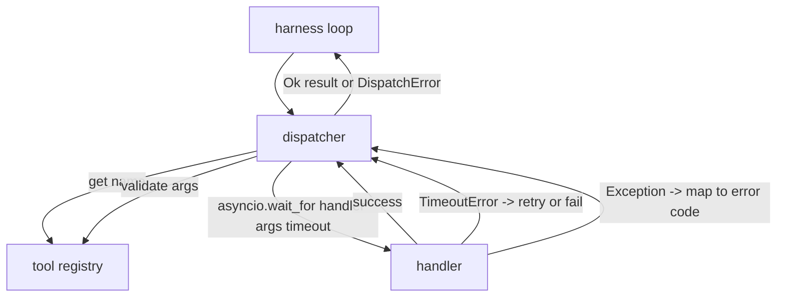
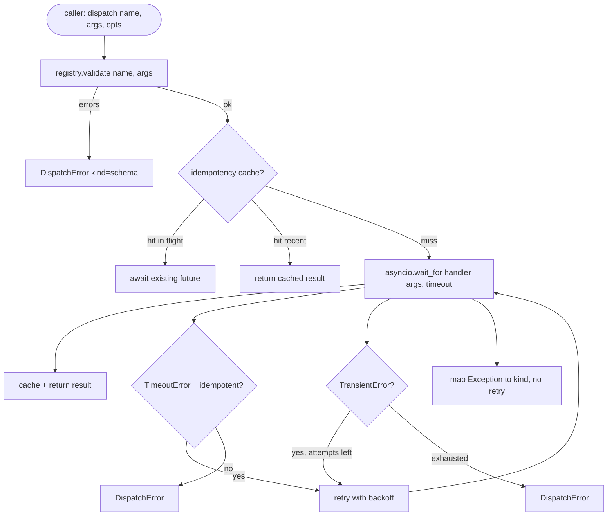

# 函数调用调用调用器

> 发射器是指,带支付了每一个计划所做的承诺,时间,重试,减值,错误映射.

> **【中文解读】**本节是综合项目 构建函数调用分派器


**Type:** Build | **类型:** Build
**Languages:** Python | **语言:** Python
**Prerequisites:** Phase 13 lessons 01-07, Phase 14 lesson 01 | **前置知识:** Phase 13 lessons 01-07, Phase 14 lesson 01
**Time:** ~90 minutes | **时间:** ~90 minutes

>  前置 代理 4/10──14·07 工具调用工程化版本──
>  分派器 = 方案 现承诺的地方──超时、重试、去重、错误映射 所有的麻烦都在这层面──这是 LLM调用工具到真实工具执行的桥梁──

## 学习目标
- 打回一个输入错误的通话时间,而不是挂的工具处理器.
  中文翻译:将工具处理器包装在每次通话的时间里,以返回输入错误,而不是挂环.
- 应用动和最大尝试数.
  中文翻译:用震动和最大尝试数重复测试.
- 通过无能率键进行复制,使得慢的原始比赛的复制尝试不会两次运行.
  中文翻译:重复试用无效键,所以慢原始的重复试不跑两次.
- 运输错误的错误,已经理解了该链路的错误包.
  中文翻译:地图处理器的例外和输送错误在一个错误包中,该链路已经理解.
- 交叉发送与同步限制,所以四十个工具调用的风扇不耗尽事件循环.
  中文翻译:将并行发送绑定到同时限制,因此40次工具通话不会耗尽事件循环.

```figure
cf-dispatch-retry
```

## 发送机坐的地方

> **【中文解读】**分派器是代理运用中心的中层,位于循环中. 课时20号,工具注册中心. 课时21号和传输层. 课时22号之间. 它负责超时控制,指数退避重试,等性重试和错误映射. 这些都是模型调用工具时不可避免的工程问题. 分派器是唯一了解计时器的层次.

> **【拓展：分派器在 Claude Code 和 Devin 中的实现】**克劳德代码的工具分派器实现了类似的分层:工具登记 定义方案,发送器 管理超时和重试,运输 负责 JSON-RPC 序列化――德文的代理带增加了断路器的模式当某个工具连续失败 N 次后自动进入冷却期,避免雪崩效应――

运输 (课二十二) 给循环提供了食物.循环向发送器传递工具调用.发送器调用了注册表,运行了处理器,并返回了结果或一个JSON-RPC形状的错误包.

> 在链环节 (第二十课) 和工具注册表 (第二十一课) 之间.




发送器是唯一知道时间表,反试和无能率的层.循环没有.登记器没有.处理器没有.隔离是重点.

> 导航器是唯一知道时间表,反试和无能率的层.循环没有.登记器没有.处理器没有.隔离是重点.


## 时间限制

> **【中文解读】**每个工具有默认超时时间`timeout_ms`),分派器可按调用覆盖──使用 `asyncio.wait_for`实现超时控制――关键设计:非等工具`db.write`) 超时后不自动重试,因为操作可能已提交,重试会导致重写入――分派器通过注册中心记录的`idempotent`标志来决定是否再试试.

每个工具都有默认的时间限制.`timeout_ms`发送器在传输链时将其转移到通话时.`asyncio.wait_for`在时间休止时,处理任务被取消,`DispatchError(kind="timeout")`现在,我们要去.

> 每个工具都有默认的截止时间.`timeout_ms`发送器在传输链时将其转移到通话时.`asyncio.wait_for`在时间休止时,处理任务被取消,`DispatchError(kind="timeout")`现在,我们要去.


时间过关不是非自主工具的默认可重复错误.`db.write`发送者尊重发送者, 发送者, 发送者, 发送者, 发送者, 发送者, 发送者, 发送者, 发送者, 发送者, 发送者, 发送者, 发送者, 发送者, 发送者, 发送者, 发送者, 发送者, 发送者, 发送者, 发送者, 发送者, 发送者, 发送者, 发送者, 发送者, 发送者, 发送者, 发送者, 发送者, 发送者, 发送者, 发送者, 发送者, 发送者, 发送者, 发送者, 发送者, 发送者, 发送者, 发送者, 发送者, 发送者, 发送者, 发送者, 发送者, 发送者, 发送者, 发送者, 发送者, 发送者, 发送者, 发送者, 发送者, 发送者, 发送者, 发送者, 发送者, 发送者, 发送者, 发送者, 发送者, 发送者, 发送者, 发送者, 发送者, 发送者, 发送者, 发送者, 发送者, 发送者, 发送者, 发送者, 发送者, 发送者, 发送者, 发送者, 发送者, 发送者, 发送者, 发送者`idempotent`无权的工具再试,无权的工具没有.

> 一个时间out不是非自主工具的默认可回复错误.`db.write`发送者尊重发送者, 发送者, 发送者, 发送者, 发送者, 发送者, 发送者, 发送者, 发送者, 发送者, 发送者, 发送者, 发送者, 发送者, 发送者, 发送者, 发送者, 发送者, 发送者, 发送者, 发送者, 发送者, 发送者, 发送者, 发送者, 发送者, 发送者, 发送者, 发送者, 发送者, 发送者, 发送者, 发送者, 发送者, 发送者, 发送者, 发送者, 发送者, 发送者, 发送者, 发送者, 发送者, 发送者, 发送者, 发送者, 发送者, 发送者, 发送者, 发送者, 发送者, 发送者, 发送者, 发送者, 发送者, 发送者, 发送者, 发送者, 发送者, 发送者, 发送者, 发送者, 发送者, 发送者, 发送者, 发送者, 发送者, 发送者, 发送者, 发送者, 发送者, 发送者, 发送者, 发送者, 发送者, 发送者, 发送者, 发送者, 发送者, 发送者, 发送者, 发送者`idempotent`无权的工具再试,无权的工具没有.


## 复试,以指数式后退

> **【中文解读】**重试策略:最多3次尝试,指数退避加动`timeout`和 `transient`错误会再试.`schema`错误`not_found`和 `internal`错误不重试因为模式错误是确定性的,重试不会改变结果,只会浪费代币预算

> **【拓展：抖动（Jitter）在分布式系统中的重要性】** AWS 架构博客的经典文章"弹性后退和"证明,在并发重试场景中,不加动指数退避会导致"雷群效应" (雷群效应) 增加随机动使重试间隔分散,显著降低系统负载――Claude API 和 OpenAI API的SDK都采用带动退避策略――

复试政策是三次最大,反击率是指数值的,

> 试图政策是最大三次. 退出是指数值的,紧张.


```text
attempt 1  -> delay 0
attempt 2  -> delay 0.1s * (1 + random[0..0.5])
attempt 3  -> delay 0.4s * (1 + random[0..0.5])
```

只有`timeout`其他`transient`错误再试.`schema`错误`not_found`其他`internal`错误不会再尝试. 方案错误是决定性的. 再尝试不会改变结果,并且会损失预算.

> 只有`timeout`其他`transient`错误再试一次.


如果调用者的预算剩余的工具调用是零,发送器在第一次尝试中很快失败,然后返回.`kind="budget_exceeded"`现在,我们要去.

> 如果调用者的预算剩余的工具调用是零,发送器在第一次尝试中很快失败,然后返回`kind="budget_exceeded"`现在,我们要去.


## 无能关键扣除

试机在原始机器仍在飞行中再次发射,这是一个真正的生产错误.第一次电话挂在4点9秒 (就在时间限下).重试5秒发射.现在两个请求与相同的后端竞赛.如果工具是`payments.charge`你已经收费了两次.

> 一个在原始仍在飞行中开火的重试是真正的生产错误.第一次电话挂在4点9秒 (就在时间限时下).重试开火在5秒.现在两个请求与相同的后端竞赛.如果工具是`payments.charge`你已经收费了两次.


发送器接受了可选的`idempotency_key`如果同一键在通话到达时在飞行中,发射器会等待飞行中的未来,然后返回结果.

> 发送商接受可选的`idempotency_key`如果同一键在通话到达时在飞行中,发射器会等待飞行中的未来,然后返回结果.


关键是电话给人负责.`f"{step_id}:{tool_name}:{hash(args)}"`发送器不会发明钥匙,因为仅仅从参数中得出一个钥匙,

> 电话的关键是电话给电话给电话给电话给电话给电话给电话给电话给电话给电话给电话给电话给电话给电话给电话给电话给电话给电话给电话给电话给电话给电话给电话给电话给电话给电话给电话给电话给电话给电话给电话给电话给电话给电话给电话给电话给电话给电话给电话给电话给电话给电话给电话给电话给电话给电话给电话给电话给电话给电话给电话给电话给电话给电话给电话给电话给电话给电话给电话给电话给电话给电话给电话给电话给电话给电话给电话给电话给电话给电话给电话给电话给电话`f"{step_id}:{tool_name}:{hash(args)}"`发送器不会发明钥匙,因为仅仅从参数中得出一个钥匙,


## 错误封面

> **【中文解读】**失败的分派回归统一的`DispatchError`结构,包含错误类型 (类型) 消息,尝试次数和 JSON-RPC 错误码――利用循环根据`kind`决定下一步动作:`schema`现在,我们要去.`not_found`触发重新规划,`timeout`现在,我们要去.`transient`根据尝试次数决定,`budget_exceeded`触发预算超限处理. 这种统一错误信封是代理系统可靠性的基石.

失败的发射返回一个形状.

```text
DispatchError
  kind        : "timeout" | "transient" | "schema" | "not_found" | "internal" | "budget_exceeded"
  message     : str
  attempts    : int
  jsonrpc_code: int   (one of -32601, -32602, -32603)
```

连接环路图`kind`让我们去下一个州.`schema`其他`not_found`走去`on_error`引发一个重机.`timeout`其他`transient`走去`on_error`根据尝试,可能会重新计划或不重新计划. `budget_exceeded`触发器`on_budget_exceeded`现在,我们要去.

> 连接环图`kind`让我们去下一个州.`schema`其他`not_found`走去`on_error`引发一个重机.`timeout`其他`transient`走去`on_error`根据尝试,可能会重新计划或不重新计划. `budget_exceeded`触发器`on_budget_exceeded`现在,我们要去.


## 风扇外出的货币限制

> **【中文解读】**当代理需要调用40个工具时,`gather(*calls)`会同时打开40个连接. 分派器用信号量.`gather`默认并发限制为8个调用在分派前获取信号量,完成后释放.调用方看到的是`gather`形状的输出,但实际调度受到并发约束.

> **【拓展：并发控制在 LLM Agent 中的实践】**德文的并行工具调用限制为5个并发,克劳德代码最大并发工具调用数量为10个. 这种限制不仅是后端保护,也是成本控制40个并行API调用意味着40倍的代币消耗速度.

`gather(*calls)`通过40个工具调用,即40个开源或40个子处理管.大多数后台不喜欢一个客户端的40个并行连接.

> `gather(*calls)`运行所有程序同时.


发送器包装`gather`在一个通讯器中.默认的同步限为八.每次通话都在发送之前收购通讯器,并在完成时释放.通话者看到`gather`实际的时间表是有限的.

> 发送器包装`gather`在一个通讯器中.默认的同步限为八.每次通话都在发送之前收购通讯器,并在完成时释放.通话者看到`gather`实际的时间表是有限的.


## 流动一次通话



## 如何读取代码

`code/main.py`定义`Dispatcher`现在`DispatchError`其他`TransientError`发送机记录了建筑物.`dispatch(name, args, ...)`只有一个进入点. 每次试验的时间限制在内线.`_run_with_retries`使用`asyncio.wait_for`现在,我们要去.`gather_bounded(calls)`运行许多随机发送的发送量.

> `代码/主


`code/tests/test_dispatcher.py`覆盖时间限开,暂时重试,方案错误无重试,无效率减免 (两个同时调用相同键的崩到一个处理器调用),并行限制 (在操作中的半径).

> `代码/测试/测试_发送器.


测试使用`asyncio.sleep(0)`确定性`Counter`它们可以在毫秒内完成,而不会依赖于墙钟的时间.

> 测试使用`asyncio.sleep(0)`确定性`Counter`它们可以在毫秒内完成,而不会依赖于墙钟的时间.


## 走得更远

首先,在每个过渡时进行结构化记录 (循环的事件流已经给你提供了,但发射器也应该发射`dispatch.attempt`其他`dispatch.retry`系统中出现的电路断裂事件.`kind="circuit_open"`两者都在这个发射器上,没有改变合同.

> 增加了两种生产驱动器.


课24将发射器粘贴到一个计划执行的代理,

> 课二十四将发射器粘贴到一个计划和执行代理,

