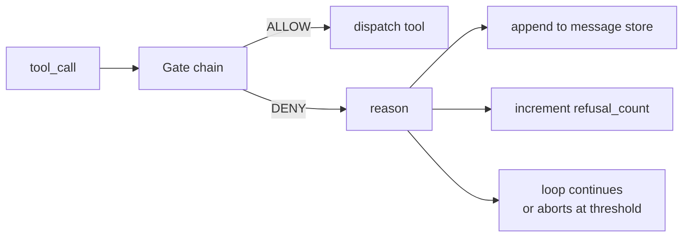
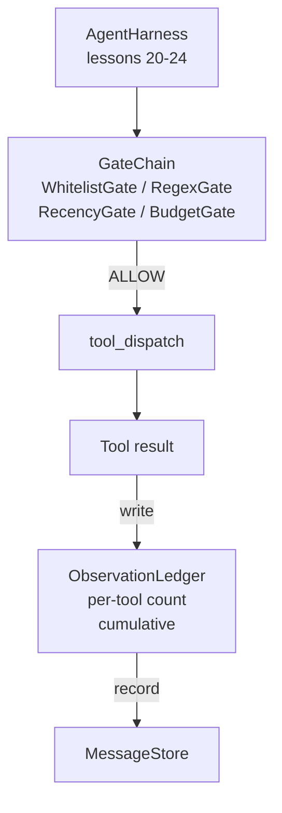

# 卡普斯通25课:验证门和观察预算

> 没有验证层的代理带是一个在子里的愿望. 这一课构建了确定性门链,决定工具调用是否允许开火,代理被允许看到多少输出,以及该循环必须停止什么时候,因为代理读了太多. 链接是小门的函数,加上一个观察账本,

> **【中文解读】**本节是人工智能工程的综合实战项目,集成前面学到的技术和方法.


**Type:** Build | **类型:** Build
**Languages:** Python (stdlib) | **语言:** Python (stdlib)
**Prerequisites:** Phase 19 · 20-24 (Track A1: agent loop, tool registry, message store, prompt builder, model router), Phase 14 · 33 (instructions as constraints), Phase 14 · 36 (scope contracts), Phase 14 · 38 (verification gates) | **前置知识:** Phase 19 · 20-24 (Track A1: agent loop, tool registry, message store, prompt builder, model router), Phase 14 · 33 (instructions as constraints), Phase 14 · 36 (scope contracts), Phase 14 · 38 (verification gates)
**Time:** ~90 minutes | **时间:** ~90 minutes

>  前置 代理套装 6/10──综合阶段 14·33/36/38──约束/范围/验证)──
> 验证门+观测预算 = 代理利用的"安检+限流"──三层确定性门:(1) 工具调用是否允许触发;(2) 工具输出模型能看多少;(3) 循环何时停下来(模型已读太多) ――观测账本追踪每个代币──

## 学习目标

- 建立一个`VerificationGate`具有确定性的协议`evaluate(call)`方法.
  中文翻译: 建立一个`VerificationGate`具有确定性的协议`evaluate(call)`方法.
- 编译预算,最新,白名单和regex门,
  中文翻译:将预算,最新,白名单和regex门组合成一个链接,使用短路语义.
- 通过一个 `ObservationLedger`按工具键键,然后转动.
  中文翻译:通过一个 `ObservationLedger`按工具键键,然后转动.
- 拒绝在累计观察预算超过时进行工具调用.
  中文翻译:在累计观察预算超过时拒绝工具调用.
- 表面结构`GateDecision`记录下下游可观测性可以摄入.
  中文翻译:表面结构化`GateDecision`记录下下游可观测性可以摄入.

## 问题问题

> **【中文解读】**当代理使用时,模型自由调用工具时,三类错误会在实际使用的第一小时内出现.1) 无限观察:一个在200K 行代码库上搜索将倾倒到下一轮,浪费上下文.2) 过时信息:长任务积累 50次调用工具,模型把第三轮的旧数据当作现状.3) 权限蔓延:研究任务从web_search 开始,不知道如何运行 shell.`(call, history, ledger) -> ALLOW | DENY`不是模型,不是判断,是确定性的拒绝.

> **【拓展：验证门在 Claude Code 和 Devin 中的实现】**克劳德代码的工具调用系统在每个工具执行前运行权限检查:文件操作限制在项目目录中,shell 命令需要用户确认,网络访问限制.

当一个代理带允许模型自由地调用工具时,在实际使用的第一小时内出现三个类型的错误.

> 当一个代理带允许模型自由调用工具时,在实际使用的第一小时内出现三个类型的错误.


首先是无限的观察.一个200K线的回复投放了500万的输出代币.模型每千字节看到一个匹配,其余的文本是浪费的.代币账单很大,代理现在更糟糕,不是更好,在任务上.

> 首先是无限观察.一个200K线 repo的抓获将500万代币输出放入下一个转折.模型每千字节看到一个匹配,其余的文本是浪费的.代币账单很大,代理现在更糟糕,而不是更好,在任务上.


第二个是过时的近期.一个长期运行的任务积累了五十个工具调用.模型从第三节重新读取了第一个读_文件,好像它是现实状态.第四十七节的编辑从来没有出现,因为提示构建器首先串行了最早的观察.

> 第二个是过时的近期.一个长期运行的任务积累了五十个工具调用.模型从第三节重新读取了第一个读_文件,好像它是现实状态.第四十七节的编辑从来没有出现,因为提示构建器首先串行了最早的观察.


调查任务开始时,`web_search`后来,他最终就跑了.`shell`随着任何读取痕迹,一个垃圾文件已经坐在 /tmp,一个卷轴与一个私人API.

> 调查任务开始时,`web_search`后来,他最终就跑了.`shell`随着任何读取痕迹,一个垃圾文件已经坐在 /tmp,一个卷轴与一个私人API.


验证门是说不的带件.它不是模型.它不是法官.它是确定性函数.`(call, history, ledger)`结果是,如果我们不需要一个模型,我们就会发现一个模型,然后我们会看到一个模型.

> 一个验证门是说不的带组件.它不是模型.它不是法官.它是确定性函数.`(call, history, ledger)`结果是,如果我们不需要一个模型,我们就会发现一个模型,然后我们会看到一个模型.


## 概念的概念

> **【中文解读】**门(门) 是任何具有`evaluate(call, ctx) -> GateDecision`方法的对象──链(链) 是有序列表,评估在第一个 DENY 时短路──顺序重要:廉价的结构门在昂贵的代币计数门前运行──本课提供四门:WhitelistGate(O(1) 哈希查找) ‧RegexGate(拒绝rm -rf或内网IP) ‧RecencyGate(只显示最近的N轮的观察) ‧BudgetGate(累积代币上限) ‧



一个门是任何有一个`evaluate(call, ctx) -> GateDecision`链条是一个有序的列表. 评估在第一个否定时短路. 秩序问题:廉价的结构门运行在昂贵的代币计数门之前.

> 一个门是任何有一个`evaluate(call, ctx) -> GateDecision`链条是一个有序的列表. 评估在第一个否定时短路. 秩序问题:廉价的结构门运行在昂贵的代币计数门之前.


这一课有四个门:

- `WhitelistGate`允许的工具名称是明确的集合.任何外面的东西都被拒绝了.这是最便宜的门,是第一.
  翻译: 中文`WhitelistGate`允许的工具名称是明确的集合.任何外面的东西都被拒绝了.这是最便宜的门,是第一.
- `RegexGate`工具参数与regex相匹配. 对于拒绝 shell 电话使用有用`rm -rf`它们或 HTTP 调用到内部IP.
  翻译: 中文`RegexGate`工具参数与regex相匹配. 对于拒绝 shell 电话使用有用`rm -rf`它们或 HTTP 调用到内部IP.
- `RecencyGate`模型只能看到从最后的N转折的观测. 较早的观测被掩盖. 门拒绝使用工具调用,结果将延长已经过时的观测窗口.
  翻译: 中文`RecencyGate`模型只能看到从最后的N转折的观测. 较早的观测被掩盖. 门拒绝使用工具调用,结果将延长已经过时的观测窗口.
- `BudgetGate`模型在整个会议中读到的累计代币有限量. 当账本说到达了限量时,将拒绝每次进一步的工具调用.
  翻译: 中文`BudgetGate`模型在整个会议中读到的累计代币有限量. 当账本说到达了限量时,将拒绝每次进一步的工具调用.

观察账本是会计.每次成功的工具调用都会写一个行:工具名称,轮回,发行的代币,累计.账本回答两个问题:模型已经看到多少的工具,以及它已经看到多少的工具X.预算门读了第一.每工具的预算门,你将写作练习,读了第二个.

> 观察账本是会计.每次成功的工具调用都会写一个行:工具名称,轮回,发行的代币,累计.账本回答两个问题:模型已经看到多少的工具总和,以及它已经看到多少的工具X.预算门读了第一.每工具的预算门,你将写作练习,读了第二个.


## 建筑,建筑
```figure
cg-gate-chain
```

## 建筑



链接要求链接.链接要么点点点点点点点点点点点点点点点点点点,工具运行,账本点点点点,结果被添加到消息存储中.如果拒绝,模型将被交给拒绝作为系统消息,循环决定是否重新尝试或中止.

> 如果链接点点点点点点点点点点点点点点点点,工具运行,账本点点点,结果被添加到消息存储器.如果拒绝,模型将被交给拒绝作为系统消息,循环决定是否重新尝试或中止.


## 你会建造什么

> **【拓展：观察预算在 RAG 系统中的对应物】**在RAG系统中,下文窗口管理是观察预算的直接应对物种.当检索系统返回文件填充了LLM的上文窗口时,模型质量实际上下降了噪声淹没了信号.

实施是单一的`main.py`另外还有一些检查.

1. `Observation`其他`ToolCall`电线形状的定义是数据类.
2. `ObservationLedger`记录`(turn, tool, tokens)`排列和答案`cumulative()`其他`per_tool(name)`现在,我们要去.
3. `GateDecision`运载`(allow, reason, gate_name)`现在,我们要去.
4. `VerificationGate`每个门都执行了`evaluate(call, ctx)`现在,我们要去.
5. `GateChain`打电话给每一个门,返回第一个拒绝,或者返回允许如果每个门通过.
6. 演示程序运行一个小的合成代理循环. 三轮. 第三轮开启预算门,循环报告一个清洁的拒绝,

代币计量器是故意的愚蠢`len(text) // 4`课程的重点是管道,而不是代币器.

> 代币计量是故意的愚蠢`len(text) // 4`课程的重点是管道,而不是代币器.


## 为什么链条有所重要

> **【中文解读】**拒绝比允许便宜,且门按成本升序排列:WhiteListGate O(1) < RegexGate O(图案) < RecencyGate O(切片) < BudgetGate O(分数) ⋅也按爆炸半径排列:白名单是最强声明(工具不在契约中),正则门检查参数合法性,时效门仍关心但调用结构合法,预算门在所有其他门通过后才触发.

> **【拓展：短路评估在安全系统中的标准实践】**网络应用防火墙 (Waf) 的规则链使用相同的短路模式:先检查IP黑名单 (O) 1)),再检查请求体正则 (O) ),最后检查速率限制 (O) 复制调用 (O) 〔WEB 库伯尼特的录取控制器 (KBN) 链也按类似顺序执行──本课的门链设计是安全工程中"快速失败" (FALF FAST) 原则的直接应用──

否认比允许便宜.`WhitelistGate`在 O(1) 哈希搜索中运行. `RegexGate`在O(模式 * argv中运行. `RecencyGate`读到一个小片的消息商店.`BudgetGate`您将通过成本上升来订购,所以拒绝通话之前,就会做昂贵的工作.

> 一个便宜的比一个允许.`WhitelistGate`在 O(1) 哈希搜索中运行. `RegexGate`在O(模式 * argv中运行. `RecencyGate`读到一个小片的消息商店.`BudgetGate`您将通过成本上升来订购,所以拒绝通话之前,就会做昂贵的工作.


现在,我们需要一个新的方法来解决问题,我们需要一个新的方法来解决问题,我们需要一个新的方法来解决问题,我们需要一个新的方法来解决问题.

> 你也按爆炸射线进行订单.白名单是最强大的索赔:这个工具不在合同中.Regex门是下一个:这个论点不在合同中. 后者是Recency:带仍然关心,但电话结构上是合法的.预算是最后的,因为,根据定义,它只会在其他一切都通过时开火.


## 如何与A轨道的其他部分相结合

在前几堂课程中,你得到了循环,工具注册表,消息存储器,提示构建器和模型路由器. 这一课增加了模型和工具之间的层次. 课26将把工具调用到导航器的沙箱上,一旦门链说"允许". 课27将记录拒绝的评价带作为质量信号. 课程28将门决策导向OpenTelemetry范围. 课29将所有东西入一个工作的编码代理中.

> 在之前的课程中,你得到了循环,工具注册表,消息存储器,提示构建器和模型路由器. 这一课增加了模型和工具之间的层次. 课26将把工具调用到导航器的沙箱上,一旦门链说"允许". 课27将记录拒绝的评价带作为质量信号. 课程28将门决策导向OpenTelemetry范围. 课29将所有东西入一个工作的编码代理中.


## 运行.

```bash
cd phases/19-capstone-projects/25-verification-gates-observation-budget
python3 code/main.py
python3 -m pytest code/tests/ -v
```

测试将包括每一个门的决定,并从零出发.测试覆盖本书,每个门的隔离,链路短路,和合成循环端到端.

> 测试将包括每一个门的决定,并从零出发.测试覆盖本书,每个门的隔离,链路短路,和合成循环端到端.

