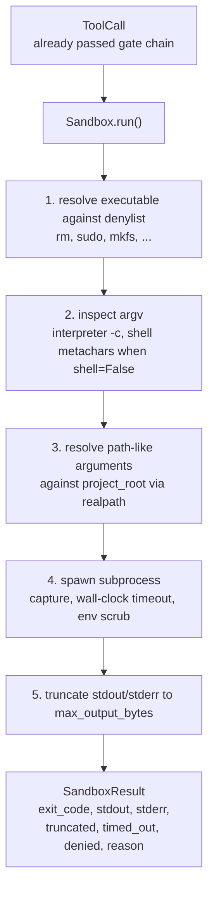
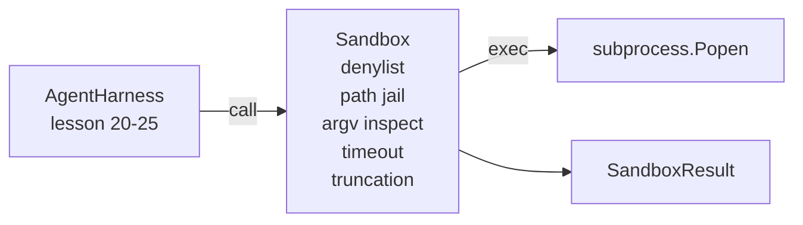

# 石课26: 沙箱跑步者与丹尼利斯和路径监狱

> 验证门决定是否应运行工具调用. 沙盒决定什么会发生. 这一课将运行一个子进程运行器,拒绝危险的执行器,拒绝危险的Argv形状,将每个文件路径关在项目根, 它是模型和操作系统之间坐落的两个层中的第二层.

> **【中文解读】**本节是综合项目 构建沙盒运输器和拒绝名单.


**Type:** Build | **类型:** Build
**Languages:** Python (stdlib) | **语言:** Python (stdlib)
**Prerequisites:** Phase 19 · 25 (verification gates and observation budget), Phase 14 · 33 (instructions as constraints), Phase 14 · 38 (verification gates) | **前置知识:** Phase 19 · 25 (verification gates and observation budget), Phase 14 · 33 (instructions as constraints), Phase 14 · 38 (verification gates)

>  前置 代理 7/10──验证门决定运行,沙箱决定运行时发生什么──
>  沙箱 = "OS 防火墙"――子进程 运行器拒绝危险可执行+危险 argv+路径锁项目根+输出截断+墙钟 超时杀过程――这是模型和OS之间的两层防御之二――一是验证门)――15期·14期杀开关的实现细节――
**Time:** ~90 minutes | **时间:** ~90 minutes

## 学习目标

- 建立一个`Sandbox`班级包装`subprocess.run`随着时间的延期,捕获,和短节.
  中文翻译: 建立一个`Sandbox`班级包装`subprocess.run`随着时间的延期,捕获,和短节.
- 拒绝指令,以名义对抗一个丹尼尔斯特,而以结构对抗一个阿尔格维检查员.
  中文翻译:拒绝指令以名义对抗一个丹尼尔名单,以结构对抗一个Argv检查员.
- 拒绝任何在声明的项目根之外解决的路径参数.
  中文翻译:拒绝任何在声明的项目根之外解决的路径参数.
- 当模式关闭时,拒绝子的元字符.
  中文翻译:当关闭 Shell 模式时,拒绝 shell 转字符.
- 返回一个结构化`SandboxResult`能吸收下游可观和评估带.
  中文翻译:重返一个结构化`SandboxResult`能吸收下游可观和评估带.

## 问题问题

> **【中文解读】**能执行 shell 命令的编码代理可以在一个回合内安装后门、窃钥匙、损坏开发人员笔记本和产生巨大的云账单。三类故障反复出现:1) 危险可执行文件(sudo,chmod -R 777,rm -rf,mkfs);2) argv 把戏剧(python3 -c "进口OS;os系统('rm -rf /') ";3) 路径逃逸 读取 ../../etc/passwd) ⋅沙盒不是操作系统的安全边界意义它是开发时的护,使常见故障模式变得明显──

> **【拓展：沙盒技术在 AI Agent 产品中的演进】**开放手机使用火焰微VM 提供内核级隔离――本课程的代列表+路径监狱+超时+截断是这些方案的核心简化版本覆盖90%的常见代理故障模式――

编码代理可以在一个转折中安装后门,除钥匙,造开发人员笔记本电脑,并起云账单.最不昂贵的防御是不给它.第二最不昂贵的是一个对一个精确的模式列表表示不愿意的沙盒.

> 一个可以成的编码代理可以安装后门,除钥匙,造开发人员笔记本电脑,并单次起云账单.最不昂贵的防御是不给它.第二个最不昂贵的是一个对一个精确的模式列表表示不.


经纪人痕迹中出现了三类失败.

首先是危险的执行工具. 一个压力下的模型来解决路径问题将试图`sudo`现在`chmod -R 777`现在`rm -rf`现在`mkfs`现在`dd`丹尼尔人以姓名和名捕获他们.

> 首先是危险的执行工具. 一个压力下的模型来解决路径问题将试图`sudo`现在`chmod -R 777`现在`rm -rf`现在`mkfs`现在`dd`丹尼尔人以姓名和名捕获他们.


没有子的模型会通过解释器进行攻击:`python3 -c "import os; os.system('rm -rf /')"`现在`bash -c '...'`现在`node -e '...'`现在`perl -e '...'`沙盒需要知道任何翻译都用一个`-c`- - 像旗只是一个号,还有额外的步骤.

> 没有子的模型将通过解释器进行攻击:`python3 -c "import os; os.system('rm -rf /')"`现在`bash -c '...'`现在`node -e '...'`现在`perl -e '...'`沙盒需要知道任何翻译都用一个`-c`- - 像旗只是一个号,还有额外的步骤.


第三个是逃走路.`./src/main.py`而是读到`../../etc/passwd`沙盒通过解决每一个路径争论,将其锁定在牢房里.`os.path.realpath`并且说出前.

> 第三是逃走路.`./src/main.py`而是读到`../../etc/passwd`沙盒通过解决每一个路径争论,将其锁定在牢房里.`os.path.realpath`并且说出前.


沙盒不是操作系统的安全界限. 具有代码执行的确定攻击者仍然可以爆发.沙盒是开发时间的防护轨道:它使常见故障模式响,并阻止代理因纯粹的不善行为而造成破坏.

> 沙盒不是操作系统的安全界限. 具有代码执行的确定攻击者仍然可以爆发.沙盒是开发时间的防护护:它使常见故障模式响,并阻止代理因纯粹的不善行为而造成破坏.


## 概念的概念

> **【中文解读】**沙盒有四个拒绝轴:名称(denylist 检查可执行文件名) √argv(检查解释器 -c 模式和 Shell 元字符) √路径(通过真路径 检查路径是否在项目_根内) √结构( Shell=False 时拒绝管道和重定向) ⋅每个轴是纯函数,子进程只在所有轴通过后才启动──路径监狱是最精巧的部分通过`os.path.realpath`解析符号链接,防止符号链接逃离攻击.



沙盒有四个拒绝轴:名称, argv,路径,结构.每个轴是调用的纯函数,尚未出现子进程.每个轴经过后,子进程只会产生.

> 沙盒有四个拒绝轴:名称,Argv,路径,结构.每个轴是调用的纯函数,尚未出现子进程.


其他`SandboxResult`退出码是常规的: 0 成功,非零失败,加上3个拒绝 (-100),时间_out (-101) 和缩短的哨兵码 (退出码是真实的,有标志设置). 下游课程读取了这个结构化结果而不是解析 stderr.

> `SandboxResult`退出码是常规的: 0 成功,非零失败,加上3个拒绝 (-100),时间_out (-101) 和缩短的哨兵码 (退出码是真实的,有标志设置). 下游课程读取了这个结构化结果而不是解析 stderr.


## 建筑,建筑

> **【拓展：从 denylist 到 seccomp 的安全升级路径】**本课程的丹尼尔列表方案覆盖了约90%的常见代理故障――生产级升级路径:1)Docker容器(文件系统隔离 + 网络隔离);2)gVisor(用户态内核,系统调用过);3)火微VM(完整虚拟化,KVM 后端);4)seccomp-bpf(精确的系统调用白名单) ――OpenHands使用Docker + seccomp,Devin使用火──每一步升级增加安全边界但减少灵活性丹尼尔列表是最简单但最弱的选择──
```figure
cg-path-jail
```

## 建筑



丹尼尔名单是可执行的基名列表.`/bin/rm`现在`/usr/bin/rm`) 所有的解析都以相同的基名. argv 检查员知道解释器的形状:任何 argv[0]是解释器的 argv,任何后来的 arg 始于 `-c`或`-e`子的特征 (`;`现在`|`现在`&`现在`>`现在`<`背部,`$()`) 要求拒绝,如果呼叫没有明确要求收购.

> 丹尼尔名字是一个可执行的基名组.`/bin/rm`现在`/usr/bin/rm`) 所有的解析都以相同的基名. argv 检查员知道解释器的形状:任何 argv[0]是解释器的 argv,任何后来的 arg 始于 `-c`或`-e`子的特征 (`;`现在`|`现在`&`现在`>`现在`<`背部,`$()`) 要求拒绝,如果呼叫没有明确要求收购.


路径监狱是最微妙的部分.`project_root`任何看起来像一个路径的论点 (包含`/`通过 标准化,`os.path.realpath`结果是通过查看真路,而不是字面路径,阻止了Symlink逃离尝试 (项目根中的一个向外指的符号链接).

> 道监狱是最微妙的部分.`project_root`任何看起来像一个路径的论点 (包含`/`通过 标准化,`os.path.realpath`结果是通过查看真路,而不是字面路径,阻止了Symlink逃离尝试 (项目根中的一个向外指的符号链接).


## 你会建造什么

实施是`main.py`另外还有一次测试.

1. `SandboxResult`数据类:出口_代码,stdout,stderr,缩短,时间_out,拒绝,理由,持续时间_ms.
2. `SandboxConfig`数据类:项目_root, max_output_bytes,时间_秒,丹尼尔列表,解释器_区块.
3. `Sandbox`类:`run(argv, *, shell=False, cwd=None)`返回一个`SandboxResult`现在,我们要去.
4. 内部拒绝助手:`_check_executable_denylist`现在`_check_argv_interpreter`现在`_check_shell_metachars`现在`_check_path_jail`现在,我们要去.
5. 通过清晰的输出切割`truncated`捕获的流域中的旗和标记线.
6. 下面的演示:一系列合法和反抗的呼叫.

沙盒使用`subprocess.run`随着`shell=False`默认的`capture_output=True`墙钟时间使用了`timeout`关于`TimeoutExpired`通过使用""的方法,

> 沙盒使用`subprocess.run`随着`shell=False`默认的`capture_output=True`墙钟时间使用了`timeout`关于`TimeoutExpired`通过使用""的方法,


## 为什么这不是一个真正的沙箱

> **【中文解读】**本课沙盒不使用名字空间、集团、次组、gVisor、Firecracker 或任何内核级隔离子进程都可以做沙盒也能做.保护是结构性的:拒绝最常见的危险调用,并将明确的拒绝记录到可观测性系统中.生产代理需要在此基础上叠加:Docker 容器、微VM、降权、只读取挂载、限制等.

课堂沙箱不使用名字空间,cgroups,seccomp,gVisor,Firecracker或任何核层次的隔离.任何子工艺可以做的事情,沙箱可以做.保护是结构性的:代理被拒绝最常见的危险调用,而响亮的拒绝进入可观察性而不是沉默运行.

> 无用名字空间,cgroups,seccomp,gVisor,firecracker,或任何核层次的隔离.任何子工艺可以做,沙箱可以做.保护是结构性的:代理被拒绝最常见的危险调用,而响亮的拒绝进入可观察性而不是沉默运行.


对于生产代理,你将层次上层:运行在一个不受特权的Docker容器里,运行在一个microVM里,放下功能,安装项目根只读写和一个划痕写读写,设置内存和CPU的限制,将环境扫描到一个已知安全的白清单. 第29课可以做一些.操作系统隔离是这个课程的范围之外.

> 对于生产代理,你将层次放在上面:运行在一个不受特权的Docker容器里,运行在一个microVM里,放下功能,安装项目根只读写和一个划痕写写,设定内存和CPU的限制,将环境扫描到已知安全的白名单. 第29课做了一些.操作系统隔离是这个课程的范围之外.


## 运行.

```bash
cd phases/19-capstone-projects/26-sandbox-runner-denylist
python3 code/main.py
python3 -m pytest code/tests/ -v
```

演示程序创建了一个临时目录,将一个清洁的文件放入其中,然后运行电话的电池. 合法通话成功. 拒绝通话返回 SandboxResult`denied=True`时间限制是回来的.`timed_out=True`切割套件`truncated=True`测试将打印一个JSON结果表,然后输出零.

> 测试创建一个临时目录,将一个清洁的文件放入其中,然后运行电话的电池. 合法通话成功. 拒绝通话返回 SandboxResult`denied=True`时间限制是回来的.`timed_out=True`切割套件`truncated=True`测试将打印一个JSON结果表,然后输出零.


## 如何与A轨道的其他部分相结合

课25产生了门链.课26是门允许后运行的执行器.课27的评估利用比较了沙箱的结果与每个任务的预期出口代码.课28发出一个`gen_ai.tool.execution`跨度在每一个`Sandbox.run`课29的端到端演示线程通过两个层来传输一个真正的编码代理.

> 第25课产生了门链.

