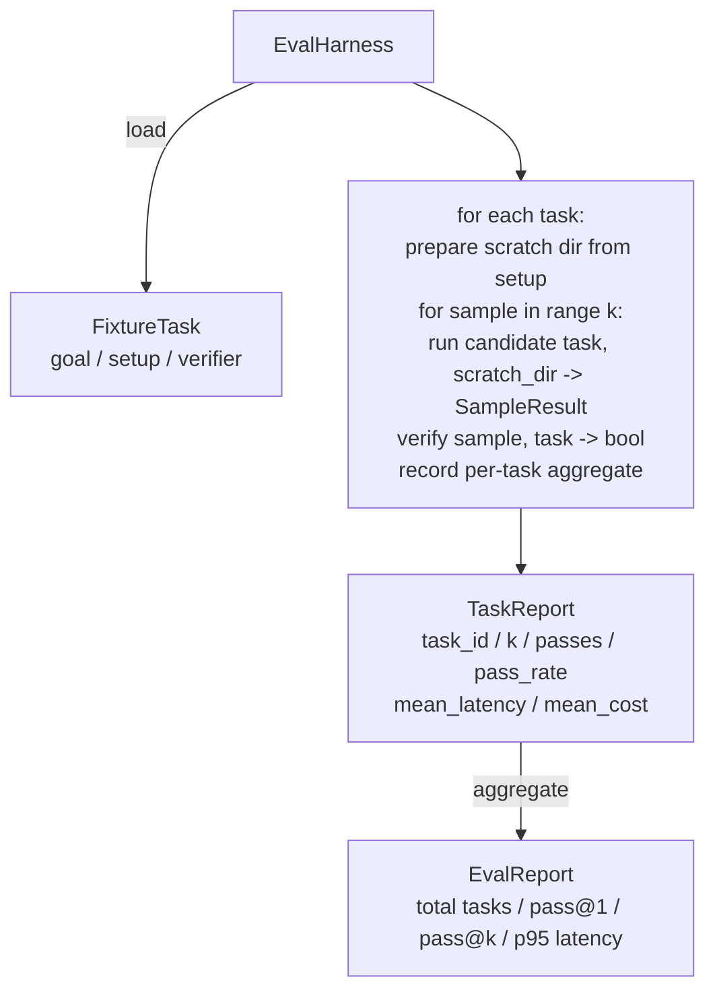

# 石27课: 杆配合固定任务

> 编码代理只能像你测量它的任务一样好. 这一课构建了一个评估链,它采用了一个固定任务文件,通过候选代理运行每个任务,通过确定性验证器通过分数或失败,并将结果汇集成pass@1,pass@k,平均延迟和平均成本. 连接是真理的来源,让你能从一个反因子中辨别回归.

> **【中文解读】**本节是综合项目 构建代理线束循环和契约验证系统.


**Type:** Build | **类型:** Build
**Languages:** Python (stdlib) | **语言:** Python (stdlib)
**Prerequisites:** Phase 19 · 25 (verification gates), Phase 19 · 26 (sandbox runner), Phase 14 · 30 (eval-driven agent development), Phase 14 · 19 (SWE-bench and GAIA benchmarks) | **前置知识:** Phase 19 · 25 (verification gates), Phase 19 · 26 (sandbox runner), Phase 14 · 30 (eval-driven agent development), Phase 14 · 19 (SWE-bench and GAIA benchmarks)

>  前置 代理 8/10──参考14·19+30期(SWE-bench/GAIA+ eval 驱动开发)──
>                                                                                                                                                                                                                                                               
**Time:** ~90 minutes | **时间:** ~90 minutes

## 学习目标

- 定义一个固定任务为目标,设置和验证器的三倍.
  中文翻译:定义一个固定任务为目标,设置和验证器的三倍.
- 按任务进行多个样本运行,并计算pass@1和pass@k.
  中文翻译:每项任务中,得分多个样本运行,计算pass@1和pass@k.
- 总结延迟和成本成平均和95%的指标.
  中文翻译:将延迟和成本总结成平均和95%的指标.
- 转换为可重复使用函数的电线定制验证器 (文件差,出口代码,regex匹配).
  中文翻译:将线定性验证器 (文件差,出口代码,regex匹配) 转化为可重复使用的函数.
- 发出一个结构化的JSON报告,可以吸收的回归跟踪脚本.
  中文翻译:发出一个结构化的JSON报告,可以摄入的回归跟踪脚本.

## 问题问题

> **【中文解读】**没有评估线束的代理基准测试困扰于三种故障模式:1) 未经验证的通过 代理声称修复了错误,人类扫了一眼差异,三周后回归测试发现了相同的错误;2) 未经验证的回归提示模板变化使代理在杂任务中做好4%但在静止任务上差 14%;3) 每任务漂移周一评估100个任务,周五只有95,通过率看起来提高了5%但其实不是――线束将这些失败转化为事实程序.

> **【拓展：pass@k 指标在代码生成评估中的核心地位】**引入,已成为代码生成模型的标准评估指标――公式`pass@k = 1 - (1-p)^k`通过率: 通过率: 通过率: 通过率: 通过率: 通过率: 通过率: 通过率: 通过率: 通过率: 通过率: 通过率: 通过率: 通过率: 通过率: 通过率: 通过率: 通过率: 通过率: 通过率: 通过率: 通过率: 通过率: 通过率: 通过率: 通过率: 通过率: 通过率: 通过率: 通过率: 通过率: 通过率: 通过率: 通过率: 通过率: 通过率: 通过率: 通过率: 通过率: 通过率: 通过率: 通过率: 通过率: 通过率: 通过率: 通过率: 通过率: 通过率: 通过率: 通过率: 通过率: 通过率: 通过率: 通过率: 通过率: 通过率: 通过率: 通过率: 通过率: 通过率: 通过率: 通过率: 通过率: 通过率: 通过率: 通过率: 通过率: 通过率: 通过率: 通过率: 通过率: 通过率: 通过率: 通过率: 通过率: 通过率: 通过率: 通过率: 通过率: 通过率: 通过率: 通过率: 率: 通过率: 率: 通过率: 率: 率: 率: 率: 率: 率: 率: 率: 率: 率: 率: 率: 率: 率: 率: 率: 率: 率: 率: 率: 率: 率: 率: 率: 率: 率: 率: 率: 率: 率: 率: 率: 率: 率: 率: 率: 率: 率: 率: 率: 率: 率: 率: 率: 率: 率: 率: 率: 率: 率: 率: 率: 率: 率: 率: 率:

没有评估带的3种失败模式.

> 没有评估器件的3种失败模式.


首先是未经验证的通过. 代理说它修复了错误,人类看着差异,套件标记为绿色,三周后回归测试显示了相同的错误. 代理认为可以合理的推理,但实际上没有修复任何东西.

> 首先是未经验证的通过. 代理说它修复了错误,人类看着差异,套件标记为绿色,三周后回归测试显示出相同的错误. 代理合理地推理了,


另一个是未被检测到的回归. 调整提示模板使代理在高声任务上提高4%和安静任务上降低14%. 没有黄金集和每任务分数,回归只会进入主页,只有当客户抱怨时才会出现.

> 没有金组和每项任务分数,退缩率会进入主体,只有当客户抱怨时才会出现.


周一,我们做了100项任务,周五做了95,因为有人改名了五项任务. 合格率看起来像5%的改善.

> 周一,我们做了100项任务,周五做了95,因为有人改名了五项任务. 合格率看起来像5%的改善.


连接器是把这些失败变成事实的程序. 它运行每一个固定,每一次,以可复制的顺序,

> 运行每一个固定,每一次,以可复制的顺序,对付一个验证器,在确定性检查中返回真或假.


## 概念的概念

> **【中文解读】**固定任务是JSON文件 +可选的预期/ 目录──JSON 声明 id、goal(给代理的提示)、设置(放入临时目录文件) 和验证器名称和参数)。三种验证器形状覆盖大部分有用任务:file_equals(精确匹配)、regx_match(正则匹配)、shell_exit_zero(shell 命令退出码为零)。线束对每个任务运行 k 次,报告 pass@1 和 pass@k。

```mermaid
flowchart LR
  F1[fixtures/task_001/<br/>task.json + expected/] --> Harness
  F2[fixtures/task_002/<br/>...] --> Harness
  Harness[Harness<br/>for each task:<br/>setup / run agent k samples /<br/>verify each sample /<br/>record latency, cost]
  Harness --> Report[EvalReport<br/>pass@1 / pass@k<br/>mean ms / p95 ms<br/>mean cost]
```

`FixtureTask`是一个小的 JSON 文件加上一个可选的 `expected/`文件目录.JSON声明一个`id`其他`goal`报警人员的通知,`setup`文件将落入""中,`verifier`验证器块在使用器的验证器登记册中命名一个函数,并提供其参数.

> 一个`FixtureTask`是一个小的 JSON 文件加上一个可选的 `expected/`文件目录.JSON声明一个`id`其他`goal`报警人员的通知,`setup`文件将落入""中,`verifier`验证器块在使用器的验证器登记册中命名一个函数,并提供其参数.


验证器的三个形状涵盖了大多数有用任务.

第一个是`file_equals`经过代理运行后,将命名的文件与预期内容进行比较.

> 首先是`file_equals`经过代理运行后,将命名的文件与预期内容进行比较.


第二个是`regex_match`文件的内容与regex相匹配. 这捕捉到"函数必须存在并返回X"任务,其中有许多可接受的解决方案.

> 第二个是`regex_match`文件的内容与regex相匹配. 这捕捉到"函数必须存在并返回X"任务,其中有许多可接受的解决方案.


第三个是`shell_exit_zero`带运行一个器命令 (从第26课中的沙箱中通过),只有命令出于零时才能通过任务. 这可以捕获"测试必须通过"任务.

> 第三是`shell_exit_zero`带运行一个器命令 (从第26课中的沙箱中通过),只有命令出于零时才能通过任务. 这可以捕获"测试必须通过"任务.


连接器可以完成每一个任务`k`通过@k是`1 - (1 - p)^k`在此,p是经验性通过率;harness也报告原始数量,以便您可以发现变异.延迟是每样品的墙钟.成本是代理自报 (代币数量,美元或两者);harness将其汇总在样本中并呈现每任务和总数.

> 带执行每一个任务`k`通过@k是`1 - (1 - p)^k`在此,p是经验性通过率;harness也报告原始数量,以便您可以发现变异.延迟是每样品的墙钟.成本是代理自报 (代币数量,美元或两者);harness将其汇总在样本中并呈现每任务和总数.


## 建筑,建筑

> **【拓展：SWE-bench 和 HumanEval 的评估线束设计】**作为一个固定任务,验证器是单元测试套件的通过率.HumanEval (OpenAI) 使用164个Python函数补充任务,验证器是输入输出对测试.本课的五个固定任务设计是这些基准测试的教育性简化.
```figure
pass-at-k
```

## 建筑



候选人可以:`Callable[[FixtureTask, str], SampleResult]`带通过 创建了"划痕目录"`tempfile.mkdtemp()`带不关心候选人如何工作.候选人可能是一个确定性补丁申请人 (有用的带自测),一个真正的LLM代理,一个.合同是SampleResult.

> 申请人可以:`Callable[[FixtureTask, str], SampleResult]`带通过 创建了"划痕目录"`tempfile.mkdtemp()`带不关心候选人如何工作.候选人可能是一个确定性补丁申请人 (有用的带自测),一个真正的LLM代理,一个.合同是SampleResult.


## 你会建造什么

`main.py`船舶:

1. `FixtureTask`数据类.
2. `SampleResult`数据类:成功_自报,延迟_ms,成本_单位,编辑.
3. `TaskReport`现在`EvalReport`数据类与`to_dict()`现在,我们要去.
4. `VerifierRegistry`输入文件_equals,regex_match,shell_exit_zero.
5. `EvalHarness`运行一个任务目录对候选人. 返回EvalReport.
6. 五个固定任务集成`tasks/`其他:
   - 单独的`fizzbuzz`
     中文翻译:一下一下`fizzbuzz`
   - 失去了回报`factorial`
     中文翻译:失踪回归`factorial`
   - 错误信息的打字错误
     中文翻译:错误信息的字体
   - 空函数体
     中文翻译:空函数体
   - 连接列表的单次通行
     中文翻译:链接列表的单次通行
7. 确定性参考候选人 (`apply_known_fixes`) 带用于证明 1.0 的清洁通过@1 .
8. 测试打印了EvalReport JSON,然后输出到零.

固定任务将作为JSON文件捆绑在 `tasks/`加上对源文件`tasks/<id>/buggy/`其他`tasks/<id>/expected/`带将 buggy 复制成一块脏,交给候选人,并对预期进行验证.

> 设置任务将作为JSON文件捆绑在 `tasks/`加上对源文件`tasks/<id>/buggy/`其他`tasks/<id>/expected/`带将 buggy 复制成一块脏,交给候选人,并对预期进行验证.


## 为什么要通过@k而不是仅仅通过@1

> **【中文解读】**真正的LLM代理是随机的.通过@1 = 0.6看起来是失败的,但通过@5 = 0.95 说明 代理大部分时候能找到正确答案,只是在早期样本上选错了.修复是采样和排名,而不是更多的训练.通过@k 与通过@1 一起报告,因为通过@k 掩盖了真实故障.

实际的LLM代理是断性的. 0.6的pass@1看起来像失败. 0.95的pass@5表示代理大部分时间都得到了正确的答案,但在早期样本上选择错误.解决方案是采样和排名,而不是总是更多的训练.

> 真正的法师代理人是食的.


通过@k与pass@1一起报告,因为pass@k文件显示了真正的失败:如果模型每20次尝试一次得到正确的答案,你就没有有用的代理.

> 通过@k与pass@1一起报告,因为pass@k文件在一个真正的失败:如果模型每20次尝试一次得到正确的答案,你就没有有用的代理.


## 如何与A轨道的其他部分相结合

课25产生了门链.课26产生了沙箱.`shell_exit_zero`验证器. 第28课将每个运行的带带包装成OTel痕迹. 第29课将端到端的演示程序运行到捆绑的装置之一,并确定pass@1 = 1.0对于参考候选人.

> 第25课产生了门链.


## 运行.

```bash
cd phases/19-capstone-projects/27-eval-harness-fixture-tasks
python3 code/main.py
python3 -m pytest code/tests/ -v
```

演示程序将EvalReport在JSON中打印,包括pass@1,pass@5,平均延迟和每任务分类.出口代码为零.测试涵盖验证函数,pass@k数学,固定装载和对捆绑的参考候选人的端到端使用.

> 测试将EvalReport在JSON中打印,包括pass@1,pass@5,平均延迟和每任务分类.出口代码为零.测试涵盖验证函数,pass@k数学,固定装载和对捆绑的参考候选人的端到端使用.

