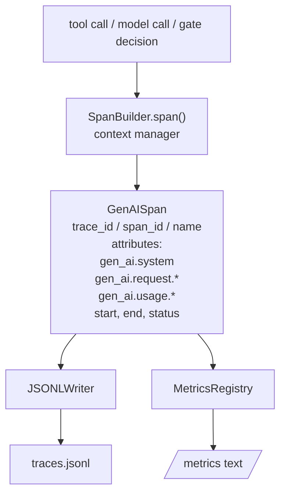
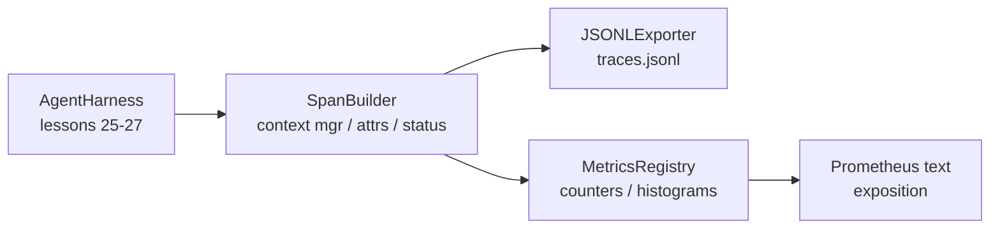

# 卡普斯通课 28: 通过OTel GenAI跨度和承诺度测量可观测性 结业指标 GenAI开放电力测量 欧盟

> 无可观察的代理带是花钱的黑盒子.本课程手动滚动一个跨度构造器,它发出符合OpenTelemetry GenAI语义公约的记录,将它们写入一个JSON-Lines文件,每行一个跨度,并暴露了Prometheus文本格式的计数器和历史图.整个东西是Stdlib Python,并运行离线.

> **【中文解读】**本节是综合项目 构建开放电气测量 追踪可观测性


**Type:** Build | **类型:** Build
**Languages:** Python (stdlib) | **语言:** Python (stdlib)
**Prerequisites:** Phase 19 · 25 (verification gates), Phase 19 · 26 (sandbox), Phase 19 · 27 (eval harness), Phase 13 · 20 (OpenTelemetry GenAI), Phase 14 · 23 (OTel GenAI conventions) | **前置知识:** Phase 19 · 25 (verification gates), Phase 19 · 26 (sandbox), Phase 19 · 27 (eval harness), Phase 13 · 20 (OpenTelemetry GenAI), Phase 14 · 23 (OTel GenAI conventions)

>  前置代理套装 9/10。参考13·20期(OTel GenAI) +14期·23期(OTel 约定) 』
> 可观测性 = "黑盒的玻璃外"──手写跨度构造者 生成 OTel GenAI 兼容记录→JSON-Lines(一行一跨度) + 普罗梅蒂乌斯计数器+直方图──纯的小小小字符串 离线跑──无观测的带=烧钱的黑盒──
**Time:** ~90 minutes | **时间:** ~90 minutes

## 学习目标

- 建立一个以OpenTelemetry GenAI语义公约为形状的跨度数据类.
  中文翻译:建立一个以OpenTelemetry GenAI语义公约为形状的跨度数据类.
- 实现一个JSONL出口程序,每行写出一个独立的跨度.
  中文翻译:实现一个 JSONL 导出,每行写一个自主跨度.
- 建立标签和Prometheus文本格式曝光的计数器和历史图.
  中文翻译:用标签和Prometheus文本格式展示构建计数和历史图.
- 包装任何调用器在一个记录时间,状态和例外的跨度环境管理器中.
  中文翻译:将任何调用程序包装在记录时间,状态和例外的跨度文本管理器中.
- 检查发射的跨度是否回路通过`json.loads`并且与规格的形状相匹配.
  中文翻译:检查发射的跨度是否回路穿过`json.loads`并且与规格的形状相匹配.

## 问题问题

> **【中文解读】**生产中的编码代理 每轮产生三类产品:模型调用,工具执行和验证门决策.没有结构化遥测,三类故障无法解决:1) 缺失追踪只有500 行聊天日志,无工具运行记录,无工具运行记录,代码消耗和门拒绝信息;2) 不可解析的追踪使用自设字段名称,Grafana/Honeycomb/Jaeger 无法读取;3) 未聚合的量量可以看到单个慢工具调用,但无法回答"读_文件调用过去一小时的 p95 延迟是多少?"

> **【拓展：OpenTelemetry GenAI 语义约定在 LLM 可观测性中的地位】**开通电气的GenAI语义约定定义了标准属性键:`gen_ai.system`提供商`gen_ai.request.model`,我知道.`gen_ai.usage.input_tokens`,我知道.`gen_ai.usage.output_tokens`等──长链、LlamaIndex 和人类 SDK 都在集成这些约定──本课从零构建的跨度构建器教会你线路格式生产中接入真正的OTel SDK 后获得OTLP导出器、批量处理和资源检测──

在生产中,编码代理每次生产三类文物:模型调用,工具执行和验证门决策.

> 一个编码代理在生产中每次生产三类文物:模型调用,工具执行和验证门决策.没有一个都没有结构化的远程测量.


首先是失败模式是缺失的痕迹.周二发生了一些错误,但唯一记录是500行聊天日志.没有记录哪个工具运行,需要多长时间,多少代币进入提示,或者门是否拒绝任何东西.代理作者必须猜测.

> 没有记录了哪个工具运行,需要多长时间,多少代币进入提示,或者门是否拒绝任何东西. 代理作者必须猜测.


其他方法是: 子写了跨度,但使用了自己的专用字段名称.Grafana,Honeycomb,Jaeger或本地CLI中没有任何东西能读取它们.团队堆中存在的任何工具都会浪费,因为跨度是不标准的.

> 其他方法是: 子写了跨度,但使用了自己的专用字段名称.Grafana,Honeycomb,Jaeger或本地CLI中没有任何东西能读取它们.团队堆中存在的任何工具都会浪费,因为跨度是不标准的.


第三种故障模式是未聚合的指标.你可以看到一个缓慢的工具调用在追踪中,但你不能回答"在上个小时内读_文件调用的p95延迟是什么?"因为没有指标,只有痕迹.

> 第三个失败模式是未聚合的指标.你可以看到一个缓慢的工具调用在追踪,但你不能回答"在上个小时内读_文件调用的p95延迟是什么?"因为没有指标,只有痕迹.


开放Telemetry GenAI语义公约是为了这个.它们定义了一个小组标准属性,在LLM框架中跨度发射者共享.如果你的带写这些属性,每个与OTel兼容的后端都可以读取它们.

> 开放Telemetry GenAI的语义公约是为了这个.它们定义了一个小组标准属性,在LLM框架中跨度发射者共享.如果你的带写这些属性,每个与OTel兼容的后端都可以读取它们.


## 概念的概念

> **【中文解读】**运用中每个操作产生一个跨度――跨度有痕迹 id(整个代理调用)、跨度 id(单个操作)、名称(如gen_ai.chat、gen_ai.tool.execution) 、遵循GenAI 约定的属性、起止时间和状态――导出器写入JSONL每行一个JSON对象,最简单且下游工具可流式读取、抓取 和导入――度量与追踪并行:计量器记录每个工具调用次数,直方图记录延迟,两序列为Prometheus 文本格式.



跨度具有一个追踪ID (整个代理调用),一个跨度ID (这个操作),一个名称 (例如 `gen_ai.chat`现在`gen_ai.tool.execution`), 基因AI公约的属性,开始和结束时间以及状态.

> 每个操作在带中产生一个跨度.一个跨度有一个追踪ID (整个代理调用),一个跨度ID (这个操作),一个名称 (例如 `gen_ai.chat`现在`gen_ai.tool.execution`), 基因AI公约的属性,开始和结束时间以及状态.


基因AI公约标准化了这些属性密钥: `gen_ai.system`(哪个提供商,例如`anthropic`现在`openai`), `gen_ai.request.model`(模型标识),`gen_ai.request.max_tokens`现在`gen_ai.usage.input_tokens`现在`gen_ai.usage.output_tokens`现在`gen_ai.response.model`现在`gen_ai.response.id`现在`gen_ai.operation.name`另外,工具特定的钥匙`gen_ai.tool.name`其他`gen_ai.tool.call.id`现在,我们要去.

> 基因AI公约标准化了这些属性密钥: `gen_ai.system`(哪个提供商,例如`anthropic`现在`openai`), `gen_ai.request.model`(模型标识),`gen_ai.request.max_tokens`现在`gen_ai.usage.input_tokens`现在`gen_ai.usage.output_tokens`现在`gen_ai.response.model`现在`gen_ai.response.id`现在`gen_ai.operation.name`另外,工具特定的钥匙`gen_ai.tool.name`其他`gen_ai.tool.call.id`现在,我们要去.


导出者写JSONL.每行一个JSON对象.这是下游工具可以流媒体,抓取和进口的最简单的格式.一个真正的OTel导出者会说OTLP gRPC;课程的JSONL导出者是离线相当的,并且在每个工作站上出发为零.

> 导体写JSONL.每行一个JSON对象.这是下游工具可以流媒体,抓取和进口的最简单的格式.一个真正的OTel导体会说OTLP gRPC;课程的JSONL导体是离线相当,并且在每个工作站上出现在零.


工具的每次调用中,一个反增量:`tools_called_total{tool="read_file"}`历史图记录观察到的延迟:`tool_latency_ms{tool="read_file"}`它们都将串行成Prometheus文本曝光格式,这是基于拉力的指标的实际标准.

> 测量量是跟踪的.


## 建筑,建筑

> **【拓展：LLM 可观测性平台生态】**2026年的LLM可观测性平台包括:长,追踪+评估) √机 () √代理层追踪) √Arize AI (尼克斯,模型评估) √Braintrust (脑力信任) √评估+日志) √它们都采用相同的架构:基于跨度的追踪+量聚合+仪表板――本课的JSONL导出器+Prometheus文本格式是这些平台的核心功能的零构版本,直接教会你的数据模型――
```figure
trace-spans
```

## 建筑



跨度构造商是一个小类的`span(name, attrs)`文本管理器记录入口开始时间,记录出口结束时间,将一个例外添加,如果一个被提升,并将最终的跨度推向出口商.

> 跨度构建器是一个小类的`span(name, attrs)`文本管理器记录入口开始时间,记录出口结束时间,将一个例外添加,如果一个被提升,并将最终的跨度推向出口商.


计数是两个指数.`{(name, frozen_labels): int}`异谱记录原料样本,并将其在暴露时串行到Prometheus异谱桶中.

> 计数是两个直径.`{(name, frozen_labels): int}`异谱记录原料样本,并将其在暴露时串行到Prometheus异谱桶中.


## 你会建造什么

`main.py`船舶:

1. `GenAISpan`数据类: trace_id, span_id, parent_span_id,名称,属性, start_unix_nano, end_unix_nano,状态, status_message,事件.
2. `SpanBuilder`课程`span(name, attrs, parent=None)`环境管理者.
3. `JSONLExporter`课程`export(span)`它们的位置是
4. `Counter`其他`Histogram`课程加上`MetricsRegistry`现在,我们要去.
5. `prometheus_exposition(registry)`输出文本格式.
6. `wrap_tool_call(name)`装饰器发射跨度,并更新数据.
7. 演示:合成一个完整的代理调用 (gen_ai.chat跨度在工具跨度周围),写 traces.jsonl,打印Prometheus曝光,退出零.

跨度ID和跟踪ID是16字节的六字符串,由 `os.urandom`导出者从来没有扔掉, IO 错误被发现,但带仍然运行.

> 跨度 id 和跟踪 id 是16字节的六字符串,由 `os.urandom`导出者从来没有扔掉, IO 错误被发现,但带仍然运行.


历史图表有一个固定的桶集合 (OTel默认的延迟在毫秒: 5, 10, 25, 50, 100, 250, 500, 1000, 2500, 5000, 10000, +Inf).样本存储为列表; 曝光按要求计算每桶计数.

>  histogram 有固定的桶集合 (OTel默认的毫秒延迟:5,10,25,50,100,250,500,1000,2500,5000,10000+Inf).样本存储为列表; 曝光量按要求计算每桶数量.


## 为什么用手动滚动而不是开放式仪表sdk

> **【中文解读】**字符串 SDK 是几千行代码,需要多个进程运行 OTLP 导出器,运行时代超过课程预算.

托特尔 Python SDK 是一个真正的依赖性.它还包括几千行代码,多个过程为OTLP出口商,并有一个运行时间成本,这淹没了课程预算.手动滚动版本教导了线程格式.在生产中,你将相同的属性线程到真正的SDK中,并获得OTLP出口商,批量和资源检测免费.

> OTel Python SDK是一个真正的依赖性.它还包括几千行代码,OTLP出口商的多个过程,以及一个课程预算的运行时间成本.手动滚动版本教导了线程格式.在生产中,您将相同的属性线程输入到真正的SDK中,并获得OTLP出口商,批量和资源检测免费.


课程发射的电线格式将在2030年继续分析,因为OTel从来没有打破GenAI属性名称;他们只添加新的属性.

> 课程发射的电线格式将在2030年继续分析,因为OTel从来没有打破GenAI属性名称;它们只添加新的属性.


## 如何与A轨道的其他部分相结合

第25课产生了门链. 第26课产生了沙箱. 第27课产生了评估带. 第28课使所有三个都可观看. 第29课将端到端演示的每个步骤包裹成跨度,并在最后打印了普罗梅蒂乌斯文本.

> 第25课产生了门链.


## 运行.

```bash
cd phases/19-capstone-projects/28-observability-otel-traces
python3 code/main.py
python3 -m pytest code/tests/ -v
```

演示显示一个`traces.jsonl`在课程工作的 dir (在结束时清洁),然后打印一个三个跨度的样本,然后打印了计数和历史图的普罗梅泰斯曝光.测试验验证,跨度连续回路,可нони性GenAI属性存在,数量正确增加,以及历史图的曝光包含预期的桶数量.

> 显示出一个`traces.jsonl`在课程工作的 dir (在结束时清洁),然后打印一个三个跨度的样本,然后打印了计数和历史图的普罗梅泰斯曝光.测试验验证,跨度连续回路,可нони性GenAI属性存在,数量正确增加,以及历史图的曝光包含预期的桶数量.

