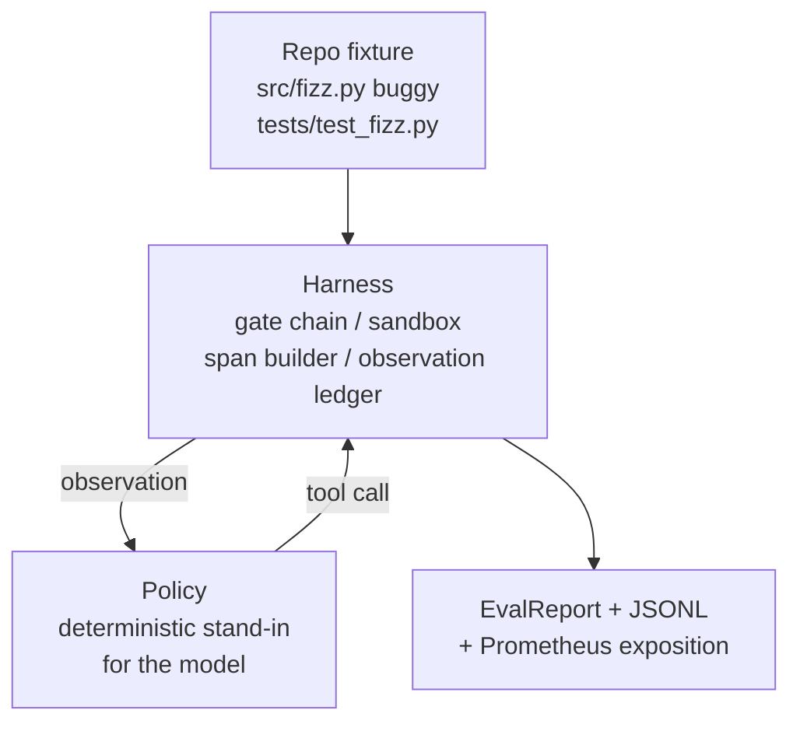
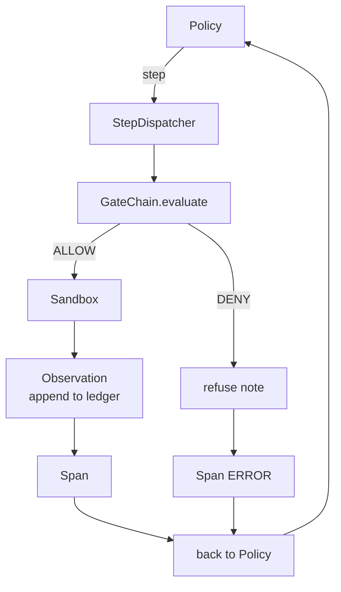

# 卡普斯顿课29: 终端编码代理在上

> 追踪A的回报. 这一课将门链,沙盒, eval 带,和OTel 扩展到一个工作编码代理, 代理是一个确定性政策,而不是一个 LLM; 替代使课程可复制, 合同是相同的:一个真正的模型插入了政策接.

> **【中文解读】**本节是综合项目端到端研究演示的完整集结.


**Type:** Build | **类型:** Build
**Languages:** Python (stdlib) | **语言:** Python (stdlib)
**Prerequisites:** Phase 19 · 25 (verification gates), Phase 19 · 26 (sandbox), Phase 19 · 27 (eval harness), Phase 19 · 28 (observability), Phase 14 · 38 (verification gates), Phase 14 · 41 (workbench for real repos), Phase 14 · 42 (agent workbench capstone) | **前置知识:** Phase 19 · 25 (verification gates), Phase 19 · 26 (sandbox), Phase 19 · 27 (eval harness), Phase 19 · 28 (observability), Phase 14 · 38 (verification gates), Phase 14 · 41 (workbench for real repos), Phase 14 · 42 (agent workbench capstone)

>  前置代理套装10/10(轨道A 收官) 整合20-28 全部 + 阶段14·38/41/42。
> 端到端编码代理 = "组装完成的车"――把门链,沙箱,eval harness、OTel 成一个能修真实多文件Python bug的代理――关键设计:用确定性策略取代LLM(让课程可复现),证明 harness 才是有趣的部分真模型在策略接口处接入即可.
**Time:** ~90 minutes | **时间:** ~90 minutes

## 学习目标

- 组建门链,沙盒,评估带,和跨度构建器成一个单个代理循环.
  中文翻译:将门链,沙盒,评估带和跨度构建器组合成一个代理循环.
- 执行一个确定性政策,使用 read_file, run_tests和 write_file来修复一个固定错误.
  中文翻译:执行一个确定性政策,使用 read_file, run_tests和 write_file来修复一个固定错误.
- 执行全球步骤预算加上观察代币预算在一段终端运行中.
  中文翻译:在一段时间内执行全球步骤预算加上观察代币预算.
- 发出完整的OTel GenAI痕迹和Prometheus指标,以实现完整运行.
  中文翻译:为全运行发出完整的OTel GenAI痕迹和Prometheus指标.
- 检查代理在不到12个步骤中解决了问题, 没有任何法律工具的关门.
  中文翻译:验证代理在法律工具上没有任何门通.

## 问题问题

> **【中文解读】**大多数代理演示都是单独运行的:沙箱单独演示、评估线束单独演示、Span 发射器单独演示──看起来没问题,但一旦组合起来,接口隙就暴露了──本节将这些组件集成到一个完整的编码代理中,验证系统级集成是否正确──

许多代理演示都独立工作:一个沙盒,一个评估带,一个跨度发射器.它们看起来很好.

> 大多数代理演示都独立工作:一个单独的沙盒,一个单独的评估带,一个单独的跨度发射器.


门链说允许,但沙箱拒绝, 评估器记录了通行,但Otel的范围说,门拒绝了代理声称使用的工具. 预测计器应增加两次, 监测预算超出了,但代理人继续继续,因为预算被追踪在链上,

> 门链说允许,但沙箱拒绝, 评估器记录了通行,但Otel的范围说,门拒绝了代理声称使用的工具. 预测计器应增加两次, 监测预算超出了,但代理人继续继续,因为预算被追踪在链上,


这一课是整条轨道的整合测试. 经理必须做四件事:阅读项目,运行测试,识别测试失败的错误,写作修正,重启测试,停止. 每个操作都通过门链. 每个工具执行都通过沙盒. 每一步都包裹在一个跨度. 评估带在最后得分整个东西.

> 这个课程是整条轨道的整合测试. 代理必须做四件事:阅读项目,运行测试,识别测试失败的错误,写作修正,重启测试,停止. 每个操作都通过门链. 每个工具执行都通过沙盒. 每一步都包裹在一个跨度. 评估带在最后得分整个东西.


## 概念的概念

> **【中文解读】**代理的策略被建模为五状态有限状态机:SURVEY(浏览项目)、RUN_TESTS(运行测试)、INSPECT(检查失败文件)、FIX(写入修复)、VERIFY(验证修复)。每个状态应应对一次工具调用,每次调用都通过门链 审查――这种确定性设计使得结果可复制,便于测试验证――

> **【拓展：端到端 Agent 系统】**现代编码代理 如SWE-Agent (普林森, 2024) 和OpenDevin 采用类似架构:工具调用链 +门控 +沙箱执行──SWE-Agent 在SWE-Bench 上解决了约12%的真实GitHub问题,其核心循环与本节相同:读取 -> 定位 -> 编辑 -> 验证──区别在于使用LLM 取代确定性策略──



代理的政策是州机器.

`SURVEY`项目列表:经纪人读取项目列表. 下一个状态是RUN_TESTS.

> `SURVEY`经纪人读到项目列表.下一个状态是RUN_TESTS.


`RUN_TESTS`测试机器成功停止,否则下一个状态是INSPECT.

> `RUN_TESTS`经理执行测试指令.


`INSPECT`接下来是FIX.

> `INSPECT`接下来状态是FIX.


`FIX`接下来是 VERIFY.

> `FIX`经纪人写了修正文件.下一个状态是 VERIFY.


`VERIFY`试验命令再次执行. 如果测试通过,停止成功.否则停止失败.

> `VERIFY`经验人员再次执行测试命令.如果测试通过,停止成功.否则停止失败.


每个状态都与工具调用相匹配. 每个工具调用通过门链. 如果一个工具调用被拒绝,代理在追踪中报告拒绝并停止.

> 每个状态都与工具调用相匹配.每个工具调用通过门链.如果拒绝工具调用,代理会在追踪中报告拒绝并停止.


设备的错误是个单独的`fizz.py`确定性政策通过regex检测失败消息检测到错误并发出纠正的文件.将该政策取代为LLM不会改变使用合同.

> 设备 bug 是一个单独的`fizz.py`确定性政策通过regex检测失败消息检测到错误并发出纠正的文件.将该政策取代为LLM不会改变使用合同.


## 建筑,建筑
```figure
cg-harness-weave
```

## 建筑



每个前课原始的每一个课程都在最小的规模上重新实施.`main.py`它们的名称与25-28课程相匹配,所以概念地图是明确的.

> 课程自主.每一个前课原始的重新实施在最小的规模.`main.py`它们的名称与25-28课程相匹配,所以概念地图是明确的.


## 你会建造什么

`main.py`船舶:

1. 简单的带原始, 复制与25-28课程相同的名字:`GateChain`现在`Sandbox`现在`ObservationLedger`现在`SpanBuilder`现在`MetricsRegistry`现在,我们要去.
2. `CodingAgentPolicy`五个状态的状态机.
3. `Repo`助手:用捆绑的车装置做出痕.
4. `AgentRun`类:驱动保险,通过带,返回一个`AgentRunReport`现在,我们要去.
5. 捆绑式装置 (`fixture_repo/`) 配合 src/fizz.py, tests/test_fizz.py,以及预期的/对 eval 带的树.
6. 演示:从端到端运行政策, 打印一步一步的跟踪, 确认通过, 打印指标.

组装的固定件与27课任务结构相同的形状:一个buggy文件和一个测试文件.测试失败消息包含足够的信息,使得确定性政策能够识别解决方案.一个真正的LLM将做同样的工作,慢慢和更广泛的回忆,但它不会改变带的期望.

> 测试失败消息包含足够的信息,使得确定性政策能够识别解决方案.一个真正的LLM会做同样的工作,慢慢地和更广泛的召回,但它不会改变使用器的期望.


## 为什么政策不是法定士

> **【中文解读】**使用确定性策略替代LLM的原因有三:(1) 无需API 密钥和网络调用;(2) 消除随机性,测试可以断言精确的步骤数量;(3) 本课程关注的是线束(带) 本身而不是策略──LLM 通过相同的接口(政策接) 插入,不改变任何线束契约──

实际的LLM需要API密钥,网络调用,以及无法验证的 stochasticity. 带是课程关心的部分. 确定性政策中 Subbing 允许课程在任何开发者笔记本电脑上运行,并且允许测试套件确切地计算步骤.

> 一个真正的LLM需要API密钥,网络调用和无法验证的 stochasticity. 带是课程关心的部分. 确定性政策中 Subbing 允许课程在任何开发者笔记本电脑上运行,没有外部依赖,并且允许测试套件确切地计算步骤.


课程的政策是一个严格的子集,一个LLM代理所做的.政策阅读了备忘录,看到失败的测试,识别了线路,并发出了修正.一个LLM通过相同的循环与相同的使用合同;会计是相同的.

> 课程政策是一个 LLM 代理所做的严格子集. 政策阅读了备忘录,看到失败测试,识别了线路,并发出了修正. LLM 通过相同的循环与相同的使用合同; 会计是相同的.


## 演示所说的

> **【拓展：Agent 评估方法论】**端到端 评估代理的核心挑战在于定义"成功"――OpenAI的SWE-Bench使用真实GitHub PR作为基准,要求代理在多文件项目中生成通过现有测试补丁――本节的五个断言:

测试组将程序性地重新确认它们.

> 通过 ENd到端的演示,在退出时,确认了五件事,


政策在不到12步的时间里解决了这个问题.

观察预算从未过度过.

没有人能说,我在这个问题上,

> 没有人能说"拒绝工具" (经纪人从来没有发明过一个拒绝工具的名字)


每一步都在线路上有相应的跨度.

普罗梅泰斯的展览包含一个`tools_called_total{tool="read_file"}`进入和一个`tool_latency_ms`瘤图

> 染物暴露含有`tools_called_total{tool="read_file"}`进入和一个`tool_latency_ms`历史图.


## 如何与A轨道的其他部分相结合

> **【中文解读】**本课是 Track A 的集成测试. 第25课编写了Gate Chain, 第26课编写了沙箱, 第27课编写了评估线束, 第28课编写了可观测性, 第29课证明它们作为系统协同工作.

这一课是集成. 第25课写了门链. 第26课写了沙箱. 第27课写了评估带. 第28课写了可观性. 第29课证明它们作为系统工作. 从这里开始,一个真正的代理带延伸到:换取确定性政策为模型,换取捆绑的固定物为实体复制任务,换取JSONL出口者为OTLP.

> 这个课程是集成. 第25课写了门链. 第26课写了沙箱. 第27课写了评估带. 第28课写了可观性. 第29课证明它们作为系统工作. 从这里开始,一个真正的代理带延伸到:换取确定性政策为模型,换取捆绑的固定物为实体复制任务,换取JSONL出口物为OTLP.


## 运行.

```bash
cd phases/19-capstone-projects/29-end-to-end-coding-task-demo
python3 code/main.py
python3 -m pytest code/tests/ -v
```

测试打印每步的跟踪,最终评估报告和Prometheus曝光.出口代码为零.测试涵盖政策状态转变,合成工具调用的门拒绝,捆绑的装置的端到端运行和步骤预算不变.

> 测试将每步的跟踪,最终评估报告和Prometheus曝光量打印.出口代码为零.测试涵盖政策状态转变,合成工具调用的关口拒绝,捆绑的设备的端到端运行和阶段预算变量.

