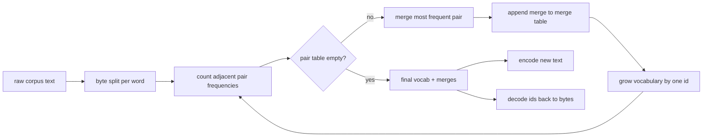
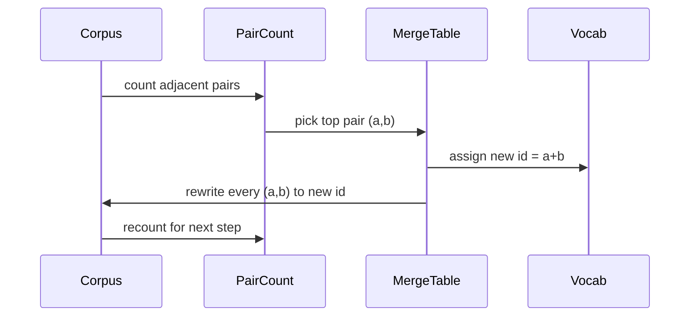

# 现在,我们在头上,

> 构建每个现代文本模型仍然从哪里开始的代币.

> **【中文解读】**本节是综合项目从零构建BPE 分词器.


**Type:** Build | **类型:** Build
**Languages:** Python | **语言:** Python
**Prerequisites:** Phase 04 lessons, Phase 07 transformer lessons | **前置知识:** Phase 04 lessons, Phase 07 transformer lessons
**Time:** ~90 minutes | **时间:** ~90 minutes

>  前置LLM 从零轨B 第1节(30-49) ─综合阶段04 +阶段07──
>  BPE = "所有现代文本模型的入口"──字节进→id 出→id 回到相同字节──20节系列将从零搭出完整的LLM 训练管线:分词器→数据集→嵌入→注意力→变压器块→GPT 组装→训练循环→加载预训练权重→分类器微调→SFT→DPO→评估→大数据下载→HDF5语料→学习率→梯度剪裁→积累→检查点→分布式→评估套装──

## 学习目标
- 通过重复合并最常见的邻近符号对来从原始文本体中训练字节对编码词汇.
  中文翻译:通过重复合并最常见的邻近符号对,从原始文本体中编码字母.
- 实现确定性结合表,并将其应用到新文本中,以生成子词ID的流.
  中文翻译:实现确定性融合表,并将其应用到新文本中,以生成字母代码的流.
- 无需输入信息,即可输入信息.
  中文翻译:无需输入信息,无需输入信息.
- 储备和保护特殊代币 (`<|endoftext|>`现在`<|pad|>`它们可以生存在训练和解码中.
  中文翻译:保留和保护特殊代币 (`<|endoftext|>`现在`<|pad|>`它们可以生存在训练和解码中.
- 为什么字节级字母是一般用途代码符号的合适地板.
  中文翻译:为什么字节级字母是一般用途代码符号的合适地板.

```figure
cap-bpe-merge
```

## 框架

> **【中文解读】**语言模型从不直接处理文本,它只处理整数――从字符串到整数列表 (及反向) 的映射就是分词器――如果这个层出错,整个训练的损失曲线都在测量错误的东西――BPE的核心思想是:从已知字母表出发,反复合并最高频率的相邻符号对,直到词汇表达到目标大小――

> **【拓展：GPT 系列分词器】**GPT-2 使用的是字节级BPE(本节实现的变体),词汇表 50257个代币――GPT-4 使用Tik Token,一种基于BPE的高性能 Rust实现,cl100k_base 词汇表约100k――LLaMA 系列使用SentencePiece的BPE变体,词汇表 32k-128k――分词器的选择直接影响模型处理多语言、代码和特殊字符的能力――GPT-4的 cl100k_base 在代码任务上比GPT-2的分词器压缩率高约30%――地图从字符串到整数列表是代码器. 错误的测量,每一个输失曲线都测量错误的东西.

对于一般文本模型的子词代码符号的主要家族是字节对编码. 这个想法很小.从已知字母开始.在训练组中最常出现的相邻符号对找出.将其融合到一个新的符号中.重复直到词汇达到目标尺寸.编码新文本使用相同的并列列.

> 对于一般文本模型的子词代码符号符号符号的主要家族是字节对编码. 这个想法很小.从已知字母开始.在训练组中最常出现的相邻符号对找出.将其融合到一个新的符号中.重复直到词汇达到目标尺寸.编码新文本使用相同的并并列列列表.


我们将构建字节级别的变体.字母是256个原始字节,而不是Unicode代码点.这个选择是允许代币器处理任何UTF-8输入,而不需要回到未知的代币.

> 我们将构建字节级变体――字母表是256个原始字节,不是Unicode 码点――


## 管道



训练侧和推理侧共享 merge 表. 合同是共享. 如果在推理时改变 merge 顺序,你将解码一个不同的 ID 流.

> 训练侧和推理侧共享合并表.


## 字节字母

首先,256个ID为原始字节0x00到0xFF保留.这保证每个输入字符串在任何合并发生之前可以在词汇中表达.在字节块之后,我们为特殊代币保留了一个小范围.训练循环从来没有提出这些ID作为合并目标,因为我们完全将它们排除在预定的流中.

> 预留给原始字节 0x00 到 0xFF


预测器在训练之前将体积分为白空间和点击界限.没有这种分离,BPE 合并步骤会很高兴地学习跨越词界限的合并,词汇库充满了整个普通短语.随着分离,合并留在一个词内,结果将通用化.

> 预分词器在空白和标点边界分语料库.


## 训练循环

> **【中文解读】**训练循环每步做三件事: 1) 遍历语料库中的每一个词,统计当前相邻符号对出现频率的频率; 2) 选择频率最高的符号对; 3) 将这个符号对重写为一个新的单一符号 (ID 为词汇表中的下一个空槽) ;;成本随语料的小线性增长,但由于符号序列随着合并不断缩短,实际速度很快.

循环对每一步进行了三项操作.它在体积中走过每一个词,并计算出每个相邻的当前符号的出现频率,按词本身的出现频率进行权重.它选择了最高数量的对.它将该对的每一个出现重写成一个新的符号,其ID是词汇中的下一个自由插槽.然后记录了合并.

> 对于每一步训练,循环做了三件事.它在体内走过每一个词,并计算出每个邻近的当前符号对的出现频率,按词本身的出现频率进行权重.它选择了最高数量的对.它将该对的每一个出现重写成一个新的符号,其 id 是词汇中的下一个自由插槽.然后它记录了合并.




每一步的成本是以象征序列列列表表达的体积为线性的.对于百万个字和一万个标识的目标词汇,循环在几秒钟内完成,因为随着合并而降落,象征序列缩小.

> 每步的成本与符号序列列表表示的语料库的成线性关系.


## 编码新文本

> **【中文解读】**推理时不运行合并计器,而是按训练时的学习顺序应用合并表――对新词,编码器从字节切分开始,扫描当前序列排名最低的选,执行该合并,再扫描,直到没有合并可应用――按排名排序保证编码的确定性和与训练行为一致性――

推理不调用合并计数器.它用它学习的顺序来应用合并表.对于一个新词,编码器从字节分区开始.它扫描当前的序列,寻找最低排名的合并 (最早的应用).它执行该合并.它再次扫描.循环结束时没有合并在表中适用于当前的序列.

> 推理不调用合并计器,而是按学习顺序应用合并表.


排列排列是使编码确定性和匹配相同输入的训练行为的属性.首先学习的结合位于表顶部,然后首先应用.如果两个结合可以在同一位置应用,则较低排列的结合赢得.

> 按排名排序使编码确定性并与训练行为匹配.


## 特殊代币

> **【拓展：生产分词器的特殊 token】**真实LLM 使用更多特殊代币――GPT-2 使用 `<|endoftext|>`聊天ML格式增加了`<|im_start|>`和 `<|im_end|>`◎     `[INST]`,我知道.`[/INST]`,我知道.`<<SYS>>`,我知道.`<</SYS>>`◎   ◎ ◎`<|begin_of_text|>`,我知道.`<|end_of_text|>`,我知道.`<|start_header_id|>`等超过10种特殊标记. 这些标记在BPE合并过程中被排除,仅在模板拼接时插入.

- `<|endoftext|>`预训练期间将文件分开. 它告诉模型"一个新的文件从这里开始,不要让前一个文本的背景泄露.
  翻译: 中文`<|endoftext|>`预训练期间将文件分开. 它告诉模型"一个新的文件从这里开始,不要让前一个文本的背景泄露.
- `<|pad|>`子可以是矩形子,而损失面具在训练期间隐藏它.
  翻译: 中文`<|pad|>`子可以是矩形子,而损失面具在训练期间隐藏它.

编码器接受一个旗,允许输入中的特殊代币.`<|endoftext|>`其他`<|pad|>`字符串将被将其标记为标记字节,并且不会被任何一个字符串合并.

> 编码器接受一个旗,允许输入中的特殊代币.`<|endoftext|>`其他`<|pad|>`字符串将被将其标记为标记字节,并且不会被任何一个字符串合并.


## 往返保证

> **【中文解读】**编码后解码必须精确返回输入字节――解码器按顺序拼写每个ID的字节展开――因为每个ID要么是原始字节,要么是两个已知ID的拼写,递归展开总是终止原始字节――这一往返保证分词器正确的基础性,测试套件在未见句子内含有Unicode情感符号的句子内含字面量.`<|endoftext|>`证实这一质量.

编码后,解码必须返回输入字节.解码器将每个 id 的字节扩展连接.由于每个 id 是原始字节或是以前已知的两个 id 的连接,复式扩展总是以原始字节结束.解码后返回这些字节拼写的 UTF-8 字符串.

> 编码后解码必须精确返回输入字节.


在本课程的测试套件检查了这个属性,在一个未见的句子上,在一个用 Unicode 符号表情符号的句子上,`<|endoftext|>`标志.

> 本课程的测试套件在未见句子、含有Unicode情感符号的句子和含字面量标志的句子上检查该属性──


## 这一课不做什么

它不会按照最大的生产代币器的风格建造以regex驱动的预代币器. 预定式是一个小的白色空间和分区. 只有在一个小的培训组中进行合理的合并,与其他课程链的合同保持不变. 下一堂课将代币器视为一个黑盒子,

> 它不构建正则驱动的预分词器.


字符串的数值不等于对数.在Python中,一个循环在几千个字体上完成在不到一秒钟.对于较大的字体来说,显而易见的举动是平行计算每个字的对,然后减少.

> 它不配行对计器.


## 如何读取代码

`main.py`定义了四个对象.`BPETokenizer`包含词汇库,合并表和特殊标志表. `train`训练循环.`encode`论的路径.`decode`底部的演示符号将一个小型代币器在内置的体积上训练,编码一个长期的句子,解码了ID,然后打印了两者.`code/tests/test_bpe.py`定回路属性,特殊代币预订,并购订单.

> 主.


运行演示. 然后将演示中的目标词汇大小从300变为600,看看被保留的句子的编码长度如何下降.

> 运行演示.

