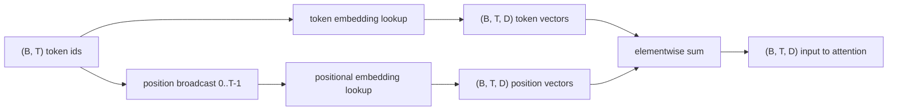
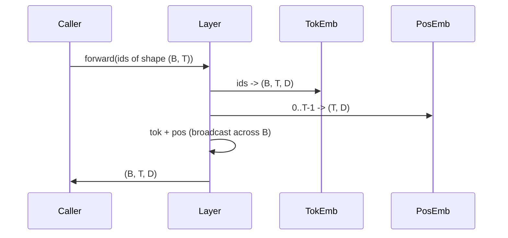

# 标志和位置嵌入

> 模型需要向量.两个查找表坐在他们之间,选择位置的一个塑造模型可以学习什么.

> **【中文解读】**本节是综合项目实现代币位置嵌入.


**Type:** Build | **类型:** Build
**Languages:** Python | **语言:** Python
**Prerequisites:** Phase 04 lessons, Phase 07 transformer lessons, Lessons 30 and 31 of this phase | **前置知识:** Phase 04 lessons, Phase 07 transformer lessons, Lessons 30 and 31 of this phase
**Time:** ~90 minutes | **时间:** ~90 minutes

>  前置 轨道B3/20──基于30+31──
>  id 是整数,模型要向量──两个查找表在中间──位置编码选择──绝对/相对/RoPE) 决定模型能学到什么──参考 阶段 7·04 RoPE──

## 学习目标
- 建立一个嵌入符号的搜索表,将词汇标识映射到密集向量.
  中文翻译:建立一个嵌入符号的搜索表,将词汇标识映射到密集向量.
- 建立一个按位置索引的学习位置嵌入式查找表.
  中文翻译:建立一个按位置索引的学习位置嵌入式查找表.
- 建立一个固定的鼻状位置嵌入,按位置索引,没有参数.
  中文翻译:建立一个固定的阴影状位置嵌入,按位置索引,没有参数.
- 组合代币和定位嵌入式为变压器块的单个输入.
  中文翻译:将代币和定位嵌入组合成一个变压器块的单个输入.
- 长度概括和参数数数的对比学和阴影形嵌入式.
  中文翻译:对比学会和长度概括和参数数量上的突嵌体.

```figure
cc-embedding-lookup
```

## 框架

> **【中文解读】**模型与代币ID的第一次接触是代币 嵌入矩阵的行查找──矩阵有 V 行(每行对应一个词汇 ID) 和 D 列(模型维度) ─ 代币ID 本身无序信息,模型需要第二个信号区分位置 1 和位置 17──两种主流选择:学习型位置嵌入式(第二个查找表) 和固定正弦位置嵌入式(数学公式,无参数) ─

> **【拓展：位置编码的演进】**位置编码从变压器原论文的正弦编码(2017) 发展到GPT-2的学习型位置编码,再到GPT-NeoX/GPT-3的旋转位置编码(RoPE,2021) 以及BLOOM使用的ALiBi(2022) 通过Q/K投影后施加位置相关的旋转矩阵实现相对位置编码,已成为LLaMA、MistralQwen等主流LLM的标准选择. 搜索返回一个向量,其余模型将其视为ID的意义. 后方支持更新前进通行中使用的行列. 通过训练这些行程的几何学会编码方向的相似性.

只有代币身份证就没有序列. 模型需要第二个信号,告诉它位置1与位置17不同. 对于该信号的两个主要选择是学习的位置嵌入 (第二个查找表,每位置一行) 和固定的鼻状位置嵌入 (没有参数的数学公式). 这种选择有后果. 学习表是一个参数,由模型训练的最大文本长度来界定. 理论上,一个阴影形表是没有参数的,公式扩展到任何位置,但这门课程是`SinusoidalPositionalEmbedding`预计一个固定表在`max_context_length`其他`forward`模型可能仍然在经历训练长度,即使表是足够大的以索引.

> 只有代币身份证就没有序列.


这一课构建了两者,并将它们构成一个单个输入符号,

> 本课构建该契约.


## 形状合同

嵌入阶段的输入是一个批量形状的标志 ID `(B, T)`输出是形状子`(B, T, D)`在哪里`D`任何批量元素的背景长度都相同`T`每个位置都有相同的向量尺寸`D`现在,我们要去.

> 输入嵌入阶段是一个批量形状的代码.`(B, T)`输出是形状子`(B, T, D)`在哪里`D`任何批量元素的背景长度都相同`T`每个位置都有相同的向量尺寸`D`现在,我们要去.




总结是总和,而不是连接.`D`通过网络的恒定,使模型根据每个特征决定符号意义或位置是否在每个层中占主导地位.

> 总结是总和,而不是连接.`D`通过网络的恒定,使模型根据每个特征决定符号意义或位置是否在每个层中占主导地位.


## 符号嵌入矩阵

> **【中文解读】**标志嵌入是形状为`(V, D)`转向传播是单次索引操作:PyTorch将`(B, T)`的 int64 ID 映射为`(B, T, D)`转向传播仅为前向传播中触及的行累积梯度.

符号嵌入是形状参数子`(V, D)`在哪里`V`字母是字体的尺寸.`nn.Embedding(V, D)`在 init 中,输入是从小的高斯式中得到的,传统上是平均零和标准偏差大约`0.02`对于变压器尺度模型来说,精确的 init 比在运行中保持一致的更少.

> 符号嵌入是形状参数子`(V, D)`在哪里`V`字母是字体的尺寸.`nn.Embedding(V, D)`在 init 中,输入是从小的高斯式中得到的,传统上是平均零和标准偏差大约`0.02`对于变压器尺度模型来说,精确的 init 比在运行中保持一致的更少.


向前传递是单次索引操作.`(B, T)` int64 个体`(B, T, D)`后行仅积累了触及前行的行列的梯度.两行从未出现在批量中得到的梯度是零的.

> 光图图 光图图图图图图图图图图图图图`(B, T)` int64 个体`(B, T, D)`后行仅积累了触及前行的行列的梯度.两行从未出现在批量中得到的梯度是零的.


细节.模型末端的代币嵌入和输出投影通常共享重量 (重量绑定).当这种情况发生时,每次倒退的传递都通过输出侧触及嵌入的每一行.这里的课程都将它们作为单独的模块暴露出来,但同一矩阵可以在完整模型中发挥两个作用.

> 一个微妙的细节.模型末端的代币嵌入和输出投影通常共享重量 (重量绑定).当这种情况发生时,每次倒退的传递都通过输出侧触及嵌入的每一行.这里的课程都将它们作为单独的模块暴露出来,但同一矩阵可以在完整模型中发挥两个作用.


## 学习的位置嵌入

学习的位置嵌入是第二个`nn.Embedding`形状`(max_context_length, D)`搜索按位置ID键进行`0, 1, 2, ..., T-1`发射向前传输,将该位置向量传输到批量维度.

> 学习定位嵌入是第二个`nn.Embedding`形状`(max_context_length, D)`搜索按位置ID键进行`0, 1, 2, ..., T-1`发射向前传输,将该位置向量传输到批量维度.


学习表的缺点是,它不能在位置上查询.`T`如果模型只训练到位置`T-1`仅使用这种方案的生产解码器模型将最大的文本长度放入了架构中,拒绝处理更长的输入.

> 学习表的缺点是,它不能在位置上查询.`T`如果模型只训练到位置`T-1`仅使用这种方案的生产解码器模型将最大的文本长度放入了架构中,拒绝处理更长的输入.


## 状位置嵌入

> **【中文解读】**正弦位置嵌入是位置向向量函数,无参数――其关键性:位置 p+k 的向量是位置 p 向量的线性函数,这为注意层提供了学习相对位置偏移的捷径――低维码粗粒度位置,高维码细粒度位置――波长在特征维度上的几何级数变化――

> **【拓展：RoPE 与 ALiBi 的实际效果】**通过旋转矩阵编码相对位置,通过NTK意识扩展上下文窗口,支持通过NTK意识扩展下文窗口,如Code Llama从16K扩展到100K) ⋅ALiBi(Press et al., 2022) 在BLOOM-176B中使用,直接在注意力分数上加线偏移,训练时无需位置编码参数,推理时可推进到训练长度的2-5倍.

位置向向量函数.`p`功能`i`产品

> 位置 位置 位置 位置 位置 位置 位置 位置 位置 位置 位置 位置 位置 位置 位置 位置 位置 位置 位置 位置 位置 位置 位置 位置 位置 位置 位置 位置 位置 位置 位置 位置 位置 位置 位置 位置 位置 位置 位置 位置 位置 位置 位置 位置 位置 位置 位置 位置 位置 位置 位置 位置 位置 位置 位置 位置 位置 位置 位置 位置 位置 位置 位置 位置 位置 位置 位置 位置 位置 位置 位置 位置`p`功能`i`制作的


```python
angle = p / (10000 ** (2 * (i // 2) / D))
emb[p, 2k]     = sin(angle)
emb[p, 2k + 1] = cos(angle)
```

函数没有参数.每个位置都有一个独特的向量.波长在各个特征维度之间几何变化,因此较低维度编码粗大位置,较高维度编码细位置.

> 函数没有参数.每个位置都有一个独特的向量.波长在各个特征维度之间变化几何,因此较低维度编码粗大位置,较高维度编码细位置.


选择后的财产`sin`其他`cos`总体而言,在位置上的向量`p + k`是位置上的向量线性函数`p`这使得注意层能够学习相对位置偏移的简单途径.模型不需要单独的参数来表达"看五个代币".

> 选择后产品`sin`其他`cos`总体而言,在位置上的向量`p + k`是位置上的向量线性函数`p`这使得注意层能够学习相对位置偏移的简单途径.模型不需要单独的参数来表达"看五个代币".


课程计算了整体阴形表,在构建时,并将它指数列出在前面时间.

> 列森在构建时计算了整个阴影形表,并在前进时间将其索引.


## 组成

输入管道排序上做了三个事情.阅读代币ID,查找代币向量,添加位置向量,返回总数.

> 输入管道排序三件事.阅读代币ID,查找代币向量,添加位置向量,返回总数.




总体阶段的广播重复了`(T, D)`随着波动的尺寸,PyTorch自动处理,因为位置子有形状.`(1, T, D)`在不挤后.

> 总量步骤中播放`(T, D)`随着波动的尺寸,PyTorch自动处理,因为位置子有形状.`(1, T, D)`在不挤后.


## 对比分析

> **【中文解读】**学习型变体增加`max_context_length * D`个参数,正弦变体增加零──相邻位置嵌入间的余弦相似度:正弦变体平滑衰退(函数连续),学习型变体在初始化时接近随机(各行独立抽取),训练后通常发展出类似的平滑结构,但必须从数据中学习──

课程将两种变体都运行在同一输入上,

> 莱森在同一输入中运行两种变体,并打印了两种诊断.


首先是参数数. 学习的变体添加了`max_context_length * D`符号嵌入的参数上方. 阴影形变体增加了零.

> 首先是参数数. 学习的变体添加`max_context_length * D`符号嵌入的参数上方. 阴影形变体增加了零.


第二个是,在邻近位置的嵌入式之间的共数相似性. 由于功能是连续的,而突形变体具有平滑且可预测的衰变. 在初始化时,学习的变体几乎随机相似,因为行列是独立地绘制的. 训练后,学习的变体通常会发展出类似的光滑结构,但它必须从数据中发现这种结构.

> 第二,在邻近位置的嵌入式之间存在的共数相似性. 由于功能是连续的,而突形变体具有平滑且可预测的衰变. 在初始化时,学习的变体几乎随机相似,因为行列是独立地绘制的. 训练后,学习的变体通常会发展出类似的光滑结构,但它必须从数据中发现这种结构.


## 这一课不做什么

它不构建旋转位置编码 (RoPE) 或AliBi.这些是生产变压器的现代选择.它们都遵循如本文嵌入式一样的形状合约 (应用位置依赖的变化到形状向量`(B, T, D)`接下来的课程构建了注意力区块,一个可选的扩展是将旋转折叠到查询键投影中.

> 它不构建正则驱动的预分词器.


训练需要一个损失,需要一个模型输出,需要注意力和一个LM头.这是下一个课程,然后一个.

> 它不会训练嵌入.


## 如何读取代码

`main.py`定义了三个模块.`TokenEmbedding`包裹`nn.Embedding(V, D)`现在,我们要去.`LearnedPositionalEmbedding`包裹`nn.Embedding(L, D)`现在,我们要去.`SinusoidalPositionalEmbedding`预计表,并将其作为缓冲器.`EmbeddingComposer`图表下面的示范图印制了形状,参数数和邻居位置相似性诊断.`code/tests/test_embeddings.py`形,广播行为,参数数量和鼻状公式.

> 主.


运行演示,然后更改模型尺寸.`D`通过 64 个到 32 个,观察阴道波长带的变化.

> 运行演示,然后更改模型尺寸.`D`通过 64 个到 32 个,看看阴道波长带如何改变.

