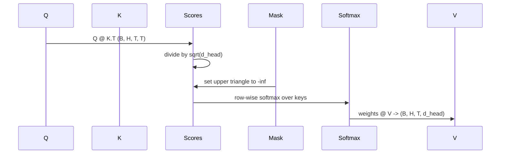

# 更多的注意力

> 一个线性投影,三个视图,H平行头,一个面具.

> **【中文解读】**本节是实现多头自注意机制的综合项目.


**Type:** Build | **类型:** Build
**Languages:** Python | **语言:** Python
**Prerequisites:** Phase 04 lessons, Phase 07 transformer lessons, Lessons 30 through 32 of this phase | **前置知识:** Phase 04 lessons, Phase 07 transformer lessons, Lessons 30 through 32 of this phase

>  前置轨B 4/20──阶段7·01-03 注意力数学从零实现──
>  多头注意力 = "并行多视角观察"――一次线性投影→三个视图(Q/K/V)→H 个并行头→一个掩码――这就是模型实际使用的注意力块――
**Time:** ~90 minutes | **时间:** ~90 minutes

## 学习目标
- 执行批量查询/关键/值投影,作为一个单一线性层分为H头.
  中文翻译:将一个批量查询/关键/值投影作为一个单一线性层分为H头.
- 计算点产品关注量度,使用正确的正常化和d型处理.
  中文翻译:通过正确的正常化和dtype处理计算点-产品关注.
- 应用因果化面具,防止位置在未来位置上进行处理.
  中文翻译:应用一个因果化面具,防止一个位置进入未来的位置.
- 检查每头注意力重量,以确定每个头的输入和理由.
  中文翻译:检查每头注意力重量,以确定每个头头看着什么.
- 训练一个小的注意力块在玩具任务和看损失下降,
  中文翻译:训练一个小注意力块在玩具任务,看头部专业化时损失下降.

```figure
cap-multihead-attention
```

## 框架

> **【中文解读】**注意力是让符号表征从同序列中的其他符号 拉取信息的函数――自注意力意味着Q、K、V都来自同一个输入――多头意味着投影被切成H个并行的注意力问题,输出拼接后再投影――高效实现模式:一个线性层从D投影到3D,切成三个视图,重塑为H个头――

> **【拓展：注意力机制的生产实现】**通过分块计算和核融合将注意力计算速度提升2~4倍,显存占用从O(N^2) 降至O(N) ・Flash Attention-2 (2023) 进一步优化到接近理论算力上限――GQA (Groupped Query Attention,Ainslie et al., 2023) 在LLaMA-2 和Mistral中使用,将KV头数降至Q头数的 1/4 到 1/8,显着低推理显存储――MQA (Multi-Querytion) 在PaLM和StarCoder中使用,所有Q头共享一组K/V──自主关注意味着查询,关键和值都来自同一输入. 多头意味着投影分为H平行注意力问题,其输出是连接并投影回来的.

有效的实施模式是从 `D`为了`3 * D`然后将其切成三个视角,然后再塑造成H尺寸的头.`D // H`,软max和重量总数都会发生在批量子操作中,

> 有效的实施模式是从 `D`为了`3 * D`然后将其切成三个视角,然后再塑造成H尺寸的头.`D // H`,软max和重量总数都会发生在批量子操作中,


通过这个课程,它构建了这个块.它还添加了因果化面具,所以同样的代码就像一个单独解码语言模型中的注意层一样工作.下一个课程将块堆积成一个完整的变压器,然后课程将它训练.

> 本课构建该契约.


## 形状合同

输入是`(B, T, D)`输出量是`(B, T, D)`面具是`(T, T)`在区块内,中间子有形状.`(B, H, T, d_head)`在哪里`d_head = D // H`限制是`D % H == 0`现在,我们要去.

> 输入是`(B, T, D)`输出量是`(B, T, D)`面具是`(T, T)`在区块内,中间子有形状.`(B, H, T, d_head)`在哪里`d_head = D // H`限制是`D % H == 0`现在,我们要去.

```mermaid
flowchart LR
    A["(B, T, D) input"] --> B[Linear D -> 3D]
    B --> C["split into Q, K, V"]
    C --> D["reshape to (B, H, T, d_head)"]
    D --> E["scores = Q @ K.T / sqrt(d_head)"]
    E --> F[apply causal mask]
    F --> G[softmax over keys]
    G --> H["context = weights @ V"]
    H --> I["reshape to (B, T, D)"]
    I --> J[output Linear D -> D]
    J --> K["(B, T, D) output"]
```




两个线性层 (QKV投影和输出投影) 是区块中的唯一参数.面具,软max,和重塑都是没有参数的.

> 两个线性层 (QKV投影和输出投影) 是区块中的唯一参数.面具,软max,和重塑都是没有参数的.


## 车分裂

简单的实现有三个单独的线性层,每个层为Q,K和V.`3 * D`两个数学上相当,因为三个分别的矩阵乘法为`(D, D)`重量是正确的一个矩阵乘以一个`(3D, D)`他们被重量堆积.

> 简单的实现有三个单独的线性层,每个层为Q,K和V.`3 * D`两个数学上相当,因为三个分别的矩阵乘法为`(D, D)`重量是正确的一个矩阵乘以一个`(3D, D)`他们被重量堆积.


效率更快,因为加速器启动一个matmul而不是三个.它也更容易初始化,因为三个子矩阵生活在相同的参数子,可以一起初始化.

> 由于加速器启动一个matmul而不是三个,所以有效版本更快.


## 头部的形状

后的分离,Q,K,V的每个是`(B, T, D)`为了把这变成H平行注意力问题,我们重新塑造为`(B, T, H, d_head)`转移到`(B, H, T, d_head)`现在头部的尺寸就在批量尺寸旁边,所以PyTorch把每头的注意力视为一个批量操作.`B * H`独立的实例.

> 在分区,Q,K,V的每个是`(B, T, D)`为了把这变成H平行注意力问题,我们重新塑造为`(B, T, H, d_head)`转移到`(B, H, T, d_head)`现在头部的尺寸就在批量尺寸旁边,所以PyTorch把每头的注意力视为一个批量操作.`B * H`独立的实例.


总体的尺寸保持在最后,所以分数是相对的`Q @ K.transpose(-2, -1)`结果是:`(B, H, T, T)`平均注意力.

> 总体尺寸保持在最后,所以分数是相对的`Q @ K.transpose(-2, -1)`结果是:`(B, H, T, T)`平均注意力.


## 规模化

> **【中文解读】**分数在软max 前除以`sqrt(d_head)`没有缩放时,点积随着头部的变化 增长而增长,将软max 推进一个入口占据几乎全部质量而其他入口极小的区域,梯度极小,学习停滞.`d_head`它们的度是微小的,学习的位. 分为`sqrt(d_head)`总体而言,在头部尺寸中,

## 原因面具

> **【中文解读】**由于这些问题,我们必须要做出一些决定.`(T, T)`分数矩阵对角线以上的每个位置被替换为负无穷,软max 后这些位置权重为零;.掩码注册为缓冲(不参与梯度计算),覆盖最大上下文长度,前向时切片 `(T, T)`现在,我们要去看看.

只有解码器语言模型才能在预测下一个代币时只能根据过去进行条件. 面具强制执行这一点. 具体来说,在软max之前,每一个输入都在线角上.`(T, T)`结果矩阵被负无限取代.

> 只有一个解码器语言模型才能在预测下一个代币时只能根据过去进行条件. 面具强制执行这一点. 具体来说,在软max之前,每一个输入都在线角上.`(T, T)`结果矩阵被负无限取代.




面具是面具的结构,它是面具的结构,它是面具的结构,它是面具的结构.`(T, T)`角落.

> 我们将面具作为缓冲器进行注册,所以它与模型相同的设备上生活,并且不是梯度图的一部分.面具覆盖了最大的文本长度,块将会看到.在前进时间,我们切断左上方`(T, T)`角落.


## 输出预测

按头的文本向量`(B, H, T, d_head)`我们将其转移到`(B, T, H, d_head)`改造成`(B, T, D)`通过最后的`(D, D)`没有它,H头只会通过后层重新结合,块将会被人工限制.

> 在每头的文本向量中`(B, H, T, d_head)`我们将其转移到`(B, T, H, d_head)`改造成`(B, T, D)`通过最后的`(D, D)`没有它,H头只会通过后层重新结合,块将会被人工限制.


## 注意重量检查

> **【拓展：注意力可视化与可解释性】**注意力权重分析是理解LLM行为的重要工具――人类的可解释性研究团队使用注意力头分析发现了一些"归纳头" (归纳头) 引感头,它们在上下文学习中起着关键作用――OpenAI的微镜项目可视化GPT-2各层次的注意力模式――不同学习模式:某些关注紧邻的前一个代币,某些关注句开头,某些几乎均分布――

课程揭示了`return_weights=True`按前进传输的标志. 当设置时,块返回每头的注意重量.`(B, H, T, T)`显示器将一个头的重量图打印在一个短输入中,以便你能看到因果三角形结构和每位重点.

> 课程揭示了`return_weights=True`按前进传输的标志. 当设置时,块返回每头的注意重量.`(B, H, T, T)`显示器将一个头的重量图打印在一个短输入中,以便你能看到因果三角形结构和每位重点.


在训练模型中,不同头脑学习不同的模式.有些头脑关注直接前面的符号.有些头脑关注序列的开始.有些头脑几乎均地传播注意力.检查是解释性工作的入口点.

> 在训练模型中,不同头脑学习不同的模式.一些头脑关注直接前的代币.一些头脑关注序列的开始.一些头脑几乎均地传播注意力.检查是解释性工作的入口点.


## 训练演示

底部的演示`main.py`导线注意区块到一个小的LM头,并训练整个东西重复任务.输入的每个行是整个文本中复制的单个随机ID.目标是一个转移的输入,所以模型必须学习下一个代币与前一个代币相同.损失是交叉.H=4,D=32,T=12,和64的词汇,损失从随机 (约`log(64) ~ 4.16`) 低到很低`1.0`在CPU上使用了3个时代.

> 底部的示范`main.py`导线注意区块到一个小的LM头,并训练整个东西重复任务.输入的每个行是整个文本中复制的单个随机ID.目标是一个转移的输入,所以模型必须学习下一个代币与前一个代币相同.损失是交叉.H=4,D=32,T=12,和64的词汇,损失从随机 (约`log(64) ~ 4.16`) 低到很低`1.0`在CPU上使用了3个时代.


演示的目的不是训练一个有用的模型. 目的是确认梯度通过每块块流动,

> 演示的目的不是训练一个有用的模型. 目的是确认梯度流动通过每块块,


## 这一课不做什么

实际模型中的变压器层是注意力,其次是两个层的MLP,每个层周围有剩余连接和层规范.下一个课程增加了这些.

> 它不添加一个输送块.


它不实现旋转或AliBi定位编码.这两者都适用于同一块的QKV投影阶段,但它们是一个独立的教学单位.在这里构建的块是通过在matmul之前转换Q和K相容的.

> 它不实现旋转或AliBi位置编码.


它不实现KV缓存推理.在前进传递中缓存键和值是使自动降解快速的优化.它改变K和V子上的形状合约,但不是Q上的.它属于推理课程.

> 它不实现KV缓存推断.


## 如何读取代码

`main.py`定义`MultiHeadSelfAttention`现在,我们要去. 课程有两个线性层和一个注册的面具缓冲器. 通过前进的项目,重塑,分数,面具,软件,重量,重塑,再重塑. 下面的演示模型建立了一个小模型,它用符号和位置嵌入和LM头来吸引注意力, 测试在`code/tests/test_attention.py`定形状合约,因果性属性,软max属性,头分的属性和梯度流量.

> 主.


运行演示,然后增加`n_heads`保持 `d_model=32`现在,`d_head=4`) 并观察热图的变化.

> 运行演示,然后增加`n_heads`保持 `d_model=32`现在,`d_head=4`现在,我们要看热图的变化.

