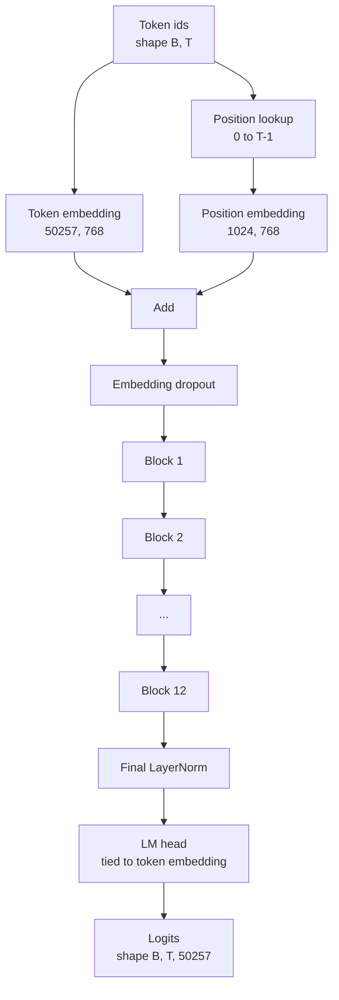
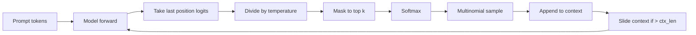

# 装配的GPT模型

> 两个块堆叠,一个代币嵌入,一个学习位置嵌入,一个最后的LayerNorm,和一个绑定语言模型头.这就是整个124万参数GPT模型.这个课程将这些块组建成一个工人阶级,计算参数以确认模型匹配参考124M形状,并生成多个数量样本,温度和顶-k的文本.

> **【中文解读】**本节是综合项目组装完整的GPT模型


**Type:** Build | **类型:** Build
**Languages:** Python | **语言:** Python
**Prerequisites:** Phase 19 lessons 30 to 34 | **前置知识:** Phase 19 lessons 30 to 34

>  前置轨B 6/20──组装完整的GPT模型──
>  12 层堆叠+代币 嵌入+学习位置嵌入+最终 LayerNorm+绑定 LM头 = 124M 参数 GPT。本课组装成可工作类,验证参数匹配参考 124M,用多项采样+温度+顶-k 生成文本。
**Time:** ~90 minutes | **时间:** ~90 minutes

## 学习目标

- 组装从第34课中转换器块成一个完整的GPT模型:代币嵌入,位置嵌入,N块,最终的LayerNorm,语言模型头.
  中文翻译:从第34课组装变压器块成一个完整的GPT模型:代币嵌入,位置嵌入,N块,最终的LayerNorm,语言模型头.
- 复制124万个参数配置:语音50257,文本1024,嵌入768,十二头,十二层.
  中文翻译:复制124万个参数配置:语音50257,文本1024 ,嵌入768,十二头,十二层.
- 绑定语言模型头重与代币嵌入,并解释为什么在这个规模中节省了380万参数.
  中文翻译:将语言模型头重量绑定到代币嵌入式,并解释为什么在这个规模上节省了380万参数.
- 通过多个个号码采样,温度扩展和顶级k缩小,通过滑动窗口保持语境长度,从提示中生成文本.
  中文翻译:从一个提示中生成文本,使用多个数量样本,温度缩小和顶部k缩小,并使用滑动窗口保持文本长度.
- 测量参数数和前进传输成本与124M目标相比.
  中文翻译:对124M目标进行测量参数数和前进通过成本.

## 问题问题

> **【中文解读】**变压器块本身做不到任何事.需要将代币ID 转为向量、混入位置信息、通过堆、投影回词汇表的记录.形状也很重要:参考GPT-2小是 124M参数,恰好对应词汇50257 * emb 768 +  1024 * 768 + 12个块 * ~7M/块。参数数不匹配参考是接线错误的信号.

> **【拓展：GPT 模型家族的参数规模】**GPT-2小 (124M) -> GPT-2中 (355M) -> GPT-2大 (774M) -> GPT-2 xl (1.5B) -> GPT-3 (175B) -> GPT-4 (估计1.8T 稀疏 MoE) ――LLaMA 系列走不同路线:LLaMA-1 (7B/13B/33B/65B)、LLaMA-2 (7B/13B/70B)、LLaMA-3 (8B/70B) ─7B 级别的模型可以在消费级GPU上运行,是学习和实验的理想尺寸──你需要将代币ID转化为向量,混合位置信息,运行它们通过堆,然后重新投射到词汇记录中. 遗忘了四个步骤中的任何一个,模型要么无法转发,要么可以转移到位置信息,要么不能说话.

模型的形状也很重要. 参考GPT-2小的参数是124百万参数, 数字不是魔法. 词汇50257乘以嵌入768是标志表. 位置1024乘以768是位置表. 两个大约700万参数的12个块,每个参数是8400万. 最后的头通过重量绑定重新使用标志表. 总算这些碎片,你就能达到124万. 建立一个参数数不符合参考的模型是你错误的信号.

> 模型的形状也很重要. 参考GPT-2小的参数是124百万参数, 数字不是魔法. 词汇50257乘以嵌入768是标志表. 位置1024乘以768是位置表. 两个大约700万参数的12个块,每个参数是8400万. 最后的头通过重量绑定重新使用标志表. 总算这些碎片,你就能达到124万. 建立一个参数数不符合参考的模型是你错误的信号.


## 概念的概念



标记ID成为标记向量. 位置ID成为位置向量. 两个被添加并通过堆发送. 最后的LayerNorm是每种现代变体中存活的块外的单块. LM头重复使用标记嵌入矩阵,这就是重量绑定的意思.

> 标志标志成为标志向量.


### 按重量

> **【中文解读】**标志 嵌入形状`(vocab, d_model)`头需要从`d_model`投影回`vocab`权值绑定意味着使用相同的参数量. 在语法中,该矩阵的38M参数.

符号嵌入有形状`(vocab, d_model)`语言模型头需要从`d_model`回到`vocab`它们是彼此的转体. 绑定两者意味着字面上相同的参数子,使用两次. 在词汇50257和d_model 768,矩阵是3800万参数. 解锁,你支付两次. 绑定,你支付一次,你也得到一个稍微更干净的梯度信号,因为嵌入和头部更新在一起.

> 符号嵌入有形状`(vocab, d_model)`语言模型头需要从`d_model`回到`vocab`它们是彼此的转体. 绑定两者意味着字面上相同的参数子,使用两次. 在词汇50257和d_model 768,矩阵是3800万参数. 解锁,你支付两次. 绑定,你支付一次,你也得到一个稍微更干净的梯度信号,因为嵌入和头部更新在一起.


### 位置嵌入是学习的,而不是鼻状

位置表是一个参数形状数`(1024, 768)`模型在每一个前进时都查找位置0到T-1,并添加了查找到代币嵌入.这是最简单的位置方案 (RoPE,ALiBi,T5相对偏差是替代方案) ,也是124M参考使用的.

> GPT-2 运输了学习的位置嵌入.


### 产量:温度,顶级,多项

> **【中文解读】**生成是自归的──每步取最后位置的逻辑,除了温度,可选地将除了顶-k 外的逻辑 掩码为负无穷,软max 得概率,从中采用一个代币──温度 接近零退化为贪心;顶-k=1是贪心;顶-k=40 过长尾──滑动窗口在超过上文长度时丢弃最古老的代币──

> **【拓展：高级采样策略】**生产 LLM 常用更精细的采样策略:(1) 顶点 (核心) 采样:选择累计概率达到p的最小代币集合,比顶点更自适应;(2) 极点采样:以最高概率代币为基准,只保留概率不低于其p倍的代币;(3) 重复惩罚:除以提示和历史中出现的代币的逻辑;(4) 上下文无关语法约束 约束 像JSON模式):通过逻辑掩码强制输出符合特定格式.

生成是自动降低的.在每一步,模型都会返回整个词汇中的 logits.你只会在最后一个位置,按温度划分,可选地把所有除了顶部k logits之外的 logits 掩盖到负无限,软max以获得概率,并从结果分布中取样一个代币.

> 世代是自行退化的.




热量接近零的温度崩到贪.温度一个匹配模型的自然分布.顶-k一个是贪.顶-k四十过长尾.组合重要;训练的下一个课程使用生成作为质量评估信号.

> 三个扣,三个不同的行为.


## 动手构建
```figure
cc-gpt-assembly
```

## 建立它

`code/main.py`执行:

- `class GPTConfig`数据类有124M默认的数据类: `vocab_size=50257`现在`context_length=1024`现在`d_model=768`现在`num_heads=12`现在`num_layers=12`现在`mlp_expansion=4`现在`dropout=0.1`现在`use_bias=True`现在`weight_tying=True`现在,我们要去.
  翻译: 中文`class GPTConfig`数据类有124M默认的数据类: `vocab_size=50257`现在`context_length=1024`现在`d_model=768`现在`num_heads=12`现在`num_layers=12`现在`mlp_expansion=4`现在`dropout=0.1`现在`use_bias=True`现在`weight_tying=True`现在,我们要去.
- `class GPTModel`置,置,置,置,置,12 `TransformerBlock`后期LayerNorm,以及一个`lm_head`标志的嵌入,当旗设置时.
  翻译: 中文`class GPTModel`置,置,置,置,置,12 `TransformerBlock`后期LayerNorm,以及一个`lm_head`标志的嵌入,当旗设置时.
- `count_parameters`帮助器返回唯一参数数数 (因此在数值中尊重重量绑定).
  中文翻译:A `count_parameters`帮助器返回唯一参数数数 (因此在数值中尊重重量绑定).
- `generate`函数是温度,顶级,多位数和滑窗环境的函数.
  中文翻译:A `generate`函数是温度,顶级,多位数和滑窗环境的函数.
- 模特的演示,在参考124M旁边打印参数数量,并从固定提示中生成一个短序列,以显示管道结束到结束.
  中文翻译:一个演示,它构建了模型,在参考124M旁边打印了参数数,并从固定提示中生成一个短序列,以显示管道结束到结束.

运行它:

```bash
python3 code/main.py
```

输出:124M引用旁边的参数数量,从随机提示生成的代币ID,以及确认LM头和代币嵌入时共享存储.

> 输出:124M引用旁边的参数数量,从随机提示生成的代币ID,以及确认LM头和代币嵌入时共享存储.


为了保持演示速度,脚本还运行了一个小的配置 (`d_model=64`现在`num_layers=2`设置124M配置,但仅使用参数数数和一个前进传输.

> 为了保持演示速度,脚本也运行了一个小的配置 (`d_model=64`现在`num_layers=2`设置124M配置,但仅使用参数数数和一个前进传输.


##  技术

- `torch`对于数数学,自行测量和模块管道.
  翻译: 中文`torch`对于数数学,自行测量和模块管道.
- `code/main.py`在本地重新实现了34课程的相同块模式.
  翻译: 中文`code/main.py`在本地重新实现了34课程的相同块模式.

## 野生生产模式

运行模型和运输模型的三个模式是不同的.

> 运行模型和运输模型的三个模式是不同的.


**Initialize the residual projections small.**输出注意力投影和MLP的第二线性都直接输入到残留添加中.初始化与其他线性差异相同的那些,产生了随深度增长的残留流,并将最终的LayerNorm推进到热态.`1 / sqrt(2 * num_layers)`对于这两个投影,残留流在12层内保持在正常范围.

**Cache the position id tensor, do not recompute.** `torch.arange(T)`分配一次.`__init__`对于最大的文本,每次调用每次切割第一个T条目,然后跳过分配器回路.

**Tie weights at parameter level, not just by copying.**设置`lm_head.weight = token_embedding.weight`优化器需要更新一个参数,自动格式图需要一个积累.如果你复制,头部从嵌入式中漂移,重量绑定你什么都不买.

## 用它使用方法

- 在本课程的模特类型与下课程的模特类型相同.
  中文翻译:本课中的模型课程与下课程的模样相同.
- 通过使用RoPE取代学习的位置, 您可以获得LLaMA家族,
  中文翻译:用RoPE取代学习的位置,就能让你成为LLaMA家族,而不需要触摸块或头部.
- 换取GELU用SiLU和LayerNorm用RMSNorm,你会得到LLaMA家族的其他变化.
  中文翻译:用SiLU取代GELU,用RMSNorm取代LayerNorm,让你得到了LLaMA家族的其他变化.
- 生成函数可以与任何logits源,不仅仅是这个模型.你可以在37课中从预训练的GPT-2文件中提取logits,并重复使用相同的生成循环.
  中文翻译:生成函数可以与任何logits源,不仅是这个模型工作.你可以在37课中从预训练的GPT-2文件中提取logits并重复使用相同的生成循环.

## 练习题

1. 解开LM头从代币嵌入和重新计算参数. 验证三角形是50257乘以768 = 3800万.
2. 修建时计算的状表取代了所学到的位置嵌入. 确认模型仍然前进,参数数数量下降了786,432.
3. 添加一个`greedy=True`确认测序是跨行的确定性.
4. 添加一个`repetition_penalty`在软max之前,将任何令牌的逻辑分为一个常数. 在固定提示上显示一个以上的值减少输出中重复数量.
5. 加入`top_p`核核核核核核核核核核核核核核核核核核核核核核核核核核核核核核核核核核核核核核核核核核核核核核核核核核核核核核核核核核核核核核核核核核核核核核核核核核核核核核核核核核核核核核核核核核核核核核核核核核核核核核核核核核核核核核核核核核核核核核核核核核核核核核核核核核核核核核核核核核核核核核核核核核核核核核核核核核核核核核核核核核核核核核核核核核核核核核核核核核核核核核核核核核核核核核核核核核核核核核核核核核核核核核核核核核核核核核核核核核核核核核核核核核核核核核核核核核核核核核核核核核核核核核核核核核核核核核核核核核核核核核核核核核核核核核核核核核核核核核核核核核核核核核核核核核核核核核核核核核核核核核核核核核核核核核核核核核核核核核核核核核核核核核核核核核核核核核核核核核核核核核核核核核核核核核核核核核核核核核核核核核核核核核核核核核核核核核核核核核核核核核核核核核核核核核核核核核核核核核核核核核核核核核核核核核核核核核核核核核核核核核核核核核核核核核核核核核核核核核核核核核核核核核核核核核核核核核核核核核核核核核核核核核核核核核核核核核核核核核核核核核核核核核核核核核核核核核核核核核核核核核核核核核核核核`top_k`两行检查,存储的代币概率的总和超过了`top_p`现在,我们要去.

## 关键词 关键词

| Term | What people say | What it actually means |
|------|-----------------|------------------------|
| Weight tying | "Tied embeddings" | The LM head and the token embedding share the same parameter tensor; saves vocab times d_model parameters and matches the GPT-2 reference |
| Position embedding | "Learned positions" | A separate table of shape (context length, d_model) added to token vectors; learned end to end |
| Sliding window context | "Context cap" | When the prompt plus generated tokens exceed the context length, drop the oldest tokens so the active window fits |
| Top-k sampling | "K truncation" | Keep the K logits with the highest values, mask the rest to negative infinity, softmax over the remainder |
| Temperature | "Sampling temperature" | Divide logits by T before softmax; T less than 1 sharpens, T equal to 1 keeps the natural distribution, T greater than 1 flattens |

## 继续阅读 继续阅读

- 阶段19课34为这个模型堆的区块.
  中文翻译:第19阶段课34为这个模型堆的区块.
- 阶段19课 36为训练循环,驱动这个模型,
  中文翻译:第19阶段课程36为训练循环,驱动这个模型与交叉缩损失.
- 阶段19课37用于将预训练的GPT-2重量装入这个结构中.
  中文翻译:第19阶段37课,用于将预训练的GPT-2重量装入这个精确的架构.
- 阶段7课07 (GPT因果语言建模) 来计算下一个代币预测.
  中文翻译:第7阶段课程07 (GPT因果语言建模) 来计算下一个代币预测.
- 第十阶段课时04 (预训练小GPT) 关于同一架构的原始培训程序.
  中文翻译:第10阶段课时04 (预训练迷你GPT) 为同一架构的原始训练程序.
