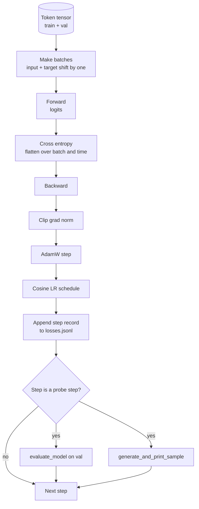

# 训练循环和评估

> 这一课构建了GPT模型驱动的训练循环:AdamW与体重衰减分,加热加密的学习速度时间表,一个`calc_loss_batch`助手,一个`evaluate_model`传递已保留的数据,`generate_and_print_sample`您可以绘制一个JSONL损失记录,同一个骨架训练你将打造的每一个解码器LLM.

> **【中文解读】**本节是综合项目 构建代理线束循环和契约验证系统.


**Type:** Build | **类型:** Build
**Languages:** Python | **语言:** Python
**Prerequisites:** Phase 19 lessons 30 to 35 | **前置知识:** Phase 19 lessons 30 to 35

>  前置轨B 7/20──基于30-35的完整GPT模型──
>  训练循环 = "会测量的循环"――不测量的循环=谎言的循环――AdamW(权重衰减拆分)+加热+化学习率+损失助手+保留集评估+每K 步定性样本+JSONL 日志――同一骨架训练所有未来要建造的解码器 LLM――
**Time:** ~90 minutes | **时间:** ~90 minutes

## 学习目标

- 建立一个训练循环,以计算了对象输入和目标对应的交叉输入损失.
  中文翻译:建立一个训练循环,以正确的输入和目标对齐计算交叉缩损失,以预测下一个代币.
- 配置AdamW以重量衰减应用于重量位器而不是LayerNorm或偏差位器.
  中文翻译:配置AdamW,使用重量缩应用于重量缩器而不是LayerNorm或偏差缩器.
- 实施一个以线性变暖和阴性衰变为基础的学习速度时间表,并随着时间的推移阅读结果的 LR.
  中文翻译:将线性加热和阴性衰变的学习速度安排实施,并随着时间的推移阅读结果的LR.
- 根据 经过的分离进行评估`evaluate_model`因此,测量损失可以在运行中比较.
  中文翻译: 评估一个长期的分开与 `evaluate_model`因此,测量损失可以在运行中比较.
- 通过每一个K步骤生成一个质量样本`generate_and_print_sample`损失曲线之前,
  中文翻译:每次K步骤都生成一个质量样本`generate_and_print_sample`损失曲线之前,
- 继续按步骤输入JSONL,以便您可以重新加载,绘制和将训练日志作为可交付的.
  中文翻译:按步骤输入JSONL,以便您可以重新加载,绘制和将训练日志作为可交付的货物运送.

## 问题问题

> **【中文解读】**只有印印失的训练脚本有三种失败模式: 1) 不能判断失败下降是不是因为正确原因; 2) 不能捕捉散发的早期信号; 3) 不能告诉你模型学到了什么; 3) 失败是标志,生成样本是段落.

> **【拓展：训练循环的工程实践】**尼尔 (Hoffmann et al., 2022) 的研究表明模型大小和训练数据量应等比例缩小.LLaMA-1 65B 在1.4T代币上训练(约20个时代),LLaMA-2 70B 在2T代币上训练。现代训练循环需要处理:梯度累积、混合精度、检查点保存/恢复、分布式数据并行、WandB/TensorBoard 集成──NVIDIA的Megatron-LM和微软的DeepSpeed是两个主要的生产训练级框架──它不能告诉你是否损失正在减少正确的原因 (模型可能超过训练集,永远不会学习). 它不能告诉你是否开始出现差距 (损失可能会增加一步,然后恢复,或者一步,然后崩). 它不能告诉模型所学到的东西 (损失是个尺度;生成的样本是个段落). 只有循环量度才能隐藏.

在本课程中,循环测量三个方法.每一步都会失去训练批次.每一步都会失去一个延长的批次.每一步都会产生一个固定的提示的延续.训练日志将降落在JSONL,所以文物是循环的证词.

> 训练日志落地在JSONL,所以文物是循环的证词. 训练日志落地在JSONL,所以文物是循环的证词.


## 概念的概念



两个不明显的部分是损失配线和亚当W衰变分.

> 没有明显的部分是损失配合和亚当W衰变分.


### 损失配线

如果输入批量是代币,`[t0, t1, t2, t3]`目标批量必须是`[t1, t2, t3, t4]`交叉体是平面的.`(batch * seq, vocab)`针对平面目标`(batch * seq,)`忘记转变,你训练模型来预测自己,而这种模式将会达到零损失,而学习什么都没有用.

> 如果输入批量是代币`[t0, t1, t2, t3]`目标批量必须是`[t1, t2, t3, t4]`交叉体是平面的.`(batch * seq, vocab)`针对平面目标`(batch * seq,)`忘记转变,你训练模型来预测自己,而这种模式将会达到零损失,而学习什么都没有用.


### 亚当W衰变分化

> **【中文解读】**权重减损正则化权重量量但不应作用于归化缩缩或偏置――对LayerNorm 缩减施加速度减减会缓慢驱动缩缩为零并破坏归化――标准分分分是:矩阵形张量 (线性权重、嵌入表)施加速度减,类缩或偏移的不施加速度减――

体重衰减调节了体重位数,但不是正常化尺度或偏差.在LayerNorm尺度上放下衰变,慢慢将尺度推到零,并打破正常化.在偏差上放下衰变是数学上无害的,但是浪费周期的.标准的分化是:矩阵形状的位数 (线性权重,嵌入表) 得到衰变,任何看起来像尺度或转移的东西都没有.

> 体重衰减会调整体重度,但不是正常化尺度或偏差.


### 热量加上位时间表

> **【中文解读】**升温将学习率从零线性升至目标值 (几百步),让优化器状态有时间充满.余弦衰退将学习率从目标值平滑降到零,最后阶段以小步长调调.

> **【拓展：学习率调度的实证研究】**拉马-1/2 使用余弦衰减,最终学习率为峰值的10%──米斯特拉尔-7B 使用余弦衰减到峰值的10%──Chinchilla论文对比多种调节,发现余弦调节在大规模训练中始终表现最佳──GPT-3 使用余弦调节配合375M代币的加热(总训练代币的0.2%)──加热太短会导致训练初步不稳定,太长则浪费计算──

升温将学习速度从零升到目标, 通过几百步, 随着可西因衰变,学习速度降到零, 结合是开放权力LLM培训中最常见的时间表,因为它消除了第一千步和最后一千步中的大部分脆弱时刻.

> 升温将学习速度从零升到目标, 通过几百步,


### 进行评估

`evaluate_model`运行从验证分区的固定数量的批次,积累损失,由批次数分,并返回.没有梯度.没有落后.数量可重复在运行给出相同的种子和相同的分区.报告训练损失旁边的延续损失是如何发现过度匹配.

> `evaluate_model`经验分期的批量是固定的,积累损失,按批量分数,并获得回报.


### 质量样本作为早期信号

训练损失下降的模型,但生成的样本都是一样的标志,被打破了.一个损失曲线看起来平坦的模型,但生成的样本变得变得一致的词汇是学习.质量探测器比阅读完整的曲线更快,并捕捉到度错过的模式.

> 一个模型的训练损失下降得很好,但其生成的样本都是一样的标志被打破.一个模型的损失曲线看起来平坦,但其生成的样本变得一致的词汇是学习.质量探测器比阅读完整的曲线更快,捕捉到度错过的模式.


## 动手构建
```figure
cap-training-loop
```

## 建立它

`code/main.py`执行:

- `make_batches(token_ids, batch_size, context_length)`通过将一个长代币子切成输入和目标对.
  翻译: 中文`make_batches(token_ids, batch_size, context_length)`通过将一个长代币子切成输入和目标对.
- `calc_loss_batch(model, inputs, targets)`它们可以向前,平坦化,并返回度交叉位.
  翻译: 中文`calc_loss_batch(model, inputs, targets)`它们可以向前,平坦化,并返回度交叉位.
- `evaluate_model(model, val_loader, max_batches)`没有级别的验证批次复制数量,返回平均损失.
  翻译: 中文`evaluate_model(model, val_loader, max_batches)`没有级别的验证批次复制数量,返回平均损失.
- `generate_and_print_sample(model, prompt, max_new_tokens)`通过固定提示运行课程35代函数,并打印结果.
  翻译: 中文`generate_and_print_sample(model, prompt, max_new_tokens)`通过固定提示运行课程35代函数,并打印结果.
- `build_param_groups(model, weight_decay)`产生了两个组的AdamW参数列表.
  翻译: 中文`build_param_groups(model, weight_decay)`产生了两个组的AdamW参数列表.
- `cosine_with_warmup(step, warmup_steps, total_steps, max_lr, min_lr)`返回一个步骤的 LR.
  翻译: 中文`cosine_with_warmup(step, warmup_steps, total_steps, max_lr, min_lr)`返回一个步骤的 LR.
- `train(...)`绕着它,持续着.`outputs/losses.jsonl`并且每次打印了评估损失和样本`eval_every`走路.
  翻译: 中文`train(...)`绕着它,持续着.`outputs/losses.jsonl`并且每次打印了评估损失和样本`eval_every`走路.
- 演示程序在一个小数量的步骤中训练一个小型模型,写一个JSONL日志,并在探测器点打印了评估损失和样本.演示程序在CPU上运行不到一分钟.
  中文翻译:一个演示,它在少数步骤中训练一个小型模型,写一个JSONL日志,并在探测点打印了评估损失和样本.演示在CPU上运行不到一分钟.

运行它:

```bash
python3 code/main.py
```

输出:每一步损失线,每次探测量损失,每次探测量步骤产生一个样本,最后一个`outputs/losses.jsonl`您可以加载`json.loads`按一线.

> 输出:每一步损失线,每次探测量损失的评估,每次探测量生成的样本,最后的输出/损失.


##  技术

- `torch`对于自动化,优化和模块.
  翻译: 中文`torch`对于自动化,优化和模块.
- `main.py`重新实现了第35课`GPTModel`支持模块在本地.
  翻译: 中文`main.py`重新实现了第35课`GPTModel`支持模块在本地.

## 野生生产模式

三个模式将课本循环变成一个可以一夜之间运行的东西.

> 三种模式将课本循环变成一个可以一夜之间运行的东西.


**Gradient norm clipping is non negotiable.**差的批量 (异常数据, LR ,数值边缘) 产生了巨大的梯度,`torch.nn.utils.clip_grad_norm_(params, max_norm=1.0)`之后`backward`在此之前`step`剪切值是一个自由参数;一个是大多数设置中存活的默认参数.

**Resumable JSONL logging, not pickled state.**按步骤损失记录`{"step": int, "train_loss": float, "lr": float}`在JSONL中,任何崩都会留下可读的文物,你可以抓住,你可以用三十个字符串绘制,你可以通过阅读最后一步恢复训练. 色状态将你绑定到生成文件的模块布局,这是在反因器中脆弱的.

**Eval batches drawn from a fixed slice.**验证代币在脚本开始时被切成批次,而不是在飞行时.可复制性取决于评估批次从运行到运行相同;否则,在两个运行之间比较评估损失量度了批次混动与模型一样.

## 用它使用方法

- 通过使用现实数据训练124M模型的同时,我们可以将合成代币数换为`datasets`路的运行方式是不变的.
  中文翻译:本课程的循环是训练124M模型的相同的骨架.`datasets`路的运行方式是不变的.
- 接下来的课程使用一个检查站来比较一个新训练的检查站和一个预训练的检查站.
  中文翻译:JSONL日志是将训练运行转化为证据的结果.下一个课程使用一个来比较一个新训练的检查站和一个预训练的检查站.
- 质量样本探测器是鱼的全部,
  中文翻译:质量样本探测器是取不到的东西.

## 练习题

1. 加入`weight_decay_groups()`确定尺度和偏差参数在不衰减组中降落,线性和嵌入式权重在衰减组中降落的单位测试.
2. 换取合成随机代币,用小文本文件的字节,使示范器运行可读的东西. 验证生成的样本使用文件中存在的字符.
3. 添加一个`min_lr`的10%`max_lr`现在,我们要把时间安排调整.
4. 每次都会有一个检查站.`eval_every`添加一个 `resume_from`标志重新加载模型状态和优化状态.
5. 记录损失旁边的每步吞吐量 (每秒代码) 并确认它保持在稳定的频段中.

## 关键词 关键词

| Term | What people say | What it actually means |
|------|-----------------|------------------------|
| Loss alignment | "Shift by one" | Input tokens at positions 0..T-1, target tokens at positions 1..T; cross entropy is computed on flattened shapes |
| Decay split | "Two groups" | AdamW receives matrix shaped tensors with weight decay and scale or bias tensors with none |
| Warmup | "Ramp" | The learning rate climbs from zero to its target over a fixed number of steps so the optimizer state can populate |
| Eval batches | "Held out batches" | A fixed slice of the validation token tensor, sliced once at script start, used identically every probe |
| Qualitative probe | "Sample print" | A short generation from a fixed prompt printed every K steps to catch failure modes loss alone hides |

## 继续阅读 继续阅读

- 循环驱动的模型的19阶段课程35
  中文翻译:循环驱动的模型的19阶段课35
- 阶段19课37用于将预训练的重量装入同一模型中.
  中文翻译:第19阶段37课,用于将预训练的重量装入同一模型中.
- 阶段10课04 (预训练小GPT) 对实数据程序.
  中文翻译:第10阶段课时04 (预训练迷你GPT) 对实数据的程序.
- 阶段10课10 (评估) 对于跨入体损失以外的更广泛的评估表面.
  中文翻译:第10阶段10课 (评估) 对于跨入体损失以外的更广泛的评估表面.
